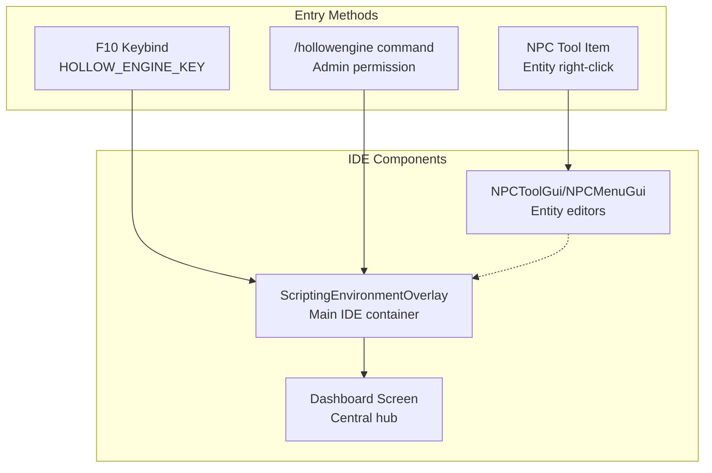
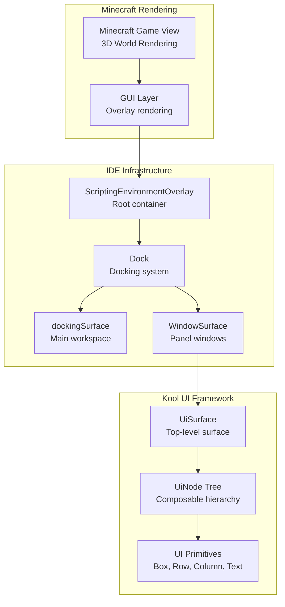
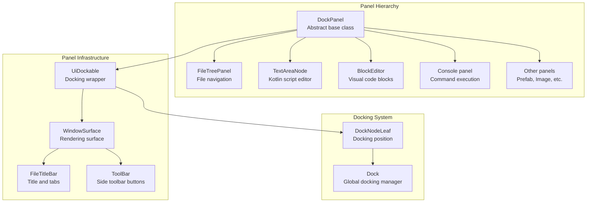
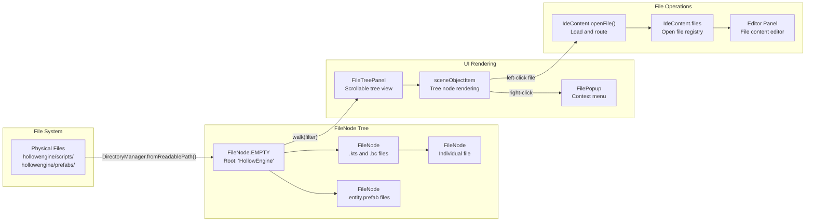
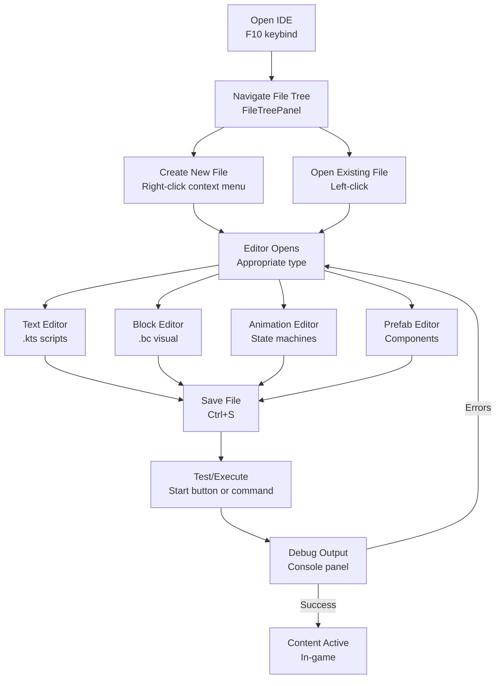
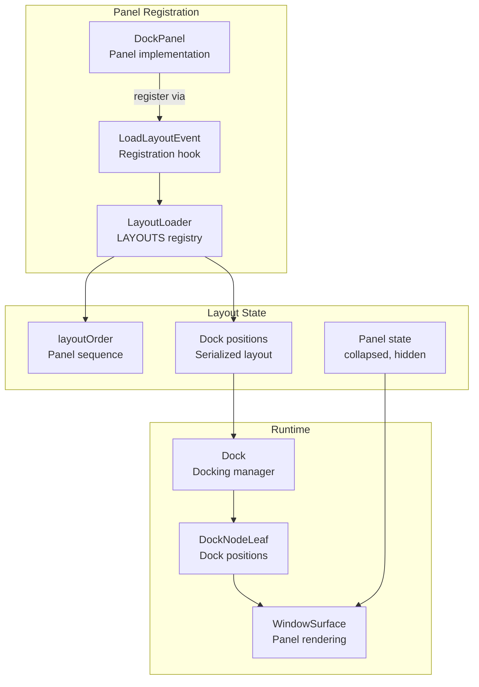

# In-Game IDE

<details>
<summary>Relevant source files</summary>

The following files were used as context for generating this wiki page:

- [src/main/java/ru/hollowhorizon/hollowengine/client/gui/scripting/FileNode.kt](src/main/java/ru/hollowhorizon/hollowengine/client/gui/scripting/FileNode.kt)
- [src/main/java/ru/hollowhorizon/hollowengine/client/gui/scripting/files/FilesBar.kt](src/main/java/ru/hollowhorizon/hollowengine/client/gui/scripting/files/FilesBar.kt)
- [src/main/java/ru/hollowhorizon/hollowengine/client/gui/scripting/panels/DockPanel.kt](src/main/java/ru/hollowhorizon/hollowengine/client/gui/scripting/panels/DockPanel.kt)
- [src/main/java/ru/hollowhorizon/hollowengine/client/gui/scripting/panels/FileTreePanel.kt](src/main/java/ru/hollowhorizon/hollowengine/client/gui/scripting/panels/FileTreePanel.kt)
- [src/main/java/ru/hollowhorizon/hollowengine/client/gui/scripting/tools/ToolWindow.kt](src/main/java/ru/hollowhorizon/hollowengine/client/gui/scripting/tools/ToolWindow.kt)
- [src/main/java/ru/hollowhorizon/hollowengine/client/keys/HollowEngineKeybinds.kt](src/main/java/ru/hollowhorizon/hollowengine/client/keys/HollowEngineKeybinds.kt)

</details>


The In-Game IDE is a comprehensive development environment built directly into Minecraft that allows content creators to write scripts, design visual code blocks, create animations, edit models, and manage game content without restarting the game. It provides a complete authoring workflow from file creation to execution, with live preview and hot-reloading capabilities.

This page provides an overview of the IDE's architecture, components, and usage patterns. For detailed information about specific subsystems, see:
- IDE architecture and overlay system: [IDE Overview and Architecture](#3.1)
- File tree and file operations: [File Management and Navigation](#3.2)
- Panel docking and layout: [Docking System](#3.3)
- Text script editing: [Text Script Editor](#4)
- Visual block programming: [Visual Block Editor](#5)
- Animation state machines: [Animation System](#8)

---

## Entry Points

The IDE can be accessed through three primary methods:

**F10 Keybind**: The most common entry point, mapped in `HOLLOW_ENGINE_KEY` which opens the main IDE dashboard.

**Console Commands**: The `/hollowengine` command provides access to IDE functions and can be used to trigger specific operations.

**NPC Tool Item**: Right-clicking entities with the NPC Tool item opens specialized editing interfaces for entity configuration.

Sources: [src/main/java/ru/hollowhorizon/hollowengine/client/keys/HollowEngineKeybinds.kt:13]()



---

## Architecture Overview

The IDE is implemented as an overlay system that renders on top of the Minecraft game view using the Kool UI framework. The main container is `ScriptingEnvironmentOverlay`, which manages the IDE lifecycle, docking system, and panel registry.

### ScriptingEnvironmentOverlay

`ScriptingEnvironmentOverlay` is the root container for the entire IDE. It:
- Manages the docking system (`Dock`) that organizes panels and editors
- Handles the title bar with menus (File, Windows)
- Tracks open files and their associated editors
- Provides coordinate space for floating and docked windows
- Integrates with Minecraft's rendering pipeline

### Kool UI Framework Integration

The IDE uses the Kool UI framework (`de.fabmax.kool.modules.ui2`) for all rendering. Key UI primitives include:
- `UiScope` - Composable UI builder scope
- `UiNode` - Node tree representing UI hierarchy
- `Modifier` - Styling and behavior attachment
- `UiDockable` - Dockable window wrapper
- `UiSurface` - Top-level rendering surface

Sources: [src/main/java/ru/hollowhorizon/hollowengine/client/gui/scripting/panels/DockPanel.kt:1-82]()



---

## Panel System

The IDE uses a panel-based architecture where each functional area (file tree, console, editors, etc.) is implemented as a `DockPanel`. Panels can be:
- Docked to specific positions in the layout
- Floated as independent windows
- Tabbed together with other panels
- Collapsed to save screen space
- Shown/hidden from the toolbar

### DockPanel Base Class

All IDE panels extend `DockPanel`, which provides:
- Lifecycle management (`open()`, `close()`)
- Docking integration via `UiDockable`
- Title bar with icon, name, and close button
- Collapse state tracking (`isCollapsed`)
- Toolbar visibility control (`showOnToolbar`)

The `compose()` method must be implemented to define panel content.

Sources: [src/main/java/ru/hollowhorizon/hollowengine/client/gui/scripting/panels/DockPanel.kt:14-82]()

### Panel Components

**FileTitleBar**: Renders the title bar for docked panels with:
- Icon from the panel's `icon` property
- Panel name (localized)
- Minimize/maximize button
- Close button (optional)
- Tab bar for multiple docked items

**ToolBar**: Side toolbar that displays buttons for all docked panels in a dock node, allowing quick switching between panels.

**WindowSurface**: Individual window surface for each panel, managing its rendering context and integration with the docking system.

Sources: 
- [src/main/java/ru/hollowhorizon/hollowengine/client/gui/scripting/files/FilesBar.kt:238-266]()
- [src/main/java/ru/hollowhorizon/hollowengine/client/gui/scripting/tools/ToolWindow.kt:16-32]()
- [src/main/java/ru/hollowhorizon/hollowengine/client/gui/scripting/panels/DockPanel.kt:46-70]()



---

## File Management System

The IDE's file management is built around a tree structure represented by `FileNode`, which mirrors the physical file system under the `hollowengine/` directory.

### FileNode Tree

`FileNode` represents a file or folder in the project hierarchy:
- `treeName` - Display name of the file/folder
- `treePath` - Relative path from project root
- `depth` - Nesting level in the tree
- `isFolder` - Whether this node represents a directory
- `children` - Child nodes (files/subfolders)
- `isExpanded` - Expansion state for folders
- `expandAnim` - Smooth animation state (0.0 to 1.0)

The tree supports:
- **Recursive walking**: `walk(filter)` returns all visible nodes matching a filter
- **Dynamic updates**: `update()` refreshes children from disk
- **Smooth animations**: Folder expansion/collapse with easing
- **Filtering**: `canShow(filter)` checks path and recursive children
- **Sorting**: Folders first, then alphabetical

Sources: [src/main/java/ru/hollowhorizon/hollowengine/client/gui/scripting/FileNode.kt:20-99]()

### File Tree Panel

`FileTreePanel` displays the `FileNode` tree in a scrollable view with:
- Search filter bar with icon
- Tree visualization with depth-based indentation
- Expand/collapse arrows for folders
- File type icons from `IconHelper.forPath()`
- Right-click context menu via `FilePopup`
- Single-click to open files in appropriate editor
- Double-click folders to expand/collapse

Opening a file:
1. Checks if file is already open in `IdeContent.files`
2. If not, calls `IdeContent.openFile()` with path and byte content
3. Routes to appropriate editor based on file extension
4. Brings existing editor to top if already open

Sources: 
- [src/main/java/ru/hollowhorizon/hollowengine/client/gui/scripting/panels/FileTreePanel.kt:13-48]()
- [src/main/java/ru/hollowhorizon/hollowengine/client/gui/scripting/FileNode.kt:152-266]()



---

## Tab and Title Bar System

When multiple files are open in the same dock node, a tabbed interface is displayed for navigation between them.

### FileDockingTabsBar

Renders a horizontal scrollable list of tabs when multiple `Dockable` items share a dock node:
- Only appears if `nodeCount > 1` (more than one item)
- Uses `LazyList` with horizontal scrolling
- Each tab shows the file name from `IdeContent.files`
- Left-click to bring tab to top
- Middle-click to close tab
- Right-click for context menu
- Drag tab to undock into floating window

Tab styling:
- Background color transitions on hover
- Border color highlights on hover
- Close button appears on each tab
- Active tab indicator (visual highlight)

Sources: [src/main/java/ru/hollowhorizon/hollowengine/client/gui/scripting/files/FilesBar.kt:113-236]()

### FileTitleBar

For single-panel or floating windows, displays a draggable title bar:
- Icon from panel's `icon` property
- File name or localized panel name
- Drag to move floating windows
- Drag to undock and create floating window
- Close button (if `onCloseAction` provided)
- Minimize/maximize button for collapse state

The title bar automatically switches between tab mode (multiple items) and bar mode (single item) based on the dock state.

Sources: [src/main/java/ru/hollowhorizon/hollowengine/client/gui/scripting/files/FilesBar.kt:238-367]()

| Component | Purpose | Key Properties |
|-----------|---------|----------------|
| `FileDockingTabsBar` | Horizontal tab list | `windowDockable`, `isDragToUndock`, `onCloseAction` |
| `FileTitleBar` | Single window title | `icon`, `isDraggable`, `showTabsIfDocked`, `minimizeButton` |
| `LazyList` | Horizontal scrolling | `isScrollByDrag`, `withHorizontalScrollbar`, `state` |
| `CloseButton` | Tab/window close | `background`, `foreground`, `onClick` |

---

## Directory Structure

The IDE organizes content in a standard directory hierarchy:

```
hollowengine/
├── scripts/          # Kotlin scripts (.kts) and code blocks (.bc)
├── prefabs/          # Entity and item definitions (.entity.prefab)
├── assets/
│   ├── models/       # 3D models (.gltf, .glb)
│   ├── animations/   # Animation controllers (.animation-controller.kts)
│   └── textures/     # Image files (.png)
└── lang/             # Localization files (en_us.json, ru_ru.json)
```

File types and their editors:
- `.kts` → Text Editor with Kotlin language services
- `.bc` → Visual Block Editor with drag-and-drop
- `.entity.prefab` → Prefab Editor with component system
- `.animation-controller.kts` → Animation Graph Editor
- `.png` → Image Editor for pixel manipulation
- `.json` → Language Editor for translations

Sources: [src/main/java/ru/hollowhorizon/hollowengine/client/gui/scripting/FileNode.kt:71-73]()

---

## Content Workflow

The typical content creation workflow in the IDE:



---

## Editor Integration

Each editor type integrates with the docking system as a panel:

**Text Editor** (`TextAreaNode`): Full-featured Kotlin script editor with syntax highlighting, code completion, diagnostics, and compiler integration. See [Text Script Editor](#4) for details.

**Block Editor** (`BlockEditor`): Visual programming interface with drag-and-drop blocks, connections, and graph serialization. See [Visual Block Editor](#5) for details.

**Animation Editor** (`GraphEditor`): State machine graph editor for animation controllers with nodes, transitions, and code generation. See [Animation System](#8) for details.

**Prefab Editor** (`PrefabEditorFile`): Component-based entity/item editor with property inspector and model preview. See [Prefab Editor](#11.1) for details.

**Image Editor** (`ImageFile`): Pixel-level texture editing with drawing tools. See [Image Editor](#11.2) for details.

**Console Panel**: Command execution and log viewing with suggestion provider. See [Console Panel](#11.4) for details.

All editors implement the `Composable` interface and extend or integrate with `DockPanel` to participate in the docking system.

---

## Layout Persistence

The IDE's layout (panel positions, sizes, dock configuration) is managed by `LayoutLoader`:
- `LayoutLoader.LAYOUTS` - Registry of all available panels
- `layoutOrder` - Determines panel ordering in toolbars
- Layout state is persisted across sessions
- Panels can be registered via `LoadLayoutEvent`

Each panel must be registered with a unique name key (e.g., `"hollowengine.gui.ide.project_tree"`) that is also used for localization.

Sources: [src/main/java/ru/hollowhorizon/hollowengine/client/gui/scripting/tools/ToolWindow.kt:27-29]()



---

## Summary

The In-Game IDE provides a complete development environment within Minecraft, built on the Kool UI framework with a flexible docking system. Key architectural elements include:

- **ScriptingEnvironmentOverlay**: Root container managing the entire IDE
- **DockPanel**: Base class for all IDE panels and editors
- **FileNode**: Tree structure mirroring the file system
- **Dock/UiDockable**: Docking system for panel management
- **FileTitleBar/FileDockingTabsBar**: Tab and window management
- **LayoutLoader**: Panel registry and layout persistence

Content creators can access the IDE via F10, navigate files through the tree panel, edit content in specialized editors (text, blocks, animations, prefabs), and test their work immediately without restarting the game. The docking system allows flexible workspace customization, with panels that can be docked, tabbed, floated, and collapsed as needed.

For implementation details of specific subsystems, refer to the child pages of this section ([3.1](#3.1) through [3.7](#3.7)).