# IDE Overview and Architecture

<details>
<summary>Relevant source files</summary>

The following files were used as context for generating this wiki page:

- [src/main/java/ru/hollowhorizon/hollowengine/client/gui/scripting/FileNode.kt](src/main/java/ru/hollowhorizon/hollowengine/client/gui/scripting/FileNode.kt)
- [src/main/java/ru/hollowhorizon/hollowengine/client/gui/scripting/files/FilesBar.kt](src/main/java/ru/hollowhorizon/hollowengine/client/gui/scripting/files/FilesBar.kt)
- [src/main/java/ru/hollowhorizon/hollowengine/client/gui/scripting/panels/DockPanel.kt](src/main/java/ru/hollowhorizon/hollowengine/client/gui/scripting/panels/DockPanel.kt)
- [src/main/java/ru/hollowhorizon/hollowengine/client/gui/scripting/panels/FileTreePanel.kt](src/main/java/ru/hollowhorizon/hollowengine/client/gui/scripting/panels/FileTreePanel.kt)
- [src/main/java/ru/hollowhorizon/hollowengine/client/gui/scripting/tools/ToolWindow.kt](src/main/java/ru/hollowhorizon/hollowengine/client/gui/scripting/tools/ToolWindow.kt)
- [src/main/java/ru/hollowhorizon/hollowengine/client/keys/HollowEngineKeybinds.kt](src/main/java/ru/hollowhorizon/hollowengine/client/keys/HollowEngineKeybinds.kt)

</details>


## Purpose and Scope

This document describes the architecture and core components of HollowEngine's in-game IDE system, centered around `ScriptingEnvironmentOverlay` and its integration with the Kool UI framework. The IDE provides a comprehensive content authoring environment that runs inside Minecraft, featuring a docking-based interface with multiple specialized editor panels, file management, and script execution controls.

The IDE is accessed via F10 keybind and renders as an overlay on top of the Minecraft game screen. All UI components are built using the Kool UI framework (`de.fabmax.kool.modules.ui2`), which provides a declarative, immediate-mode UI system with docking capabilities.

For details about specific editor implementations, see [Text Script Editor](#4), [Visual Block Editor](#5), and [Animation System](#8). For information about the docking system implementation, see [Docking System](#3.3). For panel creation and registration, see [Panel System](#3.5).

**Sources:** Diagram 1, Diagram 3 from high-level system architecture

---

## ScriptingEnvironmentOverlay Architecture

The IDE is centered around `ScriptingEnvironmentOverlay`, which serves as the root UI component and lifecycle manager. The overlay is built as a layered system on top of the Kool UI framework, consisting of five major architectural layers:

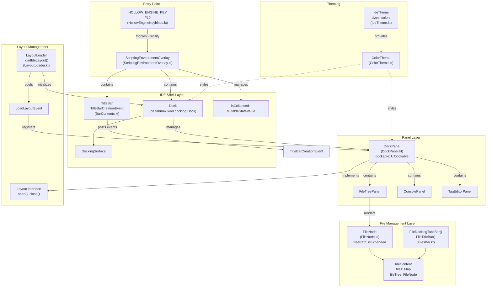

**Key Components:**

| Component | Type | Responsibility |
|-----------|------|----------------|
| `ScriptingEnvironmentOverlay` | Root Container | Lifecycle management, Kool scene hosting |
| `Dock` | Kool UI Component | Docking system, panel layout management |
| `DockPanel` | Abstract Base Class | Panel infrastructure, `UiDockable` wrapper |
| `FileNode` | Data Structure | File tree hierarchy with lazy loading |
| `IdeContent` | Singleton Registry | Open files, file tree root |
| `LayoutLoader` | Service | Panel registration, layout persistence |
| `IdeTheme` | Configuration | Sizes, colors, fonts |

**Sources:**
- [src/main/java/ru/hollowhorizon/hollowengine/client/keys/HollowEngineKeybinds.kt:13-24]()
- [src/main/java/ru/hollowhorizon/hollowengine/client/gui/scripting/FileNode.kt:20-36]()
- [src/main/java/ru/hollowhorizon/hollowengine/client/gui/scripting/panels/DockPanel.kt:14-22]()

---

## Kool UI Framework Integration

HollowEngine's IDE is built entirely on the Kool UI framework, a Kotlin-first immediate-mode UI library. Understanding the Kool integration is essential for working with the IDE codebase.

### UI Component Hierarchy

```mermaid
graph TB
    subgraph "Kool Framework (de.fabmax.kool)"
        KoolContext["KoolContext<br/>Rendering loop"]
        Scene["Scene<br/>3D scene graph"]
        UiSurface["UiSurface<br/>2D UI layer"]
        UiNode["UiNode<br/>Base UI element"]
        Modifier["Modifier<br/>Styling, layout, events"]
    end
    
    subgraph "Docking System (de.fabmax.kool.modules.ui2.docking)"
        Dock["Dock<br/>Root docking container"]
        DockingSurface["DockingSurface<br/>UiSurface for dockables"]
        UiDockable["UiDockable<br/>Dockable window wrapper"]
        DockNode["DockNode<br/>Docking position"]
        WindowSurface["WindowSurface<br/>Floating window surface"]
    end
    
    subgraph "HollowEngine IDE"
        ScriptingOverlay["ScriptingEnvironmentOverlay"]
        DockPanelClass["DockPanel<br/>(abstract base)"]
        FileTreePanel["FileTreePanel<br/>(concrete panel)"]
    end
    
    KoolContext --> Scene
    Scene --> UiSurface
    UiSurface --> UiNode
    UiNode --> Modifier
    
    Dock --> DockingSurface
    DockingSurface --|"is a"| UiSurface
    Dock --> DockNode
    UiDockable --> WindowSurface
    WindowSurface --|"is a"| UiSurface
    
    ScriptingOverlay --> Dock
    DockPanelClass --> UiDockable
    FileTreePanel --|"extends"| DockPanelClass
```

### Composable Functions

The IDE uses Kool's declarative composable API. Each UI component is defined through composable functions that are re-evaluated when their dependencies change:

```kotlin
// Example from FileTreePanel.kt
override fun UiScope.compose() {
    Column(Grow.Std, Grow.Std) {
        modifier.margin(Dimensions.PaddingNormal)
               .background(RoundRectBackground(...))
        
        Row(Grow.Std) {
            // Search box UI
        }
        
        IdeContent.fileTree.apply {
            draw(filter.use())  // Reacts to filter state changes
        }
    }
}
```

Key Kool UI concepts used throughout the IDE:

| Concept | Description | Example in Codebase |
|---------|-------------|---------------------|
| `UiScope` | Context for building UI | All `compose()` methods receive `UiScope` |
| `Modifier` | Chainable styling/layout | `modifier.margin(...).padding(...).onClick(...)` [src/main/java/ru/hollowhorizon/hollowengine/client/gui/scripting/panels/FileTreePanel.kt:20-21]() |
| `MutableStateValue<T>` | Reactive state | `isExpanded` in `FileNode` [src/main/java/ru/hollowhorizon/hollowengine/client/gui/scripting/FileNode.kt:26]() |
| `remember {}` | Persistent state across recompositions | `remember { TooltipState(0.5) }` [src/main/java/ru/hollowhorizon/hollowengine/client/gui/scripting/tools/ToolWindow.kt:57]() |
| `LaunchedEffect` | Side effects with lifecycle | Icon crossfade animation [src/main/java/ru/hollowhorizon/hollowengine/client/gui/scripting/FileNode.kt:222-234]() |
| `AnimatableFloat` | Animated float value | `expandAnim` for folder expansion [src/main/java/ru/hollowhorizon/hollowengine/client/gui/scripting/FileNode.kt:29]() |

### State Management

Kool uses a reactive state system where UI components automatically update when state changes:

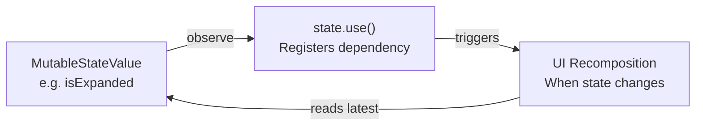

Example from [src/main/java/ru/hollowhorizon/hollowengine/client/gui/scripting/FileNode.kt:172]():
```kotlin
modifier.background(TreeBackgroundRenderer(item.isExpanded.use() && i == item.depth - 1))
```

The `.use()` call registers the current composable as a dependency on `isExpanded`. When `isExpanded.set(newValue)` is called, the UI automatically recomposes.

**Sources:**
- [src/main/java/ru/hollowhorizon/hollowengine/client/gui/scripting/panels/FileTreePanel.kt:17-46]()
- [src/main/java/ru/hollowhorizon/hollowengine/client/gui/scripting/FileNode.kt:26-29]()
- [src/main/java/ru/hollowhorizon/hollowengine/client/gui/scripting/tools/ToolWindow.kt:57]()
- [src/main/java/ru/hollowhorizon/hollowengine/client/gui/scripting/FileNode.kt:222-234]()
- [src/main/java/ru/hollowhorizon/hollowengine/client/gui/scripting/FileNode.kt:172]()

---

## IDE Shell Components

The shell layer provides the foundational UI framework and global controls:

### TitleBar

The title bar is constructed via event-driven composition using `TitleBarCreationEvent`:

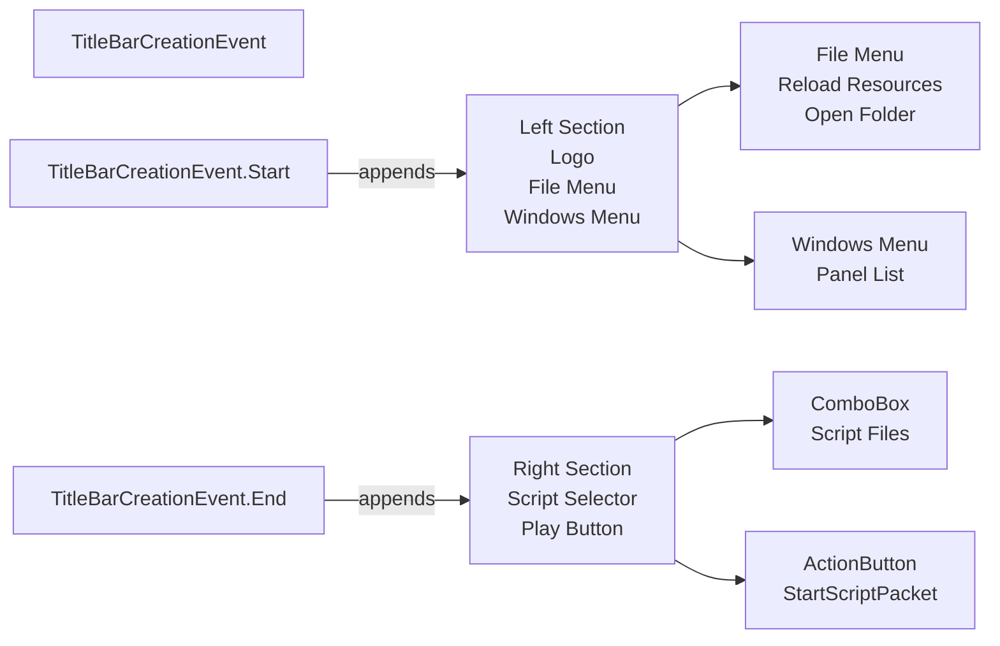

The title bar is composed of two sections defined by event handlers:

- **Left section** (`leftBarContents` function at [src/main/java/ru/hollowhorizon/hollowengine/client/gui/scripting/titlebar/BarContents.kt:40-80]()): Contains the HollowEngine logo and menu buttons
- **Right section** (`rightBarContents` function at [src/main/java/ru/hollowhorizon/hollowengine/client/gui/scripting/titlebar/BarContents.kt:118-162]()): Contains script selector dropdown and execution button

The logo serves as a toggle to collapse/expand the entire IDE via `ScriptingEnvironmentOverlay.isCollapsed` [src/main/java/ru/hollowhorizon/hollowengine/client/gui/scripting/titlebar/BarContents.kt:87]().

**Sources:**
- [src/main/java/ru/hollowhorizon/hollowengine/client/gui/scripting/titlebar/BarContents.kt:40-162]()

### Keybind System

The IDE is opened using the F10 key, defined in `HOLLOW_ENGINE_KEY`:

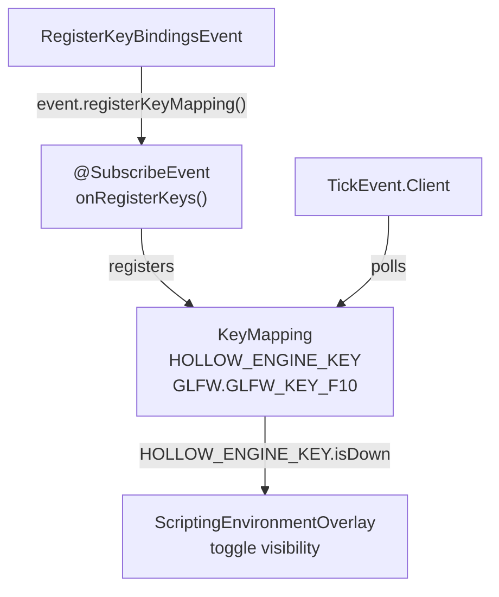

The keybind is registered at [src/main/java/ru/hollowhorizon/hollowengine/client/keys/HollowEngineKeybinds.kt:15-18]() and monitored in the client tick handler at [src/main/java/ru/hollowhorizon/hollowengine/client/keys/HollowEngineKeybinds.kt:20-24](). When pressed, it toggles the visibility of `ScriptingEnvironmentOverlay`.

**Sources:**
- [src/main/java/ru/hollowhorizon/hollowengine/client/keys/HollowEngineKeybinds.kt:13-24]()

### Dock System

The docking system is provided by `de.fabmax.kool.modules.ui2.docking.Dock` and manages panel placement, resizing, and tabbed interfaces. The `Dock` instance is created and managed by `ScriptingEnvironmentOverlay`.

**Docking Concepts:**

| Class | Responsibility |
|-------|----------------|
| `Dock` | Root docking container managing all dockable items |
| `UiDockable` | Wrapper that makes a UI component dockable |
| `DockNode` | Represents a docking position (leaf or split) |
| `DockNodeLeaf` | Leaf node containing one or more tabbed dockables |
| `DockingSurface` | UiSurface that renders the docking UI |
| `WindowSurface` | UiSurface for floating (undocked) windows |

Each `DockPanel` in HollowEngine creates a `UiDockable` at [src/main/java/ru/hollowhorizon/hollowengine/client/gui/scripting/panels/DockPanel.kt:15]() which can be docked into the `Dock` system. The docking layout is persisted via `DockLayout.saveLayout()` and restored via `DockLayout.loadLayout()`.

**Sources:**
- [src/main/java/ru/hollowhorizon/hollowengine/client/gui/scripting/panels/DockPanel.kt:15]()
- Diagram 4 from high-level system architecture

---

## File Management System

The file management layer bridges the file system with the IDE's UI components:

```mermaid
graph TB
    subgraph "File System"
        RealFiles["hollowengine/<br/>Directory Structure"]
    end
    
    subgraph "Abstraction Layer"
        FileNode["FileNode<br/>treeName: String<br/>treePath: String<br/>depth: Int"]
        FileData["FileData<br/>(abstract)"]
        ScriptFile["ScriptFile"]
        CodeBlocksFile["CodeBlocksFile"]
        AnimControllerFile["AnimControllerFile"]
        ImageFile["ImageFile"]
    end
    
    subgraph "UI Components"
        FileTreePanel["FileTreePanel<br/>draw() method"]
        FilesBar["FilesBar<br/>FileDockingTabsBar()"]
        FileTitleBar["FileTitleBar<br/>Shows file icon/name"]
    end
    
    subgraph "Central Registry"
        IdeContent["IdeContent<br/>files: Map<String, FileData><br/>fileTree: FileNode"]
    end
    
    RealFiles -->|"reads"| FileNode
    FileNode -->|"tree structure"| IdeContent
    FileData --> IdeContent
    
    FileData <|-- ScriptFile
    FileData <|-- CodeBlocksFile
    FileData <|-- AnimControllerFile
    FileData <|-- ImageFile
    
    IdeContent --> FileTreePanel
    IdeContent --> FilesBar
    IdeContent --> FileTitleBar
```

### FileNode

`FileNode` represents a hierarchical file tree with lazy loading and expand/collapse animations. It is a serializable data structure that maps to the file system:

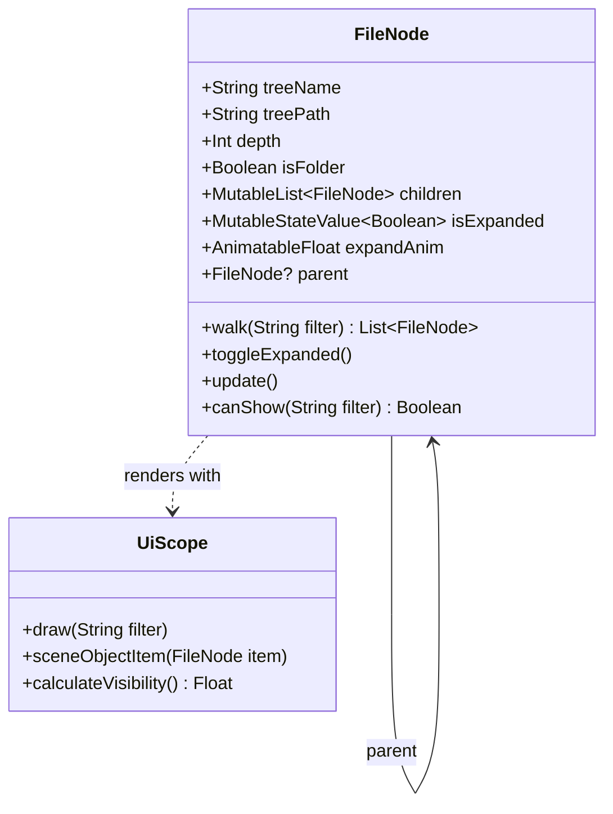

| Property | Type | Description |
|----------|------|-------------|
| `treeName` | `String` | Display name of the file/folder |
| `treePath` | `String` | Full path from root (e.g., "scripts/example.kt") |
| `depth` | `Int` | Nesting level for indentation |
| `isFolder` | `Boolean` | Whether this is a directory |
| `children` | `MutableList<FileNode>` | Child nodes |
| `isExpanded` | `MutableStateValue<Boolean>` | Expansion state (reactive) |
| `expandAnim` | `AnimatableFloat` | Smooth expand/collapse animation (0f to 1f) |
| `parent` | `FileNode?` | Parent node reference |

Key methods:
- `walk(filter: String)`: Returns visible nodes based on filter and expansion state [src/main/java/ru/hollowhorizon/hollowengine/client/gui/scripting/FileNode.kt:38-46]()
- `toggleExpanded()`: Animates expansion over 0.3s using `Easing.easeOutQuart` [src/main/java/ru/hollowhorizon/hollowengine/client/gui/scripting/FileNode.kt:54-69]()
- `update()`: Refreshes children from file system using `DirectoryManager.fromReadablePath()` [src/main/java/ru/hollowhorizon/hollowengine/client/gui/scripting/FileNode.kt:71-93]()
- `UiScope.draw(filter: String)`: Renders the tree using Kool UI composables [src/main/java/ru/hollowhorizon/hollowengine/client/gui/scripting/FileNode.kt:112-150]()

The tree rendering uses `AccordionColumnLayout` at [src/main/java/ru/hollowhorizon/hollowengine/client/gui/scripting/FileNode.kt:273-282]() to animate height changes during expand/collapse transitions. Visibility is calculated recursively through parent chain at [src/main/java/ru/hollowhorizon/hollowengine/client/gui/scripting/FileNode.kt:101-110]().

**Sources:**
- [src/main/java/ru/hollowhorizon/hollowengine/client/gui/scripting/FileNode.kt:20-100]()
- [src/main/java/ru/hollowhorizon/hollowengine/client/gui/scripting/FileNode.kt:112-150]()
- [src/main/java/ru/hollowhorizon/hollowengine/client/gui/scripting/FileNode.kt:273-282]()
- [src/main/java/ru/hollowhorizon/hollowengine/client/gui/scripting/FileNode.kt:101-110]()

### IdeContent

`IdeContent` is the central registry managing open files. It maintains:

- **`files: Map<String, FileData>`**: Map from file path to `FileData` instance
- **`fileTree: FileNode`**: Root node of the file tree hierarchy

When a file is opened via `IdeContent.openFile()`, it creates the appropriate `FileData` subclass based on file extension and registers it in the `files` map.

**Sources:**
- [src/main/java/ru/hollowhorizon/hollowengine/client/gui/scripting/FileNode.kt:188-196]()
- [src/main/java/ru/hollowhorizon/hollowengine/client/gui/scripting/files/FilesBar.kt:163]()
- [src/main/java/ru/hollowhorizon/hollowengine/client/gui/scripting/panels/FileTreePanel.kt:43-45]()

### FilesBar and Tabs

The `FilesBar` component displays tabs for open files within docked panels. It consists of two main composable functions:

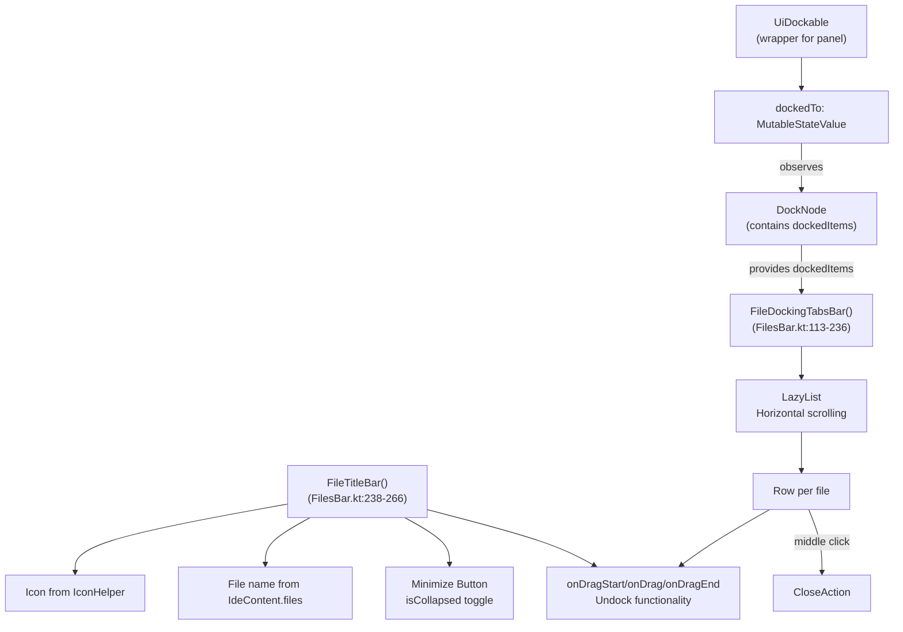

**`FileDockingTabsBar()`** function at [src/main/java/ru/hollowhorizon/hollowengine/client/gui/scripting/files/FilesBar.kt:113-236]() renders:
- Horizontal scrollable list of tabs using custom `LazyList` implementation [src/main/java/ru/hollowhorizon/hollowengine/client/gui/scripting/files/FilesBar.kt:126-136]()
- Tab drag-to-undock functionality [src/main/java/ru/hollowhorizon/hollowengine/client/gui/scripting/files/FilesBar.kt:171-213]()
- Middle-click to close [src/main/java/ru/hollowhorizon/hollowengine/client/gui/scripting/files/FilesBar.kt:146-148]()
- Visual highlighting for active tab using `animateFloatAsState` [src/main/java/ru/hollowhorizon/hollowengine/client/gui/scripting/files/FilesBar.kt:140]()

**`FileTitleBar()`** function at [src/main/java/ru/hollowhorizon/hollowengine/client/gui/scripting/files/FilesBar.kt:238-266]() provides:
- File icon display using `Image()` composable [src/main/java/ru/hollowhorizon/hollowengine/client/gui/scripting/files/FilesBar.kt:309-312]()
- File name from `IdeContent.files` [src/main/java/ru/hollowhorizon/hollowengine/client/gui/scripting/files/FilesBar.kt:314-315]()
- Minimize/maximize button [src/main/java/ru/hollowhorizon/hollowengine/client/gui/scripting/files/FilesBar.kt:352-365]()
- Drag-to-move functionality via `registerDragCallbacks()` [src/main/java/ru/hollowhorizon/hollowengine/client/gui/scripting/files/FilesBar.kt:303-306]()

The `LazyList` implementation at [src/main/java/ru/hollowhorizon/hollowengine/client/gui/scripting/files/FilesBar.kt:23-111]() provides custom horizontal scrolling with wheel support that differs from Kool's built-in `LazyList` to support both horizontal and vertical scrolling.

**Sources:**
- [src/main/java/ru/hollowhorizon/hollowengine/client/gui/scripting/files/FilesBar.kt:113-364]()
- [src/main/java/ru/hollowhorizon/hollowengine/client/gui/scripting/files/FilesBar.kt:23-111]()

---

## Panel System Architecture

All IDE panels inherit from the abstract `DockPanel` base class:

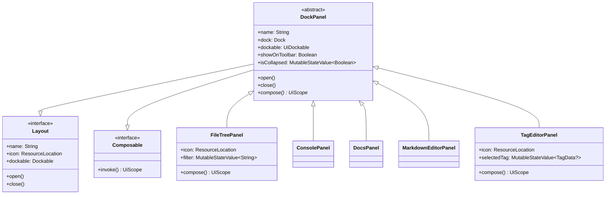

### DockPanel Base Class

`DockPanel` provides common infrastructure for all IDE panels. It implements both `Layout` and `Composable` interfaces:

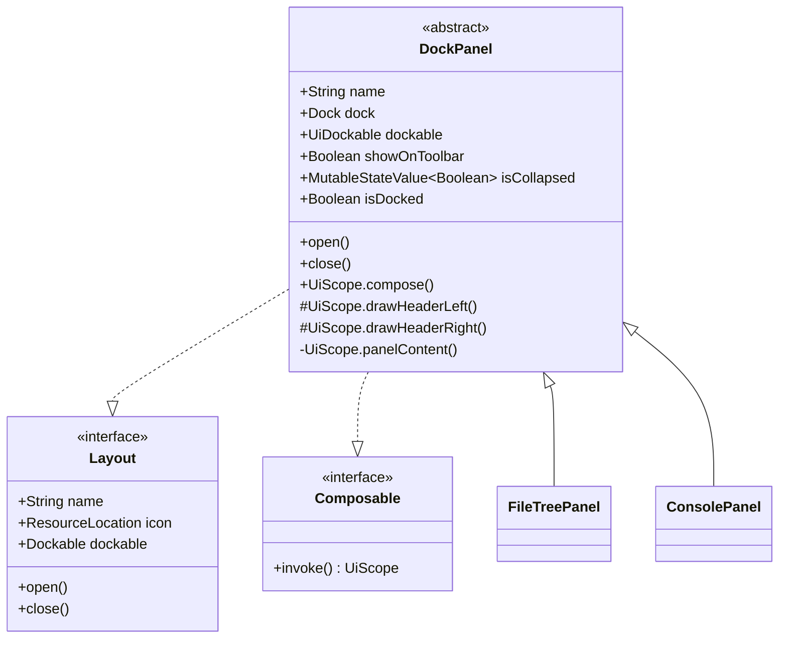

| Member | Type | Description |
|--------|------|-------------|
| `name` | `String` | Localization key for panel title |
| `dock` | `Dock` | Reference to parent docking system |
| `dockable` | `UiDockable` | Dockable instance for this panel |
| `showOnToolbar` | `Boolean` | Whether to show in sidebar toolbar |
| `isCollapsed` | `MutableStateValue<Boolean>` | Minimize/maximize state |
| `isDocked` | `Boolean` (computed) | Whether currently docked |

The `open()` method at [src/main/java/ru/hollowhorizon/hollowengine/client/gui/scripting/panels/DockPanel.kt:38-70]() creates a `WindowSurface` with:
- Default floating position and size [src/main/java/ru/hollowhorizon/hollowengine/client/gui/scripting/panels/DockPanel.kt:41-44]()
- `FileTitleBar` with minimize button [src/main/java/ru/hollowhorizon/hollowengine/client/gui/scripting/panels/DockPanel.kt:26-33]()
- Optional `ToolBar` for docked state [src/main/java/ru/hollowhorizon/hollowengine/client/gui/scripting/panels/DockPanel.kt:53-65]()
- Panel content via abstract `compose()` method [src/main/java/ru/hollowhorizon/hollowengine/client/gui/scripting/panels/DockPanel.kt:34]()

The `close()` method at [src/main/java/ru/hollowhorizon/hollowengine/client/gui/scripting/panels/DockPanel.kt:72-78]() removes the panel's surface from the dock and releases it after a 1-frame delay.

**Sources:**
- [src/main/java/ru/hollowhorizon/hollowengine/client/gui/scripting/panels/DockPanel.kt:14-82]()

### Panel Registration

Panels are registered through the `LoadLayoutEvent` system:

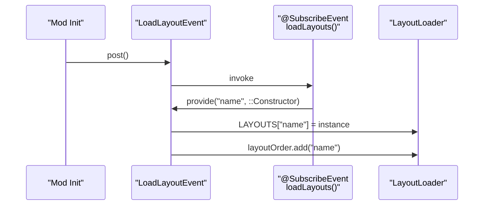

The `loadLayouts` function at [src/main/java/ru/hollowhorizon/hollowengine/client/gui/scripting/docking/IdeLayouts.kt:7-13]() registers:

- `"hollowengine.gui.ide.project_tree"` → `FileTreePanel`
- `"hollowengine.gui.ide.console"` → `ConsolePanel`
- `"hollowengine.gui.ide.docs"` → `DocsPanel`
- `"hollowengine.gui.ide.markdown"` → `MarkdownEditorPanel`
- `"hollowengine.gui.ide.tags"` → `TagEditorPanel`

**Sources:**
- [src/main/java/ru/hollowhorizon/hollowengine/client/gui/scripting/docking/IdeLayouts.kt:6-13]()
- [src/main/java/ru/hollowhorizon/hollowengine/client/gui/scripting/docking/LayoutLoader.kt:19-33]()

### Toolbar System

When panels are docked to the left or right edges, a `ToolBar` appears showing icon buttons for all docked panels:

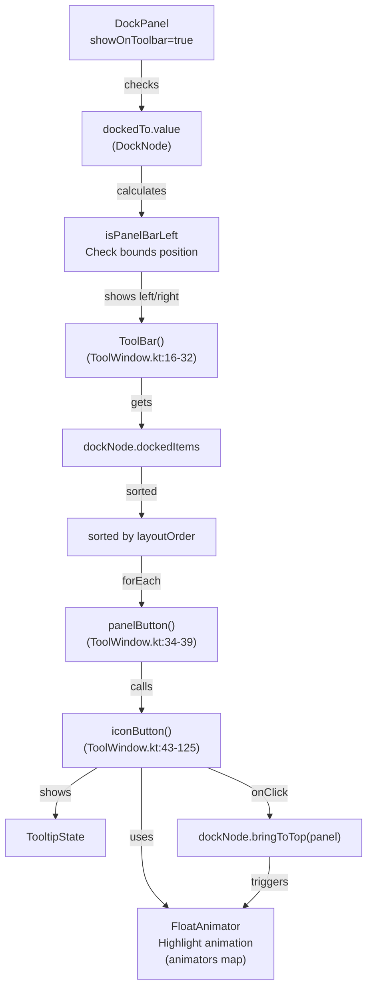

The toolbar is rendered by `ToolBar()` function at [src/main/java/ru/hollowhorizon/hollowengine/client/gui/scripting/tools/ToolWindow.kt:16-32](), which:
1. Retrieves all docked items from the `DockNode` [src/main/java/ru/hollowhorizon/hollowengine/client/gui/scripting/tools/ToolWindow.kt:22-23]()
2. Sorts them by `layoutOrder` [src/main/java/ru/hollowhorizon/hollowengine/client/gui/scripting/tools/ToolWindow.kt:23]()
3. Creates an `iconButton` for each with animated highlight when active [src/main/java/ru/hollowhorizon/hollowengine/client/gui/scripting/tools/ToolWindow.kt:43-125]()

The `FloatAnimator` at [src/main/java/ru/hollowhorizon/hollowengine/client/gui/scripting/tools/ToolWindow.kt:41]() maintains a per-panel animation state that highlights the active panel with a colored indicator on the toolbar's left or right edge [src/main/java/ru/hollowhorizon/hollowengine/client/gui/scripting/tools/ToolWindow.kt:60-68]().

The toolbar position (left or right) is determined by checking if the panel is docked to the left edge at [src/main/java/ru/hollowhorizon/hollowengine/client/gui/scripting/panels/DockPanel.kt:54-55]().

**Sources:**
- [src/main/java/ru/hollowhorizon/hollowengine/client/gui/scripting/tools/ToolWindow.kt:16-125]()
- [src/main/java/ru/hollowhorizon/hollowengine/client/gui/scripting/tools/ToolWindow.kt:41]()
- [src/main/java/ru/hollowhorizon/hollowengine/client/gui/scripting/panels/DockPanel.kt:53-65]()

---

## Shared Services

### LayoutLoader

`LayoutLoader` manages layout persistence and restoration across sessions:

| Member | Type | Description |
|--------|------|-------------|
| `IDE_LAYOUT` | `String` | Storage key: "hollowengine.ide.layout" |
| `TOOL_LAYOUT` | `String` | Storage key: "hollowengine.tool.layout" |
| `layoutOrder` | `LinkedHashSet<String>` | Ordered list of panel names |
| `LAYOUTS` | `HashMap<String, Layout>` | Map of panel name to instance |

The `loadIdeLayout()` method at [src/main/java/ru/hollowhorizon/hollowengine/client/gui/scripting/docking/LayoutLoader.kt:19-34]():
1. Posts `LoadLayoutEvent` to gather panel registrations
2. Defines layout loader function that handles both script files and panels [src/main/java/ru/hollowhorizon/hollowengine/client/gui/scripting/docking/LayoutLoader.kt:24-30]()
3. Calls `DockLayout.loadLayout()` to restore previous session layout from `KeyValueStore`

**Sources:**
- [src/main/java/ru/hollowhorizon/hollowengine/client/gui/scripting/docking/LayoutLoader.kt:12-41]()

### IdeTheme

`IdeTheme` defines global styling through `Sizes` and `Colors` instances:

```kotlin
val sizes = Sizes.large.copy(
    normalText = MsdfFont(ColorTheme.Fonts.MONOCRAFT, Dimensions.FontNormal),
    smallText = MsdfFont(ColorTheme.Fonts.MONOCRAFT, Dimensions.FontSmall),
    largeText = MsdfFont(ColorTheme.Fonts.MONOCRAFT, Dimensions.FontLarge),
    borderWidth = Dp.roundToWholePx(1.5f)
)
var colors = Colors.darkColors()
```

The `loadFont()` function at [src/main/java/ru/hollowhorizon/hollowengine/client/gui/scripting/theme/IdeTheme.kt:30-42]() loads MSDF (Multi-channel Signed Distance Field) fonts from resources, which provide crisp text rendering at any scale.

**Sources:**
- [src/main/java/ru/hollowhorizon/hollowengine/client/gui/scripting/theme/IdeTheme.kt:19-42]()

---

## Initialization Flow

The IDE initializes through a coordinated sequence starting from keybind detection:

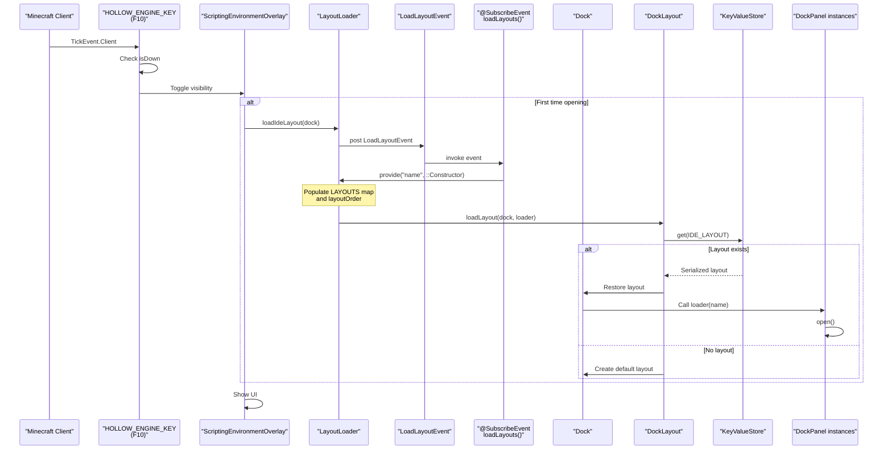

**Key Steps:**

1. **Keybind Detection**: `TickEvent.Client` handler at [src/main/java/ru/hollowhorizon/hollowengine/client/keys/HollowEngineKeybinds.kt:20-24]() monitors F10 key state
2. **Overlay Toggle**: When pressed, toggles `ScriptingEnvironmentOverlay` visibility
3. **Layout Loading**: On first open, `LayoutLoader.loadIdeLayout()` at [src/main/java/ru/hollowhorizon/hollowengine/client/gui/scripting/docking/LayoutLoader.kt:19-34]() posts `LoadLayoutEvent`
4. **Panel Registration**: Event handlers register panels in `LAYOUTS` map at [src/main/java/ru/hollowhorizon/hollowengine/client/gui/scripting/docking/LayoutLoader.kt:26]()
5. **Layout Restoration**: `DockLayout.loadLayout()` reads from `KeyValueStore` using key `IDE_LAYOUT` at [src/main/java/ru/hollowhorizon/hollowengine/client/gui/scripting/docking/LayoutLoader.kt:31]()
6. **Panel Creation**: Each panel's `open()` method creates its `WindowSurface` at [src/main/java/ru/hollowhorizon/hollowengine/client/gui/scripting/panels/DockPanel.kt:38-70]()

The loader function at [src/main/java/ru/hollowhorizon/hollowengine/client/gui/scripting/docking/LayoutLoader.kt:24-30]() handles two cases:
- If name starts with a file path separator, it creates a file-based dockable
- Otherwise, it looks up the panel in `LAYOUTS` map and calls its `open()` method

**Sources:**
- [src/main/java/ru/hollowhorizon/hollowengine/client/keys/HollowEngineKeybinds.kt:20-24]()
- [src/main/java/ru/hollowhorizon/hollowengine/client/gui/scripting/docking/LayoutLoader.kt:19-34]()
- [src/main/java/ru/hollowhorizon/hollowengine/client/gui/scripting/panels/DockPanel.kt:38-70]()

---

## IDE Components Summary

The following table summarizes the key components and their locations:

| Component | File | Primary Responsibility |
|-----------|------|------------------------|
| `ScriptingEnvironmentOverlay` | ScriptingEnvironmentOverlay.kt | Root IDE container, lifecycle management |
| `HOLLOW_ENGINE_KEY` | HollowEngineKeybinds.kt:13 | F10 keybind definition |
| `FileNode` | FileNode.kt:21-271 | File tree hierarchy with animations |
| `FileDockingTabsBar()` | FilesBar.kt:113-236 | Tab bar for open files |
| `FileTitleBar()` | FilesBar.kt:238-366 | Title bar with icon, name, minimize button |
| `DockPanel` | DockPanel.kt:14-82 | Abstract base class for all panels |
| `FileTreePanel` | FileTreePanel.kt:13-48 | File browser panel implementation |
| `ToolBar()` | ToolWindow.kt:16-32 | Sidebar toolbar for docked panels |
| `iconButton()` | ToolWindow.kt:43-125 | Individual toolbar button with animation |
| `LayoutLoader` | LayoutLoader.kt:12-41 | Panel registration and layout persistence |
| `LoadLayoutEvent` | LoadLayoutEvent.kt | Event for panel registration |
| `IdeTheme` | IdeTheme.kt:19-42 | Global styling, fonts, colors |
| `IdeContent` | Referenced throughout | Central registry for open files |
| `AccordionColumnLayout` | FileNode.kt:273-282 | Custom layout for animated expansion |
| `LazyList()` | FilesBar.kt:23-111 | Custom horizontal scrolling component |

**Sources:**
- [src/main/java/ru/hollowhorizon/hollowengine/client/keys/HollowEngineKeybinds.kt:13]()
- [src/main/java/ru/hollowhorizon/hollowengine/client/gui/scripting/FileNode.kt:21-271]()
- [src/main/java/ru/hollowhorizon/hollowengine/client/gui/scripting/files/FilesBar.kt:23-366]()
- [src/main/java/ru/hollowhorizon/hollowengine/client/gui/scripting/panels/DockPanel.kt:14-82]()
- [src/main/java/ru/hollowhorizon/hollowengine/client/gui/scripting/panels/FileTreePanel.kt:13-48]()
- [src/main/java/ru/hollowhorizon/hollowengine/client/gui/scripting/tools/ToolWindow.kt:16-125]()
- [src/main/java/ru/hollowhorizon/hollowengine/client/gui/scripting/docking/LayoutLoader.kt:12-41]()

---

## Tag Editor Integration

The Tag Editor panel provides server-synchronized tag management:

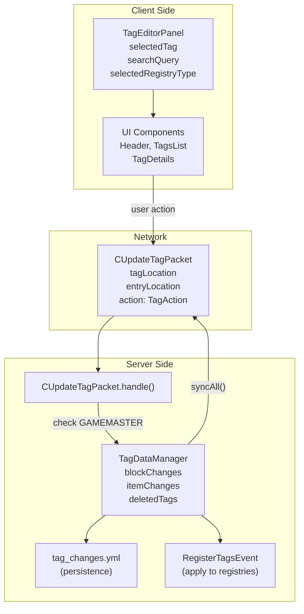

The `TagEditorPanel` at [src/main/java/ru/hollowhorizon/hollowengine/client/gui/scripting/panels/TagEditorPanel.kt:20]() provides:

| Feature | Implementation |
|---------|----------------|
| Tag filtering | By registry type (ALL/BLOCK/ITEM) and search query [src/main/java/ru/hollowhorizon/hollowengine/client/gui/scripting/panels/TagEditorPanel.kt:237-242]() |
| Statistics display | Live count of total, block, and item tags [src/main/java/ru/hollowhorizon/hollowengine/client/gui/scripting/panels/TagEditorPanel.kt:170-182]() |
| Tag creation | Generate new custom tags [src/main/java/ru/hollowhorizon/hollowengine/client/gui/scripting/panels/TagEditorPanel.kt:535-538]() |
| Entry management | Add/remove entries with item preview [src/main/java/ru/hollowhorizon/hollowengine/client/gui/scripting/panels/TagEditorPanel.kt:424-500]() |
| Tag deletion | Mark tags as deleted with restore capability [src/main/java/ru/hollowhorizon/hollowengine/client/gui/scripting/panels/TagEditorPanel.kt:540-546]() |
| Server sync | All changes via `CUpdateTagPacket` requiring GAMEMASTER permission [src/main/java/ru/hollowhorizon/hollowengine/common/network/TagEditorPackets.kt:31-43]() |

Tag changes persist to `tag_changes.yml` via `TagDataManager` [src/main/java/ru/hollowhorizon/hollowengine/common/tags/TagDataManager.kt:60-62]() and apply to registries through `RegisterTagsEvent` [src/main/java/ru/hollowhorizon/hollowengine/common/tags/TagDataManager.kt:91-109]().

**Sources:**
- [src/main/java/ru/hollowhorizon/hollowengine/client/gui/scripting/panels/TagEditorPanel.kt:20-556]()
- [src/main/java/ru/hollowhorizon/hollowengine/common/network/TagEditorPackets.kt:21-44]()
- [src/main/java/ru/hollowhorizon/hollowengine/common/tags/TagDataManager.kt:18-110]()

---

## Component Summary

| Component | Primary File | Responsibility |
|-----------|--------------|----------------|
| `FileNode` | FileNode.kt | File tree hierarchy with lazy loading and animations |
| `TitleBar` | BarContents.kt | Menu system and script execution controls |
| `FilesBar` | FilesBar.kt | Tab bar for open files with drag-to-undock |
| `DockPanel` | DockPanel.kt | Base class for all IDE panels |
| `LayoutLoader` | LayoutLoader.kt | Layout persistence and panel registration |
| `IdeTheme` | IdeTheme.kt | Global styling and font management |
| `FileTreePanel` | FileTreePanel.kt | File navigation panel implementation |
| `TagEditorPanel` | TagEditorPanel.kt | Tag management with server sync |
| `IdeContent` | Referenced in multiple files | Central registry for open files |
| `StartScriptPacket` | BarContents.kt | Network packet for script execution |