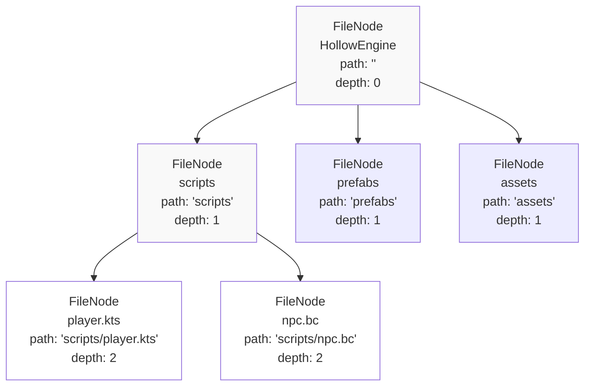
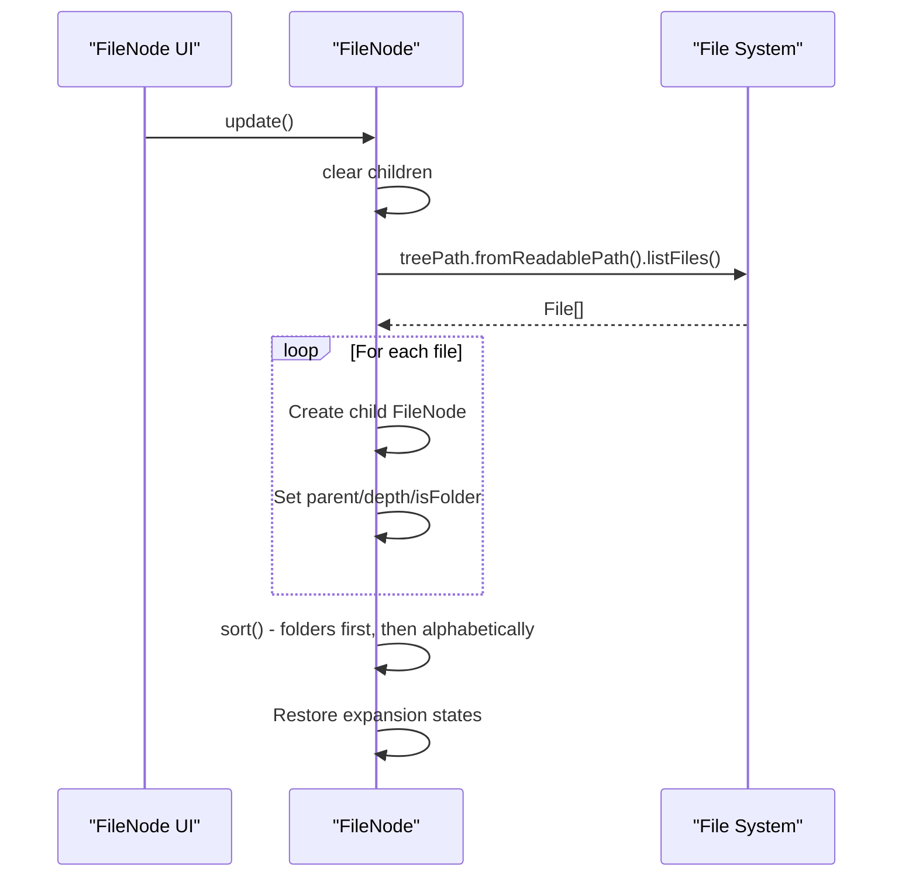
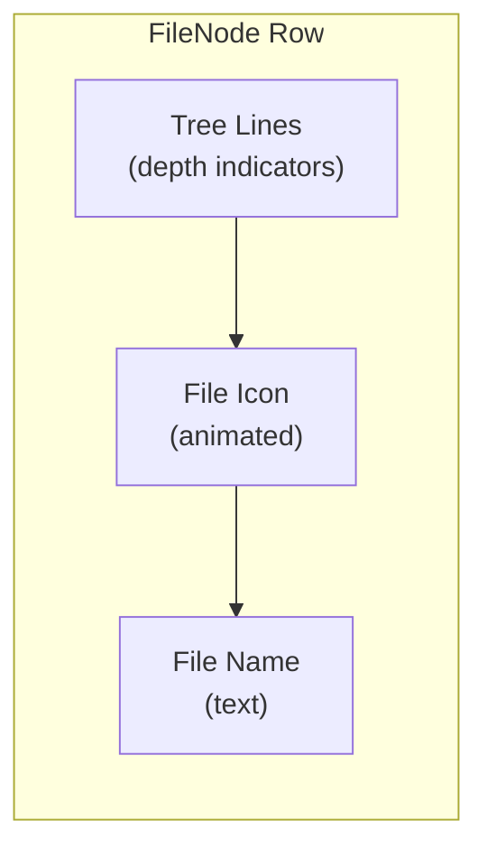
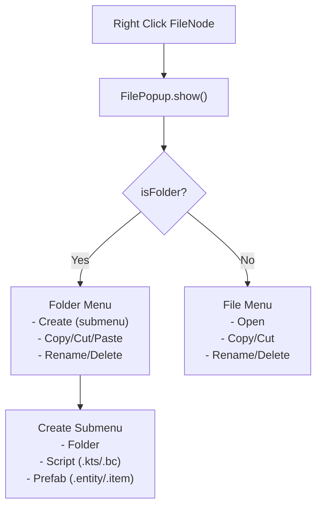
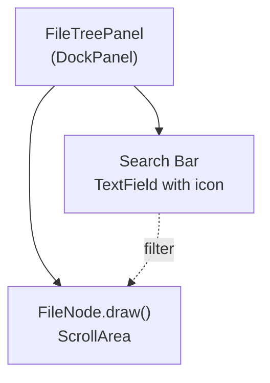
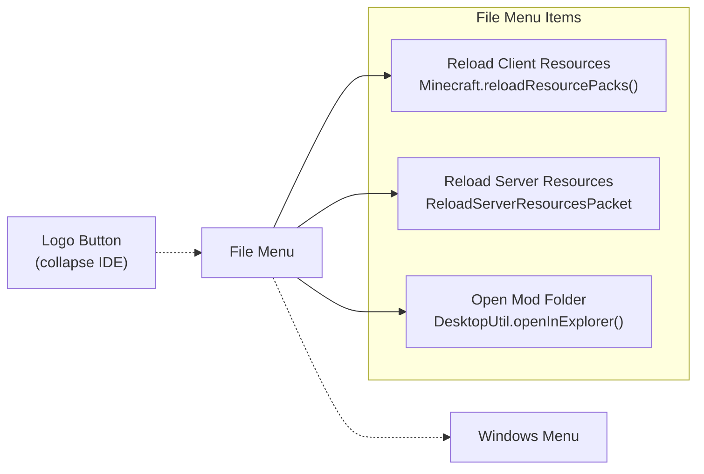
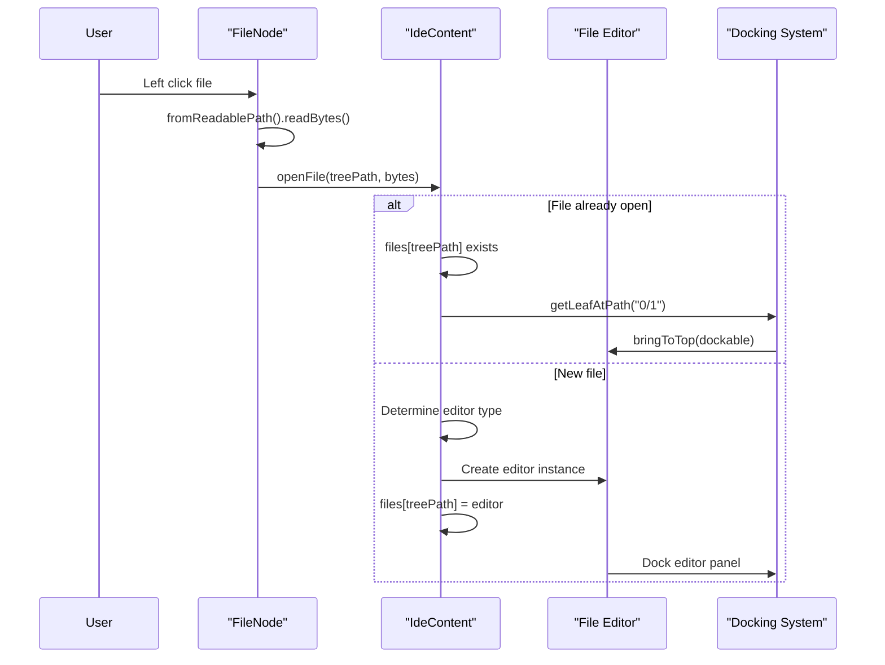

# File Management and Navigation

<details>
<summary>Relevant source files</summary>

The following files were used as context for generating this wiki page:

- [src/main/java/ru/hollowhorizon/hollowengine/client/gui/kool/UiColors.kt](src/main/java/ru/hollowhorizon/hollowengine/client/gui/kool/UiColors.kt)
- [src/main/java/ru/hollowhorizon/hollowengine/client/gui/scripting/FileNode.kt](src/main/java/ru/hollowhorizon/hollowengine/client/gui/scripting/FileNode.kt)
- [src/main/java/ru/hollowhorizon/hollowengine/client/gui/scripting/FilePopup.kt](src/main/java/ru/hollowhorizon/hollowengine/client/gui/scripting/FilePopup.kt)
- [src/main/java/ru/hollowhorizon/hollowengine/client/gui/scripting/TreeRenderer.kt](src/main/java/ru/hollowhorizon/hollowengine/client/gui/scripting/TreeRenderer.kt)
- [src/main/java/ru/hollowhorizon/hollowengine/client/gui/scripting/files/FilesBar.kt](src/main/java/ru/hollowhorizon/hollowengine/client/gui/scripting/files/FilesBar.kt)
- [src/main/java/ru/hollowhorizon/hollowengine/client/gui/scripting/panels/DockPanel.kt](src/main/java/ru/hollowhorizon/hollowengine/client/gui/scripting/panels/DockPanel.kt)
- [src/main/java/ru/hollowhorizon/hollowengine/client/gui/scripting/panels/FileTreePanel.kt](src/main/java/ru/hollowhorizon/hollowengine/client/gui/scripting/panels/FileTreePanel.kt)
- [src/main/java/ru/hollowhorizon/hollowengine/client/gui/scripting/popup/ItemPopupMenu.kt](src/main/java/ru/hollowhorizon/hollowengine/client/gui/scripting/popup/ItemPopupMenu.kt)
- [src/main/java/ru/hollowhorizon/hollowengine/client/gui/scripting/titlebar/BarContents.kt](src/main/java/ru/hollowhorizon/hollowengine/client/gui/scripting/titlebar/BarContents.kt)
- [src/main/java/ru/hollowhorizon/hollowengine/client/gui/scripting/tools/ToolWindow.kt](src/main/java/ru/hollowhorizon/hollowengine/client/gui/scripting/tools/ToolWindow.kt)
- [src/main/java/ru/hollowhorizon/hollowengine/client/keys/HollowEngineKeybinds.kt](src/main/java/ru/hollowhorizon/hollowengine/client/keys/HollowEngineKeybinds.kt)
- [src/main/java/ru/hollowhorizon/hollowengine/common/files/DirectoryManager.kt](src/main/java/ru/hollowhorizon/hollowengine/common/files/DirectoryManager.kt)
- [src/main/java/ru/hollowhorizon/hollowengine/common/util/DesktopUtil.kt](src/main/java/ru/hollowhorizon/hollowengine/common/util/DesktopUtil.kt)

</details>


This document covers the file system management and navigation features of the HollowEngine IDE. It explains how files and directories are represented, organized, and manipulated through the in-game interface. For information about specific file editors (text, blocks, animations), see [Text Script Editor](#4), [Visual Block Editor](#5), and [Animation System](#8). For the overall IDE architecture, see [IDE Overview and Architecture](#3.1).

## Purpose and Scope

The file management system provides:
- A hierarchical file tree representation of the `hollowengine/` directory
- Visual navigation through folders and files
- Context menu operations (create, rename, delete, copy, paste)
- Path management and conversion utilities
- Integration with the IDE's docking system for opening files

---

## Directory Manager

The `DirectoryManager` object serves as the central authority for file system paths and operations within HollowEngine. It establishes the root directory and provides utilities for path conversion.

### Root Directory

The primary directory is `HOLLOW_ENGINE`, lazily initialized as a `Path` pointing to `./hollowengine/` relative to the working directory. If the directory doesn't exist, it is created automatically [src/main/java/ru/hollowhorizon/hollowengine/common/files/DirectoryManager.kt:7-11]().

```kotlin
val HOLLOW_ENGINE: Path by lazy {
    File("").resolve("hollowengine").apply {
        if (!exists()) mkdirs()
    }.toPath()
}
```

### Path Conversion Utilities

`DirectoryManager` provides three key methods for working with paths:

| Method | Input | Output | Purpose |
|--------|-------|--------|---------|
| `toReadablePath()` | `File` or `Path` | `String` | Converts absolute paths to relative paths from `HOLLOW_ENGINE` |
| `fromReadablePath()` | `String` | `File` | Converts relative paths back to absolute `File` objects |
| N/A | N/A | N/A | All paths use forward slashes (`/`) regardless of platform |

The "readable path" format is used consistently throughout the IDE as a portable, human-readable identifier for files. For example, `scripts/player/actions.kts` is a readable path [src/main/java/ru/hollowhorizon/hollowengine/common/files/DirectoryManager.kt:16-28]().

**Sources:** [src/main/java/ru/hollowhorizon/hollowengine/common/files/DirectoryManager.kt:1-30]()

---

## FileNode Tree System

### Tree Structure

The `FileNode` class represents a node in the file tree hierarchy. Each node can be either a file or a folder, and folders can contain child nodes.



**FileNode Properties**

| Property | Type | Description |
|----------|------|-------------|
| `treeName` | `String` | Display name (filename only) |
| `treePath` | `String` | Readable path relative to `HOLLOW_ENGINE` |
| `depth` | `Int` | Nesting level in the tree (0 = root) |
| `isFolder` | `Boolean` | Whether this node represents a directory |
| `children` | `MutableList<FileNode>` | Child nodes (empty for files) |
| `isExpanded` | `MutableStateValue<Boolean>` | Expansion state (UI state) |
| `expandAnim` | `AnimatableFloat` | Animation value for smooth expansion (0.0 to 1.0) |
| `parent` | `FileNode?` | Parent node in the tree |

[src/main/java/ru/hollowhorizon/hollowengine/client/gui/scripting/FileNode.kt:21-32]()

### Tree Expansion and Animation

Folders can be expanded or collapsed with smooth animations. When a folder is toggled:

1. The `isExpanded` state is flipped [src/main/java/ru/hollowhorizon/hollowengine/client/gui/scripting/FileNode.kt:54-69]()
2. `expandAnim` animates from 0.0 to 1.0 (expanding) or 1.0 to 0.0 (collapsing) over 0.3 seconds using `easeOutQuart` easing
3. The `update()` method is called to refresh children if expanding
4. Child nodes become visible during the animation via the `AccordionColumnLayout` which scales their height by the expansion factor

The `walk()` method traverses the tree and returns a flat list of visible nodes, respecting the expansion state and applying an optional filter [src/main/java/ru/hollowhorizon/hollowengine/client/gui/scripting/FileNode.kt:38-46]().

### Update and Synchronization

The `update()` method synchronizes the tree with the actual file system:



The sort order ensures folders appear before files, with alphabetical ordering within each group [src/main/java/ru/hollowhorizon/hollowengine/client/gui/scripting/FileNode.kt:95-99]().

**Sources:** [src/main/java/ru/hollowhorizon/hollowengine/client/gui/scripting/FileNode.kt:1-100](), [src/main/java/ru/hollowhorizon/hollowengine/client/gui/scripting/FileNode.kt:273-282]()

---

## File Tree Rendering

### Visual Representation

Each `FileNode` renders as a row with the following components [src/main/java/ru/hollowhorizon/hollowengine/client/gui/scripting/FileNode.kt:152-266]():



**Depth Indicators:** Vertical tree lines are drawn for each level of depth, with a special indicator on the deepest level showing expansion state [src/main/java/ru/hollowhorizon/hollowengine/client/gui/scripting/FileNode.kt:165-177]().

**File Icons:** Icons are determined by the `IconHelper.forPath()` function based on file extension and folder state. Icons smoothly crossfade when folders expand/collapse using a dedicated animation [src/main/java/ru/hollowhorizon/hollowengine/client/gui/scripting/FileNode.kt:179-252]().

**Hover Effects:** Rows change background color on hover with animated transitions [src/main/java/ru/hollowhorizon/hollowengine/client/gui/scripting/FileNode.kt:201-211]().

### Interaction Handlers

| Action | Trigger | Behavior |
|--------|---------|----------|
| **Left Click** | File | Opens file in appropriate editor via `IdeContent.openFile()` |
| **Left Click** | Folder | Toggles expansion state |
| **Right Click** | Any | Opens context menu (`FilePopup`) |
| **Click Tree Line** | Depth indicator | Toggles parent folder expansion |

[src/main/java/ru/hollowhorizon/hollowengine/client/gui/scripting/FileNode.kt:183-199]()

**Sources:** [src/main/java/ru/hollowhorizon/hollowengine/client/gui/scripting/FileNode.kt:112-266]()

---

## File Operations

### Context Menu System

File operations are accessed through a right-click context menu implemented by the `FilePopup` class. The menu is context-aware, showing different options based on whether the target is a file or folder.



### Create Operations

**Create Folder:** Opens an `EditPopup` dialog prompting for a folder name. On confirmation, creates the directory using `File.mkdirs()` and refreshes the parent node [src/main/java/ru/hollowhorizon/hollowengine/client/gui/scripting/FilePopup.kt:43-46]().

**Create File:** Opens an `EditPopup` dialog prompting for a filename (without extension). The file extension is determined by the selected file type:

| Context | Extension | Menu Path |
|---------|-----------|-----------|
| `scripts/` folder | `.kts` or `.bc` | Create → Script → Simple/Codeblocks |
| `prefabs/` folder | `.entity.prefab` or `.item.prefab` | Create → Prefab → NPC/Item |

The file is created using `File.createNewFile()` and the parent folder is refreshed [src/main/java/ru/hollowhorizon/hollowengine/client/gui/scripting/FilePopup.kt:48-51](), [src/main/java/ru/hollowhorizon/hollowengine/client/gui/scripting/FilePopup.kt:66-94]().

### Copy, Cut, and Paste

The clipboard system uses module-level variables to track the copy operation state:

```kotlin
private var copySource = ""           // Readable path of source file
private var deleteOriginal = false    // true for cut, false for copy
```

**Copy/Cut:** Stores the `treePath` of the clicked node in `copySource` and sets `deleteOriginal` accordingly [src/main/java/ru/hollowhorizon/hollowengine/client/gui/scripting/FilePopup.kt:102-109]().

**Paste:** Only available on folders. Executes the following steps:
1. Converts `copySource` to a `File` using `fromReadablePath()`
2. Determines destination path within the target folder
3. Uses `File.copyRecursively()` or `File.copyTo()` depending on source type
4. If cut operation, deletes the original using `File.deleteRecursively()`
5. Refreshes the file tree via `IdeContent.fileTree.update()`

Paste silently fails if source doesn't exist, destination matches source, or copy operation fails [src/main/java/ru/hollowhorizon/hollowengine/client/gui/scripting/FilePopup.kt:110-143]().

### Rename and Delete

**Rename:** Opens an `EditPopup` dialog. On confirmation, calls `File.renameTo()` with the new name in the same parent directory, then refreshes the parent node [src/main/java/ru/hollowhorizon/hollowengine/client/gui/scripting/FilePopup.kt:53-56]().

**Delete:** Opens a `WarningModalPopup` confirmation dialog. On confirmation, calls `File.deleteRecursively()` and refreshes the parent node [src/main/java/ru/hollowhorizon/hollowengine/client/gui/scripting/FilePopup.kt:58-61]().

### Additional Operations

**Copy as Path:** For files under `assets/`, copies the resource path (e.g., `hollowengine:textures/gui/logo.svg`) to the system clipboard [src/main/java/ru/hollowhorizon/hollowengine/client/gui/scripting/FilePopup.kt:146-153]().

**Open in Explorer:** When running on a local server, opens the file or folder in the system file explorer using `DesktopUtil.openInExplorer()` [src/main/java/ru/hollowhorizon/hollowengine/client/gui/scripting/FilePopup.kt:155-163]().

**Sources:** [src/main/java/ru/hollowhorizon/hollowengine/client/gui/scripting/FilePopup.kt:1-181](), [src/main/java/ru/hollowhorizon/hollowengine/client/gui/scripting/TreeRenderer.kt:10-59](), [src/main/java/ru/hollowhorizon/hollowengine/common/util/DesktopUtil.kt:1-25]()

---

## File Tree Panel

### Panel Structure

The `FileTreePanel` is a dockable panel that displays the file tree. It extends `DockPanel` and integrates with the IDE's docking system (see [Docking System](#3.3)).



The panel consists of:

1. **Search Bar:** A rounded `TextField` with a search icon that filters the tree in real-time [src/main/java/ru/hollowhorizon/hollowengine/client/gui/scripting/panels/FileTreePanel.kt:23-42]()
2. **File Tree:** The root `FileNode` rendered inside a `ScrollArea` with custom scrollbars

### Filtering

The `filter` state is a `MutableStateValue<String>` that triggers tree re-rendering. The `FileNode.draw()` method receives this filter and passes it to `walk()`, which uses `canShow()` to determine visibility.

A node is visible if:
- Its path contains the filter string (case-insensitive), OR
- Any descendant node matches the filter

This allows searching by filename while keeping the parent folder hierarchy visible [src/main/java/ru/hollowhorizon/hollowengine/client/gui/scripting/FileNode.kt:48-52]().

**Sources:** [src/main/java/ru/hollowhorizon/hollowengine/client/gui/scripting/panels/FileTreePanel.kt:1-48]()

---

## Title Bar File Menu

The title bar provides global file operations accessible from the "File" menu button.



### Menu Items

**Reload Client Resources:** Triggers `Minecraft.getInstance().reloadResourcePacks()`, reloading all resource packs including models, textures, and language files [src/main/java/ru/hollowhorizon/hollowengine/client/gui/scripting/titlebar/BarContents.kt:59-61]().

**Reload Server Resources:** Sends a `ReloadServerResourcesPacket` to the server, which executes the `/reload` command if the player has permission level 2 [src/main/java/ru/hollowhorizon/hollowengine/client/gui/scripting/titlebar/BarContents.kt:62-64](), [src/main/java/ru/hollowhorizon/hollowengine/client/gui/scripting/titlebar/BarContents.kt:239-250]().

**Open Mod Folder:** Opens `DirectoryManager.HOLLOW_ENGINE` in the system file explorer [src/main/java/ru/hollowhorizon/hollowengine/client/gui/scripting/titlebar/BarContents.kt:65-67]().

**Sources:** [src/main/java/ru/hollowhorizon/hollowengine/client/gui/scripting/titlebar/BarContents.kt:40-83](), [src/main/java/ru/hollowhorizon/hollowengine/client/gui/scripting/titlebar/BarContents.kt:239-250]()

---

## Integration with IDE Content

### File Opening Flow

When a file is opened (via click or menu), the following process occurs:



The `IdeContent` object maintains a registry of open files:

```kotlin
val files: MutableMap<String, IdeFile> = mutableMapOf()
```

Each `IdeFile` implementation (e.g., `ScriptFile`, `BlockEditorFile`, `PrefabEditorFile`) has an associated `dockable` that represents its UI panel [src/main/java/ru/hollowhorizon/hollowengine/client/gui/scripting/FileNode.kt:188-196]().

### File Tabs Bar

When multiple files are docked in the same leaf node, a tabs bar appears showing all open files. This is implemented by the `FileDockingTabsBar()` function.

| Feature | Implementation |
|---------|----------------|
| Tab rendering | Shows file icon and name from `IdeContent.files` |
| Middle-click | Closes the file |
| Left-click | Brings file to top (focuses it) |
| Right-click | Opens file-specific context menu |
| Drag-to-undock | Allows dragging tabs to create floating windows |

The tabs use a `LazyList` with horizontal scrolling to handle many open files [src/main/java/ru/hollowhorizon/hollowengine/client/gui/scripting/files/FilesBar.kt:113-236]().

### Title Bar Display

Each file editor panel displays a title bar showing the file icon and name. The title bar adapts based on docking state:

- **Docked with tabs:** Only the tabs bar is visible [src/main/java/ru/hollowhorizon/hollowengine/client/gui/scripting/files/FilesBar.kt:247-253]()
- **Docked without tabs or floating:** Full title bar with file name and minimize button [src/main/java/ru/hollowhorizon/hollowengine/client/gui/scripting/files/FilesBar.kt:257-266]()

**Sources:** [src/main/java/ru/hollowhorizon/hollowengine/client/gui/scripting/files/FilesBar.kt:1-367](), [src/main/java/ru/hollowhorizon/hollowengine/client/gui/scripting/FileNode.kt:188-196]()

---

## Class and Component Reference

### Key Classes

| Class | Purpose | Location |
|-------|---------|----------|
| `DirectoryManager` | Root directory management and path conversion | [src/main/java/ru/hollowhorizon/hollowengine/common/files/DirectoryManager.kt:6-29]() |
| `FileNode` | Tree node representing a file or folder | [src/main/java/ru/hollowhorizon/hollowengine/client/gui/scripting/FileNode.kt:21-271]() |
| `FilePopup` | Context menu for file operations | [src/main/java/ru/hollowhorizon/hollowengine/client/gui/scripting/FilePopup.kt:16-180]() |
| `FileTreePanel` | Dockable panel showing the file tree | [src/main/java/ru/hollowhorizon/hollowengine/client/gui/scripting/panels/FileTreePanel.kt:13-48]() |
| `ItemPopupMenu<T>` | Generic popup menu system | [src/main/java/ru/hollowhorizon/hollowengine/client/gui/scripting/popup/ItemPopupMenu.kt:19-220]() |

### Dialog Popups

| Function | Purpose | Usage |
|----------|---------|-------|
| `EditPopup()` | Text input dialog for create/rename | [src/main/java/ru/hollowhorizon/hollowengine/client/gui/scripting/TreeRenderer.kt:10-43]() |
| `WarningModalPopup()` | Confirmation dialog for delete | [src/main/java/ru/hollowhorizon/hollowengine/client/gui/scripting/TreeRenderer.kt:45-59]() |

### File Tab Components

| Function | Purpose |
|----------|---------|
| `FileDockingTabsBar()` | Renders horizontal tabs bar for docked files |
| `FileTitleBar()` | Renders title bar with icon, name, and controls |
| `LazyList()` | Custom horizontal scrollable list for tabs |

**Sources:** [src/main/java/ru/hollowhorizon/hollowengine/client/gui/scripting/FileNode.kt:1-292](), [src/main/java/ru/hollowhorizon/hollowengine/client/gui/scripting/FilePopup.kt:1-181](), [src/main/java/ru/hollowhorizon/hollowengine/client/gui/scripting/TreeRenderer.kt:1-95](), [src/main/java/ru/hollowhorizon/hollowengine/client/gui/scripting/files/FilesBar.kt:1-380]()