# Docking System

<details>
<summary>Relevant source files</summary>

The following files were used as context for generating this wiki page:

- [src/main/java/ru/hollowhorizon/hollowengine/client/gui/scripting/FileNode.kt](src/main/java/ru/hollowhorizon/hollowengine/client/gui/scripting/FileNode.kt)
- [src/main/java/ru/hollowhorizon/hollowengine/client/gui/scripting/files/FilesBar.kt](src/main/java/ru/hollowhorizon/hollowengine/client/gui/scripting/files/FilesBar.kt)
- [src/main/java/ru/hollowhorizon/hollowengine/client/gui/scripting/panels/DockPanel.kt](src/main/java/ru/hollowhorizon/hollowengine/client/gui/scripting/panels/DockPanel.kt)
- [src/main/java/ru/hollowhorizon/hollowengine/client/gui/scripting/panels/FileTreePanel.kt](src/main/java/ru/hollowhorizon/hollowengine/client/gui/scripting/panels/FileTreePanel.kt)
- [src/main/java/ru/hollowhorizon/hollowengine/client/gui/scripting/tools/ToolWindow.kt](src/main/java/ru/hollowhorizon/hollowengine/client/gui/scripting/tools/ToolWindow.kt)
- [src/main/java/ru/hollowhorizon/hollowengine/client/keys/HollowEngineKeybinds.kt](src/main/java/ru/hollowhorizon/hollowengine/client/keys/HollowEngineKeybinds.kt)

</details>


The Docking System provides the framework for arranging, organizing, and managing IDE panels in the HollowEngine in-game IDE. It enables panels to be docked into specific layout positions, undocked into floating windows, tabbed together for space efficiency, and dynamically resized. The system is built on top of the Kool UI framework's `Dock` and `UiDockable` primitives.

For information about the overall IDE architecture and scene management, see [IDE Overview and Architecture](#3.1). For details on specific panel implementations, see [Panel System and Registration](#3.5).

## Architecture Overview

The docking system manages IDE panel layout, positioning, and state. It consists of three primary layers: the **Kool UI Dock** framework, **DockPanel** base abstraction, and **Panel Implementations**. The `Dock` class manages the docking tree structure and drag-drop operations, `DockPanel` provides lifecycle management and UI components, and panels implement `Composable.compose()` to define their content.

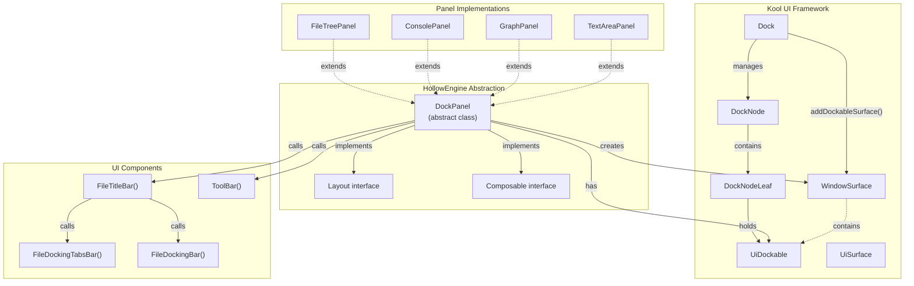

**Sources:** [src/main/java/ru/hollowhorizon/hollowengine/client/gui/scripting/panels/DockPanel.kt:1-82](), [src/main/java/ru/hollowhorizon/hollowengine/client/gui/scripting/files/FilesBar.kt:1-378](), [src/main/java/ru/hollowhorizon/hollowengine/client/gui/scripting/tools/ToolWindow.kt:1-126]()
</thinking>

## DockPanel Base Class

`DockPanel` is an abstract base class that all IDE panels inherit from. It manages the panel's lifecycle, provides standard UI components (title bar, tabs), and integrates with the docking system. Each panel must implement the `Composable` interface to define its content.

### Class Structure

| Member | Type | Purpose |
|--------|------|---------|
| `name` | `String` | Localization key for panel title |
| `dock` | `Dock` | Reference to the docking system |
| `dockable` | `UiDockable` | Underlying dockable item |
| `showOnToolbar` | `Boolean` | Whether to show the toolbar when docked |
| `isCollapsed` | `MutableState<Boolean>` | Panel minimized state |
| `surface` | `UiSurface?` | Current window surface (null when closed) |
| `icon` | `ResourceLocation` | Icon displayed in title bar and tabs |
| `isDocked` | `Boolean` | Computed property: `dockable.dockedTo.value != null` |

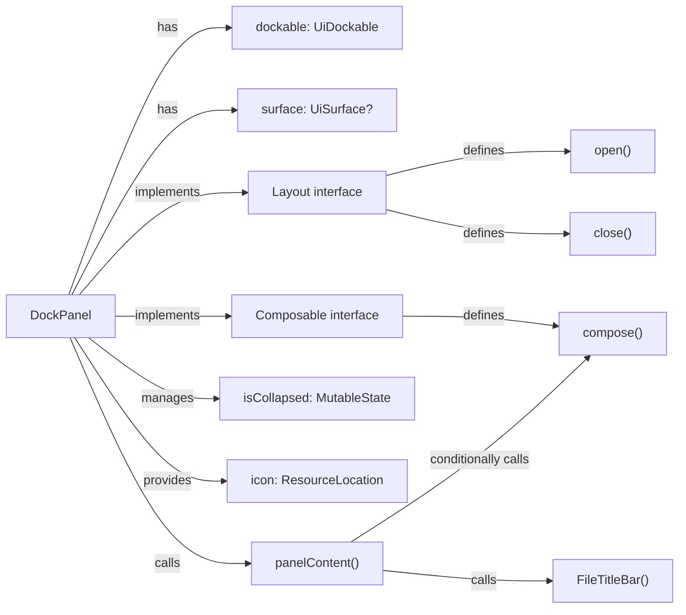

**Sources:** [src/main/java/ru/hollowhorizon/hollowengine/client/gui/scripting/panels/DockPanel.kt:14-82]()

## DockPanel Base Class

`DockPanel` is an abstract base class that all IDE panels inherit from. It manages the panel's lifecycle, provides standard UI components (title bar, tabs), and integrates with the docking system. Each panel must implement the `Composable` interface to define its content.

### Class Structure

| Member | Type | Purpose |
|--------|------|---------|
| `name` | `String` | Localization key for panel title |
| `dock` | `Dock` | Reference to the docking system |
| `dockable` | `UiDockable` | Underlying dockable item |
| `showOnToolbar` | `Boolean` | Whether to show the toolbar when docked |
| `isCollapsed` | `MutableState<Boolean>` | Panel minimized state |
| `icon` | `ResourceLocation` | Icon displayed in title bar and tabs |

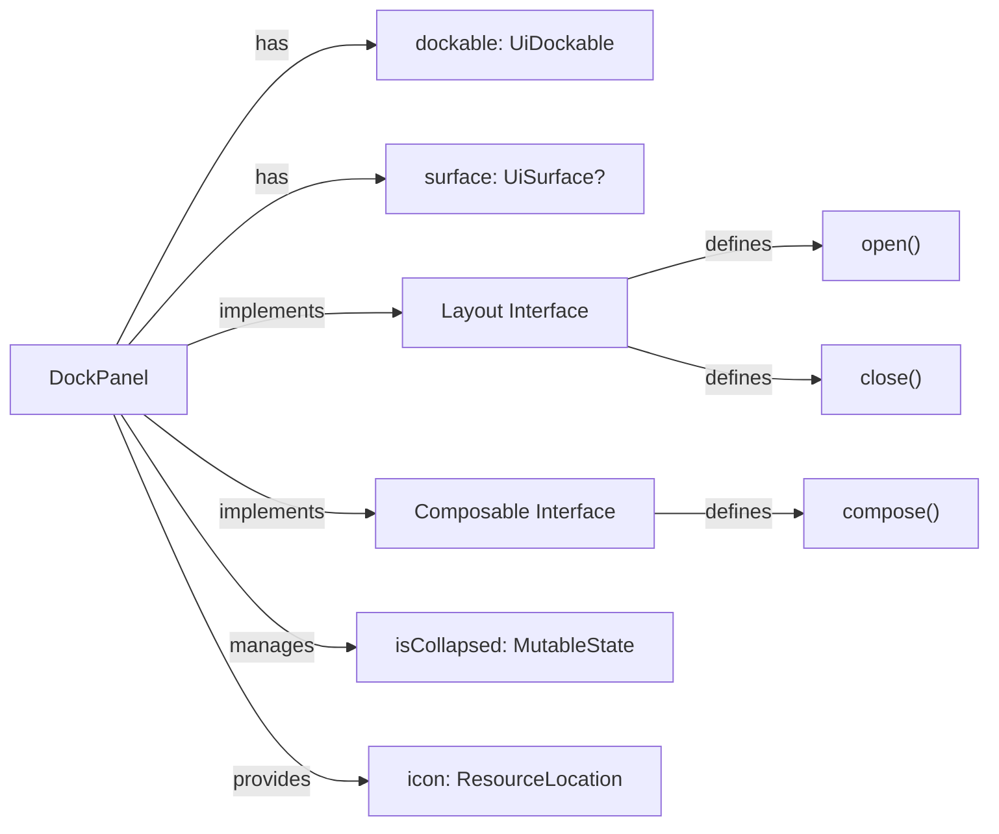

**Sources:** [src/main/java/ru/hollowhorizon/hollowengine/client/gui/scripting/panels/DockPanel.kt:14-82]()

### Panel Content Rendering

The `panelContent()` function wraps the panel's content with a title bar and handles the collapsed state. When collapsed, only the title bar is shown (size `FitContent`), otherwise the full panel content is rendered.

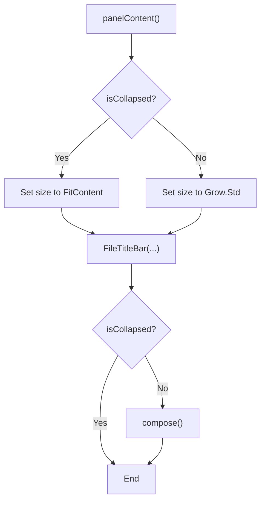

**Sources:** [src/main/java/ru/hollowhorizon/hollowengine/client/gui/scripting/panels/DockPanel.kt:23-36]()

## Panel Lifecycle

Panels have three primary lifecycle states: **Closed** (no surface), **Floating** (undocked window), and **Docked** (integrated into layout). The lifecycle is managed through the `open()` and `close()` methods.

### Lifecycle State Machine

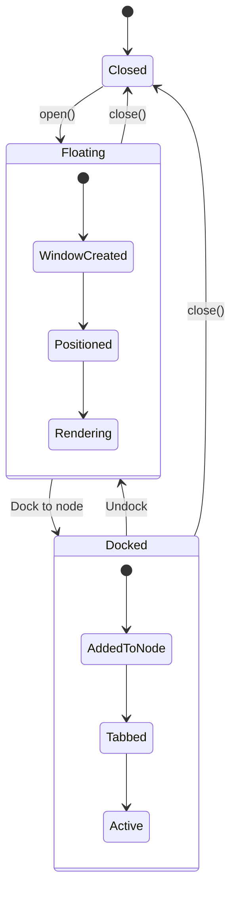

### Opening a Panel

The `open()` method creates and displays a panel. The process:
1. Checks if `surface != null` (already open) and returns early
2. Sets `dockable.floatingX` to `Dp(5f)` (5dp from left edge)
3. Sets `dockable.floatingY` to `Dp.fromPx(ScriptingEnvironmentOverlay.titleBarHeight) + Dp(5f)` (below title bar)
4. Sets `dockable.floatingWidth` to `Dimensions.PaddingExtraLarge * 15f`
5. Sets `dockable.floatingHeight` to `Dimensions.PaddingExtraLarge * 10f`
6. Creates `WindowSurface` with parent scene, colors, and sizes from `dock.dockingSurface`
7. Calls `dock.addDockableSurface(dockable, surface)` to register the surface

The `WindowSurface` content varies based on `showOnToolbar` and docking state. If docked with `showOnToolbar = true`, a `ToolBar` is added on the left or right side based on the panel's position in the dock tree.

**Sources:** [src/main/java/ru/hollowhorizon/hollowengine/client/gui/scripting/panels/DockPanel.kt:38-70]()

### Closing a Panel

The `close()` method removes the panel's surface from the dock:
1. Calls `dock.removeDockableSurface(surface)` to unregister the surface
2. Calls `surface.releaseDelayed(1)` to schedule destruction after 1 frame
3. Sets `surface = null`

The delayed release prevents immediate destruction during event handling (e.g., if `close()` is called from a click handler).

**Sources:** [src/main/java/ru/hollowhorizon/hollowengine/client/gui/scripting/panels/DockPanel.kt:72-78]()

### WindowSurface Creation Logic

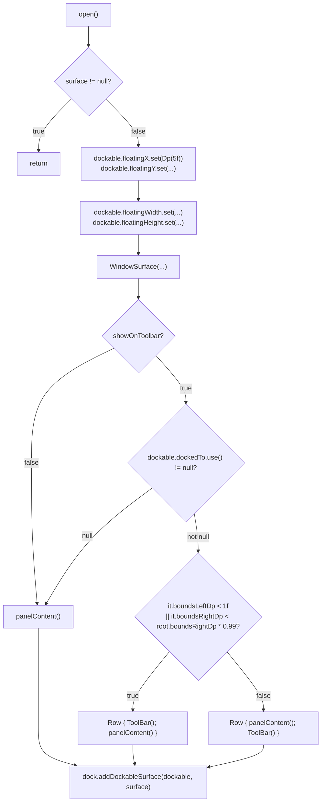

**Sources:** [src/main/java/ru/hollowhorizon/hollowengine/client/gui/scripting/panels/DockPanel.kt:38-70]()

## Docking and Undocking

Panels can be dragged to dock into specific positions within the IDE layout. The docking system uses edge detection to determine where to dock a panel. When undocked, panels become floating windows that can be freely positioned.

### Drag Behavior

The title bar registers drag callbacks using `UiDockable.registerDragCallbacks()` when `isDraggable = true` and no middle/right button is pressed. The `registerDragCallbacks()` method (from Kool UI framework) sets up:
- `onDragStart`: Detects if pointer is on resize edge using `getResizeEdgeMask()`
- `onDrag`: Handles dragging the window or resizing based on edge mask
- `onDragEnd`: Finalizes docking or floating position

During drag, the `Dock`'s drag-and-drop context shows preview regions where the panel can be docked. On release, the panel either docks to the previewed location or remains floating.

**Sources:** [src/main/java/ru/hollowhorizon/hollowengine/client/gui/scripting/files/FilesBar.kt:303-307]()

### Undocking from Tabs

Tabs can be undocked by dragging them outside the tab bar area. The implementation uses accessor methods via `UiDockableAccessor` mixin to access internal `UiDockable` state:

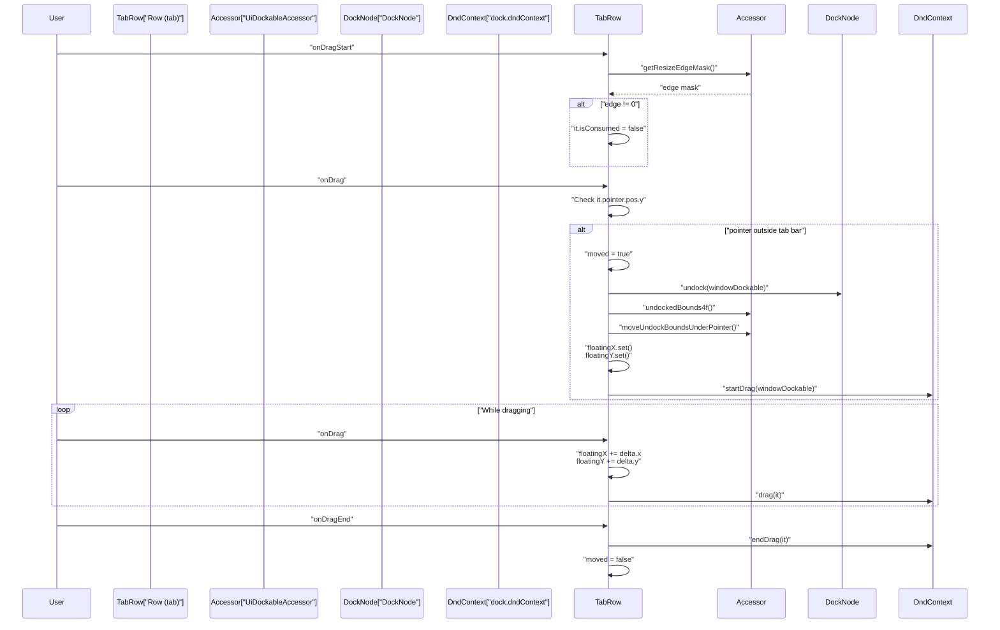

The key methods accessed via `UiDockableAccessor` mixin:
- `moveUndockBoundsUnderPointer()`: Positions floating bounds relative to pointer
- `dragStartItemBounds`: Stores initial bounds for drag operation
- `floatingWidthPx`, `floatingHeightPx`: Get current floating dimensions
- `undockedBounds4f()`: Calculate floating bounds as MutableVec4f

**Sources:** [src/main/java/ru/hollowhorizon/hollowengine/client/gui/scripting/files/FilesBar.kt:171-213](), [src/main/java/ru/hollowhorizon/hollowengine/client/gui/scripting/files/FilesBar.kt:369-381]()

## Tab System

When multiple panels are docked to the same `DockNode`, they are displayed as tabs. The tab system allows users to switch between panels without consuming additional screen space. Each tab shows the panel's icon and name.

### FileDockingTabsBar Component

The `FileDockingTabsBar()` function renders the tab strip when `nodeCount > 1` (multiple items docked). It uses a horizontal `LazyList` to support scrolling when there are many tabs.

**Tab Strip Features:**
- Horizontal scrolling via mouse wheel (Shift+wheel) or drag (if `isScrollByDrag = true`)
- Middle-click (mouse button released) to close a tab
- Left-click to call `dockNode.bringToTop(item)`
- Right-click to trigger `onRightClick(item, event)` callback
- Visual hover effects: background animates from `colors.background` to `Color("394450FF")`
- Border animates from `Color("3C3C4AFF")` to `Color("586D84FF")` on hover
- Drag tabs outside tab bar to undock into floating windows

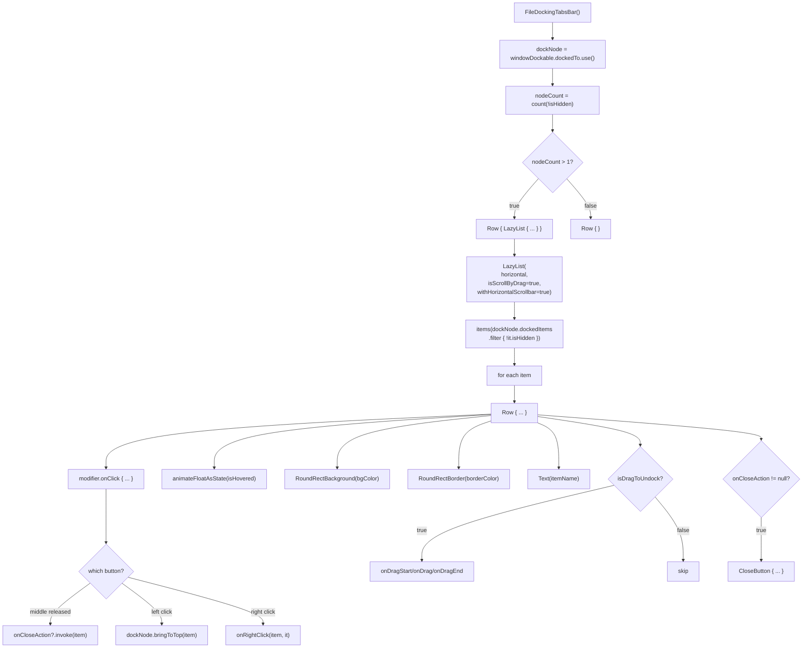

**Sources:** [src/main/java/ru/hollowhorizon/hollowengine/client/gui/scripting/files/FilesBar.kt:113-236]()

### Tab Rendering Details

Each tab is rendered as a `Row` with:
- Background: `RoundRectBackground(bgColor, sizes.smallGap)` where `bgColor = colors.background.mix(Color("394450FF"), factor)`
- Border: `RoundRectBorder(borderColor, sizes.smallGap, sizes.borderWidth)` where `borderColor = Color("3C3C4AFF").mix(Color("586D84FF"), factor)`
- `factor` is animated via `animateFloatAsState(if (isHovered) 1f else 0f, tween(easing = Easing.easeOutQuart))`
- Text showing item name with margins `horizontal = sizes.gap, vertical = sizes.smallGap * 0.5f`
- Optional `CloseButton` if `onCloseAction != null` (with drag handlers denied: `onDragStart {}.onDragEnd {}.onDrag {}`)

The tab name resolution:
```kotlin
val itemName = IdeContent.files.values.find { it.dockable == item }?.filePath?.substringAfterLast('/') ?: item.name.lang
```

**Sources:** [src/main/java/ru/hollowhorizon/hollowengine/client/gui/scripting/files/FilesBar.kt:137-169](), [src/main/java/ru/hollowhorizon/hollowengine/client/gui/scripting/files/FilesBar.kt:214-226]()

## Title Bar System

When a panel is not tabbed (single panel in a dock node or floating), it displays a title bar instead of tabs. The title bar provides panel identification, drag functionality, and control buttons.

### FileTitleBar Component

The `FileTitleBar()` function conditionally renders either:
- **Tab strip** (if `showTabsIfDocked` is true and panel is docked with others)
- **Title bar** (if panel is solo or floating)

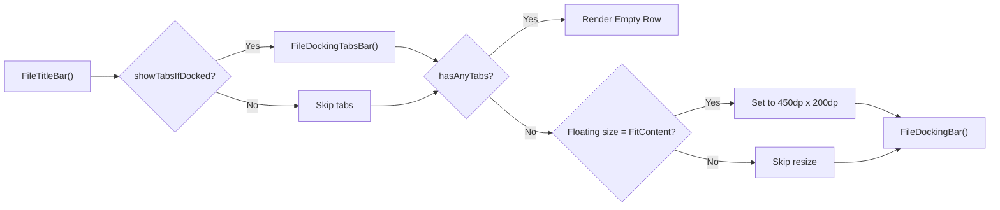

**Sources:** [src/main/java/ru/hollowhorizon/hollowengine/client/gui/scripting/files/FilesBar.kt:238-266]()

### Title Bar Components

The `FileDockingBar()` function renders the title bar with the following layout:

| Component | Position | Purpose |
|-----------|----------|---------|
| `Image(icon)` | Left | Visual identification (size: `Dimensions.PaddingHuge`) |
| `Text(itemName)` | Center-left | Panel name with font: `MsdfFont(ColorTheme.Fonts.MONOCRAFT, ...)` |
| `Box(Grow.Std)` | Center | Empty spacer to push buttons right |
| `CloseButton` | Right | Closes panel via `onCloseAction?.invoke(windowDockable)` |
| `Image(icons.MINIMIZE/MAXIMIZE)` | Far-right | Toggles `minimizeButton` state |

The entire title bar `Row` uses:
- Width: `if(minimizeButton.use()) FitContent else Grow.Std`
- Background: `RoundRectBackground(color, Dimensions.PaddingNormal)` with hover animation
- Padding: `vertical = Dimensions.PaddingMedium, horizontal = Dimensions.PaddingMedium + Dimensions.PaddingNormal`

Click handlers:
- Middle button released: calls `onCloseAction?.invoke(windowDockable)`
- Right button clicked: calls `onRightClick(windowDockable, it)`
- Drag: calls `windowDockable.registerDragCallbacks()` if draggable and no middle/right button

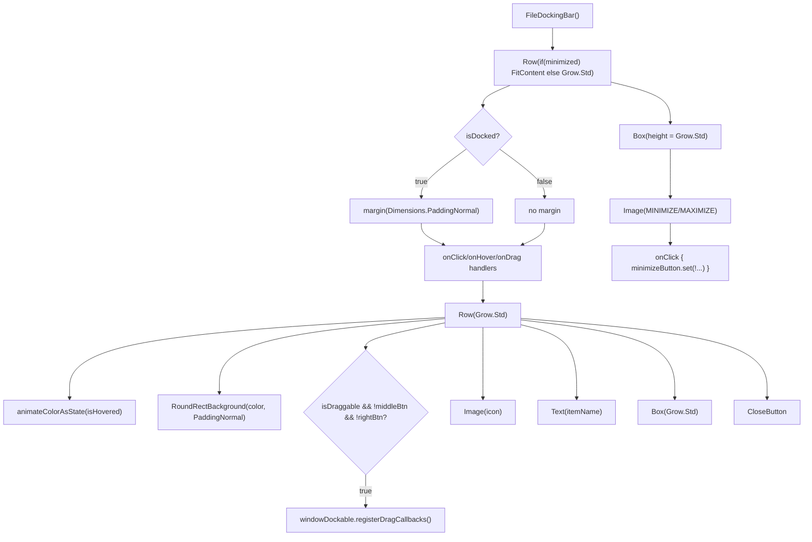

**Sources:** [src/main/java/ru/hollowhorizon/hollowengine/client/gui/scripting/files/FilesBar.kt:268-367]()

### Minimize/Maximize Button

The minimize button is a separate `Box` to the right of the title bar. It toggles the `minimizeButton` state (which is actually `DockPanel.isCollapsed`). Implementation details:
- Rendered as a `Box(height = Grow.Std)` with padding `Dimensions.PaddingMedium` and margin `start = Dimensions.PaddingNormal`
- Background: `RoundRectBackground(color, Dimensions.PaddingNormal)` where `color` animates between `BackgroundAccent` (hovered) and `BackgroundSecondary`
- Icon: `Image(if(minimizeButton.use()) icons.MAXIMIZE else icons.MINIMIZE)` with size `Dimensions.PaddingHuge`
- Click handler: `onClick { if(it.pointer.isLeftButtonClicked) minimizeButton.set(!minimizeButton.use()) }`

When `minimizeButton = true`:
- `DockPanel.panelContent()` sets size to `FitContent`
- Only title bar is rendered (compose() content is skipped)
- Title bar outer `Row` width becomes `FitContent` instead of `Grow.Std`

**Sources:** [src/main/java/ru/hollowhorizon/hollowengine/client/gui/scripting/files/FilesBar.kt:352-366](), [src/main/java/ru/hollowhorizon/hollowengine/client/gui/scripting/panels/DockPanel.kt:23-36]()

## Creating Custom Panels

To create a custom panel, extend `DockPanel` and implement the `compose()` function. The panel must also provide an `icon` property for visual identification.

### Implementation Steps

1. **Extend DockPanel**: Pass the localization key and `Dock` reference to the constructor
2. **Override `icon`**: Provide a `ResourceLocation` for the panel icon
3. **Implement `compose()`**: Define the panel's UI using Kool's composable DSL
4. **Optional: Set `showOnToolbar`**: Control whether the toolbar appears when docked

### Example: FileTreePanel

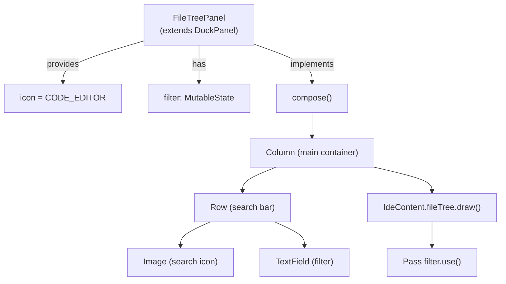

**FileTreePanel Structure:**
- **Localization key**: `"hollowengine.gui.ide.project_tree"`
- **Icon**: `Assets.Hollowengine.Textures.Gui.Icons.CODE_EDITOR`
- **State**: `filter` (search text)
- **Content**: Search bar + file tree with filtering

**Sources:** [src/main/java/ru/hollowhorizon/hollowengine/client/gui/scripting/panels/FileTreePanel.kt:13-48]()

### Registration

Panels are registered with the IDE through the `LoadLayoutEvent`. When the IDE initializes, it fires this event, and panels respond by calling `open()` on themselves or adding themselves to the layout.

For more details on panel registration, see [Panel System and Registration](#3.5).

**Sources:** [src/main/java/ru/hollowhorizon/hollowengine/client/gui/scripting/panels/FileTreePanel.kt:1-48](), [src/main/java/ru/hollowhorizon/hollowengine/client/gui/scripting/panels/DockPanel.kt:1-82]()