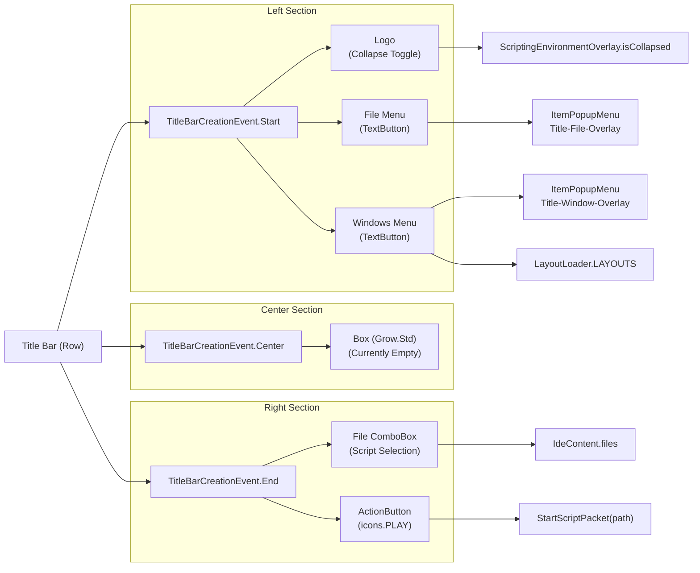
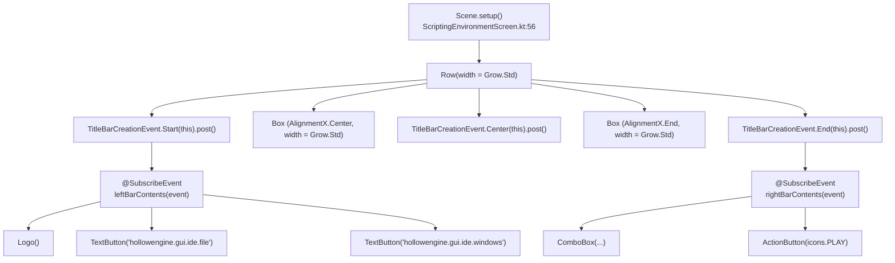
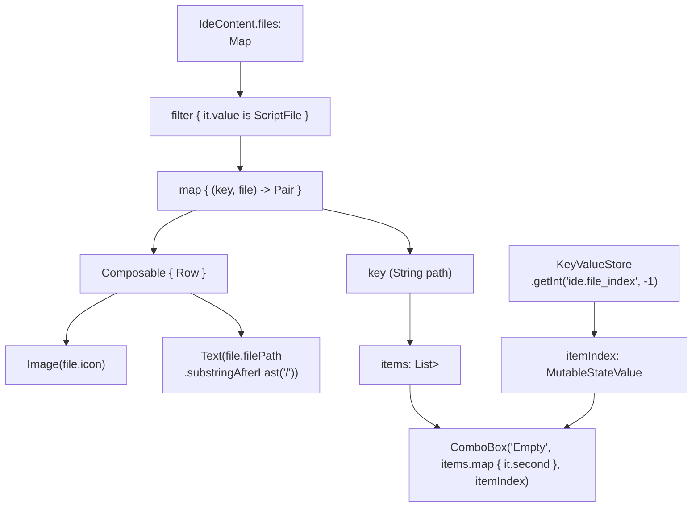
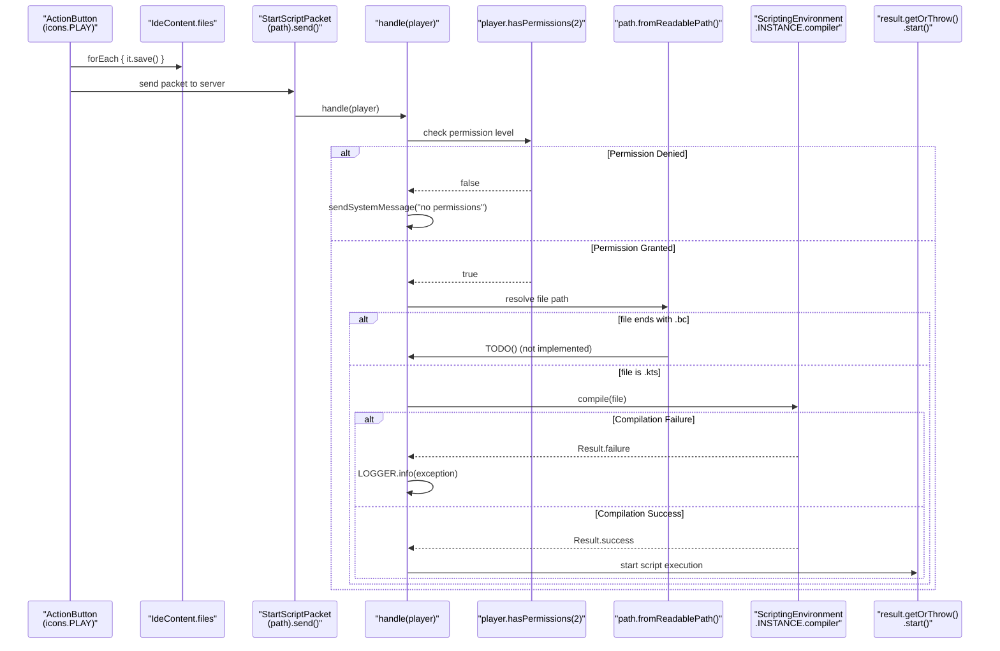
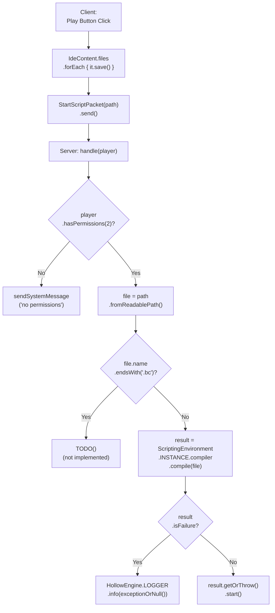
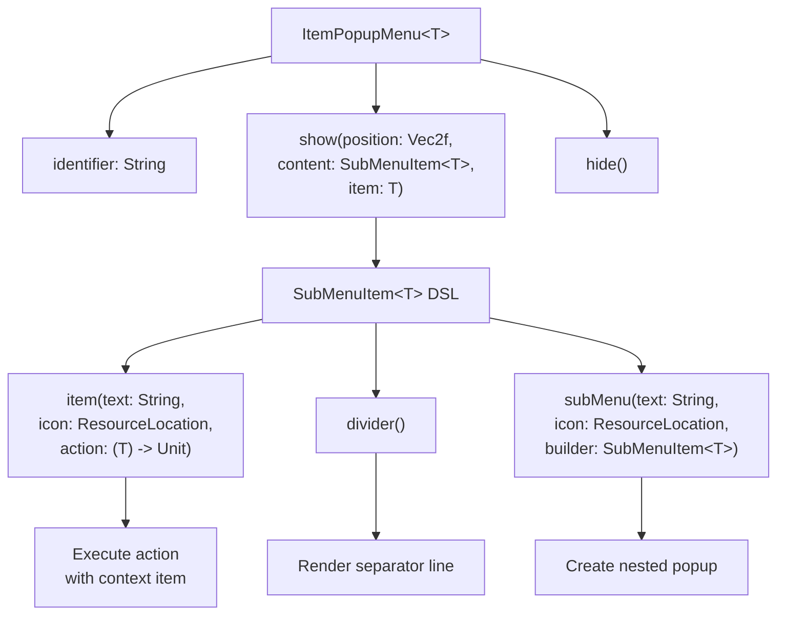
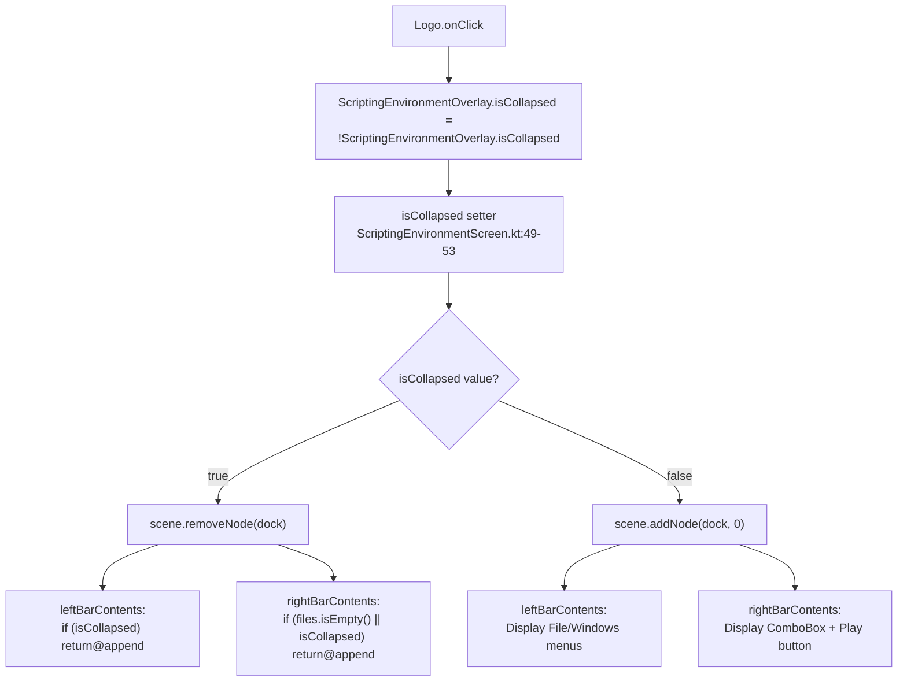

# Title Bar and Menu System

<details>
<summary>Relevant source files</summary>

The following files were used as context for generating this wiki page:

- [src/main/java/ru/hollowhorizon/hollowengine/client/gui/kool/UiColors.kt](src/main/java/ru/hollowhorizon/hollowengine/client/gui/kool/UiColors.kt)
- [src/main/java/ru/hollowhorizon/hollowengine/client/gui/scripting/FilePopup.kt](src/main/java/ru/hollowhorizon/hollowengine/client/gui/scripting/FilePopup.kt)
- [src/main/java/ru/hollowhorizon/hollowengine/client/gui/scripting/TreeRenderer.kt](src/main/java/ru/hollowhorizon/hollowengine/client/gui/scripting/TreeRenderer.kt)
- [src/main/java/ru/hollowhorizon/hollowengine/client/gui/scripting/popup/ItemPopupMenu.kt](src/main/java/ru/hollowhorizon/hollowengine/client/gui/scripting/popup/ItemPopupMenu.kt)
- [src/main/java/ru/hollowhorizon/hollowengine/client/gui/scripting/titlebar/BarContents.kt](src/main/java/ru/hollowhorizon/hollowengine/client/gui/scripting/titlebar/BarContents.kt)
- [src/main/java/ru/hollowhorizon/hollowengine/common/util/DesktopUtil.kt](src/main/java/ru/hollowhorizon/hollowengine/common/util/DesktopUtil.kt)

</details>


## Purpose and Scope

The Title Bar and Menu System provides the primary navigation and control interface at the top of the HollowEngine IDE. It contains menus for resource management, panel controls, file selection, and script execution buttons. The title bar is extensible through an event-based system that allows adding content to the left and right sides.

For information about the panel system that the Windows menu controls, see [Panel System and Registration](#3.5). For information about the docking system that manages panel layout, see [Docking System](#3.2).

---

## Title Bar Architecture

The title bar is divided into three sections managed by `TitleBarCreationEvent.Start`, `TitleBarCreationEvent.Center`, and `TitleBarCreationEvent.End`. These events allow extension points for adding content to the left, center, and right sections of the title bar respectively. The layout is constructed as a Row in `ScriptingEnvironmentScreen`.

### Title Bar Component Structure



**Sources:**
- [src/main/java/ru/hollowhorizon/hollowengine/client/gui/scripting/ScriptingEnvironmentScreen.kt:64-70]()
- [src/main/java/ru/hollowhorizon/hollowengine/client/gui/scripting/titlebar/BarContents.kt:38-79]()
- [src/main/java/ru/hollowhorizon/hollowengine/client/gui/scripting/titlebar/BarContents.kt:116-161]()

---

## Event-Based Extension System

The title bar uses an event-based architecture to allow different parts of the codebase to contribute content. Event handlers annotated with `@SubscribeEvent` register components for each section. The core implementation provides handlers for the Start and End events in `BarContents.kt`.

### TitleBarCreationEvent Hierarchy

`TitleBarCreationEvent` is a sealed class with three subclasses, each representing a section of the title bar:

| Event Class | Purpose | Extension Function |
|-------------|---------|-------------------|
| `TitleBarCreationEvent.Start` | Left section content | `event.append { }` |
| `TitleBarCreationEvent.Center` | Center section content | `event.append { }` |
| `TitleBarCreationEvent.End` | Right section content | `event.append { }` |

Each event provides a `UiScope` context through the `append` function, allowing subscribers to add UI components using the Kool UI2 framework.

### Extension Point Flow



**Sources:**
- [src/main/java/ru/hollowhorizon/hollowengine/client/gui/scripting/ScriptingEnvironmentScreen.kt:64-70]()
- [src/main/java/ru/hollowhorizon/hollowengine/client/gui/scripting/titlebar/BarContents.kt:38-39]()
- [src/main/java/ru/hollowhorizon/hollowengine/client/gui/scripting/titlebar/BarContents.kt:116-117]()

---

## Left Section Components

### Logo with Collapse Toggle

The `Logo()` function appears on the far left of the title bar and serves as a toggle button for collapsing/expanding the entire IDE. It features hover animations using the `hoverable()` modifier and animates its size and opacity based on hover state.

**Key Implementation:**
- Logo component: [src/main/java/ru/hollowhorizon/hollowengine/client/gui/scripting/titlebar/BarContents.kt:81-92]()
- Size animation: Uses `animateFloatAsState` with factor 0f → 1f on hover
- Final size: `Dimensions.PaddingLarge + Dimensions.PaddingSmall * factor`
- Opacity animation: `Color.WHITE.withAlpha(0.75f + 0.25f * factor)` (75% → 100%)
- Toggles `ScriptingEnvironmentOverlay.isCollapsed` on click via `modifier.onClick`
- Image source: `"hollowengine:textures/gui/logo/logo.svg"` loaded with `SamplerMode.LINEAR`
- Easing function: `Easing.easeOutQuart` for smooth transitions

### File Menu

The File menu provides access to resource management operations. It uses `ItemPopupMenu` to display a dropdown with options.

**File Menu Options:**

| Option | Icon | Action |
|--------|------|--------|
| Перезагрузить ресурсы | `icons.RELOAD_MC` | `Minecraft.getInstance().reloadResourcePacks()` |
| Открыть папку мода | `Assets.Hollowengine.Textures.Gui.Logo.LOGO` | `DesktopUtil.openInExplorer(DirectoryManager.HOLLOW_ENGINE.toFile())` |

**Implementation:**
- Menu button creation: [src/main/java/ru/hollowhorizon/hollowengine/client/gui/scripting/titlebar/BarContents.kt:55-64]()
- Uses `ItemPopupMenu<Unit>` with identifier `"Title-File-Overlay"`
- Created with `remember { }` to persist across recompositions
- Position: `Vec2f(it.screenPosition)` where `it` is the `PointerEvent` from `TextButton`
- Menu hides before showing to ensure clean state: `overlay.hide()` then `overlay.show()`
- Uses `SubMenuItem` builder DSL for menu items

### Windows Menu

The Windows menu dynamically lists all registered IDE panels from `LayoutLoader.LAYOUTS`, allowing users to open any panel. Panels are separated by dividers and sorted according to `layoutOrder`.

**Implementation:**
- Menu construction: [src/main/java/ru/hollowhorizon/hollowengine/client/gui/scripting/titlebar/BarContents.kt:66-78]()
- Iterates through `LayoutLoader.LAYOUTS.values` with index
- Each panel displays its localized `name`
- Clicking calls `window.open()` to display the panel
- Dividers inserted between items (except after the last)

**Panel Registration:**
Panels register themselves through `LoadLayoutEvent`. The `LayoutLoader.LAYOUTS` map is populated by event handlers across the codebase, and the Windows menu dynamically reflects all registered layouts.

**Sources:**
- [src/main/java/ru/hollowhorizon/hollowengine/client/gui/scripting/titlebar/BarContents.kt:39-79]()
- [src/main/java/ru/hollowhorizon/hollowengine/client/gui/scripting/docking/LayoutLoader.kt]()

---

## Right Section Components

### File Selection ComboBox

The `ComboBox` displays all script files loaded in `IdeContent.files` (filtered to `ScriptFile` instances) and allows the user to select which script to execute. The selected index is persisted using `KeyValueStore` with key `"ide.file_index"`.

**ComboBox Data Flow:**



**Key Features:**
- Filter predicate: `IdeContent.files.filter { it.value is ScriptFile }` at [src/main/java/ru/hollowhorizon/hollowengine/client/gui/scripting/titlebar/BarContents.kt:121]()
- Item composition: Row with file icon and filename at [src/main/java/ru/hollowhorizon/hollowengine/client/gui/scripting/titlebar/BarContents.kt:122-142]()
- Persistence: `KeyValueStore.getInt("ide.file_index", -1)` at [src/main/java/ru/hollowhorizon/hollowengine/client/gui/scripting/titlebar/BarContents.kt:143]()
- ComboBox implementation: [src/main/java/ru/hollowhorizon/hollowengine/client/gui/scripting/titlebar/ComboBox.kt:16-105]()

**ComboBox Implementation Details:**
- Uses `AutoPopup` internal component for dropdown rendering
- `LazyColumn` with `withHorizontalScrollbar = false` and `isScrollableHorizontal = false`
- Maximum visible items: 7 (calculated via `height((24.dp + sizes.smallGap * 2) * min(7, items.size) + sizes.gap)`)
- Hover effects: Items display `ColorTheme.UI.BackgroundGeneral` background on hover
- Selection updates: `itemIndex` set to clicked index, then `KeyValueStore.setInt("ide.file_index", i)` called
- Z-layering: Popup uses `zLayer(UiSurface.LAYER_POPUP + UiSurface.LAYER_FLOATING)`

**Sources:**
- [src/main/java/ru/hollowhorizon/hollowengine/client/gui/scripting/titlebar/BarContents.kt:118-161]()
- [src/main/java/ru/hollowhorizon/hollowengine/client/gui/scripting/titlebar/ComboBox.kt:16-105]()

### Play Button (Script Execution)

The play button appears next to the ComboBox when a file is selected (`itemIndex.use() != -1`). Clicking it saves all open files via `IdeContent.files.forEach { it.value.save() }`, then sends a `StartScriptPacket` to the server with the selected file path to execute the script.

**Execution Flow:**



**Implementation Details:**
- Play button container: `Box` at [src/main/java/ru/hollowhorizon/hollowengine/client/gui/scripting/titlebar/BarContents.kt:147-160]()
- Conditional rendering: Only shown if `itemIndex.use() != -1`
- File retrieval: `items.getOrNull(itemIndex.use())?.first` with fallback to reset index
- Save action: `IdeContent.files.forEach { it.value.save() }` at line 157
- Packet send: `StartScriptPacket(file).send()` at line 158
- `ActionButton` helper: [src/main/java/ru/hollowhorizon/hollowengine/client/gui/scripting/titlebar/BarContents.kt:163-183]()
- Button size: `Dimensions.PaddingHuge`
- Icon: `icons.PLAY` from `common.codeblocks.modules.icons`

**Sources:**
- [src/main/java/ru/hollowhorizon/hollowengine/client/gui/scripting/titlebar/BarContents.kt:147-160]()
- [src/main/java/ru/hollowhorizon/hollowengine/client/gui/scripting/titlebar/BarContents.kt:163-183]()

---

## Network Packets for Script Control

The title bar uses network packets to coordinate script execution between client and server.

### Packet Types

| Packet Class | Direction | Purpose |
|-------------|-----------|---------|
| `StartScriptPacket` | TO_SERVER | Request to compile and execute a script |
| `StopScriptPacket` | TO_SERVER | Request to stop a running script |
| `CloseScreenPacket` | TO_CLIENT | Request client to close current screen |

### StartScriptPacket Flow



**Packet Implementations:**

| Packet Class | Direction | Handler Location | Purpose |
|-------------|-----------|------------------|---------|
| `StartScriptPacket(path: String)` | `TO_SERVER` | [BarContents.kt:186-208]() | Compile and execute script |
| `StopScriptPacket(path: String)` | `TO_SERVER` | [BarContents.kt:218-233]() | Stop running script (commented out) |
| `CloseScreenPacket` | `TO_CLIENT` | [BarContents.kt:210-216]() | Close IDE screen via `Minecraft.getInstance().screen?.onClose()` |

**Permission and Path Resolution:**
- Permission level: Requires `player.hasPermissions(2)` (operator level 2)
- Path resolution: `path.fromReadablePath()` converts readable IDE path to `java.io.File`
- File type detection: Checks `file.name.endsWith(".bc")` to distinguish block scripts from Kotlin scripts
- Error handling: Compilation failures logged via `HollowEngine.LOGGER.info(result.exceptionOrNull())`

**Sources:**
- [src/main/java/ru/hollowhorizon/hollowengine/client/gui/scripting/titlebar/BarContents.kt:186-233]()

---

## UI Components and Styling

### TextButton Component

`TextButton` is a reusable component for creating menu buttons with hover effects. It applies consistent padding, background colors, and animations.

**TextButton Properties:**

| Property | Value |
|----------|-------|
| Padding | `Dimensions.PaddingNormal` |
| Horizontal Margin | `Dimensions.PaddingMedium` |
| Background (Hover) | `ColorTheme.UI.ForegroundSecondary` |
| Background (Normal) | `ColorTheme.UI.BackgroundSecondary` |
| Border Radius | `sizes.smallGap` |
| Animation Easing | `Easing.easeOutQuart` |

**Implementation:**
- [src/main/java/ru/hollowhorizon/hollowengine/client/gui/scripting/titlebar/BarContents.kt:94-114]()

### ActionButton Component

`ActionButton` creates icon-based buttons for actions like script execution. Similar to `TextButton` but displays an icon instead of text.

**ActionButton Properties:**

| Property | Value |
|----------|-------|
| Background (Hover) | `ColorTheme.UI.BackgroundElements` |
| Background (Normal) | `ColorTheme.UI.BackgroundSecondary` |
| Border Radius | `sizes.smallGap` |
| Animation Easing | `Easing.easeOutQuart` |

**Implementation:**
- [src/main/java/ru/hollowhorizon/hollowengine/client/gui/scripting/titlebar/BarContents.kt:163-183]()

**Sources:**
- [src/main/java/ru/hollowhorizon/hollowengine/client/gui/scripting/titlebar/BarContents.kt:94-183]()

---

## Localization System Integration

The title bar uses the localization system for menu labels and tooltips. All user-facing text is loaded from YAML language files using the `.lang` extension function.

### Translation Keys

The title bar uses localized strings for menu labels via the `.lang` extension function. Translation keys follow the pattern `hollowengine.gui.ide.*`.

| Translation Key | English | Russian |
|----------------|---------|---------|
| `hollowengine.gui.ide.file` | File | Файл |
| `hollowengine.gui.ide.windows` | Windows | Окна |

**Panel Name Keys** (used in Windows menu):

| Translation Key | English | Russian |
|----------------|---------|---------|
| `hollowengine.gui.ide.project_tree` | Project | Проект |
| `hollowengine.gui.ide.console` | Terminal | Терминал |
| `hollowengine.gui.ide.docs` | Documentation | Документация |
| `hollowengine.gui.ide.markdown` | Markdown | Markdown |
| `hollowengine.gui.ide.graph` | Graph Editor | Редактор графов |
| `hollowengine.gui.ide.tags` | Tag Editor | Редактор тегов |

**Usage:**
The `.lang` extension function is called on translation key strings to resolve them based on the player's language setting:
```kotlin
TextButton("hollowengine.gui.ide.file".lang)
```

**Sources:**
- [src/main/java/ru/hollowhorizon/hollowengine/client/gui/scripting/titlebar/BarContents.kt:55]()
- [src/main/java/ru/hollowhorizon/hollowengine/client/gui/scripting/titlebar/BarContents.kt:68]()

---

## Popup Menu System

The title bar menus use `ItemPopupMenu` to display dropdown menus. This component manages popup lifecycle and positioning.

### ItemPopupMenu Architecture

`ItemPopupMenu<T>` is a reusable popup menu component that displays a list of actions at a specified screen position. It is type-parameterized to carry context data through the menu.



**Menu Construction Pattern:**
1. Create `ItemPopupMenu<T>` with unique identifier using `remember { }`
2. Invoke the menu as a Composable to register it: `overlay()`
3. On button click, call `overlay.hide()` then `overlay.show()` to reset state
4. Pass `Vec2f(it.screenPosition)` for positioning relative to button
5. Build menu using `SubMenuItem<T>` DSL with `item()`, `divider()`, and `subMenu()`

**File Menu Example:**
```kotlin
val overlay = remember { ItemPopupMenu<Unit>("Title-File-Overlay") }
overlay()  // Register the menu
TextButton("hollowengine.gui.ide.file".lang) {
    overlay.hide()
    overlay.show(Vec2f(it.screenPosition), SubMenuItem {
        item("Перезагрузить ресурсы", icons.RELOAD_MC) {
            Minecraft.getInstance().reloadResourcePacks()
        }
        item("Открыть папку мода", Assets.Hollowengine.Textures.Gui.Logo.LOGO) {
            DesktopUtil.openInExplorer(DirectoryManager.HOLLOW_ENGINE.toFile())
        }
    }, Unit)
}
```

**Windows Menu Example:**
```kotlin
val windowOverlay = remember { ItemPopupMenu<Unit>("Title-Window-Overlay") }
windowOverlay()
TextButton("hollowengine.gui.ide.windows".lang) {
    windowOverlay.show(Vec2f(it.screenPosition), SubMenuItem {
        val size = LayoutLoader.LAYOUTS.size
        LayoutLoader.LAYOUTS.values.forEachIndexed { i, window ->
            item(window.name) { window.open() }
            if (i != size - 1) divider()
        }
    }, Unit)
}
```

**Sources:**
- [src/main/java/ru/hollowhorizon/hollowengine/client/gui/scripting/titlebar/BarContents.kt:53-64]()
- [src/main/java/ru/hollowhorizon/hollowengine/client/gui/scripting/titlebar/BarContents.kt:66-78]()

---

## Collapse State Management

The title bar logo controls the visibility of the entire IDE through `ScriptingEnvironmentOverlay.isCollapsed`. When collapsed, only the logo is visible in the title bar, and the dock system is removed from the scene.

### Collapse Behavior



**Implementation:**

The collapse state is managed by a `var` with a custom setter in `ScriptingEnvironmentOverlay`:
- Property declaration: [src/main/java/ru/hollowhorizon/hollowengine/client/gui/scripting/ScriptingEnvironmentScreen.kt:48-53]()
- Logo toggle: [src/main/java/ru/hollowhorizon/hollowengine/client/gui/scripting/titlebar/BarContents.kt:85-87]()
- Left bar early return: [src/main/java/ru/hollowhorizon/hollowengine/client/gui/scripting/titlebar/BarContents.kt:51]()
- Right bar early return: [src/main/java/ru/hollowhorizon/hollowengine/client/gui/scripting/titlebar/BarContents.kt:118]()

**Early Return Pattern:**
Both `leftBarContents` and `rightBarContents` check the collapse state and return early:
```kotlin
if (ScriptingEnvironmentOverlay.isCollapsed) return@append
```

This ensures that when collapsed, the event handlers exit without adding any UI components beyond the logo.

**Scene Management:**
The custom setter for `isCollapsed` manages the dock's presence in the scene:
```kotlin
var isCollapsed = true
    set(value) {
        field = value
        if(value) scene.removeNode(dock)
        else scene.addNode(dock, 0)
    }
```

**Sources:**
- [src/main/java/ru/hollowhorizon/hollowengine/client/gui/scripting/ScriptingEnvironmentScreen.kt:48-53]()
- [src/main/java/ru/hollowhorizon/hollowengine/client/gui/scripting/titlebar/BarContents.kt:51]()
- [src/main/java/ru/hollowhorizon/hollowengine/client/gui/scripting/titlebar/BarContents.kt:85-87]()
- [src/main/java/ru/hollowhorizon/hollowengine/client/gui/scripting/titlebar/BarContents.kt:118]()

---

## Theme Integration

The title bar uses the centralized `ColorTheme` system for consistent styling across all components.

### Color Usage

| Component | Color Property | Theme Reference |
|-----------|---------------|----------------|
| Background | Normal | `ColorTheme.UI.BackgroundSecondary` |
| Background | Hover | `ColorTheme.UI.ForegroundSecondary` (TextButton)<br/>`ColorTheme.UI.BackgroundElements` (ActionButton) |
| Logo | Base Tint | White @ 75% alpha |
| Logo | Hover Tint | White @ 100% alpha |
| ComboBox | Background Normal | `ColorTheme.UI.BackgroundSecondary` |
| ComboBox | Background Hover | `ColorTheme.UI.BackgroundElements` |

### Dimension Usage

| Component | Dimension Property | Theme Reference |
|-----------|-------------------|----------------|
| Logo Size | Base | `Dimensions.PaddingLarge` |
| Logo Size | Hover | `Dimensions.PaddingLarge + PaddingSmall` |
| Button Padding | Vertical | `Dimensions.PaddingNormal` |
| Button Padding | Horizontal | `Dimensions.PaddingMedium` |
| Icon Size | Fixed | `Dimensions.PaddingHuge` |

**Sources:**
- [src/main/java/ru/hollowhorizon/hollowengine/client/gui/colors/ColorTheme.kt:8-87]()
- [src/main/java/ru/hollowhorizon/hollowengine/client/gui/colors/ColorTheme.kt:89-102]()