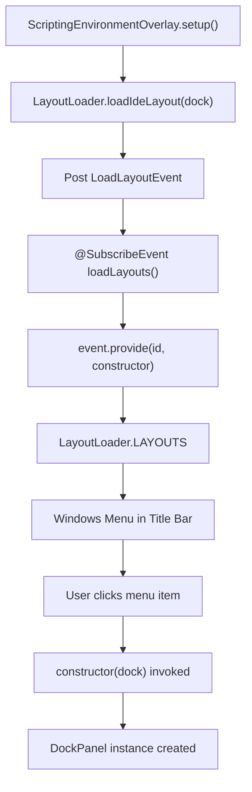
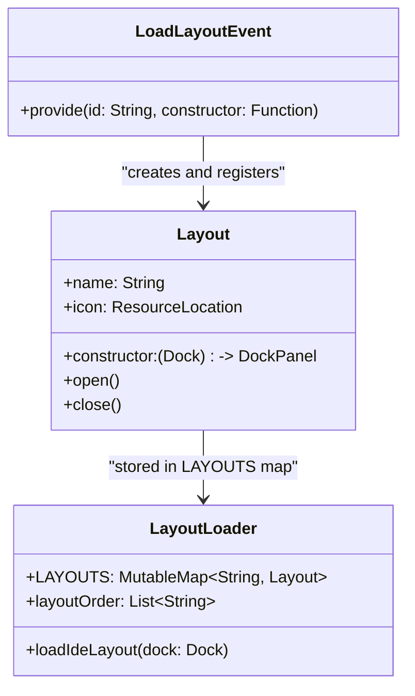
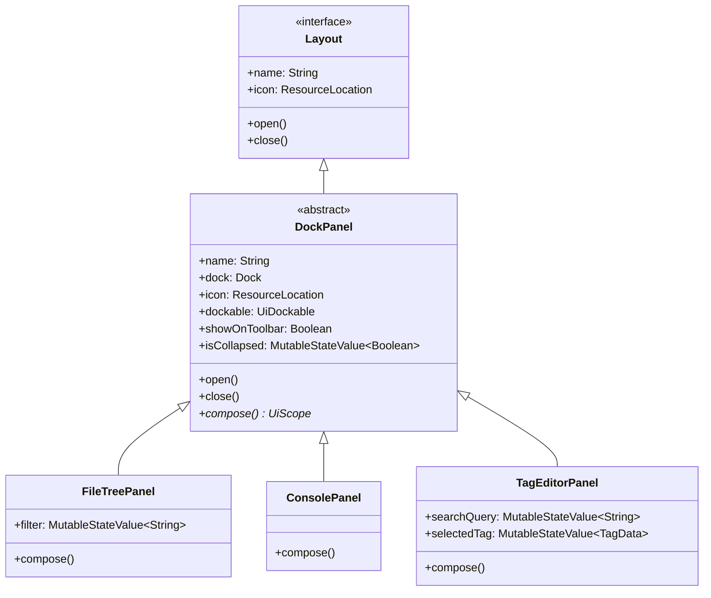
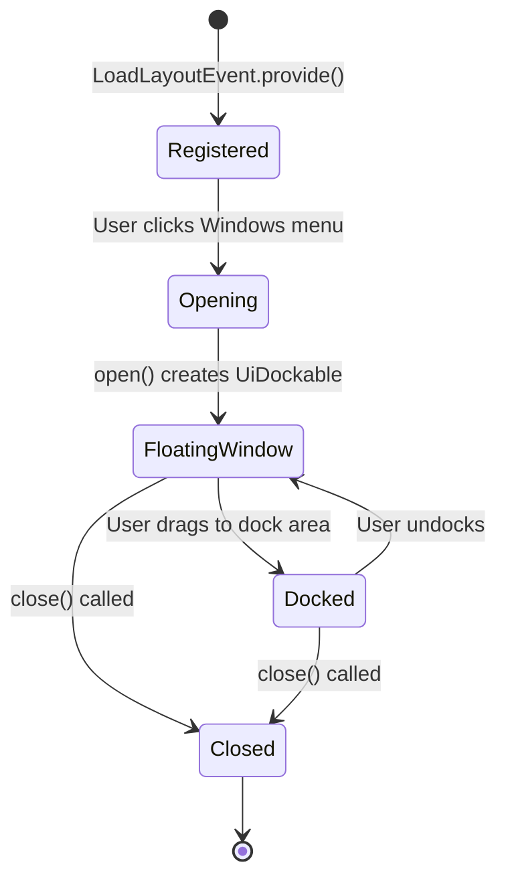
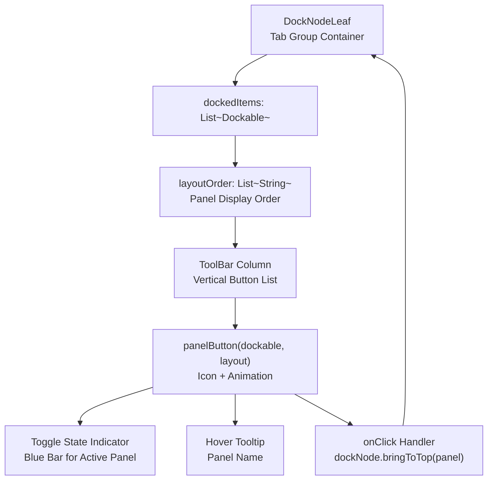
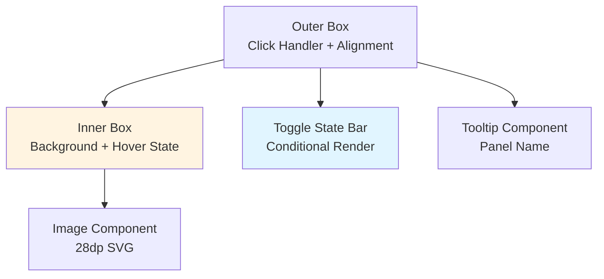
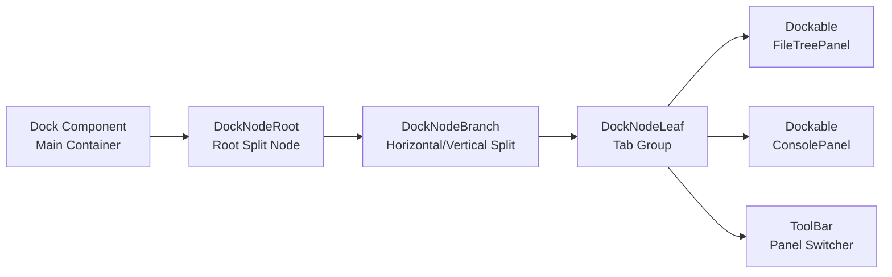

# Panel System and Registration

<details>
<summary>Relevant source files</summary>

The following files were used as context for generating this wiki page:

- [src/main/java/ru/hollowhorizon/hollowengine/client/gui/DashboardScreen.kt](src/main/java/ru/hollowhorizon/hollowengine/client/gui/DashboardScreen.kt)
- [src/main/java/ru/hollowhorizon/hollowengine/client/gui/NPCToolGui.kt](src/main/java/ru/hollowhorizon/hollowengine/client/gui/NPCToolGui.kt)
- [src/main/java/ru/hollowhorizon/hollowengine/client/gui/codeblocks/BlockContextMenu.kt](src/main/java/ru/hollowhorizon/hollowengine/client/gui/codeblocks/BlockContextMenu.kt)
- [src/main/java/ru/hollowhorizon/hollowengine/client/gui/modificators/BiomeModificator.kt](src/main/java/ru/hollowhorizon/hollowengine/client/gui/modificators/BiomeModificator.kt)
- [src/main/java/ru/hollowhorizon/hollowengine/client/gui/npcs/NPCMenuGui.kt](src/main/java/ru/hollowhorizon/hollowengine/client/gui/npcs/NPCMenuGui.kt)
- [src/main/java/ru/hollowhorizon/hollowengine/client/gui/scripting/FileNode.kt](src/main/java/ru/hollowhorizon/hollowengine/client/gui/scripting/FileNode.kt)
- [src/main/java/ru/hollowhorizon/hollowengine/client/gui/scripting/GuiPackets.kt](src/main/java/ru/hollowhorizon/hollowengine/client/gui/scripting/GuiPackets.kt)
- [src/main/java/ru/hollowhorizon/hollowengine/client/gui/scripting/ServerIdeWarning.kt](src/main/java/ru/hollowhorizon/hollowengine/client/gui/scripting/ServerIdeWarning.kt)
- [src/main/java/ru/hollowhorizon/hollowengine/client/gui/scripting/files/FilesBar.kt](src/main/java/ru/hollowhorizon/hollowengine/client/gui/scripting/files/FilesBar.kt)
- [src/main/java/ru/hollowhorizon/hollowengine/client/gui/scripting/files/ImageFile.kt](src/main/java/ru/hollowhorizon/hollowengine/client/gui/scripting/files/ImageFile.kt)
- [src/main/java/ru/hollowhorizon/hollowengine/client/gui/scripting/files/prefabs/EntityEditorScreen.kt](src/main/java/ru/hollowhorizon/hollowengine/client/gui/scripting/files/prefabs/EntityEditorScreen.kt)
- [src/main/java/ru/hollowhorizon/hollowengine/client/gui/scripting/files/prefabs/ItemPrefabEditorFile.kt](src/main/java/ru/hollowhorizon/hollowengine/client/gui/scripting/files/prefabs/ItemPrefabEditorFile.kt)
- [src/main/java/ru/hollowhorizon/hollowengine/client/gui/scripting/files/prefabs/PrefabEditorFile.kt](src/main/java/ru/hollowhorizon/hollowengine/client/gui/scripting/files/prefabs/PrefabEditorFile.kt)
- [src/main/java/ru/hollowhorizon/hollowengine/client/gui/scripting/panels/ConsolePanel.kt](src/main/java/ru/hollowhorizon/hollowengine/client/gui/scripting/panels/ConsolePanel.kt)
- [src/main/java/ru/hollowhorizon/hollowengine/client/gui/scripting/panels/DockPanel.kt](src/main/java/ru/hollowhorizon/hollowengine/client/gui/scripting/panels/DockPanel.kt)
- [src/main/java/ru/hollowhorizon/hollowengine/client/gui/scripting/panels/FileTreePanel.kt](src/main/java/ru/hollowhorizon/hollowengine/client/gui/scripting/panels/FileTreePanel.kt)
- [src/main/java/ru/hollowhorizon/hollowengine/client/gui/scripting/panels/LanguageEditorPanel.kt](src/main/java/ru/hollowhorizon/hollowengine/client/gui/scripting/panels/LanguageEditorPanel.kt)
- [src/main/java/ru/hollowhorizon/hollowengine/client/gui/scripting/theme/ThemeEditor.kt](src/main/java/ru/hollowhorizon/hollowengine/client/gui/scripting/theme/ThemeEditor.kt)
- [src/main/java/ru/hollowhorizon/hollowengine/client/gui/scripting/tools/ToolWindow.kt](src/main/java/ru/hollowhorizon/hollowengine/client/gui/scripting/tools/ToolWindow.kt)
- [src/main/java/ru/hollowhorizon/hollowengine/client/keys/HollowEngineKeybinds.kt](src/main/java/ru/hollowhorizon/hollowengine/client/keys/HollowEngineKeybinds.kt)
- [src/main/resources/assets/hollowengine/lang/en_us.json](src/main/resources/assets/hollowengine/lang/en_us.json)
- [src/main/resources/assets/hollowengine/lang/ru_ru.json](src/main/resources/assets/hollowengine/lang/ru_ru.json)

</details>


This page documents the panel registration and management system in HollowEngine's IDE. Panels are dockable UI components that provide specific functionality like file browsing, console output, documentation viewing, and tag editing. This page covers the event-based panel registration system, the `LayoutLoader` that manages registered panels, the base `DockPanel` class, and the complete list of available panels.

For information about the overall docking system architecture, see [Docking System](#3.2). For specific details about the file tree functionality, see [File Tree and Project Explorer](#3.3). For the title bar and Windows menu that opens panels, see [Title Bar and Menu System](#3.4).

## Panel Registration via LoadLayoutEvent

Panels are registered dynamically using the `LoadLayoutEvent`, an event-driven system that allows modular registration of IDE panels. This event is fired during IDE initialization and handled by event listeners annotated with `@SubscribeEvent`.

### Registration Flow

**Diagram: Panel Registration and Discovery Flow**



**Sources:**
- [src/main/java/ru/hollowhorizon/hollowengine/client/gui/scripting/docking/IdeLayouts.kt:6-14]()
- [src/main/java/ru/hollowhorizon/hollowengine/client/gui/scripting/titlebar/BarContents.kt:66-78]()

### LoadLayoutEvent API

The `LoadLayoutEvent` provides a single registration method: `provide(id: String, constructor: (Dock) -> DockPanel)`.

**Parameters:**
- `id`: A translation key string that identifies the panel (e.g., `"hollowengine.gui.ide.project_tree"`)
- `constructor`: A function reference that creates a panel instance given a `Dock` component

**Example Registration:**

The registration handler in [src/main/java/ru/hollowhorizon/hollowengine/client/gui/scripting/docking/IdeLayouts.kt:7-14]() shows how panels are registered:

```kotlin
@SubscribeEvent
fun loadLayouts(event: LoadLayoutEvent) {
    event.provide("hollowengine.gui.ide.project_tree", ::FileTreePanel)
    event.provide("hollowengine.gui.ide.console", ::ConsolePanel)
    event.provide("hollowengine.gui.ide.docs", ::DocsPanel)
    event.provide("hollowengine.gui.ide.markdown", ::MarkdownEditorPanel)
    event.provide("hollowengine.gui.ide.graph", ::GraphEditorPanel)
    event.provide("hollowengine.gui.ide.tags", ::TagEditorPanel)
}
```

Each `provide()` call stores the panel constructor in `LayoutLoader.LAYOUTS` with the given ID as the key.

**Sources:**
- [src/main/java/ru/hollowhorizon/hollowengine/client/gui/scripting/docking/IdeLayouts.kt:6-14]()

### Layout Data Structure

**Diagram: Layout Storage and Retrieval**



The `Layout` interface defines the contract for registered panels. Each `Layout` implementation stores:
- `name`: The translation key identifier
- `icon`: A `ResourceLocation` pointing to the panel's icon
- Constructor function for creating panel instances

**Sources:**
- [src/main/java/ru/hollowhorizon/hollowengine/client/gui/scripting/docking/IdeLayouts.kt:6-14]()
- [src/main/java/ru/hollowhorizon/hollowengine/client/gui/scripting/panels/DockPanel.kt:10-14]()

## LayoutLoader

`LayoutLoader` is a singleton object that manages the registry of available panels. It maintains a map of panel IDs to `Layout` instances and controls the order in which panels appear in the Windows menu.

### LAYOUTS Map

The `LAYOUTS` map stores all registered panels as key-value pairs where:
- **Key**: Translation key string (e.g., `"hollowengine.gui.ide.project_tree"`)
- **Value**: `Layout` instance containing the panel's constructor and metadata

Panels are added to this map when `LoadLayoutEvent.provide()` is called during initialization.

**Sources:**
- [src/main/java/ru/hollowhorizon/hollowengine/client/gui/scripting/titlebar/BarContents.kt:70-77]()

### Layout Order

The `layoutOrder` list defines the display order of panels in UI elements like the Windows menu and panel toolbar. This list is referenced when iterating over panels to ensure consistent ordering.

**Sources:**
- [src/main/java/ru/hollowhorizon/hollowengine/client/gui/scripting/tools/ToolWindow.kt:11]()

## Available Panels

HollowEngine's IDE includes six registered panels, each providing specific functionality. All panels are registered in [src/main/java/ru/hollowhorizon/hollowengine/client/gui/scripting/docking/IdeLayouts.kt:7-14]().

### Registered Panels Table

| Panel ID | Class | Icon | English Name | Purpose |
|----------|-------|------|--------------|---------|
| `hollowengine.gui.ide.project_tree` | `FileTreePanel` | `CODE_EDITOR` | "Project" | File tree browser with file operations |
| `hollowengine.gui.ide.console` | `ConsolePanel` | Terminal icon | "Terminal" | Console output and logs |
| `hollowengine.gui.ide.docs` | `DocsPanel` | Docs icon | "Documentation" | In-IDE documentation viewer |
| `hollowengine.gui.ide.markdown` | `MarkdownEditorPanel` | Markdown icon | "Markdown" | Markdown file editor and preview |
| `hollowengine.gui.ide.graph` | `GraphEditorPanel` | Graph icon | "Graph Editor" | Visual graph/state machine editor |
| `hollowengine.gui.ide.tags` | `TagEditorPanel` | `RECIPES` icon | "Tag Editor" | Minecraft tag editing UI |

**Sources:**
- [src/main/java/ru/hollowhorizon/hollowengine/client/gui/scripting/docking/IdeLayouts.kt:7-14]()
- [src/main/resources/assets/hollowengine/lang/en_us.yml:34-42]()
- [src/main/resources/assets/hollowengine/lang/ru_ru.yml:33-40]()

### Panel Descriptions

**FileTreePanel** ([src/main/java/ru/hollowhorizon/hollowengine/client/gui/scripting/panels/FileTreePanel.kt:13-48]())
- Displays the hierarchical file structure of the project
- Provides search/filtering functionality
- Opens files in appropriate editors on click
- See [File Tree and Project Explorer](#3.3) for details

**ConsolePanel**
- Displays script execution output and system messages
- Read-only log viewer for debugging

**DocsPanel**
- In-IDE documentation browser
- Displays help content and API reference

**MarkdownEditorPanel**
- Markdown file editor with live preview
- Syntax highlighting and formatting

**GraphEditorPanel**
- Visual editor for state machines and graphs
- Used for animation state graphs
- Node-based editing with connections

**TagEditorPanel** ([src/main/java/ru/hollowhorizon/hollowengine/client/gui/scripting/panels/TagEditorPanel.kt:20-556]())
- UI for editing Minecraft block and item tags
- Search and filter by tag type
- Add/remove tag entries
- Statistics display showing tag counts
- See [Tag Editor](#10.1) for detailed documentation

**Sources:**
- [src/main/java/ru/hollowhorizon/hollowengine/client/gui/scripting/panels/FileTreePanel.kt:13-48]()
- [src/main/java/ru/hollowhorizon/hollowengine/client/gui/scripting/panels/TagEditorPanel.kt:20-556]()
- [src/main/resources/assets/hollowengine/lang/en_us.yml:34-42]()

## DockPanel Base Class

All IDE panels inherit from the abstract `DockPanel` class, which provides integration with Kool UI's docking system and standardizes panel behavior.

**Diagram: DockPanel Class Hierarchy**



**Key Properties and Methods:**

| Property/Method | Type | Description |
|-----------------|------|-------------|
| `name` | `String` | Translation key identifier for the panel |
| `dock` | `Dock` | Reference to the main docking container |
| `icon` | `ResourceLocation` | Icon displayed in menus and toolbars |
| `dockable` | `UiDockable` | Underlying Kool UI dockable component |
| `showOnToolbar` | `Boolean` | Whether to show panel switcher toolbar when docked |
| `isCollapsed` | `MutableStateValue<Boolean>` | Panel minimize/maximize state |
| `open()` | Function | Creates and displays the panel window |
| `close()` | Function | Removes the panel from the dock |
| `compose()` | Abstract Function | Defines the panel's UI content |

**Sources:**
- [src/main/java/ru/hollowhorizon/hollowengine/client/gui/scripting/panels/DockPanel.kt:14-82]()

### Panel Lifecycle

Panels implement the `open()` and `close()` methods defined by the `Layout` interface to manage their lifecycle within the IDE.

**Diagram: Panel Lifecycle**



**open() Method** ([src/main/java/ru/hollowhorizon/hollowengine/client/gui/scripting/panels/DockPanel.kt:38-70]())

When a panel is opened:
1. Checks if `surface` already exists (prevents duplicate windows)
2. Sets initial floating position and size using `dockable.floatingX/Y/Width/Height`
3. Creates a `WindowSurface` with the panel's content
4. Adds the surface to the dock via `dock.addDockableSurface()`
5. Renders title bar using `FileTitleBar` component
6. Optionally renders `ToolBar` for panel switching when docked

**close() Method** ([src/main/java/ru/hollowhorizon/hollowengine/client/gui/scripting/panels/DockPanel.kt:72-78]())

When a panel is closed:
1. Removes the surface from the dock via `dock.removeDockableSurface()`
2. Releases the surface with a 1-frame delay
3. Clears the `surface` reference

**Sources:**
- [src/main/java/ru/hollowhorizon/hollowengine/client/gui/scripting/panels/DockPanel.kt:38-78]()

## Panel Switching UI

### ToolBar Component

The `ToolBar` component renders a vertical list of icon buttons for switching between panels within a dock node. It appears on the left or right side of a `DockNodeLeaf` (tab group).



**ToolBar Implementation:**

The toolbar is created via `UiScope.ToolBar(panel: DockPanel, isLeft: Boolean)` at [src/main/java/ru/hollowhorizon/hollowengine/client/gui/scripting/tools/ToolWindow.kt:15-27](). It:

1. Retrieves the parent `DockNodeLeaf` from `panel.dockable.dockedTo`
2. Sorts panels by `layoutOrder` to maintain consistent display order
3. Creates a `panelButton` for each docked item
4. Handles left vs right alignment based on the `isLeft` parameter

**Panel Button Features:**

Each panel button includes:
- **28dp × 28dp SVG icon** from the panel's `Layout.icon` property
- **Animated toggle indicator**: A blue rounded bar appears on active panels with `Easing.quadRev` animation
- **Hover effect**: Background color transitions using `animateColorAsState`
- **Tooltip**: Shows translated panel name on hover (500ms delay)
- **Click handler**: Calls `dockNode.bringToTop(panel)` to switch to the panel

**Animation System:**

Toggle animations use a global `animators` map storing `AnimatedFloat` instances per panel at [src/main/java/ru/hollowhorizon/hollowengine/client/gui/scripting/tools/ToolWindow.kt:36](). When a panel is activated:
1. `animators[panel]?.start()` triggers the animation
2. `Easing.quadRev` provides smooth ease-out effect
3. Blue indicator bar grows using `Grow(0.5f * anim)` modifier

**Visual States:**

| State | Background Color | Indicator | Position |
|-------|------------------|-----------|----------|
| Default | `colors.background` | None | N/A |
| Hovered | `IdeTheme.hoveredColors.background` | None | N/A |
| Active | `colors.background` | Blue bar | Left/Right edge |
| Active + Hovered | `IdeTheme.hoveredColors.background` | Blue bar | Left/Right edge |

**Sources:**
- [src/main/java/ru/hollowhorizon/hollowengine/client/gui/scripting/tools/ToolWindow.kt:15-119]()
- [src/main/java/ru/hollowhorizon/hollowengine/client/gui/scripting/docking/IdeLayouts.kt:9-10]()

### Icon Button Implementation

The `iconButton` function at [src/main/java/ru/hollowhorizon/hollowengine/client/gui/scripting/tools/ToolWindow.kt:38-119]() provides a reusable component for panel switching with extensive visual feedback.

**Component Structure:**



**Properties:**

- `layout`: The `Layout` object containing icon path and panel metadata
- `panel`: The `Dockable` instance representing the panel
- `tooltip`: Optional translated panel name string
- `toggleState`: Boolean indicating if the panel is currently active
- `isLeft`: Boolean controlling toggle indicator alignment
- `onClick`: Callback invoked when the button is clicked

**Styling Details:**

- Background: Rounded rectangle with `sizes.smallGap` radius
- Padding: `sizes.smallGap` on all sides
- Margin: `sizes.smallGap` spacing between buttons
- Toggle indicator: `sizes.borderWidth * 2` width, `Grow(0.5f * anim)` height
- Icon: 28dp × 28dp, centered alignment

**Sources:**
- [src/main/java/ru/hollowhorizon/hollowengine/client/gui/scripting/tools/ToolWindow.kt:38-119]()
- [src/main/java/ru/hollowhorizon/hollowengine/client/gui/kool/UiColors.kt:1-43]()

## Panel Integration with Docking System

Panels integrate with Kool UI's `Dock` component through the `Dockable` interface. Each panel becomes a dockable item that can be arranged in the IDE layout.



**Key Integration Points:**

1. **Panel Instantiation**: When a layout is loaded, panel constructors receive the `Dock` instance
2. **Content Composition**: Each panel's `compose()` method defines its UI content
3. **Dockable Registration**: Panels are added to `DockNodeLeaf` instances via layout configuration
4. **Tab Management**: Multiple panels in the same leaf form a tab group with the toolbar for switching

**Sources:**
- [src/main/java/ru/hollowhorizon/hollowengine/client/gui/scripting/ScriptingEnvironmentScreen.kt:80-95]()
- [src/main/java/ru/hollowhorizon/hollowengine/client/gui/scripting/tools/ToolWindow.kt:15-27]()