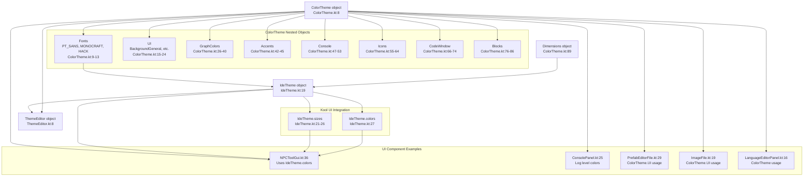
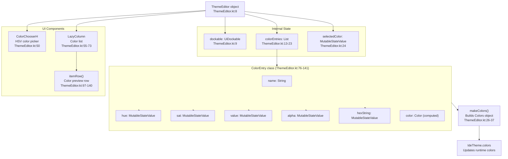
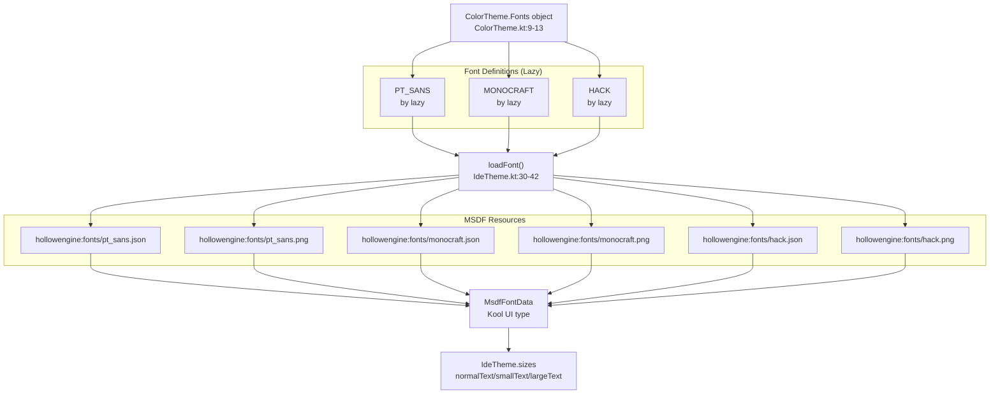
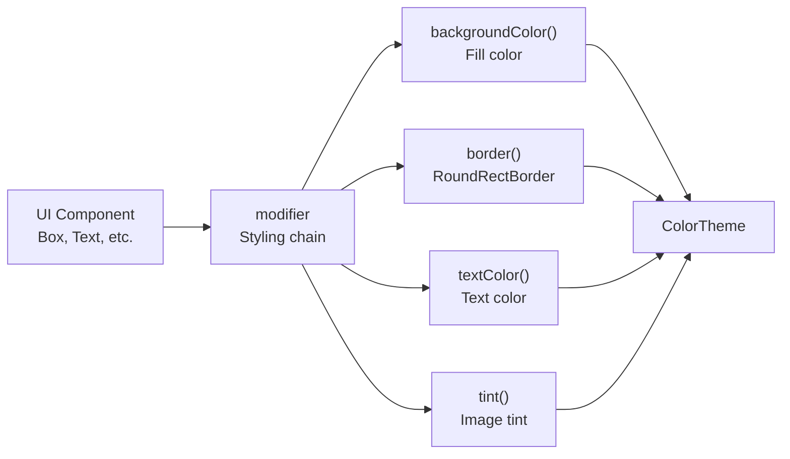
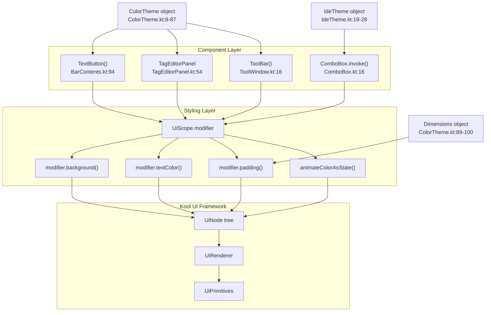

# Theming and Styling

<details>
<summary>Relevant source files</summary>

The following files were used as context for generating this wiki page:

- [src/main/java/ru/hollowhorizon/hollowengine/client/gui/DashboardScreen.kt](src/main/java/ru/hollowhorizon/hollowengine/client/gui/DashboardScreen.kt)
- [src/main/java/ru/hollowhorizon/hollowengine/client/gui/NPCToolGui.kt](src/main/java/ru/hollowhorizon/hollowengine/client/gui/NPCToolGui.kt)
- [src/main/java/ru/hollowhorizon/hollowengine/client/gui/codeblocks/BlockContextMenu.kt](src/main/java/ru/hollowhorizon/hollowengine/client/gui/codeblocks/BlockContextMenu.kt)
- [src/main/java/ru/hollowhorizon/hollowengine/client/gui/modificators/BiomeModificator.kt](src/main/java/ru/hollowhorizon/hollowengine/client/gui/modificators/BiomeModificator.kt)
- [src/main/java/ru/hollowhorizon/hollowengine/client/gui/npcs/NPCMenuGui.kt](src/main/java/ru/hollowhorizon/hollowengine/client/gui/npcs/NPCMenuGui.kt)
- [src/main/java/ru/hollowhorizon/hollowengine/client/gui/scripting/GuiPackets.kt](src/main/java/ru/hollowhorizon/hollowengine/client/gui/scripting/GuiPackets.kt)
- [src/main/java/ru/hollowhorizon/hollowengine/client/gui/scripting/ServerIdeWarning.kt](src/main/java/ru/hollowhorizon/hollowengine/client/gui/scripting/ServerIdeWarning.kt)
- [src/main/java/ru/hollowhorizon/hollowengine/client/gui/scripting/files/ImageFile.kt](src/main/java/ru/hollowhorizon/hollowengine/client/gui/scripting/files/ImageFile.kt)
- [src/main/java/ru/hollowhorizon/hollowengine/client/gui/scripting/files/prefabs/EntityEditorScreen.kt](src/main/java/ru/hollowhorizon/hollowengine/client/gui/scripting/files/prefabs/EntityEditorScreen.kt)
- [src/main/java/ru/hollowhorizon/hollowengine/client/gui/scripting/files/prefabs/ItemPrefabEditorFile.kt](src/main/java/ru/hollowhorizon/hollowengine/client/gui/scripting/files/prefabs/ItemPrefabEditorFile.kt)
- [src/main/java/ru/hollowhorizon/hollowengine/client/gui/scripting/files/prefabs/PrefabEditorFile.kt](src/main/java/ru/hollowhorizon/hollowengine/client/gui/scripting/files/prefabs/PrefabEditorFile.kt)
- [src/main/java/ru/hollowhorizon/hollowengine/client/gui/scripting/panels/ConsolePanel.kt](src/main/java/ru/hollowhorizon/hollowengine/client/gui/scripting/panels/ConsolePanel.kt)
- [src/main/java/ru/hollowhorizon/hollowengine/client/gui/scripting/panels/LanguageEditorPanel.kt](src/main/java/ru/hollowhorizon/hollowengine/client/gui/scripting/panels/LanguageEditorPanel.kt)
- [src/main/java/ru/hollowhorizon/hollowengine/client/gui/scripting/theme/ThemeEditor.kt](src/main/java/ru/hollowhorizon/hollowengine/client/gui/scripting/theme/ThemeEditor.kt)
- [src/main/resources/assets/hollowengine/lang/en_us.json](src/main/resources/assets/hollowengine/lang/en_us.json)
- [src/main/resources/assets/hollowengine/lang/ru_ru.json](src/main/resources/assets/hollowengine/lang/ru_ru.json)

</details>


This document describes the centralized theming and styling system used throughout HollowEngine's IDE. The system consists of:

- **`ColorTheme`** - Semantic color palettes organized by UI context
- **`IdeTheme`** - Integration layer between `ColorTheme` and Kool UI framework
- **`Dimensions`** - Consistent spacing constants
- **Font system** - MSDF font loading and configuration

All UI components in the IDE reference these centralized theme objects to maintain visual consistency across panels, editors, and tools.

---

## Overview

HollowEngine's theming architecture has three main layers:

1. **`ColorTheme`** [src/main/java/ru/hollowhorizon/hollowengine/client/gui/colors/ColorTheme.kt:8-87]() - Defines semantic color constants organized into nested objects (`UI`, `Blocks`, `Console`, etc.)
2. **`IdeTheme`** [src/main/java/ru/hollowhorizon/hollowengine/client/gui/scripting/theme/IdeTheme.kt:19-28]() - Wraps `ColorTheme` into Kool UI's `Sizes` and `Colors` objects
3. **`ThemeEditor`** [src/main/java/ru/hollowhorizon/hollowengine/client/gui/scripting/theme/ThemeEditor.kt:8-141]() - Runtime theme customization interface accessible via Settings menu

This separation allows theme definitions to remain independent of the UI framework while providing a convenient integration point for all UI components. The theme editor enables real-time color customization without code changes.

**Sources:** [src/main/java/ru/hollowhorizon/hollowengine/client/gui/colors/ColorTheme.kt:1-102](), [src/main/java/ru/hollowhorizon/hollowengine/client/gui/scripting/theme/IdeTheme.kt:1-42](), [src/main/java/ru/hollowhorizon/hollowengine/client/gui/scripting/theme/ThemeEditor.kt:1-141]()

---

## Theme Architecture

**Theme Architecture and Data Flow**



The `ColorTheme` object [src/main/java/ru/hollowhorizon/hollowengine/client/gui/colors/ColorTheme.kt:8-87]() is organized into nested objects, each serving a specific UI domain. UI components can reference `ColorTheme` directly or use `IdeTheme` for Kool UI integration. The `ThemeEditor` provides runtime customization of the color scheme.

**Sources:** [src/main/java/ru/hollowhorizon/hollowengine/client/gui/colors/ColorTheme.kt:8-87](), [src/main/java/ru/hollowhorizon/hollowengine/client/gui/scripting/theme/IdeTheme.kt:19-28](), [src/main/java/ru/hollowhorizon/hollowengine/client/gui/scripting/theme/ThemeEditor.kt:8-141](), [src/main/java/ru/hollowhorizon/hollowengine/client/gui/NPCToolGui.kt:36-84](), [src/main/java/ru/hollowhorizon/hollowengine/client/gui/scripting/panels/ConsolePanel.kt:25-216]()

---

## IdeTheme Integration

`IdeTheme` [src/main/java/ru/hollowhorizon/hollowengine/client/gui/scripting/theme/IdeTheme.kt:19-28]() serves as the integration layer between HollowEngine's `ColorTheme` and Kool UI's theming system:

```kotlin
object IdeTheme {
    val sizes = Sizes.large.copy(
        normalText = MsdfFont(ColorTheme.Fonts.MONOCRAFT, Dimensions.FontNormal),
        smallText = MsdfFont(ColorTheme.Fonts.MONOCRAFT, Dimensions.FontSmall),
        largeText = MsdfFont(ColorTheme.Fonts.MONOCRAFT, Dimensions.FontLarge),
        borderWidth = Dp.roundToWholePx(1.5f)
    )
    var colors = Colors.darkColors()
}
```

**Key Properties:**

| Property | Type | Purpose |
|----------|------|---------|
| `sizes` | `Sizes` | Font sizes, spacing, and border widths for Kool UI |
| `colors` | `Colors` | Kool UI color scheme (defaults to dark theme) |

The `sizes` object wraps `ColorTheme.Fonts` into Kool UI's `MsdfFont` type and configures font sizes from `Dimensions`. UI components typically access `sizes` and `colors` through UiScope properties:

```kotlin
// From BarContents.kt - Accessing sizes and colors
modifier.background(RoundRectBackground(color, sizes.smallGap))

Text(text) {
    modifier.textColor(colors.onBackground)
}
```

**Sources:** [src/main/java/ru/hollowhorizon/hollowengine/client/gui/scripting/theme/IdeTheme.kt:19-28](), [src/main/java/ru/hollowhorizon/hollowengine/client/gui/scripting/titlebar/BarContents.kt:105-138]()

---

## Color Palettes

### UI Colors

The `ColorTheme.UI` object defines the primary color hierarchy for all interface elements:

| Color | Hex Value | Purpose |
|-------|-----------|---------|
| `BackgroundGeneral` | `#1E1F22` | Main window backgrounds, darkest layer |
| `BackgroundSecondary` | `#24272E` | Secondary panels, toolbars |
| `BackgroundElements` | `#31343D` | Interactive elements (buttons, inputs) |
| `BackgroundAccent` | `#5F6677` | Borders, subtle highlights |
| `BackgroundDarker` | `#1E2127` | Darker variants for depth |
| `WhiteReplacement` | `#C4CBDA` | Text color, replaces pure white |
| `ForegroundSecondary` | `#2A2E35` | Alternative foreground |

These colors create a 5-level depth hierarchy, with each level slightly lighter than the previous. The `WhiteReplacement` color is used instead of pure white to reduce eye strain.

**Sources:** [src/main/java/ru/hollowhorizon/hollowengine/client/gui/colors/ColorTheme.kt:15-24]()

---

### Graph Colors

Colors for the animation graph editor [see [Graph Editor](#11.3)]:

| Color | Hex Value | Purpose |
|-------|-----------|---------|
| `GridBackground` | `#181818` | Graph canvas background |
| `GridLines` | `#252525` | Grid line color |
| `NodeBackground` | `#424242` | Default node fill |
| `SelectionBorder` | `#D77F1C` | Selected node outline |
| `StateEntry` | `#6BC872` | Entry state nodes (green) |
| `StateExit` | `#DB5C5C` | Exit state nodes (red) |
| `StateAny` | `#5BB2E8` | Any state nodes (blue) |
| `StateDefault` | `#D77F1C` | Active state nodes (orange) |
| `StateNormal` | `#606060` | Normal state nodes (gray) |
| `LinkColor` | `#A07040` | Connection arrows |

**Sources:** [src/main/java/ru/hollowhorizon/hollowengine/client/gui/colors/ColorTheme.kt:26-40]()

---

### Accent Colors

Primary action colors used for buttons and highlights:

- `Main`: `#D77F1C` - Primary accent (orange), used for play buttons, selections, borders
- `Success`: `#56C351` - Success state (green), used for run/execute actions

**Sources:** [src/main/java/ru/hollowhorizon/hollowengine/client/gui/colors/ColorTheme.kt:42-45]()

---

### Console Colors

Log output styling in the console panel:

| Color | Hex Value | Log Level |
|-------|-----------|-----------|
| `Debug` | `#393D48` | Debug messages |
| `Info` | `#7BBA2E` | Info messages (green) |
| `Warning` | `#EBBC4D` | Warning messages (yellow) |
| `Error` | `#DB5C5C` | Error messages (red) |
| `OutputTime` | `#9B8DFF` | Timestamps (purple) |

**Sources:** [src/main/java/ru/hollowhorizon/hollowengine/client/gui/colors/ColorTheme.kt:47-53]()

---

### Icon Colors

File type icons in the file tree are colored by category:

| Color | Hex Value | File Type |
|-------|-----------|-----------|
| `NPC` | `#6BC872` | .npc files (green) |
| `Data` | `#60C0B5` | Data files (teal) |
| `Image` | `#5BB2E8` | Images (light blue) |
| `Camera` | `#548AF7` | Camera files (blue) |
| `Script` | `#9471FF` | .kts scripts (purple) |
| `Archives` | `#FF954A` | Archive files (orange) |
| `Blocks` | `#E5986C` | .bc block files (tan) |
| `Assets` | `#A1DF55` | Asset files (lime) |

**Sources:** [src/main/java/ru/hollowhorizon/hollowengine/client/gui/colors/ColorTheme.kt:55-64]()

---

### Code Window Colors

Syntax highlighting colors for the text editor [see [Syntax Highlighting and Analysis](#4.3)]:

| Color | Hex Value | Token Type |
|-------|-----------|-----------|
| `LineNumbers` | `#676C77` | Gutter line numbers |
| `Libraries` | `#8D93A1` | Import statements |
| `MainCode` | `#D7DFEF` | Default text |
| `Calls` | `#FF9B61` | Function calls (orange) |
| `Methods` | `#E4B348` | Method names (yellow) |
| `AccentCode` | `#E590E4` | Keywords (magenta) |
| `Selection` | `#3399FF` | Selected text background |

**Sources:** [src/main/java/ru/hollowhorizon/hollowengine/client/gui/colors/ColorTheme.kt:66-74]()

---

### Block Colors

Visual programming block categories [see [Block Rendering Pipeline](#5.4)]:

| Color | Hex Value | Category |
|-------|-----------|----------|
| `Loops` | `#EB903F` | Loop blocks (orange) |
| `DataTypes` | `#F3BD3E` | Data type blocks (yellow) |
| `NPC` | `#7EB542` | NPC action blocks (green) |
| `LogicTeal` | `#1DB07D` | Logic operators (teal) |
| `Math` | `#58B2EA` | Math operations (blue) |
| `LogicBlue` | `#3C44A0` | Boolean logic (dark blue) |
| `Variables` | `#7248DD` | Variable blocks (purple) |
| `MainCore` | `#A666EA` | Core blocks (light purple) |
| `Events` | `#C94072` | Event blocks (pink) |

**Sources:** [src/main/java/ru/hollowhorizon/hollowengine/client/gui/colors/ColorTheme.kt:76-86]()

---

## Dimensions System

The `Dimensions` object [src/main/java/ru/hollowhorizon/hollowengine/client/gui/colors/ColorTheme.kt:89-100]() provides consistent spacing values:

```kotlin
object Dimensions {
    var PaddingSmall = Dp(2f)         // 2dp - Minimal spacing
    var PaddingNormal = Dp(4f)        // 4dp - Standard spacing
    var PaddingMedium = Dp(8f)        // 8dp - Medium spacing
    var PaddingHuge = Dp(16f)         // 16dp - Large spacing
    var PaddingLarge = Dp(24f)        // 24dp - Extra large
    var PaddingExtraLarge = Dp(32f)   // 32dp - Maximum spacing
    
    var FontNormal = 16f              // Default font size (points)
    var FontSmall = 12f               // Small font size
    var FontLarge = 20f               // Large font size
}
```

### Spacing Scale

| Name | Value | Common Uses |
|------|-------|-------------|
| `PaddingSmall` | 2dp | Border radius, icon margins |
| `PaddingNormal` | 4dp | Button padding, text margins |
| `PaddingMedium` | 8dp | Panel padding, horizontal spacing |
| `PaddingHuge` | 16dp | Large button size, icon size |
| `PaddingLarge` | 24dp | Title bar height, panel sections |
| `PaddingExtraLarge` | 32dp | Major layout spacing |

An extension property combines values: `PaddingLargeSpacing = PaddingLarge + PaddingNormal = 28dp` [src/main/java/ru/hollowhorizon/hollowengine/client/gui/colors/ColorTheme.kt:102]().

### Usage Examples

**Title Bar Buttons** [src/main/java/ru/hollowhorizon/hollowengine/client/gui/scripting/titlebar/BarContents.kt:40-41]():

```kotlin
modifier.padding(vertical = Dimensions.PaddingNormal)
modifier.margin(horizontal = Dimensions.PaddingMedium)
    .padding(Dimensions.PaddingNormal)
```

**Toolbar Layout** [src/main/java/ru/hollowhorizon/hollowengine/client/gui/scripting/tools/ToolWindow.kt:17-18]():

```kotlin
Column(
    Dimensions.PaddingLarge + Dimensions.PaddingSmall + Dimensions.PaddingMedium * 2f,
    Grow.Std
) {
    modifier.backgroundColor(ColorTheme.UI.BackgroundSecondary)
        .margin(top = Dimensions.PaddingNormal)
```

**Tag Editor Panel** [src/main/java/ru/hollowhorizon/hollowengine/client/gui/scripting/panels/TagEditorPanel.kt:59-68]():

```kotlin
Column(Grow.Std, Grow.Std) {
    modifier.padding(Dimensions.PaddingMedium)
    // ...
    Column(Grow(0.4f), Grow.Std) {
        modifier.margin(end = Dimensions.PaddingMedium)
```

All `Dimensions` properties are `var` to allow runtime adjustment for accessibility or different screen densities.

**Sources:** [src/main/java/ru/hollowhorizon/hollowengine/client/gui/colors/ColorTheme.kt:89-102](), [src/main/java/ru/hollowhorizon/hollowengine/client/gui/scripting/files/prefabs/PrefabEditorFile.kt:99-113](), [src/main/java/ru/hollowhorizon/hollowengine/client/gui/scripting/panels/LanguageEditorPanel.kt:28-99]()

---

## Theme Editor

The `ThemeEditor` object [src/main/java/ru/hollowhorizon/hollowengine/client/gui/scripting/theme/ThemeEditor.kt:8-141]() provides a dockable panel for runtime theme customization. Users can access it via the Settings menu (`hollowengine.gui.ide.settings.theme` translation key).

### Architecture



### Color Entry Definitions

The editor manages 9 color entries corresponding to Kool UI's `Colors` properties:

| Index | Name | Default Source | Purpose |
|-------|------|----------------|---------|
| 0 | Primary | `IdeTheme.colors.primary` | Primary action color |
| 1 | Primary variant | `IdeTheme.colors.primaryVariant` | Primary variant |
| 2 | Secondary | `IdeTheme.colors.secondary` | Secondary action color |
| 3 | Secondary variant | `IdeTheme.colors.secondaryVariant` | Secondary variant |
| 4 | Background | `IdeTheme.colors.background` | Main background |
| 5 | Background variant | `IdeTheme.colors.backgroundVariant` | Background variant |
| 6 | On primary | `IdeTheme.colors.onPrimary` | Text on primary |
| 7 | On secondary | `IdeTheme.colors.onSecondary` | Text on secondary |
| 8 | On background | `IdeTheme.colors.onBackground` | Text on background |

### Runtime Theme Updates

Color changes trigger immediate UI updates through state management:

```kotlin
// From ThemeEditor.kt:50-54
ColorChooserH(entry.hue, entry.sat, entry.value, entry.alpha, entry.hexString) {
    surface.triggerUpdate()
    surface.colors = makeColors()
    ideSurface.colors = surface.colors
}
```

The `makeColors()` function [src/main/java/ru/hollowhorizon/hollowengine/client/gui/scripting/theme/ThemeEditor.kt:26-37]() rebuilds the `Colors` object from current entry values and updates both the editor surface and the IDE surface, propagating changes to all UI components.

### Color Entry State

Each `ColorEntry` maintains HSV color state with bidirectional conversion:

```kotlin
// From ThemeEditor.kt:76-95
private class ColorEntry(val name: String, initColor: Color) {
    val hue = mutableStateOf(0f)
    val sat = mutableStateOf(1f)
    val value = mutableStateOf(1f)
    val alpha = mutableStateOf(1f)
    val hexString = mutableStateOf("")

    val color: Color get() = Color.Hsv(hue.value, sat.value, value.value).toSrgb(a = alpha.value)

    init {
        setColor(initColor)
    }

    fun setColor(color: Color) {
        val hsv = color.toHsv()
        hue.set(hsv.h)
        sat.set(hsv.s)
        value.set(hsv.v)
        alpha.set(color.a)
    }
}
```

The `color` property computes the final RGB color from HSV state, enabling real-time preview in the color list.

**Sources:** [src/main/java/ru/hollowhorizon/hollowengine/client/gui/scripting/theme/ThemeEditor.kt:8-141]()

---

## Font System

**Font Loading Architecture**



### Font Configuration

Three fonts are defined in `ColorTheme.Fonts` [src/main/java/ru/hollowhorizon/hollowengine/client/gui/colors/ColorTheme.kt:9-13](), each loaded lazily:

```kotlin
object Fonts {
    val PT_SANS by lazy { loadFont("hollowengine:fonts/pt_sans.json".rl) }
    val MONOCRAFT by lazy { loadFont("hollowengine:fonts/monocraft.json".rl) }
    val HACK by lazy { loadFont("hollowengine:fonts/hack.json".rl) }
}
```

| Font | Usage | Format |
|------|-------|--------|
| `PT_SANS` | General UI labels and text | MSDF (Multi-channel Signed Distance Field) |
| `MONOCRAFT` | Pixel-art style text, IDE default | MSDF |
| `HACK` | Code editor, monospace contexts | MSDF |

### Font Loading Process

The `loadFont()` function [src/main/java/ru/hollowhorizon/hollowengine/client/gui/scripting/theme/IdeTheme.kt:30-42]() loads MSDF fonts:

```kotlin
fun loadFont(font: ResourceLocation): MsdfFontData {
    val fontInfo = JsonFormat.decodeFromStream<MsdfMeta>(font.stream)
    val msdfMap = Texture2d(
        TexFormat.RGBA,
        mipMapping = MipMapping.Off,
        samplerSettings = SamplerSettings(),
        "MsdfFont:${fontInfo.name}"
    ) {
        Assets.loadImage2d(font.withPath(font.path.removeSuffix(".json") + ".png").toString())
            .getOrDefault(SingleColorTexture.getColorTextureData(Color.BLACK))
    }
    return MsdfFontData(msdfMap, fontInfo)
}
```

**Loading Steps:**

1. Deserialize `.json` metadata containing glyph metrics
2. Load corresponding `.png` texture atlas
3. Create `Texture2d` with RGBA format and no mipmapping
4. Return `MsdfFontData` wrapping texture and metadata

MSDF fonts render sharply at any scale, making them ideal for UI that supports zooming or different screen densities.

### Font Integration in IdeTheme

`IdeTheme.sizes` wraps the fonts for use in Kool UI components:

```kotlin
val sizes = Sizes.large.copy(
    normalText = MsdfFont(ColorTheme.Fonts.MONOCRAFT, Dimensions.FontNormal),
    smallText = MsdfFont(ColorTheme.Fonts.MONOCRAFT, Dimensions.FontSmall),
    largeText = MsdfFont(ColorTheme.Fonts.MONOCRAFT, Dimensions.FontLarge),
    borderWidth = Dp.roundToWholePx(1.5f)
)
```

The `MONOCRAFT` font is used for all three size variants, with pixel sizes defined in `Dimensions`:

| Dimension | Default Value | Usage |
|-----------|---------------|-------|
| `FontNormal` | 16f | Default UI text |
| `FontSmall` | 12f | Small labels, hints |
| `FontLarge` | 20f | Headers, titles |

**Sources:** [src/main/java/ru/hollowhorizon/hollowengine/client/gui/colors/ColorTheme.kt:9-13](), [src/main/java/ru/hollowhorizon/hollowengine/client/gui/scripting/theme/IdeTheme.kt:21-26](), [src/main/java/ru/hollowhorizon/hollowengine/client/gui/scripting/theme/IdeTheme.kt:30-42](), [src/main/java/ru/hollowhorizon/hollowengine/client/gui/colors/ColorTheme.kt:97-100]()

---

## Theme Usage in Different UI Contexts

### NPC Tool GUI

The NPC editor demonstrates theme integration for tool panels:

```kotlin
// From NPCToolGui.kt:48-52
dock.apply {
    borderWidth.set(IdeTheme.sizes.borderWidth)
    borderColor.set(Color("3C3C4AFF"))
    dockingSurface.sizes = IdeTheme.sizes.copy(normalText = MsdfFont(MONOCRAFT, 18f))
    dockingSurface.colors = IdeTheme.colors
```

The dock uses `IdeTheme` for sizes and colors, then customizes the font size to 18pt for tool-specific readability.

**Sources:** [src/main/java/ru/hollowhorizon/hollowengine/client/gui/NPCToolGui.kt:48-52]()

### Console Panel

The console panel uses theme colors for log level styling:

```kotlin
// From ConsolePanel.kt:80-90
Text("hollowengine.gui.console.level".lang) {
    modifier.alignY(AlignmentY.Center).margin(horizontal = sizes.smallGap)
}
ComboBox {
    modifier.width(150.dp).margin(horizontal = sizes.gap).alignY(AlignmentY.Center)
        .items(StandardLevel.entries).selectedIndex(LogMessage.minLevel.use().ordinal).onItemSelected {
            LogMessage.minLevel.set(StandardLevel.entries[it])
            updateFilter()
        }
        .padding(vertical = 0.dp)
}
```

Log messages are colored using `ColorTheme.Console` colors based on `StandardLevel` enum values (DEBUG, INFO, WARNING, ERROR).

**Sources:** [src/main/java/ru/hollowhorizon/hollowengine/client/gui/scripting/panels/ConsolePanel.kt:80-90]()

### Prefab Editor

The prefab editor uses `ColorTheme.UI` extensively for component panels:

```kotlin
// From PrefabEditorFile.kt:99-108
ScrollArea(Grow.Std, Grow.Std, containerModifier = {
    it.backgroundColor(ColorTheme.UI.BackgroundSecondary)
        .margin(end = Dimensions.PaddingMedium)
}, withHorizontalScrollbar = false, vScrollbarModifier = {
    it.colors(
        trackColor = ColorTheme.UI.BackgroundSecondary.withAlpha(0f),
        trackHoverColor = ColorTheme.UI.BackgroundElements,
        color = ColorTheme.UI.BackgroundAccent,
        hoverColor = ColorTheme.UI.WhiteReplacement
    ).width(Dimensions.PaddingMedium)
})
```

This demonstrates the UI hierarchy: `BackgroundSecondary` for container, `BackgroundElements` for hover, `BackgroundAccent` for scrollbar, and `WhiteReplacement` for text.

**Sources:** [src/main/java/ru/hollowhorizon/hollowengine/client/gui/scripting/files/prefabs/PrefabEditorFile.kt:99-108]()

### Image Editor

The image editor uses `ColorTheme` for consistent panel backgrounds:

```kotlin
// From ImageFile.kt:61-70
modifier.backgroundColor(ColorTheme.UI.BackgroundGeneral)

Column(Grow.Std, Grow.Std) {
    modifier.padding(Dimensions.PaddingLarge)

    Row(Grow.Std) {
        modifier
            .margin(bottom = Dimensions.PaddingMedium)
            .background(RoundRectBackground(ColorTheme.UI.BackgroundSecondary, Dimensions.PaddingNormal))
            .padding(Dimensions.PaddingMedium)
```

The main background uses `BackgroundGeneral`, with toolbar using `BackgroundSecondary` for visual hierarchy.

**Sources:** [src/main/java/ru/hollowhorizon/hollowengine/client/gui/scripting/files/ImageFile.kt:61-70]()

## Using Color Themes in UI Components

### Basic Color Application

Colors are applied through Kool UI modifiers:



**Example from BarContents.kt - Title bar button:**

```kotlin
// Animated background with rounded corners
val color by animateColorAsState(
    if (isHovered) ColorTheme.UI.ForegroundSecondary 
    else ColorTheme.UI.BackgroundSecondary,
    tween(easing = Easing.easeOutQuart)
)

modifier.background(RoundRectBackground(color, sizes.smallGap))
```

**Example from GraphEditor.kt - Property panel:**

```kotlin
// Background color
modifier.background(RectBackground(ColorTheme.UI.BackgroundSecondary))
    .padding(Dimensions.PaddingLarge)

// Border with rounded corners
modifier.border(
    RoundRectBorder(
        ColorTheme.UI.BackgroundAccent,
        Dimensions.PaddingMedium,         // corner radius
        Dimensions.PaddingSmall           // border width
    )
)

// Text color
modifier.textColor(ColorTheme.UI.WhiteReplacement)
```

**Sources:** [src/main/java/ru/hollowhorizon/hollowengine/client/gui/scripting/titlebar/BarContents.kt:100-106](), [src/main/java/ru/hollowhorizon/hollowengine/client/gui/animations/GraphEditor.kt:330-335](), [src/main/java/ru/hollowhorizon/hollowengine/client/gui/animations/GraphEditor.kt:354-360]()

---

### Animated Color Transitions

Colors can animate smoothly using `animateColorAsState()`:

```kotlin
// Example from GraphEditor.kt - Node colors
val nodeColor by animateColorAsState(
    if (isSelected || isHovered) {
        node.color.mix(Color.WHITE, 0.3f)
    } else node.color
)

val borderColor by animateColorAsState(
    if (isSelected) Color.WHITE 
    else if (isHovered) ColorTheme.UI.WhiteReplacement 
    else node.color
)

modifier.background(
    RoundRectGradientBackground(
        Dimensions.PaddingMedium.scaled(),
        nodeColor.mix(ColorTheme.UI.BackgroundSecondary, 0.3f), 
        ColorTheme.UI.BackgroundSecondary,
        0.dp, 0.dp,
        Dp(150f * scale), Dp(75f * scale)
    )
)
```

This creates smooth transitions when toggling states. The `mix()` function blends two colors by a factor (0.0 to 1.0).

**Example from GraphEditor.kt - Connection colors:**

```kotlin
val color by animateColorAsState(
    if (selectedNode.value == from) Color.WHITE 
    else conn.color
)
```

**Sources:** [src/main/java/ru/hollowhorizon/hollowengine/client/gui/animations/GraphEditor.kt:270-292](), [src/main/java/ru/hollowhorizon/hollowengine/client/gui/animations/GraphEditor.kt:185]()

---

### Custom Renderers with Theme

Custom UI renderers can access theme colors to maintain consistency. Example from toolbar buttons:

```kotlin
// From ToolWindow.kt - Icon button with hover effect
val isHovered by modifier.hoverable()
val color by animateColorAsState(
    if (isHovered) ColorTheme.UI.BackgroundElements 
    else ColorTheme.UI.BackgroundSecondary,
    tween(easing = Easing.easeOutQuart)
)

modifier.background(RoundRectBackground(color, sizes.smallGap))
```

The hover animation smoothly transitions between two theme colors using `animateColorAsState()` with easing.

**Sources:** [src/main/java/ru/hollowhorizon/hollowengine/client/gui/scripting/tools/ToolWindow.kt:78-88]()

---

## Color Application Flow

**Theme to Rendering Pipeline**



**Example: NPCToolGui dock setup**

1. Component sets border width from `IdeTheme.sizes.borderWidth` [src/main/java/ru/hollowhorizon/hollowengine/client/gui/NPCToolGui.kt:49]()
2. Border color uses hardcoded `Color("3C3C4AFF")` [src/main/java/ru/hollowhorizon/hollowengine/client/gui/NPCToolGui.kt:50]()
3. Sizes copied from `IdeTheme.sizes` with custom font [src/main/java/ru/hollowhorizon/hollowengine/client/gui/NPCToolGui.kt:51]()
4. Colors assigned from `IdeTheme.colors` [src/main/java/ru/hollowhorizon/hollowengine/client/gui/NPCToolGui.kt:52]()
5. Kool UI's docking system renders with applied theme

**Example: PrefabEditorFile scrollbar styling**

```kotlin
// From PrefabEditorFile.kt:102-108
vScrollbarModifier = {
    it.colors(
        trackColor = ColorTheme.UI.BackgroundSecondary.withAlpha(0f),
        trackHoverColor = ColorTheme.UI.BackgroundElements,
        color = ColorTheme.UI.BackgroundAccent,
        hoverColor = ColorTheme.UI.WhiteReplacement
    ).width(Dimensions.PaddingMedium)
}
```

The scrollbar uses four distinct colors from `ColorTheme.UI` to create visual hierarchy: transparent track, `BackgroundElements` on hover, `BackgroundAccent` for thumb, and `WhiteReplacement` on thumb hover.

**Sources:** [src/main/java/ru/hollowhorizon/hollowengine/client/gui/NPCToolGui.kt:48-52](), [src/main/java/ru/hollowhorizon/hollowengine/client/gui/scripting/files/prefabs/PrefabEditorFile.kt:102-108]()

---

## Complete Color Reference Table

### All ColorTheme Color Constants

| Category | Property | Hex | RGB | Usage |
|----------|----------|-----|-----|-------|
| **UI** | BackgroundGeneral | #1E1F22 | (30, 31, 34) | Main backgrounds |
| | BackgroundSecondary | #24272E | (36, 39, 46) | Panel backgrounds |
| | BackgroundElements | #31343D | (49, 52, 61) | Interactive elements |
| | BackgroundAccent | #5F6677 | (95, 102, 119) | Borders, highlights |
| | BackgroundDarker | #1E2127 | (30, 33, 39) | Darker variant |
| | WhiteReplacement | #C4CBDA | (196, 203, 218) | Text color |
| | ForegroundSecondary | #2A2E35 | (42, 46, 53) | Alternative foreground |
| **GraphColors** | GridBackground | #181818 | (24, 24, 24) | Graph background |
| | GridLines | #252525 | (37, 37, 37) | Grid lines |
| | NodeBackground | #424242 | (66, 66, 66) | Node fill |
| | SelectionBorder | #D77F1C | (215, 127, 28) | Selection outline |
| | StateEntry | #6BC872 | (107, 200, 114) | Entry nodes |
| | StateExit | #DB5C5C | (219, 92, 92) | Exit nodes |
| | StateAny | #5BB2E8 | (91, 178, 232) | Any state nodes |
| | StateDefault | #D77F1C | (215, 127, 28) | Active nodes |
| | StateNormal | #606060 | (96, 96, 96) | Normal nodes |
| | LinkColor | #A07040 | (160, 112, 64) | Connections |
| **Accents** | Main | #D77F1C | (215, 127, 28) | Primary accent |
| | Success | #56C351 | (86, 195, 81) | Success state |
| **Console** | Debug | #393D48 | (57, 61, 72) | Debug logs |
| | Info | #7BBA2E | (123, 186, 46) | Info logs |
| | Warning | #EBBC4D | (235, 188, 77) | Warnings |
| | Error | #DB5C5C | (219, 92, 92) | Errors |
| | OutputTime | #9B8DFF | (155, 141, 255) | Timestamps |
| **Icons** | NPC | #6BC872 | (107, 200, 114) | NPC files |
| | Data | #60C0B5 | (96, 192, 181) | Data files |
| | Image | #5BB2E8 | (91, 178, 232) | Images |
| | Camera | #548AF7 | (84, 138, 247) | Camera files |
| | Script | #9471FF | (148, 113, 255) | Scripts |
| | Archives | #FF954A | (255, 149, 74) | Archives |
| | Blocks | #E5986C | (229, 152, 108) | Block files |
| | Assets | #A1DF55 | (161, 223, 85) | Assets |
| **CodeWindow** | LineNumbers | #676C77 | (103, 108, 119) | Line numbers |
| | Libraries | #8D93A1 | (141, 147, 161) | Imports |
| | MainCode | #D7DFEF | (215, 223, 239) | Default text |
| | Calls | #FF9B61 | (255, 155, 97) | Function calls |
| | Methods | #E4B348 | (228, 179, 72) | Methods |
| | AccentCode | #E590E4 | (229, 144, 228) | Keywords |
| | Selection | #3399FF | (51, 153, 255) | Selection |
| **Blocks** | Loops | #EB903F | (235, 144, 63) | Loop blocks |
| | DataTypes | #F3BD3E | (243, 189, 62) | Data types |
| | NPC | #7EB542 | (126, 181, 66) | NPC blocks |
| | LogicTeal | #1DB07D | (29, 176, 125) | Logic (teal) |
| | Math | #58B2EA | (88, 178, 234) | Math blocks |
| | LogicBlue | #3C44A0 | (60, 68, 160) | Logic (blue) |
| | Variables | #7248DD | (114, 72, 221) | Variables |
| | MainCore | #A666EA | (166, 102, 234) | Core blocks |
| | Events | #C94072 | (201, 64, 114) | Event blocks |

**Sources:** [src/main/java/ru/hollowhorizon/hollowengine/client/gui/colors/ColorTheme.kt:8-87]()