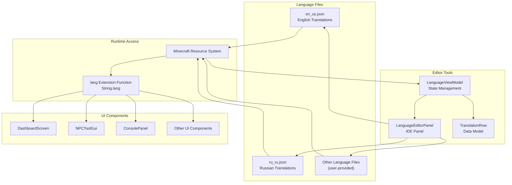
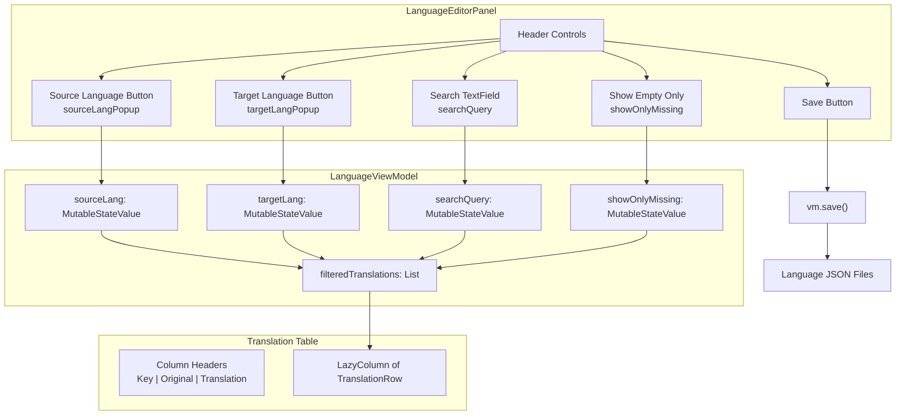
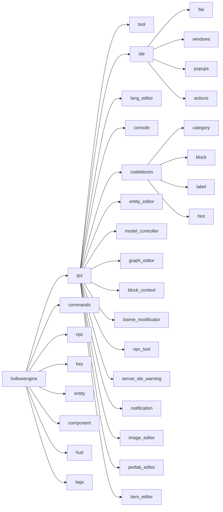
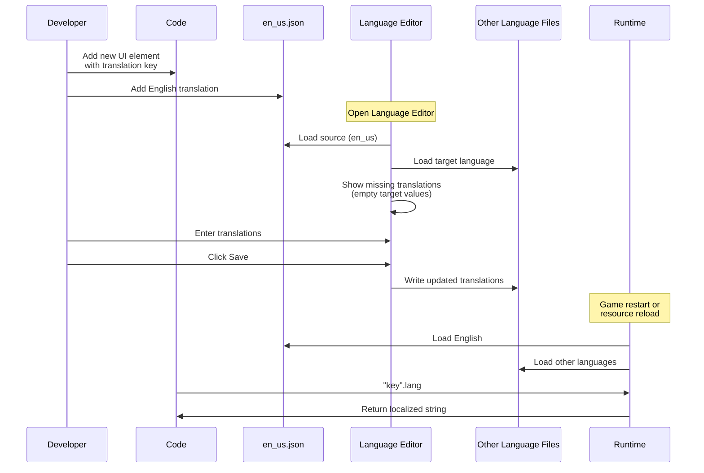

# Localization System

<details>
<summary>Relevant source files</summary>

The following files were used as context for generating this wiki page:

- [src/main/java/ru/hollowhorizon/hollowengine/client/gui/DashboardScreen.kt](src/main/java/ru/hollowhorizon/hollowengine/client/gui/DashboardScreen.kt)
- [src/main/java/ru/hollowhorizon/hollowengine/client/gui/NPCToolGui.kt](src/main/java/ru/hollowhorizon/hollowengine/client/gui/NPCToolGui.kt)
- [src/main/java/ru/hollowhorizon/hollowengine/client/gui/codeblocks/BlockContextMenu.kt](src/main/java/ru/hollowhorizon/hollowengine/client/gui/codeblocks/BlockContextMenu.kt)
- [src/main/java/ru/hollowhorizon/hollowengine/client/gui/modificators/BiomeModificator.kt](src/main/java/ru/hollowhorizon/hollowengine/client/gui/modificators/BiomeModificator.kt)
- [src/main/java/ru/hollowhorizon/hollowengine/client/gui/npcs/NPCMenuGui.kt](src/main/java/ru/hollowhorizon/hollowengine/client/gui/npcs/NPCMenuGui.kt)
- [src/main/java/ru/hollowhorizon/hollowengine/client/gui/scripting/GuiPackets.kt](src/main/java/ru/hollowhorizon/hollowengine/client/gui/scripting/GuiPackets.kt)
- [src/main/java/ru/hollowhorizon/hollowengine/client/gui/scripting/ServerIdeWarning.kt](src/main/java/ru/hollowhorizon/hollowengine/client/gui/scripting/ServerIdeWarning.kt)
- [src/main/java/ru/hollowhorizon/hollowengine/client/gui/scripting/files/ImageFile.kt](src/main/java/ru/hollowhorizon/hollowengine/client/gui/scripting/files/ImageFile.kt)
- [src/main/java/ru/hollowhorizon/hollowengine/client/gui/scripting/files/prefabs/EntityEditorScreen.kt](src/main/java/ru/hollowhorizon/hollowengine/client/gui/scripting/files/prefabs/EntityEditorScreen.kt)
- [src/main/java/ru/hollowhorizon/hollowengine/client/gui/scripting/files/prefabs/ItemPrefabEditorFile.kt](src/main/java/ru/hollowhorizon/hollowengine/client/gui/scripting/files/prefabs/ItemPrefabEditorFile.kt)
- [src/main/java/ru/hollowhorizon/hollowengine/client/gui/scripting/files/prefabs/PrefabEditorFile.kt](src/main/java/ru/hollowhorizon/hollowengine/client/gui/scripting/files/prefabs/PrefabEditorFile.kt)
- [src/main/java/ru/hollowhorizon/hollowengine/client/gui/scripting/panels/ConsolePanel.kt](src/main/java/ru/hollowhorizon/hollowengine/client/gui/scripting/panels/ConsolePanel.kt)
- [src/main/java/ru/hollowhorizon/hollowengine/client/gui/scripting/panels/LanguageEditorPanel.kt](src/main/java/ru/hollowhorizon/hollowengine/client/gui/scripting/panels/LanguageEditorPanel.kt)
- [src/main/java/ru/hollowhorizon/hollowengine/client/gui/scripting/theme/ThemeEditor.kt](src/main/java/ru/hollowhorizon/hollowengine/client/gui/scripting/theme/ThemeEditor.kt)
- [src/main/resources/assets/hollowengine/lang/en_us.json](src/main/resources/assets/hollowengine/lang/en_us.json)
- [src/main/resources/assets/hollowengine/lang/ru_ru.json](src/main/resources/assets/hollowengine/lang/ru_ru.json)

</details>


## Purpose and Scope

The Localization System provides internationalization (i18n) support for HollowEngine's in-game IDE and user interface components. It manages translation files, provides runtime access to localized strings, and includes an in-IDE editor for managing translations. 

For information about the IDE's theming and visual customization, see [Theming and Styling](#3.6). For details on general UI panel development, see [Panel System](#3.5).

---

## System Architecture

The localization system consists of three main components: language files stored as JSON resources, runtime access utilities, and an in-IDE translation editor.



**Sources:** [src/main/resources/assets/hollowengine/lang/en_us.json](), [src/main/resources/assets/hollowengine/lang/ru_ru.json](), [src/main/java/ru/hollowhorizon/hollowengine/client/gui/scripting/panels/LanguageEditorPanel.kt:1-166]()

---

## Language File Structure

Language files are JSON documents stored in `assets/hollowengine/lang/` following Minecraft's standard localization format. Each file is named according to the language code (e.g., `en_us.json`, `ru_ru.json`).

### File Format

```json
{
  "translation.key": "Translated Text",
  "another.key": "Another Translation",
  "key.with.placeholder": "Value: %s copied."
}
```

### Key Organization

Translation keys follow a hierarchical dot-separated structure:

| Prefix Pattern | Purpose | Example |
|----------------|---------|---------|
| `hollowengine.gui.*` | General UI elements | `hollowengine.gui.menu` |
| `hollowengine.gui.ide.*` | IDE-specific UI | `hollowengine.gui.ide.console` |
| `hollowengine.gui.codeblocks.*` | Visual block editor | `hollowengine.gui.codeblocks.block.print` |
| `hollowengine.commands.*` | Command feedback | `hollowengine.commands.copy` |
| `hollowengine.npc.*` | NPC interactions | `hollowengine.npc.talk` |
| `hollowengine.key.*` | Keybindings | `hollowengine.key.hollowengine.menu` |
| `hollowengine.entity.*` | Entity names | `hollowengine.entity.hollowengine.npc_entity` |
| `hollowengine.component.*` | Component names | `hollowengine.component.hollowengine.actions` |

**Sources:** [src/main/resources/assets/hollowengine/lang/en_us.json:1-728](), [src/main/resources/assets/hollowengine/lang/ru_ru.json:1-728]()

---

## Runtime Translation Access

The system provides a simple extension function to access translations at runtime.

### The `lang` Extension

All UI code accesses translations using the `.lang` extension on `String` objects:

```kotlin
// Translation key to localized string
Text("hollowengine.gui.menu".lang) {
    modifier.alignX(AlignmentX.Center)
}
```

This pattern appears throughout the codebase in UI components:

| Usage Context | Example File | Line Reference |
|---------------|--------------|----------------|
| Dashboard title | `DashboardScreen.kt` | [28]() |
| IDE panel headers | `ConsolePanel.kt` | [80](), [93]() |
| NPC tool labels | `NPCToolGui.kt` | [114]() |
| Button labels | `LanguageEditorPanel.kt` | [77]() |
| Context menu items | `BlockContextMenu.kt` | [26](), [28]() |

### Format Placeholders

Translation strings support format placeholders using `String.format()` semantics:

```kotlin
// en_us.json: "hollowengine.gui.entity_editor.title": "Editing entity: %s"
Text("hollowengine.gui.entity_editor.title".lang.format(target.displayName?.string ?: "")) {
    modifier.font(...)
}
```

**Sources:** [src/main/java/ru/hollowhorizon/hollowengine/client/gui/DashboardScreen.kt:28](), [src/main/java/ru/hollowhorizon/hollowengine/client/gui/NPCToolGui.kt:114](), [src/main/java/ru/hollowhorizon/hollowengine/client/gui/scripting/panels/ConsolePanel.kt:80-113]()

---

## Language Editor Panel

The IDE includes a built-in translation editor accessible via the "Translations" panel.



**Sources:** [src/main/java/ru/hollowhorizon/hollowengine/client/gui/scripting/panels/LanguageEditorPanel.kt:16-166]()

### LanguageEditorPanel

The panel is registered as a dockable IDE tool and instantiated with a reference to the main `Dock`:

[src/main/java/ru/hollowhorizon/hollowengine/client/gui/scripting/panels/LanguageEditorPanel.kt:16-25]()

Key UI elements:

| Component | Type | Purpose | State Binding |
|-----------|------|---------|---------------|
| Source Language Selector | Button + Popup | Choose base language | `vm.sourceLang` |
| Target Language Selector | Button + Popup | Choose language to edit | `vm.targetLang` |
| Search Field | TextField | Filter by key/text | `vm.searchQuery` |
| Empty Only Checkbox | Checkbox | Show only missing translations | `vm.showOnlyMissing` |
| Save Button | Button | Write changes to disk | `vm.save()` |
| Translation Table | LazyColumn | Display all translations | `vm.filteredTranslations` |

### LanguageViewModel

Manages state and file operations for the translation editor:

[src/main/java/ru/hollowhorizon/hollowengine/client/lang/LanguageViewModel.kt]()

Core responsibilities:
- Loading translation files from `assets/hollowengine/lang/`
- Maintaining lists of `TranslationRow` objects
- Filtering translations based on search and empty-only criteria
- Persisting changes back to JSON files

### TranslationRow

Data model representing a single translation entry:

```kotlin
data class TranslationRow(
    val key: String,
    val sourceValue: String,
    val targetValue: MutableStateValue<String>
)
```

Each row displays three columns:
1. **Translation Key** - The hierarchical identifier (grayed if translated)
2. **Original** - Text from the source language (read-only)
3. **Translation** - Editable field for target language text

**Sources:** [src/main/java/ru/hollowhorizon/hollowengine/client/gui/scripting/panels/LanguageEditorPanel.kt:28-165](), [src/main/java/ru/hollowhorizon/hollowengine/client/lang/LanguageViewModel.kt](), [src/main/java/ru/hollowhorizon/hollowengine/client/lang/TranslationRow.kt]()

---

## Translation Key Conventions

HollowEngine uses a consistent naming scheme for translation keys to organize the large number of UI strings.

### Hierarchical Structure



### Common Patterns

| Pattern | Example | Usage |
|---------|---------|-------|
| `*.title` | `hollowengine.gui.biome_modificator.title` | Window/panel titles |
| `*.hint` | `hollowengine.gui.codeblocks.hint.variable_name` | Placeholder text |
| `*.label.*` | `hollowengine.gui.codeblocks.label.player` | Block labels |
| `*.block.*` | `hollowengine.gui.codeblocks.block.print` | Block type names |
| `*.category.*` | `hollowengine.gui.codeblocks.category.math` | Category names |
| `*.actions.*` | `hollowengine.gui.ide.actions.create` | Action button labels |

**Sources:** [src/main/resources/assets/hollowengine/lang/en_us.json:1-728]()

---

## Adding New Translations

### Adding a New Language

1. Create a new JSON file in `src/main/resources/assets/hollowengine/lang/` following the naming convention `<language_code>.json` (e.g., `fr_fr.json` for French)

2. Copy the structure from `en_us.json` as a template

3. Translate each value while keeping the keys identical

4. The new language will automatically appear in the Language Editor's language selector

### Adding New Translation Keys

When adding new UI elements that require localized text:

1. **Choose an appropriate hierarchical key** following existing conventions:
   ```
   hollowengine.gui.<component>.<element>
   ```

2. **Add the key to all existing language files**:
   ```json
   // en_us.json
   "hollowengine.gui.my_panel.title": "My Panel"
   
   // ru_ru.json
   "hollowengine.gui.my_panel.title": "Моя панель"
   ```

3. **Use the key in code**:
   ```kotlin
   Text("hollowengine.gui.my_panel.title".lang) {
       modifier.font(sizes.largeText)
   }
   ```

4. **Use the Language Editor** to verify translations and fill in any missing entries

### Format String Parameters

For dynamic text requiring placeholders:

```json
// Language file
"hollowengine.gui.lang_editor.from": "From: %s"

// Kotlin usage
Text("hollowengine.gui.lang_editor.from".lang.format(vm.sourceLang.use()))
```

Multiple placeholders use positional arguments:
```json
"hollowengine.gui.message": "Player %s found %d items"

// Usage
text.lang.format(playerName, itemCount)
```

**Sources:** [src/main/resources/assets/hollowengine/lang/en_us.json:140-148](), [src/main/java/ru/hollowhorizon/hollowengine/client/gui/scripting/panels/LanguageEditorPanel.kt:34-46]()

---

## Translation Workflow



**Sources:** [src/main/java/ru/hollowhorizon/hollowengine/client/gui/scripting/panels/LanguageEditorPanel.kt:16-166]()

---

## Key UI Components Using Localization

The following table shows major UI components and their translation key prefixes:

| Component | File | Key Prefix | Example Keys |
|-----------|------|------------|--------------|
| Dashboard Menu | `DashboardScreen.kt` | `hollowengine.gui.menu` | `hollowengine.gui.menu` |
| IDE Panels | `LanguageEditorPanel.kt` | `hollowengine.gui.ide.*` | `hollowengine.gui.ide.translations` |
| Console Panel | `ConsolePanel.kt` | `hollowengine.gui.console.*` | `hollowengine.gui.console.level` |
| Code Blocks Editor | Block context menus | `hollowengine.gui.codeblocks.*` | `hollowengine.gui.codeblocks.block.print` |
| NPC Tool | `NPCToolGui.kt` | `hollowengine.gui.npc_tool.*` | `hollowengine.gui.npc_tool.name` |
| Prefab Editor | `PrefabEditorFile.kt` | `hollowengine.gui.prefab_editor.*` | `hollowengine.gui.prefab_editor.add_component` |
| Image Editor | `ImageFile.kt` | `hollowengine.gui.image_editor.*` | `hollowengine.gui.image_editor.zoom` |
| Biome Modificator | `BiomeModificator.kt` | `hollowengine.gui.biome_modificator.*` | `hollowengine.gui.biome_modificator.title` |
| Toast Notifications | `GuiPackets.kt` | `hollowengine.gui.notification.*` | `hollowengine.gui.notification.title` |

**Sources:** [src/main/java/ru/hollowhorizon/hollowengine/client/gui/DashboardScreen.kt:28](), [src/main/java/ru/hollowhorizon/hollowengine/client/gui/scripting/panels/LanguageEditorPanel.kt:16](), [src/main/java/ru/hollowhorizon/hollowengine/client/gui/scripting/panels/ConsolePanel.kt:80](), [src/main/java/ru/hollowhorizon/hollowengine/client/gui/NPCToolGui.kt:114](), [src/main/java/ru/hollowhorizon/hollowengine/client/gui/scripting/files/prefabs/PrefabEditorFile.kt:136](), [src/main/java/ru/hollowhorizon/hollowengine/client/gui/scripting/files/ImageFile.kt:85-134](), [src/main/java/ru/hollowhorizon/hollowengine/client/gui/modificators/BiomeModificator.kt:133](), [src/main/java/ru/hollowhorizon/hollowengine/client/gui/scripting/GuiPackets.kt:29]()