# Text Script Editor

<details>
<summary>Relevant source files</summary>

The following files were used as context for generating this wiki page:

- [src/main/java/ru/hollowhorizon/hollowengine/client/gui/scripting/files/ScriptFile.kt](src/main/java/ru/hollowhorizon/hollowengine/client/gui/scripting/files/ScriptFile.kt)
- [src/main/java/ru/hollowhorizon/hollowengine/client/gui/scripting/files/text/ScriptTextEditorHandler.kt](src/main/java/ru/hollowhorizon/hollowengine/client/gui/scripting/files/text/ScriptTextEditorHandler.kt)
- [src/main/java/ru/hollowhorizon/hollowengine/client/gui/scripting/files/text/SelectionHelper.kt](src/main/java/ru/hollowhorizon/hollowengine/client/gui/scripting/files/text/SelectionHelper.kt)
- [src/main/java/ru/hollowhorizon/hollowengine/client/gui/scripting/files/text/components/CommandRegistry.kt](src/main/java/ru/hollowhorizon/hollowengine/client/gui/scripting/files/text/components/CommandRegistry.kt)
- [src/main/java/ru/hollowhorizon/hollowengine/client/gui/scripting/files/text/components/EditorCommandContext.kt](src/main/java/ru/hollowhorizon/hollowengine/client/gui/scripting/files/text/components/EditorCommandContext.kt)
- [src/main/java/ru/hollowhorizon/hollowengine/client/gui/scripting/files/text/components/EditorLanguageService.kt](src/main/java/ru/hollowhorizon/hollowengine/client/gui/scripting/files/text/components/EditorLanguageService.kt)
- [src/main/java/ru/hollowhorizon/hollowengine/client/gui/scripting/files/text/components/EditorState.kt](src/main/java/ru/hollowhorizon/hollowengine/client/gui/scripting/files/text/components/EditorState.kt)
- [src/main/java/ru/hollowhorizon/hollowengine/client/gui/scripting/files/text/components/TextInputController.kt](src/main/java/ru/hollowhorizon/hollowengine/client/gui/scripting/files/text/components/TextInputController.kt)
- [src/main/java/ru/hollowhorizon/hollowengine/client/gui/scripting/files/text/components/commands/ApplyBracketsCommand.kt](src/main/java/ru/hollowhorizon/hollowengine/client/gui/scripting/files/text/components/commands/ApplyBracketsCommand.kt)
- [src/main/java/ru/hollowhorizon/hollowengine/client/gui/scripting/files/text/components/commands/ApplyCompletionItemCommand.kt](src/main/java/ru/hollowhorizon/hollowengine/client/gui/scripting/files/text/components/commands/ApplyCompletionItemCommand.kt)
- [src/main/java/ru/hollowhorizon/hollowengine/client/gui/scripting/files/text/components/commands/EditorDefaultCommands.kt](src/main/java/ru/hollowhorizon/hollowengine/client/gui/scripting/files/text/components/commands/EditorDefaultCommands.kt)
- [src/main/java/ru/hollowhorizon/hollowengine/client/gui/scripting/files/text/components/commands/IndentCommand.kt](src/main/java/ru/hollowhorizon/hollowengine/client/gui/scripting/files/text/components/commands/IndentCommand.kt)
- [src/main/java/ru/hollowhorizon/hollowengine/client/gui/scripting/files/text/components/commands/InsertNewlineCommand.kt](src/main/java/ru/hollowhorizon/hollowengine/client/gui/scripting/files/text/components/commands/InsertNewlineCommand.kt)
- [src/main/java/ru/hollowhorizon/hollowengine/client/gui/scripting/files/text/components/commands/ToggleLineCommentCommand.kt](src/main/java/ru/hollowhorizon/hollowengine/client/gui/scripting/files/text/components/commands/ToggleLineCommentCommand.kt)
- [src/main/java/ru/hollowhorizon/hollowengine/client/gui/scripting/files/text/components/commands/UnindentCommand.kt](src/main/java/ru/hollowhorizon/hollowengine/client/gui/scripting/files/text/components/commands/UnindentCommand.kt)
- [src/main/java/ru/hollowhorizon/hollowengine/client/gui/scripting/files/text/components/keymap/EditorDefaultKeys.kt](src/main/java/ru/hollowhorizon/hollowengine/client/gui/scripting/files/text/components/keymap/EditorDefaultKeys.kt)
- [src/main/java/ru/hollowhorizon/hollowengine/client/gui/scripting/files/text/components/keymap/KeyMap.kt](src/main/java/ru/hollowhorizon/hollowengine/client/gui/scripting/files/text/components/keymap/KeyMap.kt)
- [src/main/java/ru/hollowhorizon/hollowengine/client/gui/scripting/files/text/util/CompiledFileProvider.kt](src/main/java/ru/hollowhorizon/hollowengine/client/gui/scripting/files/text/util/CompiledFileProvider.kt)
- [src/main/java/ru/hollowhorizon/hollowengine/client/gui/scripting/files/text/util/TextAreaNode.kt](src/main/java/ru/hollowhorizon/hollowengine/client/gui/scripting/files/text/util/TextAreaNode.kt)
- [src/main/java/ru/hollowhorizon/hollowengine/common/scripting/ide/JsonScriptingAnalyzer.kt](src/main/java/ru/hollowhorizon/hollowengine/common/scripting/ide/JsonScriptingAnalyzer.kt)

</details>


## Purpose and Scope

The Text Script Editor is a Kotlin-based code editor with IDE-like features integrated into HollowEngine's in-game interface. It provides syntax highlighting, code completion, diagnostics, and standard text editing capabilities for `.kts` (Kotlin script) files. The editor is built using the Kool UI framework and supports advanced features like undo/redo, bracket matching, auto-indentation, and live error detection.

This page documents the text editor's architecture and core systems. For information about the visual block editor, see [Visual Block Editor](#5). For details on script execution and runtime, see [Script Execution and Runtime](#7).

---

## Component Architecture

The text editor is composed of several interconnected components that handle different aspects of editing functionality:

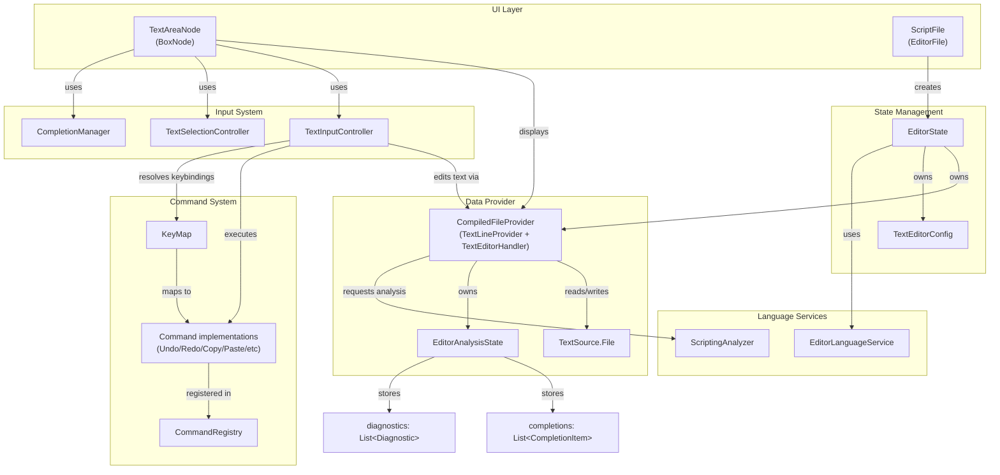

**Sources:** [src/main/java/ru/hollowhorizon/hollowengine/client/gui/scripting/files/text/util/TextAreaNode.kt:261-294](), [src/main/java/ru/hollowhorizon/hollowengine/client/gui/scripting/files/text/components/EditorState.kt:52-75](), [src/main/java/ru/hollowhorizon/hollowengine/client/gui/scripting/files/text/util/CompiledFileProvider.kt:37-93]()

### Key Components

| Component | Type | Responsibilities |
|-----------|------|------------------|
| `TextAreaNode` | UI Node | Renders the editor, manages layout, handles focus |
| `EditorState` | State Container | Owns provider, config, and language service |
| `CompiledFileProvider` | Data Provider | Manages lines, handles edits, triggers analysis |
| `TextInputController` | Input Handler | Processes keyboard input, executes commands |
| `TextSelectionController` | Selection Manager | Tracks caret position and selection range |
| `CompletionManager` | Completion UI | Manages code completion popup state |
| `CommandRegistry` | Command Dispatcher | Maps command keys to implementations |
| `KeyMap` | Keybinding Resolver | Maps keyboard events to command keys |

**Sources:** [src/main/java/ru/hollowhorizon/hollowengine/client/gui/scripting/files/text/util/TextAreaNode.kt:52-72](), [src/main/java/ru/hollowhorizon/hollowengine/client/gui/scripting/files/text/components/TextInputController.kt:17-24]()

---

## Text Rendering System

The editor renders text line-by-line using a lazy list approach, where only visible lines are rendered. Each line supports attributed text with syntax highlighting.

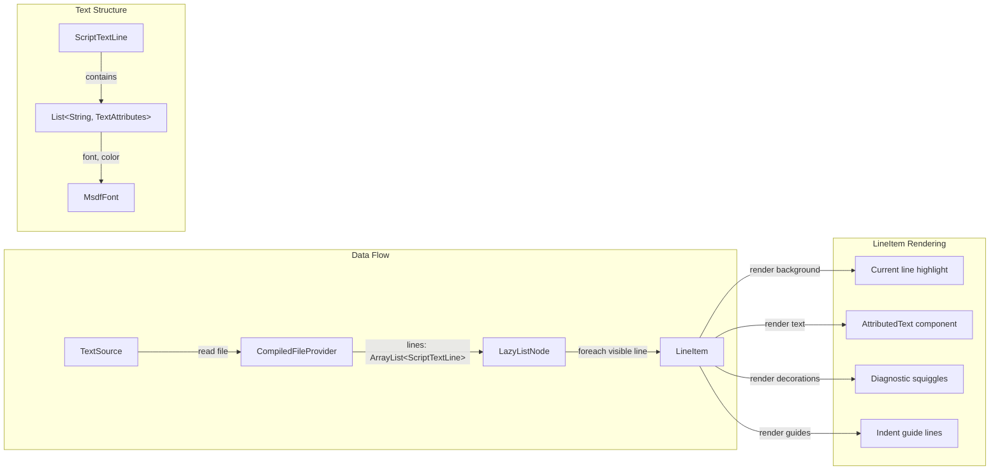

**Sources:** [src/main/java/ru/hollowhorizon/hollowengine/client/gui/scripting/files/text/util/TextAreaNode.kt:296-396](), [src/main/java/ru/hollowhorizon/hollowengine/client/gui/scripting/files/text/util/TextAreaNode.kt:457-507]()

### Line Rendering Pipeline

1. **Line Number Gutter** (optional): Displays line numbers with highlighting for the current line [src/main/java/ru/hollowhorizon/hollowengine/client/gui/scripting/files/text/util/TextAreaNode.kt:481-497]()
2. **Background Rendering**: Highlights the current line with `EditorTheme.currentLineBg` [src/main/java/ru/hollowhorizon/hollowengine/client/gui/scripting/files/text/util/TextAreaNode.kt:310-316]()
3. **Text Rendering**: Uses `AttributedText` component with syntax-highlighted spans [src/main/java/ru/hollowhorizon/hollowengine/client/gui/scripting/files/text/util/TextAreaNode.kt:509-557]()
4. **Diagnostic Rendering**: Draws squiggly underlines for errors/warnings [src/main/java/ru/hollowhorizon/hollowengine/client/gui/scripting/files/text/util/TextAreaNode.kt:318-374]()
5. **Indent Guides**: Vertical lines showing indentation levels [src/main/java/ru/hollowhorizon/hollowengine/client/gui/scripting/files/text/util/TextAreaNode.kt:376-395]()

### ScriptTextLine Structure

```kotlin
// Represents a single line of text with multiple styled segments
data class ScriptTextLine(
    val segments: List<Pair<String, TextAttributes>>
)

data class TextAttributes(
    val font: MsdfFont,
    val color: Color
)
```

Each line is a list of text segments with associated styling. This allows for multi-colored syntax highlighting within a single line.

**Sources:** [src/main/java/ru/hollowhorizon/hollowengine/client/gui/scripting/files/text/util/CompiledFileProvider.kt:81-84]()

---

## Language Services and Analysis

The editor integrates with language services to provide IDE-like features:

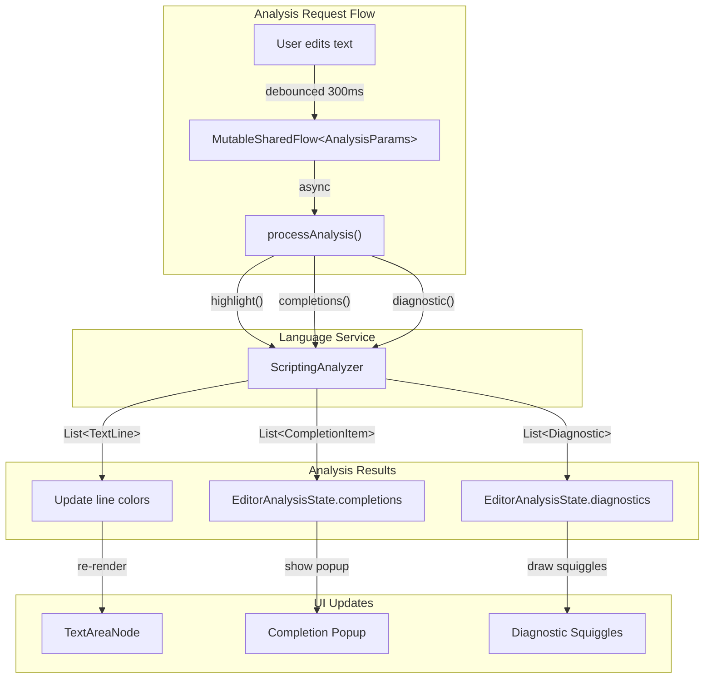

**Sources:** [src/main/java/ru/hollowhorizon/hollowengine/client/gui/scripting/files/text/util/CompiledFileProvider.kt:86-93](), [src/main/java/ru/hollowhorizon/hollowengine/client/gui/scripting/files/text/util/CompiledFileProvider.kt:226-271]()

### Analysis State Management

The `EditorAnalysisState` holds the current analysis results:

```kotlin
class EditorAnalysisState {
    val completions: MutableList<CompletionItem> = mutableStateListOf()
    val diagnostics: MutableList<Diagnostic> = mutableStateListOf()
}
```

**Sources:** [src/main/java/ru/hollowhorizon/hollowengine/client/gui/scripting/files/text/util/CompiledFileProvider.kt:31-34]()

### Debouncing and Performance

| Operation | Debounce Delay | Purpose |
|-----------|----------------|---------|
| Analysis Request | 300ms | Prevent excessive re-analysis during typing |
| Undo Merging | 300ms | Merge consecutive single-character edits into one undo action |
| Auto-Save | 500ms | Write changes to disk after editing stops |

**Sources:** [src/main/java/ru/hollowhorizon/hollowengine/client/gui/scripting/files/text/util/CompiledFileProvider.kt:25-29]()

### EditorLanguageService

The language service determines which analyzer to use based on file extension:

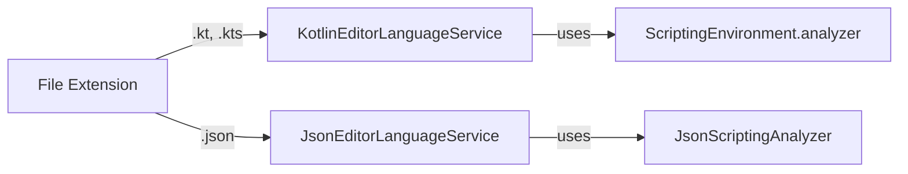

**Sources:** [src/main/java/ru/hollowhorizon/hollowengine/client/gui/scripting/files/text/components/EditorLanguageService.kt:11-27]()

---

## Command System

The editor uses a command pattern with key bindings to implement all editing operations:

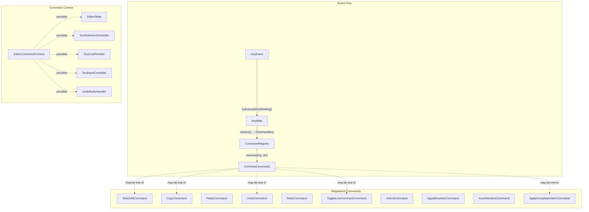

**Sources:** [src/main/java/ru/hollowhorizon/hollowengine/client/gui/scripting/files/text/components/TextInputController.kt:34-42](), [src/main/java/ru/hollowhorizon/hollowengine/client/gui/scripting/files/text/components/TextInputController.kt:110-116]()

### KeyBinding to Command Mapping

The `KeyMap` stores bindings with priorities, allowing context-sensitive overrides:

| KeyBinding | Command | Priority | Notes |
|------------|---------|----------|-------|
| `Ctrl+A` | `SelectAllCommand` | 0 | Select all text |
| `Ctrl+C` | `CopyCommand` | 0 | Copy selection to clipboard |
| `Ctrl+V` | `PasteCommand` | 0 | Paste from clipboard |
| `Ctrl+X` | `CutCommand` | 0 | Cut selection |
| `Ctrl+Z` | `UndoCommand` | 0 | Undo last edit |
| `Ctrl+Shift+Z` | `RedoCommand` | 0 | Redo last undo |
| `Ctrl+/` | `ToggleLineCommentCommand` | 0 | Toggle line comments |
| `Tab` | `ApplyCompletionItemCommand` | 100 | High priority: apply completion if open |
| `Tab` | `IndentCommand` | 0 | Low priority: insert indent |
| `Shift+Tab` | `UnindentCommand` | 10 | Remove indent |
| `↑` (in completion) | `CompletionNavigateUpCommand` | 50 | Navigate completion list |
| `↓` (in completion) | `CompletionNavigateDownCommand` | 50 | Navigate completion list |
| `Enter` (in completion) | `CompletionAcceptCommand` | 50 | Accept selected completion |

**Sources:** [src/main/java/ru/hollowhorizon/hollowengine/client/gui/scripting/files/text/components/keymap/EditorDefaultKeys.kt:10-73]()

### Command Execution Flow

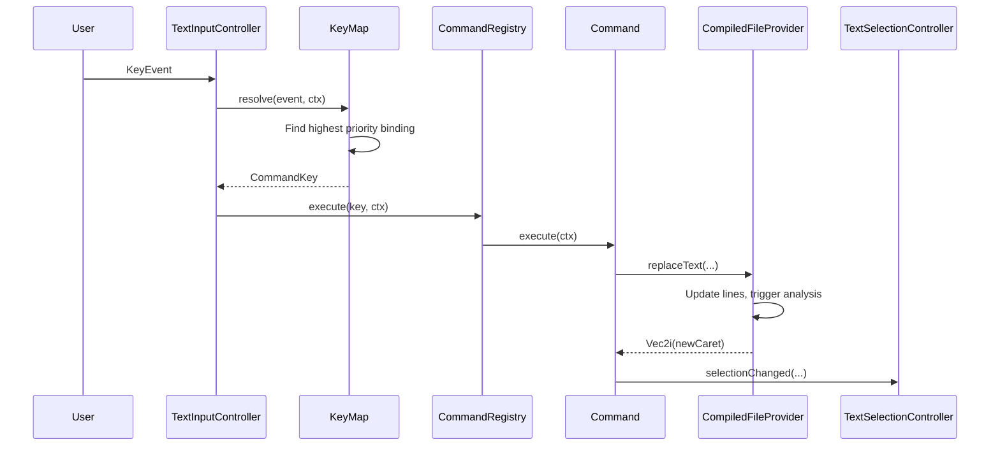

**Sources:** [src/main/java/ru/hollowhorizon/hollowengine/client/gui/scripting/files/text/components/keymap/KeyMap.kt:25-36](), [src/main/java/ru/hollowhorizon/hollowengine/client/gui/scripting/files/text/components/CommandRegistry.kt:18-20]()

### Example Command: ToggleLineCommentCommand

This command demonstrates how commands interact with the editor state:

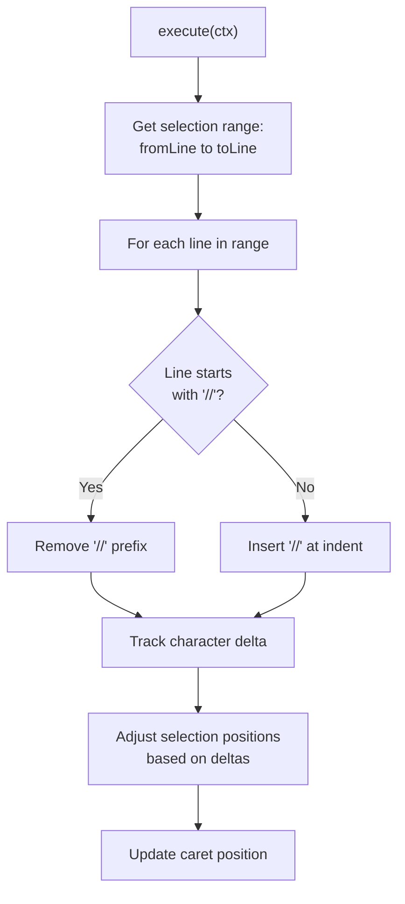

**Sources:** [src/main/java/ru/hollowhorizon/hollowengine/client/gui/scripting/files/text/components/commands/ToggleLineCommentCommand.kt:8-57]()

---

## Undo/Redo System

The undo system maintains two stacks of `UndoableAction` objects, merging consecutive single-character insertions:

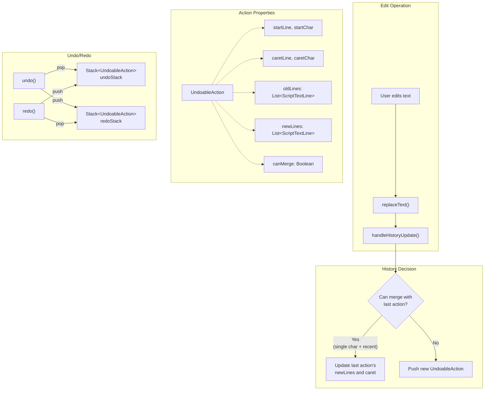

**Sources:** [src/main/java/ru/hollowhorizon/hollowengine/client/gui/scripting/files/text/util/CompiledFileProvider.kt:185-224](), [src/main/java/ru/hollowhorizon/hollowengine/client/gui/scripting/files/text/ScriptTextEditorHandler.kt:6-14]()

### Merging Logic

Actions are merged if:
1. Less than 300ms elapsed since last edit
2. The new edit is a single character insertion
3. The edit starts at the previous caret position
4. The previous action is also mergeable

**Sources:** [src/main/java/ru/hollowhorizon/hollowengine/client/gui/scripting/files/text/util/CompiledFileProvider.kt:195-208]()

---

## Code Completion System

The completion system displays a popup with suggestions based on the current cursor position:

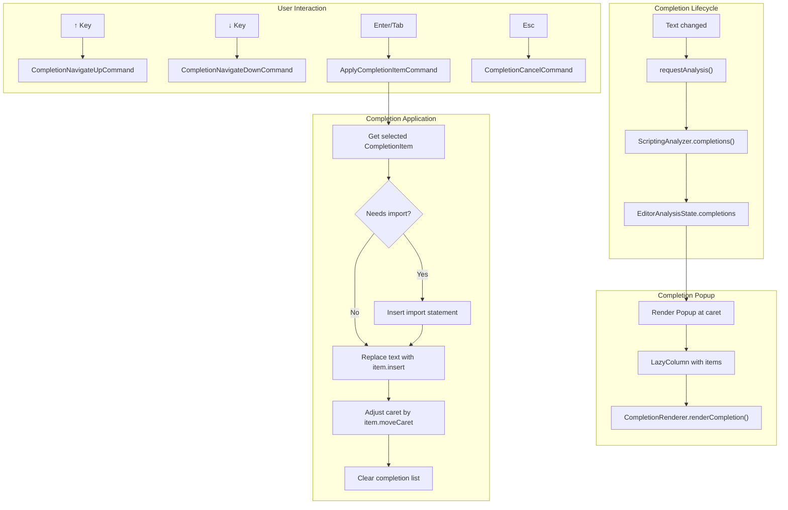

**Sources:** [src/main/java/ru/hollowhorizon/hollowengine/client/gui/scripting/files/text/util/TextAreaNode.kt:156-229](), [src/main/java/ru/hollowhorizon/hollowengine/client/gui/scripting/files/text/components/commands/ApplyCompletionItemCommand.kt:8-88]()

### CompletionItem Types

Completions can include additional metadata:

```kotlin
sealed class CompletionItem {
    data class Declaration(
        val insert: String,
        val import: Boolean,
        val fqName: String?,
        val moveCaret: Int
    )
    // ... other types
}
```

When `import = true`, the command automatically inserts the required import statement at the appropriate location in the file.

**Sources:** [src/main/java/ru/hollowhorizon/hollowengine/client/gui/scripting/files/text/components/commands/ApplyCompletionItemCommand.kt:20-45]()

---

## Selection and Caret Management

The `TextSelectionController` manages cursor position and text selection:

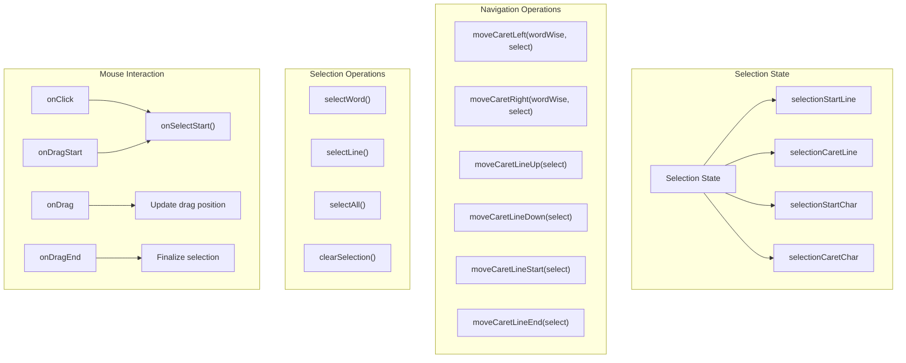

**Sources:** [src/main/java/ru/hollowhorizon/hollowengine/client/gui/scripting/files/text/util/TextAreaNode.kt:277-284]()

### Selection Rendering

Selection is rendered as a highlighted background on the text. The system handles:
- Single-line selections
- Multi-line selections
- Empty selections (caret only)

The rendering uses the `applySelectionRange()` method to determine which characters to highlight on each line.

**Sources:** [src/main/java/ru/hollowhorizon/hollowengine/client/gui/scripting/files/text/util/TextAreaNode.kt:538-556]()

---

## Integration with Script Execution

The text editor integrates with the broader HollowEngine scripting system:

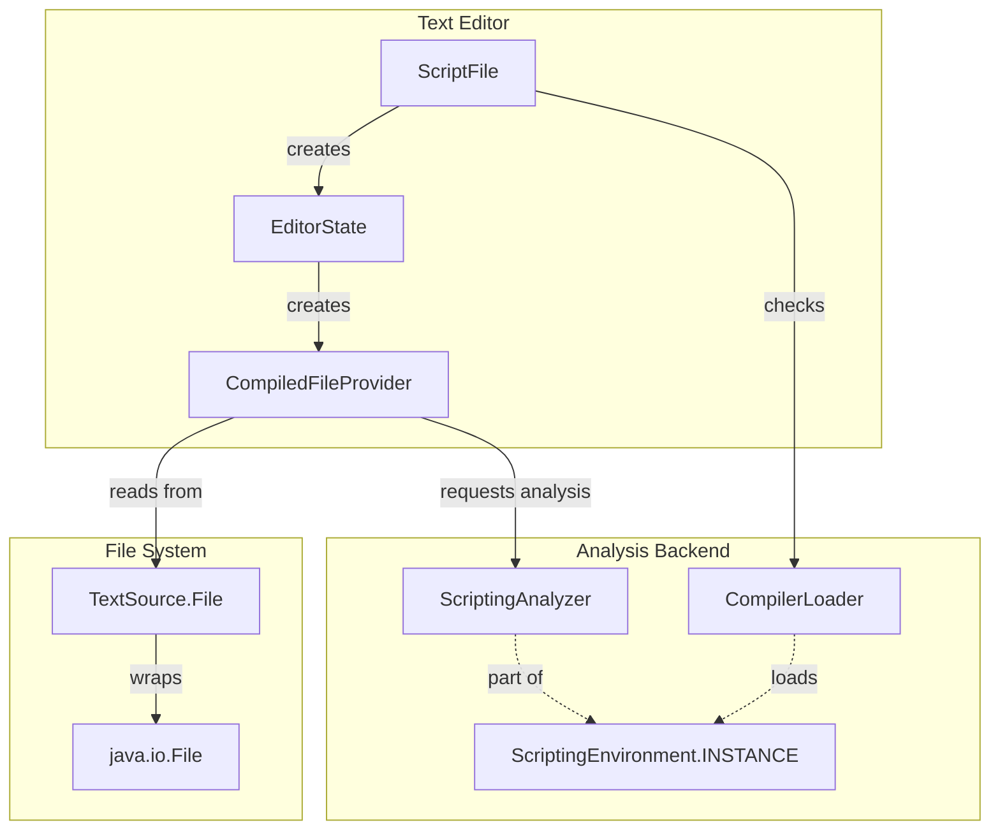

**Sources:** [src/main/java/ru/hollowhorizon/hollowengine/client/gui/scripting/files/ScriptFile.kt:24-44](), [src/main/java/ru/hollowhorizon/hollowengine/client/gui/scripting/files/text/components/EditorState.kt:52-75]()

### File Lifecycle

1. **Open**: `ScriptFile` creates an `EditorState`, which creates a `CompiledFileProvider`
2. **Edit**: User edits trigger `replaceText()`, which updates the text and schedules analysis
3. **Save**: Changes are auto-saved to disk after 500ms debounce, or explicitly via `saveToDisk()`
4. **Close**: `dispose()` is called to cancel pending analysis and save operations

**Sources:** [src/main/java/ru/hollowhorizon/hollowengine/client/gui/scripting/files/text/util/CompiledFileProvider.kt:95-115](), [src/main/java/ru/hollowhorizon/hollowengine/client/gui/scripting/files/ScriptFile.kt:156-162]()

---

## Configuration

The `TextEditorConfig` allows customization of editor behavior:

| Property | Type | Default | Description |
|----------|------|---------|-------------|
| `showLineNumbers` | Boolean | `true` | Display line numbers in gutter |
| `showBackground` | Boolean | `true` | Show editor background panel |
| `showVerticalScrollbar` | Boolean | `true` | Display vertical scrollbar |
| `showHorizontalScrollbar` | Boolean | `true` | Display horizontal scrollbar |
| `showSelectionAndCaret` | Boolean | `true` | Render selection and caret |
| `singleLine` | Boolean | `false` | Single-line input mode (no newlines) |
| `enableKeyMap` | Boolean | `true` | Enable keyboard shortcuts |
| `enableAutoBrackets` | Boolean | `true` | Auto-insert closing brackets |
| `fontSize` | Float | `Dimensions.FontNormal` | Font size in dp |
| `indentSize` | Int | `4` | Number of spaces per indent level |
| `font` | MsdfFont | `Monocraft` | Font for rendering text |

**Sources:** [src/main/java/ru/hollowhorizon/hollowengine/client/gui/scripting/files/text/components/EditorState.kt:14-29]()

---

## Special Features

### Auto-Bracket Insertion

When `enableAutoBrackets` is enabled, typing an opening bracket automatically inserts the closing bracket and positions the caret between them. If text is selected, it wraps the selection with brackets.

**Sources:** [src/main/java/ru/hollowhorizon/hollowengine/client/gui/scripting/files/text/components/commands/ApplyBracketsCommand.kt:8-41]()

### Smart Newline Indentation

The `InsertNewlineCommand` intelligently indents new lines based on the previous line's indentation and bracket context. It also handles the case where the caret is between `{` and `}`, creating two lines with proper indentation.

**Sources:** [src/main/java/ru/hollowhorizon/hollowengine/client/gui/scripting/files/text/components/commands/InsertNewlineCommand.kt:9-44]()

### Indent Guides

Vertical lines are rendered at each indentation level to visually indicate code structure. The guide at the current caret position is highlighted with higher opacity.

**Sources:** [src/main/java/ru/hollowhorizon/hollowengine/client/gui/scripting/files/text/util/TextAreaNode.kt:376-395]()

### Error/Warning Display

Diagnostics from the analyzer are displayed as:
- **Squiggly underlines** beneath the problematic code (red for errors, yellow for warnings)
- **Hover tooltips** showing the diagnostic message when the mouse is over the underline
- **Error counter** in the top-right corner showing the count of errors and warnings

**Sources:** [src/main/java/ru/hollowhorizon/hollowengine/client/gui/scripting/files/text/util/TextAreaNode.kt:318-374](), [src/main/java/ru/hollowhorizon/hollowengine/client/gui/scripting/files/ScriptFile.kt:93-136]()