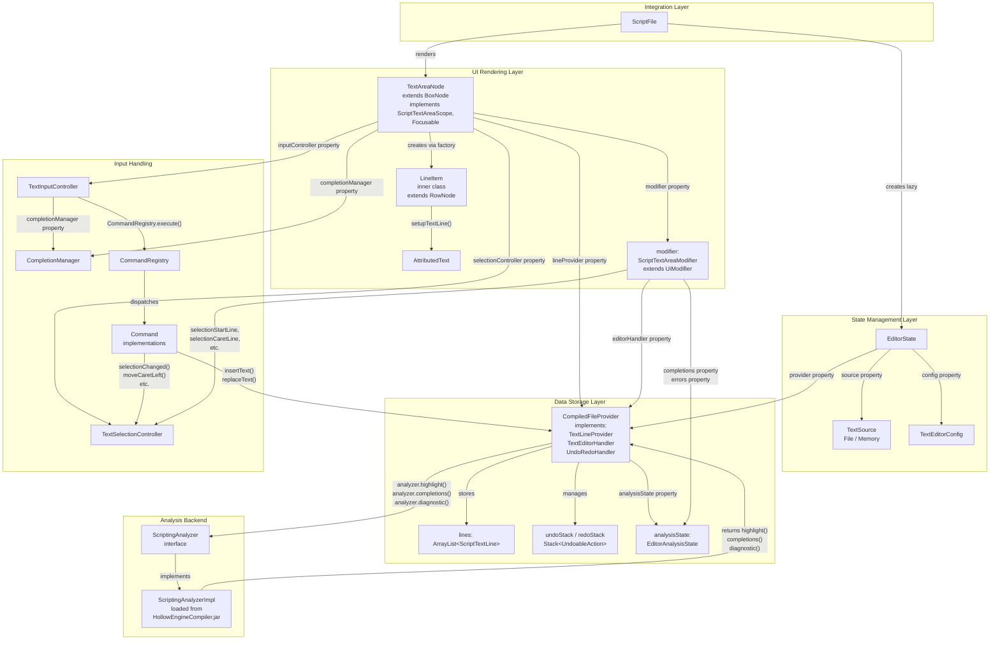
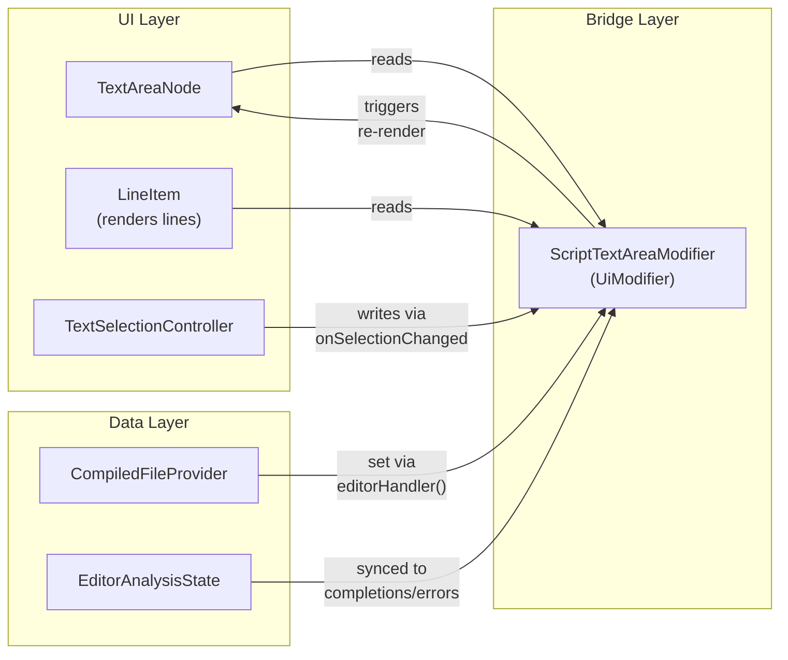
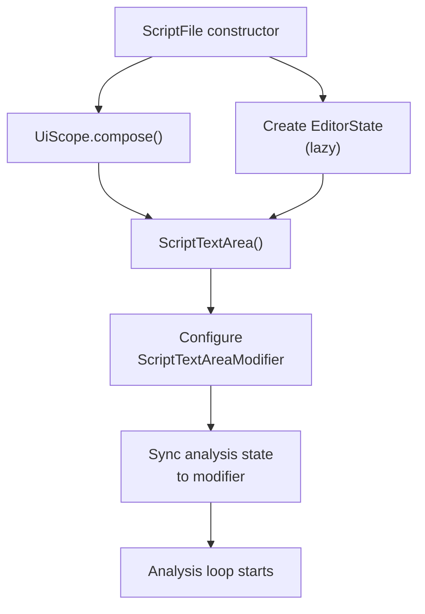
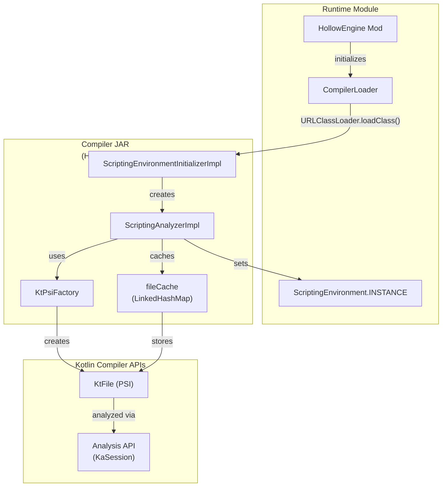

# Editor Architecture

<details>
<summary>Relevant source files</summary>

The following files were used as context for generating this wiki page:

- [src/main/java/ru/hollowhorizon/hollowengine/client/gui/scripting/files/ScriptFile.kt](src/main/java/ru/hollowhorizon/hollowengine/client/gui/scripting/files/ScriptFile.kt)
- [src/main/java/ru/hollowhorizon/hollowengine/client/gui/scripting/files/text/ScriptTextEditorHandler.kt](src/main/java/ru/hollowhorizon/hollowengine/client/gui/scripting/files/text/ScriptTextEditorHandler.kt)
- [src/main/java/ru/hollowhorizon/hollowengine/client/gui/scripting/files/text/SelectionHelper.kt](src/main/java/ru/hollowhorizon/hollowengine/client/gui/scripting/files/text/SelectionHelper.kt)
- [src/main/java/ru/hollowhorizon/hollowengine/client/gui/scripting/files/text/components/CommandRegistry.kt](src/main/java/ru/hollowhorizon/hollowengine/client/gui/scripting/files/text/components/CommandRegistry.kt)
- [src/main/java/ru/hollowhorizon/hollowengine/client/gui/scripting/files/text/components/EditorCommandContext.kt](src/main/java/ru/hollowhorizon/hollowengine/client/gui/scripting/files/text/components/EditorCommandContext.kt)
- [src/main/java/ru/hollowhorizon/hollowengine/client/gui/scripting/files/text/components/EditorLanguageService.kt](src/main/java/ru/hollowhorizon/hollowengine/client/gui/scripting/files/text/components/EditorLanguageService.kt)
- [src/main/java/ru/hollowhorizon/hollowengine/client/gui/scripting/files/text/components/EditorState.kt](src/main/java/ru/hollowhorizon/hollowengine/client/gui/scripting/files/text/components/EditorState.kt)
- [src/main/java/ru/hollowhorizon/hollowengine/client/gui/scripting/files/text/components/TextInputController.kt](src/main/java/ru/hollowhorizon/hollowengine/client/gui/scripting/files/text/components/TextInputController.kt)
- [src/main/java/ru/hollowhorizon/hollowengine/client/gui/scripting/files/text/components/commands/ApplyBracketsCommand.kt](src/main/java/ru/hollowhorizon/hollowengine/client/gui/scripting/files/text/components/commands/ApplyBracketsCommand.kt)
- [src/main/java/ru/hollowhorizon/hollowengine/client/gui/scripting/files/text/components/commands/ApplyCompletionItemCommand.kt](src/main/java/ru/hollowhorizon/hollowengine/client/gui/scripting/files/text/components/commands/ApplyCompletionItemCommand.kt)
- [src/main/java/ru/hollowhorizon/hollowengine/client/gui/scripting/files/text/components/commands/EditorDefaultCommands.kt](src/main/java/ru/hollowhorizon/hollowengine/client/gui/scripting/files/text/components/commands/EditorDefaultCommands.kt)
- [src/main/java/ru/hollowhorizon/hollowengine/client/gui/scripting/files/text/components/commands/IndentCommand.kt](src/main/java/ru/hollowhorizon/hollowengine/client/gui/scripting/files/text/components/commands/IndentCommand.kt)
- [src/main/java/ru/hollowhorizon/hollowengine/client/gui/scripting/files/text/components/commands/InsertNewlineCommand.kt](src/main/java/ru/hollowhorizon/hollowengine/client/gui/scripting/files/text/components/commands/InsertNewlineCommand.kt)
- [src/main/java/ru/hollowhorizon/hollowengine/client/gui/scripting/files/text/components/commands/ToggleLineCommentCommand.kt](src/main/java/ru/hollowhorizon/hollowengine/client/gui/scripting/files/text/components/commands/ToggleLineCommentCommand.kt)
- [src/main/java/ru/hollowhorizon/hollowengine/client/gui/scripting/files/text/components/commands/UnindentCommand.kt](src/main/java/ru/hollowhorizon/hollowengine/client/gui/scripting/files/text/components/commands/UnindentCommand.kt)
- [src/main/java/ru/hollowhorizon/hollowengine/client/gui/scripting/files/text/components/keymap/EditorDefaultKeys.kt](src/main/java/ru/hollowhorizon/hollowengine/client/gui/scripting/files/text/components/keymap/EditorDefaultKeys.kt)
- [src/main/java/ru/hollowhorizon/hollowengine/client/gui/scripting/files/text/components/keymap/KeyMap.kt](src/main/java/ru/hollowhorizon/hollowengine/client/gui/scripting/files/text/components/keymap/KeyMap.kt)
- [src/main/java/ru/hollowhorizon/hollowengine/client/gui/scripting/files/text/util/CompiledFileProvider.kt](src/main/java/ru/hollowhorizon/hollowengine/client/gui/scripting/files/text/util/CompiledFileProvider.kt)
- [src/main/java/ru/hollowhorizon/hollowengine/client/gui/scripting/files/text/util/TextAreaNode.kt](src/main/java/ru/hollowhorizon/hollowengine/client/gui/scripting/files/text/util/TextAreaNode.kt)
- [src/main/java/ru/hollowhorizon/hollowengine/common/scripting/ide/JsonScriptingAnalyzer.kt](src/main/java/ru/hollowhorizon/hollowengine/common/scripting/ide/JsonScriptingAnalyzer.kt)

</details>


This page documents the layered architecture of the text script editor. The editor is structured into three primary layers: state management (`EditorState`), data storage (`CompiledFileProvider`), and UI rendering (`TextAreaNode`). Input handling is delegated to a command pattern via `TextInputController`. For details on specific subsystems like completion rendering or syntax highlighting, see [Code Completion System](#4.3), [Syntax Analysis and Diagnostics](#4.4), and [Text Area Component and Rendering](#4.2).

---

## Architectural Overview

The text editor follows a layered architecture with clear separation of concerns:

**Layer Architecture Diagram**



**Sources:**
- [src/main/java/ru/hollowhorizon/hollowengine/client/gui/scripting/files/text/components/EditorState.kt:52-75]()
- [src/main/java/ru/hollowhorizon/hollowengine/client/gui/scripting/files/text/util/CompiledFileProvider.kt:37-62]()
- [src/main/java/ru/hollowhorizon/hollowengine/client/gui/scripting/files/text/util/TextAreaNode.kt:261-294]()
- [src/main/java/ru/hollowhorizon/hollowengine/client/gui/scripting/files/text/components/TextInputController.kt:17-24]()
- [src/main/java/ru/hollowhorizon/hollowengine/client/gui/scripting/files/ScriptFile.kt:23-43]()

---

## Layer 1: State Management (EditorState)

`EditorState` is the top-level state container that coordinates the editor's components. It wraps a `TextSource` (file or in-memory text), creates and owns the `CompiledFileProvider`, and provides configuration.

**EditorState Structure:**

| Property | Type | Purpose |
|----------|------|---------|
| `source` | `TextSource` | File or memory text source |
| `language` | `EditorLanguageService` | Determines analyzer based on file extension |
| `config` | `TextEditorConfig` | Editor configuration (font, features, indent size) |
| `provider` | `CompiledFileProvider` | Data storage layer |
| `lines` | `TextLineProvider` | Alias to `provider` |
| `editor` | `TextEditorHandler` | Alias to `provider` |
| `analysis` | `EditorAnalysisState` | Alias to `provider.analysisState` |

**TextSource Variants:**

```kotlin
interface TextSource {
    val name: String
    val text: String
    fun save(text: String) {}
    
    class File(val file: java.io.File) : TextSource
    class Memory(override val name: String, override val text: String) : TextSource
}
```

`EditorState` provides convenience methods:
- `saveToDisk()` - Forces immediate save
- `dispose()` - Cleans up background coroutines

**TextEditorConfig Options:**

| Setting | Default | Description |
|---------|---------|-------------|
| `showLineNumbers` | `true` | Display line numbers in gutter |
| `showBackground` | `true` | Show editor background panel |
| `showVerticalScrollbar` | `true` | Display vertical scrollbar |
| `showHorizontalScrollbar` | `true` | Display horizontal scrollbar |
| `showSelectionAndCaret` | `true` | Show text selection and caret |
| `singleLine` | `false` | Single-line mode (no newlines) |
| `enableKeyMap` | `true` | Enable keyboard shortcuts |
| `enableAutoBrackets` | `true` | Auto-insert closing brackets |
| `fontSize` | `Dimensions.FontNormal` | Font size |
| `indentSize` | `4` | Spaces per indent level |

**Sources:**
- [src/main/java/ru/hollowhorizon/hollowengine/client/gui/scripting/files/text/components/EditorState.kt:14-76]()

---

## Layer 2: Data Storage (CompiledFileProvider)

`CompiledFileProvider` is the data storage layer that implements three interfaces defining its responsibilities:

**Interface Implementation:**

```
CompiledFileProvider implements:
├── TextLineProvider     // Read access to text lines
├── TextEditorHandler    // Edit operations
└── UndoRedoHandler      // History management
```

**Key Responsibilities:**

| Responsibility | Details |
|---------------|---------|
| **Text Storage** | `ArrayList<ScriptTextLine>` with syntax-highlighted spans |
| **Edit Operations** | `insertText(line, caret, insertion)` and `replaceText(...)` |
| **History Management** | Undo/redo stacks with action merging (300ms window) |
| **File Synchronization** | Debounced writes to disk (500ms delay) |
| **Analysis Coordination** | Async analysis via `MutableSharedFlow` (300ms debounce) |
| **Result Integration** | Updates lines with highlighting, populates `EditorAnalysisState` |

**Analysis Flow:**

```mermaid
sequenceDiagram
    participant User
    participant TextArea["TextAreaNode"]
    participant Provider["CompiledFileProvider"]
    participant Flow["analysisRequest<br/>(MutableSharedFlow)"]
    participant Analyzer["ScriptingAnalyzer"]
    
    User->>TextArea: Types character
    TextArea->>Provider: replaceText()
    Provider->>Provider: Update lines array
    Provider->>Flow: emit(AnalysisParams)
    
    Note over Flow: debounce(300ms)
    
    Flow->>Provider: collectLatest()
    Provider->>Analyzer: highlight() (sync)
    Provider->>Provider: Update lines with colors
    Provider->>Analyzer: completions() (async)
    Provider->>Analyzer: diagnostic() (async)
    
    Analyzer-->>Provider: Results
    Provider->>Provider: analysisState.completions.addAll()
    Provider->>Provider: analysisState.diagnostics.addAll()
    
    Note over TextArea: UI re-renders automatically<br/>via reactive state
```

**Undo/Redo Merging:**

Single-character insertions within 300ms are merged into a single undoable action. This prevents undo from reverting character-by-character when typing continuously.

**Sources:**
- [src/main/java/ru/hollowhorizon/hollowengine/client/gui/scripting/files/text/util/CompiledFileProvider.kt:37-115]()
- [src/main/java/ru/hollowhorizon/hollowengine/client/gui/scripting/files/text/util/CompiledFileProvider.kt:134-224]()
- [src/main/java/ru/hollowhorizon/hollowengine/client/gui/scripting/files/text/util/CompiledFileProvider.kt:226-271]()

---

## Layer 3: UI Rendering (TextAreaNode)

### TextAreaNode: UI and Interaction

`TextAreaNode` is the primary UI component responsible for rendering the text editor and handling all user interactions. It extends `BoxNode` and implements `ScriptTextAreaScope` and `Focusable`.

**Core Components:**

| Component | Type | Purpose |
|-----------|------|---------|
| `selectionController` | `TextSelectionController` | Manages caret position and text selection |
| `completionManager` | `CompletionManager` | Controls completion popup visibility and navigation |
| `inputController` | `TextInputController` | Routes keyboard events to commands |
| `linesHolder` | `LazyListNode` | Container for line items (virtual scrolling) |
| `listState` | `LazyListState` | Scroll position and viewport state |

**Key Responsibilities:**

| Responsibility | Implementation |
|---------------|----------------|
| **Keyboard Input** | `onKeyEvent()` method delegates to `inputController` |
| **Text Rendering** | Creates `LineItem` instances for each visible line |
| **Selection Management** | `TextSelectionController` tracks selection bounds, provides navigation methods |
| **Completion Popup** | Renders `Popup` with `LazyColumn` of completion items at caret position |
| **Visual Feedback** | Current line background, indent guides, diagnostic squiggles |

**LineItem Rendering:**

Each line in the editor is rendered by a `LineItem` inner class (RowNode) that contains:
1. **Line Number** - Gutter with line index (if `showLineNumbers` enabled)
2. **Text Content** - `AttributedText` with syntax-highlighted spans
3. **Visual Decorations** - Rendered in `render()` override:
   - Current line background (`renderCurrentLineBackground()`)
   - Error/warning squiggles (`renderDiagnostics()`)
   - Indent guides (`renderIndentGuides()`)

The `setText()` method creates `LineItem` instances via `linesHolder.indices()`, which enables virtual scrolling - only visible lines are instantiated.

**Completion Popup Positioning:**

The completion popup is positioned dynamically in `setupTextLine()` via `onPositioned` callback:
- **X Position**: Aligned to start of current expression (via `TextCaretNavigation.startOfExpression()`)
- **Y Position**: Below caret if space available, otherwise above
- **Size**: Dynamically sized based on completion count (max 10 items visible)

**Sources:**
- [src/main/java/ru/hollowhorizon/hollowengine/client/gui/scripting/files/text/util/TextAreaNode.kt:261-294]()
- [src/main/java/ru/hollowhorizon/hollowengine/client/gui/scripting/files/text/util/TextAreaNode.kt:296-396]()
- [src/main/java/ru/hollowhorizon/hollowengine/client/gui/scripting/files/text/util/TextAreaNode.kt:400-455]()
- [src/main/java/ru/hollowhorizon/hollowengine/client/gui/scripting/files/text/util/TextAreaNode.kt:457-507]()
- [src/main/java/ru/hollowhorizon/hollowengine/client/gui/scripting/files/text/util/TextAreaNode.kt:509-557]()
- [src/main/java/ru/hollowhorizon/hollowengine/client/gui/scripting/files/text/util/TextAreaNode.kt:118-259]()


---

## Input Handling: Command Pattern

Input handling is separated from UI rendering using the command pattern. `TextInputController` intercepts keyboard events and dispatches them to registered commands.

**Input Flow Diagram:**

```mermaid
sequenceDiagram
    participant User
    participant TextAreaNode
    participant InputCtrl["TextInputController"]
    participant KeyMap
    participant CmdRegistry["CommandRegistry"]
    participant Command["Command<br/>Implementation"]
    participant Provider["CompiledFileProvider"]
    participant Selection["TextSelectionController"]
    
    User->>TextAreaNode: Press key
    TextAreaNode->>TextAreaNode: onKeyEvent(KeyEvent)
    TextAreaNode->>InputCtrl: onKeyEvent(keyEvent)
    
    alt Is key binding
        InputCtrl->>KeyMap: resolve(event, ctx)
        KeyMap-->>InputCtrl: CommandKey?
        InputCtrl->>CmdRegistry: execute(commandKey, ctx)
        CmdRegistry->>Command: execute(ctx)
        
        alt Edits text
            Command->>Provider: insertText() or replaceText()
            Provider-->>Command: new caret position
            Command->>Selection: selectionChanged(...)
        end
        
        alt Navigation
            Command->>Selection: moveCaretLeft() / moveCaretRight() / etc.
        end
    else No binding (char typed)
        InputCtrl->>Provider: insertText() via editText()
        Provider-->>InputCtrl: new caret position
        InputCtrl->>Selection: selectionChanged(...)
    end
```

**TextInputController Structure:**

| Component | Responsibility |
|-----------|---------------|
| `TextInputController` | Routes keyboard events to commands |
| `KeyMap` | Maps key bindings to command keys |
| `CommandRegistry` | Dispatches commands by key |
| `EditorCommandContext` | Provides command execution context |

**Command Execution Context:**

```kotlin
class EditorCommandContext(
    val event: KeyEvent?,
    val state: EditorState,
    val selection: TextSelectionController,
    val lineProvider: TextLineProvider,
    val inputController: TextInputController,
    val historyManager: UndoRedoHandler,
    val hasCompletions: Boolean,
    val completion: CompletionManager?
)
```

**Registered Commands:**

| Command | Default Keybinding | Action |
|---------|-------------------|--------|
| `SelectAllCommand` | Ctrl+A | Select all text |
| `CopyCommand` | Ctrl+C | Copy selection to clipboard |
| `CutCommand` | Ctrl+X | Cut selection to clipboard |
| `PasteCommand` | Ctrl+V | Paste from clipboard |
| `UndoCommand` | Ctrl+Z | Undo last action |
| `RedoCommand` | Ctrl+Y / Ctrl+Shift+Z | Redo undone action |
| `IndentCommand` | Tab | Indent selection |
| `UnindentCommand` | Shift+Tab | Unindent selection |
| `ToggleLineCommentCommand` | Ctrl+/ | Toggle line comments |
| `CompletionAcceptCommand` | Enter (in popup) | Apply selected completion |
| `CompletionNavigateUpCommand` | Up (in popup) | Navigate up in completions |
| `CompletionNavigateDownCommand` | Down (in popup) | Navigate down in completions |
| `ApplyCompletionItemCommand` | Tab (in popup) | Apply completion |
| `InsertNewlineCommand` | Enter | Insert newline with auto-indent |
| `ApplyBracketsCommand` | `({["'` | Auto-close brackets |

**Command Priority System:**

Commands can have priorities. When multiple commands match a key binding, the highest priority command executes. For example, `CompletionNavigateUpCommand` has priority 50 for Up arrow when completions are open, overriding default navigation.

**Sources:**
- [src/main/java/ru/hollowhorizon/hollowengine/client/gui/scripting/files/text/components/TextInputController.kt:17-199]()
- [src/main/java/ru/hollowhorizon/hollowengine/client/gui/scripting/files/text/components/EditorCommandContext.kt:8-22]()
- [src/main/java/ru/hollowhorizon/hollowengine/client/gui/scripting/files/text/components/commands/EditorDefaultCommands.kt:5-31]()
- [src/main/java/ru/hollowhorizon/hollowengine/client/gui/scripting/files/text/components/keymap/EditorDefaultKeys.kt:7-73]()
- [src/main/java/ru/hollowhorizon/hollowengine/client/gui/scripting/files/text/components/keymap/KeyMap.kt:8-36]()
- [src/main/java/ru/hollowhorizon/hollowengine/client/gui/scripting/files/text/components/CommandRegistry.kt:3-25]()

---

## State Sharing via ScriptTextAreaModifier

`ScriptTextAreaModifier` acts as a bridge between the UI layer and data layer, providing a shared reactive state that both layers can read and modify. It extends `UiModifier` and uses Kool's property delegation system for automatic UI updates.

**Shared State Properties:**

| Property Category | Properties | Purpose |
|------------------|-----------|---------|
| **Layout Control** | `lineStartPadding`, `lineEndPadding`, `firstLineTopPadding`, `lastLineBottomPadding` | Text area padding configuration |
| **Selection State** | `selectionStartLine`, `selectionCaretLine`, `selectionStartChar`, `selectionCaretChar` | Cursor and selection coordinates (reactive via `property()`) |
| **Selection Callback** | `onSelectionChanged: ((Int, Int, Int, Int) -> Unit)?` | Notifies on selection changes |
| **Editor Handler** | `editorHandler: TextEditorHandler?` | Reference to `CompiledFileProvider` |
| **Analysis Results** | `completions: MutableList<CompletionItem>`, `errors: MutableList<Diagnostic>` | Current completion items and diagnostics |
| **Configuration** | `editorConfig: TextEditorConfig` | Editor configuration reference |
| **Transient State** | `errorMessage: String` | Hover tooltip message for diagnostics |

**Modifier as Data Bridge:**



**Reactive Update Flow:**

When `CompiledFileProvider` completes analysis:
1. Results populate `analysisState.completions` and `analysisState.diagnostics`
2. `ScriptFile.compose()` syncs these to `modifier.completions` and `modifier.errors`
3. Modifier properties marked with `property()` trigger UI re-render
4. `TextAreaNode` re-reads modifier state and displays updated completion popup / error squiggles

**Extension Functions:**

The modifier provides builder-pattern extension functions for configuration:
- `lineStartPadding(Dp)`, `lineEndPadding(Dp)` - Set text padding
- `editorHandler(TextEditorHandler)` - Set data provider
- `setCaretPos(line, caretPos)` - Move caret programmatically
- `setSelectionRange(startLine, caretLine, startPos, caretPos)` - Set selection range

**Sources:**
- [src/main/java/ru/hollowhorizon/hollowengine/client/gui/scripting/files/text/util/TextAreaNode.kt:52-115]()
- [src/main/java/ru/hollowhorizon/hollowengine/client/gui/scripting/files/text/util/TextAreaNode.kt:28-50]()

---

## Integration: ScriptFile Wiring

`ScriptFile` demonstrates how the layers are wired together:

**Component Initialization:**



**ScriptFile Implementation Pattern:**

```kotlin
class ScriptFile(path: String, bytes: ByteArray) : EditorFile(path) {
    // Lazy initialization of state layer
    private val editorState by lazy {
        EditorState(TextSource.File(filePath.fromReadablePath()))
    }
    
    override fun UiScope.compose() {
        ScriptTextArea(editorState, ...) {
            // Capture modifier reference
            this@ScriptFile.modifier = modifier
            
            // Configure modifier with provider reference
            modifier.editorHandler(editorState.editor)
            modifier.editorConfig = editorState.config
            
            // Sync analysis results to modifier
            modifier.errors.clear()
            modifier.errors.addAll(editorState.analysis.diagnostics)
            
            modifier.completions.clear()
            modifier.completions.addAll(editorState.analysis.completions)
            
            // Install selection handler
            installSelectionHandler(editorState.provider) { ... }
        }
    }
}
```

**Sources:**
- [src/main/java/ru/hollowhorizon/hollowengine/client/gui/scripting/files/ScriptFile.kt:23-91]()
- [src/main/java/ru/hollowhorizon/hollowengine/client/gui/scripting/files/ScriptFile.kt:164-194]()

---

## Text Line Representation

Text is stored as `ScriptTextLine` objects, which contain syntax-highlighted spans:

```kotlin
data class ScriptTextLine(
    val spans: List<Pair<String, TextAttributes>>,  // Text fragments with color/font
    var inlayHints: List<InlayHint> = emptyList()   // Inline hints (e.g., type hints)
)

data class TextAttributes(
    val font: MsdfFont,
    val color: Color,
    val background: Color? = null
)
```

Each span represents a segment of text with specific visual attributes (color, font). This allows rich syntax highlighting where keywords, identifiers, strings, and comments each have different colors.

**Example Structure:**

```
Line: "fun main() {"
Spans: [
    ("fun", TextAttributes(font, keywordColor)),
    (" ", TextAttributes(font, whiteColor)),
    ("main", TextAttributes(font, functionColor)),
    ("() {", TextAttributes(font, whiteColor))
]
```

**Sources:**
- [src/main/java/ru/hollowhorizon/hollowengine/client/gui/scripting/files/text/util/AttributedText.kt:28-76]()

---

## Analysis Backend: ScriptingAnalyzer

The `ScriptingAnalyzer` interface defines the contract for code intelligence services. The implementation `ScriptingAnalyzerImpl` resides in the compiler module and is loaded dynamically.

**Analyzer Interface:**

| Method | Purpose | Performance |
|--------|---------|------------|
| `highlight(name, text, offset)` | Returns syntax-highlighted spans | Fast, runs synchronously |
| `completions(name, text, offset)` | Returns code completion items | Moderate, runs async |
| `diagnostic(name, text)` | Returns error/warning diagnostics | Slow, runs async |

**Analyzer Loading Architecture:**



**Graceful Degradation:**

If `HollowEngineCompiler.jar` is not present:
- Editor still functions for text editing
- Syntax highlighting falls back to plain text
- No code completions or diagnostics
- Detected via `HollowEngine.compilerLoader.isLoaded`

**Sources:**
- [src/main/java/ru/hollowhorizon/hollowengine/common/scripting/ide/ScriptingAnalyzer.kt]() (interface definition)
- [src/main/java/ru/hollowhorizon/hollowengine/common/scripting/CompilerLoader.kt:7-53]()
- [src/main/java/ru/hollowhorizon/hollowengine/client/gui/scripting/files/ScriptFile.kt:41-44]()
- [src/main/java/ru/hollowhorizon/hollowengine/client/gui/scripting/files/text/components/EditorLanguageService.kt:1-27]()

---

## Performance Optimizations

The architecture employs several strategies to maintain UI responsiveness:

**Optimization Techniques:**

| Strategy | Implementation | Benefit |
|----------|---------------|---------|
| **Analysis Debouncing** | 300ms delay via `MutableSharedFlow` | Avoids analysis on every keystroke |
| **Fast-Path Highlighting** | Synchronous lexical coloring first | Immediate visual feedback |
| **Async Heavy Analysis** | Completions/diagnostics in coroutines | UI remains responsive |
| **Edit Merging** | 300ms window for undo action merging | Efficient undo for continuous typing |
| **File Write Debouncing** | 500ms delay before disk write | Reduces I/O overhead |
| **State Invalidation** | Compare text snapshots before applying results | Prevents stale analysis application |

**Performance Timings:**

```
User Keystroke
    ↓ immediate
[replaceText] - Update lines (< 1ms)
    ↓ immediate  
[Lexical Highlight] - Fast syntax coloring (< 5ms)
    ↓ emit to flow
    ... wait 300ms (debounce) ...
    ↓
[Analysis] - Full semantic analysis (50-200ms)
    ↓
[Apply Results] - Update completions/diagnostics (< 5ms)
```

**Sources:**
- [src/main/java/ru/hollowhorizon/hollowengine/client/gui/scripting/files/text/util/CompiledFileProvider.kt:25-29]()
- [src/main/java/ru/hollowhorizon/hollowengine/client/gui/scripting/files/text/util/CompiledFileProvider.kt:88-92]()
- [src/main/java/ru/hollowhorizon/hollowengine/client/gui/scripting/files/text/util/CompiledFileProvider.kt:102-109]()
- [src/main/java/ru/hollowhorizon/hollowengine/client/gui/scripting/files/text/util/CompiledFileProvider.kt:191-209]()

---

## Summary

The editor architecture achieves clean separation through three core components:

1. **TextAreaNode** - Stateless UI rendering and input handling
2. **CompiledFileProvider** - Text storage, edit operations, and analysis coordination
3. **ScriptingAnalyzer** - Kotlin compiler integration for code intelligence

Communication flows through:
- Direct method calls for edits (TextAreaNode → CompiledFileProvider)
- Shared state via `ScriptTextAreaModifier` for reactive updates
- Async callbacks for analysis results (ScriptingAnalyzer → CompiledFileProvider)

This design enables the editor to provide rich IDE features while maintaining UI responsiveness and allowing the analysis engine to be optionally loaded at runtime.