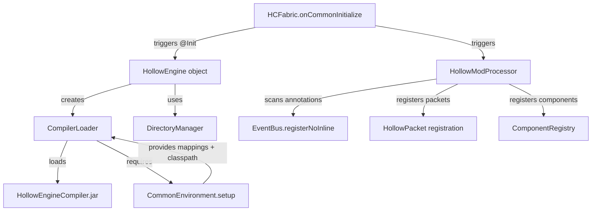
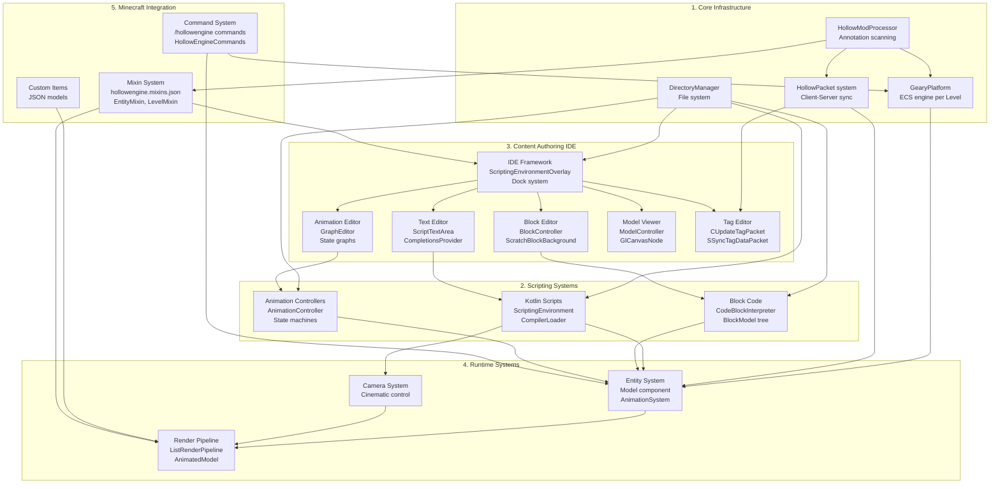
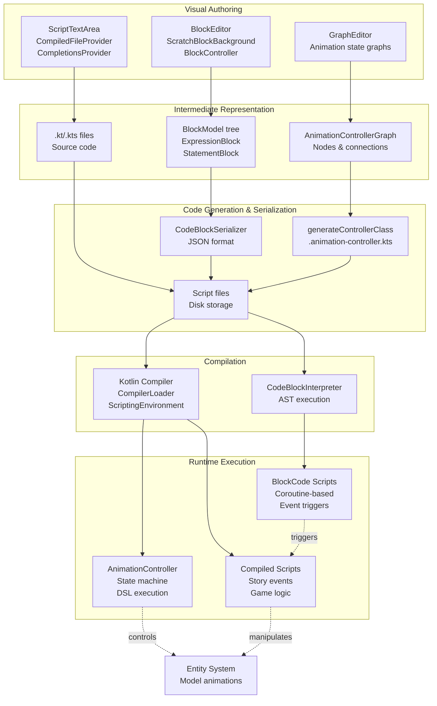
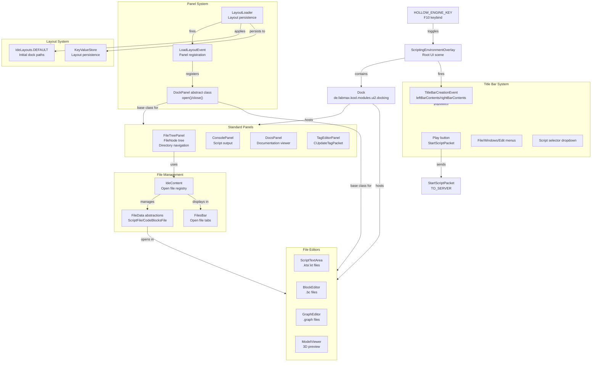
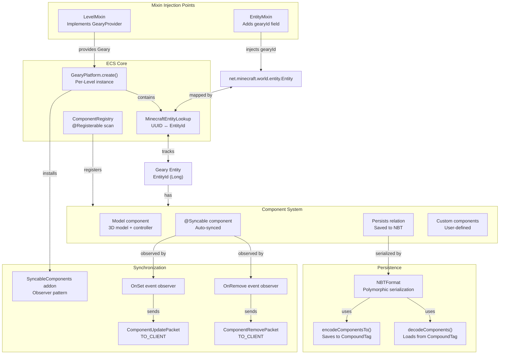
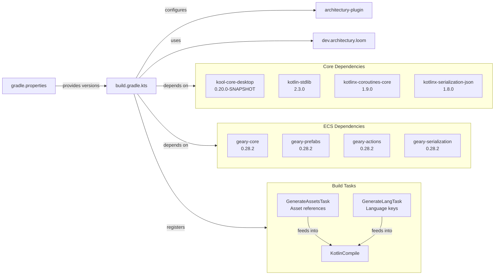

# Overview

<details>
<summary>Relevant source files</summary>

The following files were used as context for generating this wiki page:

- [build.gradle.kts](build.gradle.kts)
- [gradle.properties](gradle.properties)
- [src/main/java/ru/hollowhorizon/hollowengine/HollowEngine.kt](src/main/java/ru/hollowhorizon/hollowengine/HollowEngine.kt)
- [src/main/resources/hollowengine.mixins.json](src/main/resources/hollowengine.mixins.json)

</details>


HollowEngine is a comprehensive content creation framework for Minecraft mods that provides an integrated in-game development environment. The system enables content authors to create custom entities, animations, visual programming scripts, and game mechanics without external tools or server restarts. HollowEngine combines three distinct scripting approaches (Kotlin scripts, visual block programming, and animation state machines) with a full-featured IDE, 3D model rendering pipeline, and ECS-based entity management.

This document provides a high-level architectural overview of HollowEngine, explaining the five major system layers and how they interconnect. For detailed information about specific subsystems, refer to: [Getting Started](#2), [In-Game IDE](#3), [Text Script Editor](#4), [Visual Block Editor](#5), [Block Programming System](#6), [Script Execution](#7), [Geary ECS Integration](#8), [3D Model System](#9), [Animation System](#10), and [Game Integration](#12).

**Sources:** [gradle.properties:1-22](), [src/main/java/ru/hollowhorizon/hollowengine/HollowEngine.kt:1-34]()

## Project Identity and Initialization

HollowEngine is identified by `modId=hollowengine` at version `2.0.0-Beta15.1`. The build system uses Gradle with the Architectury plugin and Loom for multi-loader support (Fabric, Forge, NeoForge).

**Mod Initialization Flow**



**Core Constants and Entry Points:**
- `HollowEngine.MODID` = `"hollowengine"` - Mod identifier constant
- `HollowEngine.compilerLoader` - `CompilerLoader` instance managing the dynamic Kotlin compiler
- `DirectoryManager.HOLLOW_ENGINE` - Base `Path` for mod files (`./hollowengine/`)
- Fabric entry points defined in [build.gradle.kts:29-32](): `HCFabric::onCommonInitialize` and `HCFabric::onClientInitialize`

The `HollowModProcessor` scans all classes with annotations (`@SubscribeEvent`, `@HollowPacketHandler`, `@Registerable`, `@Init`, etc.) and auto-registers them during mod initialization via the `getAnnotatedClasses`, `getAnnotatedMethods`, and `getSubTypes` scanning functions.

**Sources:** [src/main/java/ru/hollowhorizon/hollowengine/HollowEngine.kt:17-33](), [gradle.properties:1-7](), [build.gradle.kts:18-36](), [src/main/java/ru/hollowhorizon/hollowengine/common/registry/HollowModProcessor.kt:34-118]()

## System Architecture

HollowEngine is structured in five major architectural layers that build upon each other:

**Five-Layer Architecture**



**Layer Descriptions:**

| Layer | Key Components | Description |
|-------|---------------|-------------|
| **1. Core Infrastructure** | `HollowModProcessor`, `GearyPlatform`, `HollowPacket`, `DirectoryManager` | Foundation layer providing annotation-based registration, per-level ECS instances, client-server networking, and file system management. Initializes during mod bootstrap. |
| **2. Scripting Systems** | `ScriptingEnvironment`, `CodeBlockInterpreter`, `AnimationController` | Three parallel scripting approaches targeting different user skill levels: Kotlin for programmers, BlockCode for visual programming, Animation Controllers for state-based animation. |
| **3. Content Authoring IDE** | `ScriptingEnvironmentOverlay`, `ScriptTextArea`, `BlockController`, `GraphEditor` | In-game IDE with specialized editors for text (Kotlin), blocks (visual), animations (graphs), 3D models, and game tags. Uses `Dock` system from kool framework for flexible panel layout. |
| **4. Runtime Systems** | `Model` component, `AnimationSystem`, `ListRenderPipeline` | Execution layer handling entities with custom models/animations, camera control for cinematics, and 3D rendering pipeline. |
| **5. Minecraft Integration** | Mixin system, `/hollowengine` commands, custom items | Bytecode injection via mixins integrates HollowEngine into Minecraft's core classes. Commands provide in-game utilities. Custom items extend game content. |

**Key Integration Mechanisms:**

- **Annotation-Based Registration**: `HollowModProcessor` scans `@SubscribeEvent`, `@HollowPacketHandler`, `@Registerable`, `@Init` annotations at startup
- **Mixin Injection**: `EntityMixin` adds `gearyId` field to all entities; `LevelMixin` implements `GearyProvider` for per-level ECS
- **Component Synchronization**: Components with `@Syncable` annotation auto-sync via `SyncableComponents` addon using observer pattern
- **File System Bridge**: `DirectoryManager` provides path conversion between IDE and disk storage

**Sources:** [src/main/java/ru/hollowhorizon/hollowengine/common/registry/HollowModProcessor.kt:34-140](), [src/main/java/ru/hollowhorizon/hollowengine/common/geary/GearyPlatform.kt:34-74](), [src/main/resources/hollowengine.mixins.json:1-80](), [src/main/java/ru/hollowhorizon/hollowengine/common/geary/sync/SyncableComponents.kt:56-86]()

## Three Scripting Paradigms

HollowEngine supports three distinct scripting approaches with different authoring models but unified execution:

**Scripting System Integration**



### 1. Block-Based Visual Programming

The `BlockEditor` provides a Scratch-inspired drag-and-drop interface for non-programmers. Blocks are organized into a tree of `BlockModel` nodes with three categories:

- **ExpressionBlock**: Returns values (`MathBlock`, `CompareBlock`, `VariableBlock`)
- **StatementBlock**: Performs actions (`PrintBlock`, `DelayBlock`, `SetVarBlock`)
- **ContainerBlock**: Holds child blocks (`WhileBlock`, `IfElseBlock`, `RepeatBlock`)

Blocks render using `ScratchBlockBackground` with puzzle-piece shapes from `PuzzleShapes`. The `BlockController` manages drag-and-drop, collision detection, and selection. User actions are recorded by `HistoryManager` for undo/redo. Serialization to JSON is handled by `CodeBlockSerializer`. Runtime execution uses `CodeBlockInterpreter` which evaluates blocks as coroutines in a `BlockContext` with `BlockFrame` stack management.

**Key Block Programming Classes:**
- `BlockEditor` - Main editor with pan/zoom, `DragState` management
- `BlockController` - Handles user interactions and block connections
- `BlockModel` - Abstract base class for all block types
- `BlockProvider` interface - Defines available blocks per category
- `StandardModules` - Built-in blocks (Math, Logic, Variables, Control Flow, Events)
- `CodeBlockSerializer` - Serializes `BlockModel` tree to JSON
- `CodeBlockInterpreter` - Executes block programs with `suspend` support

**Sources:** See [Visual Block Editor](#5) and [Block Programming System](#6).

### 2. Animation State Machine Graphs

The `GraphEditor` provides visual state machine authoring for entity animations. Nodes represent animation states; edges represent transitions with Molang condition expressions. The graph is serialized as `AnimationControllerGraph` to JSON, then **code-generated** into a `.animation-controller.kts` Kotlin DSL file. This DSL file is compiled by the Kotlin compiler into an `AnimationController` subclass that executes at runtime.

The runtime `AnimationController` uses a layer-based system with:
- **States**: Animation playback with loop/hold modes
- **Transitions**: Conditional state changes evaluated via Molang
- **Layers**: Priority-ordered animation layers with bone masks
- **Blend Modes**: Override vs. Additive blending

**Key Animation Controller Classes:**
- `GraphEditor` - Visual graph editor for state machines
- `AnimationControllerGraph` - Serializable graph representation
- `generateControllerClass()` - Code generation from graph to DSL
- `AnimationController` - Runtime state machine base class
- `AnimationSystem` - Manages animation playback with `AnimationDispatcher`
- `ModelAttachment` - Links 3D model with animations

**Sources:** See [Animation System](#10).

### 3. Kotlin Text Scripting

The `ScriptTextArea` provides a professional Kotlin IDE with syntax highlighting, code completion, and diagnostics powered by the Kotlin Analysis API. Scripts are `.kts` files stored in `hollowengine/` directory.

Compilation requires `HollowEngineCompiler.jar` loaded by `CompilerLoader`. The `ScriptingEnvironment` configures classpath and mappings via `CommonEnvironment.setup()`. Compiled scripts execute server-side with full access to mod APIs.

**Key Text Editor Classes:**
- `ScriptTextArea` - Main text editor UI with `TextAreaNode` base
- `CompiledFileProvider` - Manages file content and edit history
- `CompletionsProvider` - Code intelligence via Kotlin Analysis API
- `ScriptingAnalyzerImpl` - Provides syntax highlighting and diagnostics
- `UndoRedoHandler` - Manages undo/redo with `UndoableAction`
- `CompilerLoader` - Dynamically loads Kotlin compiler JAR
- `ScriptingEnvironment` - Configures compilation context

**Sources:** See [Text Script Editor](#4), [src/main/java/ru/hollowhorizon/hollowengine/HollowEngine.kt:20-28]()

## In-Game IDE Architecture

The IDE is implemented as `ScriptingEnvironmentOverlay`, a full-screen kool UI overlay toggled via F10 keybind (`HOLLOW_ENGINE_KEY`). The interface uses the `Dock` system from `de.fabmax.kool.modules.ui2.docking` for flexible panel arrangement.

**IDE Component Architecture**



**Panel System and Registration:**

Panels extend the `DockPanel` abstract class and are registered via `LoadLayoutEvent`:

```
DockPanel(name: String, dock: Dock)
  - abstract fun UiScope.compose()  // UI content
  - open() / close()  // Lifecycle methods
  - val dockable: UiDockable  // Wraps panel for dock system
  - val icon: ResourceLocation  // Panel icon
```

Standard panels:

| Panel Class | Purpose | Icon Path | File Association |
|-------------|---------|-----------|------------------|
| `FileTreePanel` | Directory navigation with `FileNode` tree and filtering | `CODE_EDITOR` | All files |
| `ConsolePanel` | Displays script output and error messages | `CONSOLE` | N/A |
| `TagEditorPanel` | Edit Minecraft block/item tags, syncs via `CUpdateTagPacket` | `TAG` | N/A |
| `DocsPanel` | Documentation viewer | `DOCS` | `.md` files |

**File Management:**

The `IdeContent` object maintains the registry of open files:
- `IdeContent.files: Map<String, FileData>` - Maps file paths to `FileData` instances
- `IdeContent.openFile(path, bytes)` - Opens file in appropriate editor based on extension
- `FileData` subtypes: `ScriptFile`, `CodeBlocksFile`, `AnimationControllerFile`, `ImageFile`, `DocFile`

The `FilesBar` displays tabs for open files with drag-to-dock support via `FileDockingTabsBar()` function.

**Layout Persistence:**

Dock layouts are saved to `KeyValueStore` and restored on IDE open. Default layout is defined in `IdeLayouts.DEFAULT` using dock path syntax like `"0/1"` representing tree structure.

**Key IDE Classes:**
- `ScriptingEnvironmentOverlay` - Root UI scene, manages `Dock` instance
- `Dock` - Docking framework from kool library
- `DockPanel` - Abstract base class for all panels
- `FileNode` - File tree node with `AnimatableFloat` for expansion animation
- `IdeContent` - Singleton managing open files and their `FileData` instances
- `LoadLayoutEvent` - Event fired to register panels with `LayoutLoader`
- `LayoutLoader` - Manages panel registration and layout persistence
- `FilesBar` / `FileDockingTabsBar()` - Displays open file tabs

**Sources:** [src/main/java/ru/hollowhorizon/hollowengine/client/gui/scripting/FileNode.kt:20-99](), [src/main/java/ru/hollowhorizon/hollowengine/client/gui/scripting/panels/DockPanel.kt:14-82](), [src/main/java/ru/hollowhorizon/hollowengine/client/gui/scripting/panels/FileTreePanel.kt:13-48](), [src/main/java/ru/hollowhorizon/hollowengine/client/gui/scripting/files/FilesBar.kt:113-236](), [src/main/java/ru/hollowhorizon/hollowengine/client/keys/HollowEngineKeybinds.kt:13](). See [In-Game IDE](#3) for detailed documentation.

## Script Execution and Network Flow

All three scripting paradigms use Kotlin coroutines for asynchronous execution. Scripts execute server-side with permission checks, allowing suspendable operations like delays and NPC actions.

**Client-Server Execution Flow**

```mermaid
sequenceDiagram
    participant User
    participant IDE["ScriptingEnvironmentOverlay<br/>(Client)"]
    participant TitleBar["TitleBarCreationEvent<br/>Play button"]
    participant StartPacket["StartScriptPacket<br/>TO_SERVER"]
    participant Server["Server Handler"]
    participant PermCheck["Permission Check<br/>Operator level 2"]
    participant Compiler["CompilerLoader<br/>ScriptingEnvironment"]
    participant Runtime["Coroutine Launch<br/>server.coroutineScope"]
    participant World["Minecraft World<br/>Entity/Component APIs"]
    
    User->>IDE: "Edit script/blocks"
    User->>TitleBar: "Click Play button"
    TitleBar->>StartPacket: "create(scriptPath)"
    StartPacket->>Server: "Send packet"
    Server->>PermCheck: "Check hasPermission(2)"
    PermCheck-->>Server: "Authorized"
    Server->>Compiler: "compile(.kts) or load(.bc)"
    Compiler->>Compiler: "CommonEnvironment.setup()<br/>Load mappings + classpath"
    Compiler-->>Server: "Compiled script"
    Server->>Runtime: "launch { execute() }"
    Runtime->>World: "Manipulate entities/components"
    World-->>User: "Visual feedback"
```

**Execution Paths:**

| Script Type | Compilation | Execution | Suspension Support |
|-------------|------------|-----------|-------------------|
| **Kotlin (.kts)** | `CompilerLoader` → `ScriptingEnvironment` → Kotlin compiler | Direct coroutine launch | Full `suspend` support via coroutines |
| **Block Code (.bc)** | `CodeBlockSerializer` deserializes JSON to `BlockModel` tree | `CodeBlockInterpreter` evaluates tree with `BlockContext` | `DelayBlock` uses `yield()` in coroutine |
| **Animation Controller** | `generateControllerClass()` generates `.animation-controller.kts` → Kotlin compiler | `AnimationController` state machine | Transitions evaluate per-tick via `AnimationSystem` |

**Permission Model:**

Scripts require operator level 2 for execution (`hasPermission(2)` check). Tag editing via `CUpdateTagPacket` requires `GAMEMASTER` permission level. Client-side actions (IDE editing, file operations) have no permission requirements.

**Key Execution Classes:**
- `StartScriptPacket` / `StopScriptPacket` - Trigger script lifecycle (see [Script Execution](#7))
- `CompilerLoader` - Loads `HollowEngineCompiler.jar` and manages compiler instance
- `ScriptingEnvironment` - Configures compilation classpath and deobfuscation mappings
- `CommonEnvironment.setup()` - Provides SRG/MCP mappings and classpath entries
- `CodeBlockInterpreter` - Interprets block programs with `BlockContext` and `BlockFrame` stack
- `BlocksSystemSavedData` - Server-side persistent storage for block script variables

**Sources:** [src/main/java/ru/hollowhorizon/hollowengine/HollowEngine.kt:20-28](), [src/main/java/ru/hollowhorizon/hollowengine/common/commands/HollowEngineCommands.kt:49-58](), [src/main/java/ru/hollowhorizon/hollowengine/common/commands/HollowEngineCommands.kt:153-244](). See [Script Execution](#7) for details.

## Geary ECS Integration

HollowEngine integrates the Geary entity-component-system (ECS) into Minecraft via mixins, providing a modern ECS architecture with automatic network synchronization:

**ECS Architecture and Minecraft Bridge**



**Mixin Integration:**

| Mixin | Target Class | Injection Purpose |
|-------|-------------|-------------------|
| `EntityMixin` | `net.minecraft.world.entity.Entity` | Adds `gearyId: Long` field to store Geary EntityId |
| `LevelMixin` | `net.minecraft.world.level.Level` | Implements `GearyProvider` interface, returns per-level `Geary` instance |
| `ServerPlayerMixin` | `net.minecraft.server.level.ServerPlayer` | Handles component cloning on player death/respawn via `PlayerEvent.Clone` |

**Component Synchronization:**

Components annotated with `@Syncable` automatically synchronize to tracking clients via the `SyncableComponents` addon:
1. `ComponentRegistry` scans for `@Syncable` annotations during initialization
2. Components marked `@Syncable` are registered with the `Syncs` relation
3. `OnSet` observer detects component changes and sends `ComponentUpdatePacket` to tracking clients
4. `OnRemove` observer detects component removal and sends `ComponentRemovePacket` to tracking clients

The observer-based approach eliminates manual packet sending code.

**Key ECS Classes:**
- `GearyPlatform` - Creates per-Level Geary instance via `GearyPlatform.create(level)`
- `MinecraftEntityLookup` - Bidirectional mapping between Minecraft UUID and Geary EntityId
- `ComponentRegistry` - Registry of all `@Registerable` components with serializers
- `SyncableComponents` - Geary addon providing automatic component synchronization
- `NBTFormat` - Serializes components to/from NBT with polymorphic type support via `NBT_TAGS`
- `ComponentUpdatePacket` / `ComponentRemovePacket` - Network packets for component synchronization

**Sources:** [src/main/resources/hollowengine.mixins.json:27-28](), [src/main/java/ru/hollowhorizon/hollowengine/common/geary/GearyPlatform.kt:34-74](), [src/main/java/ru/hollowhorizon/hollowengine/common/geary/sync/SyncableComponents.kt:56-114](), [src/main/java/ru/hollowhorizon/hollowengine/common/utils/nbt/NBTFormat.kt:80-108](). See [Geary ECS Integration](#8) for detailed documentation.

## File System Organization

HollowEngine organizes files in the `hollowengine/` directory:

| Directory/File | Purpose |
|----------------|---------|
| `hollowengine/` | Base directory for all HollowEngine files |
| `hollowengine/*.kts` | Kotlin script files |
| `hollowengine/*.bc` | Block code files |
| `hollowengine/HollowEngineCompiler.jar` | Dynamic Kotlin compiler |
| `geary/` | Geary ECS configuration and data |

The `DirectoryManager` provides path conversion utilities for reading/writing files within the IDE.

**Key Classes:**
- `DirectoryManager.HOLLOW_ENGINE` - Base path constant
- `DirectoryManager.fromReadablePath()` - Path conversion utility

**Sources:** [src/main/java/ru/hollowhorizon/hollowengine/HollowEngine.kt:20](), [src/main/java/ru/hollowhorizon/hollowengine/client/gui/scripting/FileNode.kt:73]()

## Build System and Dependencies

The project uses Gradle with the Architectury plugin for multi-platform builds targeting Fabric, Forge, and NeoForge:



**Key Dependencies:**

| Dependency | Version | Purpose |
|------------|---------|---------|
| `kool-core-desktop` | 0.20.0-SNAPSHOT | 3D rendering and UI framework |
| `kotlin-stdlib` | 2.3.0 | Kotlin standard library |
| `kotlinx-coroutines-core` | 1.9.0 | Asynchronous execution |
| `kotlinx-serialization-json` | 1.8.0 | JSON serialization |
| `geary-core` | 0.28.2 | ECS platform |
| `geary-prefabs` | 0.28.2 | Prefab system |
| `geary-serialization` | 0.28.2 | Component serialization |

**Build Configuration:**
- `modId=hollowengine`
- `modVersion=2.0.0-Beta15.1`
- `kotlinVersion=2.3.0`
- `koolVersion=0.20.0-SNAPSHOT`

**Code Generation:**
- `GenerateAssetsTask` - Generates type-safe Kotlin code for asset references (e.g., `Assets.Hollowengine.Textures.Gui.Icons.CODE_EDITOR`)
- `GenerateLangTask` - Generates language key references
- Output directory: `build/generated/sources/`

**Sources:** [build.gradle.kts:1-146](), [gradle.properties:1-22](), [build.gradle.kts:120-142]()

## Getting Started

To begin using HollowEngine:

1. **Opening the IDE**: Press F10 in-game to open the scripting environment
2. **Creating Scripts**: See [Text Script Editor](#4) for Kotlin scripting
3. **Creating Block Programs**: See [Visual Block Programming](#5) for block-based programming
4. **Executing Code**: See [Script Execution](#7) for running programs
5. **Working with Entities**: See [Geary ECS System](#8) for entity management
6. **Using Commands**: See [Commands System](#9.1) for runtime manipulation

For detailed build instructions and development setup, see [Getting Started](#2).

**Sources:** [src/main/java/ru/hollowhorizon/hollowengine/client/keys/HollowEngineKeybinds.kt:1-25]()