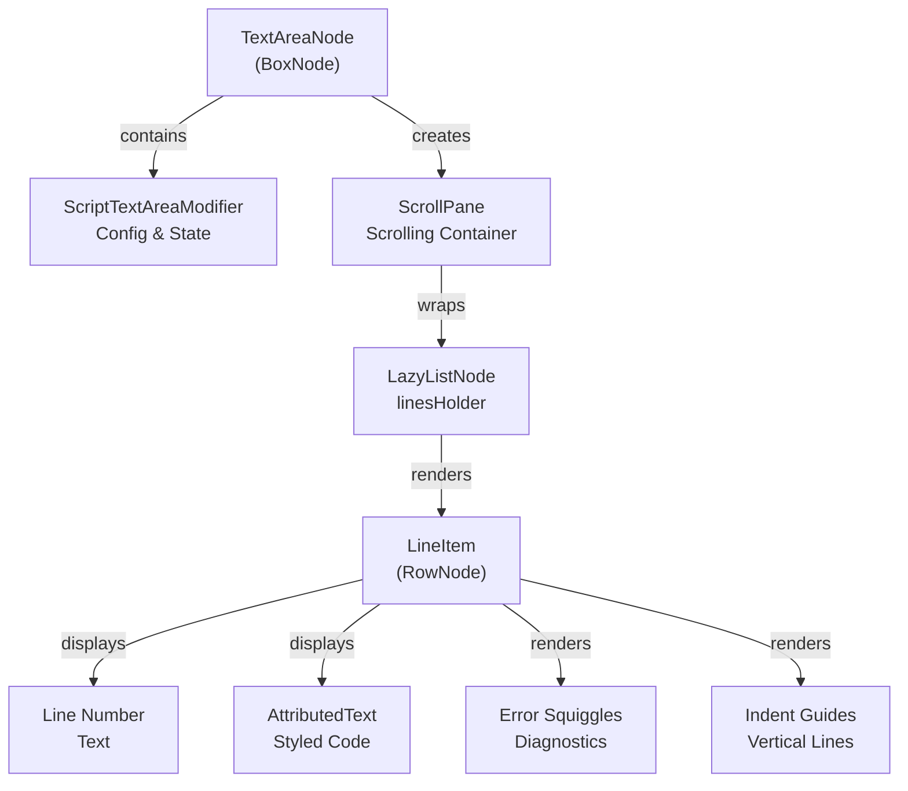
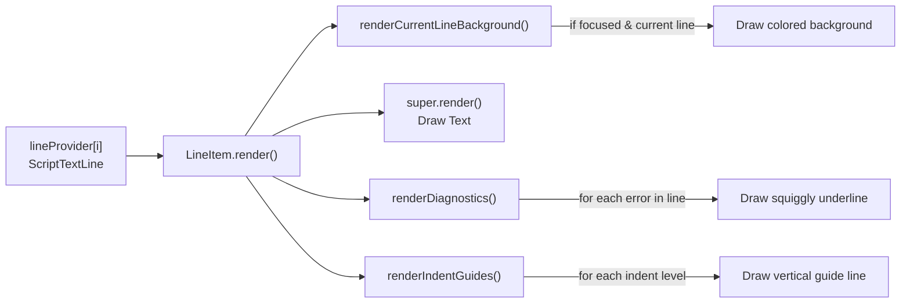
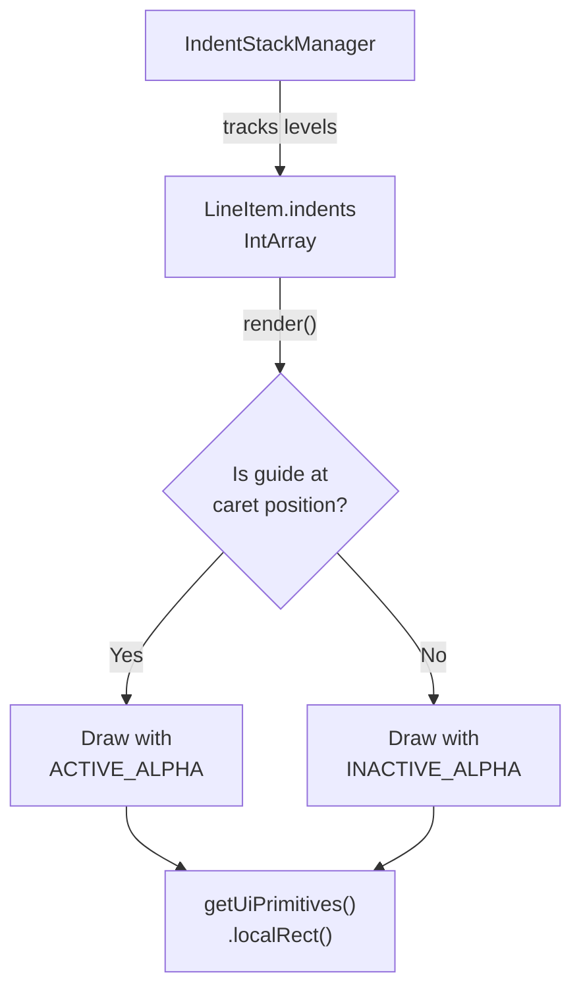
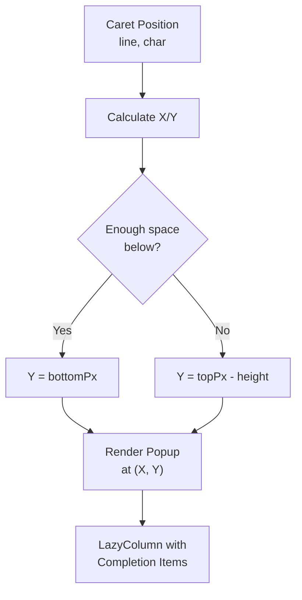

# Text Area Component

<details>
<summary>Relevant source files</summary>

The following files were used as context for generating this wiki page:

- [src/main/java/ru/hollowhorizon/hollowengine/client/gui/scripting/files/ScriptFile.kt](src/main/java/ru/hollowhorizon/hollowengine/client/gui/scripting/files/ScriptFile.kt)
- [src/main/java/ru/hollowhorizon/hollowengine/client/gui/scripting/files/text/ScriptTextEditorHandler.kt](src/main/java/ru/hollowhorizon/hollowengine/client/gui/scripting/files/text/ScriptTextEditorHandler.kt)
- [src/main/java/ru/hollowhorizon/hollowengine/client/gui/scripting/files/text/SelectionHelper.kt](src/main/java/ru/hollowhorizon/hollowengine/client/gui/scripting/files/text/SelectionHelper.kt)
- [src/main/java/ru/hollowhorizon/hollowengine/client/gui/scripting/files/text/components/CommandRegistry.kt](src/main/java/ru/hollowhorizon/hollowengine/client/gui/scripting/files/text/components/CommandRegistry.kt)
- [src/main/java/ru/hollowhorizon/hollowengine/client/gui/scripting/files/text/components/EditorCommandContext.kt](src/main/java/ru/hollowhorizon/hollowengine/client/gui/scripting/files/text/components/EditorCommandContext.kt)
- [src/main/java/ru/hollowhorizon/hollowengine/client/gui/scripting/files/text/components/EditorLanguageService.kt](src/main/java/ru/hollowhorizon/hollowengine/client/gui/scripting/files/text/components/EditorLanguageService.kt)
- [src/main/java/ru/hollowhorizon/hollowengine/client/gui/scripting/files/text/components/EditorState.kt](src/main/java/ru/hollowhorizon/hollowengine/client/gui/scripting/files/text/components/EditorState.kt)
- [src/main/java/ru/hollowhorizon/hollowengine/client/gui/scripting/files/text/components/TextInputController.kt](src/main/java/ru/hollowhorizon/hollowengine/client/gui/scripting/files/text/components/TextInputController.kt)
- [src/main/java/ru/hollowhorizon/hollowengine/client/gui/scripting/files/text/components/commands/ApplyBracketsCommand.kt](src/main/java/ru/hollowhorizon/hollowengine/client/gui/scripting/files/text/components/commands/ApplyBracketsCommand.kt)
- [src/main/java/ru/hollowhorizon/hollowengine/client/gui/scripting/files/text/components/commands/ApplyCompletionItemCommand.kt](src/main/java/ru/hollowhorizon/hollowengine/client/gui/scripting/files/text/components/commands/ApplyCompletionItemCommand.kt)
- [src/main/java/ru/hollowhorizon/hollowengine/client/gui/scripting/files/text/components/commands/EditorDefaultCommands.kt](src/main/java/ru/hollowhorizon/hollowengine/client/gui/scripting/files/text/components/commands/EditorDefaultCommands.kt)
- [src/main/java/ru/hollowhorizon/hollowengine/client/gui/scripting/files/text/components/commands/IndentCommand.kt](src/main/java/ru/hollowhorizon/hollowengine/client/gui/scripting/files/text/components/commands/IndentCommand.kt)
- [src/main/java/ru/hollowhorizon/hollowengine/client/gui/scripting/files/text/components/commands/InsertNewlineCommand.kt](src/main/java/ru/hollowhorizon/hollowengine/client/gui/scripting/files/text/components/commands/InsertNewlineCommand.kt)
- [src/main/java/ru/hollowhorizon/hollowengine/client/gui/scripting/files/text/components/commands/ToggleLineCommentCommand.kt](src/main/java/ru/hollowhorizon/hollowengine/client/gui/scripting/files/text/components/commands/ToggleLineCommentCommand.kt)
- [src/main/java/ru/hollowhorizon/hollowengine/client/gui/scripting/files/text/components/commands/UnindentCommand.kt](src/main/java/ru/hollowhorizon/hollowengine/client/gui/scripting/files/text/components/commands/UnindentCommand.kt)
- [src/main/java/ru/hollowhorizon/hollowengine/client/gui/scripting/files/text/components/keymap/EditorDefaultKeys.kt](src/main/java/ru/hollowhorizon/hollowengine/client/gui/scripting/files/text/components/keymap/EditorDefaultKeys.kt)
- [src/main/java/ru/hollowhorizon/hollowengine/client/gui/scripting/files/text/components/keymap/KeyMap.kt](src/main/java/ru/hollowhorizon/hollowengine/client/gui/scripting/files/text/components/keymap/KeyMap.kt)
- [src/main/java/ru/hollowhorizon/hollowengine/client/gui/scripting/files/text/util/CompiledFileProvider.kt](src/main/java/ru/hollowhorizon/hollowengine/client/gui/scripting/files/text/util/CompiledFileProvider.kt)
- [src/main/java/ru/hollowhorizon/hollowengine/client/gui/scripting/files/text/util/TextAreaNode.kt](src/main/java/ru/hollowhorizon/hollowengine/client/gui/scripting/files/text/util/TextAreaNode.kt)
- [src/main/java/ru/hollowhorizon/hollowengine/common/scripting/ide/JsonScriptingAnalyzer.kt](src/main/java/ru/hollowhorizon/hollowengine/common/scripting/ide/JsonScriptingAnalyzer.kt)

</details>


## Purpose and Scope

This page documents the **TextAreaNode** component, which is responsible for the visual rendering and layout of the text editor's content area. It handles line display, scrolling, selection rendering, diagnostic visualization, and completion popup positioning.

For the overall text editor structure and state management, see [Editor Architecture](#4.1). For input handling and text editing operations, see [Editing Commands](#4.4). For syntax highlighting and analysis integration, see [Language Services](#4.3).

---

## Component Architecture

The text area is implemented as a Kool UI component that extends `BoxNode` and implements custom rendering behavior for code editing.

### Core Classes

**Primary Component**
```
TextAreaNode (BoxNode, ScriptTextAreaScope, Focusable)
  ├── modifier: ScriptTextAreaModifier
  ├── linesHolder: LazyListNode
  ├── selectionController: TextSelectionController
  ├── inputController: TextInputController
  └── completionManager: CompletionManager
```

**Key Responsibilities:**
- **TextAreaNode**: Main component, manages rendering lifecycle and child components
- **ScriptTextAreaModifier**: Configuration and state holder (padding, selection state, errors, completions)
- **LazyListNode**: Efficient virtualized line rendering
- **LineItem**: Inner class that renders individual text lines with decorations

Sources: [src/main/java/ru/hollowhorizon/hollowengine/client/gui/scripting/files/text/util/TextAreaNode.kt:261-294]()



**Diagram: Text Area Component Structure**

Sources: [src/main/java/ru/hollowhorizon/hollowengine/client/gui/scripting/files/text/util/TextAreaNode.kt:261-294](), [src/main/java/ru/hollowhorizon/hollowengine/client/gui/scripting/files/text/util/TextAreaNode.kt:296-396]()

---

## Line Rendering System

The text area uses a virtualized rendering approach via `LazyListNode`, which only creates visual elements for lines currently visible in the viewport. This ensures efficient performance even with large files.

### Line Creation Process

The `setText()` method populates the lazy list with line items:

1. **Indent Analysis**: Uses `IndentStackManager` to track indent levels for guide rendering
2. **Line Iteration**: Creates one `LineItem` per text line via the `indices()` function
3. **Content Setup**: Each `LineItem` contains:
   - Optional line number display
   - Attributed text with syntax highlighting
   - Background decorations (current line, diagnostics, indent guides)

Sources: [src/main/java/ru/hollowhorizon/hollowengine/client/gui/scripting/files/text/util/TextAreaNode.kt:457-507]()

### LineItem Structure

Each `LineItem` is a `RowNode` containing:

| Component | Type | Purpose |
|-----------|------|---------|
| Line Number | `Box` + `Text` | Optional line index display (1-based) |
| Padding | `Box` | Spacing between number and text |
| Attributed Text | `AttributedText` | Syntax-highlighted code content |

Sources: [src/main/java/ru/hollowhorizon/hollowengine/client/gui/scripting/files/text/util/TextAreaNode.kt:478-503]()

### Render Pipeline



**Diagram: LineItem Rendering Pipeline**

Sources: [src/main/java/ru/hollowhorizon/hollowengine/client/gui/scripting/files/text/util/TextAreaNode.kt:303-308]()

---

## Visual Features

### Current Line Highlighting

The line containing the caret is highlighted with a background color when the editor is focused. This is rendered in `renderCurrentLineBackground()`:

- **Condition**: `lineIndex == modifier.selectionCaretLine && isFocused.use()`
- **Color**: `EditorTheme.currentLineBg`
- **Layer**: `UiSurface.LAYER_BACKGROUND`

Sources: [src/main/java/ru/hollowhorizon/hollowengine/client/gui/scripting/files/text/util/TextAreaNode.kt:310-316]()

### Selection Rendering

Selection rendering is delegated to `TextSelectionController` via the `applySelectionRange()` call. The text area only manages the selection state through `ScriptTextAreaModifier`:

**Selection State Properties:**
- `selectionStartLine` / `selectionCaretLine`: Line bounds
- `selectionStartChar` / `selectionCaretChar`: Character bounds
- `onSelectionChanged`: Callback for selection updates

Sources: [src/main/java/ru/hollowhorizon/hollowengine/client/gui/scripting/files/text/util/TextAreaNode.kt:52-64](), [src/main/java/ru/hollowhorizon/hollowengine/client/gui/scripting/files/text/util/TextAreaNode.kt:538-556]()

### Error Diagnostics Display

Diagnostics are rendered as colored squiggly underlines beneath error regions:

**Rendering Algorithm:**
1. Filter diagnostics for current line
2. Calculate start/end pixel positions using font metrics
3. Draw zigzag pattern at line bottom

**Visual Properties:**
- **Amplitude**: `TextEditorConstants.SQUIGGLY_AMPLITUDE` (vertical deviation)
- **Step**: `TextEditorConstants.SQUIGGLY_STEP` (horizontal spacing)
- **Line Width**: `TextEditorConstants.SQUIGGLY_LINE_WIDTH`
- **Color**: Red for errors, yellow for warnings

**Hover Behavior:**
When the mouse hovers over a squiggly, the error message is displayed in a popup by setting `modifier.errorMessage`.

Sources: [src/main/java/ru/hollowhorizon/hollowengine/client/gui/scripting/files/text/util/TextAreaNode.kt:318-374]()

### Indent Guides

Vertical lines are drawn to visualize indentation levels:

**Implementation Details:**
- **Data Source**: `indents` array populated by `IndentStackManager`
- **Position**: Calculated based on space width and indent level
- **Color**: `EditorTheme.indentGuide` with variable alpha
  - Active guide (at caret): `INDENT_GUIDE_ACTIVE_ALPHA`
  - Inactive guides: `INDENT_GUIDE_INACTIVE_ALPHA`
- **Layer**: `UiSurface.LAYER_BACKGROUND`

Sources: [src/main/java/ru/hollowhorizon/hollowengine/client/gui/scripting/files/text/util/TextAreaNode.kt:376-395]()



**Diagram: Indent Guide Rendering Logic**

Sources: [src/main/java/ru/hollowhorizon/hollowengine/client/gui/scripting/files/text/util/TextAreaNode.kt:376-395]()

---

## Scrolling and Layout

### ScrollPane Integration

The text area wraps the line list in a `ScrollPane` to enable scrolling:

**Configuration:**
- **Orientation**: Vertical list layout
- **Min Width**: `Grow.MinFit` (expands to fit content)
- **Wheel Scrolling**: Custom multipliers for X/Y axes
  - X: `SCROLL_WHEEL_X_MULTIPLIER`
  - Y: `SCROLL_WHEEL_Y_MULTIPLIER`

Sources: [src/main/java/ru/hollowhorizon/hollowengine/client/gui/scripting/files/text/util/TextAreaNode.kt:136-139](), [src/main/java/ru/hollowhorizon/hollowengine/client/gui/scripting/files/text/util/TextAreaNode.kt:418-431]()

### Scrollbar Configuration

Both vertical and horizontal scrollbars can be optionally displayed:

**Vertical Scrollbar:**
- Width: `sizes.smallGap`
- Colors: Defined by `EditorTheme.Scrollbar`
- Margin: `sizes.smallGap`

**Horizontal Scrollbar:**
- Height: `sizes.smallGap`
- Same theming as vertical

Sources: [src/main/java/ru/hollowhorizon/hollowengine/client/gui/scripting/files/text/util/TextAreaNode.kt:433-454]()

### Padding System

The modifier supports configurable padding for layout control:

| Property | Default | Purpose |
|----------|---------|---------|
| `lineStartPadding` | 0dp | Left padding before line numbers |
| `lineEndPadding` | 100dp | Right padding after text content |
| `firstLineTopPadding` | 0dp | Top padding above first line |
| `lastLineBottomPadding` | 16dp | Bottom padding below last line |

Sources: [src/main/java/ru/hollowhorizon/hollowengine/client/gui/scripting/files/text/util/TextAreaNode.kt:52-56]()

---

## Completion Popup Positioning

The text area calculates the position for the completion popup based on caret location and available viewport space.

### Position Calculation

The calculation occurs in `setupTextLine()` during the `onPositioned` callback:

**Horizontal Position:**
1. Find start of expression using `TextCaretNavigation.startOfExpression()`
2. Convert character index to pixels using `line.charIndexToPx()`
3. Add padding offset

**Vertical Position:**
1. Calculate required popup height based on item count
2. Check if popup fits below caret
3. If not enough space below, position above caret

**Formula:**
```
completionX = lineLeft + charIndexToPx(dotIndex) + padding
completionY = if (bottomPx + popupHeight > viewport.bottom)
                topPx - popupHeight
              else
                bottomPx
```

Sources: [src/main/java/ru/hollowhorizon/hollowengine/client/gui/scripting/files/text/util/TextAreaNode.kt:517-536]()

### Popup Rendering

The completion popup is rendered after the main content in `ScriptTextArea()`:

**Structure:**
- **Container**: `Popup` node at calculated position
- **Background**: Rounded rectangle with border
- **Content**: `LazyColumn` with scrollable completion items
- **Z-Layer**: 100,000,000 (ensures visibility above all content)

**Visibility Condition:**
`completions.isNotEmpty()` where completions come from either:
- `modifier.completions` (legacy)
- `provider.analysisState.completions` (preferred)

Sources: [src/main/java/ru/hollowhorizon/hollowengine/client/gui/scripting/files/text/util/TextAreaNode.kt:154-229]()



**Diagram: Completion Popup Positioning Flow**

Sources: [src/main/java/ru/hollowhorizon/hollowengine/client/gui/scripting/files/text/util/TextAreaNode.kt:517-536]()

---

## Modifier System

### ScriptTextAreaModifier

The modifier holds configuration and runtime state for the text area:

**Configuration Properties:**

| Property | Type | Purpose |
|----------|------|---------|
| `editorConfig` | `TextEditorConfig` | Global editor settings (font, line numbers, etc.) |
| `lineStartPadding` | `Dp` | Left margin before content |
| `lineEndPadding` | `Dp` | Right margin after content |
| `firstLineTopPadding` | `Dp` | Top padding |
| `lastLineBottomPadding` | `Dp` | Bottom padding |

**Runtime State:**

| Property | Type | Purpose |
|----------|------|---------|
| `editorHandler` | `TextEditorHandler?` | Text manipulation interface |
| `selectionStartLine/Char` | `Int` | Selection start position |
| `selectionCaretLine/Char` | `Int` | Caret/selection end position |
| `completions` | `MutableList<CompletionItem>` | Available code completions |
| `errors` | `MutableList<Diagnostic>` | Diagnostic messages |
| `errorMessage` | `String` | Current hover error message |

Sources: [src/main/java/ru/hollowhorizon/hollowengine/client/gui/scripting/files/text/util/TextAreaNode.kt:52-72]()

### Extension Functions

Fluent API for configuring the modifier:

```kotlin
modifier
    .lineStartPadding(8.dp)
    .lineEndPadding(100.dp)
    .editorHandler(provider)
    .setCaretPos(0, 0)
    .setSelectionRange(0, 5, 0, 10)
```

Sources: [src/main/java/ru/hollowhorizon/hollowengine/client/gui/scripting/files/text/util/TextAreaNode.kt:74-115]()

---

## TextLineProvider Interface

The text area consumes text data through the `TextLineProvider` interface:

**Interface Contract:**
```kotlin
interface TextLineProvider {
    val size: Int
    val lastIndex: Int
    operator fun get(index: Int): ScriptTextLine
}
```

**Primary Implementation:**
- `CompiledFileProvider`: Manages text editing, undo/redo, and syntax highlighting
- `ListTextLineProvider`: Simple list-backed provider

The text area reads lines on-demand during rendering but does not modify them directly. All text modifications go through `TextEditorHandler` (typically the same object as the provider).

Sources: [src/main/java/ru/hollowhorizon/hollowengine/client/gui/scripting/files/text/util/TextAreaNode.kt:590-599]()

---

## Usage Example

The text area is instantiated in `ScriptFile` composable:

**Typical Usage Pattern:**
```kotlin
ScriptTextArea(
    editorState,
    vScrollbarModifier = { /* scrollbar styling */ },
    hScrollbarModifier = { /* scrollbar styling */ }
) {
    modifier.editorConfig = editorState.config
    modifier.errors.clear()
    modifier.errors.addAll(editorState.analysis.diagnostics)
    modifier.completions.clear()
    modifier.completions.addAll(editorState.analysis.completions)
    
    installSelectionHandler(editorState.provider) { ... }
    modifier.editorHandler(editorState.editor)
}
```

The component automatically:
1. Renders text with syntax highlighting
2. Displays line numbers (if configured)
3. Shows errors as squiggly underlines
4. Highlights current line
5. Positions completion popup
6. Handles scrolling

Sources: [src/main/java/ru/hollowhorizon/hollowengine/client/gui/scripting/files/ScriptFile.kt:47-92]()

---

## Integration Points

The text area component collaborates with several other systems:

**Controllers:**
- `TextSelectionController`: Manages selection state and mouse interactions
- `TextInputController`: Processes keyboard input and editing commands
- `CompletionManager`: Manages completion popup state and navigation

**Providers:**
- `TextLineProvider`: Supplies text line data
- `TextEditorHandler`: Performs text modifications
- `CompiledFileProvider`: Combines both interfaces with syntax highlighting

**Visual Systems:**
- `AttributedText`: Renders styled text with color spans
- `EditorTheme`: Provides color scheme for backgrounds, guides, and errors

Sources: [src/main/java/ru/hollowhorizon/hollowengine/client/gui/scripting/files/text/util/TextAreaNode.kt:277-294]()