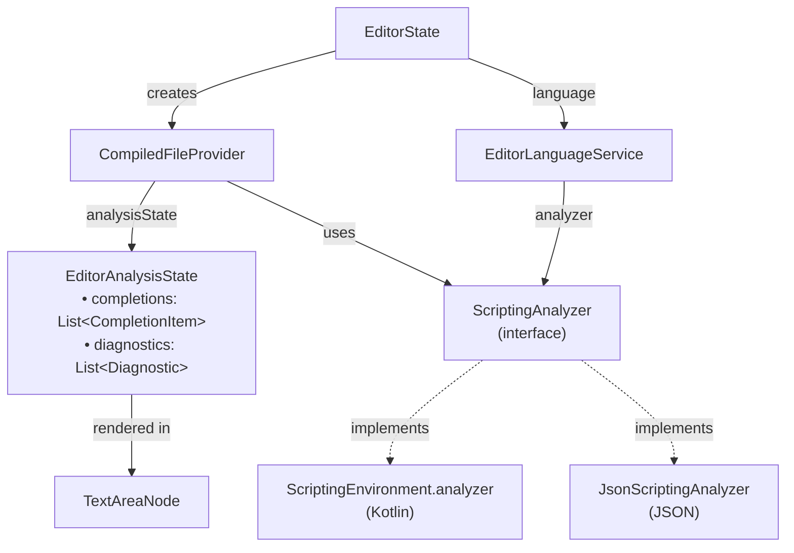
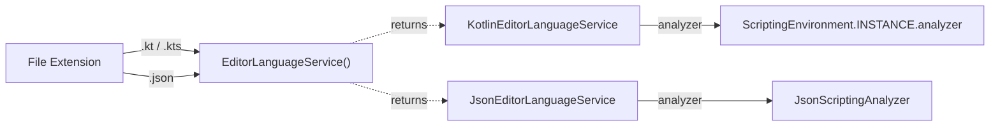
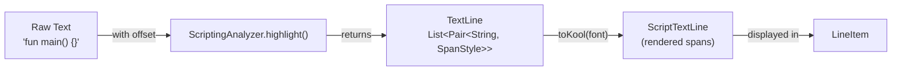
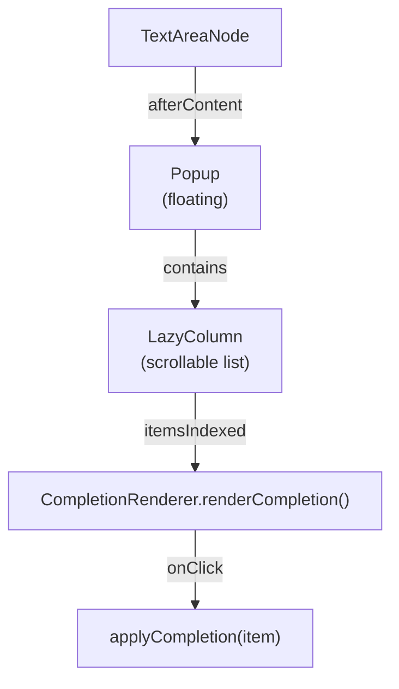
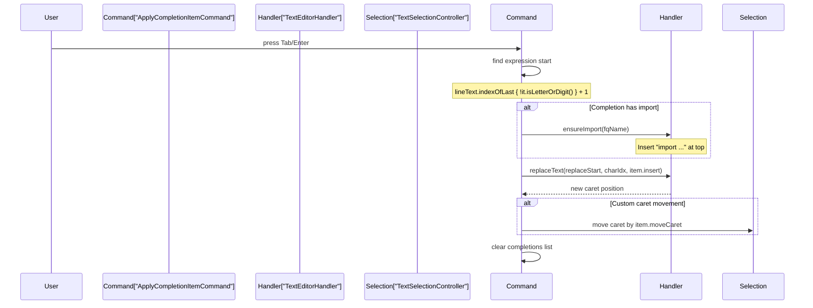
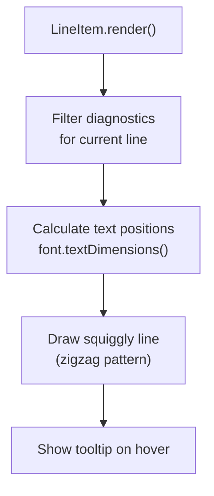
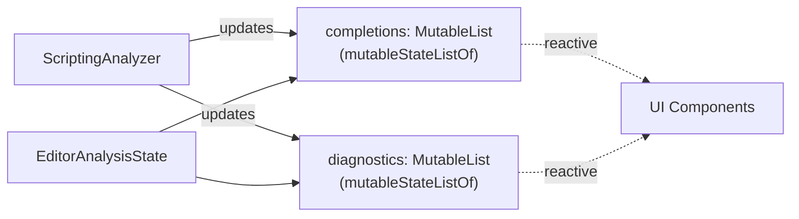

# Language Services

<details>
<summary>Relevant source files</summary>

The following files were used as context for generating this wiki page:

- [src/main/java/ru/hollowhorizon/hollowengine/client/gui/scripting/files/ScriptFile.kt](src/main/java/ru/hollowhorizon/hollowengine/client/gui/scripting/files/ScriptFile.kt)
- [src/main/java/ru/hollowhorizon/hollowengine/client/gui/scripting/files/text/ScriptTextEditorHandler.kt](src/main/java/ru/hollowhorizon/hollowengine/client/gui/scripting/files/text/ScriptTextEditorHandler.kt)
- [src/main/java/ru/hollowhorizon/hollowengine/client/gui/scripting/files/text/SelectionHelper.kt](src/main/java/ru/hollowhorizon/hollowengine/client/gui/scripting/files/text/SelectionHelper.kt)
- [src/main/java/ru/hollowhorizon/hollowengine/client/gui/scripting/files/text/components/CommandRegistry.kt](src/main/java/ru/hollowhorizon/hollowengine/client/gui/scripting/files/text/components/CommandRegistry.kt)
- [src/main/java/ru/hollowhorizon/hollowengine/client/gui/scripting/files/text/components/EditorCommandContext.kt](src/main/java/ru/hollowhorizon/hollowengine/client/gui/scripting/files/text/components/EditorCommandContext.kt)
- [src/main/java/ru/hollowhorizon/hollowengine/client/gui/scripting/files/text/components/EditorLanguageService.kt](src/main/java/ru/hollowhorizon/hollowengine/client/gui/scripting/files/text/components/EditorLanguageService.kt)
- [src/main/java/ru/hollowhorizon/hollowengine/client/gui/scripting/files/text/components/EditorState.kt](src/main/java/ru/hollowhorizon/hollowengine/client/gui/scripting/files/text/components/EditorState.kt)
- [src/main/java/ru/hollowhorizon/hollowengine/client/gui/scripting/files/text/components/TextInputController.kt](src/main/java/ru/hollowhorizon/hollowengine/client/gui/scripting/files/text/components/TextInputController.kt)
- [src/main/java/ru/hollowhorizon/hollowengine/client/gui/scripting/files/text/components/commands/ApplyBracketsCommand.kt](src/main/java/ru/hollowhorizon/hollowengine/client/gui/scripting/files/text/components/commands/ApplyBracketsCommand.kt)
- [src/main/java/ru/hollowhorizon/hollowengine/client/gui/scripting/files/text/components/commands/ApplyCompletionItemCommand.kt](src/main/java/ru/hollowhorizon/hollowengine/client/gui/scripting/files/text/components/commands/ApplyCompletionItemCommand.kt)
- [src/main/java/ru/hollowhorizon/hollowengine/client/gui/scripting/files/text/components/commands/EditorDefaultCommands.kt](src/main/java/ru/hollowhorizon/hollowengine/client/gui/scripting/files/text/components/commands/EditorDefaultCommands.kt)
- [src/main/java/ru/hollowhorizon/hollowengine/client/gui/scripting/files/text/components/commands/IndentCommand.kt](src/main/java/ru/hollowhorizon/hollowengine/client/gui/scripting/files/text/components/commands/IndentCommand.kt)
- [src/main/java/ru/hollowhorizon/hollowengine/client/gui/scripting/files/text/components/commands/InsertNewlineCommand.kt](src/main/java/ru/hollowhorizon/hollowengine/client/gui/scripting/files/text/components/commands/InsertNewlineCommand.kt)
- [src/main/java/ru/hollowhorizon/hollowengine/client/gui/scripting/files/text/components/commands/ToggleLineCommentCommand.kt](src/main/java/ru/hollowhorizon/hollowengine/client/gui/scripting/files/text/components/commands/ToggleLineCommentCommand.kt)
- [src/main/java/ru/hollowhorizon/hollowengine/client/gui/scripting/files/text/components/commands/UnindentCommand.kt](src/main/java/ru/hollowhorizon/hollowengine/client/gui/scripting/files/text/components/commands/UnindentCommand.kt)
- [src/main/java/ru/hollowhorizon/hollowengine/client/gui/scripting/files/text/components/keymap/EditorDefaultKeys.kt](src/main/java/ru/hollowhorizon/hollowengine/client/gui/scripting/files/text/components/keymap/EditorDefaultKeys.kt)
- [src/main/java/ru/hollowhorizon/hollowengine/client/gui/scripting/files/text/components/keymap/KeyMap.kt](src/main/java/ru/hollowhorizon/hollowengine/client/gui/scripting/files/text/components/keymap/KeyMap.kt)
- [src/main/java/ru/hollowhorizon/hollowengine/client/gui/scripting/files/text/util/CompiledFileProvider.kt](src/main/java/ru/hollowhorizon/hollowengine/client/gui/scripting/files/text/util/CompiledFileProvider.kt)
- [src/main/java/ru/hollowhorizon/hollowengine/client/gui/scripting/files/text/util/TextAreaNode.kt](src/main/java/ru/hollowhorizon/hollowengine/client/gui/scripting/files/text/util/TextAreaNode.kt)
- [src/main/java/ru/hollowhorizon/hollowengine/common/scripting/ide/JsonScriptingAnalyzer.kt](src/main/java/ru/hollowhorizon/hollowengine/common/scripting/ide/JsonScriptingAnalyzer.kt)

</details>


## Purpose and Scope

This document describes the language services system in the text script editor, which provides IDE-like features including **syntax highlighting**, **code completion**, **diagnostics**, and **error reporting**. Language services operate independently of the underlying UI rendering and are pluggable to support multiple languages (Kotlin, JSON, etc.).

For information about the text editor's overall architecture, see [Editor Architecture](#4.1). For details on text rendering and display, see [Text Area Component](#4.2). For the Kotlin compilation system that powers script execution, see [Compiler Integration](#4.5).

---

## Language Services Architecture

The language services system is built on a **provider pattern** where each file type (identified by extension) is associated with a specific `EditorLanguageService`, which in turn delegates to a `ScriptingAnalyzer` implementation.



**Sources:** [src/main/java/ru/hollowhorizon/hollowengine/client/gui/scripting/files/text/components/EditorState.kt:52-76](), [src/main/java/ru/hollowhorizon/hollowengine/client/gui/scripting/files/text/components/EditorLanguageService.kt:7-27](), [src/main/java/ru/hollowhorizon/hollowengine/client/gui/scripting/files/text/util/CompiledFileProvider.kt:31-44]()

---

## ScriptingAnalyzer Interface

All language-specific logic is abstracted behind the `ScriptingAnalyzer` interface, which provides three core services:

| Method | Parameters | Returns | Purpose |
|--------|------------|---------|---------|
| `highlight()` | `name: String`<br/>`text: String`<br/>`offset: Int` | `List<TextLine>` | Syntax highlighting with token types |
| `completions()` | `name: String`<br/>`text: String`<br/>`offset: Int` | `List<CompletionItem>` | Code completion suggestions at cursor position |
| `diagnostic()` | `name: String`<br/>`text: String` | `List<Diagnostic>` | Error/warning diagnostics for entire file |

The `ScriptingAnalyzer` interface is defined in the common scripting package and implemented by language-specific analyzers. The `offset` parameter represents the absolute character position in the text (line-breaks count as single characters).

**Sources:** Common scripting interfaces (referenced in [src/main/java/ru/hollowhorizon/hollowengine/client/gui/scripting/files/text/components/EditorLanguageService.kt:5-8]())

---

## EditorLanguageService Selection

The `EditorLanguageService` factory function maps file extensions to analyzer implementations:



The selection happens when an `EditorState` is created with a `TextSource`:

[src/main/java/ru/hollowhorizon/hollowengine/client/gui/scripting/files/text/components/EditorState.kt:52-56]()

**Sources:** [src/main/java/ru/hollowhorizon/hollowengine/client/gui/scripting/files/text/components/EditorLanguageService.kt:11-27]()

---

## Analysis Pipeline with Debouncing

Analysis is triggered asynchronously with debouncing to avoid overwhelming the system during rapid typing. The pipeline uses Kotlin coroutines and flow operators:

```mermaid
sequenceDiagram
    participant User
    participant CompiledFileProvider
    participant AnalysisFlow["analysisRequest<br/>MutableSharedFlow"]
    participant Analyzer["ScriptingAnalyzer"]
    participant AnalysisState["EditorAnalysisState"]
    participant UI["TextAreaNode"]
    
    User->>CompiledFileProvider: types character
    CompiledFileProvider->>CompiledFileProvider: replaceText()
    CompiledFileProvider->>CompiledFileProvider: requestAnalysis(line, char)
    CompiledFileProvider->>Analyzer: highlightCode() [IO]
    CompiledFileProvider->>AnalysisFlow: emit(AnalysisParams)
    
    Note over AnalysisFlow: debounce(300ms)
    
    AnalysisFlow->>CompiledFileProvider: processAnalysis()
    CompiledFileProvider->>Analyzer: completions(offset)
    CompiledFileProvider->>Analyzer: diagnostic(text)
    Analyzer-->>CompiledFileProvider: results
    CompiledFileProvider->>AnalysisState: update completions
    CompiledFileProvider->>AnalysisState: update diagnostics
    AnalysisState->>UI: reactive update
```

The debouncing constants are configured in `AnalysisConfig`:

[src/main/java/ru/hollowhorizon/hollowengine/client/gui/scripting/files/text/util/CompiledFileProvider.kt:25-29]()

**Key implementation details:**
- **Debounce delay:** 300ms for analysis, preventing excessive computation during typing
- **Snapshot validation:** Before applying results, the system checks if the text has changed [src/main/java/ru/hollowhorizon/hollowengine/client/gui/scripting/files/text/util/CompiledFileProvider.kt:256-257]()
- **Background execution:** Analysis runs on `Dispatchers.Default` or `Dispatchers.IO` to avoid blocking the UI thread

**Sources:** [src/main/java/ru/hollowhorizon/hollowengine/client/gui/scripting/files/text/util/CompiledFileProvider.kt:64-93](), [src/main/java/ru/hollowhorizon/hollowengine/client/gui/scripting/files/text/util/CompiledFileProvider.kt:226-271]()

---

## Syntax Highlighting

Syntax highlighting is applied by the analyzer's `highlight()` method, which returns a list of `TextLine` objects containing styled text spans:



### TextLine Structure

Each `TextLine` contains:
- **Spans:** `List<Pair<String, SpanStyle>>` - text fragments with styling
- **SpanStyle:** Contains `TokenType` (KEYWORD, STRING, DEFAULT, etc.) and boolean flags (bold, italic, background)

### Highlighting Process

1. **Initial load:** Text is split into lines and given default white color [src/main/java/ru/hollowhorizon/hollowengine/client/gui/scripting/files/text/util/CompiledFileProvider.kt:81-84]()
2. **User edits:** On text change, `requestAnalysis()` is called [src/main/java/ru/hollowhorizon/hollowengine/client/gui/scripting/files/text/util/CompiledFileProvider.kt:180]()
3. **Async highlighting:** Analyzer produces colored `TextLine` objects [src/main/java/ru/hollowhorizon/hollowengine/client/gui/scripting/files/text/util/CompiledFileProvider.kt:273-298]()
4. **UI update:** Lines are swapped in the `CompiledFileProvider.lines` list [src/main/java/ru/hollowhorizon/hollowengine/client/gui/scripting/files/text/util/CompiledFileProvider.kt:286-293]()

### Special Highlighting: Bracket Matching

The JSON analyzer demonstrates bracket matching highlighting by detecting the bracket at/before the cursor and finding its pair:

[src/main/java/ru/hollowhorizon/hollowengine/common/scripting/ide/JsonScriptingAnalyzer.kt:26-52]()

**Sources:** [src/main/java/ru/hollowhorizon/hollowengine/client/gui/scripting/files/text/util/CompiledFileProvider.kt:273-298](), [src/main/java/ru/hollowhorizon/hollowengine/common/scripting/ide/JsonScriptingAnalyzer.kt:8-62]()

---

## Code Completion System

Code completion provides context-aware suggestions as the user types. The system involves three components: **triggering**, **rendering**, and **application**.

### Completion Data Structure

Completions are stored in `EditorAnalysisState.completions`:

[src/main/java/ru/hollowhorizon/hollowengine/client/gui/scripting/files/text/util/CompiledFileProvider.kt:31-34]()

Each `CompletionItem` can be:
- **Simple:** Basic text insertion (`insert: String`)
- **Declaration:** Class/function with optional import (`fqName: String`, `import: Boolean`)
- **Custom caret movement:** `moveCaret: Int` for positioning cursor after insertion

### Completion Popup Rendering

The completion popup is rendered as a `Popup` positioned below the current line:



**Positioning logic:**
- X position: Calculated from the start of the current expression [src/main/java/ru/hollowhorizon/hollowengine/client/gui/scripting/files/text/util/TextAreaNode.kt:524-526]()
- Y position: Below current line if space available, otherwise above [src/main/java/ru/hollowhorizon/hollowengine/client/gui/scripting/files/text/util/TextAreaNode.kt:528-535]()

**Display conditions:**
- Only shown if `completions.isNotEmpty()` [src/main/java/ru/hollowhorizon/hollowengine/client/gui/scripting/files/text/util/TextAreaNode.kt:157]()
- Maximum of 10 items visible at once (`MAX_COMPLETION_ITEMS`) [src/main/java/ru/hollowhorizon/hollowengine/client/gui/scripting/files/text/util/TextAreaNode.kt:170]()

**Sources:** [src/main/java/ru/hollowhorizon/hollowengine/client/gui/scripting/files/text/util/TextAreaNode.kt:157-229]()

### CompletionManager

The `CompletionManager` tracks the currently selected completion and manages keyboard navigation:

| Operation | Trigger | Effect |
|-----------|---------|--------|
| Open | Text typed | Display popup if completions available |
| Navigate Up | ↑ arrow key | Select previous completion |
| Navigate Down | ↓ arrow key | Select next completion |
| Accept | Enter / Tab | Apply selected completion |
| Cancel | Escape | Close popup |
| Close on caret move | Arrow keys | Dismiss if caret moves |

The manager is initialized in `TextAreaNode` and passed to `TextInputController`:

[src/main/java/ru/hollowhorizon/hollowengine/client/gui/scripting/files/text/util/TextAreaNode.kt:286]()

**Sources:** [src/main/java/ru/hollowhorizon/hollowengine/client/gui/scripting/files/text/util/TextAreaNode.kt:286-294]()

### Completion Application

When a completion is accepted, the `ApplyCompletionItemCommand` handles the insertion:



**Expression start detection:** The command finds where the current word/identifier begins by searching backwards for a non-alphanumeric character [src/main/java/ru/hollowhorizon/hollowengine/client/gui/scripting/files/text/components/commands/ApplyCompletionItemCommand.kt:27-29]()

**Import handling:** For `CompletionItem.Declaration` with `import=true`, the command inserts an import statement at the appropriate location (after package declaration or with other imports) [src/main/java/ru/hollowhorizon/hollowengine/client/gui/scripting/files/text/components/commands/ApplyCompletionItemCommand.kt:48-85]()

**Sources:** [src/main/java/ru/hollowhorizon/hollowengine/client/gui/scripting/files/text/components/commands/ApplyCompletionItemCommand.kt:8-88]()

---

## Diagnostics System

Diagnostics (errors and warnings) are computed by the analyzer's `diagnostic()` method and rendered as **squiggly underlines** below problematic text.

### Diagnostic Data Structure

Each `Diagnostic` contains:
- **Range:** Start/end position (`Position` with line and column)
- **Severity:** ERROR or WARNING
- **Message:** Human-readable description

Diagnostics are stored in `EditorAnalysisState.diagnostics` and accessed by line rendering:

[src/main/java/ru/hollowhorizon/hollowengine/client/gui/scripting/files/text/util/CompiledFileProvider.kt:31-34]()

### Diagnostic Rendering

Diagnostics are rendered in the `LineItem.renderDiagnostics()` method for each visible line:



**Rendering algorithm:**

1. **Filter:** Find diagnostics overlapping current line [src/main/java/ru/hollowhorizon/hollowengine/client/gui/scripting/files/text/util/TextAreaNode.kt:329]()
2. **Calculate positions:** Convert character indices to pixel positions using font metrics [src/main/java/ru/hollowhorizon/hollowengine/client/gui/scripting/files/text/util/TextAreaNode.kt:336-339]()
3. **Draw zigzag:** Create squiggly line pattern using alternating vertices [src/main/java/ru/hollowhorizon/hollowengine/client/gui/scripting/files/text/util/TextAreaNode.kt:350-364]()
4. **Color by severity:** Red for errors, yellow-orange for warnings [src/main/java/ru/hollowhorizon/hollowengine/client/gui/scripting/files/text/util/TextAreaNode.kt:342-344]()

**Hover tooltip:** When the mouse hovers over a squiggly line, the diagnostic message is set in `modifier.errorMessage`, triggering a popup display [src/main/java/ru/hollowhorizon/hollowengine/client/gui/scripting/files/text/util/TextAreaNode.kt:367-371]()

**Visual constants:**
- **Step size:** 3 pixels between zigzag points (`SQUIGGLY_STEP`)
- **Amplitude:** 1 pixel vertical offset (`SQUIGGLY_AMPLITUDE`)
- **Line width:** 2 pixels (`SQUIGGLY_LINE_WIDTH`)

**Sources:** [src/main/java/ru/hollowhorizon/hollowengine/client/gui/scripting/files/text/util/TextAreaNode.kt:318-374]()

---

## Language Implementations

The system includes two built-in language implementations demonstrating different analyzer complexities.

### Kotlin Language Service

The Kotlin analyzer integrates with the `ScriptingEnvironment.INSTANCE.analyzer`, which provides:
- **Full semantic analysis:** Uses actual Kotlin compiler infrastructure
- **Context-aware completions:** Knows about imports, scopes, type information
- **Real-time diagnostics:** Compiler errors and warnings

Configuration:

[src/main/java/ru/hollowhorizon/hollowengine/client/gui/scripting/files/text/components/EditorLanguageService.kt:19-22]()

**Features:**
- Syntax highlighting with proper token types (keywords, strings, comments, etc.)
- Completions with import suggestions
- Type-aware diagnostics
- Integration with the script compilation system (see [Compiler Integration](#4.5))

**Sources:** [src/main/java/ru/hollowhorizon/hollowengine/client/gui/scripting/files/text/components/EditorLanguageService.kt:19-22]()

### JSON Language Service

The JSON analyzer provides basic but fast syntax highlighting and validation:

[src/main/java/ru/hollowhorizon/hollowengine/client/gui/scripting/files/text/components/EditorLanguageService.kt:24-27]()

**Features:**

| Feature | Implementation |
|---------|----------------|
| Syntax highlighting | Tokenizes strings, numbers, keywords (true/false/null) |
| Bracket matching | Finds matching `{}/[]` pairs with 70-line search limit |
| Diagnostics | Validates balanced brackets and closed strings |
| Completions | None (returns empty list) |

**Highlighting optimization:** The JSON analyzer only re-tokenizes lines that need bracket highlighting; other lines use a simplified fast path [src/main/java/ru/hollowhorizon/hollowengine/common/scripting/ide/JsonScriptingAnalyzer.kt:54-61]()

**Diagnostic checks:**
- Unmatched opening/closing braces
- Unmatched opening/closing brackets
- Unclosed string literals

[src/main/java/ru/hollowhorizon/hollowengine/common/scripting/ide/JsonScriptingAnalyzer.kt:337-443]()

**Sources:** [src/main/java/ru/hollowhorizon/hollowengine/common/scripting/ide/JsonScriptingAnalyzer.kt:4-444]()

---

## Integration with Editor Commands

Language services integrate with the editor's command system (see [Editing Commands](#4.4)) through completion-related commands:

| Command | Key Binding | Function |
|---------|-------------|----------|
| `CompletionNavigateUpCommand` | ↑ (when completions open) | Select previous completion |
| `CompletionNavigateDownCommand` | ↓ (when completions open) | Select next completion |
| `CompletionAcceptCommand` | Enter (when completions open) | Apply selected completion |
| `CompletionCancelCommand` | Escape (when completions open) | Close completion popup |
| `ApplyCompletionItemCommand` | Tab | Apply and insert completion |

These commands check `EditorCommandContext.hasCompletions` to determine whether they should execute:

[src/main/java/ru/hollowhorizon/hollowengine/client/gui/scripting/files/text/components/EditorCommandContext.kt:8-22]()

The command execution flow:

1. Key event received by `TextInputController.onKeyEvent()`
2. `tryExecuteKeyBinding()` resolves key to command via `KeyMap`
3. Command checks `canExecute()` based on context
4. If executable, command performs action and updates state

**Sources:** [src/main/java/ru/hollowhorizon/hollowengine/client/gui/scripting/files/text/components/EditorCommandContext.kt:8-22](), [src/main/java/ru/hollowhorizon/hollowengine/client/gui/scripting/files/text/components/TextInputController.kt:110-116]()

---

## State Management and Reactivity

Language services state is managed reactively using mutable state lists that trigger UI updates:



**Key reactive patterns:**

1. **State lists:** Both `completions` and `diagnostics` use `mutableStateListOf()` [src/main/java/ru/hollowhorizon/hollowengine/client/gui/scripting/files/text/util/CompiledFileProvider.kt:32-33]()
2. **Clear and add:** Results are applied by clearing and re-adding [src/main/java/ru/hollowhorizon/hollowengine/client/gui/scripting/files/text/util/CompiledFileProvider.kt:259-266]()
3. **Frontend context:** Updates happen on `KoolDispatchers.Frontend` to ensure UI thread safety [src/main/java/ru/hollowhorizon/hollowengine/client/gui/scripting/files/text/util/CompiledFileProvider.kt:255]()

This reactive design ensures that UI components (completion popup, diagnostic underlines) automatically update when language service results change.

**Sources:** [src/main/java/ru/hollowhorizon/hollowengine/client/gui/scripting/files/text/util/CompiledFileProvider.kt:31-34](), [src/main/java/ru/hollowhorizon/hollowengine/client/gui/scripting/files/text/util/CompiledFileProvider.kt:242-271]()