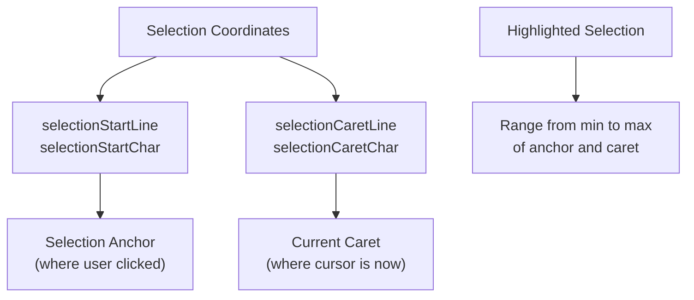
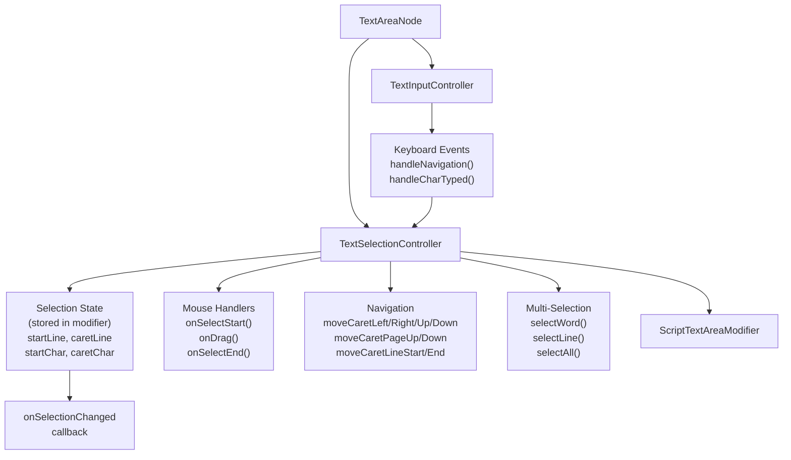
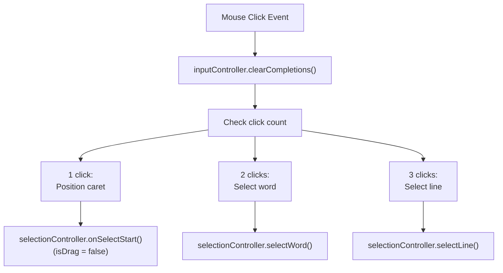
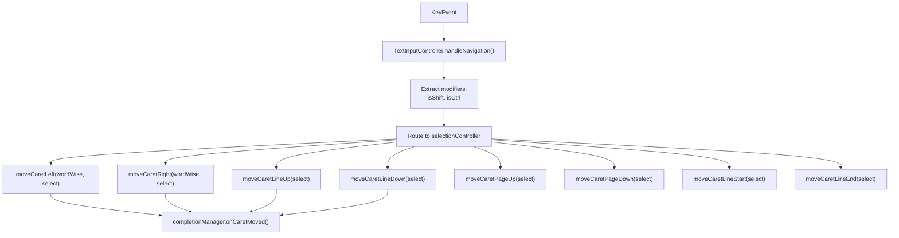
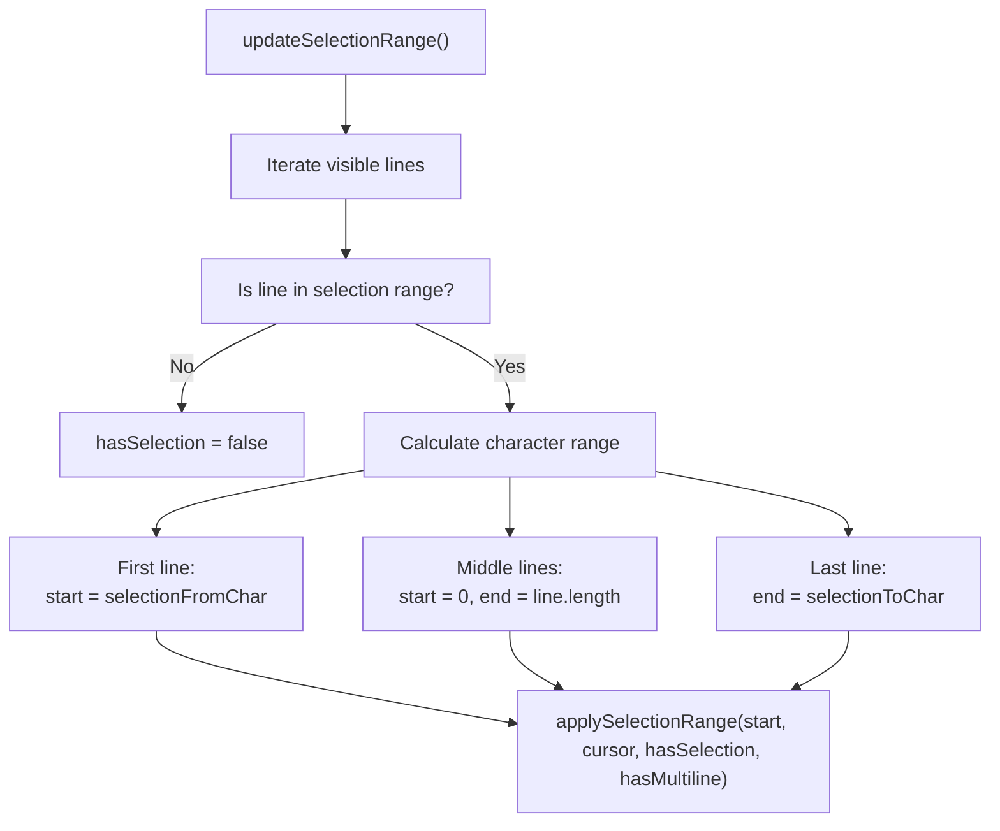
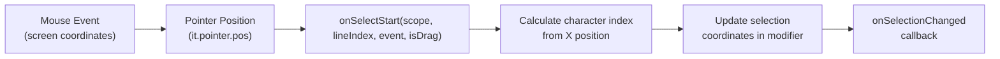
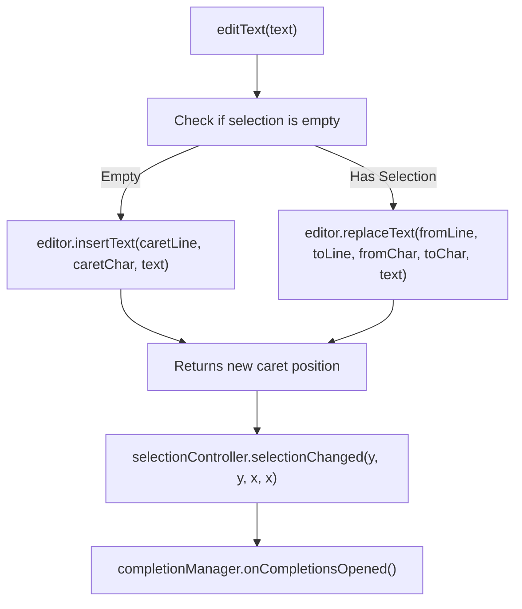

# Selection and Caret Management

<details>
<summary>Relevant source files</summary>

The following files were used as context for generating this wiki page:

- [src/main/java/ru/hollowhorizon/hollowengine/client/gui/scripting/files/ScriptFile.kt](src/main/java/ru/hollowhorizon/hollowengine/client/gui/scripting/files/ScriptFile.kt)
- [src/main/java/ru/hollowhorizon/hollowengine/client/gui/scripting/files/text/ScriptTextEditorHandler.kt](src/main/java/ru/hollowhorizon/hollowengine/client/gui/scripting/files/text/ScriptTextEditorHandler.kt)
- [src/main/java/ru/hollowhorizon/hollowengine/client/gui/scripting/files/text/SelectionHelper.kt](src/main/java/ru/hollowhorizon/hollowengine/client/gui/scripting/files/text/SelectionHelper.kt)
- [src/main/java/ru/hollowhorizon/hollowengine/client/gui/scripting/files/text/components/CommandRegistry.kt](src/main/java/ru/hollowhorizon/hollowengine/client/gui/scripting/files/text/components/CommandRegistry.kt)
- [src/main/java/ru/hollowhorizon/hollowengine/client/gui/scripting/files/text/components/EditorCommandContext.kt](src/main/java/ru/hollowhorizon/hollowengine/client/gui/scripting/files/text/components/EditorCommandContext.kt)
- [src/main/java/ru/hollowhorizon/hollowengine/client/gui/scripting/files/text/components/EditorLanguageService.kt](src/main/java/ru/hollowhorizon/hollowengine/client/gui/scripting/files/text/components/EditorLanguageService.kt)
- [src/main/java/ru/hollowhorizon/hollowengine/client/gui/scripting/files/text/components/EditorState.kt](src/main/java/ru/hollowhorizon/hollowengine/client/gui/scripting/files/text/components/EditorState.kt)
- [src/main/java/ru/hollowhorizon/hollowengine/client/gui/scripting/files/text/components/TextInputController.kt](src/main/java/ru/hollowhorizon/hollowengine/client/gui/scripting/files/text/components/TextInputController.kt)
- [src/main/java/ru/hollowhorizon/hollowengine/client/gui/scripting/files/text/components/commands/ApplyBracketsCommand.kt](src/main/java/ru/hollowhorizon/hollowengine/client/gui/scripting/files/text/components/commands/ApplyBracketsCommand.kt)
- [src/main/java/ru/hollowhorizon/hollowengine/client/gui/scripting/files/text/components/commands/ApplyCompletionItemCommand.kt](src/main/java/ru/hollowhorizon/hollowengine/client/gui/scripting/files/text/components/commands/ApplyCompletionItemCommand.kt)
- [src/main/java/ru/hollowhorizon/hollowengine/client/gui/scripting/files/text/components/commands/EditorDefaultCommands.kt](src/main/java/ru/hollowhorizon/hollowengine/client/gui/scripting/files/text/components/commands/EditorDefaultCommands.kt)
- [src/main/java/ru/hollowhorizon/hollowengine/client/gui/scripting/files/text/components/commands/IndentCommand.kt](src/main/java/ru/hollowhorizon/hollowengine/client/gui/scripting/files/text/components/commands/IndentCommand.kt)
- [src/main/java/ru/hollowhorizon/hollowengine/client/gui/scripting/files/text/components/commands/InsertNewlineCommand.kt](src/main/java/ru/hollowhorizon/hollowengine/client/gui/scripting/files/text/components/commands/InsertNewlineCommand.kt)
- [src/main/java/ru/hollowhorizon/hollowengine/client/gui/scripting/files/text/components/commands/ToggleLineCommentCommand.kt](src/main/java/ru/hollowhorizon/hollowengine/client/gui/scripting/files/text/components/commands/ToggleLineCommentCommand.kt)
- [src/main/java/ru/hollowhorizon/hollowengine/client/gui/scripting/files/text/components/commands/UnindentCommand.kt](src/main/java/ru/hollowhorizon/hollowengine/client/gui/scripting/files/text/components/commands/UnindentCommand.kt)
- [src/main/java/ru/hollowhorizon/hollowengine/client/gui/scripting/files/text/components/keymap/EditorDefaultKeys.kt](src/main/java/ru/hollowhorizon/hollowengine/client/gui/scripting/files/text/components/keymap/EditorDefaultKeys.kt)
- [src/main/java/ru/hollowhorizon/hollowengine/client/gui/scripting/files/text/components/keymap/KeyMap.kt](src/main/java/ru/hollowhorizon/hollowengine/client/gui/scripting/files/text/components/keymap/KeyMap.kt)
- [src/main/java/ru/hollowhorizon/hollowengine/client/gui/scripting/files/text/util/CompiledFileProvider.kt](src/main/java/ru/hollowhorizon/hollowengine/client/gui/scripting/files/text/util/CompiledFileProvider.kt)
- [src/main/java/ru/hollowhorizon/hollowengine/client/gui/scripting/files/text/util/TextAreaNode.kt](src/main/java/ru/hollowhorizon/hollowengine/client/gui/scripting/files/text/util/TextAreaNode.kt)
- [src/main/java/ru/hollowhorizon/hollowengine/common/scripting/ide/JsonScriptingAnalyzer.kt](src/main/java/ru/hollowhorizon/hollowengine/common/scripting/ide/JsonScriptingAnalyzer.kt)

</details>


This document covers the text selection and caret positioning system used in the text editor component. The system manages user text selection through mouse and keyboard interactions, tracks caret position, and provides visual feedback through selection highlighting and caret blinking.

For information about text editing operations (insertion, deletion, undo/redo), see [Undo/Redo System](#4.5). For details on how text is rendered and styled, see [Text Area Component and Rendering](#4.2).

---

## Overview

The selection and caret management system operates on a coordinate system where positions are specified by line number and character index within that line. The system distinguishes between the **selection anchor** (where selection started) and the **caret position** (current cursor position), enabling both empty selections (just a caret) and ranged selections.

**Sources:** [src/main/java/ru/hollowhorizon/hollowengine/client/gui/scripting/files/text/util/TextAreaNode.kt:67-91]()

---

## Selection Coordinate System

### Coordinate Representation

Selections are represented using four integer coordinates:

| Property | Description |
|----------|-------------|
| `selectionStartLine` | Line index where selection was anchored |
| `selectionCaretLine` | Line index where caret currently sits |
| `selectionStartChar` | Character index on start line |
| `selectionCaretChar` | Character index on caret line |

When `selectionStartLine == selectionCaretLine` and `selectionStartChar == selectionCaretChar`, there is no selection—just a caret.



**Diagram: Selection Coordinate Model**

The selection range is always from the minimum position to the maximum position, regardless of which direction the user dragged. Helper properties compute the normalized range:

- `selectionFromLine` / `selectionToLine`
- `selectionFromChar` / `selectionToChar`

**Sources:** [src/main/java/ru/hollowhorizon/hollowengine/client/gui/scripting/files/text/util/TextAreaNode.kt:75-79]()

---

## TextSelectionController Architecture

The `TextSelectionController` class is instantiated per text area and manages all selection state and interaction logic.



**Diagram: TextSelectionController Component Structure**

The `TextSelectionController` is created with references to the owner node, modifier, line provider, and focus management callbacks:

```kotlin
private val selectionController = TextSelectionController(
    owner = this,
    modifier = modifier,
    lineProvider = { lineProvider },
    linesHolder = { linesHolder },
    requestFocus = { requestFocus() },
    isFocused = { isFocused.use() }
)
```

### Key Methods

| Method | Purpose |
|--------|---------|
| `onSelectStart()` | Initiates selection on mouse click |
| `onDrag()` | Updates selection as mouse moves |
| `onSelectEnd()` | Finalizes selection on mouse release |
| `selectWord()` | Selects word at click position (double-click) |
| `selectLine()` | Selects entire line (triple-click) |
| `selectAll()` | Selects all text in the editor |
| `moveCaretLeft/Right/Up/Down()` | Keyboard navigation with optional selection extension |
| `moveCaretPageUp/Down()` | Page-wise navigation |
| `moveCaretLineStart/End()` | Move to beginning/end of line |
| `copySelection()` | Extracts selected text for clipboard |
| `clearSelection()` | Collapses selection to caret position |
| `selectionChanged()` | Updates selection coordinates and notifies callbacks |
| `updateSelectionRange()` | Updates visual selection rendering |
| `applySelectionRange()` | Applies selection highlighting to text nodes |

**Sources:** [src/main/java/ru/hollowhorizon/hollowengine/client/gui/scripting/files/text/util/TextAreaNode.kt:277-284]()

---

## Caret Management and Blinking

### Caret Position Tracking

The caret position is stored in `ScriptTextAreaModifier` and can be programmatically set:

```kotlin
modifier.setCaretPos(line: Int, caretPos: Int)
```

This helper collapses any existing selection and places the caret at the specified position, then invokes the `onSelectionChanged` callback.

**Sources:** [src/main/java/ru/hollowhorizon/hollowengine/client/gui/scripting/files/text/util/TextAreaNode.kt:118-125]()

### Caret Rendering and Current Line Highlight

The caret position is visually indicated by the current line background highlight. When the editor has focus or is in single-line mode, the current line (the line containing the caret) is rendered with a highlighted background:

```kotlin
private fun renderCurrentLineBackground() {
    if (lineIndex == this@TextAreaNode.modifier.selectionCaretLine && isFocused.use() || 
        this@TextAreaNode.modifier.editorConfig.singleLine) {
        getUiPrimitives(UiSurface.LAYER_BACKGROUND).localRect(
            0f, 0f, widthPx, heightPx, EditorTheme.currentLineBg
        )
    }
}
```

This provides a clear visual indicator of where the caret is located, especially when there is no text selection active.

**Sources:** [src/main/java/ru/hollowhorizon/hollowengine/client/gui/scripting/files/text/util/TextAreaNode.kt:310-316]()

---

## Mouse Interaction

### Click Behavior

Mouse clicks are handled with different behaviors based on the click count. The interaction also clears any open completion popup:



**Diagram: Multi-Click Selection Behavior**

Implementation in `setupTextLine()`:

```kotlin
modifier.onClick {
    inputController.clearCompletions()
    when (it.pointer.leftButtonRepeatedClickCount) {
        1 -> selectionController.onSelectStart(this, lineIndex, it, false)
        2 -> selectionController.selectWord(this, line.text, lineIndex, it)
        3 -> selectionController.selectLine(this, line.text, lineIndex)
    }
}
```

**Sources:** [src/main/java/ru/hollowhorizon/hollowengine/client/gui/scripting/files/text/util/TextAreaNode.kt:541-547]()

### Drag Selection

Drag operations extend the selection from the anchor point:

```kotlin
modifier.onDragStart {
    inputController.clearCompletions()
    selectionController.onSelectStart(this, lineIndex, it, true)
}
.onDrag { selectionController.onDrag(it) }
.onDragEnd { selectionController.onSelectEnd() }
```

During drag, the `onDrag()` method continuously updates `selectionCaretLine` and `selectionCaretChar` based on the current pointer position, while keeping the anchor fixed at the initial click location.

**Sources:** [src/main/java/ru/hollowhorizon/hollowengine/client/gui/scripting/files/text/util/TextAreaNode.kt:548-552]()

---

## Keyboard Navigation

### Arrow Key Navigation

Arrow keys move the caret with optional selection extension and word-wise movement. Navigation is handled by `TextInputController.handleNavigation()`:

| Key | Action | With Shift | With Ctrl |
|-----|--------|------------|-----------|
| `KEY_CURSOR_LEFT` | Move caret left one character | Extend selection left | Move by word |
| `KEY_CURSOR_RIGHT` | Move caret right one character | Extend selection right | Move by word |
| `KEY_CURSOR_UP` | Move caret up one line | Extend selection up | N/A |
| `KEY_CURSOR_DOWN` | Move caret down one line | Extend selection down | N/A |
| `KEY_HOME` | Move to line start | Extend to line start | N/A |
| `KEY_END` | Move to line end | Extend to line end | N/A |
| `KEY_PAGE_UP` | Move up one page | Extend selection up | N/A |
| `KEY_PAGE_DOWN` | Move down one page | Extend selection down | N/A |



**Diagram: Keyboard Navigation Flow**

Implementation in `handleNavigation()`:

```kotlin
private fun handleNavigation(keyEvent: KeyEvent) {
    val isShift = keyEvent.isShiftDown
    val isCtrl = keyEvent.isCtrlDown
    val provider = lineProvider()

    when (keyEvent.keyCode) {
        KeyboardInput.KEY_CURSOR_LEFT -> selectionController.moveCaretLeft(wordWise = isCtrl, select = isShift)
        KeyboardInput.KEY_CURSOR_RIGHT -> selectionController.moveCaretRight(wordWise = isCtrl, select = isShift)
        KeyboardInput.KEY_CURSOR_UP -> selectionController.moveCaretLineUp(select = isShift)
        KeyboardInput.KEY_CURSOR_DOWN -> selectionController.moveCaretLineDown(select = isShift)
        KeyboardInput.KEY_PAGE_UP -> selectionController.moveCaretPageUp(select = isShift)
        KeyboardInput.KEY_PAGE_DOWN -> selectionController.moveCaretPageDown(select = isShift)
        KeyboardInput.KEY_HOME -> selectionController.moveCaretLineStart(select = isShift)
        KeyboardInput.KEY_END -> selectionController.moveCaretLineEnd(select = isShift)
        else -> {}
    }

    completionManager.onCaretMoved(provider)
}
```

After navigation, the completion manager is notified to update or close the completion popup based on the new caret position.

**Sources:** [src/main/java/ru/hollowhorizon/hollowengine/client/gui/scripting/files/text/components/TextInputController.kt:152-170]()

### Special Selection Commands

Special selection operations are handled through the command system:

- **Ctrl+A**: Select all text via `SelectAllCommand`
- **Escape**: Clear selection and close completions via `CompletionCancelCommand` or direct handling

The Escape key handler in `handleKeyPress()`:

```kotlin
KeyboardInput.KEY_ESC -> {
    selectionController.clearSelection()
    requestFocusNone()
    completionManager.close()
}
```

**Sources:** [src/main/java/ru/hollowhorizon/hollowengine/client/gui/scripting/files/text/components/TextInputController.kt:79-83](), [src/main/java/ru/hollowhorizon/hollowengine/client/gui/scripting/files/text/components/keymap/EditorDefaultKeys.kt:14]()

---

## Selection Rendering

Selection rendering is handled by the `AttributedText` component within each line. The `TextSelectionController` calls `applySelectionRange()` on each visible line to configure which characters should be highlighted.

### Selection Range Application

The `applySelectionRange()` method in `TextSelectionController` determines which portion of each line should be highlighted:



**Diagram: Selection Range Calculation and Application**

The selection is applied to the `AttributedText` node for each line via the modifier:

```kotlin
selectionController.applySelectionRange(this, line, lineIndex)
```

This configures the visual selection highlight that is rendered as part of the text line.

**Sources:** [src/main/java/ru/hollowhorizon/hollowengine/client/gui/scripting/files/text/util/TextAreaNode.kt:555]()

### Multi-Line Selection Handling

For multi-line selections, the system tracks whether the selection spans multiple lines using the `selectionFromLine` and `selectionToLine` helper properties. Each line in the range receives appropriate selection coordinates:

- **First line of selection**: Selection starts at `selectionFromChar` and extends to end of line
- **Middle lines**: Entire line is selected (start = 0, end = line.length)
- **Last line of selection**: Selection starts at beginning and ends at `selectionToChar`

This creates a continuous visual selection across multiple lines.

**Sources:** [src/main/java/ru/hollowhorizon/hollowengine/client/gui/scripting/files/text/util/TextAreaNode.kt:467]()

---

## Coordinate Conversion

The system must convert between character indices and pixel coordinates for mouse interaction. This is handled by the `AttributedText` component's position tracking system.

### Character Position Tracking

The text rendering system maintains position information for coordinate conversion. The `ScriptTextLine` class provides a `charIndexToPx()` method that converts character indices to pixel positions:

```kotlin
completionX.set(it.leftPx + line.charIndexToPx(dotIndex) + Dimensions.PaddingNormal.px)
```

This is used to position UI elements (like the completion popup) at specific character positions.

**Sources:** [src/main/java/ru/hollowhorizon/hollowengine/client/gui/scripting/files/text/util/TextAreaNode.kt:526]()

### Mouse Position to Character Index

When the user clicks on text, the system must determine which character was clicked. The `TextSelectionController` handles this conversion during mouse interaction through its `onSelectStart()`, `onDrag()`, and pointer handling methods.

The coordinate conversion flow:



**Diagram: Mouse to Character Coordinate Conversion**

**Sources:** [src/main/java/ru/hollowhorizon/hollowengine/client/gui/scripting/files/text/util/TextAreaNode.kt:544-552]()

---

## Integration with Text Editing

Selection coordinates are passed to text editing operations through the `TextInputController`. When the user types or deletes, the system determines whether to insert text at the caret or replace a selection:



**Diagram: Text Editing with Selection Integration**

Implementation in `TextInputController.editText()`:

```kotlin
fun editText(text: String) {
    val editor = modifier.editorHandler ?: return
    val caretPos = if (selectionController.isEmptySelection) {
        editor.insertText(selectionController.selectionCaretLine, selectionController.selectionCaretChar, text)
    } else {
        editor.replaceText(
            selectionController.selectionFromLine,
            selectionController.selectionToLine,
            selectionController.selectionFromChar,
            selectionController.selectionToChar,
            text
        )
    }
    selectionController.selectionChanged(caretPos.y, caretPos.y, caretPos.x, caretPos.x)
    completionManager.onCompletionsOpened(lineProvider())
}
```

After the edit, the selection is collapsed to the new caret position and the completion system is notified to check if completions should be triggered.

**Sources:** [src/main/java/ru/hollowhorizon/hollowengine/client/gui/scripting/files/text/components/TextInputController.kt:184-199]()

---

## Selection Change Callback

The `onSelectionChanged` callback in `ScriptTextAreaModifier` is invoked whenever the selection changes, allowing external components to react:

```kotlin
modifier.onSelectionChanged = { startLine, caretLine, startChar, caretChar ->
    // Update state, trigger analysis, adjust scroll position, etc.
}
```

This callback is used to:
1. Update reactive state variables for rendering
2. Trigger code completion at the new caret position
3. Reposition the completion popup
4. Update syntax highlighting based on cursor context

**Sources:** [src/main/java/ru/hollowhorizon/hollowengine/client/gui/scripting/files/text/util/TextAreaNode.kt:54-59](), [src/main/java/ru/hollowhorizon/hollowengine/client/gui/scripting/files/ScriptFile.kt:168-184]()