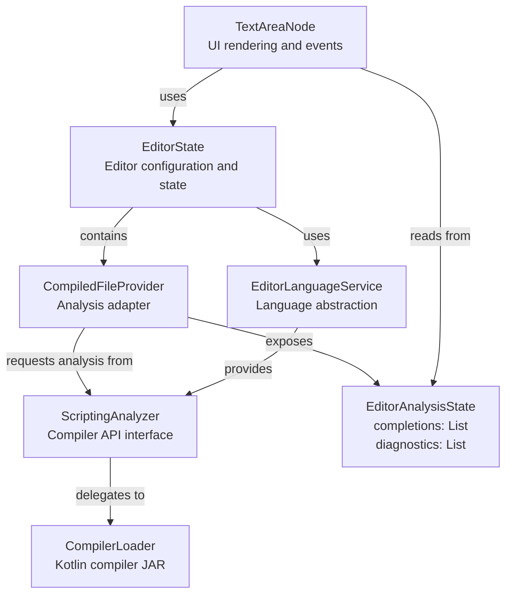
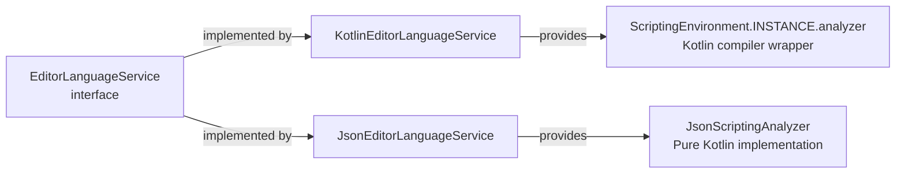
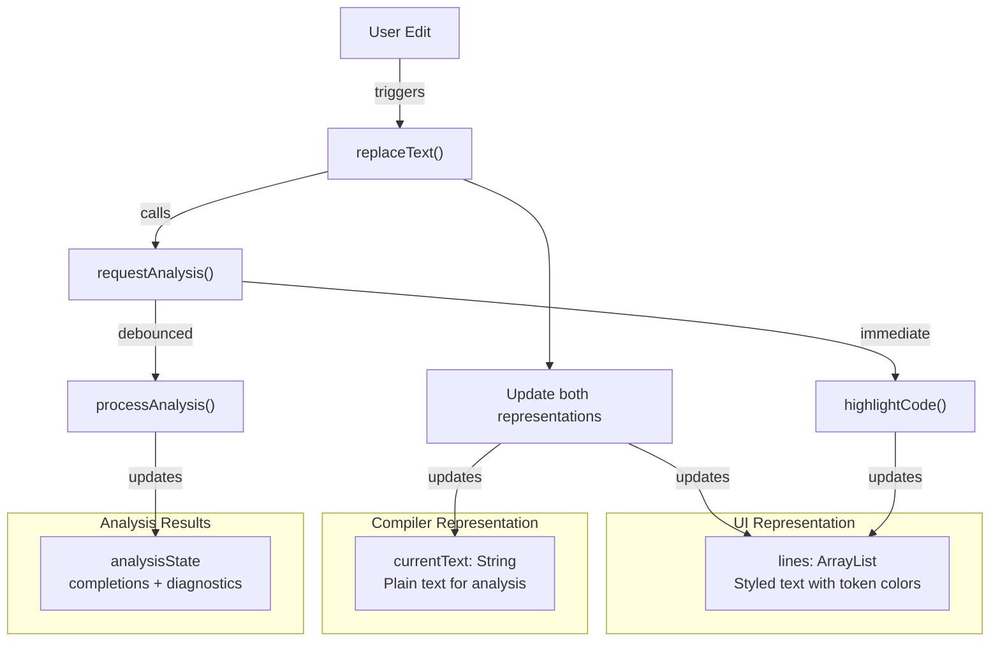
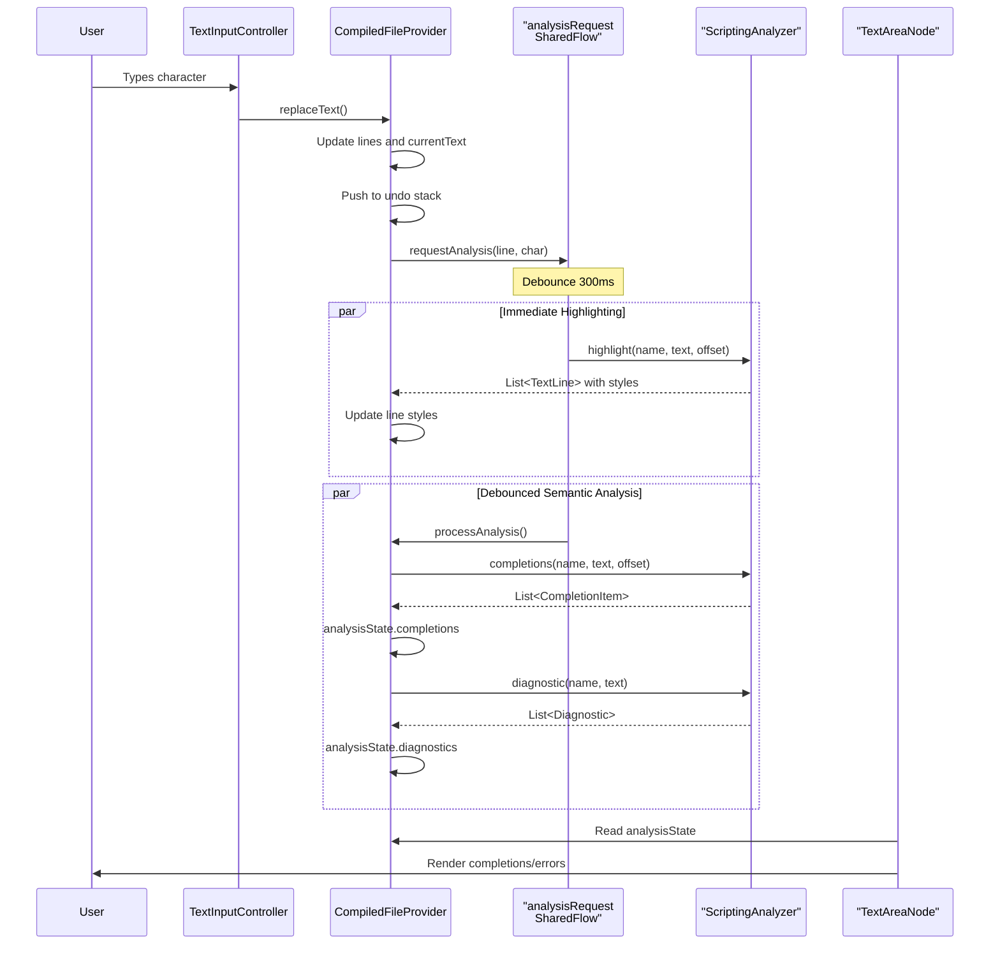
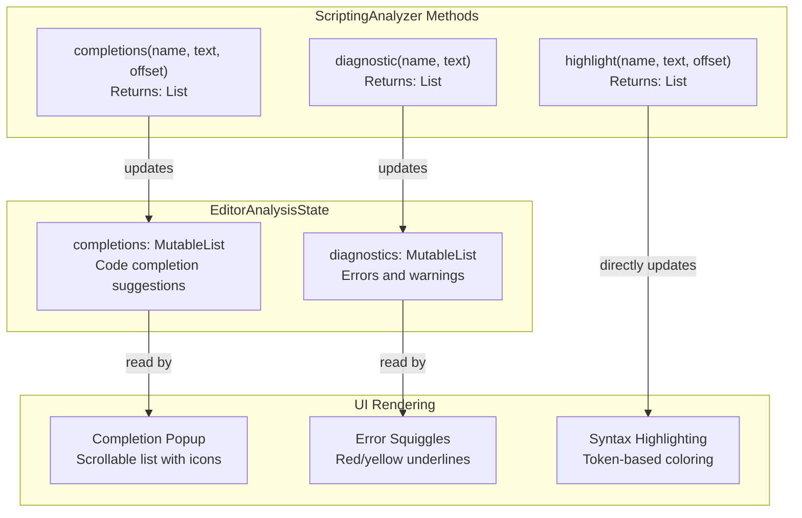
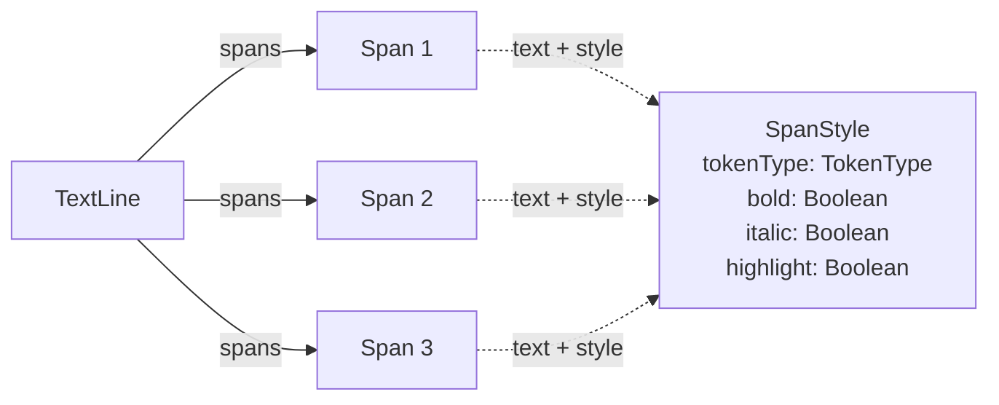
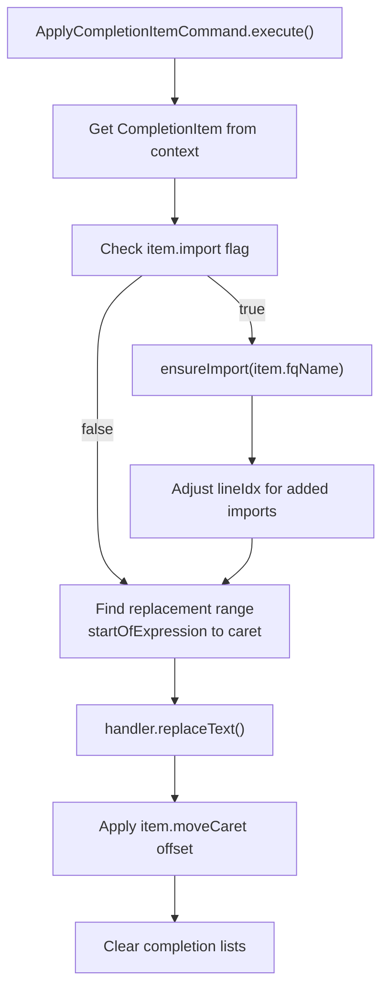
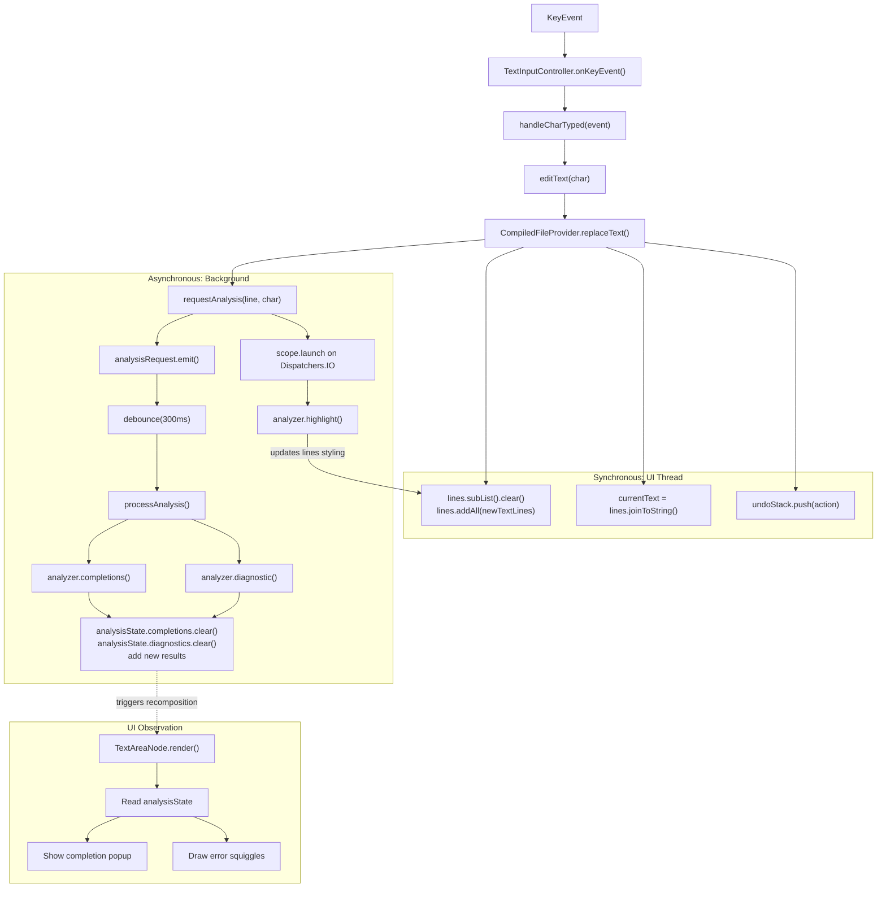
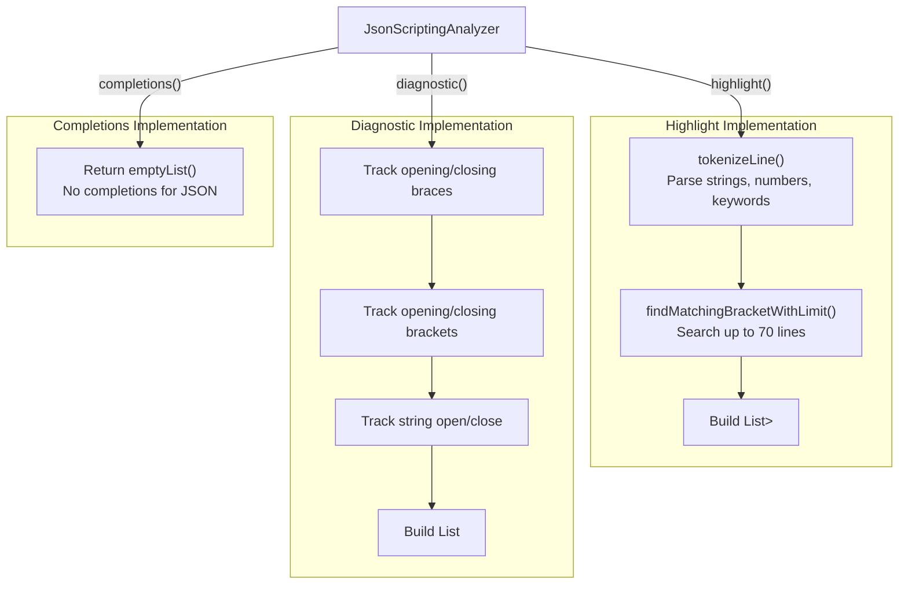
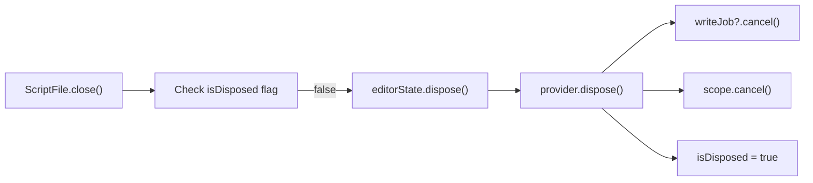

# Compiler Integration

<details>
<summary>Relevant source files</summary>

The following files were used as context for generating this wiki page:

- [build.gradle.kts](build.gradle.kts)
- [gradle.properties](gradle.properties)
- [src/main/java/ru/hollowhorizon/hollowengine/HollowEngine.kt](src/main/java/ru/hollowhorizon/hollowengine/HollowEngine.kt)
- [src/main/java/ru/hollowhorizon/hollowengine/client/gui/scripting/files/ScriptFile.kt](src/main/java/ru/hollowhorizon/hollowengine/client/gui/scripting/files/ScriptFile.kt)
- [src/main/java/ru/hollowhorizon/hollowengine/client/gui/scripting/files/text/ScriptTextEditorHandler.kt](src/main/java/ru/hollowhorizon/hollowengine/client/gui/scripting/files/text/ScriptTextEditorHandler.kt)
- [src/main/java/ru/hollowhorizon/hollowengine/client/gui/scripting/files/text/SelectionHelper.kt](src/main/java/ru/hollowhorizon/hollowengine/client/gui/scripting/files/text/SelectionHelper.kt)
- [src/main/java/ru/hollowhorizon/hollowengine/client/gui/scripting/files/text/components/CommandRegistry.kt](src/main/java/ru/hollowhorizon/hollowengine/client/gui/scripting/files/text/components/CommandRegistry.kt)
- [src/main/java/ru/hollowhorizon/hollowengine/client/gui/scripting/files/text/components/EditorCommandContext.kt](src/main/java/ru/hollowhorizon/hollowengine/client/gui/scripting/files/text/components/EditorCommandContext.kt)
- [src/main/java/ru/hollowhorizon/hollowengine/client/gui/scripting/files/text/components/EditorLanguageService.kt](src/main/java/ru/hollowhorizon/hollowengine/client/gui/scripting/files/text/components/EditorLanguageService.kt)
- [src/main/java/ru/hollowhorizon/hollowengine/client/gui/scripting/files/text/components/EditorState.kt](src/main/java/ru/hollowhorizon/hollowengine/client/gui/scripting/files/text/components/EditorState.kt)
- [src/main/java/ru/hollowhorizon/hollowengine/client/gui/scripting/files/text/components/TextInputController.kt](src/main/java/ru/hollowhorizon/hollowengine/client/gui/scripting/files/text/components/TextInputController.kt)
- [src/main/java/ru/hollowhorizon/hollowengine/client/gui/scripting/files/text/components/commands/ApplyBracketsCommand.kt](src/main/java/ru/hollowhorizon/hollowengine/client/gui/scripting/files/text/components/commands/ApplyBracketsCommand.kt)
- [src/main/java/ru/hollowhorizon/hollowengine/client/gui/scripting/files/text/components/commands/ApplyCompletionItemCommand.kt](src/main/java/ru/hollowhorizon/hollowengine/client/gui/scripting/files/text/components/commands/ApplyCompletionItemCommand.kt)
- [src/main/java/ru/hollowhorizon/hollowengine/client/gui/scripting/files/text/components/commands/EditorDefaultCommands.kt](src/main/java/ru/hollowhorizon/hollowengine/client/gui/scripting/files/text/components/commands/EditorDefaultCommands.kt)
- [src/main/java/ru/hollowhorizon/hollowengine/client/gui/scripting/files/text/components/commands/IndentCommand.kt](src/main/java/ru/hollowhorizon/hollowengine/client/gui/scripting/files/text/components/commands/IndentCommand.kt)
- [src/main/java/ru/hollowhorizon/hollowengine/client/gui/scripting/files/text/components/commands/InsertNewlineCommand.kt](src/main/java/ru/hollowhorizon/hollowengine/client/gui/scripting/files/text/components/commands/InsertNewlineCommand.kt)
- [src/main/java/ru/hollowhorizon/hollowengine/client/gui/scripting/files/text/components/commands/ToggleLineCommentCommand.kt](src/main/java/ru/hollowhorizon/hollowengine/client/gui/scripting/files/text/components/commands/ToggleLineCommentCommand.kt)
- [src/main/java/ru/hollowhorizon/hollowengine/client/gui/scripting/files/text/components/commands/UnindentCommand.kt](src/main/java/ru/hollowhorizon/hollowengine/client/gui/scripting/files/text/components/commands/UnindentCommand.kt)
- [src/main/java/ru/hollowhorizon/hollowengine/client/gui/scripting/files/text/components/keymap/EditorDefaultKeys.kt](src/main/java/ru/hollowhorizon/hollowengine/client/gui/scripting/files/text/components/keymap/EditorDefaultKeys.kt)
- [src/main/java/ru/hollowhorizon/hollowengine/client/gui/scripting/files/text/components/keymap/KeyMap.kt](src/main/java/ru/hollowhorizon/hollowengine/client/gui/scripting/files/text/components/keymap/KeyMap.kt)
- [src/main/java/ru/hollowhorizon/hollowengine/client/gui/scripting/files/text/util/CompiledFileProvider.kt](src/main/java/ru/hollowhorizon/hollowengine/client/gui/scripting/files/text/util/CompiledFileProvider.kt)
- [src/main/java/ru/hollowhorizon/hollowengine/client/gui/scripting/files/text/util/TextAreaNode.kt](src/main/java/ru/hollowhorizon/hollowengine/client/gui/scripting/files/text/util/TextAreaNode.kt)
- [src/main/java/ru/hollowhorizon/hollowengine/common/scripting/ide/JsonScriptingAnalyzer.kt](src/main/java/ru/hollowhorizon/hollowengine/common/scripting/ide/JsonScriptingAnalyzer.kt)
- [src/main/resources/hollowengine.mixins.json](src/main/resources/hollowengine.mixins.json)

</details>


## Purpose and Scope

This page documents how the text editor integrates with the Kotlin compiler and analysis system to provide IDE features such as syntax highlighting, code completion, error diagnostics, and semantic analysis. The integration layer bridges the gap between the text editor's UI representation and the compiler's text-based analysis APIs.

For information about the text editor UI components and rendering, see [4.2](#4.2). For details on the compiler loading and initialization during mod startup, see [2.4](#2.4). For information about editor commands that execute user actions, see [4.4](#4.4).

---

## Architecture Overview

The compiler integration consists of several abstraction layers that connect the UI components to the Kotlin compiler:

### Component Hierarchy



Sources: [src/main/java/ru/hollowhorizon/hollowengine/client/gui/scripting/files/text/util/TextAreaNode.kt:154-157](), [src/main/java/ru/hollowhorizon/hollowengine/client/gui/scripting/files/text/util/CompiledFileProvider.kt:36-44](), [src/main/java/ru/hollowhorizon/hollowengine/client/gui/scripting/files/text/components/EditorState.kt:52-75]()

---

## Compiler Loader Initialization

The `CompilerLoader` is initialized during mod startup in `HollowEngine` and checks for the presence of the compiler JAR file. The editor gracefully handles the absence of the compiler by displaying a fallback message.

| Component | Location | Purpose |
|-----------|----------|---------|
| `CompilerLoader` | `HollowEngine.compilerLoader` | Manages the Kotlin compiler JAR |
| Compiler JAR | `hollowengine/HollowEngineCompiler.jar` | Contains Kotlin compiler classes |
| Availability Check | `compilerLoader.isLoaded` | Boolean flag checked by editor |
| Environment Setup | `CommonEnvironment.setup()` | Provides mappings and classpath |

The editor checks compiler availability before initializing IDE features:

```kotlin
if(!HollowEngine.compilerLoader.isLoaded) {
    Text("hollowengine.gui.script.compiler_not_found".lang) {}
    return
}
```

Sources: [src/main/java/ru/hollowhorizon/hollowengine/HollowEngine.kt:20-28](), [src/main/java/ru/hollowhorizon/hollowengine/client/gui/scripting/files/ScriptFile.kt:42-45]()

---

## Language Service Abstraction

The `EditorLanguageService` interface provides a language-agnostic abstraction layer, allowing the editor to support multiple file types with different analysis implementations.

### Language Service Hierarchy



### Supported Languages

| Language | Extensions | Service Class | Analyzer Implementation |
|----------|-----------|---------------|-------------------------|
| Kotlin | `.kt`, `.kts` | `KotlinEditorLanguageService` | `ScriptingEnvironment.INSTANCE.analyzer` |
| JSON | `.json` | `JsonEditorLanguageService` | `JsonScriptingAnalyzer` |

The language service is automatically selected based on file extension during `EditorState` construction:

```kotlin
class EditorState(
    val source: TextSource,
    val language: EditorLanguageService = EditorLanguageService(source.extension)
)
```

Sources: [src/main/java/ru/hollowhorizon/hollowengine/client/gui/scripting/files/text/components/EditorLanguageService.kt:7-27](), [src/main/java/ru/hollowhorizon/hollowengine/client/gui/scripting/files/text/components/EditorState.kt:52-56]()

---

## CompiledFileProvider: The Analysis Adapter

`CompiledFileProvider` is the central adapter class that bridges between the editor's UI representation and the compiler's text-based analysis. It implements three key interfaces to provide a complete editing experience:

| Interface | Responsibility | Key Methods |
|-----------|----------------|-------------|
| `TextLineProvider` | Provides line-by-line text access | `size`, `get(index)` |
| `TextEditorHandler` | Handles text modifications | `insertText()`, `replaceText()` |
| `UndoRedoHandler` | Manages edit history | `undo()`, `redo()` |

### Dual Representation

The provider maintains two parallel representations of the document:



Sources: [src/main/java/ru/hollowhorizon/hollowengine/client/gui/scripting/files/text/util/CompiledFileProvider.kt:36-67](), [src/main/java/ru/hollowhorizon/hollowengine/client/gui/scripting/files/text/util/CompiledFileProvider.kt:47-59]()

---

## Analysis Pipeline

The analysis pipeline uses asynchronous processing with debouncing to provide responsive IDE features without blocking the UI thread.

### Analysis Flow Sequence



Sources: [src/main/java/ru/hollowhorizon/hollowengine/client/gui/scripting/files/text/util/CompiledFileProvider.kt:64-92](), [src/main/java/ru/hollowhorizon/hollowengine/client/gui/scripting/files/text/util/CompiledFileProvider.kt:226-271]()

### Debouncing Configuration

The system uses multiple debounce delays to optimize performance:

| Operation | Delay (ms) | Purpose | Configuration Constant |
|-----------|-----------|---------|----------------------|
| Analysis Request | 300 | Avoid excessive analyzer calls while typing | `DEBOUNCE_DELAY_MS` |
| Undo Merge | 300 | Group rapid single-character edits | `UNDO_DEBOUNCE_MS` |
| File Write | 500 | Batch disk writes for autosave | `WRITE_DEBOUNCE_MS` |

Sources: [src/main/java/ru/hollowhorizon/hollowengine/client/gui/scripting/files/text/util/CompiledFileProvider.kt:25-29]()

### Two-Phase Analysis

When text changes, the provider executes analysis in two phases:

**Phase 1: Immediate Syntax Highlighting**
```kotlin
scope.launch {
    withContext(Dispatchers.IO) {
        analyzer.highlightCode(textSnapshot, safeLine, safeChar)
    }
    analysisRequest.emit(AnalysisParams(textSnapshot, safeLine, safeChar))
}
```

**Phase 2: Debounced Semantic Analysis**
```kotlin
scope.launch {
    analysisRequest
        .debounce(AnalysisConfig.DEBOUNCE_DELAY_MS)
        .collectLatest { params -> processAnalysis(params) }
}
```

This separation ensures that syntax highlighting updates immediately while expensive semantic analysis is batched.

Sources: [src/main/java/ru/hollowhorizon/hollowengine/client/gui/scripting/files/text/util/CompiledFileProvider.kt:233-240](), [src/main/java/ru/hollowhorizon/hollowengine/client/gui/scripting/files/text/util/CompiledFileProvider.kt:88-92]()

---

## Analysis Results

The `EditorAnalysisState` class holds analysis results as mutable state lists that the UI observes and renders:

### Analysis Result Structure



Sources: [src/main/java/ru/hollowhorizon/hollowengine/client/gui/scripting/files/text/util/CompiledFileProvider.kt:31-34]()

### Completion Items

Completions are displayed in a popup when available. The UI reads from `analysisState.completions`:

```kotlin
val provider = handler as? CompiledFileProvider
val completions = provider?.analysisState?.completions ?: textArea.modifier.completions
if (completions.isNotEmpty()) {
    Popup(textArea.completionX.use(), textArea.completionY.use()) {
        // Render completion items
    }
}
```

#### CompletionItem Fields

| Field | Type | Purpose |
|-------|------|---------|
| `insert` | `String` | Text to insert when selected |
| `fqName` | `String?` | Fully qualified name for import resolution |
| `moveCaret` | `Int` | Cursor offset after insertion (e.g., -1 for inside parentheses) |
| `import` | `Boolean` | Whether this item requires an import statement |

Sources: [src/main/java/ru/hollowhorizon/hollowengine/client/gui/scripting/files/text/util/TextAreaNode.kt:154-229]()

### Diagnostics

Diagnostics (errors and warnings) are rendered as squiggly underlines beneath the affected text. Each diagnostic contains:

| Field | Type | Description |
|-------|------|-------------|
| `range` | `Range` | Start and end positions (line, column) |
| `severity` | `Severity` | `ERROR` or `WARNING` |
| `message` | `String` | Human-readable error description |

The line renderer filters diagnostics by line number and draws squiggles:

```kotlin
errors.filter { lineIndex in it.range.start.line..it.range.end.line }
    .forEach { error ->
        val startIdx = error.range.start.column.coerceIn(0, text.length)
        val endIdx = error.range.end.column.coerceIn(0, text.length)
        // Draw squiggly line pattern from startIdx to endIdx
    }
```

Error colors are determined by severity:
- `ERROR`: Red (`HighlightTheme.ERROR_ELEMENT`)
- `WARNING`: Yellow-orange mix

Sources: [src/main/java/ru/hollowhorizon/hollowengine/client/gui/scripting/files/text/util/TextAreaNode.kt:318-374]()

### Syntax Highlighting

The `highlight()` method returns `List<TextLine>`, where each line contains styled text spans:



Token types include: `DEFAULT`, `KEYWORD`, `STRING`, `NUMERIC_LITERAL`, `IDENTIFIER`, `ANNOTATION`, `COMMENT`, etc.

Highlighting is applied immediately (not debounced):

```kotlin
val colored = highlight(source.name, textSnapshot, off)
withContext(KoolDispatchers.Frontend) {
    if (colored.size == lines.size) {
        for (i in colored.indices) {
            lines[i] = colored[i].toKool(font)
        }
    }
}
```

Sources: [src/main/java/ru/hollowhorizon/hollowengine/client/gui/scripting/files/text/util/CompiledFileProvider.kt:273-298]()

---

## Command Integration

Editor commands access compiler analysis results through the `EditorCommandContext` to implement IDE features like completion application and code formatting.

### EditorCommandContext Structure

```kotlin
class EditorCommandContext(
    val state: EditorState,
    val inputController: TextInputController,
    val lineProvider: TextLineProvider,
    val historyManager: UndoRedoHandler,
    val hasCompletions: Boolean,
    val completion: CompletionManager?,
) {
    var completionItem: CompletionItem? = ...
    var bracketChar: String? = ...
    var importFqName: String? = ...
}
```

Sources: [src/main/java/ru/hollowhorizon/hollowengine/client/gui/scripting/files/text/components/EditorCommandContext.kt:8-22]()

### Completion Application Flow

The `ApplyCompletionItemCommand` demonstrates deep integration with compiler results:



The command handles automatic import insertion for qualified names:

```kotlin
if (item is CompletionItem.Declaration && item.import && !item.fqName.isNullOrBlank()) {
    val linesAdded = ensureImport(item.fqName, handler, c.lineProvider)
    lineIdx += linesAdded
}
```

The `ensureImport()` method finds the correct insertion point:
1. After package declaration (if present)
2. Sorted alphabetically with existing imports
3. Before the first non-import line

```kotlin
for ((i, line) in textLines.withIndex()) {
    val trimmed = line.trim()
    if (trimmed.startsWith("package ")) {
        foundPackage = true
        insertIndex = i + 1
    } else if (trimmed.startsWith("import ")) {
        if (importLine < trimmed) {
            insertIndex = i
            break
        }
    }
}
```

Sources: [src/main/java/ru/hollowhorizon/hollowengine/client/gui/scripting/files/text/components/commands/ApplyCompletionItemCommand.kt:8-88]()

### Compiler-Integrated Commands

| Command | Compiler Integration | Purpose |
|---------|---------------------|---------|
| `ApplyCompletionItemCommand` | Reads `CompletionItem`, adds imports | Apply code completion |
| `ReformatCommand` | Uses `Formatter.format()` | Format code using ktfmt |
| `GoToDefinitionCommand` | Uses analyzer navigation API | Jump to symbol definition |
| `ToggleLineCommentCommand` | Language-aware comment syntax | Toggle `//` comments |
| `InsertNewlineCommand` | Bracket-aware indentation | Smart newline with auto-indent |

Sources: [src/main/java/ru/hollowhorizon/hollowengine/client/gui/scripting/files/text/components/commands/EditorDefaultCommands.kt:5-31]()

---

## Complete Text Input Flow

The following diagram shows the complete flow from user keypress to compiler analysis and UI update:



Sources: [src/main/java/ru/hollowhorizon/hollowengine/client/gui/scripting/files/text/components/TextInputController.kt:34-59](), [src/main/java/ru/hollowhorizon/hollowengine/client/gui/scripting/files/text/util/CompiledFileProvider.kt:138-183](), [src/main/java/ru/hollowhorizon/hollowengine/client/gui/scripting/files/text/util/CompiledFileProvider.kt:226-271]()

---

## Language-Specific Analysis: JSON Example

The JSON analyzer demonstrates how language-specific analysis can be implemented without delegating to an external compiler. It provides a pure Kotlin implementation of syntax highlighting and error detection.

### JSON Analyzer Architecture



### JSON Analysis Features

The JSON analyzer performs:

1. **Syntax Highlighting**
   - Recognizes JSON keywords: `true`, `false`, `null`
   - Colors strings with escape sequence handling
   - Colors numeric literals (including scientific notation)
   - Highlights structural characters: `{`, `}`, `[`, `]`, `:`, `,`

2. **Bracket Matching**
   - Highlights matching bracket when cursor is adjacent
   - Searches up to 70 lines in each direction for performance
   - Supports both braces `{}` and brackets `[]`

3. **Error Detection**
   - Validates brace/bracket balance
   - Detects unclosed string literals
   - Reports unexpected closing braces/brackets

Example diagnostic generation:

```kotlin
when (char) {
    '{' -> braceCount++
    '}' -> {
        braceCount--
        if (braceCount < 0) {
            diagnostics.add(
                Diagnostic(
                    Range(Position(lineNum, colNum), Position(lineNum, colNum + 1)),
                    Severity.ERROR,
                    "Unexpected closing brace '}'"
                )
            )
        }
    }
}
```

Sources: [src/main/java/ru/hollowhorizon/hollowengine/common/scripting/ide/JsonScriptingAnalyzer.kt:4-443]()

---

## Thread Safety and Coroutines

The analysis system uses coroutines with explicit dispatchers to ensure thread safety and prevent UI blocking.

### Coroutine Context Usage

| Dispatcher | Purpose | Example Operations |
|-----------|---------|-------------------|
| `KoolDispatchers.Frontend` | UI updates and state mutations | Updating `lines`, `analysisState` lists |
| `Dispatchers.IO` | Blocking I/O operations | Initial syntax highlighting pass |
| `Dispatchers.Default` | CPU-intensive work | Analysis processing, tokenization |

### Coroutine Scope Setup

The `CompiledFileProvider` maintains a supervised coroutine scope:

```kotlin
private val scopeJob = SupervisorJob()
private val scope = CoroutineScope(KoolDispatchers.Frontend + scopeJob)
```

The `SupervisorJob` ensures that failures in one analysis operation don't cancel the entire scope.

### State Mutation Safety

All mutations to observable state occur on the frontend dispatcher with snapshot validation:

```kotlin
withContext(KoolDispatchers.Frontend) {
    val currentTextSnapshot = lines.joinToString("\n") { it.text }
    if (currentTextSnapshot != txt) return@withContext
    
    analysisState.completions.clear()
    analysisState.completions.addAll(completions)
    
    analysisState.diagnostics.clear()
    analysisState.diagnostics.addAll(diagnostics)
}
```

The snapshot check prevents stale results from overwriting newer state if the user has continued typing.

Sources: [src/main/java/ru/hollowhorizon/hollowengine/client/gui/scripting/files/text/util/CompiledFileProvider.kt:61-67](), [src/main/java/ru/hollowhorizon/hollowengine/client/gui/scripting/files/text/util/CompiledFileProvider.kt:255-267]()

---

## Lifecycle Management

Proper lifecycle management ensures that analysis resources are released when the editor is closed.

### Disposal Flow



### Resource Cleanup

The disposal process ensures:

1. **Pending writes are cancelled**: The `writeJob` is cancelled to prevent writing stale data
2. **Analysis coroutines are stopped**: The scope is cancelled, stopping all background analysis
3. **Memory is released**: Analysis state and line buffers are eligible for garbage collection
4. **Double-disposal is prevented**: The `isDisposed` flag prevents redundant cleanup

```kotlin
override fun close() {
    super.close()
    if (!isDisposed && HollowEngine.compilerLoader.isLoaded) {
        isDisposed = true
        editorState.dispose()
    }
}
```

Sources: [src/main/java/ru/hollowhorizon/hollowengine/client/gui/scripting/files/ScriptFile.kt:156-162](), [src/main/java/ru/hollowhorizon/hollowengine/client/gui/scripting/files/text/util/CompiledFileProvider.kt:111-115]()