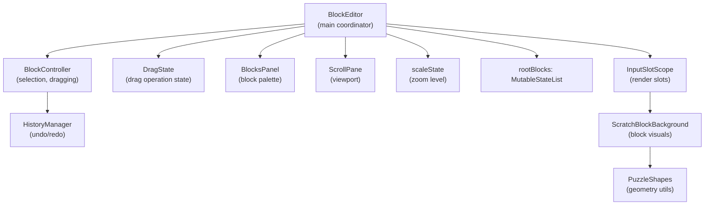
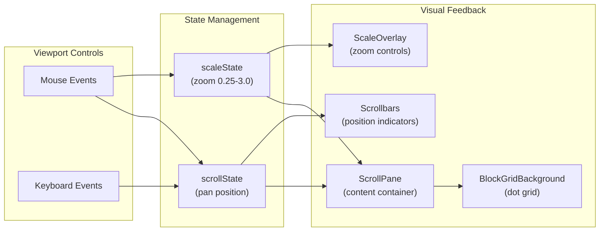
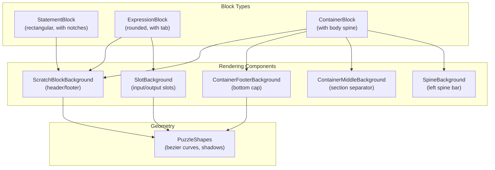
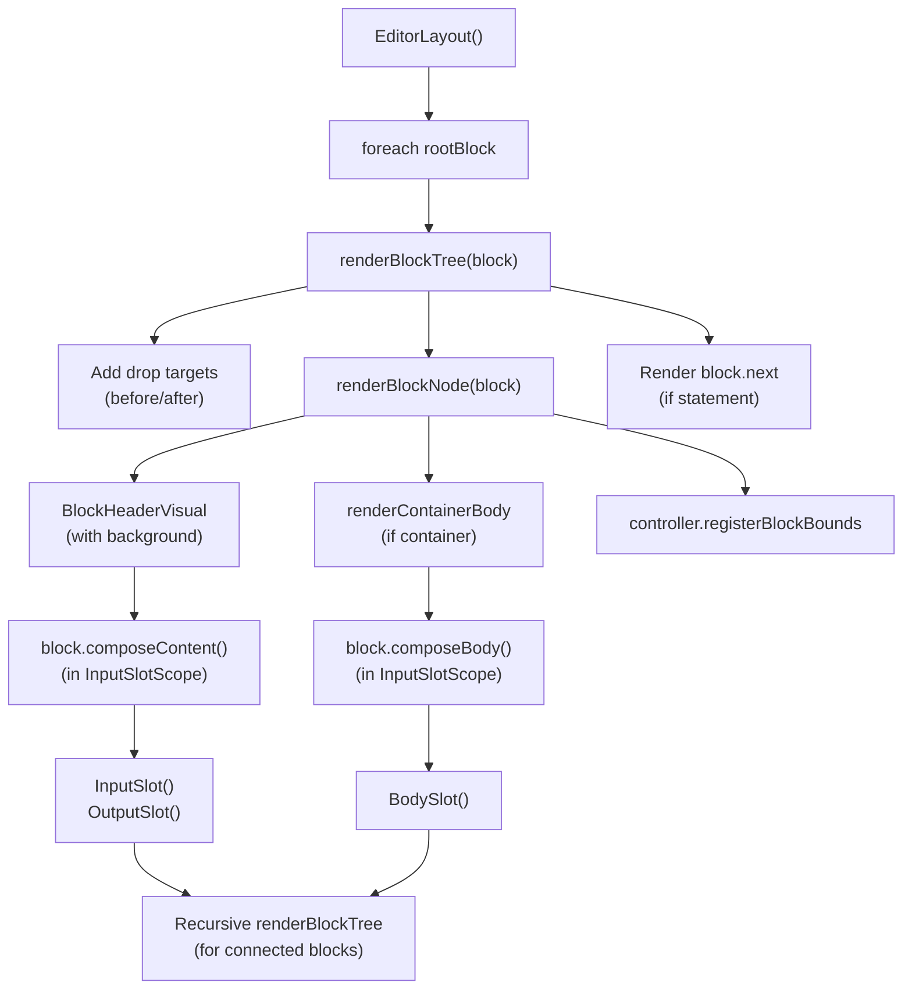
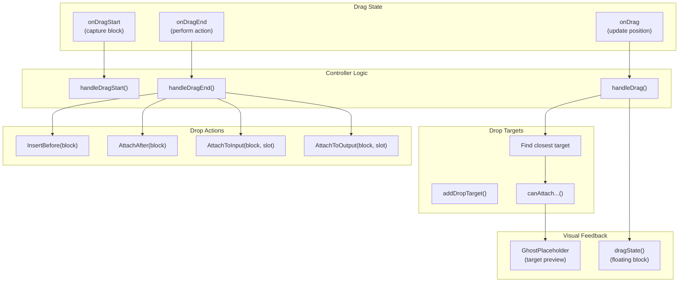
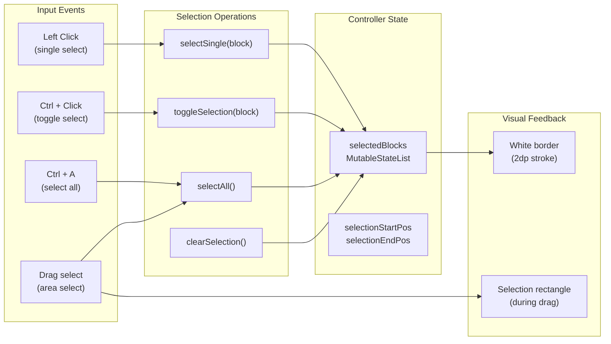
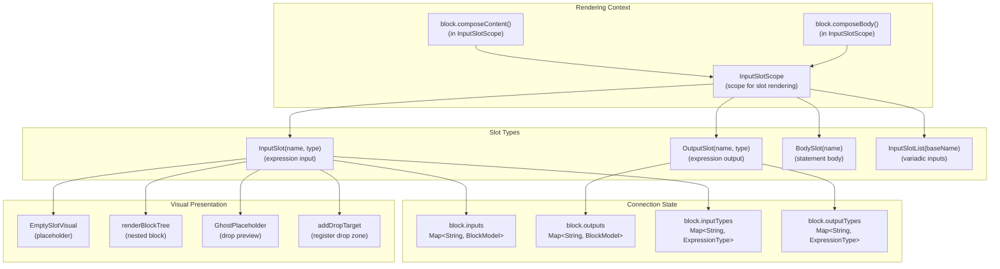
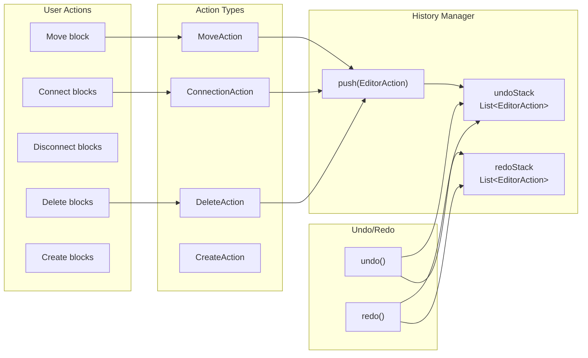
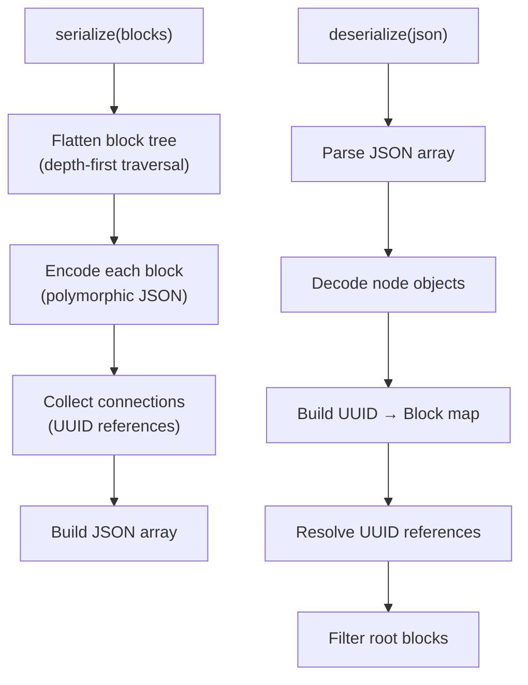

# Visual Block Editor

<details>
<summary>Relevant source files</summary>

The following files were used as context for generating this wiki page:

- [src/main/java/ru/hollowhorizon/hollowengine/client/gui/codeblocks/BlockEditor.kt](src/main/java/ru/hollowhorizon/hollowengine/client/gui/codeblocks/BlockEditor.kt)
- [src/main/java/ru/hollowhorizon/hollowengine/client/gui/codeblocks/InputSlotScope.kt](src/main/java/ru/hollowhorizon/hollowengine/client/gui/codeblocks/InputSlotScope.kt)
- [src/main/java/ru/hollowhorizon/hollowengine/client/gui/codeblocks/PuzzleShapes.kt](src/main/java/ru/hollowhorizon/hollowengine/client/gui/codeblocks/PuzzleShapes.kt)
- [src/main/java/ru/hollowhorizon/hollowengine/client/gui/codeblocks/ScratchBlockBackground.kt](src/main/java/ru/hollowhorizon/hollowengine/client/gui/codeblocks/ScratchBlockBackground.kt)
- [src/main/java/ru/hollowhorizon/hollowengine/client/gui/codeblocks/SlotBackground.kt](src/main/java/ru/hollowhorizon/hollowengine/client/gui/codeblocks/SlotBackground.kt)
- [src/main/java/ru/hollowhorizon/hollowengine/common/codeblocks/BlocksScope.kt](src/main/java/ru/hollowhorizon/hollowengine/common/codeblocks/BlocksScope.kt)
- [src/main/java/ru/hollowhorizon/hollowengine/common/codeblocks/CodeBlock.kt](src/main/java/ru/hollowhorizon/hollowengine/common/codeblocks/CodeBlock.kt)
- [src/main/java/ru/hollowhorizon/hollowengine/common/codeblocks/serialization/CodeBlockFormat.kt](src/main/java/ru/hollowhorizon/hollowengine/common/codeblocks/serialization/CodeBlockFormat.kt)
- [src/main/java/ru/hollowhorizon/hollowengine/common/codeblocks/serialization/CodeBlockSerializer.kt](src/main/java/ru/hollowhorizon/hollowengine/common/codeblocks/serialization/CodeBlockSerializer.kt)
- [src/main/resources/assets/hollowengine/textures/gui/icons/global.svg](src/main/resources/assets/hollowengine/textures/gui/icons/global.svg)
- [src/main/resources/assets/hollowengine/textures/gui/icons/maximize.svg](src/main/resources/assets/hollowengine/textures/gui/icons/maximize.svg)

</details>


The Visual Block Editor provides a Scratch-like drag-and-drop interface for creating visual programs within HollowEngine's in-game IDE. This editor allows users to construct programs by connecting code blocks without writing text-based code. The editor saves work as `.bc` JSON files that can be executed by the block runtime.

**Scope**: This page documents the editor UI, rendering, interaction, and serialization systems. For information about block types, categories, and execution runtime, see [Block Programming System](#6). For general IDE architecture and panel management, see [In-Game IDE](#3).

## Editor Architecture

The visual block editor is implemented as a specialized panel within the IDE's docking system. The core class `BlockEditor` manages the canvas, viewport, and all user interactions.



**Key Components**:

| Component | Responsibility | File |
|-----------|---------------|------|
| `BlockEditor` | Main coordinator, layout, event routing | [src/main/java/ru/hollowhorizon/hollowengine/client/gui/codeblocks/BlockEditor.kt:23-508]() |
| `BlockController` | Selection, dragging, drop validation | Referenced but not provided |
| `DragState` | Tracks active drag operations | Referenced at [BlockEditor.kt:25]() |
| `BlocksPanel` | Block palette sidebar | Referenced at [BlockEditor.kt:26]() |
| `InputSlotScope` | Renders input/output connection slots | [src/main/java/ru/hollowhorizon/hollowengine/client/gui/codeblocks/InputSlotScope.kt:16-202]() |

The editor maintains a list of root blocks in `rootBlocks: MutableStateList<BlockModel>`, which are top-level blocks positioned independently on the canvas. Each root block can have nested blocks attached through next/input/output connections.

**Sources**: [BlockEditor.kt:23-68]()

## Canvas and Viewport

The editor canvas provides an infinite scrollable workspace with zoom controls. Users can pan by dragging with non-left mouse buttons or using arrow keys, and zoom using Ctrl+mousewheel.



**Coordinate System**: Block positions (`positionX`, `positionY`) are stored in pixels at 1.0 scale. When rendering, positions are multiplied by the current zoom factor. The `Dp.scaled()` extension converts design dimensions to scaled screen dimensions: [BlockEditor.kt:39]().

**Zoom Implementation**: The zoom level is stored in `scaleState: MutableStateValue<Float>` and animated using spring physics for smooth transitions: [BlockEditor.kt:196-203](). Zoom increments by 5% steps, clamped to 0.25-3.0x range: [BlockEditor.kt:475-485]().

**Scroll Controls**:
- Mouse wheel (vertical scroll): [BlockEditor.kt:527]()
- Shift + mouse wheel (horizontal scroll): [BlockEditor.kt:522-524]()
- Ctrl + mouse wheel (zoom): [BlockEditor.kt:516-521]()
- Middle mouse drag (pan): [BlockEditor.kt:530-535]()
- Arrow keys (scroll): [BlockEditor.kt:186-189]()
- Home key (reset camera): [BlockEditor.kt:191]()

The viewport bounds are tracked in `controller.scrollPaneBounds` for drop target calculations: [BlockEditor.kt:106-113]().

**Sources**: [BlockEditor.kt:71-157](), [BlockEditor.kt:512-536](), [BlockEditor.kt:552-585]()

## Block Rendering System

Blocks are rendered using custom puzzle-piece shapes with notches and tabs for visual connection indicators. The rendering system creates Scratch-style block visuals with shadows, rounded corners, and connection geometry.

### Visual Styling



**Block Shape Components**:

| Component | Purpose | Key Features |
|-----------|---------|--------------|
| `ScratchBlockBackground` | Main block visual | Notches (top), tabs (bottom), rounded corners, shadows |
| `ContainerFooterBackground` | Container bottom cap | Inner notch for body blocks, maintains spine |
| `ContainerMiddleBackground` | Section separators | Full-width with inner notch for nested blocks |
| `SpineBackground` | Left spine bar | Vertical bar showing container depth |
| `SlotBackground` | Input/output slots | Inward/outward tabs for connection direction |

**Notch Geometry**: Statement blocks have a male notch (top) and female notch (bottom) for vertical stacking. The notch dimensions are calculated based on zoom level:
- Notch width: `gap * 1.5f` where `gap = PaddingNormal.px * 3f * zoom`
- Notch height: `smallGap * 2.0f` where `smallGap = PaddingSmall.px * 1.5f * zoom`
- Position: `notchX = gap` from left edge

Source: [ScratchBlockBackground.kt:36-107]()

**Expression Tab Geometry**: Expression blocks have a protruding or recessed tab on the left side for connection validation:
- Tab width: `4.dp * zoom`
- Tab height: `12.dp * zoom`, centered vertically
- Direction: Outward for normal expressions, inward for inverted expressions

Source: [ScratchBlockBackground.kt:58-74]()

**Shadow Rendering**: Blocks cast soft shadows using gradient strips:
- Radius: `2.dp * zoom`
- Offset: `1.dp * zoom` vertically
- Color: `BLACK.withAlpha(0.5f)`
- Inner shadows for nested expression blocks

Source: [PuzzleShapes.kt:16-88](), [ScratchBlockBackground.kt:110-114]()

**Color Resolution**: Block colors are modified based on state:
- Ghost mode (dragging): 50% alpha
- Unused blocks (not connected to start): Mixed 50% with light gray, 35% alpha
- Selected blocks: Mixed 20% with white
- Hover state: Full brightness vs 90% brightness animation

Source: [BlockEditor.kt:622-631]()

**Sources**: [ScratchBlockBackground.kt:19-142](), [PuzzleShapes.kt:1-199](), [InputSlotScope.kt:192-201]()

### Rendering Pipeline

Block rendering follows a recursive tree traversal pattern, respecting parent-child relationships and z-layer ordering.



**Rendering Phases**:

1. **Pre-block drop targets**: If the block is a statement and can accept blocks before it, render a ghost placeholder and register drop target: [BlockEditor.kt:224-231]()

2. **Block header**: Render the main block visual with `BlockHeaderVisual`, which includes:
   - Background shape via `ScratchBlockBackground`
   - Block content via `block.composeContent()` in `InputSlotScope`
   - Drag/click handlers: [BlockEditor.kt:276-301]()

3. **Container body** (if applicable): For `ContainerBlock` instances that aren't collapsed:
   - Render body content via `block.composeBody()` in `InputSlotScope`
   - Render footer cap with `ContainerFooterBackground`: [BlockEditor.kt:329-351]()

4. **Post-block drop targets**: If the block can accept blocks after it, render appropriate drop target: [BlockEditor.kt:238-256]()

5. **Next block recursion**: If the block is a statement with a `next` block, recursively render the next block: [BlockEditor.kt:255]()

**Z-Layer Calculation**: Blocks are assigned z-layers to ensure proper overlap:
- Dragging blocks: `Z_LAYER_DRAGGING = 1,000,000`
- Base layer per root: `root_index * 1000`
- Body blocks: `base + 100`
- Expression blocks: `base + 100`
- Statement blocks: `base + 100 - parentCount`

This ensures expressions render above statements, and dragged blocks render above everything else.

Source: [BlockEditor.kt:421-437]()

**Sources**: [BlockEditor.kt:205-258](), [BlockEditor.kt:260-316](), [BlockEditor.kt:318-351]()

## Drag and Drop System

The drag-and-drop system enables users to move blocks around the canvas, attach them to other blocks, and reorganize program structure. The system provides visual feedback through ghost blocks and drop target highlighting.



**Drag Handler Setup**: Each draggable block registers drag event handlers via `setupDragHandler()` modifier: [BlockEditor.kt:538-550](). The handlers invoke controller methods:
- `onDragStart`: Captures the block, initial position, and pointer offset
- `onDrag`: Updates the block's screen position
- `onDragEnd`: Executes the drop action if valid

**Drop Target Registration**: During rendering, potential drop locations register themselves as targets by calling `controller.addDropTarget(action, uiNode)`. The controller maintains a list of active targets with their screen bounds.

**Drop Action Types**:

| Action | Purpose | Target Validation |
|--------|---------|------------------|
| `InsertBefore(block)` | Insert before a statement | `canAttachBefore()` |
| `AttachAfter(block)` | Attach after a statement | `canAttachAfter()` |
| `AttachToInput(block, slot, isStatement)` | Connect to input slot | `canAttachToInput()` |
| `AttachToOutput(block, slot)` | Connect to output slot | `canAttachToOutput()` |

**Validation Rules**:
- Statement blocks can only attach to statement slots
- Expression blocks can only attach to expression slots
- Type checking ensures compatible expression types
- Circular references are prevented (block can't attach to itself or descendants)

**Ghost Placeholders**: When a dragged block hovers over a valid drop target, a semi-transparent ghost version of the block appears at the drop location: [BlockEditor.kt:439-460](). The ghost uses the same shape as the actual block but with reduced opacity: `isGhost = true` parameter.

**Snap Animation**: When a block is successfully dropped, a visual ring animation plays at the connection point: [BlockEditor.kt:47-49](), [BlockEditor.kt:587-618]().

**Sources**: [BlockEditor.kt:538-550](), [BlockEditor.kt:224-256](), [BlockEditor.kt:405-417](), [BlockEditor.kt:439-460]()

## Selection and Manipulation

The editor supports single and multi-selection of blocks, enabling batch operations like copy, cut, paste, and delete.

### Selection System



**Single Selection**: Clicking a block with no modifier keys selects only that block, clearing previous selections: [BlockEditor.kt:287-289]().

**Multi-Selection**: Holding Ctrl while clicking toggles individual blocks in/out of the selection set: [BlockEditor.kt:285-286]().

**Area Selection**: Dragging on the canvas background (not on a block) creates a selection rectangle. All blocks whose bounds intersect the rectangle are selected when the drag ends: [BlockEditor.kt:133-150]().

**Selection Visual**: Selected blocks render with a white border stroke applied at a high z-layer: [ScratchBlockBackground.kt:116-134]().

**Sources**: [BlockEditor.kt:283-290](), [BlockEditor.kt:133-150]()

### Keyboard Shortcuts

The editor provides comprehensive keyboard shortcuts for common operations:

| Shortcut | Action | Handler |
|----------|--------|---------|
| `Ctrl + A` | Select all blocks | [BlockEditor.kt:178]() |
| `Ctrl + C` | Copy selected blocks | [BlockEditor.kt:173]() |
| `Ctrl + X` | Cut selected blocks | [BlockEditor.kt:174]() |
| `Ctrl + V` | Paste clipboard blocks | [BlockEditor.kt:175]() |
| `Ctrl + D` | Duplicate selected blocks | [BlockEditor.kt:179]() |
| `Ctrl + Z` | Undo last action | [BlockEditor.kt:166-168]() |
| `Ctrl + Shift + Z` or `Ctrl + Y` | Redo | [BlockEditor.kt:166-170]() |
| `Delete` | Delete selected blocks | [BlockEditor.kt:181]() |
| `Escape` | Clear selection | [BlockEditor.kt:180]() |
| `Tab` | Toggle block panel visibility | [BlockEditor.kt:182-184]() |
| `Home` | Reset camera to origin | [BlockEditor.kt:191]() |
| Arrow keys | Scroll canvas | [BlockEditor.kt:186-189]() |

Keyboard input is processed by the `onKeyInput()` method: [BlockEditor.kt:159-194]().

### Copy/Paste Operations

**Copy**: Serializes selected blocks to a clipboard buffer using `deepCopy()`, which recursively clones block trees with new UUIDs: [CodeBlock.kt:11-41]().

**Paste**: Deserializes clipboard blocks and adds them to the canvas at the current camera position or a fixed offset from the originals.

**Duplicate**: Combines copy and immediate paste, creating copies offset from the originals.

**Sources**: [BlockEditor.kt:159-194](), [CodeBlock.kt:11-41]()

## Connection System

The connection system manages input and output slots on blocks, enabling users to connect expression blocks to statement blocks and build nested expressions.

### Input and Output Slots



**InputSlotScope**: A rendering context provided to blocks during `composeContent()` and `composeBody()` calls. It provides extension functions for declaring slots: [InputSlotScope.kt:16-22]().

**Input Slot Rendering**: When a block declares an input slot via `InputSlot(name, type)`:
1. The type is registered in `parentBlock.inputTypes[name]`: [InputSlotScope.kt:36]()
2. If a block is connected, it's rendered via `renderBlockTree()`: [InputSlotScope.kt:46]()
3. If empty, an `EmptySlotVisual` placeholder is shown: [InputSlotScope.kt:57]()
4. A drop target is registered for drag-and-drop: [InputSlotScope.kt:52]()

Source: [InputSlotScope.kt:35-61]()

**Output Slot Rendering**: Similar to input slots, but represents where an expression produces a value. Typically used in blocks that transform or manipulate data: [InputSlotScope.kt:64-90]().

**Body Slot Rendering**: Used by container blocks to embed statement sequences. Renders with a spine bar and accepts statement blocks: [InputSlotScope.kt:113-166]().

**Variadic Input Lists**: `InputSlotList(baseName, type)` creates a dynamically expanding list of input slots. As slots are filled, new empty slots appear: [InputSlotScope.kt:95-111]().

### Type Checking

Expression slots enforce type compatibility during drag-and-drop. The type system includes:

**ExpressionType Enum**:
- `STRING`
- `NUMBER`
- `BOOLEAN`
- `ANY` (accepts all types)
- `UNKNOWN` (used for broken blocks)

Type validation occurs in `controller.canAttachToInput()` and `controller.canAttachToOutput()`, preventing incompatible connections.

**Sources**: [InputSlotScope.kt:1-202]()

## History and Undo System

The editor maintains an action history enabling undo/redo operations for all structural changes.



**EditorAction Interface**: Each undoable action implements an interface with:
- `undo()`: Reverses the action
- `redo()`: Re-applies the action

**History Manager**: Referenced as `controller.history`, it maintains two stacks:
- `undoStack`: Actions that can be undone
- `redoStack`: Actions that can be redone (cleared when new action occurs)

**Action Recording**: When the user performs a structural change (move, connect, disconnect, delete), the controller creates an appropriate action object and pushes it to the history manager. The action captures the before-state necessary for reversal.

**Undo/Redo UI**: The scale overlay at the bottom-right corner includes undo/redo buttons: [BlockEditor.kt:470-471](). Button states are determined by `canUndo()` and `canRedo()` predicates.

**Sources**: [BlockEditor.kt:470-471](), [BlockEditor.kt:166-170]()

## Serialization and Persistence

Block graphs are serialized to JSON files with the `.bc` extension. The serialization system supports error recovery, enabling graceful handling of corrupted or version-incompatible files.

### File Format

The `.bc` file format is a JSON array where each element represents a single block:

```json
[
  {
    "node": {
      "type": "StartBlock",
      "uuid": "123e4567-e89b-12d3-a456-426614174000",
      ...block-specific fields
    },
    "next": "uuid-of-next-block",
    "inputs": {
      "condition": "uuid-of-input-block"
    },
    "outputs": {
      "result": "uuid-of-output-block"  
    },
    "x": 100.0,
    "y": 200.0,
    "isCollapsed": false
  },
  ...
]
```

**Node Structure**:
- `node`: Polymorphic block data (type + fields)
- `next`: UUID reference to next statement block
- `inputs`: Map of slot names to connected block UUIDs
- `outputs`: Map of slot names to connected block UUIDs
- `x`, `y`: Canvas position (only for root blocks)
- `isCollapsed`: Collapsed state for container blocks

**Sources**: [CodeBlockSerializer.kt:25-63]()

### Serialization Process



**Serialization**: The `CodeBlockSerializer.serialize()` method:
1. Flattens the block tree via `flatten()`: [CodeBlockSerializer.kt:29]()
2. Encodes each block polymorphically via `format.json.encodeToJsonElement(block)`
3. Adds connection metadata (next, inputs, outputs) as UUID strings
4. Includes position and state for root blocks
5. Returns a JSON array

Source: [CodeBlockSerializer.kt:25-63]()

**Deserialization**: The `CodeBlockSerializer.deserialize()` method:
1. Parses the JSON array: [CodeBlockSerializer.kt:69-70]()
2. Decodes each `node` object to a `BlockModel` instance: [CodeBlockSerializer.kt:93-97]()
3. Builds a UUID map: `nodeMap[block.uuid] = block`
4. Resolves UUID references to actual object references: [CodeBlockSerializer.kt:137-278]()
5. Filters for root blocks (those with no parent): [CodeBlockSerializer.kt:280]()

Source: [CodeBlockSerializer.kt:65-281]()

### Recovery Policies

The serialization system supports configurable error recovery via `ScriptRecoveryPolicy`:

**Recovery Strategies**:

| Strategy | Description | Behavior |
|----------|-------------|----------|
| `strict()` | Fail on any error | Throws `SerializationException` |
| `lenient()` | Replace broken blocks with stubs | Creates `BrokenStatementBlock` or `BrokenExpressionBlock` |
| Custom | Configurable per error type | Defined via policy builder |

**Error Types Handled**:
- **Decode failures**: Block type not registered or malformed JSON
- **Missing references**: Referenced UUID doesn't exist
- **Invalid reference format**: UUID string parsing fails
- **Type mismatches**: Wrong block type for connection (e.g., expression in statement slot)

**Recovery Actions**:

| Action | Description |
|--------|-------------|
| `FAIL` | Throw exception, abort loading |
| `DROPPED_BLOCK` | Remove block from graph |
| `REPLACED_WITH_STUB` | Create placeholder block with error message |
| `REMOVED_REFERENCE` | Break connection, leave blocks intact |

**Issue Reporting**: When using `loadBlocksWithRecovery()`, a `ScriptLoadReport` is returned containing:
- `blocks: List<BlockModel>` - Successfully loaded blocks
- `issues: List<ScriptLoadIssue>` - All recovery actions taken

Source: [CodeBlockSerializer.kt:80-332](), [CodeBlockFormat.kt:37-43]()

**Sources**: [CodeBlockSerializer.kt:1-333](), [CodeBlockFormat.kt:1-81]()

### CodeBlockFormat API

The `CodeBlockFormat` class provides the high-level API for loading and saving:

```kotlin
val format = CodeBlockFormat(blockProvider)

// Simple loading (strict mode)
val blocks = format.loadBlocks(file)

// Loading with recovery
val report = format.loadBlocksWithRecovery(file)
if (report.issues.isNotEmpty()) {
    // Handle recovery issues
}

// Saving
val json = format.encodeBlocks(blocks)
file.writeText(json)
```

**JSON Configuration**: The underlying JSON instance is configured with:
- `explicitNulls = false`: Omit null fields
- `ignoreUnknownKeys = true`: Tolerate extra fields (forward compatibility)
- `prettyPrint = true`: Human-readable formatting
- `serializersModule`: Polymorphic serializers for all registered block types

Source: [CodeBlockFormat.kt:70-79]()

**Block Module**: The `blockModule` parameter provides the `BlockProvider` containing all registered block types. The serializer automatically includes all blocks from the provider's category tree: [CodeBlockFormat.kt:49-60]().

**Sources**: [CodeBlockFormat.kt:28-81]()