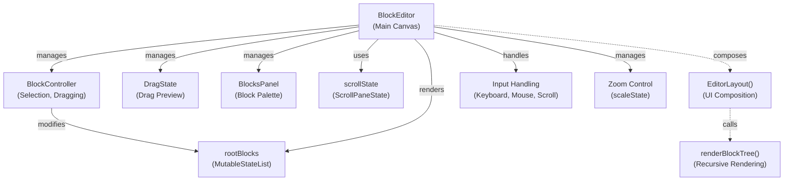
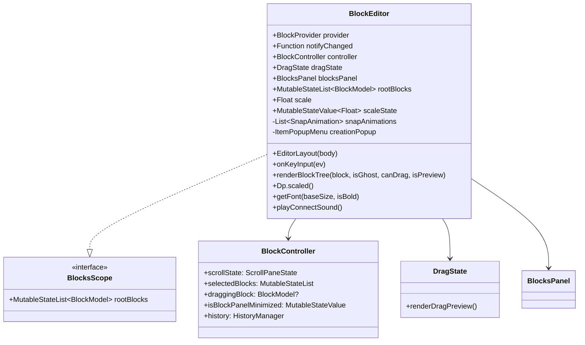
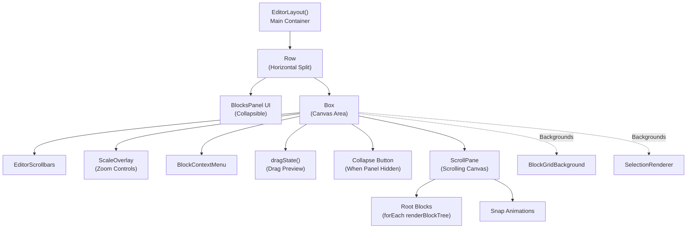
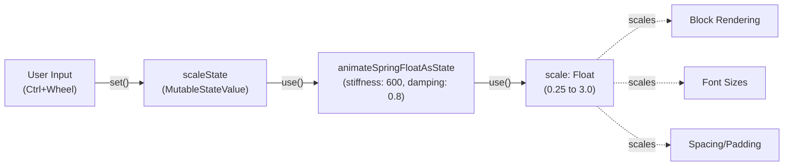
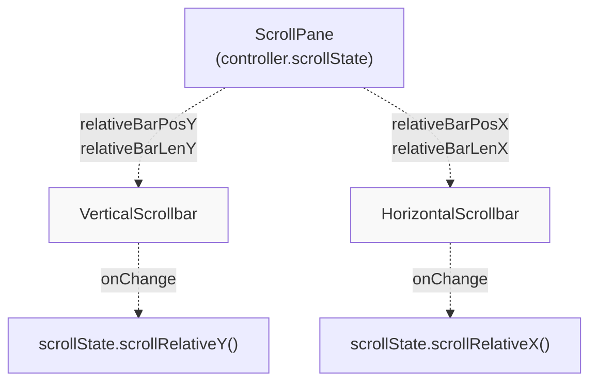
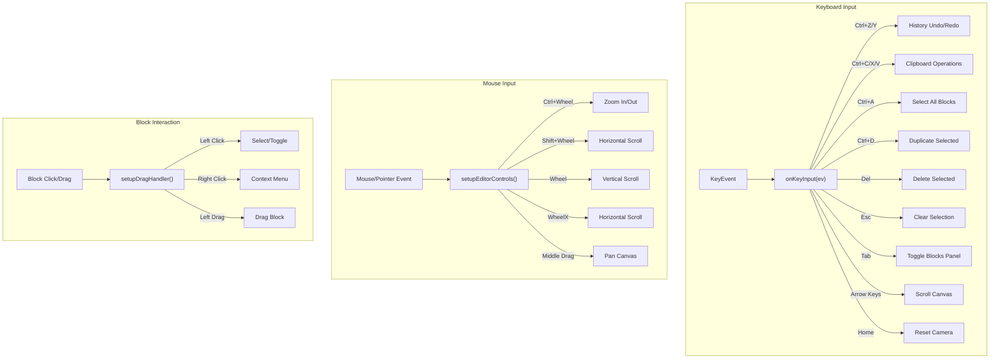
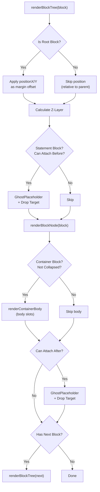
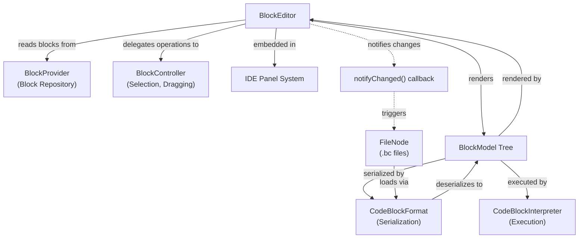

# Block Editor Overview

Relevant source files

The following files were used as context for generating this wiki page:

- [src/main/java/ru/hollowhorizon/hollowengine/client/gui/codeblocks/BlockEditor.kt](src/main/java/ru/hollowhorizon/hollowengine/client/gui/codeblocks/BlockEditor.kt)
- [src/main/java/ru/hollowhorizon/hollowengine/client/gui/codeblocks/InputSlotScope.kt](src/main/java/ru/hollowhorizon/hollowengine/client/gui/codeblocks/InputSlotScope.kt)
- [src/main/java/ru/hollowhorizon/hollowengine/client/gui/codeblocks/PuzzleShapes.kt](src/main/java/ru/hollowhorizon/hollowengine/client/gui/codeblocks/PuzzleShapes.kt)
- [src/main/java/ru/hollowhorizon/hollowengine/client/gui/codeblocks/ScratchBlockBackground.kt](src/main/java/ru/hollowhorizon/hollowengine/client/gui/codeblocks/ScratchBlockBackground.kt)
- [src/main/java/ru/hollowhorizon/hollowengine/client/gui/codeblocks/SlotBackground.kt](src/main/java/ru/hollowhorizon/hollowengine/client/gui/codeblocks/SlotBackground.kt)
- [src/main/java/ru/hollowhorizon/hollowengine/common/codeblocks/BlocksScope.kt](src/main/java/ru/hollowhorizon/hollowengine/common/codeblocks/BlocksScope.kt)
- [src/main/java/ru/hollowhorizon/hollowengine/common/codeblocks/CodeBlock.kt](src/main/java/ru/hollowhorizon/hollowengine/common/codeblocks/CodeBlock.kt)
- [src/main/java/ru/hollowhorizon/hollowengine/common/codeblocks/serialization/CodeBlockFormat.kt](src/main/java/ru/hollowhorizon/hollowengine/common/codeblocks/serialization/CodeBlockFormat.kt)
- [src/main/java/ru/hollowhorizon/hollowengine/common/codeblocks/serialization/CodeBlockSerializer.kt](src/main/java/ru/hollowhorizon/hollowengine/common/codeblocks/serialization/CodeBlockSerializer.kt)
- [src/main/resources/assets/hollowengine/textures/gui/icons/global.svg](src/main/resources/assets/hollowengine/textures/gui/icons/global.svg)
- [src/main/resources/assets/hollowengine/textures/gui/icons/maximize.svg](src/main/resources/assets/hollowengine/textures/gui/icons/maximize.svg)

This page describes the visual block editor's main class and UI structure. The `BlockEditor` class serves as the primary canvas component for the Scratch-like visual programming interface, managing the viewport, zoom/pan controls, and block tree rendering. For information about block types and execution logic, see [Block System Architecture](#6.1). For details about specific editor subsystems, see [Block Rendering System](#5.2), [Drag and Drop System](#5.3), and [Block Controller](#5.4).

---

## Purpose and Scope

The block editor provides an interactive canvas where users can create visual scripts by arranging code blocks. The `BlockEditor` class orchestrates the following responsibilities:

| Responsibility | Description |
|----------------|-------------|
| **Canvas Management** | Scrollable viewport with zoom and pan controls |
| **Block Tree Rendering** | Recursive rendering of connected block structures |
| **Input Handling** | Keyboard shortcuts and mouse controls for navigation |
| **Component Coordination** | Delegates to `BlockController`, `DragState`, and `BlocksPanel` |
| **State Management** | Tracks scale, scroll position, and root blocks |

The editor does not handle block execution (see [Block Execution Runtime](#6.4)) or serialization (see [Serialization and Persistence](#5.7)).

**Sources:** [src/main/java/ru/hollowhorizon/hollowengine/client/gui/codeblocks/BlockEditor.kt:1-70]()

---

## Architecture Overview

The block editor follows a component-based architecture where the main `BlockEditor` class delegates specialized responsibilities to sub-components:

**Component Responsibilities:**

- **`BlockEditor`**: Main canvas orchestrator, UI layout, rendering coordination
- **`BlockController`**: Selection management, drag/drop validation, drop target tracking (see [Block Controller](#5.4))
- **`DragState`**: Visual drag preview rendering while dragging blocks (see [Drag and Drop System](#5.3))
- **`BlocksPanel`**: Collapsible palette showing available blocks from `BlockProvider`
- **`scrollState`**: Kool UI's `ScrollPaneState` for viewport scrolling

**Sources:** [src/main/java/ru/hollowhorizon/hollowengine/client/gui/codeblocks/BlockEditor.kt:23-27](), [src/main/java/ru/hollowhorizon/hollowengine/client/gui/codeblocks/BlockEditor.kt:71-157]()

---

## Class Structure

The `BlockEditor` class implements `BlocksScope` and maintains the following key properties:

**Key Properties:**

| Property | Type | Purpose |
|----------|------|---------|
| `provider` | `BlockProvider` | Source of available block definitions |
| `controller` | `BlockController` | Manages selection, dragging, drop validation |
| `dragState` | `DragState` | Renders visual drag preview |
| `blocksPanel` | `BlocksPanel` | Collapsible palette of available blocks |
| `rootBlocks` | `MutableStateList<BlockModel>` | Top-level blocks on canvas (implements `BlocksScope`) |
| `scale` | `Float` | Current zoom level (0.25 to 3.0) |
| `scaleState` | `MutableStateValue<Float>` | Animated scale state |

**Helper Methods:**

- `Dp.scaled()`: Scales a `Dp` value by current zoom level
- `getFont(baseSize, isBold)`: Returns scaled `MsdfFont` for block text
- `triggerSnapEffect(action)`: Adds snap animation when blocks connect

**Sources:** [src/main/java/ru/hollowhorizon/hollowengine/client/gui/codeblocks/BlockEditor.kt:23-50](), [src/main/java/ru/hollowhorizon/hollowengine/common/codeblocks/BlocksScope.kt:8-10]()

---

## Layout System

The `EditorLayout()` function composes the main UI structure using Kool UI's declarative API:

**UI Hierarchy:**

1. **Outer Row**: Splits screen between blocks panel (left) and canvas (right)
2. **Blocks Panel**: Animates in/out based on `isBlockPanelMinimized` state
3. **Canvas Box**: Main drawing area with multiple layers:
   - **Backgrounds**: Grid pattern and selection box rendering
   - **Overlays**: Scrollbars, zoom controls, context menu
   - **ScrollPane**: Inner scrollable content area
4. **ScrollPane Content**: Root blocks rendered via `renderBlockTree()`

**Layout Modifiers:**

The canvas box at [src/main/java/ru/hollowhorizon/hollowengine/client/gui/codeblocks/BlockEditor.kt:96-113]() applies:
- `backgrounds()`: Grid pattern and selection visualization
- `setupEditorControls()`: Mouse/scroll input handling
- `onClick{}`: Clear selection on background click
- `onPositioned{}`: Track viewport bounds in `controller.scrollPaneBounds`

**Sources:** [src/main/java/ru/hollowhorizon/hollowengine/client/gui/codeblocks/BlockEditor.kt:71-157](), [src/main/java/ru/hollowhorizon/hollowengine/client/gui/codeblocks/BlockEditor.kt:512-536]()

---

## Zoom and Scale Control

The editor implements smooth zoom with spring animation and mouse-wheel controls:

**Zoom Implementation:**

1. **State Management** [src/main/java/ru/hollowhorizon/hollowengine/client/gui/codeblocks/BlockEditor.kt:30-32]():
   - `scaleState`: Mutable target scale value
   - `scale`: Current animated scale (smoothly interpolates to `scaleState`)

2. **Animation** [src/main/java/ru/hollowhorizon/hollowengine/client/gui/codeblocks/BlockEditor.kt:196-203]():
   - Uses `animateSpringFloatAsState()` for smooth zoom transitions
   - Stiffness: 600, Damping: 0.8 (responsive but smooth)

3. **Mouse Control** [src/main/java/ru/hollowhorizon/hollowengine/client/gui/codeblocks/BlockEditor.kt:516-528]():
   - **Ctrl+Wheel**: Zoom in/out (factor 1.1x or 0.9x)
   - **Shift+Wheel**: Horizontal scroll
   - **Wheel**: Vertical scroll
   - **Middle-Drag**: Pan in any direction

4. **UI Controls** [src/main/java/ru/hollowhorizon/hollowengine/client/gui/codeblocks/BlockEditor.kt:462-487]():
   - `ScaleOverlay()` displays zoom buttons and percentage
   - Plus/minus buttons adjust scale in 5% increments (0.05 steps)
   - Zoom clamped between 25% and 300%

**Scaling Application:**

All rendered elements use the `Dp.scaled()` helper [src/main/java/ru/hollowhorizon/hollowengine/client/gui/codeblocks/BlockEditor.kt:39]() to multiply dimensions by `scale`:
- Block dimensions, padding, margins
- Font sizes via `getFont()`
- Notch sizes, shadows, corner radii

**Sources:** [src/main/java/ru/hollowhorizon/hollowengine/client/gui/codeblocks/BlockEditor.kt:30-32](), [src/main/java/ru/hollowhorizon/hollowengine/client/gui/codeblocks/BlockEditor.kt:196-203](), [src/main/java/ru/hollowhorizon/hollowengine/client/gui/codeblocks/BlockEditor.kt:516-528](), [src/main/java/ru/hollowhorizon/hollowengine/client/gui/codeblocks/BlockEditor.kt:462-487]()

---

## UI Components

### ScrollPane and Scrollbars

The canvas uses Kool UI's `ScrollPane` with custom-styled scrollbars:

**Implementation** [src/main/java/ru/hollowhorizon/hollowengine/client/gui/codeblocks/BlockEditor.kt:552-585]():
- Scrollbars positioned at canvas edges with `Z_LAYER_SCROLLBAR` (100,000,000)
- Custom colors from `ColorTheme.UI` (track, hover states)
- Bidirectional sync: UI updates scroll state, scroll state updates UI

**Scroll Methods:**
- `scrollDpX()`, `scrollDpY()`: Scroll by delta in `Dp` units
- `scrollRelativeX()`, `scrollRelativeY()`: Scroll to relative position (0.0 to 1.0)

### Scale Overlay

The bottom-right overlay provides zoom controls and history buttons:

| Control | Action | Shortcut |
|---------|--------|----------|
| **Undo** (`<`) | Revert last action | Ctrl+Z |
| **Redo** (`>`) | Reapply undone action | Ctrl+Y, Ctrl+Shift+Z |
| **Zoom Out** (`-`) | Decrease scale by 5% | Ctrl+Wheel Down |
| **Zoom In** (`+`) | Increase scale by 5% | Ctrl+Wheel Up |
| **Scale %** | Current zoom level | (display only) |

**Implementation Details:**
- Positioned with `Z_LAYER_SCROLLBAR` to float above all blocks
- Buttons disabled when at min/max scale or no undo/redo available
- Uses `EditorButton()` helper for consistent styling

**Sources:** [src/main/java/ru/hollowhorizon/hollowengine/client/gui/codeblocks/BlockEditor.kt:462-502]()

### Blocks Panel

The collapsible left panel displays available blocks from `BlockProvider`. It animates in/out based on `controller.isBlockPanelMinimized`:

- **Expanded**: Shows full block palette organized by category
- **Collapsed**: Minimized to edge, shows small expand button
- **Animation**: Smooth 0.3s easing transition using `animateFloatAsState()`

Toggle via Tab key [src/main/java/ru/hollowhorizon/hollowengine/client/gui/codeblocks/BlockEditor.kt:182-184]().

**Sources:** [src/main/java/ru/hollowhorizon/hollowengine/client/gui/codeblocks/BlockEditor.kt:75-94]()

---

## Input Handling

The editor handles keyboard, mouse, and scroll input through multiple layers:

### Keyboard Shortcuts

**Editor Navigation:**
- **Tab**: Toggle blocks panel visibility
- **Arrow Keys**: Scroll canvas (50dp per press)
- **Home**: Reset camera to origin
- **Esc**: Clear block selection

**Editing Operations:**
- **Ctrl+Z**: Undo
- **Ctrl+Y** or **Ctrl+Shift+Z**: Redo
- **Ctrl+C**: Copy selected blocks
- **Ctrl+X**: Cut selected blocks
- **Ctrl+V**: Paste from clipboard
- **Ctrl+A**: Select all root blocks
- **Ctrl+D**: Duplicate selected blocks
- **Del**: Delete selected blocks

**Sources:** [src/main/java/ru/hollowhorizon/hollowengine/client/gui/codeblocks/BlockEditor.kt:159-194](), [src/main/java/ru/hollowhorizon/hollowengine/client/gui/codeblocks/BlockEditor.kt:57-63]()

### Mouse Controls

**Canvas Navigation** [src/main/java/ru/hollowhorizon/hollowengine/client/gui/codeblocks/BlockEditor.kt:512-536]():
- **Ctrl+Wheel**: Zoom (factor 1.1x or 0.9x, clamped 0.25-3.0)
- **Shift+Wheel**: Horizontal scroll
- **Wheel**: Vertical scroll
- **Wheel X**: Horizontal scroll (trackpad horizontal scroll)
- **Middle-button Drag**: Pan canvas in any direction

**Block Interaction** [src/main/java/ru/hollowhorizon/hollowengine/client/gui/codeblocks/BlockEditor.kt:538-550]():
- **Left Click**: Select block (Ctrl+Click to toggle)
- **Right Click**: Show context menu
- **Left Drag**: Drag block (handled by `BlockController`)

**Background Interaction** [src/main/java/ru/hollowhorizon/hollowengine/client/gui/codeblocks/BlockEditor.kt:133-150]():
- **Left Drag**: Draw selection rectangle
- **Left Click**: Clear selection

**Sources:** [src/main/java/ru/hollowhorizon/hollowengine/client/gui/codeblocks/BlockEditor.kt:512-550](), [src/main/java/ru/hollowhorizon/hollowengine/client/gui/codeblocks/BlockEditor.kt:133-150]()

---

## Block Tree Rendering

The `renderBlockTree()` function recursively renders block structures with proper z-layering and drop targets:

**Z-Layer Calculation** [src/main/java/ru/hollowhorizon/hollowengine/client/gui/codeblocks/BlockEditor.kt:421-437]():

1. **Base Layer**: `Z_LAYER_DRAGGING` (1,000,000) if dragging, else `UiSurface.LAYER_DEFAULT`
2. **Root Index**: Add `rootBlocks.indexOf(block.root) * 1000` (separates root block stacks)
3. **Body Offset**: Add 100 if block is in container body
4. **Expression/Parent**: Expression blocks get +100, statement blocks adjust by `-parentCount`

This ensures proper visual stacking where:
- Dragged blocks always appear on top
- Later root blocks render over earlier ones
- Expression blocks render over their containing statement blocks
- Nested blocks maintain consistent depth

**Drop Target Placement:**

The function strategically places invisible drop zones at [src/main/java/ru/hollowhorizon/hollowengine/client/gui/codeblocks/BlockEditor.kt:224-256]():
- **Before Block**: Ghost placeholder + drop target if `canAttachBefore()`
- **After Block**: Ghost placeholder + drop target if `canAttachAfter()`
- **Container Body**: Handled in `renderContainerBody()` (see [Connection System](#5.5))

**Rendering Modes:**

| Parameter | Purpose |
|-----------|---------|
| `isGhost` | Render semi-transparent (drop preview) |
| `canDrag` | Enable drag handlers and drop targets |
| `isPreview` | Skip drop targets and bounds registration (for palette blocks) |

**Sources:** [src/main/java/ru/hollowhorizon/hollowengine/client/gui/codeblocks/BlockEditor.kt:208-258](), [src/main/java/ru/hollowhorizon/hollowengine/client/gui/codeblocks/BlockEditor.kt:421-437]()

---

## Integration Points

The `BlockEditor` integrates with several other systems:

**Input Dependencies:**

1. **`BlockProvider`**: Supplies available block definitions for the blocks panel
2. **`notifyChanged` callback**: Invoked when block tree changes (triggers save)
3. **`rootBlocks`**: Initial block tree (loaded from `.bc` file via `CodeBlockFormat`)

**Output Actions:**

1. **Block Tree Modification**: Updates `rootBlocks` via `BlockController`
2. **Change Notification**: Calls `notifyChanged()` to trigger serialization
3. **Visual Feedback**: Renders selection, drag preview, snap animations

**Component Relationships:**

- **BlockEditor ↔ BlockController**: Controller validates operations, editor renders results
- **BlockEditor → BlockProvider**: Reads block definitions, does not modify
- **BlockEditor → CodeBlockFormat**: Indirectly via save callback (editor doesn't serialize directly)
- **BlockEditor → IDE**: Embedded as a panel, receives keyboard events from IDE overlay

**Sources:** [src/main/java/ru/hollowhorizon/hollowengine/client/gui/codeblocks/BlockEditor.kt:23](), [src/main/java/ru/hollowhorizon/hollowengine/common/codeblocks/serialization/CodeBlockFormat.kt:28-46]()

---

## Constants and Configuration

The `BlockEditor` companion object defines key constants:

| Constant | Value | Purpose |
|----------|-------|---------|
| `SCROLL_SPEED_X` | -50f | Horizontal scroll speed (dp per wheel tick) |
| `SCROLL_SPEED_Y` | -50f | Vertical scroll speed (dp per wheel tick) |
| `Z_LAYER_DRAGGING` | 1,000,000 | Z-layer for blocks being dragged |
| `Z_LAYER_SCROLLBAR` | 100,000,000 | Z-layer for scrollbars (always on top) |
| `C_BLOCK_SPINE_WIDTH` | `Dimensions.PaddingMedium` | Width of container block spine |

**Keyboard Codes:**
- `KEY_CODE_SELECT_ALL` = 'A'
- `KEY_CODE_CUT` = 'X'
- `KEY_COPY` = 'C'
- `KEY_PASTE` = 'V'
- `KEY_UNDO` = 'Z'
- `KEY_REDO` = 'Y'
- `KEY_DUPLICATE` = 'D'

These constants ensure consistent behavior across the editor. The z-layer values create a clear visual hierarchy where dragged blocks always appear above static content, and UI controls always appear above blocks.

**Sources:** [src/main/java/ru/hollowhorizon/hollowengine/client/gui/codeblocks/BlockEditor.kt:51-67]()