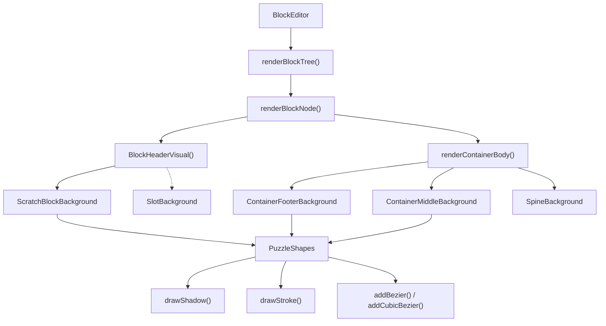
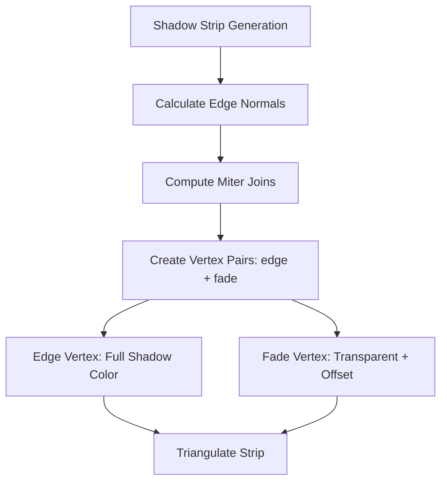
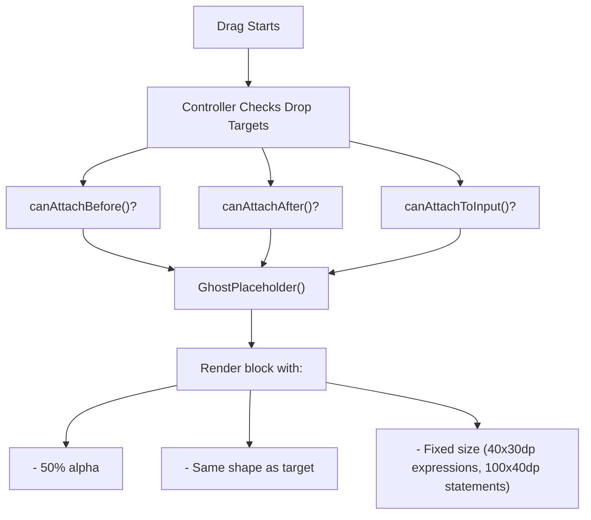
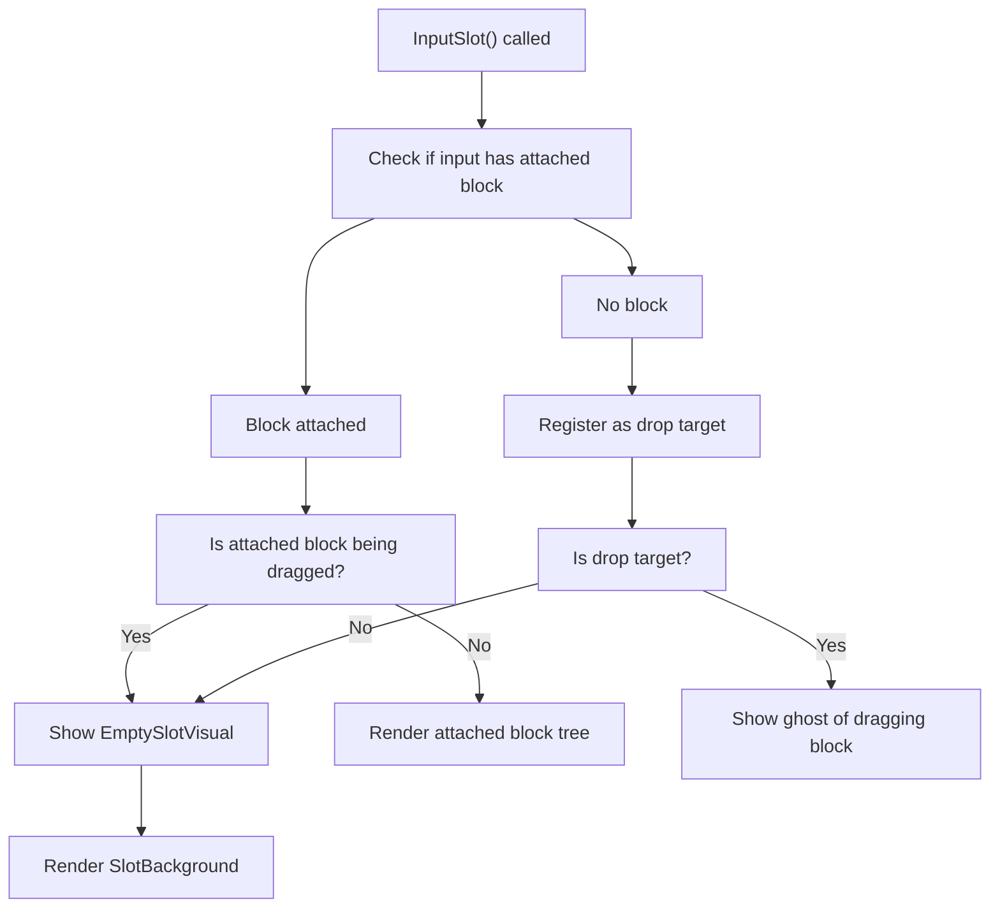

# Block Rendering System

<details>
<summary>Relevant source files</summary>

The following files were used as context for generating this wiki page:

- [src/main/java/ru/hollowhorizon/hollowengine/client/gui/codeblocks/BlockEditor.kt](src/main/java/ru/hollowhorizon/hollowengine/client/gui/codeblocks/BlockEditor.kt)
- [src/main/java/ru/hollowhorizon/hollowengine/client/gui/codeblocks/InputSlotScope.kt](src/main/java/ru/hollowhorizon/hollowengine/client/gui/codeblocks/InputSlotScope.kt)
- [src/main/java/ru/hollowhorizon/hollowengine/client/gui/codeblocks/PuzzleShapes.kt](src/main/java/ru/hollowhorizon/hollowengine/client/gui/codeblocks/PuzzleShapes.kt)
- [src/main/java/ru/hollowhorizon/hollowengine/client/gui/codeblocks/ScratchBlockBackground.kt](src/main/java/ru/hollowhorizon/hollowengine/client/gui/codeblocks/ScratchBlockBackground.kt)
- [src/main/java/ru/hollowhorizon/hollowengine/client/gui/codeblocks/SlotBackground.kt](src/main/java/ru/hollowhorizon/hollowengine/client/gui/codeblocks/SlotBackground.kt)
- [src/main/java/ru/hollowhorizon/hollowengine/common/codeblocks/BlocksScope.kt](src/main/java/ru/hollowhorizon/hollowengine/common/codeblocks/BlocksScope.kt)
- [src/main/java/ru/hollowhorizon/hollowengine/common/codeblocks/CodeBlock.kt](src/main/java/ru/hollowhorizon/hollowengine/common/codeblocks/CodeBlock.kt)
- [src/main/java/ru/hollowhorizon/hollowengine/common/codeblocks/serialization/CodeBlockFormat.kt](src/main/java/ru/hollowhorizon/hollowengine/common/codeblocks/serialization/CodeBlockFormat.kt)
- [src/main/java/ru/hollowhorizon/hollowengine/common/codeblocks/serialization/CodeBlockSerializer.kt](src/main/java/ru/hollowhorizon/hollowengine/common/codeblocks/serialization/CodeBlockSerializer.kt)
- [src/main/resources/assets/hollowengine/textures/gui/icons/global.svg](src/main/resources/assets/hollowengine/textures/gui/icons/global.svg)
- [src/main/resources/assets/hollowengine/textures/gui/icons/maximize.svg](src/main/resources/assets/hollowengine/textures/gui/icons/maximize.svg)

</details>


The Block Rendering System is responsible for rendering visual blocks in the Scratch-like block editor. It handles the drawing of puzzle-shaped blocks with rounded corners, notches, shadows, and visual states (hover, selection, dragging). The system supports multiple block types (statements, expressions, containers) and provides visual feedback during drag-and-drop operations through ghost placeholders.

For information about block data models and types, see [Block System Architecture](#6.1). For drag-and-drop interaction logic, see [Drag and Drop System](#5.3). For execution of assembled blocks, see [Block Execution and Coroutines](#7.4).

---

## Rendering Architecture

The rendering system uses custom `UiRenderer` implementations that directly manipulate vertex geometry for efficient 2D drawing. All rendering is done in world space coordinates, scaled by the current zoom level.



**Sources:** [src/main/java/ru/hollowhorizon/hollowengine/client/gui/codeblocks/BlockEditor.kt:206-340](), [src/main/java/ru/hollowhorizon/hollowengine/client/gui/codeblocks/ScratchBlockBackground.kt:23-227]()

---

## Core Rendering Components

### ScratchBlockBackground

The primary renderer for block visuals. It generates puzzle-shaped polygons with notches for connecting blocks.

| Property | Type | Purpose |
|----------|------|---------|
| `block` | `BlockModel` | The block being rendered |
| `color` | `Color` | Base color for the block |
| `zoom` | `Float` | Current zoom/scale factor |
| `isGhost` | `Boolean` | Whether to render as semi-transparent placeholder |
| `isSelected` | `Boolean` | Whether block is selected (adds white outline) |
| `triggerFactor` | `Float` | Animation factor for trigger block icon (0-1) |

**Block Type Detection:**

- `isExpression`: Renders rounded rectangle with left-side tab
- `hasPrev`: Block can connect to previous statement (adds top notch)
- `hasNext`: Block can connect to next statement (adds bottom notch)
- `isContainer`: Container blocks have special body rendering with spine
- `isTrigger`: StartBlock with rounded right edge

**Sources:** [src/main/java/ru/hollowhorizon/hollowengine/client/gui/codeblocks/ScratchBlockBackground.kt:23-227]()

### Shape Generation Process

```mermaid
graph LR
    Start["Calculate Dimensions"] --> DetectType["Detect Block Type"]
    DetectType --> ExprPath["Expression: Rounded Rect + Tab"]
    DetectType --> StmtPath["Statement: Puzzle Shape"]
    
    ExprPath --> BuildPoints["Build Vec3f Points List"]
    StmtPath --> BuildPoints
    
    BuildPoints --> TopLeft["Top-Left Corner (Bezier)"]
    TopLeft --> TopNotch["Top Notch (if hasPrev)"]
    TopNotch --> TopRight["Top-Right Corner"]
    TopRight --> RightEdge["Right Edge (Trigger Arc if isTrigger)"]
    RightEdge --> BottomRight["Bottom-Right Corner"]
    BottomRight --> BottomNotch["Bottom Notch (if hasNext)"]
    BottomNotch --> BottomLeft["Bottom-Left Corner"]
    BottomLeft --> LeftEdge["Left Edge (Tab if Expression)"]
    
    LeftEdge --> RenderGeom["Render Geometry"]
    RenderGeom --> DrawShadow["Draw Shadow Layer"]
    DrawShadow --> FillPoly["Fill Polygon"]
    FillPoly --> DrawStroke["Draw Selection Stroke (if selected)"]
    DrawStroke --> DrawInner["Draw Inner Shadow (if nested)"]
    DrawInner --> DrawIcon["Draw Icon (if trigger)"]
```



**Sources:** [src/main/java/ru/hollowhorizon/hollowengine/client/gui/codeblocks/ScratchBlockBackground.kt:38-200]()

---

## PuzzleShapes Utility

The `PuzzleShapes` object provides helper functions for generating the characteristic Scratch-block shapes.

### Key Constants

```kotlin
val SHADOW_RADIUS = Dp(2f)           // Shadow blur radius
val SHADOW_COLOR = Color.BLACK.withAlpha(0.5f)
val SHADOW_OFFSET_Y = Dp(1f)         // Shadow vertical offset
```

### Bezier Curve Generation

**Quadratic Bezier:** [PuzzleShapes.kt:37-48]()
- Used for rounded corners
- 16 segments for smooth curves
- Parameters: start point, control point, end point

**Cubic Bezier:** [PuzzleShapes.kt:50-78]()
- Used for complex trigger block arcs
- 16 segments for smoothness
- Parameters: start, control1, control2, end

### Shadow Rendering

The `drawShadow()` and `drawInnerShadow()` functions create depth effects by rendering gradient strips along block edges.



**Sources:** [src/main/java/ru/hollowhorizon/hollowengine/client/gui/codeblocks/PuzzleShapes.kt:80-184]()

---

## Container Block Rendering

Container blocks (e.g., `WhileBlock`, `IfElseBlock`) require special multi-part rendering.

### Container Components

| Component | Renderer | Purpose |
|-----------|----------|---------|
| Header | `ScratchBlockBackground` | Top part with label and inputs |
| Body Spine | `SpineBackground` | Left vertical strip connecting header to footer |
| Middle Sections | `ContainerMiddleBackground` | Section separators (e.g., "else" in if-else) |
| Footer | `ContainerFooterBackground` | Bottom cap with notch for next block |

### ContainerFooterBackground

Renders the bottom part of container blocks with:
- Inner notch (for body content)
- Optional outer bottom notch (if `hasNext`)
- Rounded bottom corners
- Shadow effects

**Sources:** [src/main/java/ru/hollowhorizon/hollowengine/client/gui/codeblocks/ScratchBlockBackground.kt:229-292]()

### SpineBackground

Renders the vertical connecting strip on the left side of container bodies:
- Fixed width: `BlockEditor.C_BLOCK_SPINE_WIDTH` (PaddingMedium)
- Solid rectangle with left-side shadow
- Connects header to footer

**Sources:** [src/main/java/ru/hollowhorizon/hollowengine/client/gui/codeblocks/ScratchBlockBackground.kt:354-402]()

---

## Ghost Blocks and Drop Targets

Ghost blocks provide visual feedback during drag-and-drop operations.

### Ghost Rendering Logic



**Implementation:** [BlockEditor.kt:439-460]()

The `GhostPlaceholder()` function renders a semi-transparent block in the target location:

1. Determines size based on block type
2. Resolves base color (no unused/selected states)
3. Renders using `ScratchBlockBackground` with `isGhost=true`

**Sources:** [src/main/java/ru/hollowhorizon/hollowengine/client/gui/codeblocks/BlockEditor.kt:439-460]()

---

## Visual States and Color Resolution

Blocks change appearance based on their state:

### State Resolution Table

| State | Visual Effect | Implementation |
|-------|---------------|----------------|
| **Ghost** | 50% alpha | `color.withAlpha(0.5f)` |
| **Unused** | Gray blend + 35% alpha | Mix with `Color.LIGHT_GRAY`, reduce alpha |
| **Selected** | White blend + white stroke | Mix with `Color.WHITE` (20%), draw 2dp stroke |
| **Hovered** | Brighter (110% brightness) | Parent applies via animation |
| **Nested Expression** | Inner shadow | `drawInnerShadow()` called |

**Color Resolution Function:** [BlockEditor.kt:622-631]()

```kotlin
fun BlockModel.resolveColor(isGhost: Boolean, isUnused: Boolean, isSelected: Boolean): Color {
    return MutableColor(color).apply {
        if (isGhost) withAlpha(0.5f, this)
        if (isUnused) {
            mix(Color.LIGHT_GRAY, 0.5f, this)
            withAlpha(0.35f, this)
        }
        if (isSelected) mix(Color.WHITE, 0.2f, this)
    }
}
```

### Hover Animation

Hover effects are animated using Kool's animation system:

```kotlin
val animatedColor by animateColorAsState(
    if (isHovered.use()) baseColor else baseColor.mulRgb(0.9f),
    tween(0.2f, Easing.easeOutQuart)
)
```

**Sources:** [src/main/java/ru/hollowhorizon/hollowengine/client/gui/codeblocks/BlockEditor.kt:368-371](), [src/main/java/ru/hollowhorizon/hollowengine/client/gui/codeblocks/BlockEditor.kt:622-631]()

---

## Input Slot Rendering

Input slots are rendered within blocks to show where expressions can be attached.

### SlotBackground

Renders empty input slots with:
- Rounded corners
- Left-side tab (for expression insertion)
- Inner shadow for depth
- Optional white border when targeted for drop

**Geometry:**
- Safe geometry calculation handles small heights
- Tab dimensions scale with zoom
- Tab position vertically centered

**Sources:** [src/main/java/ru/hollowhorizon/hollowengine/client/gui/codeblocks/SlotBackground.kt:11-59]()

### InputSlot Rendering Flow



**Sources:** [src/main/java/ru/hollowhorizon/hollowengine/client/gui/codeblocks/InputSlotScope.kt:32-54]()

---

## Scale and Zoom Support

The rendering system is fully scale-aware, allowing users to zoom in/out while maintaining visual quality.

### Scale Management

**Scale State:** [BlockEditor.kt:30-33]()
- `scaleState`: MutableStateValue controlling target scale
- `scale`: Current interpolated scale (animated via spring physics)
- Range: 0.25f to 3.0f

**Scale Application Points:**

| Component | Scaling Method |
|-----------|----------------|
| Dimensions | `Dp.scaled() = Dp(value * scale)` |
| Fonts | `getFont(baseSize, isBold)` scales size by `scale` |
| Geometry | `PuzzleShapes` functions receive `zoom` parameter |
| Positions | Block positions stored in logical units, multiplied by scale during layout |

**Animation:** [BlockEditor.kt:196-203]()

```kotlin
val smoothScale = animateSpringFloatAsState(
    scaleState.use(),
    stiffness = 600f,
    damping = 0.8f
)
```

**Sources:** [src/main/java/ru/hollowhorizon/hollowengine/client/gui/codeblocks/BlockEditor.kt:30-33](), [src/main/java/ru/hollowhorizon/hollowengine/client/gui/codeblocks/BlockEditor.kt:196-203]()

---

## Clipping and Coordinate Systems

The rendering system uses custom clipping to ensure blocks render correctly within scrollable areas.

### Coordinate Transform Helper

The `configure()` extension function [ScratchBlockBackground.kt:405-447]() handles:

1. **Clipping Bounds Detection:**
   - Finds parent `ScrollPaneNode` or specific `BoxNode` with `"CodeBlockRenderer"` scope
   - Extracts clip rectangle from parent

2. **Vertex Customization:**
   - Sets clip bounds on all generated vertices
   - Handles different vertex layouts (`UiVertexLayout`, `UiTextVertexLayout`)

3. **Transform Application:**
   - Translates geometry by node's screen position
   - Preserves previous color and customizer state

**Sources:** [src/main/java/ru/hollowhorizon/hollowengine/client/gui/codeblocks/ScratchBlockBackground.kt:404-447]()

---

## Z-Layer Management

Blocks are rendered at different z-layers to ensure correct visual stacking.

### Layer Calculation

**Base Layers:**
- `UiSurface.LAYER_DEFAULT` (0): Normal blocks
- `Z_LAYER_DRAGGING` (1,000,000): Blocks being dragged
- `UiSurface.LAYER_BACKGROUND`: Background fills
- `UiSurface.LAYER_FLOATING`: Top layer (selection strokes, animations)
- `Z_LAYER_SCROLLBAR` (100,000,000): UI controls

**Dynamic Layer Computation:** [BlockEditor.kt:421-429]()

```kotlin
var baseLayer = if (isDragging) Z_LAYER_DRAGGING else UiSurface.LAYER_DEFAULT
rootBlocks.indexOf(block.root).takeUnless { it == -1 }?.let { 
    baseLayer += it * 1000  // Separate root block stacks
}
if (block.bodyRoot.parentBlock != null) baseLayer += 100  // Nested blocks higher
val finalLayer = if (block.isExpression()) baseLayer + 100 
                 else baseLayer + 100 - block.parentCount  // Deeper statements lower
```

**Sources:** [src/main/java/ru/hollowhorizon/hollowengine/client/gui/codeblocks/BlockEditor.kt:421-429]()

---

## Trigger Block Special Rendering

`StartBlock` instances (triggers) have unique visual elements:

### Rounded Right Edge

Instead of square right edge, trigger blocks use a compound curve:
- Filleted corners at top and bottom of arc
- Central circular arc using cubic Bezier curves
- Creates distinctive pill-shaped right side

**Implementation:** [ScratchBlockBackground.kt:86-133]()

### Global/Local Icon

Trigger blocks display an animated icon indicating their scope:
- **Local Icon:** Class icon (default)
- **Global Icon:** Globe icon
- Icons crossfade based on `triggerFactor` (0=local, 1=global)

**Rendering:** [ScratchBlockBackground.kt:189-226]()

Icons loaded via `ImageManager.load()`, rendered using custom `ImageMesh` with:
- Size: 35% of available space
- Position: Right side, vertically centered
- Alpha: Controlled by `triggerFactor`

**Sources:** [src/main/java/ru/hollowhorizon/hollowengine/client/gui/codeblocks/ScratchBlockBackground.kt:86-133](), [src/main/java/ru/hollowhorizon/hollowengine/client/gui/codeblocks/ScratchBlockBackground.kt:189-226]()

---

## Rendering Optimization

### Geometry Reuse

- Vertex builders cleared and reused each frame
- `configure()` helper manages builder state
- Polygon filling uses `PolyUtil.fillPolygon()` for efficient triangulation

### Conditional Rendering

**Ghost Placeholders:** Only rendered when:
- A block is being dragged
- Current node is a valid drop target
- Controller confirms attachment possibility

**Selection Strokes:** Only rendered when:
- `isSelected` state is true
- Rendered on separate high z-layer (100,000) for crisp edges

**Shadows:**
- Outer shadows skipped for nested expression blocks
- Inner shadows only for nested expressions

**Sources:** [src/main/java/ru/hollowhorizon/hollowengine/client/gui/codeblocks/ScratchBlockBackground.kt:159-163](), [src/main/java/ru/hollowhorizon/hollowengine/client/gui/codeblocks/ScratchBlockBackground.kt:165-183](), [src/main/java/ru/hollowhorizon/hollowengine/client/gui/codeblocks/ScratchBlockBackground.kt:185-187]()