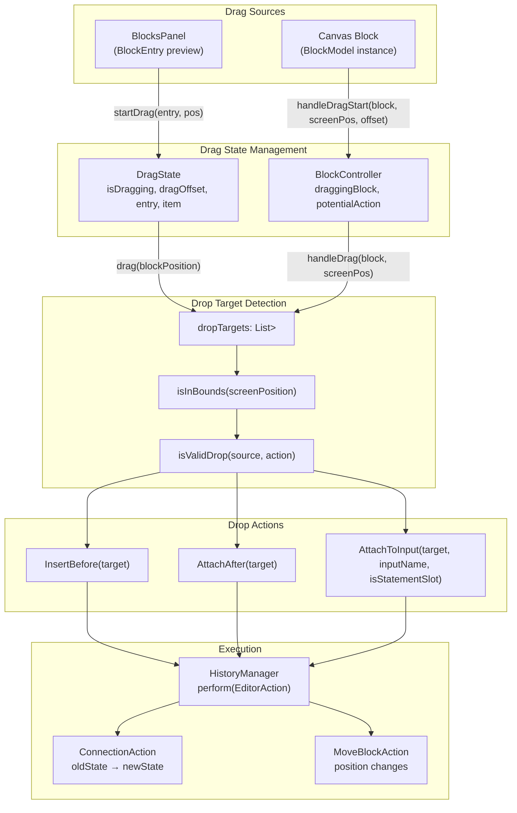
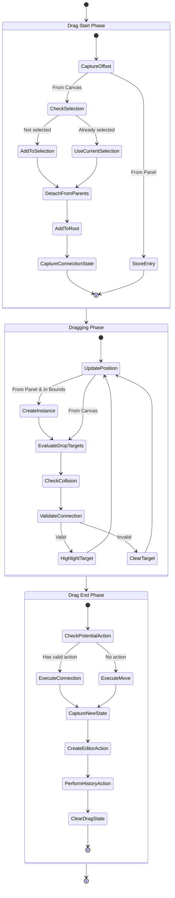
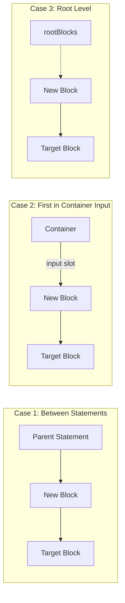
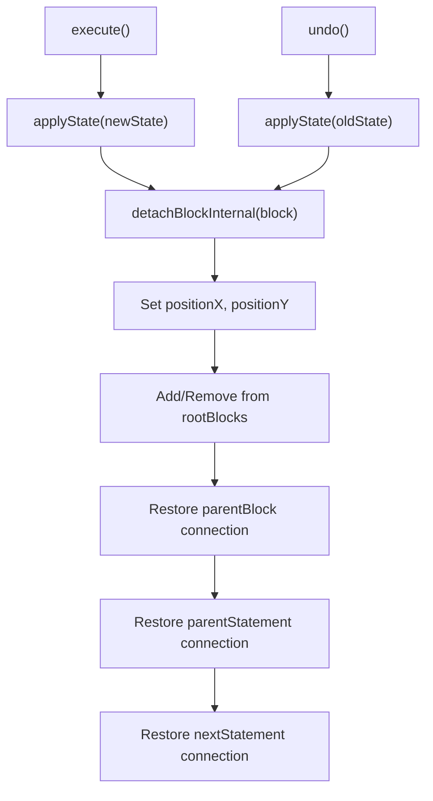

# Drag and Drop System

<details>
<summary>Relevant source files</summary>

The following files were used as context for generating this wiki page:

- [src/main/java/ru/hollowhorizon/hollowengine/client/gui/codeblocks/BlockController.kt](src/main/java/ru/hollowhorizon/hollowengine/client/gui/codeblocks/BlockController.kt)
- [src/main/java/ru/hollowhorizon/hollowengine/client/gui/codeblocks/BlockEditor.kt](src/main/java/ru/hollowhorizon/hollowengine/client/gui/codeblocks/BlockEditor.kt)
- [src/main/java/ru/hollowhorizon/hollowengine/client/gui/codeblocks/BlocksPanel.kt](src/main/java/ru/hollowhorizon/hollowengine/client/gui/codeblocks/BlocksPanel.kt)
- [src/main/java/ru/hollowhorizon/hollowengine/client/gui/codeblocks/DragState.kt](src/main/java/ru/hollowhorizon/hollowengine/client/gui/codeblocks/DragState.kt)
- [src/main/java/ru/hollowhorizon/hollowengine/client/gui/codeblocks/InputSlotScope.kt](src/main/java/ru/hollowhorizon/hollowengine/client/gui/codeblocks/InputSlotScope.kt)
- [src/main/java/ru/hollowhorizon/hollowengine/client/gui/codeblocks/PuzzleShapes.kt](src/main/java/ru/hollowhorizon/hollowengine/client/gui/codeblocks/PuzzleShapes.kt)
- [src/main/java/ru/hollowhorizon/hollowengine/client/gui/codeblocks/ScratchBlockBackground.kt](src/main/java/ru/hollowhorizon/hollowengine/client/gui/codeblocks/ScratchBlockBackground.kt)
- [src/main/java/ru/hollowhorizon/hollowengine/client/gui/codeblocks/SlotBackground.kt](src/main/java/ru/hollowhorizon/hollowengine/client/gui/codeblocks/SlotBackground.kt)
- [src/main/java/ru/hollowhorizon/hollowengine/client/gui/kool/KeyHandlerNode.kt](src/main/java/ru/hollowhorizon/hollowengine/client/gui/kool/KeyHandlerNode.kt)
- [src/main/java/ru/hollowhorizon/hollowengine/client/gui/scripting/files/codeblocks/CodeBlocksFile.kt](src/main/java/ru/hollowhorizon/hollowengine/client/gui/scripting/files/codeblocks/CodeBlocksFile.kt)
- [src/main/java/ru/hollowhorizon/hollowengine/client/kool/KoolHooks.java](src/main/java/ru/hollowhorizon/hollowengine/client/kool/KoolHooks.java)
- [src/main/java/ru/hollowhorizon/hollowengine/common/codeblocks/BlockRepository.kt](src/main/java/ru/hollowhorizon/hollowengine/common/codeblocks/BlockRepository.kt)
- [src/main/java/ru/hollowhorizon/hollowengine/common/codeblocks/BlocksScope.kt](src/main/java/ru/hollowhorizon/hollowengine/common/codeblocks/BlocksScope.kt)
- [src/main/java/ru/hollowhorizon/hollowengine/common/codeblocks/CodeBlock.kt](src/main/java/ru/hollowhorizon/hollowengine/common/codeblocks/CodeBlock.kt)
- [src/main/java/ru/hollowhorizon/hollowengine/common/codeblocks/model/BlockModel.kt](src/main/java/ru/hollowhorizon/hollowengine/common/codeblocks/model/BlockModel.kt)
- [src/main/java/ru/hollowhorizon/hollowengine/common/codeblocks/serialization/CodeBlockFormat.kt](src/main/java/ru/hollowhorizon/hollowengine/common/codeblocks/serialization/CodeBlockFormat.kt)
- [src/main/java/ru/hollowhorizon/hollowengine/common/codeblocks/serialization/CodeBlockSerializer.kt](src/main/java/ru/hollowhorizon/hollowengine/common/codeblocks/serialization/CodeBlockSerializer.kt)
- [src/main/resources/assets/hollowengine/textures/gui/icons/global.svg](src/main/resources/assets/hollowengine/textures/gui/icons/global.svg)
- [src/main/resources/assets/hollowengine/textures/gui/icons/maximize.svg](src/main/resources/assets/hollowengine/textures/gui/icons/maximize.svg)

</details>


## Purpose and Scope

This document describes the drag and drop system used in the Visual Block Editor for moving and connecting blocks. The system handles two distinct drag scenarios: dragging blocks from the blocks panel into the editor canvas, and dragging existing blocks within the canvas to reorganize or connect them. The system integrates with collision detection, type validation, and the undo/redo history manager.

For information about the block rendering itself, see [Block Rendering System](#5.2). For details on the connection and input slot system, see [Connection System and Input Slots](#5.6). For the undo/redo mechanism, see [History Manager](#5.5).

---

## Architecture Overview

The drag and drop system is split into two primary components that handle different drag sources with distinct lifecycles but converge on the same drop target validation logic.

**System Architecture**



Sources: [src/main/java/ru/hollowhorizon/hollowengine/client/gui/codeblocks/DragState.kt:1-70](), [src/main/java/ru/hollowhorizon/hollowengine/client/gui/codeblocks/BlockController.kt:1-625](), [src/main/java/ru/hollowhorizon/hollowengine/client/gui/codeblocks/BlockEditor.kt:23-68]()

---

## Drag Sources

The system supports two distinct drag initiation points, each with its own state management class.

### From Blocks Panel (DragState)

The `DragState` class manages dragging blocks from the blocks panel sidebar into the editor canvas. This represents creating new block instances.

| Property | Type | Purpose |
|----------|------|---------|
| `isDragging` | `MutableStateValue<Boolean>` | Tracks active drag from panel |
| `dragOffset` | `MutableStateValue<Vec2f>` | Offset from cursor to block origin |
| `entry` | `BlockEntry<*>?` | Template entry being dragged |
| `item` | `BlockModel?` | Actual block instance (created on entry to canvas) |

**Lifecycle Methods:**

- `startDrag(entry: BlockEntry<*>, pos: Vec2f)` - Initiated when user starts dragging from panel
- `drag(blockPosition: Vec2f)` - Called continuously during drag, creates `item` when entering editor bounds
- `endDrag()` - Finalizes placement by calling `BlockController.handleDragEnd(item, isNewBlock=true)`

A key optimization: the block instance is not created until the cursor enters the editor bounds (checked via `pos in editor.controller`). This prevents unnecessary allocations if the user cancels the drag.

Sources: [src/main/java/ru/hollowhorizon/hollowengine/client/gui/codeblocks/DragState.kt:10-70](), [src/main/java/ru/hollowhorizon/hollowengine/client/gui/codeblocks/BlockEditor.kt:25-26]()

### From Canvas (BlockController)

The `BlockController` manages dragging blocks that already exist in the editor. This includes moving, reconnecting, and multi-selection dragging.

| Property | Type | Purpose |
|----------|------|---------|
| `draggingBlock` | `BlockModel?` | Primary block being dragged |
| `dragStartOffset` | `MutableVec2f` | Local offset from block origin to cursor |
| `initialBlockPositions` | `Map<BlockModel, Vec2f>` | Starting positions for multi-select |
| `dragStartConnectionState` | `Map<BlockModel, ConnectionState>?` | Pre-drag connection states for undo |
| `potentialAction` | `DropAction?` | Currently highlighted drop target |

**Lifecycle Methods:**

- `handleDragStart(block, screenPosition, localOffset)` - Captures initial state and detaches block if needed
- `handleDrag(block, screenPosition)` - Updates position and evaluates drop targets
- `handleDragEnd(block, isNewBlock)` - Executes drop action or pure move, creates history entry

Sources: [src/main/java/ru/hollowhorizon/hollowengine/client/gui/codeblocks/BlockController.kt:13-42](), [src/main/java/ru/hollowhorizon/hollowengine/client/gui/codeblocks/BlockController.kt:145-318]()

---

## Drag Lifecycle

The drag operation follows a three-phase lifecycle regardless of the drag source, eventually converging on the same drop target system.

**Drag Lifecycle Flow**



Sources: [src/main/java/ru/hollowhorizon/hollowengine/client/gui/codeblocks/BlockController.kt:145-318](), [src/main/java/ru/hollowhorizon/hollowengine/client/gui/codeblocks/DragState.kt:16-50]()

### Start Phase Details

When `handleDragStart` is called on `BlockController`, the following operations occur:

1. **Selection Management** ([BlockController.kt:146-148]()): If the dragged block is not in `selectedBlocks`, it becomes the sole selection. Otherwise, all selected blocks participate in the drag.

2. **Detachment** ([BlockController.kt:154-173]()): For each top-level selected block (blocks without selected parents):
   - If the block has a parent (statement or container), it is detached via `detachBlockInternal()`
   - The block's position is converted from relative to absolute coordinates
   - The block is added to `rootBlocks` if not already present
   - Initial positions are stored in `initialBlockPositions`

3. **State Capture** ([BlockController.kt:156-159]()): A `ConnectionState` snapshot is captured for the dragged block and its immediate relatives (parent container, parent statement). This enables accurate undo.

Sources: [src/main/java/ru/hollowhorizon/hollowengine/client/gui/codeblocks/BlockController.kt:145-174]()

### Dragging Phase Details

During `handleDrag`, the system continuously updates positions and evaluates drop targets:

1. **Position Calculation** ([BlockController.kt:176-195]()): 
   - Convert screen positions to local editor coordinates using `toLocal()`
   - Calculate delta from initial drag position
   - Clamp delta to prevent negative positions (blocks can't go off-canvas)
   - Apply delta to all blocks in `initialBlockPositions`

2. **Drop Target Evaluation** ([BlockController.kt:196-210]()): 
   - Iterate through all registered `dropTargets` (populated during rendering)
   - Check if cursor is within target bounds using `node.isInBounds(screenPosition)`
   - Validate connection using `isValidDrop(block, action)`
   - Set `potentialAction` to the first valid target

3. **Visual Feedback**: The `potentialAction` is used during rendering to highlight drop zones (see [InputSlotScope.kt:35-53]() for input slot highlighting).

Sources: [src/main/java/ru/hollowhorizon/hollowengine/client/gui/codeblocks/BlockController.kt:176-211]()

### End Phase Details

When `handleDragEnd` is called, the system executes the drop action or records a simple move:

1. **Action Collection** ([BlockController.kt:214-252]()): The system identifies all blocks affected by the operation:
   - The dragged block itself
   - The target block (for connections)
   - Displaced blocks (e.g., the block that was in an input slot)
   - Sibling blocks in statement chains

2. **Connection Execution** ([BlockController.kt:257-261]()): Based on `potentialAction` type:
   - `InsertBefore`: Inserts dragged block before target in statement chain
   - `AttachAfter`: Appends dragged block after target in statement chain  
   - `AttachToInput`: Places dragged block in target's input slot

3. **History Recording** ([BlockController.kt:266-273]()): 
   - Capture `ConnectionState` for all affected blocks after the operation
   - Create `ConnectionAction` for each block whose state changed
   - Wrap multiple actions in `CompoundAction` if necessary
   - Call `history.perform()` to enable undo/redo

Sources: [src/main/java/ru/hollowhorizon/hollowengine/client/gui/codeblocks/BlockController.kt:213-318]()

---

## Drop Targets

Drop targets are dynamically registered during the rendering phase and represent all valid locations where a block can be dropped.

### Registration System

Drop targets are registered in `BlockController` via the `addDropTarget` method, called during UI rendering:

```
controller.addDropTarget(DropAction.AttachAfter(block), uiNode)
```

The `dropTargets` list is cleared and repopulated on every frame in `BlockController.update()`. This ensures targets always reflect the current editor state, including scroll position and zoom level.

**Drop Target Types**

| Target Type | Usage | Code Location |
|-------------|-------|---------------|
| **InsertBefore** | Top section of statement blocks | [BlockEditor.kt:224-228](), [BlockEditor.kt:393-395]() |
| **AttachAfter** | Bottom section of statement blocks | [BlockEditor.kt:239-250](), [BlockEditor.kt:397-402]() |
| **AttachToInput (Expression)** | Empty expression input slots | [InputSlotScope.kt:47]() |
| **AttachToInput (Statement)** | Container body slots | [InputSlotScope.kt:121]() |

Sources: [src/main/java/ru/hollowhorizon/hollowengine/client/gui/codeblocks/BlockController.kt:43-46](), [src/main/java/ru/hollowhorizon/hollowengine/client/gui/codeblocks/BlockController.kt:560-563]()

### Drop Zone Visualization

Drop zones are rendered as ghost placeholders or highlighted slots during dragging:

**Expression Slot Highlighting** ([InputSlotScope.kt:32-54]()):
- If slot is empty and targeted: renders `GhostPlaceholder` with dragged block's shape
- If slot is occupied and targeted: renders white border around existing block

**Statement Chain Zones** ([BlockEditor.kt:224-253]()):
- Before-zones: Rendered above statement blocks when `canAttachBefore()` returns true
- After-zones: Rendered below statement blocks when `canAttachAfter()` returns true
- Ghost placeholders show the shape of the dragged block

Sources: [src/main/java/ru/hollowhorizon/hollowengine/client/gui/codeblocks/InputSlotScope.kt:32-54](), [src/main/java/ru/hollowhorizon/hollowengine/client/gui/codeblocks/BlockEditor.kt:224-253](), [src/main/java/ru/hollowhorizon/hollowengine/client/gui/codeblocks/BlockEditor.kt:425-446]()

---

## Connection Validation

The `isValidDrop` method ([BlockController.kt:585-604]()) enforces several constraints to prevent invalid connections:

### Validation Rules

**Validation Rule Table**

| Rule | Check | Code Reference |
|------|-------|----------------|
| Self-connection | `source == action.target` | [BlockController.kt:586]() |
| Circular dependency | `isAncestorOf(source, action.target)` | [BlockController.kt:587]() |
| StartBlock placement | `source is StartBlock` | [BlockController.kt:589]() |
| Statement type match | `!source.isExpression()` for statement slots | [BlockController.kt:592]() |
| Expression type match | `requiredType.accepts(returnType)` | [BlockController.kt:597]() |
| Slot type match | Expression vs Statement | [BlockController.kt:594-601]() |

### Type Compatibility

For expression inputs, the system checks type compatibility using the `ExpressionType.accepts()` method:

1. **Exact Match**: `typeOf<String>()` accepts `typeOf<String>()`
2. **AnyType Exception**: `AnyType` accepts any expression type ([BlockController.kt:597]())
3. **Type Coercion**: The return type is compared against the required type

Expression blocks cannot be dropped in statement slots (`isStatementSlot == true`), and statement blocks cannot be dropped in expression slots (`isStatementSlot == false`).

Sources: [src/main/java/ru/hollowhorizon/hollowengine/client/gui/codeblocks/BlockController.kt:585-604](), [src/main/java/ru/hollowhorizon/hollowengine/common/codeblocks/InputSlotScope.kt:32-56]()

---

## Drop Action Execution

When a valid drop action is executed, the system modifies the block graph structure according to the action type.

### InsertBefore Logic

The `insertBlockBeforeLogic` method ([BlockController.kt:372-415]()) handles three cases:

**InsertBefore Cases**



1. **Between Statements** ([BlockController.kt:376-388]()): If target has a `parent` statement, the new block is inserted between them. The tail of the new block chain connects to the target.

2. **First in Container** ([BlockController.kt:389-404]()): If target has a `parentBlock` (container), the new block replaces the target in the input slot, and the target becomes the new block's `next`.

3. **Root Level** ([BlockController.kt:405-414]()): If target is in `rootBlocks`, the new block replaces it and the target becomes the new block's `next`.

Sources: [src/main/java/ru/hollowhorizon/hollowengine/client/gui/codeblocks/BlockController.kt:372-415]()

### AttachAfter Logic

The `attachBlockAfterLogic` method ([BlockController.kt:355-370]()) is simpler, always creating a chain:

```
target -> newBlock -> oldNext (if any)
```

The method finds the tail of the new block (if it's a chain), then connects it to the target's old `next`, preserving the statement sequence.

Sources: [src/main/java/ru/hollowhorizon/hollowengine/client/gui/codeblocks/BlockController.kt:355-370]()

### AttachToInput Logic

The `attachBlockToInputLogic` method ([BlockController.kt:320-353]()) handles two special cases:

1. **Statement Slot** ([BlockController.kt:326-341]()): If both the new block and existing block are statements, the new block is placed in the slot and its tail connects to the existing block (forming a chain within the input).

2. **Expression Slot** ([BlockController.kt:342-350]()): The existing block is displaced to `rootBlocks` and the new block takes its place.

Sources: [src/main/java/ru/hollowhorizon/hollowengine/client/gui/codeblocks/BlockController.kt:320-353]()

---

## History Integration

All drag and drop operations are recorded in the history system for undo/redo support.

### ConnectionState Capture

The `ConnectionState` data class ([HistoryManager.kt:111-119]()) captures a complete snapshot of a block's connections:

| Field | Purpose |
|-------|---------|
| `parentBlock` | Container block (for input slots) |
| `parentInputName` | Name of input slot |
| `parentStatement` | Previous statement in chain |
| `nextStatement` | Next statement in chain |
| `indexInRoot` | Position in `rootBlocks` (-1 if not root) |
| `positionX`, `positionY` | Absolute canvas coordinates |

The `captureConnectionState` method ([BlockController.kt:497-507]()) creates these snapshots before and after each operation.

### Action Execution

The `ConnectionAction` class ([HistoryManager.kt:121-215]()) applies or reverses a connection state change:

**ConnectionAction Flow**



The `applyState` method ([HistoryManager.kt:136-214]()) includes safety checks to handle edge cases:
- Displacing occupied input slots ([HistoryManager.kt:157-164]())
- Clearing old parent connections ([HistoryManager.kt:186-195]())
- Managing root list membership based on connection state

Sources: [src/main/java/ru/hollowhorizon/hollowengine/client/gui/codeblocks/HistoryManager.kt:111-215](), [src/main/java/ru/hollowhorizon/hollowengine/client/gui/codeblocks/BlockController.kt:497-507]()

---

## Multi-Selection Dragging

When multiple blocks are selected, the drag system moves them as a group while maintaining their relative positions.

### Selection Management

The `handleDragStart` method identifies top-level selected blocks (blocks without selected parents) and includes them in the drag operation:

```kotlin
val topLevelMovers = selectedBlocks.filter { !isParentSelected(it) }
```

Each top-level block is detached from its parent and added to `rootBlocks`. The `initialBlockPositions` map stores their starting coordinates.

### Synchronized Movement

During `handleDrag`, the same delta is applied to all blocks in `initialBlockPositions`. The delta is clamped to prevent any block from moving off-canvas:

```kotlin
initialBlockPositions.values.forEach { initialPos ->
    val proposedX = initialPos.x + deltaX
    val proposedY = initialPos.y + deltaY
    if (proposedX < 0) deltaX = max(deltaX, -initialPos.x)
    if (proposedY < 0) deltaY = max(deltaY, -initialPos.y)
}
```

This ensures the entire selection moves together, and no block escapes the visible canvas.

Sources: [src/main/java/ru/hollowhorizon/hollowengine/client/gui/codeblocks/BlockController.kt:145-195](), [src/main/java/ru/hollowhorizon/hollowengine/client/gui/codeblocks/BlockController.kt:609-615]()

---

## Visual Feedback System

The drag system provides real-time visual feedback through multiple mechanisms.

### Drag Preview

When dragging from the blocks panel, `DragState.compose()` ([DragState.kt:52-69]()) renders a ghost preview:
- Uses a `Popup` positioned at the cursor with the drag offset
- Renders `entry.previewItem` with `canDrag = false` to prevent nested drag handlers
- Z-layered at `100_000_000` to appear above all other UI

### Drop Zone Highlighting

During dragging, the `potentialAction` field determines which drop zones are visually highlighted:

1. **Input Slots** ([InputSlotScope.kt:35-53]()):
   - Empty targeted slots: Show `GhostPlaceholder` with dragged block's shape
   - Occupied targeted slots: Render white `RectBorder` around existing block

2. **Statement Zones** ([BlockEditor.kt:224-253]()):
   - Ghost placeholders appear above (InsertBefore) or below (AttachAfter) targeted blocks
   - Placeholders use the dragged block's color with 50% opacity

### Snap Effect

When a connection is successfully made, `triggerSnapEffect` ([BlockController.kt:565-583]()) creates a visual animation:
- A ring expands and fades at the connection point
- Rendered in `renderSnapAnimations` ([BlockEditor.kt:573-604]())
- Uses `RingGeometry` vertices with `Easing.easeInQuart` alpha

The snap effect does not trigger for `InsertBefore` actions, only for `AttachAfter` and `AttachToInput`.

Sources: [src/main/java/ru/hollowhorizon/hollowengine/client/gui/codeblocks/DragState.kt:52-69](), [src/main/java/ru/hollowhorizon/hollowengine/client/gui/codeblocks/BlockEditor.kt:573-604](), [src/main/java/ru/hollowhorizon/hollowengine/client/gui/codeblocks/BlockController.kt:565-583]()

---

## Coordinate System and Scaling

The drag system operates across three coordinate spaces, with transformations applied based on editor zoom and scroll state.

### Coordinate Spaces

| Space | Description | Usage |
|-------|-------------|-------|
| **Screen** | Raw pixel coordinates from input events | Drag event positions |
| **Viewport** | Scrolled screen coordinates (relative to editor bounds) | Collision detection |
| **Logical** | Scaled coordinates accounting for zoom | Block positions |

The `toLocal` method ([BlockController.kt:48-58]()) converts screen coordinates to logical coordinates:

```kotlin
fun toLocal(screenPosition: Vec2f): Vec2f {
    val scrollX = scrollState.xScrollDp.value * UiScale.measuredScale
    val scrollY = scrollState.yScrollDp.value * UiScale.measuredScale
    
    val relX = screenPosition.x - scrollPaneBounds.x + scrollX
    val relY = screenPosition.y - scrollPaneBounds.y + scrollY
    
    return Vec2f(relX / editor.scale, relY / editor.scale)
}
```

### Zoom Compensation

All size-dependent values are multiplied by `editor.scale`:
- Drop target sizes ([BlockEditor.kt:246-248]())
- Ghost placeholder dimensions ([BlockEditor.kt:427-430]())
- Padding offsets ([DragState.kt:30-31]())

Block positions stored in `BlockModel.positionX` and `positionY` are always in logical space (pre-scaled), so they remain stable across zoom level changes.

Sources: [src/main/java/ru/hollowhorizon/hollowengine/client/gui/codeblocks/BlockController.kt:48-61](), [src/main/java/ru/hollowhorizon/hollowengine/client/gui/codeblocks/BlockEditor.kt:407-423](), [src/main/java/ru/hollowhorizon/hollowengine/client/gui/codeblocks/DragState.kt:22-39]()

---

## Key Implementation Details

### Drop Target Lifecycle

Drop targets exist only during the rendering frame:
1. `BlockController.update()` clears `dropTargets` ([BlockController.kt:43-46]())
2. Rendering code calls `addDropTarget()` for each valid zone ([BlockEditor.kt:226](), [InputSlotScope.kt:47]())
3. `handleDrag` evaluates targets on this frame ([BlockController.kt:196-210]())

This design ensures targets automatically adapt to layout changes, collapsed blocks, and zoom levels without explicit invalidation.

### Edge Case Handling

**Circular Dependencies** ([BlockController.kt:606-607]()): The `isAncestorOf` check prevents dropping a container inside itself, which would create an infinite loop during rendering.

**StartBlock Restrictions** ([BlockController.kt:589]()): `StartBlock` instances cannot be dragged from the palette or inserted into chains, as they must always be root-level triggers.

**Chain Tail Handling** ([BlockController.kt:361-369]()): When attaching a statement chain (not a single block), the system finds the chain's tail to properly connect to the target's old `next`.

**Safety Disconnect** ([HistoryManager.kt:157-195]()): When a block is placed in an occupied input slot, the old block is safely displaced to `rootBlocks` with all parent references cleared.

Sources: [src/main/java/ru/hollowhorizon/hollowengine/client/gui/codeblocks/BlockController.kt:43-46](), [src/main/java/ru/hollowhorizon/hollowengine/client/gui/codeblocks/BlockController.kt:585-607](), [src/main/java/ru/hollowhorizon/hollowengine/client/gui/codeblocks/HistoryManager.kt:157-195]()