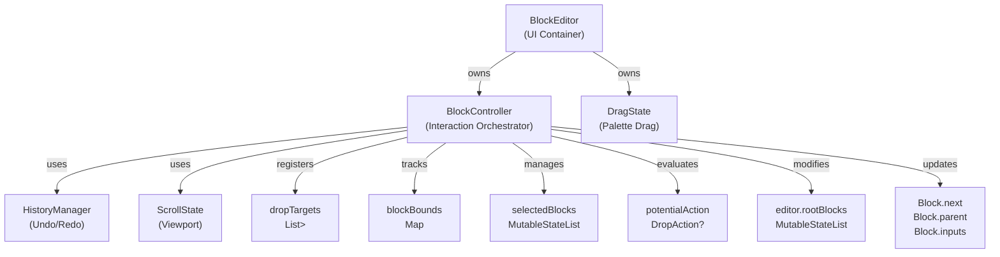
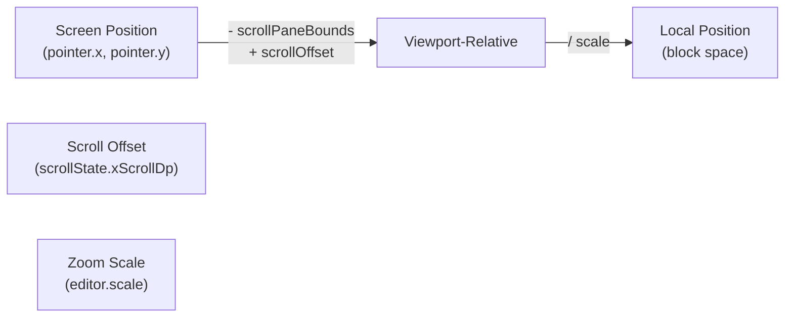
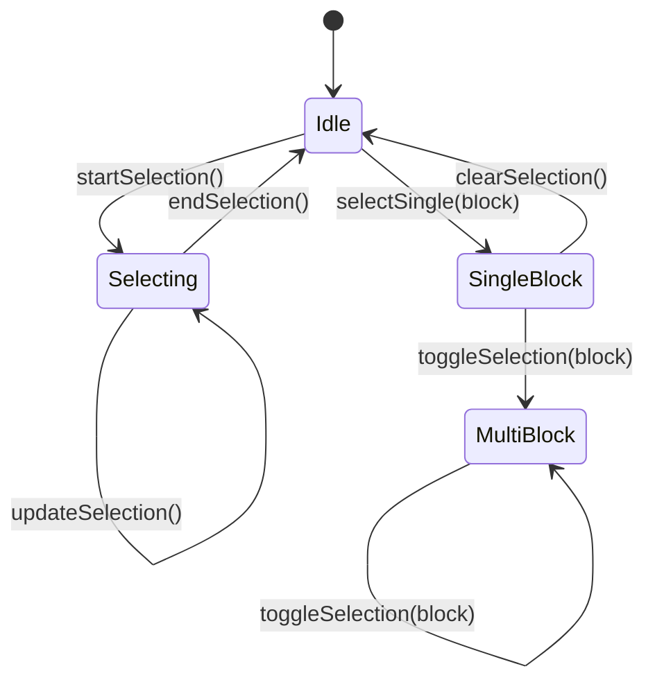
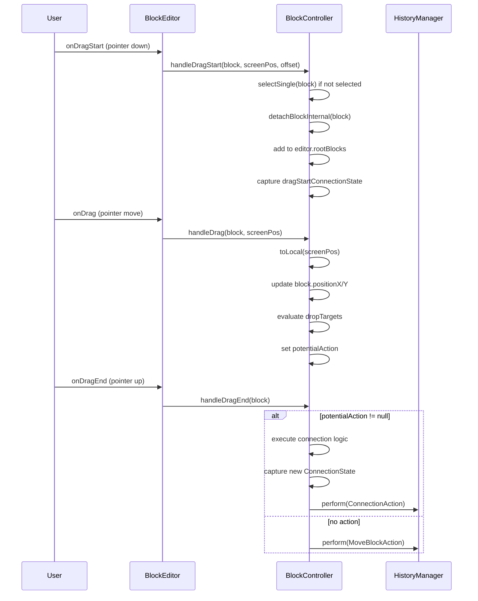
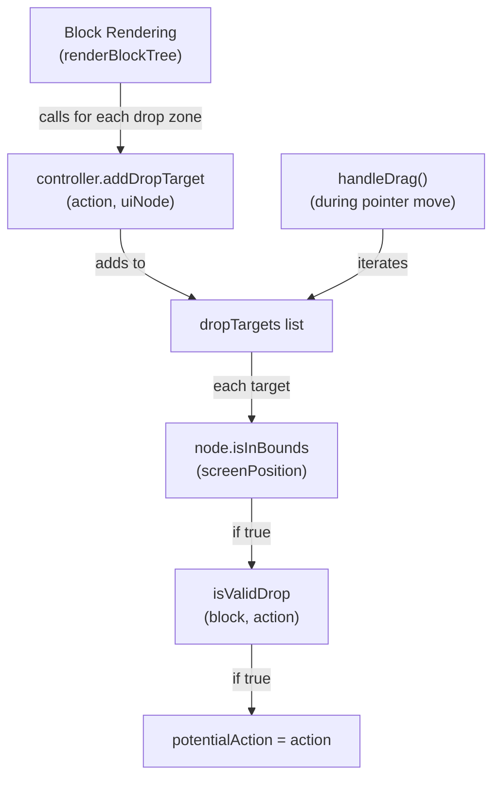
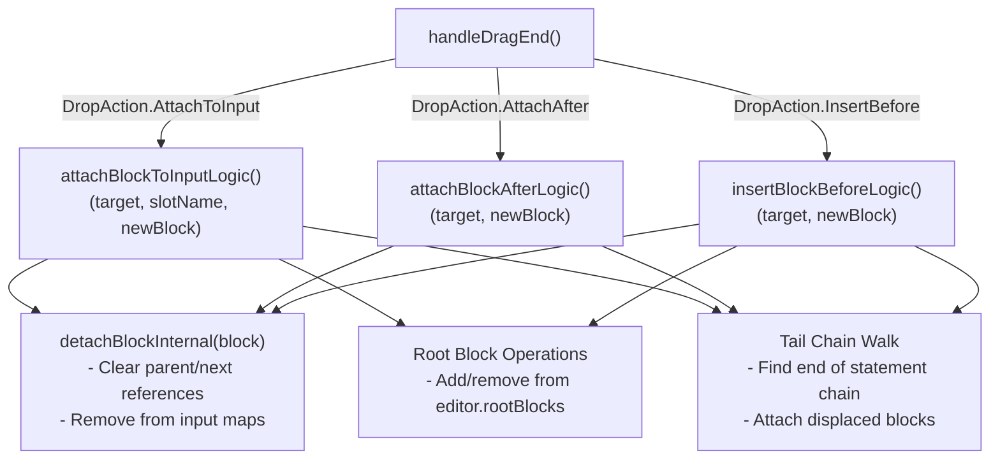
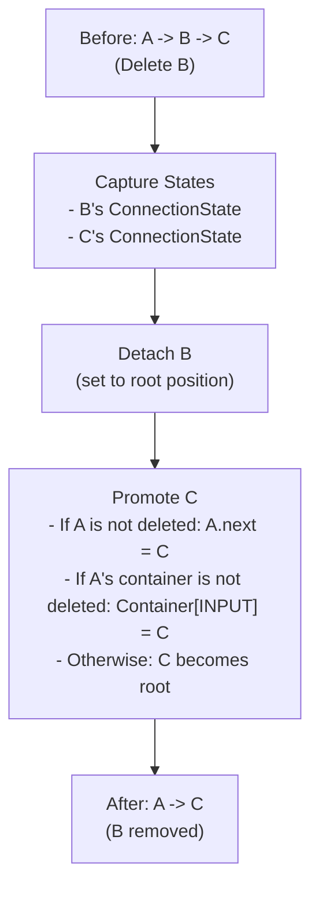

# Block Controller

<details>
<summary>Relevant source files</summary>

The following files were used as context for generating this wiki page:

- [src/main/java/ru/hollowhorizon/hollowengine/client/gui/codeblocks/BlockController.kt](src/main/java/ru/hollowhorizon/hollowengine/client/gui/codeblocks/BlockController.kt)
- [src/main/java/ru/hollowhorizon/hollowengine/client/gui/codeblocks/BlocksPanel.kt](src/main/java/ru/hollowhorizon/hollowengine/client/gui/codeblocks/BlocksPanel.kt)
- [src/main/java/ru/hollowhorizon/hollowengine/client/gui/codeblocks/DragState.kt](src/main/java/ru/hollowhorizon/hollowengine/client/gui/codeblocks/DragState.kt)
- [src/main/java/ru/hollowhorizon/hollowengine/client/gui/kool/KeyHandlerNode.kt](src/main/java/ru/hollowhorizon/hollowengine/client/gui/kool/KeyHandlerNode.kt)
- [src/main/java/ru/hollowhorizon/hollowengine/client/gui/scripting/files/codeblocks/CodeBlocksFile.kt](src/main/java/ru/hollowhorizon/hollowengine/client/gui/scripting/files/codeblocks/CodeBlocksFile.kt)
- [src/main/java/ru/hollowhorizon/hollowengine/client/kool/KoolHooks.java](src/main/java/ru/hollowhorizon/hollowengine/client/kool/KoolHooks.java)
- [src/main/java/ru/hollowhorizon/hollowengine/common/codeblocks/BlockRepository.kt](src/main/java/ru/hollowhorizon/hollowengine/common/codeblocks/BlockRepository.kt)
- [src/main/java/ru/hollowhorizon/hollowengine/common/codeblocks/model/BlockModel.kt](src/main/java/ru/hollowhorizon/hollowengine/common/codeblocks/model/BlockModel.kt)

</details>


The `BlockController` is the central orchestration layer for user interactions in the visual block editor. It manages drag-and-drop operations, selection state, coordinate transformations, drop target evaluation, and integration with the undo/redo history system. This controller sits between the UI rendering (handled by `BlockEditor`) and the block model manipulation logic.

For information about the block data models themselves, see [6.1](#6.1). For drag operations originating from the palette, see [5.7](#5.7). For undo/redo implementation details, see [5.5](#5.5).

**Sources:** [src/main/java/ru/hollowhorizon/hollowengine/client/gui/codeblocks/BlockController.kt:1-625]()

---

## Core Architecture and Responsibilities

The `BlockController` class [src/main/java/ru/hollowhorizon/hollowengine/client/gui/codeblocks/BlockController.kt:13-625]() is instantiated by `BlockEditor` and coordinates the following subsystems:



**Sources:** [src/main/java/ru/hollowhorizon/hollowengine/client/gui/codeblocks/BlockController.kt:13-40](), [src/main/java/ru/hollowhorizon/hollowengine/client/gui/codeblocks/BlockEditor.kt:23-27]()

---

## State Management and Update Lifecycle

The controller maintains ephemeral state that is reset each frame:

| Property | Type | Purpose |
|----------|------|---------|
| `dropTargets` | `MutableList<Pair<DropAction, UiNode>>` | UI nodes that can receive drops |
| `blockBounds` | `MutableMap<BlockModel, BlockRect>` | Cached screen-space bounds for hit testing |
| `potentialAction` | `DropAction?` | Current drop target during drag |
| `draggingBlock` | `BlockModel?` | Block currently being dragged |
| `selectedBlocks` | `MutableStateList<BlockModel>` | Currently selected blocks |
| `clipboard` | `MutableList<BlockModel>` | Copied blocks |

The `update()` method [src/main/java/ru/hollowhorizon/hollowengine/client/gui/codeblocks/BlockController.kt:43-46]() is called at the start of each render frame to clear frame-dependent data:

```kotlin
fun update() {
    dropTargets.clear()
    blockBounds.clear()
}
```

**Sources:** [src/main/java/ru/hollowhorizon/hollowengine/client/gui/codeblocks/BlockController.kt:14-46]()

---

## Coordinate System Transformations

The controller translates between screen coordinates (pointer events) and logical coordinates (block positions in the scrollable canvas).



**Implementation:** `toLocal(screenPosition: Vec2f)` [src/main/java/ru/hollowhorizon/hollowengine/client/gui/codeblocks/BlockController.kt:48-56]()

```kotlin
fun toLocal(screenPosition: Vec2f): Vec2f {
    val scrollX = scrollState.xScrollDp.value * UiScale.measuredScale
    val scrollY = scrollState.yScrollDp.value * UiScale.measuredScale
    
    val relX = screenPosition.x - scrollPaneBounds.x + scrollX
    val relY = screenPosition.y - scrollPaneBounds.y + scrollY
    
    return Vec2f(relX / editor.scale, relY / editor.scale)
}
```

The `scrollPaneBounds` field stores the viewport rectangle [src/main/java/ru/hollowhorizon/hollowengine/client/gui/codeblocks/BlockEditor.kt:106-113]() and is updated via `onPositioned` callbacks.

**Sources:** [src/main/java/ru/hollowhorizon/hollowengine/client/gui/codeblocks/BlockController.kt:48-61](), [src/main/java/ru/hollowhorizon/hollowengine/client/gui/codeblocks/BlockEditor.kt:106-113]()

---

## Selection System

The controller supports both rectangular selection (drag on background) and discrete selection (click blocks).

### Selection State Machine



### Rectangular Selection Algorithm

The `calculateSelectionIntersection()` method [src/main/java/ru/hollowhorizon/hollowengine/client/gui/codeblocks/BlockController.kt:94-114]() performs AABB (axis-aligned bounding box) intersection tests:

```kotlin
private fun calculateSelectionIntersection() {
    val xMin = min(selectionStart.x, selectionCurr.x)
    val xMax = max(selectionStart.x, selectionCurr.x)
    val yMin = min(selectionStart.y, selectionCurr.y)
    val yMax = max(selectionStart.y, selectionCurr.y)
    
    blockBounds.forEach { (block, bounds) ->
        if (xMin < bounds.x + bounds.w && xMax > bounds.x &&
            yMin < bounds.y + bounds.h && yMax > bounds.y) {
            newSelection.add(block)
        }
    }
}
```

The `registerBlockBounds()` method [src/main/java/ru/hollowhorizon/hollowengine/client/gui/codeblocks/BlockController.kt:116-119]() is called during block rendering to populate the `blockBounds` map.

**Sources:** [src/main/java/ru/hollowhorizon/hollowengine/client/gui/codeblocks/BlockController.kt:63-119](), [src/main/java/ru/hollowhorizon/hollowengine/client/gui/codeblocks/BlockEditor.kt:302-304]()

---

## Drag and Drop Pipeline

The drag-and-drop system uses a three-phase approach: start, drag, end.

### Drag Lifecycle Diagram



### Drag Start Logic

`handleDragStart()` [src/main/java/ru/hollowhorizon/hollowengine/client/gui/codeblocks/BlockController.kt:145-174]() performs the following:

1. If the dragged block is not already selected, clear selection and select it
2. Store the drag start position and offset
3. Capture the connection state of the block and its adjacent blocks
4. Detach all top-level selected blocks from their parents
5. Convert their positions to absolute coordinates
6. Add them to `editor.rootBlocks` if not already present

**Sources:** [src/main/java/ru/hollowhorizon/hollowengine/client/gui/codeblocks/BlockController.kt:145-174](), [src/main/java/ru/hollowhorizon/hollowengine/client/gui/codeblocks/BlockEditor.kt:538-550]()

### Drag Update Logic

`handleDrag()` [src/main/java/ru/hollowhorizon/hollowengine/client/gui/codeblocks/BlockController.kt:176-211]() continuously:

1. Calculates the delta from drag start position
2. Clamps negative deltas to prevent blocks from moving off-canvas
3. Updates all selected blocks' positions based on their initial positions plus delta
4. Searches `dropTargets` for valid drop zones at the current pointer position
5. Sets `potentialAction` to the best matching `DropAction`

**Sources:** [src/main/java/ru/hollowhorizon/hollowengine/client/gui/codeblocks/BlockController.kt:176-211]()

### Drag End and Action Execution

`handleDragEnd()` [src/main/java/ru/hollowhorizon/hollowengine/client/gui/codeblocks/BlockController.kt:213-318]() is the most complex method, responsible for:

1. Determining whether to execute a connection or just record a move
2. Collecting all affected blocks (source, target, displaced children)
3. Capturing old and new `ConnectionState` for each affected block
4. Executing the appropriate connection logic method
5. Creating `ConnectionAction` or `MoveBlockAction` objects
6. Combining multiple actions into a `CompoundAction` if needed
7. Performing the action through `history.perform()`

**Sources:** [src/main/java/ru/hollowhorizon/hollowengine/client/gui/codeblocks/BlockController.kt:213-318]()

---

## Drop Target Registration and Evaluation

Drop targets are registered during the rendering pass by `BlockEditor.renderBlockTree()` and `InputSlotScope` components.

### Drop Target Flow



### Drop Actions

The three types of drop actions [src/main/java/ru/hollowhorizon/hollowengine/client/gui/codeblocks/BlockController.kt:585-604]() are defined as:

| `DropAction` | Used For | Registered By |
|--------------|----------|---------------|
| `InsertBefore(target: BlockModel)` | Inserting a statement before another | Ghost placeholder above blocks [src/main/java/ru/hollowhorizon/hollowengine/client/gui/codeblocks/BlockEditor.kt:226-228]() |
| `AttachAfter(target: StatementBlock)` | Appending to a statement chain | Area below statement blocks [src/main/java/ru/hollowhorizon/hollowengine/client/gui/codeblocks/BlockEditor.kt:240-249]() |
| `AttachToInput(target, inputName, isStatementSlot)` | Filling an input slot | Expression/statement input slots [src/main/java/ru/hollowhorizon/hollowengine/client/gui/codeblocks/InputSlotScope.kt:47-53]() |

**Sources:** [src/main/java/ru/hollowhorizon/hollowengine/client/gui/codeblocks/BlockController.kt:560-604](), [src/main/java/ru/hollowhorizon/hollowengine/client/gui/codeblocks/BlockEditor.kt:223-252](), [src/main/java/ru/hollowhorizon/hollowengine/client/gui/codeblocks/InputSlotScope.kt:32-54]()

---

## Connection Logic Implementation

The controller delegates to three internal methods for executing different connection types.

### Connection Method Overview



### Attach to Input Logic

`attachBlockToInputLogic()` [src/main/java/ru/hollowhorizon/hollowengine/client/gui/codeblocks/BlockController.kt:320-353]() handles placing a block into an input slot. Key behavior:

1. Remove `newBlock` from root and detach it
2. Check if the slot already has a block
3. If replacing a statement with a statement, chain them: `newBlock -> existingBlock`
4. Otherwise, eject the existing block to root
5. Set `target.inputs[slotName] = newBlock`
6. Update `newBlock.parentBlock` and `parentInputName`

**Sources:** [src/main/java/ru/hollowhorizon/hollowengine/client/gui/codeblocks/BlockController.kt:320-353]()

### Attach After Logic

`attachBlockAfterLogic()` [src/main/java/ru/hollowhorizon/hollowengine/client/gui/codeblocks/BlockController.kt:355-370]() appends to a statement chain:

1. Remove `newBlock` from root and detach it
2. Store `target.next` as `oldNext`
3. Set `target.next = newBlock`, `newBlock.parent = target`
4. Walk to the end of `newBlock`'s chain (the tail)
5. If `oldNext` exists, attach it: `tail.next = oldNext`, `oldNext.parent = tail`

**Sources:** [src/main/java/ru/hollowhorizon/hollowengine/client/gui/codeblocks/BlockController.kt:355-370]()

### Insert Before Logic

`insertBlockBeforeLogic()` [src/main/java/ru/hollowhorizon/hollowengine/client/gui/codeblocks/BlockController.kt:372-415]() is the most complex, handling three cases:

**Case 1: Insert between statements** (target has a `parent`)
```
A -> B     =>    A -> NEW -> B
```

**Case 2: Insert into container input slot** (target has a `parentBlock`)
```
Container[INPUT: B]   =>   Container[INPUT: NEW -> B]
```

**Case 3: Insert at root** (target is a root block)
```
[ROOT: B]   =>   [ROOT: NEW -> B]
```

In all cases, the method walks to the tail of `newBlock` and attaches `target` after it.

**Sources:** [src/main/java/ru/hollowhorizon/hollowengine/client/gui/codeblocks/BlockController.kt:372-415]()

---

## Validation Rules and Type System

The `isValidDrop()` method [src/main/java/ru/hollowhorizon/hollowengine/client/gui/codeblocks/BlockController.kt:585-604]() enforces structural and type safety constraints.

### Validation Rule Table

| Rule | Check | Reason |
|------|-------|--------|
| Self-attachment | `source != target` | Cannot attach a block to itself |
| Cycle prevention | `!isAncestorOf(source, target)` | Prevents circular references |
| StartBlock cannot be moved | `source !is StartBlock` | Triggers are always top-level |
| Statement-only connections | `!source.isExpression()` | InsertBefore/AttachAfter only work with statements |
| Type compatibility | `requiredType.accepts(returnType)` | Expression type must match input type |
| AnyType escape hatch | `returnType == AnyType` | AnyType expressions can go anywhere |

### Type Validation for Expressions

For `DropAction.AttachToInput` targeting expression slots [src/main/java/ru/hollowhorizon/hollowengine/client/gui/codeblocks/BlockController.kt:593-602]():

```kotlin
if (source is ExpressionBlock) {
    val requiredType = action.target.inputTypes[action.inputName] ?: return false
    val returnType = source.expressionType
    val typesMatch = requiredType.accepts(returnType) || returnType == AnyType
    typesMatch && !action.isStatementSlot
} else {
    action.isStatementSlot
}
```

**Sources:** [src/main/java/ru/hollowhorizon/hollowengine/client/gui/codeblocks/BlockController.kt:585-604](), [src/test/kotlin/BlockControllerTests.kt:433-455]()

---

## Clipboard Operations and Deletion

The controller provides standard clipboard operations with deep-copy semantics.

### Clipboard Method Summary

| Method | Behavior | History Integration |
|--------|----------|---------------------|
| `copySelected()` [src/main/java/ru/hollowhorizon/hollowengine/client/gui/codeblocks/BlockController.kt:417-424]() | Deep-copies top-level selected blocks to clipboard | No |
| `cutSelected()` [src/main/java/ru/hollowhorizon/hollowengine/client/gui/codeblocks/BlockController.kt:426-431]() | Copies then deletes | Performed via `deleteSelected()` |
| `paste()` [src/main/java/ru/hollowhorizon/hollowengine/client/gui/codeblocks/BlockController.kt:433-451]() | Deep-copies clipboard, offsets position by 20px, selects | `AddBlocksAction` |
| `deleteSelected()` [src/main/java/ru/hollowhorizon/hollowengine/client/gui/codeblocks/BlockController.kt:453-493]() | Detaches and removes blocks, reconnects survivors | `CompoundAction` |

### Delete and Survivor Logic

When deleting blocks from a chain, `deleteSelected()` performs "survivor promotion":



The method creates a `ConnectionAction` for each affected block's state change [src/main/java/ru/hollowhorizon/hollowengine/client/gui/codeblocks/BlockController.kt:459-486](), then wraps them in a `CompoundAction` for atomic undo.

**Sources:** [src/main/java/ru/hollowhorizon/hollowengine/client/gui/codeblocks/BlockController.kt:417-493](), [src/test/kotlin/BlockControllerTests.kt:243-296]()

---

## History Integration and ConnectionState

The controller uses the `ConnectionState` data class [src/main/java/ru/hollowhorizon/hollowengine/client/gui/codeblocks/HistoryManager.kt:111-119]() to capture a block's attachment context.

### ConnectionState Structure

```kotlin
data class ConnectionState(
    val parentBlock: BlockModel?,      // Container parent (input slot)
    val parentInputName: String?,      // Input slot name
    val parentStatement: BlockModel?,  // Statement chain parent
    val nextStatement: BlockModel?,    // Statement chain child
    val indexInRoot: Int = -1,         // Position in editor.rootBlocks (-1 if attached)
    val positionX: Float,              // Logical X position
    val positionY: Float               // Logical Y position
)
```

### Capturing and Restoring State

`captureConnectionState()` [src/main/java/ru/hollowhorizon/hollowengine/client/gui/codeblocks/BlockController.kt:497-507]() snapshots a block's current connections and position. The `ConnectionAction.applyState()` method [src/main/java/ru/hollowhorizon/hollowengine/client/gui/codeblocks/HistoryManager.kt:136-214]() restores it:

1. Detach the block from all current connections
2. Restore position
3. Add to or remove from root based on `indexInRoot`
4. Reconnect to `parentBlock` input slot if specified
5. Reconnect to `parentStatement` chain if specified
6. Reconnect `nextStatement` child if specified

**Safety:** The apply logic includes defensive checks [src/main/java/ru/hollowhorizon/hollowengine/client/gui/codeblocks/HistoryManager.kt:157-177]() to handle cases where slots are occupied, preventing orphaned blocks.

**Sources:** [src/main/java/ru/hollowhorizon/hollowengine/client/gui/codeblocks/BlockController.kt:497-507](), [src/main/java/ru/hollowhorizon/hollowengine/client/gui/codeblocks/HistoryManager.kt:111-214](), [src/test/kotlin/BlockControllerTests.kt:328-381]()

---

## Additional Utilities

### Duplication

- `duplicateBlock(block, localPos)` [src/main/java/ru/hollowhorizon/hollowengine/client/gui/codeblocks/BlockController.kt:521-527](): Creates a deep copy at a specific position
- `duplicateSelected()` [src/main/java/ru/hollowhorizon/hollowengine/client/gui/codeblocks/BlockController.kt:529-552](): Copies all selected top-level blocks with +20px offset

### Selection Helpers

- `selectAll()` [src/main/java/ru/hollowhorizon/hollowengine/client/gui/codeblocks/BlockController.kt:621-624](): Selects all blocks via `editor.rootBlocks.flatMap { it.walk() }`
- `resetCamera()` [src/main/java/ru/hollowhorizon/hollowengine/client/gui/codeblocks/BlockController.kt:554-558](): Resets zoom to 1.0 and scroll to origin

### Snap Effect Trigger

`triggerSnapEffect()` [src/main/java/ru/hollowhorizon/hollowengine/client/gui/codeblocks/BlockController.kt:565-583]() creates a visual ring animation at the drop target location by:
1. Finding the target `UiNode` from `dropTargets`
2. Converting its screen position to logical coordinates
3. Adding offset based on drop action type
4. Calling `editor.triggerSnapEffect(SnapAnimation(...))`

**Sources:** [src/main/java/ru/hollowhorizon/hollowengine/client/gui/codeblocks/BlockController.kt:521-583]()

---

## Integration with BlockEditor

The `BlockEditor` calls the controller's methods in response to UI events:

| Event | Method Call | Location |
|-------|-------------|----------|
| Frame start | `controller.update()` | [BlockEditor.kt:72]() |
| Background drag start | `controller.startSelection()` | [BlockEditor.kt:135]() |
| Background drag | `controller.updateSelection()` | [BlockEditor.kt:141]() |
| Background drag end | `controller.endSelection()` | [BlockEditor.kt:147]() |
| Block drag start | `controller.handleDragStart()` | [BlockEditor.kt:542]() |
| Block drag | `controller.handleDrag()` | [BlockEditor.kt:548]() |
| Block drag end | `controller.handleDragEnd()` | [BlockEditor.kt:549]() |
| Key press (Ctrl+Z) | `controller.history.undo()` | [BlockEditor.kt:167]() |
| Key press (Ctrl+C) | `controller.copySelected()` | [BlockEditor.kt:173]() |
| Key press (Del) | `controller.deleteSelected()` | [BlockEditor.kt:181]() |

**Sources:** [src/main/java/ru/hollowhorizon/hollowengine/client/gui/codeblocks/BlockEditor.kt:72-192](), [src/main/java/ru/hollowhorizon/hollowengine/client/gui/codeblocks/BlockEditor.kt:538-550]()

---

## Testing Coverage

The controller has comprehensive unit tests [src/test/kotlin/BlockControllerTests.kt:1-536]() covering:

- Basic drag-and-drop movement [BlockControllerTests.kt:76-96]()
- Undo/redo of movement [BlockControllerTests.kt:98-121]()
- Statement connection [BlockControllerTests.kt:123-153]()
- Insertion between blocks [BlockControllerTests.kt:188-214]()
- Chain deletion with survivor promotion [BlockControllerTests.kt:243-270]()
- Expression type validation [BlockControllerTests.kt:433-455]()
- Input slot replacement [BlockControllerTests.kt:457-482]()
- Safety checks for displaced blocks [BlockControllerTests.kt:328-381]()

**Sources:** [src/test/kotlin/BlockControllerTests.kt:1-536]()