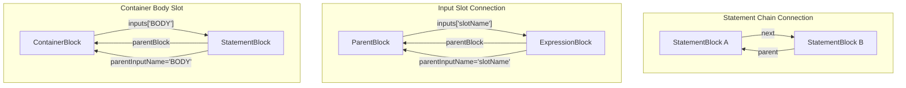
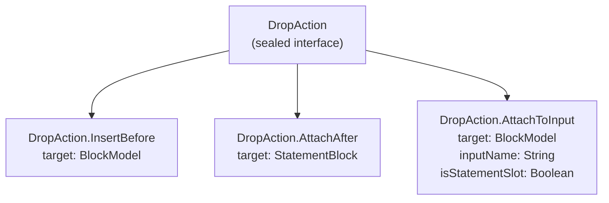
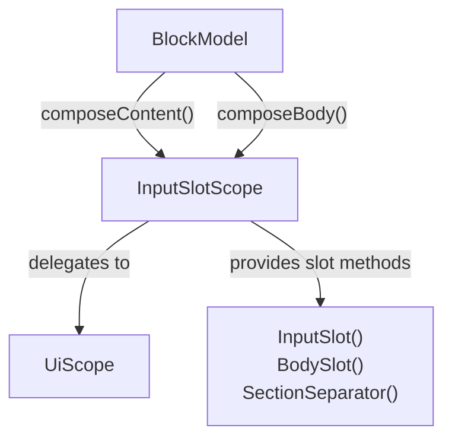
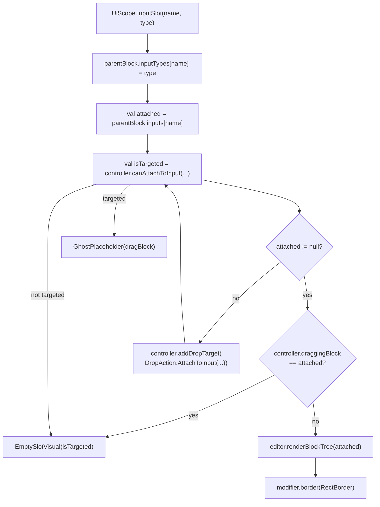
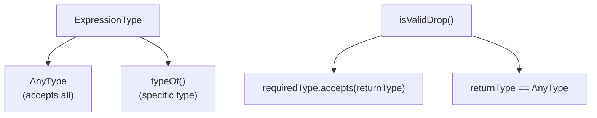
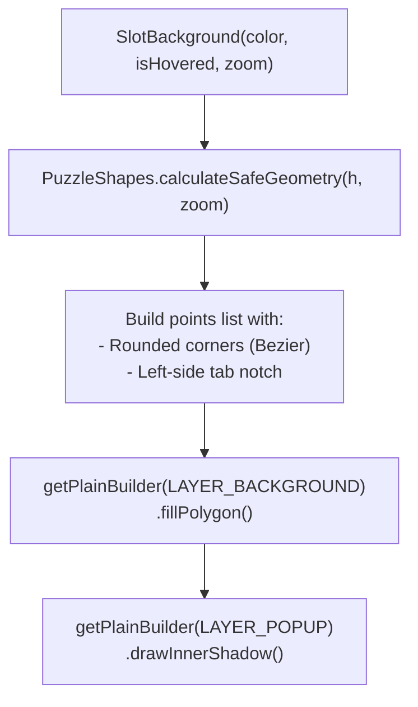
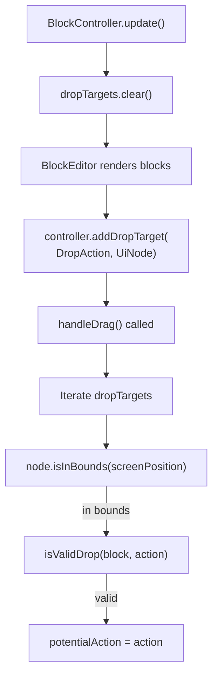
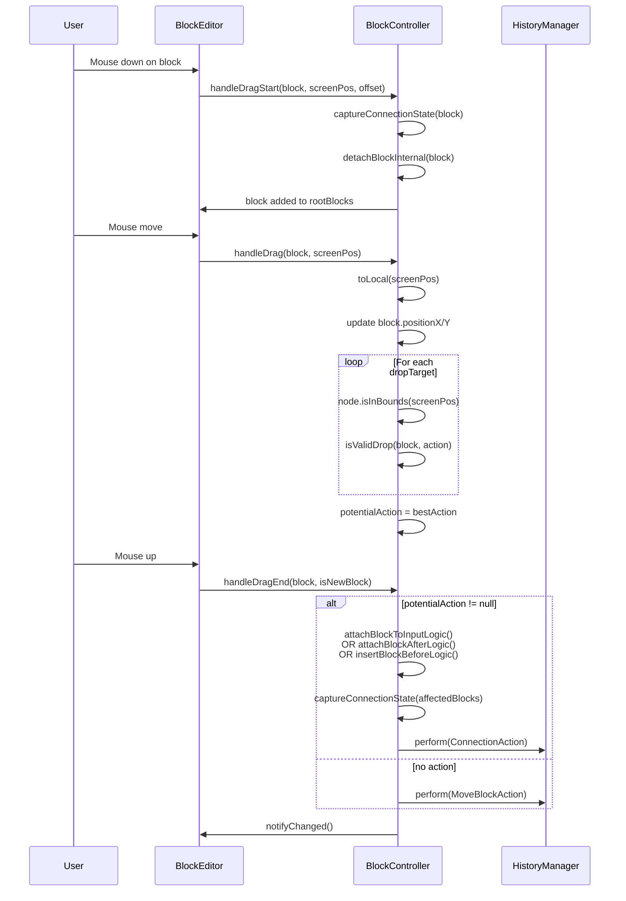

# Connection System and Input Slots

<details>
<summary>Relevant source files</summary>

The following files were used as context for generating this wiki page:

- [src/main/java/ru/hollowhorizon/hollowengine/client/gui/codeblocks/BlockController.kt](src/main/java/ru/hollowhorizon/hollowengine/client/gui/codeblocks/BlockController.kt)
- [src/main/java/ru/hollowhorizon/hollowengine/client/gui/codeblocks/BlockEditor.kt](src/main/java/ru/hollowhorizon/hollowengine/client/gui/codeblocks/BlockEditor.kt)
- [src/main/java/ru/hollowhorizon/hollowengine/client/gui/codeblocks/BlocksPanel.kt](src/main/java/ru/hollowhorizon/hollowengine/client/gui/codeblocks/BlocksPanel.kt)
- [src/main/java/ru/hollowhorizon/hollowengine/client/gui/codeblocks/DragState.kt](src/main/java/ru/hollowhorizon/hollowengine/client/gui/codeblocks/DragState.kt)
- [src/main/java/ru/hollowhorizon/hollowengine/client/gui/codeblocks/InputSlotScope.kt](src/main/java/ru/hollowhorizon/hollowengine/client/gui/codeblocks/InputSlotScope.kt)
- [src/main/java/ru/hollowhorizon/hollowengine/client/gui/codeblocks/PuzzleShapes.kt](src/main/java/ru/hollowhorizon/hollowengine/client/gui/codeblocks/PuzzleShapes.kt)
- [src/main/java/ru/hollowhorizon/hollowengine/client/gui/codeblocks/ScratchBlockBackground.kt](src/main/java/ru/hollowhorizon/hollowengine/client/gui/codeblocks/ScratchBlockBackground.kt)
- [src/main/java/ru/hollowhorizon/hollowengine/client/gui/codeblocks/SlotBackground.kt](src/main/java/ru/hollowhorizon/hollowengine/client/gui/codeblocks/SlotBackground.kt)
- [src/main/java/ru/hollowhorizon/hollowengine/client/gui/kool/KeyHandlerNode.kt](src/main/java/ru/hollowhorizon/hollowengine/client/gui/kool/KeyHandlerNode.kt)
- [src/main/java/ru/hollowhorizon/hollowengine/client/gui/scripting/files/codeblocks/CodeBlocksFile.kt](src/main/java/ru/hollowhorizon/hollowengine/client/gui/scripting/files/codeblocks/CodeBlocksFile.kt)
- [src/main/java/ru/hollowhorizon/hollowengine/client/kool/KoolHooks.java](src/main/java/ru/hollowhorizon/hollowengine/client/kool/KoolHooks.java)
- [src/main/java/ru/hollowhorizon/hollowengine/common/codeblocks/BlockRepository.kt](src/main/java/ru/hollowhorizon/hollowengine/common/codeblocks/BlockRepository.kt)
- [src/main/java/ru/hollowhorizon/hollowengine/common/codeblocks/BlocksScope.kt](src/main/java/ru/hollowhorizon/hollowengine/common/codeblocks/BlocksScope.kt)
- [src/main/java/ru/hollowhorizon/hollowengine/common/codeblocks/CodeBlock.kt](src/main/java/ru/hollowhorizon/hollowengine/common/codeblocks/CodeBlock.kt)
- [src/main/java/ru/hollowhorizon/hollowengine/common/codeblocks/model/BlockModel.kt](src/main/java/ru/hollowhorizon/hollowengine/common/codeblocks/model/BlockModel.kt)
- [src/main/java/ru/hollowhorizon/hollowengine/common/codeblocks/serialization/CodeBlockFormat.kt](src/main/java/ru/hollowhorizon/hollowengine/common/codeblocks/serialization/CodeBlockFormat.kt)
- [src/main/java/ru/hollowhorizon/hollowengine/common/codeblocks/serialization/CodeBlockSerializer.kt](src/main/java/ru/hollowhorizon/hollowengine/common/codeblocks/serialization/CodeBlockSerializer.kt)
- [src/main/resources/assets/hollowengine/textures/gui/icons/global.svg](src/main/resources/assets/hollowengine/textures/gui/icons/global.svg)
- [src/main/resources/assets/hollowengine/textures/gui/icons/maximize.svg](src/main/resources/assets/hollowengine/textures/gui/icons/maximize.svg)

</details>


## Purpose and Scope

This document describes the **connection system** that allows blocks to attach to each other in the visual block editor, and the **InputSlotScope DSL** that provides a declarative way to define input slots within blocks. The connection system supports three primary attachment modes: sequential statement chains, expression inputs, and container body slots.

For information about the drag-and-drop mechanics that trigger these connections, see [Drag and Drop System](#5.3). For the controller logic that validates and applies connections, see [Block Controller](#5.4). For the overall block data structure, see [Block System Architecture](#6.1).

---

## Connection Types and Block Relationships

The visual block editor supports three distinct connection patterns, each serving different programming constructs:



**Sources:** [src/main/java/ru/hollowhorizon/hollowengine/common/codeblocks/model/BlockModel.kt](), [src/main/java/ru/hollowhorizon/hollowengine/client/gui/codeblocks/BlockController.kt:8-9]()

### Statement Chain Connections

Statement blocks connect sequentially using `parent` and `next` properties, forming execution chains. This connection type is used when blocks execute in order:

| Property | Type | Description |
|----------|------|-------------|
| `parent` | `StatementBlock?` | Points to the previous statement in the chain |
| `next` | `StatementBlock?` | Points to the next statement in the chain |

The controller enforces that only non-container statement blocks can use `parent`/`next` connections. Trigger blocks (`StartBlock`) cannot have a parent, as they must be at the beginning of chains.

**Sources:** [src/main/java/ru/hollowhorizon/hollowengine/client/gui/codeblocks/BlockController.kt:124-136]()

### Input Slot Connections

Blocks can accept other blocks as inputs using named slots. These connections use:

| Property | Type | Description |
|----------|------|-------------|
| `parentBlock` | `BlockModel?` | The block that contains this block in an input slot |
| `parentInputName` | `String?` | The name of the input slot this block occupies |
| `inputs` | `MutableMap<String, BlockModel>` | Map of slot names to child blocks |
| `inputTypes` | `MutableMap<String, ExpressionType>` | Expected type for each slot |

Expression blocks typically connect to input slots, but statement slots can also accept statement block chains.

**Sources:** [src/main/java/ru/hollowhorizon/hollowengine/client/gui/codeblocks/InputSlotScope.kt:32-54]()

### Container Body Slots

Container blocks (like loops and conditionals) use special body slots to hold statement chains. These use the same `parentBlock`/`parentInputName` mechanism but are rendered differently with spine backgrounds.

**Sources:** [src/main/java/ru/hollowhorizon/hollowengine/client/gui/codeblocks/InputSlotScope.kt:79-129]()

---

## Drop Actions

The `BlockController` uses `DropAction` types (likely a sealed interface) to represent potential connection operations during drag-and-drop:

**Diagram: DropAction Sealed Hierarchy**


| Action Type | Usage | Validation Rules |
|-------------|-------|------------------|
| `InsertBefore(target)` | Insert statement block before target | Target cannot be `StartBlock`; dragging block must be statement |
| `AttachAfter(target)` | Attach statement block after target | Target cannot be `EndBlock`; dragging block cannot be `StartBlock` |
| `AttachToInput(target, inputName, isStatementSlot)` | Attach to input slot | Type must match; prevents self/ancestor attachment |

The controller stores a `potentialAction: DropAction?` that is evaluated during drag operations and applied on drop.

**Sources:** [src/main/java/ru/hollowhorizon/hollowengine/client/gui/codeblocks/BlockController.kt:17-18](), [src/main/java/ru/hollowhorizon/hollowengine/client/gui/codeblocks/BlockController.kt:226](), [src/main/java/ru/hollowhorizon/hollowengine/client/gui/codeblocks/BlockController.kt:242](), [src/main/java/ru/hollowhorizon/hollowengine/client/gui/codeblocks/BlockController.kt:585-604]()

---

## InputSlotScope DSL

The `InputSlotScope` class provides a declarative DSL for composing block content with input slots. Blocks implement `composeContent()` and `composeBody()` methods within this scope.



### Core InputSlotScope Class

**Class Definition:**
[src/main/java/ru/hollowhorizon/hollowengine/client/gui/codeblocks/InputSlotScope.kt:15-20]()

The `InputSlotScope` wraps a `UiScope` and provides additional context about the parent block and rendering state. It delegates all UI composition methods to the underlying `UiScope` via delegation.

**Key Properties:**

| Property | Type | Description |
|----------|------|-------------|
| `editor` | `BlockEditor` | Reference to parent editor for accessing scale, controller, etc. |
| `parentBlock` | `BlockModel` | The block whose content is being composed |
| `isHovered` | `Boolean` | Whether the parent block is currently hovered |
| `isGhost` | `Boolean` | Whether rendering in ghost/preview mode |

**Helper Methods:**

- `Dp.scaled()` - Applies editor zoom scale to dimensions
- `TextModifier.bold()` - Applies bold font
- `TextModifier.regular()` - Applies regular font
- `notifyChanged()` - Triggers editor change notification

**Sources:** [src/main/java/ru/hollowhorizon/hollowengine/client/gui/codeblocks/InputSlotScope.kt:15-30]()

### Expression Input Slots

The `InputSlot(name: String, type: ExpressionType)` method creates a slot that accepts expression blocks:

**Diagram: InputSlot() Flow**


Key behaviors:
- Registers the expected type in `parentBlock.inputTypes[name]`
- Renders the attached block if present (via `editor.renderBlockTree()`)
- Shows `EmptySlotVisual` when empty or when attached block is being dragged
- Adds drop target via `controller.addDropTarget(DropAction.AttachToInput(...))`
- Shows ghost preview and white border when targeted during drag

**Sources:** [src/main/java/ru/hollowhorizon/hollowengine/client/gui/codeblocks/InputSlotScope.kt:32-54]()

### Variable-Length Input Slots

The `InputSlotList(baseName: String, type: ExpressionType)` method creates a series of slots with indexed names:

[src/main/java/ru/hollowhorizon/hollowengine/client/gui/codeblocks/InputSlotScope.kt:61-77]()

This method:
1. Scans `parentBlock.inputs` for keys matching `"${baseName}_N"`
2. Determines the maximum index already in use
3. Renders slots from 0 to `maxIndex + 1` (always one extra empty slot)

This enables blocks like function calls to accept variable numbers of arguments.

**Sources:** [src/main/java/ru/hollowhorizon/hollowengine/client/gui/codeblocks/InputSlotScope.kt:61-77]()

### Body Slots for Containers

The `BodySlot(name: String)` method creates statement-accepting slots for container blocks:

[src/main/java/ru/hollowhorizon/hollowengine/client/gui/codeblocks/InputSlotScope.kt:79-129]()

Body slots render with:
- **Spine background** on the left edge ([SpineBackground]())
- **Full width layout** to contain statement chains
- **Drop target** at the top for inserting statements
- **Ghost preview** when targeted during drag

The visual structure ensures nested statements are clearly indented and visually separated from the parent container.

**Sources:** [src/main/java/ru/hollowhorizon/hollowengine/client/gui/codeblocks/InputSlotScope.kt:79-129](), [src/main/java/ru/hollowhorizon/hollowengine/client/gui/codeblocks/ScratchBlockBackground.kt:294-352]()

### Section Separators

The `SectionSeparator(label: String)` method creates visual dividers within container bodies:

[src/main/java/ru/hollowhorizon/hollowengine/client/gui/codeblocks/InputSlotScope.kt:131-153]()

These render as labeled bars with `ContainerMiddleBackground`, helping organize complex containers with multiple body sections (e.g., "then" and "else" branches in conditionals).

**Sources:** [src/main/java/ru/hollowhorizon/hollowengine/client/gui/codeblocks/InputSlotScope.kt:131-153]()

---

## Type System and Validation

Expression slots enforce type compatibility using the `ExpressionType` system:



### Type Checking Logic

[src/main/java/ru/hollowhorizon/hollowengine/client/gui/codeblocks/BlockController.kt:585-604]()

When validating an `AttachToInput` action:
1. Retrieve `requiredType` from `target.inputTypes[inputName]`
2. Get `returnType` from source `ExpressionBlock.expressionType`
3. Check if `requiredType.accepts(returnType)`
4. Allow if `returnType == AnyType` (wildcard)
5. Ensure expression blocks only attach to non-statement slots

### Special Cases

| Type | Behavior |
|------|----------|
| `AnyType` | Accepts expressions of any type; used for generic operations like "print" |
| Exact match | `typeOf<Int>()` only accepts `Int` expressions |
| Statement slots | Accept statement chains; `isStatementSlot = true` |

**Sources:** [src/main/java/ru/hollowhorizon/hollowengine/client/gui/codeblocks/BlockController.kt:585-604](), [src/test/kotlin/BlockControllerTests.kt:514-527]()

---

## Visual Representation of Slots

### Empty Slot Rendering

Empty expression slots render with `SlotBackground`:

**Diagram: SlotBackground Rendering Pipeline**


Key visual elements:
- Rounded rectangle with inset notch on left side
- Inner shadow effect for depth via `PuzzleShapes.drawInnerShadow()`
- Color mixes with white when hovered
- Highlighted border when targeted during drag (applied by caller)
- Default size: `40dp x 30dp` (scaled by editor zoom)

**Implementation:** [src/main/java/ru/hollowhorizon/hollowengine/client/gui/codeblocks/SlotBackground.kt:11-58]()

**Sources:** [src/main/java/ru/hollowhorizon/hollowengine/client/gui/codeblocks/SlotBackground.kt:11-58](), [src/main/java/ru/hollowhorizon/hollowengine/client/gui/codeblocks/InputSlotScope.kt:155-164]()

### Ghost Placeholders

During drag operations, ghost previews appear at valid drop locations:

**Ghost Placeholder Rendering:**
- Rendered via `BlockEditor.GhostPlaceholder(block)` at [BlockEditor.kt:425-446]()
- Uses same `ScratchBlockBackground` as normal blocks
- Sets `isGhost = true`, which applies `color.withAlpha(0.5f)`
- Default size for expressions: `40dp x 30dp` (scaled)
- Default size for statements: `100dp x 40dp` (scaled)

The ghost preview is shown when:
1. An input slot is targeted and empty (`InputSlot()` method shows ghost at line 50)
2. A statement drop zone is targeted (shown in `GhostPlaceholder()` at lines 224-228)

**Sources:** [src/main/java/ru/hollowhorizon/hollowengine/client/gui/codeblocks/BlockEditor.kt:425-446](), [src/main/java/ru/hollowhorizon/hollowengine/client/gui/codeblocks/InputSlotScope.kt:50](), [src/main/java/ru/hollowhorizon/hollowengine/client/gui/codeblocks/ScratchBlockBackground.kt:22-23]()

### Drop Target Registration

The controller maintains a mutable list of drop targets that is cleared and rebuilt each frame:

**Diagram: Drop Target Registration and Evaluation**


**Controller State:**
- `dropTargets: MutableList<Pair<DropAction, UiNode>>` - Cleared each frame at [BlockController.kt:43-44]()
- `potentialAction: DropAction?` - Set during drag, used on drop

During drag operations (in `handleDrag()`), the controller:
1. Iterates through all registered drop targets
2. Checks if mouse position intersects target node bounds via `node.isInBounds(screenPosition)`
3. Validates the drop action with `isValidDrop(block, action)`
4. Sets `potentialAction` to the first valid target and breaks

**Sources:** [src/main/java/ru/hollowhorizon/hollowengine/client/gui/codeblocks/BlockController.kt:17-18](), [src/main/java/ru/hollowhorizon/hollowengine/client/gui/codeblocks/BlockController.kt:43-44](), [src/main/java/ru/hollowhorizon/hollowengine/client/gui/codeblocks/BlockController.kt:196-211](), [src/main/java/ru/hollowhorizon/hollowengine/client/gui/codeblocks/BlockController.kt:560-563]()

---

## Connection Lifecycle

The complete connection process from drag to history:

**Diagram: Connection Lifecycle Sequence**


### Key Methods in Connection Flow

| Method | Location | Purpose |
|--------|----------|---------|
| `handleDragStart()` | [BlockController.kt:145-174]() | Captures initial state; detaches block; stores initial positions |
| `handleDrag()` | [BlockController.kt:176-211]() | Converts to local coords; updates positions; finds best drop target |
| `handleDragEnd()` | [BlockController.kt:213-318]() | Applies connection logic; captures new state; records to history |
| `captureConnectionState()` | [BlockController.kt:497-507]() | Creates immutable snapshot of block's parent/next/input relationships |
| `detachBlockInternal()` | [BlockController.kt:509-519]() | Safely clears parent/next/parentBlock/parentInputName |

**Sources:** [src/main/java/ru/hollowhorizon/hollowengine/client/gui/codeblocks/BlockController.kt:145-174](), [src/main/java/ru/hollowhorizon/hollowengine/client/gui/codeblocks/BlockController.kt:176-211](), [src/main/java/ru/hollowhorizon/hollowengine/client/gui/codeblocks/BlockController.kt:213-318](), [src/main/java/ru/hollowhorizon/hollowengine/client/gui/codeblocks/BlockController.kt:497-519]()

---

## Connection Logic Implementation

### AttachToInput Logic

[src/main/java/ru/hollowhorizon/hollowengine/client/gui/codeblocks/BlockController.kt:320-353]()

The `attachBlockToInputLogic()` method handles input slot connections:

1. Remove new block from root
2. Detach new block from any existing connections
3. If slot already occupied:
   - For statement slots: Chain new block before existing block
   - For expression slots: Eject existing block to root
4. Assign `target.inputs[slotName] = newBlock`
5. Set `newBlock.parentBlock` and `newBlock.parentInputName`

### AttachAfter Logic

[src/main/java/ru/hollowhorizon/hollowengine/client/gui/codeblocks/BlockController.kt:355-370]()

The `attachBlockAfterLogic()` method chains statements:

1. Remove new block from root
2. Store `oldNext = target.next`
3. Set `target.next = newBlock`
4. Find tail of new block chain
5. If `oldNext` exists, connect `tail.next = oldNext`

### InsertBefore Logic

[src/main/java/ru/hollowhorizon/hollowengine/client/gui/codeblocks/BlockController.kt:372-415]()

The `insertBlockBeforeLogic()` method splices statements:

1. Identify target's parent (statement or container)
2. If target has statement parent: Connect parent to new block
3. If target has container parent: Replace slot with new block
4. If target is root: Add new block to root, remove target
5. Connect tail of new block chain to target

**Sources:** [src/main/java/ru/hollowhorizon/hollowengine/client/gui/codeblocks/BlockController.kt:320-415]()

---

## Usage Example from Standard Modules

The `SetVarBlock` demonstrates typical input slot usage:

[src/main/java/ru/hollowhorizon/hollowengine/common/codeblocks/modules/VariableModule.kt]()

```kotlin
override fun InputSlotScope.composeContent() {
    Text("set") { modifier.bold() }
    // ... variable selector ...
    Text("to") { modifier.bold() }
    InputSlot(VALUE_INPUT) // Uses InputValue<Any>
}
```

The `IfElseBlock` demonstrates body slots:

[src/main/java/ru/hollowhorizon/hollowengine/common/codeblocks/modules/ControlFlowModule.kt]()

```kotlin
override fun InputSlotScope.composeBody() {
    SectionSeparator("if")
    BodySlot(IF_BODY)
    SectionSeparator("else")
    BodySlot(ELSE_BODY)
}
```

**Sources:** [src/main/java/ru/hollowhorizon/hollowengine/common/codeblocks/modules/VariableModule.kt](), [src/main/java/ru/hollowhorizon/hollowengine/common/codeblocks/modules/ControlFlowModule.kt]()