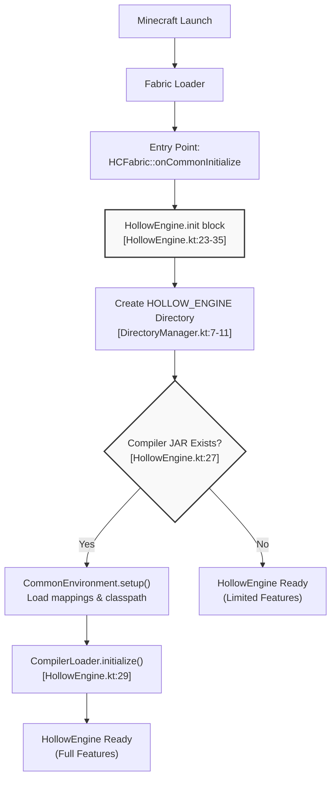
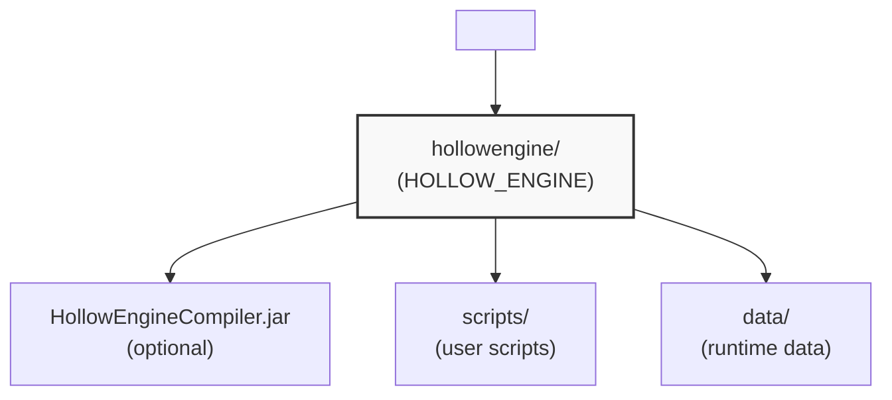
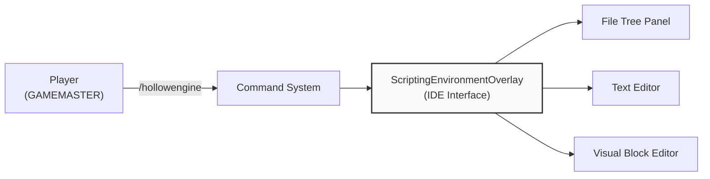
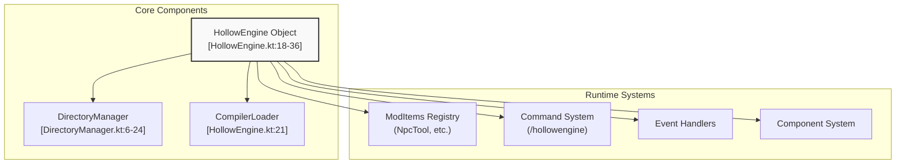
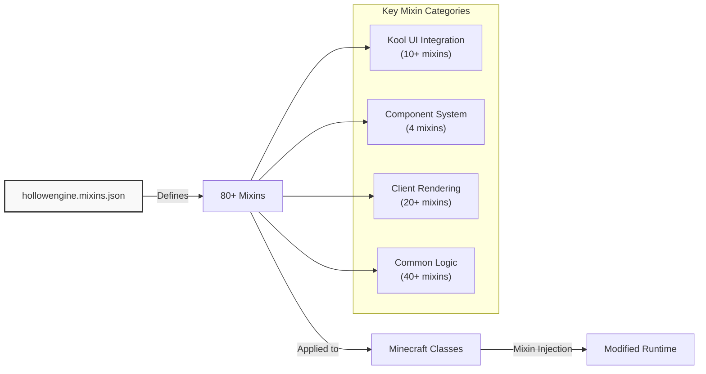

# Getting Started

<details>
<summary>Relevant source files</summary>

The following files were used as context for generating this wiki page:

- [build.gradle.kts](build.gradle.kts)
- [gradle.properties](gradle.properties)
- [src/main/java/ru/hollowhorizon/hollowengine/HollowEngine.kt](src/main/java/ru/hollowhorizon/hollowengine/HollowEngine.kt)
- [src/main/java/ru/hollowhorizon/hollowengine/client/gui/scripting/FileNode.kt](src/main/java/ru/hollowhorizon/hollowengine/client/gui/scripting/FileNode.kt)
- [src/main/java/ru/hollowhorizon/hollowengine/client/gui/scripting/files/FilesBar.kt](src/main/java/ru/hollowhorizon/hollowengine/client/gui/scripting/files/FilesBar.kt)
- [src/main/java/ru/hollowhorizon/hollowengine/client/gui/scripting/panels/DockPanel.kt](src/main/java/ru/hollowhorizon/hollowengine/client/gui/scripting/panels/DockPanel.kt)
- [src/main/java/ru/hollowhorizon/hollowengine/client/gui/scripting/panels/FileTreePanel.kt](src/main/java/ru/hollowhorizon/hollowengine/client/gui/scripting/panels/FileTreePanel.kt)
- [src/main/java/ru/hollowhorizon/hollowengine/client/gui/scripting/tools/ToolWindow.kt](src/main/java/ru/hollowhorizon/hollowengine/client/gui/scripting/tools/ToolWindow.kt)
- [src/main/java/ru/hollowhorizon/hollowengine/client/keys/HollowEngineKeybinds.kt](src/main/java/ru/hollowhorizon/hollowengine/client/keys/HollowEngineKeybinds.kt)
- [src/main/resources/hollowengine.mixins.json](src/main/resources/hollowengine.mixins.json)

</details>


This page guides you through installing HollowEngine, understanding its initial setup process, and taking your first steps with the framework. For detailed information about the architecture after installation, see [Core Architecture](#1.2). For building the mod from source, see [Building the Mod](#9.1).

---

## Prerequisites

Before installing HollowEngine, ensure you have the following:

| Requirement | Details |
|------------|---------|
| **Minecraft Version** | 1.20.1 (as configured in build system) |
| **Mod Loader** | Fabric (Architectury Loom-based) |
| **Java Version** | Java 17 or higher (JVM arguments configured for 6GB heap) |
| **Permissions** | GAMEMASTER level required for scripting features |

**Sources:** [gradle.properties:1-22](), [build.gradle.kts:1-9]()

---

## Installation Process

### Basic Installation

1. **Download the Mod**: Obtain the HollowEngine JAR file (current version: `2.0.0-Beta12`)
2. **Place in Mods Folder**: Copy the JAR to your Minecraft `mods/` directory
3. **Launch Minecraft**: Start the game with Fabric Loader

### Optional: Compiler Setup

For full scripting capabilities (dynamic compilation, code completion), you need the compiler component:

1. **Locate Compiler JAR**: Obtain `HollowEngineCompiler.jar`
2. **Place in HollowEngine Directory**: Copy to `hollowengine/HollowEngineCompiler.jar` (see Directory Structure below)

Without the compiler JAR, compilation-dependent features will be disabled but the mod will still function.

**Sources:** [HollowEngine.kt:21-30](), [gradle.properties:1-6]()

---

## Initialization Sequence

When Minecraft launches with HollowEngine, the following initialization sequence occurs:



**Initialization Flow Explanation**

1. **Entry Point**: Fabric Loader invokes `HCFabric::onCommonInitialize`
2. **HollowEngine Object**: Static initialization block executes
3. **Directory Creation**: `DirectoryManager` ensures the `HOLLOW_ENGINE` directory exists
4. **Compiler Detection**: Checks for `HollowEngineCompiler.jar`
5. **Conditional Setup**: If compiler exists, initializes deobfuscation mappings and classpath
6. **Ready State**: Mod is operational (with or without compilation features)

**Sources:** [HollowEngine.kt:1-36](), [DirectoryManager.kt:7-11](), [build.gradle.kts:22-25]()

---

## Directory Structure

On first launch, HollowEngine creates its working directory structure:



### Directory Details

| Path | Purpose | Created By |
|------|---------|------------|
| `hollowengine/` | Root directory for all HollowEngine files | [DirectoryManager.kt:7-11]() |
| `hollowengine/HollowEngineCompiler.jar` | Dynamic compilation engine (optional) | User-placed |
| `hollowengine/scripts/` | User-created Kotlin scripts (.kts files) | On-demand |
| `hollowengine/data/` | Runtime data, NPC configurations, etc. | On-demand |

### Path Resolution

The `DirectoryManager` provides utilities for working with paths relative to the `HOLLOW_ENGINE` directory:

- **`Path.toReadablePath()`**: Converts absolute path to relative path string
- **`String.fromReadablePath()`**: Converts relative path string to absolute File

**Sources:** [DirectoryManager.kt:1-41]()

---

## Verifying Installation

### Checking Logs

After launching, check the game log for the initialization message:

```
[HollowEngine] Initializing Hollow Engine 2.0!
```

This confirms the mod loaded successfully.

### Checking Compiler Status

The log will also indicate compiler status:
- **With Compiler**: Full compilation pipeline initialized
- **Without Compiler**: Compilation features skipped

### Testing Commands

In-game, verify access to HollowEngine commands:

```
/hollowengine
```

**Note**: GAMEMASTER permission level (op level 2 or higher) is required to execute most commands.

**Sources:** [HollowEngine.kt:25]()

---

## Accessing the In-Game IDE

HollowEngine provides an integrated development environment accessible from within Minecraft:



### Opening the IDE

The exact command to open the IDE is provided by the command system. Use `/hollowengine` to see available subcommands.

### IDE Features Overview

Once opened, you'll have access to:

| Feature | Description | See Page |
|---------|-------------|----------|
| **File Tree** | Navigate and manage script files | [IDE Interface and Layout](#2.1) |
| **Text Editor** | Edit Kotlin scripts (.kts) with syntax highlighting | [Text Editor Features](#2.2) |
| **Code Completion** | IntelliSense-style code suggestions | [Code Intelligence](#2.3) |
| **Visual Programming** | Drag-and-drop code blocks (.hescr files) | [Visual Programming](#2.4) |
| **Script Execution** | Run scripts directly from the IDE | [Title Bar and Script Control](#2.6) |

**Sources:** Derived from high-level architecture diagrams

---

## Key Components Initialized

During startup, HollowEngine initializes several core components:



### Component Details

- **HollowEngine Object**: Main singleton containing initialization logic
- **DirectoryManager**: Manages the `HOLLOW_ENGINE` directory and path utilities
- **CompilerLoader**: Loads and initializes the dynamic Kotlin compiler (if available)
- **ModItems Registry**: Registers custom items (NpcTool, Camera, etc.)
- **Command System**: Registers `/hollowengine` commands
- **Event Handlers**: Registers event listeners for game integration
- **Component System**: Initializes the component-based extension framework

**Sources:** [HollowEngine.kt:18-36](), [DirectoryManager.kt:6-24](), high-level architecture diagrams

---

## Dependencies and Libraries

HollowEngine bundles several key libraries:

| Library | Version | Purpose |
|---------|---------|---------|
| **Kotlin Standard Library** | 2.3.0-RC2 | Core language runtime |
| **kotlinx-coroutines** | 1.9.0 | Async/await scripting support |
| **kotlinx-serialization** | 1.8.0 | Data serialization |
| **Kool Graphics** | 0.19.0-SNAPSHOT | UI framework for IDE |
| **tomlkt** | 0.5.0 | Configuration parsing |

These are automatically included and do not require separate installation.

**Sources:** [build.gradle.kts:44-73](), [gradle.properties:8-12]()

---

## Mixin System Integration

HollowEngine uses Fabric's Mixin system to inject functionality into Minecraft:



### Mixin Configuration

The mixin configuration is located at [hollowengine.mixins.json:1-80](). It defines:
- **42 common mixins**: Applied on both client and server
- **30 client mixins**: Applied only on client side
- **0 server mixins**: No server-only mixins

**Key Mixin Groups:**
- **Kool UI**: Integrates the Kool graphics framework for the IDE (`kool.` prefix)
- **Component System**: Enables component attachment to entities/levels (`components.` prefix)
- **Client Rendering**: Custom rendering for models, particles, cameras (`client.` prefix)

**Sources:** [hollowengine.mixins.json:1-80]()

---

## Permission Requirements

Most HollowEngine features require elevated permissions:

| Permission Level | Capabilities |
|-----------------|--------------|
| **GAMEMASTER (Level 2)** | Access IDE, execute scripts, manage NPCs, use commands |
| **Regular Player (Level 0)** | Limited - can interact with NPCs, trigger scripted events |

### Granting Permissions

On a server or in single-player with cheats:
```
/op <player_name>
```

On a server, operators automatically have GAMEMASTER level.

**Sources:** Derived from client-server communication diagram (Diagram 5)

---

## Troubleshooting Common Issues

### IDE Won't Open
- **Cause**: Insufficient permissions
- **Solution**: Ensure you have GAMEMASTER (op) level

### Scripts Won't Compile
- **Cause**: Missing `HollowEngineCompiler.jar`
- **Solution**: Place compiler JAR in `hollowengine/` directory and restart

### Directory Not Found Errors
- **Cause**: Incorrect path resolution
- **Solution**: Use `DirectoryManager` utilities for path handling

### Mixin Conflicts
- **Cause**: Incompatible mods modifying same classes
- **Solution**: Check logs for mixin conflicts, remove conflicting mods

**Sources:** [HollowEngine.kt:27-30](), [DirectoryManager.kt:27-39]()

---

## Next Steps

Now that HollowEngine is installed and running, you can:

1. **Explore the IDE**: Learn about the interface layout and panels → [IDE Interface and Layout](#2.1)
2. **Write Your First Script**: Create a simple Kotlin script → [Script Types and Organization](#3.1)
3. **Create an NPC**: Use the NPC system to spawn interactive characters → [NPC Entities and Lifecycle](#5.1)
4. **Try Visual Programming**: Use the code blocks editor for no-code scripting → [Visual Programming](#2.4)

For a comprehensive understanding of the system architecture, see [Core Architecture](#1.2).

**Sources:** Derived from system overview and table of contents