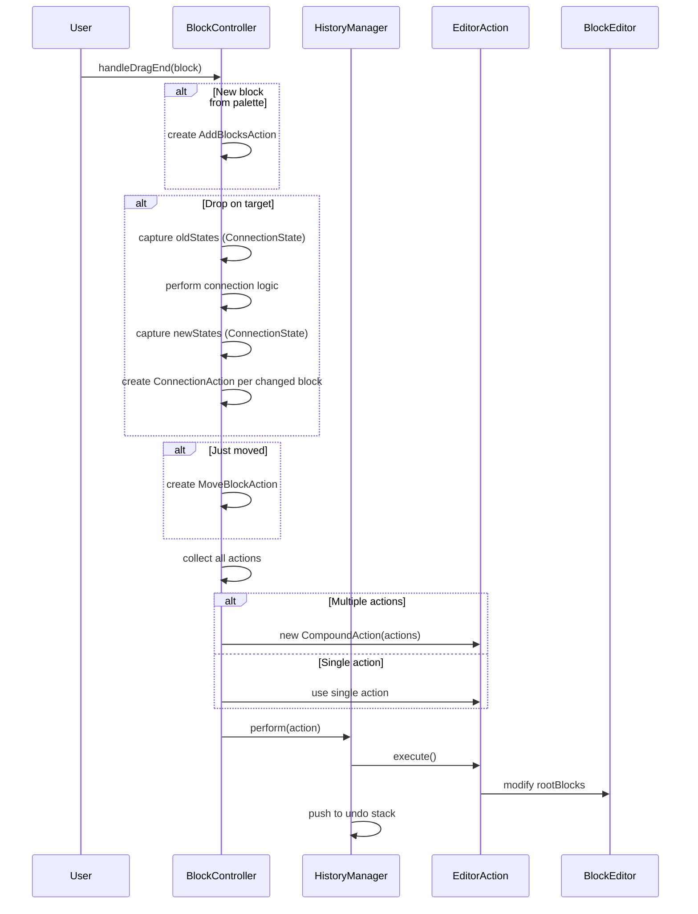
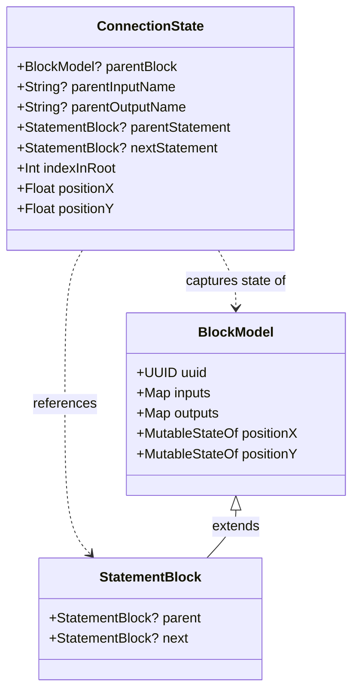
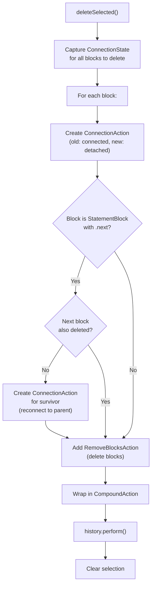
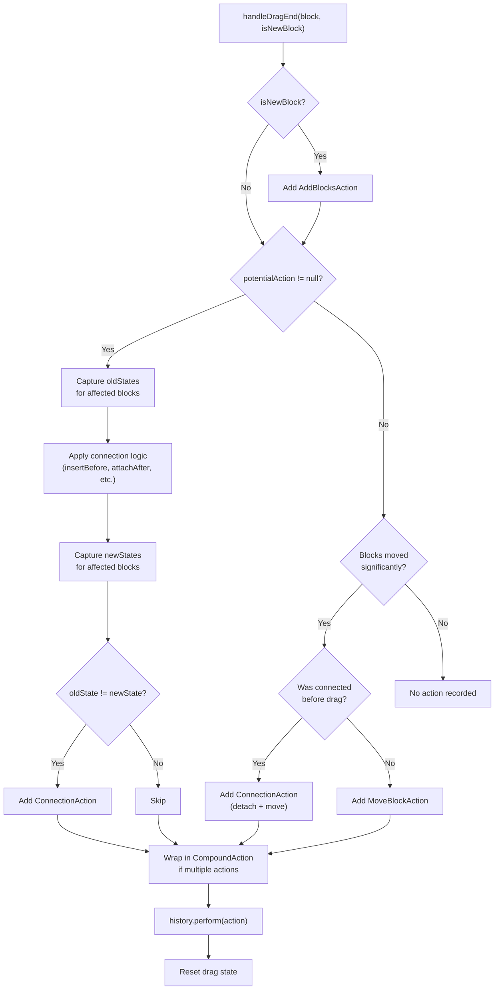

# History and Undo System

<details>
<summary>Relevant source files</summary>

The following files were used as context for generating this wiki page:

- [src/main/java/ru/hollowhorizon/hollowengine/client/gui/codeblocks/BlockController.kt](src/main/java/ru/hollowhorizon/hollowengine/client/gui/codeblocks/BlockController.kt)
- [src/main/java/ru/hollowhorizon/hollowengine/client/gui/codeblocks/BlocksPanel.kt](src/main/java/ru/hollowhorizon/hollowengine/client/gui/codeblocks/BlocksPanel.kt)
- [src/main/java/ru/hollowhorizon/hollowengine/client/gui/codeblocks/DragState.kt](src/main/java/ru/hollowhorizon/hollowengine/client/gui/codeblocks/DragState.kt)
- [src/main/java/ru/hollowhorizon/hollowengine/client/gui/kool/KeyHandlerNode.kt](src/main/java/ru/hollowhorizon/hollowengine/client/gui/kool/KeyHandlerNode.kt)
- [src/main/java/ru/hollowhorizon/hollowengine/client/gui/scripting/files/codeblocks/CodeBlocksFile.kt](src/main/java/ru/hollowhorizon/hollowengine/client/gui/scripting/files/codeblocks/CodeBlocksFile.kt)
- [src/main/java/ru/hollowhorizon/hollowengine/client/kool/KoolHooks.java](src/main/java/ru/hollowhorizon/hollowengine/client/kool/KoolHooks.java)
- [src/main/java/ru/hollowhorizon/hollowengine/common/codeblocks/BlockRepository.kt](src/main/java/ru/hollowhorizon/hollowengine/common/codeblocks/BlockRepository.kt)
- [src/main/java/ru/hollowhorizon/hollowengine/common/codeblocks/model/BlockModel.kt](src/main/java/ru/hollowhorizon/hollowengine/common/codeblocks/model/BlockModel.kt)

</details>


## Purpose and Scope

The History and Undo System provides comprehensive undo/redo functionality for the Visual Block Editor. It tracks all modifications to the block graph including block additions, deletions, movements, and connection changes. The system captures fine-grained state information to enable precise restoration of previous editor states.

For information about the block editor UI itself, see [Block Editor Overview](#5.1). For details about block connections and slots, see [Connection System](#5.5). For file persistence, see [Serialization and Persistence](#5.7).

**Sources**: [src/main/java/ru/hollowhorizon/hollowengine/client/gui/codeblocks/BlockController.kt:1-707]()

---

## System Architecture

The undo/redo system is built around three core components:

| Component | Responsibility | Key Methods |
|-----------|---------------|-------------|
| `HistoryManager` | Maintains undo/redo stacks and executes actions | `perform()`, `undo()`, `redo()` |
| `EditorAction` | Abstract action interface representing reversible operations | `execute()`, `undo()` |
| `ConnectionState` | Immutable snapshot of a block's connection state | N/A (data class) |

The `HistoryManager` is instantiated as a property of `BlockController`:

```kotlin
class BlockController(val editor: BlockEditor) {
    val history = HistoryManager(editor)
    // ...
}
```

**Sources**: [src/main/java/ru/hollowhorizon/hollowengine/client/gui/codeblocks/BlockController.kt:13-15]()

---

### History Manager Integration

```mermaid
graph TB
    UserAction["User Action<br/>(drag, delete, paste)"]
    BlockController["BlockController"]
    HistoryManager["HistoryManager"]
    EditorActionStack["Action Stack<br/>undo/redo"]
    
    UserAction -->|triggers| BlockController
    BlockController -->|creates| EditorAction["EditorAction<br/>(specific type)"]
    EditorAction -->|passed to| HistoryManager
    HistoryManager -->|perform()| EditorActionStack
    HistoryManager -->|modifies| BlockEditor["BlockEditor.rootBlocks"]
    
    KeyboardShortcut["Keyboard Shortcut<br/>(Ctrl+Z / Ctrl+Y)"] -->|triggers| HistoryManager
    HistoryManager -->|undo() / redo()| EditorActionStack
    EditorActionStack -->|restores state via| EditorAction
```

**Diagram**: Integration of HistoryManager with BlockController and user actions

**Sources**: [src/main/java/ru/hollowhorizon/hollowengine/client/gui/codeblocks/BlockController.kt:13-329]()

---

## Action Types

The system implements several concrete action types to handle different modification scenarios:

### Core Action Types

| Action Type | Purpose | State Captured |
|-------------|---------|----------------|
| `AddBlocksAction` | Records block creation/insertion | List of added blocks |
| `RemoveBlocksAction` | Records block deletion | List of removed blocks with connections |
| `ConnectionAction` | Records connection changes | Old and new `ConnectionState` |
| `MoveBlockAction` | Records position changes | Start and end positions per block |
| `CompoundAction` | Groups multiple actions into atomic operation | List of sub-actions |

**Sources**: [src/main/java/ru/hollowhorizon/hollowengine/client/gui/codeblocks/BlockController.kt:218-329]()

---

### Action Creation Flow



**Diagram**: Sequence of action creation and execution during drag-and-drop

**Sources**: [src/main/java/ru/hollowhorizon/hollowengine/client/gui/codeblocks/BlockController.kt:218-329]()

---

## ConnectionState Capture

The `ConnectionState` data class captures a complete snapshot of a block's connectivity and position at a specific moment. This enables precise restoration of relationships when undoing changes.

### ConnectionState Structure



**Diagram**: ConnectionState structure and relationships

The `captureConnectionState()` method creates immutable snapshots:

```kotlin
fun captureConnectionState(block: BlockModel): ConnectionState {
    return ConnectionState(
        parentBlock = block.parentBlock,
        parentInputName = block.parentInputName,
        parentOutputName = block.parentOutputName,
        parentStatement = (block as? StatementBlock)?.parent,
        nextStatement = (block as? StatementBlock)?.next,
        indexInRoot = editor.rootBlocks.indexOf(block),
        positionX = block.positionX.value,
        positionY = block.positionY.value
    )
}
```

**Sources**: [src/main/java/ru/hollowhorizon/hollowengine/client/gui/codeblocks/BlockController.kt:532-543]()

---

### State Capture Locations

Connection states are captured at strategic points during operations:

| Operation | Capture Point | Line Reference |
|-----------|---------------|----------------|
| Drag start | Before detaching block | Line 164 |
| Drag end (with action) | Before applying connection | Line 264 |
| Drag end (with action) | After applying connection | Line 277 |
| Delete operation | Before deletion | Line 492 |
| Delete operation | For survivors of deleted blocks | Line 500 |

**Sources**: [src/main/java/ru/hollowhorizon/hollowengine/client/gui/codeblocks/BlockController.kt:150-527]()

---

## Undo/Redo Workflow

### Action Performance

When an action is performed through `HistoryManager.perform()`:

1. The action's `execute()` method runs, modifying the editor state
2. The action is pushed onto the undo stack
3. The redo stack is cleared (invalidating forward history)
4. The editor is notified of changes

**Sources**: [src/main/java/ru/hollowhorizon/hollowengine/client/gui/codeblocks/BlockController.kt:317-323]()

---

### Compound Actions

Complex operations that involve multiple state changes are wrapped in `CompoundAction` to ensure atomicity:

```kotlin
if (actionsToPerform.isNotEmpty()) {
    if (actionsToPerform.size == 1) {
        history.perform(actionsToPerform.first())
    } else {
        history.perform(CompoundAction(actionsToPerform))
    }
}
```

This ensures that operations like "delete block and reconnect survivors" are treated as a single undoable action.

**Sources**: [src/main/java/ru/hollowhorizon/hollowengine/client/gui/codeblocks/BlockController.kt:317-323]()

---

### Example: Delete Operation

The delete operation demonstrates comprehensive state capture:



**Diagram**: State capture flow during block deletion

The code captures states for both deleted blocks and their "survivors" (blocks that remain connected):

```kotlin
blocksToDelete.forEach { block ->
    val oldState = captureConnectionState(block)
    val detachedState = ConnectionState(null, null, null, null, null, -1, 
                                       block.positionX.value, block.positionY.value)
    actions.add(ConnectionAction(editor, block, oldState, detachedState))
    
    if (block is StatementBlock) {
        val next = block.next
        if (next != null && next !in blocksToDelete) {
            val survivor = next
            val survivorOldState = captureConnectionState(survivor)
            // ... calculate new connection for survivor ...
            actions.add(ConnectionAction(editor, survivor, survivorOldState, survivorNewState))
        }
    }
}
```

**Sources**: [src/main/java/ru/hollowhorizon/hollowengine/client/gui/codeblocks/BlockController.kt:485-527]()

---

## Integration with Editor Operations

### Clipboard Operations

Copy, cut, and paste operations integrate with the history system:

| Operation | History Action |
|-----------|---------------|
| Copy | None (read-only) |
| Cut | `CompoundAction` (same as delete) |
| Paste | `AddBlocksAction` for new blocks |

**Sources**: [src/main/java/ru/hollowhorizon/hollowengine/client/gui/codeblocks/BlockController.kt:447-483]()

---

### Duplication

Block duplication creates new instances and records them:

```kotlin
fun duplicateSelected() {
    if (selectedBlocks.isEmpty()) return
    
    val topLevel = selectedBlocks.filter { !isParentSelected(it) }
    val newBlocks = mutableListOf<BlockModel>()
    val offset = 20f
    
    topLevel.forEach { original ->
        val copy = cloneForDuplication(original)
        copy.positionX.set(copy.positionX.value + offset)
        copy.positionY.set(copy.positionY.value + offset)
        newBlocks.add(copy)
    }
    
    if (newBlocks.isNotEmpty()) {
        clearSelection()
        selectedBlocks.addAll(newBlocks)
        history.perform(AddBlocksAction(editor, newBlocks))
    }
}
```

**Sources**: [src/main/java/ru/hollowhorizon/hollowengine/client/gui/codeblocks/BlockController.kt:567-590]()

---

### Drag-and-Drop State Management

During drag operations, the system maintains temporary state until the operation completes:

| State Variable | Purpose | Reset Point |
|----------------|---------|-------------|
| `dragStartConnectionState` | Initial connections before drag | Line 327 |
| `initialBlockPositions` | Block positions at drag start | Line 159 |
| `potentialAction` | Drop target being evaluated | Line 326 |

These temporary states enable:
- **Partial undo**: If a drag is canceled, no action is recorded
- **State comparison**: Determining if connections actually changed
- **Action optimization**: Avoiding redundant history entries

**Sources**: [src/main/java/ru/hollowhorizon/hollowengine/client/gui/codeblocks/BlockController.kt:31-34](), [src/main/java/ru/hollowhorizon/hollowengine/client/gui/codeblocks/BlockController.kt:150-329]()

---

## Action Decision Logic

The drag-end handler implements sophisticated logic to determine which actions to record:



**Diagram**: Decision tree for action recording during drag-and-drop

**Sources**: [src/main/java/ru/hollowhorizon/hollowengine/client/gui/codeblocks/BlockController.kt:218-329]()

---

## Affected Block Tracking

To ensure complete undo/redo, the system identifies all blocks affected by an operation:

### Connection Change Affected Blocks

When connecting blocks, the system tracks:

1. **The dragged block** itself
2. **The target block** being connected to
3. **Parent container** (if inserting into an input slot)
4. **Previous occupant** (if replacing another block)
5. **Statement chain tail** (if the block is a statement with `.next`)
6. **Blocks captured at drag start** (to detect detachments)

```kotlin
val affectedBlocks = mutableSetOf<BlockModel>()
affectedBlocks.add(block)

when (action) {
    is DropAction.InsertBefore -> {
        affectedBlocks.add(action.target)
        action.target.parentBlock?.let { affectedBlocks.add(it) }
        (action.target as? StatementBlock)?.parent?.let { affectedBlocks.add(it) }
    }
    is DropAction.AttachAfter -> {
        affectedBlocks.add(action.target)
        action.target.next?.let { affectedBlocks.add(it) }
    }
    is DropAction.AttachToInput -> {
        affectedBlocks.add(action.target)
        action.target.inputs[action.inputName]?.let { affectedBlocks.add(it) }
    }
    is DropAction.AttachToOutput -> {
        affectedBlocks.add(action.target)
        action.target.outputs[action.outputName]?.let { affectedBlocks.add(it) }
    }
}
```

**Sources**: [src/main/java/ru/hollowhorizon/hollowengine/client/gui/codeblocks/BlockController.kt:228-263]()

---

## File-Level Integration

The history system is integrated with file saving through the `CodeBlocksFile` class, which manages a `BlockEditor` instance. However, the undo/redo stacks themselves are **not serialized** to disk - they exist only during an editing session.

When a file is loaded, the editor starts with empty undo/redo stacks. This design prevents issues with stale references after file reload.

**Sources**: [src/main/java/ru/hollowhorizon/hollowengine/client/gui/scripting/files/codeblocks/CodeBlocksFile.kt:1-116]()

---

## Summary

The History and Undo System provides:

- **Fine-grained action tracking** with multiple action types
- **Comprehensive state capture** via `ConnectionState` snapshots
- **Atomic compound operations** for complex multi-step changes
- **Affected block analysis** to capture all state changes
- **Clean separation** between temporary drag state and permanent history

This architecture enables reliable undo/redo for all editor operations while maintaining consistency of the block graph structure.