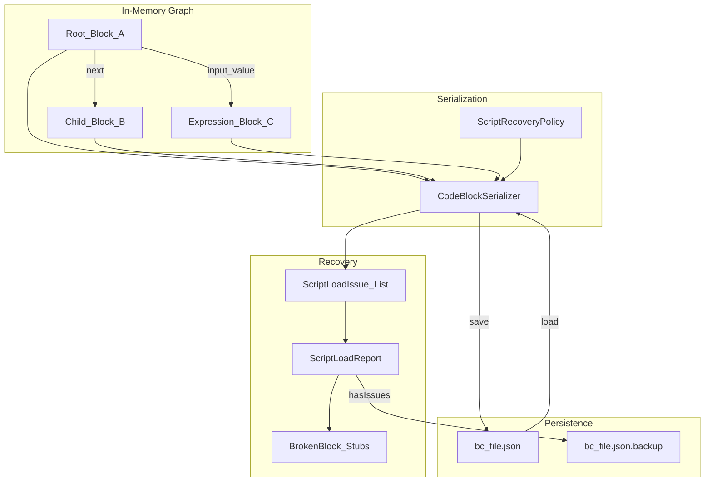
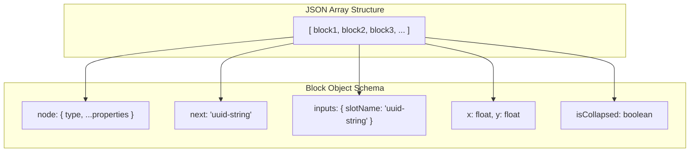
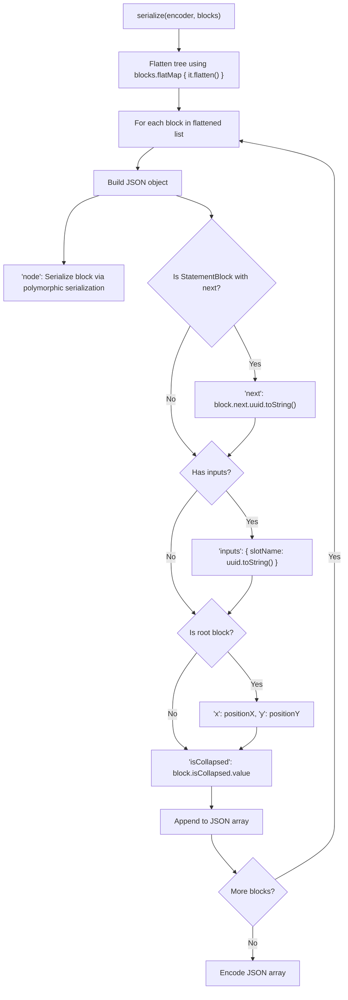
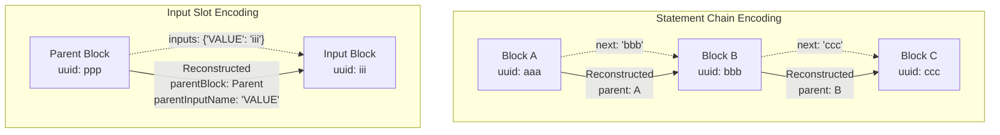
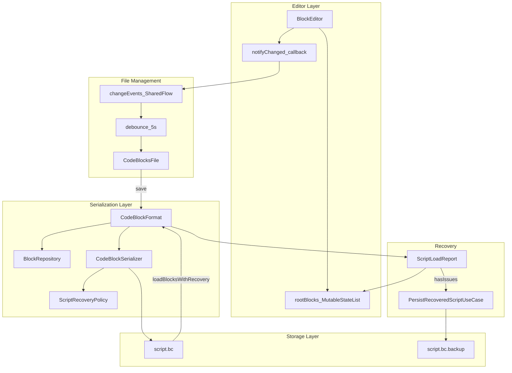
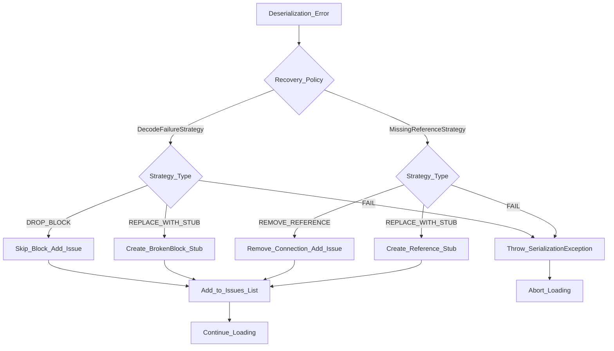
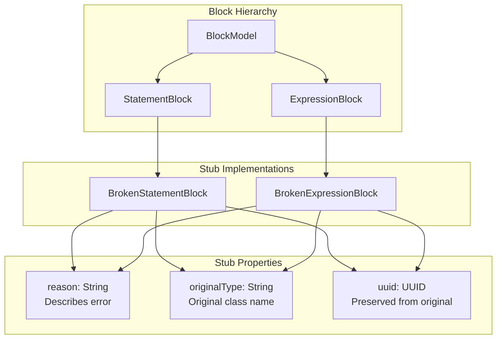
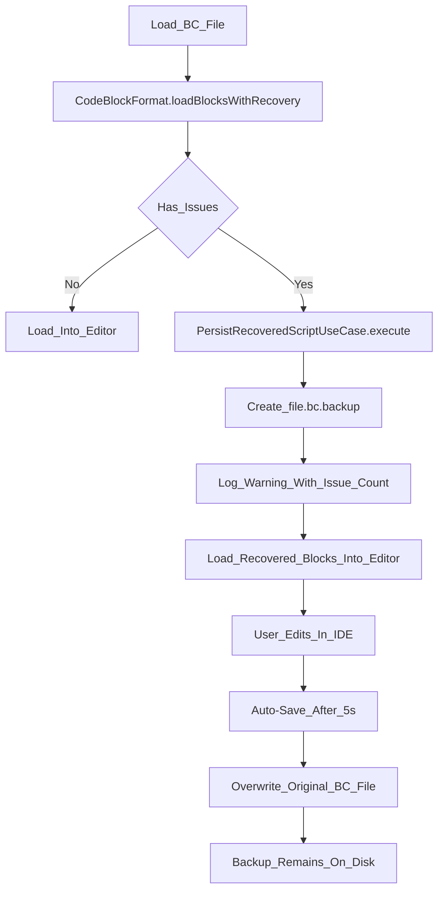
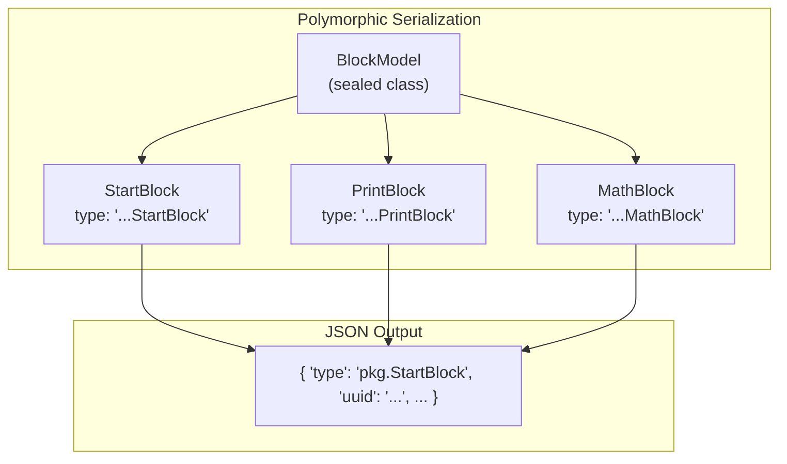

# Serialization and Persistence

<details>
<summary>Relevant source files</summary>

The following files were used as context for generating this wiki page:

- [src/main/java/ru/hollowhorizon/hollowengine/client/gui/codeblocks/BlockController.kt](src/main/java/ru/hollowhorizon/hollowengine/client/gui/codeblocks/BlockController.kt)
- [src/main/java/ru/hollowhorizon/hollowengine/client/gui/codeblocks/BlockEditor.kt](src/main/java/ru/hollowhorizon/hollowengine/client/gui/codeblocks/BlockEditor.kt)
- [src/main/java/ru/hollowhorizon/hollowengine/client/gui/codeblocks/BlocksPanel.kt](src/main/java/ru/hollowhorizon/hollowengine/client/gui/codeblocks/BlocksPanel.kt)
- [src/main/java/ru/hollowhorizon/hollowengine/client/gui/codeblocks/DragState.kt](src/main/java/ru/hollowhorizon/hollowengine/client/gui/codeblocks/DragState.kt)
- [src/main/java/ru/hollowhorizon/hollowengine/client/gui/codeblocks/InputSlotScope.kt](src/main/java/ru/hollowhorizon/hollowengine/client/gui/codeblocks/InputSlotScope.kt)
- [src/main/java/ru/hollowhorizon/hollowengine/client/gui/codeblocks/PuzzleShapes.kt](src/main/java/ru/hollowhorizon/hollowengine/client/gui/codeblocks/PuzzleShapes.kt)
- [src/main/java/ru/hollowhorizon/hollowengine/client/gui/codeblocks/ScratchBlockBackground.kt](src/main/java/ru/hollowhorizon/hollowengine/client/gui/codeblocks/ScratchBlockBackground.kt)
- [src/main/java/ru/hollowhorizon/hollowengine/client/gui/codeblocks/SlotBackground.kt](src/main/java/ru/hollowhorizon/hollowengine/client/gui/codeblocks/SlotBackground.kt)
- [src/main/java/ru/hollowhorizon/hollowengine/client/gui/kool/KeyHandlerNode.kt](src/main/java/ru/hollowhorizon/hollowengine/client/gui/kool/KeyHandlerNode.kt)
- [src/main/java/ru/hollowhorizon/hollowengine/client/gui/scripting/files/codeblocks/CodeBlocksFile.kt](src/main/java/ru/hollowhorizon/hollowengine/client/gui/scripting/files/codeblocks/CodeBlocksFile.kt)
- [src/main/java/ru/hollowhorizon/hollowengine/client/kool/KoolHooks.java](src/main/java/ru/hollowhorizon/hollowengine/client/kool/KoolHooks.java)
- [src/main/java/ru/hollowhorizon/hollowengine/common/codeblocks/BlockRepository.kt](src/main/java/ru/hollowhorizon/hollowengine/common/codeblocks/BlockRepository.kt)
- [src/main/java/ru/hollowhorizon/hollowengine/common/codeblocks/BlocksScope.kt](src/main/java/ru/hollowhorizon/hollowengine/common/codeblocks/BlocksScope.kt)
- [src/main/java/ru/hollowhorizon/hollowengine/common/codeblocks/CodeBlock.kt](src/main/java/ru/hollowhorizon/hollowengine/common/codeblocks/CodeBlock.kt)
- [src/main/java/ru/hollowhorizon/hollowengine/common/codeblocks/model/BlockModel.kt](src/main/java/ru/hollowhorizon/hollowengine/common/codeblocks/model/BlockModel.kt)
- [src/main/java/ru/hollowhorizon/hollowengine/common/codeblocks/serialization/CodeBlockFormat.kt](src/main/java/ru/hollowhorizon/hollowengine/common/codeblocks/serialization/CodeBlockFormat.kt)
- [src/main/java/ru/hollowhorizon/hollowengine/common/codeblocks/serialization/CodeBlockSerializer.kt](src/main/java/ru/hollowhorizon/hollowengine/common/codeblocks/serialization/CodeBlockSerializer.kt)
- [src/main/resources/assets/hollowengine/textures/gui/icons/global.svg](src/main/resources/assets/hollowengine/textures/gui/icons/global.svg)
- [src/main/resources/assets/hollowengine/textures/gui/icons/maximize.svg](src/main/resources/assets/hollowengine/textures/gui/icons/maximize.svg)

</details>


## Purpose and Scope

The Serialization and Persistence system is responsible for converting visual block graphs into a persistent JSON format, reconstructing them from disk, and handling corrupted or outdated data through recovery mechanisms. This enables block-based scripts to be saved, loaded, versioned, and recovered from errors.

This document covers:
- The serialization format and data model
- The `CodeBlockSerializer` implementation with recovery support
- Connection representation using UUIDs
- The deserialization and reconstruction process
- Recovery policies and error handling strategies
- Backup creation and corrupted script recovery
- Integration with the block editor and file system

For information about block execution at runtime, see [7.4](#7.4). For the visual block editor UI, see [5.1](#5.1). For block data structures, see [6.1](#6.1).

---

## Overview

The block serialization system converts a tree of `BlockModel` objects into a flat JSON array where connections are represented as UUID references. The system includes robust recovery mechanisms to handle missing blocks, broken references, and decode failures.

**Diagram: Serialization and Recovery Pipeline**



**Sources:** [src/main/java/ru/hollowhorizon/hollowengine/common/codeblocks/serialization/CodeBlockSerializer.kt:1-334](), [src/main/java/ru/hollowhorizon/hollowengine/common/codeblocks/serialization/CodeBlockFormat.kt:1-82]()

---

## Data Model

Each block in the graph stores several types of data that must be preserved during serialization:

| Data Type | Storage Location | Serialized | Description |
|-----------|------------------|------------|-------------|
| Block Type & Properties | `BlockModel` instance | ✓ | Polymorphic serialization via kotlinx.serialization |
| Position | `positionX`, `positionY` | ✓ (root only) | World coordinates for root blocks |
| Next Statement | `StatementBlock.next` | ✓ (as UUID) | Sequential statement connection |
| Parent Statement | `StatementBlock.parent` | Implicit | Reconstructed from `next` |
| Input Slots | `BlockModel.inputs` map | ✓ (as UUID map) | Named input connections |
| Parent Block | `parentBlock`, `parentInputName` | Implicit | Reconstructed from `inputs` |
| Collapse State | `isCollapsed` | ✓ | UI state for container blocks |
| UUID | `uuid` | Implicit | Used as identifier in references |

The serializer distinguishes between **explicit data** (stored directly) and **implicit relationships** (reconstructed during deserialization by reversing explicit connections).

**Sources:** [src/main/java/ru/hollowhorizon/hollowengine/common/codeblocks/serialization/CodeBlockSerializer.kt:20-51](), [src/main/java/ru/hollowhorizon/hollowengine/common/codeblocks/model/BlockModel.kt]()

---

## JSON Format Structure

The serialized format is a JSON array where each element represents a single block. The structure uses flat UUID references to encode the graph topology.



### Example JSON Structure

```json
[
  {
    "node": {
      "type": "ru.hollowhorizon.hollowengine.common.codeblocks.blocks.StartBlock",
      "uuid": "123e4567-e89b-12d3-a456-426614174000"
    },
    "next": "123e4567-e89b-12d3-a456-426614174001",
    "x": 100.0,
    "y": 50.0,
    "isCollapsed": false
  },
  {
    "node": {
      "type": "ru.hollowhorizon.hollowengine.common.codeblocks.blocks.PrintBlock",
      "uuid": "123e4567-e89b-12d3-a456-426614174001"
    },
    "inputs": {
      "TEXT": "123e4567-e89b-12d3-a456-426614174002"
    },
    "isCollapsed": false
  },
  {
    "node": {
      "type": "ru.hollowhorizon.hollowengine.common.codeblocks.blocks.StringValueBlock",
      "uuid": "123e4567-e89b-12d3-a456-426614174002",
      "value": "Hello, World!"
    },
    "isCollapsed": false
  }
]
```

**Key Features:**
- **Flat Structure**: All blocks at the same level regardless of hierarchy
- **UUID References**: Connections stored as UUID strings, not nested objects
- **Conditional Fields**: `x`, `y` only present for root blocks; `next` only for statements with successors
- **Polymorphic Node**: The `node` field uses kotlinx.serialization's polymorphic serialization to store the full block type and properties

**Sources:** [src/main/java/ru/hollowhorizon/hollowengine/common/codeblocks/serialization/CodeBlockSerializer.kt:26-51]()

---

## Serialization Process

The `CodeBlockSerializer` implements `KSerializer<List<BlockModel>>` and converts a list of root blocks into the JSON format.



### Implementation Details

The serialization logic at [src/main/java/ru/hollowhorizon/hollowengine/common/codeblocks/serialization/CodeBlockSerializer.kt:20-51]():

1. **Flatten the graph**: `value.flatMap { it.flatten() }` traverses all blocks using depth-first traversal
2. **Encode each block**: Create a `JsonObject` for each block with:
   - `node`: Polymorphic serialization of the block instance
   - `next`: UUID reference if the block has a next statement
   - `inputs`: Map of input slot names to UUID references
   - `x`, `y`: Position coordinates if `block.isRoot` is true
   - `isCollapsed`: Current collapse state
3. **Build array**: All block objects are collected into a `JsonArray`
4. **Encode**: The array is encoded via the `JsonEncoder`

**Root Detection:** A block is considered a root if `block.isRoot` returns true, which checks whether it has no parent connections and is in the editor's root list.

**Sources:** [src/main/java/ru/hollowhorizon/hollowengine/common/codeblocks/serialization/CodeBlockSerializer.kt:20-51]()

---

## Deserialization Process

Deserialization is a two-phase process: first, all blocks are instantiated, then connections are rebuilt using the UUID references.

```mermaid
flowchart TD
    Start["deserialize(decoder)"] --> DecodeArray["Decode JsonArray"]
    DecodeArray --> Phase1["Phase 1: Instantiate Blocks"]
    
    Phase1 --> IterateJson["For each JsonObject in array"]
    IterateJson --> ExtractNode["Extract 'node' field"]
    ExtractNode --> Deserialize["Deserialize BlockModel via polymorphic deserialization"]
    Deserialize --> ResolveColor["block.color = blockModule.findColorFor(block)"]
    ResolveColor --> StoreMap["Store in nodeMap[uuid] and jsonMap[uuid]"]
    StoreMap --> MoreJson{"More blocks?"}
    MoreJson -->|Yes| IterateJson
    MoreJson -->|No| Phase2
    
    Phase2["Phase 2: Rebuild Connections"]
    Phase2 --> IterateMap["For each (uuid, jsonObject) in jsonMap"]
    IterateMap --> CheckNext{"Has 'next' field?"}
    CheckNext -->|Yes| ConnectNext["Resolve UUID and set currentBlock.next = nextBlock; nextBlock.parent = currentBlock"]
    CheckNext -->|No| CheckInputs
    ConnectNext --> CheckInputs
    
    CheckInputs{"Has 'inputs' field?"}
    CheckInputs -->|Yes| ConnectInputs["For each (slotName, uuid): Resolve UUID and set currentBlock.inputs[slotName] = inputBlock; inputBlock.parentBlock = currentBlock; inputBlock.parentInputName = slotName"]
    CheckInputs -->|No| CheckPosition
    ConnectInputs --> CheckPosition
    
    CheckPosition{"Has 'x', 'y' fields?"}
    CheckPosition -->|Yes| SetPosition["block.positionX.set(x); block.positionY.set(y)"]
    CheckPosition -->|No| CheckCollapsed
    SetPosition --> CheckCollapsed
    
    CheckCollapsed{"Has 'isCollapsed' field?"}
    CheckCollapsed -->|Yes| SetCollapsed["block.isCollapsed.set(isCollapsed)"]
    CheckCollapsed -->|No| NextBlock
    SetCollapsed --> NextBlock
    
    NextBlock{"More blocks?"}
    NextBlock -->|Yes| IterateMap
    NextBlock -->|No| FilterRoots
    
    FilterRoots["Return nodeMap.values.filter { it.isRoot }"]
```



### Phase 1: Block Instantiation

The first pass at [src/main/java/ru/hollowhorizon/hollowengine/common/codeblocks/serialization/CodeBlockSerializer.kt:63-79]() creates all block instances:

1. Decode the `JsonArray`
2. For each `JsonObject` in the array:
   - Extract the `node` field
   - Deserialize it polymorphically to a `BlockModel` subclass
   - Resolve the block's color from the `BlockModule`
   - Store in `nodeMap[uuid] -> block` and `jsonMap[uuid] -> jsonObject`

At this stage, blocks exist but have no connections.

**Error Handling:** If deserialization fails, a `SerializationException` is thrown with the block index and error details.

### Phase 2: Connection Reconstruction

The second pass at [src/main/java/ru/hollowhorizon/hollowengine/common/codeblocks/serialization/CodeBlockSerializer.kt:81-117]() rebuilds the graph:

1. For each UUID and its `jsonObject`:
   - **Next connections**: If `next` field exists, resolve the UUID and set bidirectional `next`/`parent` links
   - **Input connections**: For each entry in `inputs` object, resolve UUID and set `inputs[slotName]`, `parentBlock`, and `parentInputName`
   - **Position**: If `x` and `y` exist, set `positionX` and `positionY` state values
   - **Collapse state**: If `isCollapsed` exists, set the state value

2. Return only blocks where `block.isRoot` is true (no parent connections)

**UUID Resolution:** Each UUID reference is looked up in `nodeMap`. If missing, a `SerializationException` is thrown indicating the broken reference.

**Sources:** [src/main/java/ru/hollowhorizon/hollowengine/common/codeblocks/serialization/CodeBlockSerializer.kt:53-120]()

---

## Connection Encoding Scheme

The serialization system uses an asymmetric encoding where forward references are explicit and backward references are implicit.



| Relationship Type | Stored In | Reconstructed As | Direction |
|-------------------|-----------|------------------|-----------|
| Statement sequence | `next` field (UUID) | `parent` field (reference) | Forward |
| Input slot attachment | `inputs[name]` (UUID) | `parentBlock`, `parentInputName` (references) | Forward |

This encoding ensures that each relationship is stored once, and the reverse pointers are computed during deserialization. This prevents data duplication and inconsistency.

**Sources:** [src/main/java/ru/hollowhorizon/hollowengine/common/codeblocks/serialization/CodeBlockSerializer.kt:81-106]()

---

## Integration with Block Editor

The `CodeBlockSerializer` is used by the block editor through the `CodeBlockFormat` wrapper, which provides file I/O integration with recovery support.

**Diagram: Editor Integration and Auto-Save**



### CodeBlockFormat Configuration

The `CodeBlockFormat` class at [src/main/java/ru/hollowhorizon/hollowengine/common/codeblocks/serialization/CodeBlockFormat.kt:28-31]() provides:

- **JSON Configuration**: Pretty printing, explicit nulls disabled, ignore unknown keys
- **Polymorphic Module**: Automatic registration of all blocks from `BlockProvider`
- **Recovery Policy**: Configurable policy (default: lenient for user files)
- **Display Name Resolution**: Applies localized names via `BlockProvider`

### File Extension and Format

- **Extension**: `.bc` (Block Code)
- **Encoding**: UTF-8
- **Format**: JSON with 2-space indentation
- **Location**: `hollowengine/scripts/` directory

### Editor Integration Workflow

1. **Initial Load**:
   - `CodeBlocksFile` constructor receives file path and bytes
   - Calls `format.loadBlocksWithRecovery()` with lenient policy
   - Checks `report.hasIssues` and creates backup if needed
   - Applies display names via `repository.applyDisplayNames()`
   - Populates `editor.rootBlocks` with loaded blocks

2. **Change Detection**:
   - Editor calls `notifyChanged()` callback on every modification
   - Callback emits to `changeEvents` SharedFlow
   - Flow debounces for 5 seconds to batch saves

3. **Auto-Save**:
   - After 5s quiet period, executes save on IO dispatcher
   - Serializes `editor.rootBlocks` via `CodeBlockSerializer`
   - Writes JSON string to file

4. **Manual Close**:
   - `close()` method triggers immediate save
   - Cancels auto-save coroutine scope

### Error Handling During Load

The initialization at [src/main/java/ru/hollowhorizon/hollowengine/client/gui/scripting/files/codeblocks/CodeBlocksFile.kt:47-69]() handles:

- **Recoverable Issues**: Creates backup, logs warning, loads recovered blocks
- **Total Failure**: Creates backup, logs error, loads empty editor
- **Empty File**: Starts with empty `rootBlocks`

**Sources:** [src/main/java/ru/hollowhorizon/hollowengine/client/gui/scripting/files/codeblocks/CodeBlocksFile.kt:24-116](), [src/main/java/ru/hollowhorizon/hollowengine/common/codeblocks/serialization/CodeBlockFormat.kt:28-80](), [src/main/java/ru/hollowhorizon/hollowengine/client/gui/codeblocks/BlockEditor.kt:23-28]()

---

## Recovery Policy System

The serialization system uses `ScriptRecoveryPolicy` to define how to handle errors during deserialization. Policies control whether to fail fast or attempt recovery.

**Diagram: Recovery Policy Decision Flow**



### Policy Modes

| Policy Mode | DecodeFailureStrategy | MissingReferenceStrategy | Use Case |
|-------------|----------------------|--------------------------|----------|
| `strict()` | `FAIL` | `FAIL` | Production saves, must be valid |
| `lenient()` | `REPLACE_WITH_STUB` | `REPLACE_WITH_STUB` | User files, attempt recovery |
| Custom | Configurable | Configurable | Specific error handling needs |

### Recovery Actions

When using lenient policies, the serializer takes recovery actions and records them:

| Issue Kind | Recovery Action | Result |
|------------|----------------|--------|
| `DECODE_FAILED` | `DROP_BLOCK` or `REPLACED_WITH_STUB` | Block skipped or replaced with `BrokenStatementBlock` |
| `MISSING_NODE_FIELD` | `DROP_BLOCK` or `REPLACED_WITH_STUB` | Block object skipped or stubbed |
| `MISSING_NEXT_BLOCK` | `REMOVE_REFERENCE` or `REPLACED_WITH_STUB` | Statement chain broken or filled with stub |
| `MISSING_INPUT_BLOCK` | `REMOVE_REFERENCE` or `REPLACED_WITH_STUB` | Input slot left empty or filled with `BrokenExpressionBlock` |
| `INVALID_REFERENCE_FORMAT` | `REMOVED_REFERENCE` | Malformed UUID reference dropped |
| `INVALID_NEXT_BLOCK_TYPE` | `REMOVED_REFERENCE` | Type mismatch in statement chain |

**Sources:** [src/main/java/ru/hollowhorizon/hollowengine/common/codeblocks/serialization/CodeBlockSerializer.kt:18-333](), [src/main/java/ru/hollowhorizon/hollowengine/common/codeblocks/serialization/CodeBlockFormat.kt:28-43]()

---

## Broken Block Stubs

When recovery policies use `REPLACE_WITH_STUB`, the system creates placeholder blocks that preserve the script structure while marking errors.

**Diagram: Stub Block Architecture**



### Stub Block Features

- **Visual Indication**: Stubs render with distinctive error styling in the editor
- **Error Details**: Store the reason for replacement and original type name
- **UUID Preservation**: Maintain the original block's UUID to preserve references
- **Connection Compatibility**: Can connect to other blocks like normal blocks
- **Execution Behavior**: Throw errors or return null when executed

**Sources:** [src/main/java/ru/hollowhorizon/hollowengine/common/codeblocks/serialization/CodeBlockSerializer.kt:103-135](), [src/main/java/ru/hollowhorizon/hollowengine/common/codeblocks/serialization/CodeBlockFormat.kt:62-67]()

---

## Backup and Recovery Workflow

When scripts are loaded with recoverable issues, the system creates backups before overwriting the original file.

**Diagram: Recovery and Backup Process**



### Backup File Naming

- **Format**: `{original-filename}.backup`
- **Location**: Same directory as original file
- **Content**: Exact copy of the corrupted/problematic file before recovery
- **Overwrite**: Replaces previous backup if one exists

### Recovery Report

The `ScriptLoadReport` returned by `loadBlocksWithRecovery()` contains:

| Field | Type | Description |
|-------|------|-------------|
| `blocks` | `List<BlockModel>` | Successfully loaded/recovered blocks |
| `issues` | `List<ScriptLoadIssue>` | List of all problems encountered |
| `hasIssues` | `Boolean` | True if any issues were recorded |

Each `ScriptLoadIssue` contains:

| Field | Description |
|-------|-------------|
| `kind` | Issue type enum (DECODE_FAILED, MISSING_NEXT_BLOCK, etc.) |
| `message` | Human-readable error description |
| `action` | Recovery action taken (DROPPED_BLOCK, REPLACED_WITH_STUB, etc.) |
| `ownerBlockId` | UUID of block where issue occurred |
| `targetBlockId` | UUID of missing/broken reference (if applicable) |

**Sources:** [src/main/java/ru/hollowhorizon/hollowengine/client/gui/scripting/files/codeblocks/CodeBlocksFile.kt:46-79](), [src/main/java/ru/hollowhorizon/hollowengine/common/codeblocks/serialization/CodeBlockFormat.kt:37-43](), [src/main/java/ru/hollowhorizon/hollowengine/common/codeblocks/serialization/CodeBlockSerializer.kt:316-332]()

---

## Error Handling and Logging

The system provides detailed logging and error reporting at multiple levels.

### Error Detection Points

| Error Type | Detection Phase | Strict Mode | Lenient Mode |
|------------|----------------|-------------|--------------|
| Missing node field | Phase 1: Block instantiation | Throw exception | Drop or stub |
| Deserialization failure | Phase 1: Block instantiation | Throw exception | Drop or stub |
| Invalid UUID format | Phase 2: Connection rebuild | Throw exception | Remove reference |
| Missing next reference | Phase 2: Connection rebuild | Throw exception | Remove or stub |
| Missing input reference | Phase 2: Connection rebuild | Throw exception | Remove or stub |
| Invalid block type | Phase 2: Connection rebuild | Throw exception | Remove reference |
| Non-JSON encoder/decoder | Serialization/Deserialization entry | Always throw | Always throw |

### Logging Integration

At [src/main/java/ru/hollowhorizon/hollowengine/client/gui/scripting/files/codeblocks/CodeBlocksFile.kt:56-62](), the IDE logs recovery warnings:

```kotlin
HollowEngine.LOGGER.warn(
    "Recovered codeblocks file {} with {} issue(s). Backup: {}",
    filePath,
    report.issues.size,
    backup?.absolutePath ?: "n/a"
)
```

### Fallback Error Handling

If recovery fails completely, the system falls back to creating a backup without loading:

```kotlin
catch (e: Exception) {
    HollowEngine.LOGGER.error("File $filePath cannot be loaded!", e)
    val backup = file.parentFile.resolve(file.name + ".backup")
    file.copyTo(backup, true)
}
```

**Sources:** [src/main/java/ru/hollowhorizon/hollowengine/client/gui/scripting/files/codeblocks/CodeBlocksFile.kt:46-79](), [src/main/java/ru/hollowhorizon/hollowengine/common/codeblocks/serialization/CodeBlockSerializer.kt:78-314]()

---

## Position Serialization for Root Blocks

Only root blocks (blocks not connected to any parent) store position data. This is determined by the `block.isRoot` check at [src/main/java/ru/hollowhorizon/hollowengine/common/codeblocks/serialization/CodeBlockSerializer.kt:42-45]().

**Root Block Criteria:**
- Not attached to any `parentBlock` (no input slot parent)
- Not attached to any `parent` (no statement chain parent)
- Present in the editor's `rootBlocks` list

**Position Coordinate System:**
- Measured in logical units (independent of zoom level)
- Origin at top-left of the editor canvas
- Stored as floating-point values for sub-pixel precision

**Child Block Positioning:**
- Child blocks are positioned relative to their parents by the rendering system
- No position data is serialized for child blocks
- Position is implicit from the connection structure

**Sources:** [src/main/java/ru/hollowhorizon/hollowengine/common/codeblocks/serialization/CodeBlockSerializer.kt:42-45](), [src/main/java/ru/hollowhorizon/hollowengine/common/codeblocks/Utils.kt]()

---

## Polymorphic Block Serialization

Individual block types are serialized using kotlinx.serialization's polymorphic serialization feature. Each block subclass is registered with a type discriminator.



The `node` field in each serialized block object contains:
- `type`: Fully qualified class name as string discriminator
- Block-specific properties (e.g., `value` for `StringValueBlock`)
- UUID field

The `CodeBlockFormat` configures the JSON serializer with:
- `classDiscriminator = "type"`
- Pretty printing enabled
- Polymorphic module for `BlockModel` subclasses

**Sources:** [src/main/java/ru/hollowhorizon/hollowengine/common/codeblocks/serialization/CodeBlockSerializer.kt:68-73]()

---

## Collapse State Persistence

The `isCollapsed` state is serialized for all blocks at [src/main/java/ru/hollowhorizon/hollowengine/common/codeblocks/serialization/CodeBlockSerializer.kt:46]() and [src/main/java/ru/hollowhorizon/hollowengine/common/codeblocks/serialization/CodeBlockSerializer.kt:114-116]().

**Collapse State:**
- UI-only state controlling whether container block bodies are visible
- Stored as boolean value
- Defaults to `false` (expanded) if not present in JSON
- Applies to all blocks but primarily used by `ContainerBlock` implementations

**Rendering Impact:**
- Collapsed blocks show only their header
- Body content and nested blocks are hidden but remain connected
- Serialized graph structure is identical regardless of collapse state

**Sources:** [src/main/java/ru/hollowhorizon/hollowengine/common/codeblocks/serialization/CodeBlockSerializer.kt:46](), [src/main/java/ru/hollowhorizon/hollowengine/common/codeblocks/serialization/CodeBlockSerializer.kt:114-116]()