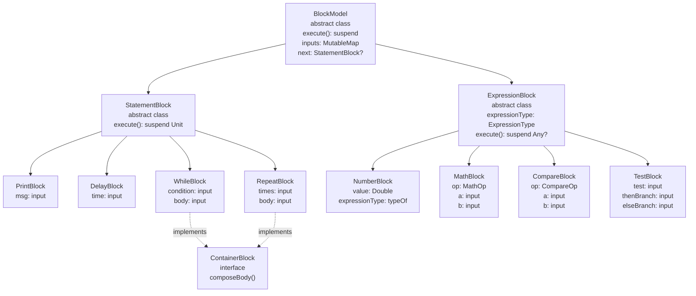
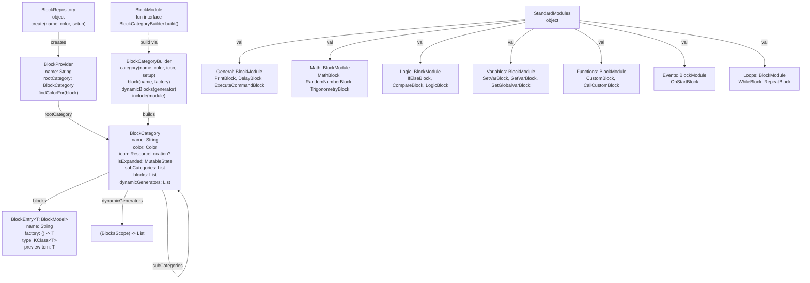
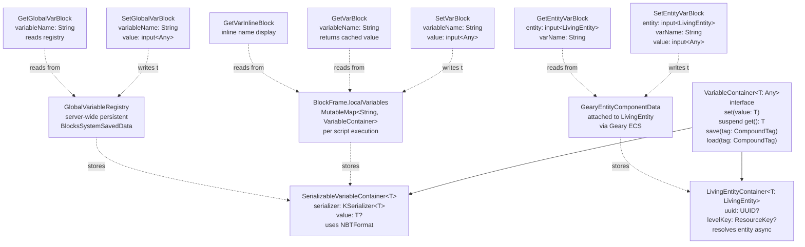

# Block Programming System

<details>
<summary>Relevant source files</summary>

The following files were used as context for generating this wiki page:

- [src/main/java/ru/hollowhorizon/hollowengine/client/gui/codeblocks/BlockController.kt](src/main/java/ru/hollowhorizon/hollowengine/client/gui/codeblocks/BlockController.kt)
- [src/main/java/ru/hollowhorizon/hollowengine/client/gui/codeblocks/BlocksPanel.kt](src/main/java/ru/hollowhorizon/hollowengine/client/gui/codeblocks/BlocksPanel.kt)
- [src/main/java/ru/hollowhorizon/hollowengine/client/gui/codeblocks/DragState.kt](src/main/java/ru/hollowhorizon/hollowengine/client/gui/codeblocks/DragState.kt)
- [src/main/java/ru/hollowhorizon/hollowengine/client/gui/kool/KeyHandlerNode.kt](src/main/java/ru/hollowhorizon/hollowengine/client/gui/kool/KeyHandlerNode.kt)
- [src/main/java/ru/hollowhorizon/hollowengine/client/gui/scripting/files/codeblocks/CodeBlocksFile.kt](src/main/java/ru/hollowhorizon/hollowengine/client/gui/scripting/files/codeblocks/CodeBlocksFile.kt)
- [src/main/java/ru/hollowhorizon/hollowengine/client/kool/KoolHooks.java](src/main/java/ru/hollowhorizon/hollowengine/client/kool/KoolHooks.java)
- [src/main/java/ru/hollowhorizon/hollowengine/common/codeblocks/BlockRepository.kt](src/main/java/ru/hollowhorizon/hollowengine/common/codeblocks/BlockRepository.kt)
- [src/main/java/ru/hollowhorizon/hollowengine/common/codeblocks/model/BlockModel.kt](src/main/java/ru/hollowhorizon/hollowengine/common/codeblocks/model/BlockModel.kt)

</details>


## Purpose and Scope

The Block Programming System provides the runtime execution model and block type definitions for HollowEngine's visual scripting system. This page documents the `BlockModel` class hierarchy, `BlockRepository` organization system, standard block implementations (`MathBlock`, `WhileBlock`, `SetVarBlock`, etc.), and the `InputSlotScope` DSL for block UI composition.

For the visual editor UI and drag-and-drop implementation, see [Visual Block Editor](#5). For script compilation and execution flow, see [Script Execution](#7).

---

## System Overview

The system comprises three architectural layers:

1. **Block Models** (`BlockModel`, `StatementBlock`, `ExpressionBlock`): Serializable Kotlin classes with `execute()` suspend functions
2. **Block Repository** (`BlockProvider`, `BlockCategory`, `BlockEntry`): Hierarchical organization of block types into categories
3. **UI Composition** (`InputSlotScope` DSL): Declarative UI definition through `composeContent()` and `composeBody()` methods

Blocks form execution trees via `inputs: MutableMap<String, InputSlot<*>>` and `next: StatementBlock?` relationships. Each block is serializable via Kotlinx.serialization for persistence.

---

## Block Model Hierarchy



**Sources:** [src/main/java/ru/hollowhorizon/hollowengine/common/codeblocks/blocks/MathBlocks.kt:30-306](), [src/main/java/ru/hollowhorizon/hollowengine/common/codeblocks/blocks/ControlBlocks.kt:1-63](), [src/main/java/ru/hollowhorizon/hollowengine/common/codeblocks/blocks/RepeatBlock.kt:1-45](), [src/main/java/ru/hollowhorizon/hollowengine/common/codeblocks/blocks/PrintBlock.kt:1-25]()

### BlockModel Base Class

Abstract base class at [src/main/java/ru/hollowhorizon/hollowengine/common/codeblocks/model/BlockModel.kt]() defining:

| Member | Type | Purpose |
|--------|------|---------|
| `inputs` | `MutableMap<String, InputSlot<*>>` | Stores input connections |
| `next` | `StatementBlock?` | Sequential execution chain |
| `parentBlock` | `BlockModel?` | Parent reference in tree |
| `execute()` | `suspend fun(): Any?` | Abstract execution method |
| `composeContent()` | `InputSlotScope.() -> Unit` | Abstract UI composition |
| `composeBody()` | `InputSlotScope.() -> Unit` | Optional body composition |
| `input<T>(name)` | Property delegate | Declares typed input slot |

Annotated with `@Serializable` (Kotlinx.serialization) for JSON persistence via `CodeBlockSerializer`.

### StatementBlock

Execution-only blocks with no return value. Defined at [src/main/java/ru/hollowhorizon/hollowengine/common/codeblocks/model/StatementBlock.kt](). Overrides `execute(): suspend Unit`.

**Implementations:** `PrintBlock` [src/main/java/ru/hollowhorizon/hollowengine/common/codeblocks/blocks/PrintBlock.kt:13](), `DelayBlock` [src/main/java/ru/hollowhorizon/hollowengine/common/codeblocks/blocks/ControlBlocks.kt:46](), `WhileBlock` [src/main/java/ru/hollowhorizon/hollowengine/common/codeblocks/blocks/ControlBlocks.kt:22](), `SetVarBlock`, `SetGlobalVarBlock`, `SetEntityVarBlock`.

### ExpressionBlock

Value-producing blocks with type information. Defined at [src/main/java/ru/hollowhorizon/hollowengine/common/codeblocks/model/ExpressionBlock.kt](). 

**Key property:** `expressionType: ExpressionType` - Describes return type for slot validation. Created via `typeOf<T>()` helper.

**Implementations:** `NumberBlock` [src/main/java/ru/hollowhorizon/hollowengine/common/codeblocks/blocks/MathBlocks.kt:272](), `MathBlock` [src/main/java/ru/hollowhorizon/hollowengine/common/codeblocks/blocks/MathBlocks.kt:32](), `CompareBlock` [src/main/java/ru/hollowhorizon/hollowengine/common/codeblocks/blocks/MathBlocks.kt:109](), `StringValueBlock` [src/main/java/ru/hollowhorizon/hollowengine/common/codeblocks/blocks/StringValueBlock.kt:15]().

### ContainerBlock Interface

Marker interface at [src/main/java/ru/hollowhorizon/hollowengine/common/codeblocks/model/ContainerBlock.kt]() indicating blocks that contain child statement chains. Requires `composeBody()` implementation to render the body slot.

**Implementations:** `WhileBlock`, `RepeatBlock`, `IfBlock`, `IfElseBlock`, `CustomBlock`.

**Sources:** [src/main/java/ru/hollowhorizon/hollowengine/common/codeblocks/blocks/ControlBlocks.kt:1-63](), [src/main/java/ru/hollowhorizon/hollowengine/common/codeblocks/blocks/RepeatBlock.kt:1-45]()

---

## Block Repository and Module System



**Sources:** [src/main/java/ru/hollowhorizon/hollowengine/common/codeblocks/BlockRepository.kt:1-101](), [src/main/java/ru/hollowhorizon/hollowengine/common/codeblocks/modules/StandardModules.kt:1-192]()

### BlockRepository

Singleton object at [src/main/java/ru/hollowhorizon/hollowengine/common/codeblocks/BlockRepository.kt:94-101]() providing factory method:

```
fun create(name: String, color: Color, setup: BlockModule): BlockProvider
```

Creates a `BlockProvider` with root `BlockCategory` built via `setup` lambda using `BlockCategoryBuilder` DSL.

### BlockCategory

Data class at [src/main/java/ru/hollowhorizon/hollowengine/common/codeblocks/BlockRepository.kt:18-26]():

| Property | Type | Purpose |
|----------|------|---------|
| `name` | `String` | Display name |
| `color` | `Color` | Inherited by child blocks |
| `icon` | `ResourceLocation?` | Optional category icon |
| `isExpanded` | `MutableState<Boolean>` | UI expansion state |
| `subCategories` | `MutableList<BlockCategory>` | Nested categories |
| `blocks` | `MutableList<BlockEntry<*>>` | Block definitions |
| `dynamicGenerators` | `MutableList<BlocksScope.() -> List<BlockEntry<*>>>` | Runtime block generation |

**Methods:**
- `entries(scope: BlocksScope)`: Returns `blocks + dynamicGenerators.flatMap { it(scope) }`
- `items(scope: BlocksScope)`: Returns `subCategories + entries(scope)`

### BlockEntry<T: BlockModel>

Data class at [src/main/java/ru/hollowhorizon/hollowengine/common/codeblocks/BlockRepository.kt:30-39]():

| Property | Type | Purpose |
|----------|------|---------|
| `name` | `String` | Palette display name |
| `icon` | `ResourceLocation?` | Optional icon |
| `factory` | `() -> T` | Block instantiation lambda |
| `type` | `KClass<T>` | Reflection type for filtering |
| `previewItem` | `T` | Lazy preview instance |

**Method:** `createItem(): T` - Invokes `factory()` for new instance.

### BlockModule

Fun interface at [src/main/java/ru/hollowhorizon/hollowengine/common/codeblocks/BlockRepository.kt:41-43]():

```kotlin
fun interface BlockModule {
    fun BlockCategoryBuilder.build()
}
```

Defines block category structure via `BlockCategoryBuilder` receiver DSL.

### BlockCategoryBuilder DSL

Builder class at [src/main/java/ru/hollowhorizon/hollowengine/common/codeblocks/BlockRepository.kt:45-92]() with methods:

| Method | Parameters | Purpose |
|--------|------------|---------|
| `category` | `name, color, icon, setup` | Add nested category |
| `block<T>` | `name, factory` | Add block with category color |
| `blockWithColor<T>` | `name, color, factory` | Add block with custom color |
| `dynamicBlocks` | `generator: BlocksScope.() -> List` | Add runtime generator |
| `include` | `module: BlockModule` | Include another module |

### Dynamic Block Generators

Dynamic generator functions receive `BlocksScope` with access to `rootBlocks: List<BlockModel>` representing the current script's top-level blocks. Generators return `List<BlockEntry<*>>` dynamically created from script state.

**Use cases:**
1. Variable getters: Generate `GetVarInlineBlock(name)` for each `SetVarBlock` in script
2. Function callers: Generate `CallCustomBlock(name)` for each `CustomBlock` in script

**Example:** Local variable getter generation at [src/main/java/ru/hollowhorizon/hollowengine/common/codeblocks/modules/StandardModules.kt:87-98]():

```kotlin
dynamicBlocks {
    rootBlocks.flatMap { it.walk() }  // Traverse all blocks
        .filterIsInstance<SetVarBlock>()
        .filter { it.variableName.isNotEmpty() }
        .map { setBlock ->
            BlockEntry(
                "Получить ${setBlock.variableName}",
                null,
                { GetVarInlineBlock(setBlock.variableName) },
                GetVarInlineBlock::class
            )
        }
}
```

**Sources:** [src/main/java/ru/hollowhorizon/hollowengine/common/codeblocks/BlockRepository.kt:81-83](), [src/main/java/ru/hollowhorizon/hollowengine/common/codeblocks/modules/StandardModules.kt:87-134]()

---

## Standard Modules

HollowEngine provides several standard modules with commonly-used blocks:

| Module | Purpose | Color | Key Blocks |
|--------|---------|-------|------------|
| **General** | Basic utility blocks | Purple `A666EA` | Print, Delay, ExecuteCommand |
| **Math** | Mathematical operations | Blue `58B2EA` | Math ops, Random, Trigonometry, Vectors |
| **Logic** | Boolean logic and conditionals | Green `1DB07D` | If/IfElse, Compare, Logic ops, Not, Test |
| **Types** | Data type constructors | Yellow `F3BD3E` | String, Number, Bool, Position, Player |
| **Variables** | Variable storage | Purple `7248DD` | Local/Global/Entity variables |
| **Functions** | Custom reusable functions | Red `EA6A5A` | CustomBlock, CallCustomBlock |
| **Events** | Event handling | Pink `C94072` | OnStart (more planned) |
| **Stops** | Script termination | Red `F04438` | Stop, StopIf |
| **Loops** | Iteration | Orange `EB903F` | While, Repeat |

**Sources:** [src/main/java/ru/hollowhorizon/hollowengine/common/codeblocks/modules/StandardModules.kt:21-191]()

---

## Math and Logic Blocks

### MathBlock

Expression block at [src/main/java/ru/hollowhorizon/hollowengine/common/codeblocks/blocks/MathBlocks.kt:32-76]() performing arithmetic operations.

**Class definition:**
```kotlin
@Serializable
@SerialName("hollowengine:math/operation")
class MathBlock(var op: MathOp = MathOp.ADD) : ExpressionBlock()
```

**Properties:**

| Property | Type | Value |
|----------|------|-------|
| `op` | `MathOp` | Operation enum: `ADD`, `SUB`, `MUL`, `DIV` |
| `a` | `input<Number>` | Left operand |
| `b` | `input<Number>` | Right operand |
| `expressionType` | `ExpressionType` | `typeOf<Number>()` |

**Execution:** [src/main/java/ru/hollowhorizon/hollowengine/common/codeblocks/blocks/MathBlocks.kt:39-48]()
```kotlin
override suspend fun execute(): Any? {
    val a = a().toDouble()
    val b = b().toDouble()
    return when (op) {
        MathOp.ADD -> a + b
        MathOp.SUB -> a - b
        MathOp.MUL -> a * b
        MathOp.DIV -> a / b
    }
}
```

**UI composition:** [src/main/java/ru/hollowhorizon/hollowengine/common/codeblocks/blocks/MathBlocks.kt:50-75]() renders `InputSlot(a)`, clickable operator box (cycles `op` on click), `InputSlot(b)`.

**MathOp enum:** [src/main/java/ru/hollowhorizon/hollowengine/common/codeblocks/blocks/MathBlocks.kt:18-20]()
```kotlin
enum class MathOp(val symbol: String) {
    ADD("+"), SUB("-"), MUL("*"), DIV("/");
}
```

### CompareBlock

Expression block at [src/main/java/ru/hollowhorizon/hollowengine/common/codeblocks/blocks/MathBlocks.kt:109-156]() for numeric comparison.

**Class definition:**
```kotlin
@Serializable
@SerialName("hollowengine:math/compare")
class CompareBlock(var op: CompareOp = CompareOp.EQUALS) : ExpressionBlock()
```

**Properties:**

| Property | Type | Value |
|----------|------|-------|
| `op` | `CompareOp` | Comparison operator |
| `a` | `input<Number>` | Left operand |
| `b` | `input<Number>` | Right operand |
| `expressionType` | `ExpressionType` | `typeOf<Boolean>()` |

**Execution:** [src/main/java/ru/hollowhorizon/hollowengine/common/codeblocks/blocks/MathBlocks.kt:116-128]()
```kotlin
override suspend fun execute(): Any? {
    val resA = a().toDouble()
    val resB = b().toDouble()
    return when (op) {
        CompareOp.EQUALS -> resA == resB
        CompareOp.NOT_EQUALS -> resA != resB
        CompareOp.GREATER -> resA > resB
        CompareOp.LESS -> resA < resB
        CompareOp.GREATER_EQUALS -> resA >= resB
        CompareOp.LESS_EQUALS -> resA <= resB
    }
}
```

**CompareOp enum:** [src/main/java/ru/hollowhorizon/hollowengine/common/codeblocks/blocks/MathBlocks.kt:26-28]()
```kotlin
enum class CompareOp(val symbol: String) {
    EQUALS("=="), NOT_EQUALS("!="), GREATER(">"), LESS("<"), 
    GREATER_EQUALS(">="), LESS_EQUALS("<=");
}
```

### LogicBlock

Expression block at [src/main/java/ru/hollowhorizon/hollowengine/common/codeblocks/blocks/MathBlocks.kt:160-202]() for boolean logic.

**Class definition:**
```kotlin
@Serializable
@SerialName("hollowengine:math/logic")
class LogicBlock(var op: LogicOp = LogicOp.AND) : ExpressionBlock()
```

**Properties:**

| Property | Type | Value |
|----------|------|-------|
| `op` | `LogicOp` | `AND` or `OR` |
| `a` | `input<Boolean>` | Left operand |
| `b` | `input<Boolean>` | Right operand |
| `expressionType` | `ExpressionType` | `typeOf<Boolean>()` |

**Execution:** [src/main/java/ru/hollowhorizon/hollowengine/common/codeblocks/blocks/MathBlocks.kt:167-175]()
```kotlin
return when (op) {
    LogicOp.AND -> resA && resB
    LogicOp.OR -> resA || resB
}
```

**LogicOp enum:** [src/main/java/ru/hollowhorizon/hollowengine/common/codeblocks/blocks/MathBlocks.kt:22-24]()
```kotlin
enum class LogicOp(val symbol: String) {
    AND("&&"), OR("||");
}
```

### NotBlock

Expression block at [src/main/java/ru/hollowhorizon/hollowengine/common/codeblocks/blocks/MathBlocks.kt:206-220]() negating boolean value.

**Properties:** `value: input<Boolean>`, `expressionType: typeOf<Boolean>()`

**Execution:** Returns `!(value())`

### RandomNumberBlock

Expression block at [src/main/java/ru/hollowhorizon/hollowengine/common/codeblocks/blocks/MathBlocks.kt:80-105]() generating random values.

**Properties:**
- `min: input<Number>` - Lower bound
- `max: input<Number>` - Upper bound
- `expressionType: typeOf<Number>()`

**Execution:** [src/main/java/ru/hollowhorizon/hollowengine/common/codeblocks/blocks/MathBlocks.kt:87-91]()
```kotlin
override suspend fun execute(): Any? {
    val minVal = min().toDouble()
    val maxVal = max().toDouble()
    return Random.nextDouble(minVal, maxVal)
}
```

### TestBlock (Ternary Conditional)

Expression block at [src/main/java/ru/hollowhorizon/hollowengine/common/codeblocks/blocks/MathBlocks.kt:224-268]() implementing ternary operator.

**Properties:**

| Property | Type | Description |
|----------|------|-------------|
| `test` | `input<Boolean>` | Condition |
| `thenBranch` | `input<Any>` | True branch value |
| `elseBranch` | `input<Any>` | False branch value |
| `expressionType` | `ExpressionType` | Dynamically inferred |

**Type inference:** [src/main/java/ru/hollowhorizon/hollowengine/common/codeblocks/blocks/MathBlocks.kt:225-234]()
```kotlin
override val expressionType: ExpressionType
    get() {
        val parentType = parentBlock?.expressionTypeOrNull
        if (parentType != null && parentType != AnyType) return parentType
        
        val thenType = inputs["then"]?.expressionTypeOrNull
        val elseType = inputs["else"]?.expressionTypeOrNull
        
        return thenType ?: elseType ?: AnyType
    }
```

Returns `thenBranch()` if `test()` is true, else `elseBranch()`.

**Sources:** [src/main/java/ru/hollowhorizon/hollowengine/common/codeblocks/blocks/MathBlocks.kt:1-306]()

---

## Variable System



**Sources:** [src/main/java/ru/hollowhorizon/hollowengine/common/codeblocks/variables/VariableContainer.kt:1-94]()

### VariableContainer<T: Any> Interface

Interface at [src/main/java/ru/hollowhorizon/hollowengine/common/codeblocks/variables/VariableContainer.kt:18-24]() defining variable storage contract:

| Method | Signature | Purpose |
|--------|-----------|---------|
| `set` | `fun set(value: T)` | Store value |
| `get` | `suspend fun get(): T` | Retrieve value (async) |
| `save` | `fun save(tag: CompoundTag)` | Serialize to NBT |
| `load` | `fun load(tag: CompoundTag)` | Deserialize from NBT |

### SerializableVariableContainer<T: Any>

Implementation at [src/main/java/ru/hollowhorizon/hollowengine/common/codeblocks/variables/VariableContainer.kt:26-52]() for primitive and data class types.

**Constructor:** `SerializableVariableContainer(val serializer: KSerializer<T>, defaultValue: T?)`

**Storage:** `var value: T?` - Nullable value field

**Serialization:** Uses `NBTFormat.serialize(serializer, value)` and `NBTFormat.deserialize(serializer, tag)` [src/main/java/ru/hollowhorizon/hollowengine/common/codeblocks/variables/VariableContainer.kt:37-46]()

### LivingEntityContainer<T: LivingEntity>

Implementation at [src/main/java/ru/hollowhorizon/hollowengine/common/codeblocks/variables/VariableContainer.kt:54-94]() for entity references.

**Storage properties:**
- `uuid: UUID?` - Entity unique identifier
- `levelKey: ResourceKey<Level>?` - Dimension key

**Async resolution:** [src/main/java/ru/hollowhorizon/hollowengine/common/codeblocks/variables/VariableContainer.kt:76-89]()
```kotlin
override suspend fun get(): T {
    val level = levelKey?.let(currentServer::getLevel) ?: error("Level $levelKey is null!")
    
    while (coroutineContext.isActive) {
        val findEntity = level.getEntity(uuid)
        if (findEntity != null) {
            return findEntity as T
        }
        delay(50)  // Poll every 50ms until entity loads
    }
    error("Entity $uuid not found!")
}
```

Waits for entity to load if not yet available in world.

### Variable Block Types

| Scope | Setter | Getter | Inline Getter | Storage Location |
|-------|--------|--------|---------------|------------------|
| **Local** | `SetVarBlock(variableName)` | `GetVarBlock(variableName)` | `GetVarInlineBlock(variableName)` | `BlockFrame.localVariables: MutableMap` |
| **Global** | `SetGlobalVarBlock(variableName)` | `GetGlobalVarBlock(variableName)` | - | `GlobalVariableRegistry` / `BlocksSystemSavedData` |
| **Entity** | `SetEntityVarBlock(varName)` | `GetEntityVarBlock(varName)` | - | Geary component on `LivingEntity` |

**Local scope:** Variables exist only during script execution. Stored in `BlockFrame.localVariables` map which is part of the coroutine context.

**Global scope:** Server-wide persistent variables stored in `BlocksSystemSavedData` (Minecraft saved data). Accessible across all scripts.

**Entity scope:** Variables attached to specific `LivingEntity` instances via Geary ECS component system. Persists with the entity.

**Registration:** [src/main/java/ru/hollowhorizon/hollowengine/common/codeblocks/modules/StandardModules.kt:81-136]()

### Dynamic Variable Getters

Module definition at [src/main/java/ru/hollowhorizon/hollowengine/common/codeblocks/modules/StandardModules.kt:87-98]() (local), [105-116]() (global), [123-134]() (entity) generates inline getter blocks via `dynamicBlocks { }`.

For each `SetVarBlock` / `SetGlobalVarBlock` / `SetEntityVarBlock` with non-empty name, creates corresponding `GetVarInlineBlock` / `GetGlobalVarBlock` / `GetEntityVarBlock` entry in palette. 

Inline getters display variable name directly (e.g., "playerHealth") instead of generic "Get variable" label.

---

## Control Flow Blocks

### WhileBlock

Statement + container block at [src/main/java/ru/hollowhorizon/hollowengine/common/codeblocks/blocks/ControlBlocks.kt:22-42]().

**Class definition:**
```kotlin
@Serializable
@SerialName("hollowengine:loops/while")
class WhileBlock : StatementBlock(), ContainerBlock
```

**Properties:**
- `condition: input<Boolean>` - Loop condition
- `body: input<Unit>` - Statement chain to execute

**Execution logic:** [src/main/java/ru/hollowhorizon/hollowengine/common/codeblocks/blocks/ControlBlocks.kt:26-32]()
```kotlin
override suspend fun execute() {
    while (coroutineContext.isActive && remember("condition") { condition() }) {
        body()
        forget("condition")  // Re-evaluate next iteration
        yield()  // Yield to scheduler (once per tick)
    }
}
```

**Key mechanisms:**
- `remember("condition")`: Caches condition result within iteration
- `forget("condition")`: Clears cache for re-evaluation
- `yield()`: Suspends coroutine, resumes next server tick
- `coroutineContext.isActive`: Respects cancellation

**UI composition:** [src/main/java/ru/hollowhorizon/hollowengine/common/codeblocks/blocks/ControlBlocks.kt:34-41]() renders "Пока" text, condition input slot, and body slot.

**Sources:** [src/main/java/ru/hollowhorizon/hollowengine/common/codeblocks/blocks/ControlBlocks.kt:1-63]()

### RepeatBlock

Statement + container block at [src/main/java/ru/hollowhorizon/hollowengine/common/codeblocks/blocks/RepeatBlock.kt:1-45]().

**Class definition:**
```kotlin
@Serializable
@SerialName("hollowengine:loops/repeat")
class RepeatBlock : StatementBlock(), ContainerBlock
```

**Properties:**
- `times: input<Number>` - Iteration count
- `body: input<Unit>` - Statement chain

**Execution logic:** [src/main/java/ru/hollowhorizon/hollowengine/common/codeblocks/blocks/RepeatBlock.kt:23-34]()
```kotlin
override suspend fun execute() {
    val frame = coroutineContext[BlockFrame.Key] ?: error("Block frame not found!")
    
    val repeatTimes = remember("times") { times().toInt() }
    val expectedTimes = repeatTimes - frame.tag.getInt("index")
    
    repeat(expectedTimes) {
        body()
        frame.tag.putInt("index", it)  // Persist progress
    }
}
```

**Persistence:** Stores iteration index in `frame.tag` (NBT) to survive script suspension/resumption across ticks.

**UI composition:** [src/main/java/ru/hollowhorizon/hollowengine/common/codeblocks/blocks/RepeatBlock.kt:36-44]() renders "Повторить", times slot, "Раз" text, and body slot.

### If/Else Blocks

Standard conditional blocks with optional else branch:
- **IfBlock**: Single condition, single body
- **IfElseBlock**: Condition with then/else bodies

**Registrations:** [src/main/java/ru/hollowhorizon/hollowengine/common/codeblocks/modules/StandardModules.kt:51-52]()

### DelayBlock

Statement block at [src/main/java/ru/hollowhorizon/hollowengine/common/codeblocks/blocks/ControlBlocks.kt:45-63]() implementing timed delays.

**Class definition:**
```kotlin
@Serializable
@SerialName("hollowengine:control/delay")
class DelayBlock : StatementBlock()
```

**Properties:**
- `time: input<Number>` - Delay duration in seconds

**Execution logic:** [src/main/java/ru/hollowhorizon/hollowengine/common/codeblocks/blocks/ControlBlocks.kt:49-56]()
```kotlin
override suspend fun execute() {
    val frame = coroutineContext[BlockFrame.Key] ?: error("Block frame not found")
    var remaining = frame.tag.getInt("remaining_ticks")
        .takeIf { it > 0 } 
        ?: (time().toFloat() * 20f).toInt()  // Convert seconds to ticks
    
    while (remaining > 0) {
        yield()  // Wait one tick
        frame.tag.putInt("remaining_ticks", --remaining)
    }
}
```

**Persistence:** Stores `remaining_ticks` in `frame.tag` so delay survives script suspension. Converts seconds to ticks (×20) on first execution.

**UI composition:** [src/main/java/ru/hollowhorizon/hollowengine/common/codeblocks/blocks/ControlBlocks.kt:58-62]() renders "Ждать", time slot, "секунд" text.

**Sources:** [src/main/java/ru/hollowhorizon/hollowengine/common/codeblocks/blocks/ControlBlocks.kt:1-63](), [src/main/java/ru/hollowhorizon/hollowengine/common/codeblocks/blocks/RepeatBlock.kt:1-45]()

---

## Event and Trigger Blocks

### SendEventBlock

Statement block at [src/main/java/ru/hollowhorizon/hollowengine/common/codeblocks/blocks/EventsBlocks.kt:12-27]() for emitting custom events.

**Class definition:**
```kotlin
@Serializable
@SerialName("hollowengine:events/send")
class SendEventBlock(var eventName: String = "MyEvent") : StatementBlock()
```

**Status:** Execution logic commented out at [src/main/java/ru/hollowhorizon/hollowengine/common/codeblocks/blocks/EventsBlocks.kt:13-15](). Feature planned but not implemented.

**UI composition:** [src/main/java/ru/hollowhorizon/hollowengine/common/codeblocks/blocks/EventsBlocks.kt:18-26]() renders "Отправить сообщение" text with editable `TextField` for event name.

### Event Module Definition

Module at [src/main/java/ru/hollowhorizon/hollowengine/common/codeblocks/modules/StandardModules.kt:156-165]() defines:

**Active blocks:**
- `OnStartBlock` - Script entry point

**Planned blocks (commented out):**
- `OnEventBlock` - React to custom events [line 159]()
- `SendEventBlock` - Emit custom events [line 160]()
- `OnPlayerJoinBlock` - Player join trigger [line 162]()
- `OnPlayerDeathBlock` - Player death trigger [line 163]()

**Sources:** [src/main/java/ru/hollowhorizon/hollowengine/common/codeblocks/blocks/EventsBlocks.kt:1-29](), [src/main/java/ru/hollowhorizon/hollowengine/common/codeblocks/modules/StandardModules.kt:156-165]()

---

## General and Output Blocks

### PrintBlock

Statement block at [src/main/java/ru/hollowhorizon/hollowengine/common/codeblocks/blocks/PrintBlock.kt:1-25]() logging messages.

**Class definition:**
```kotlin
@Serializable
@SerialName("hollowengine:print")
class PrintBlock : StatementBlock()
```

**Properties:**
- `msg: input<Any>` - Message to print

**Execution:** [src/main/java/ru/hollowhorizon/hollowengine/common/codeblocks/blocks/PrintBlock.kt:16-18]()
```kotlin
override suspend fun execute() {
    HollowEngine.LOGGER.info(msg())
}
```

Logs to Minecraft console via SLF4J logger.

**UI composition:** [src/main/java/ru/hollowhorizon/hollowengine/common/codeblocks/blocks/PrintBlock.kt:20-24]() renders "Напечатать" text and message input slot.

### ExecuteCommandBlock

Registered at [src/main/java/ru/hollowhorizon/hollowengine/common/codeblocks/modules/StandardModules.kt:26]() in General module. Executes Minecraft commands from server context.

### Stop Blocks

Defined in Stops module at [src/main/java/ru/hollowhorizon/hollowengine/common/codeblocks/modules/StandardModules.kt:167-172]():

| Block | Purpose |
|-------|---------|
| `StopBlock` | Unconditional script termination |
| `StopIfBlock` | Conditional termination (if condition true) |

**Sources:** [src/main/java/ru/hollowhorizon/hollowengine/common/codeblocks/blocks/PrintBlock.kt:1-25](), [src/main/java/ru/hollowhorizon/hollowengine/common/codeblocks/modules/StandardModules.kt:22-28](), [src/main/java/ru/hollowhorizon/hollowengine/common/codeblocks/modules/StandardModules.kt:167-172]()

---

## Type and Value Blocks

### NumberBlock

Expression block at [src/main/java/ru/hollowhorizon/hollowengine/common/codeblocks/blocks/MathBlocks.kt:272-291]() for numeric literals.

**Class definition:**
```kotlin
@Serializable
@SerialName("hollowengine:number")
class NumberBlock(var value: Double = 0.0) : ExpressionBlock()
```

**Properties:**
- `value: Double` - Stored number
- `expressionType: typeOf<Number>()`

**Execution:** Returns `value` directly.

**UI composition:** [src/main/java/ru/hollowhorizon/hollowengine/common/codeblocks/blocks/MathBlocks.kt:278-290]() renders `TextField` with `onChange` handler setting `value = it.toDoubleOrNull() ?: 0.0`.

### BoolBlock

Expression block at [src/main/java/ru/hollowhorizon/hollowengine/common/codeblocks/blocks/MathBlocks.kt:295-306]() for boolean literals.

**Class definition:**
```kotlin
@Serializable
@SerialName("hollowengine:boolen")  // Note: typo in SerialName
class BoolBlock(var value: Boolean = true) : ExpressionBlock()
```

**Properties:**
- `value: Boolean`
- `expressionType: typeOf<Boolean>()`

**UI composition:** [src/main/java/ru/hollowhorizon/hollowengine/common/codeblocks/blocks/MathBlocks.kt:302-305]() renders `Checkbox` with `onToggle` handler.

### StringValueBlock

Expression block at [src/main/java/ru/hollowhorizon/hollowengine/common/codeblocks/blocks/StringValueBlock.kt:1-32]() for string literals.

**Class definition:**
```kotlin
@Serializable
@SerialName("hollowengine:string_type")
class StringValueBlock(var value: String) : ExpressionBlock()
```

**Properties:**
- `value: String`
- `expressionType: typeOf<String>()`

**UI composition:** [src/main/java/ru/hollowhorizon/hollowengine/common/codeblocks/blocks/StringValueBlock.kt:20-31]() renders `TextField` with hint "Значение" and `onChange` handler.

### Type System

Expression blocks define `expressionType: ExpressionType` property created via `typeOf<T>()` helper function.

**Annotation:** Property marked `@Transient` to exclude from serialization.

**Usage example:**
```kotlin
@Transient
override val expressionType = typeOf<Number>()
```

**Type information purposes:**
1. Input slot validation (enforces type compatibility)
2. UI rendering (slot background colors based on type)
3. Runtime type inference (e.g., `TestBlock` infers from branches)

**Type examples:**
- `typeOf<Number>()` at [src/main/java/ru/hollowhorizon/hollowengine/common/codeblocks/blocks/MathBlocks.kt:34]()
- `typeOf<Boolean>()` at [src/main/java/ru/hollowhorizon/hollowengine/common/codeblocks/blocks/MathBlocks.kt:111]()
- `typeOf<String>()` at [src/main/java/ru/hollowhorizon/hollowengine/common/codeblocks/blocks/StringValueBlock.kt:17]()

### Game-Specific Type Blocks

Types module at [src/main/java/ru/hollowhorizon/hollowengine/common/codeblocks/modules/StandardModules.kt:60-79]() includes:

| Block | Type | Purpose |
|-------|------|---------|
| `PositionBlock` | `Vec3` | 3D world coordinates |
| `BlockPosBlock` | `BlockPos` | Integer block coordinates |
| `GetPlayerByNameBlock` | `ServerPlayer` | Retrieve player by username |
| `TextComponentBlock` | `Component` | Minecraft text components |
| `TextMergerBlock` | `Component` | Combine text components |

**World accessor blocks:**
- `GetOverworldBlock` - Returns overworld `ServerLevel` [line 74]()
- `GetNetherBlock` - Returns nether `ServerLevel` [line 75]()
- `GetTheEndBlock` - Returns end `ServerLevel` [line 76]()

Registered in nested "Миры" category at [src/main/java/ru/hollowhorizon/hollowengine/common/codeblocks/modules/StandardModules.kt:73-77]().

**Sources:** [src/main/java/ru/hollowhorizon/hollowengine/common/codeblocks/blocks/MathBlocks.kt:272-306](), [src/main/java/ru/hollowhorizon/hollowengine/common/codeblocks/blocks/StringValueBlock.kt:1-32](), [src/main/java/ru/hollowhorizon/hollowengine/common/codeblocks/modules/StandardModules.kt:60-79]()

---

## UI Composition System

### InputSlotScope Interface

Receiver interface for block UI composition defined at [src/main/java/ru/hollowhorizon/hollowengine/client/gui/codeblocks/InputSlotScope.kt]().

**Methods:**

| Method | Signature | Purpose |
|--------|-----------|---------|
| `InputSlot` | `fun InputSlot(input: InputSlot<*>)` | Render input connection slot |
| `BodySlot` | `fun BodySlot(name: String)` | Render container body slot |
| `notifyChanged` | `fun notifyChanged()` | Trigger parent block update |

**Properties:**

| Property | Type | Purpose |
|----------|------|---------|
| `surface` | `UiSurface` | Kool UI surface for updates |
| `font` | `Font` | Text rendering font |
| `sizes` | `Sizes` | UI dimension constants |

**Available UI components:** Full Kool UI2 component library (de.fabmax.kool.modules.ui2):
- Layout: `Box`, `Row`, `Column`, `ScrollArea`
- Input: `TextField`, `Checkbox`, `Button`
- Display: `Text`, `Image`
- Modifiers: `modifier.onClick`, `modifier.background`, `modifier.padding`, etc.

### Composition Methods

Blocks implement one or both composition methods:

#### composeContent()

Defines the main content of the block - the inline UI that appears on the block's face.

**Example from MathBlock:** [src/main/java/ru/hollowhorizon/hollowengine/common/codeblocks/blocks/MathBlocks.kt:50-75]()

```kotlin
override fun InputSlotScope.composeContent() {
    InputSlot(a)  // Left operand slot
    
    Box {  // Clickable operator
        modifier.onClick { /* cycle operation */ }
        Text(op.symbol)
    }
    
    InputSlot(b)  // Right operand slot
}
```

#### composeBody()

Defines the body container for ContainerBlocks - the area where child statements are placed.

**Example from WhileBlock:** [src/main/java/ru/hollowhorizon/hollowengine/common/codeblocks/blocks/ControlBlocks.kt:39-41]()

```kotlin
override fun InputSlotScope.composeBody() {
    BodySlot("body")
}
```

### Dynamic Block Generation

The `dynamicBlocks { }` DSL allows categories to generate blocks at runtime based on script state. The generator receives a `BlocksScope` with access to:
- `rootBlocks`: All top-level blocks in the current script

**Example: Dynamic variable getters**

[src/main/java/ru/hollowhorizon/hollowengine/common/codeblocks/modules/StandardModules.kt:87-98]()

```kotlin
dynamicBlocks {
    rootBlocks.flatMap { it.walk() }  // Walk all blocks
        .filterIsInstance<SetVarBlock>()  // Find variable declarations
        .filter { it.variableName.isNotEmpty() }  // Only named vars
        .map { setBlock ->
            BlockEntry(
                "Получить ${setBlock.variableName}",  // Name
                null,
                { GetVarInlineBlock(setBlock.variableName) },  // Factory
                GetVarInlineBlock::class  // Type
            )
        }
}
```

This pattern allows the palette to automatically show getter blocks for all defined variables.

### Interactive UI Elements

Blocks commonly include interactive elements:

**TextField** for editable values:
```kotlin
TextField(value.toString()) {
    modifier.onChange { value = it.toDoubleOrNull() ?: 0.0 }
}
```

**Clickable elements** for cycling options:
```kotlin
Box {
    modifier.onClick {
        op = values[(op.ordinal + 1) % values.size]
        notifyChanged()
    }
    Text(op.symbol)
}
```

**Checkbox** for boolean values:
```kotlin
Checkbox(value) {
    modifier.onToggle { value = it; notifyChanged() }
}
```

**Sources:** [src/main/java/ru/hollowhorizon/hollowengine/common/codeblocks/blocks/MathBlocks.kt:50-75](), [src/main/java/ru/hollowhorizon/hollowengine/common/codeblocks/blocks/ControlBlocks.kt:34-41](), [src/main/java/ru/hollowhorizon/hollowengine/common/codeblocks/modules/StandardModules.kt:87-98]()

---

## Block Input System

Blocks declare inputs using property delegates:

```kotlin
val condition by input<Boolean>("cond")
val times by input<Number>("times")
val body by input<Unit>("body")
```

The `input<T>(name)` delegate:
- Declares an input slot with the specified type
- Returns a suspend lambda `() -> T` that evaluates the connected block
- Stores the connection in the block's `inputs` map

**Usage in execute():**
```kotlin
override suspend fun execute() {
    val condValue = condition()  // Evaluates connected block
    val timesValue = times()  // Evaluates connected block
    // ...
}
```

For statement inputs (body slots), the type is `Unit` and calling the delegate executes the child statement chain.

**Type safety:** The system performs runtime type checking when connecting blocks to ensure type compatibility.

**Sources:** Generic block model implementation defines the input delegate system