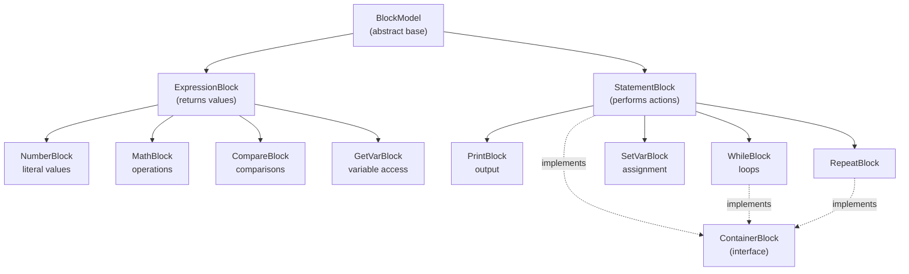
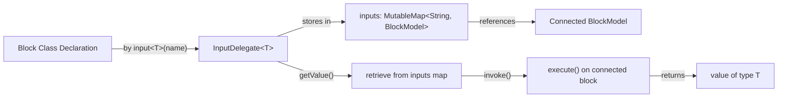
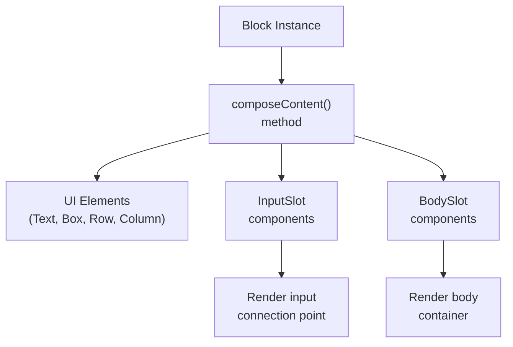
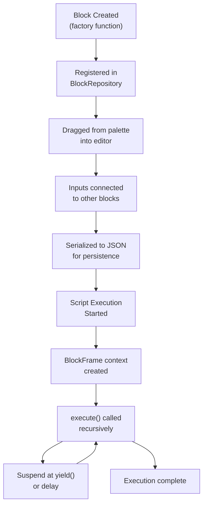

# Block System Architecture

<details>
<summary>Relevant source files</summary>

The following files were used as context for generating this wiki page:

- [src/main/java/ru/hollowhorizon/hollowengine/client/gui/codeblocks/BlockController.kt](src/main/java/ru/hollowhorizon/hollowengine/client/gui/codeblocks/BlockController.kt)
- [src/main/java/ru/hollowhorizon/hollowengine/client/gui/codeblocks/BlocksPanel.kt](src/main/java/ru/hollowhorizon/hollowengine/client/gui/codeblocks/BlocksPanel.kt)
- [src/main/java/ru/hollowhorizon/hollowengine/client/gui/codeblocks/DragState.kt](src/main/java/ru/hollowhorizon/hollowengine/client/gui/codeblocks/DragState.kt)
- [src/main/java/ru/hollowhorizon/hollowengine/client/gui/kool/KeyHandlerNode.kt](src/main/java/ru/hollowhorizon/hollowengine/client/gui/kool/KeyHandlerNode.kt)
- [src/main/java/ru/hollowhorizon/hollowengine/client/gui/scripting/files/codeblocks/CodeBlocksFile.kt](src/main/java/ru/hollowhorizon/hollowengine/client/gui/scripting/files/codeblocks/CodeBlocksFile.kt)
- [src/main/java/ru/hollowhorizon/hollowengine/client/kool/KoolHooks.java](src/main/java/ru/hollowhorizon/hollowengine/client/kool/KoolHooks.java)
- [src/main/java/ru/hollowhorizon/hollowengine/common/codeblocks/BlockRepository.kt](src/main/java/ru/hollowhorizon/hollowengine/common/codeblocks/BlockRepository.kt)
- [src/main/java/ru/hollowhorizon/hollowengine/common/codeblocks/model/BlockModel.kt](src/main/java/ru/hollowhorizon/hollowengine/common/codeblocks/model/BlockModel.kt)

</details>


## Purpose and Scope

This document describes the core architecture of the block programming system, focusing on the `BlockModel` class hierarchy, block types, and how blocks define their structure and behavior. The block system provides the foundation for visual programming in HollowEngine, where users drag and drop blocks to create scripts without writing code directly.

This page covers the foundational classes and interfaces. For information about specific block implementations, see [Math and Logic Blocks](#6.3), [Control Flow Blocks](#6.5), [Type and Value Blocks](#6.8), and [General and Output Blocks](#6.7). For details on how blocks are organized and discovered, see [Block Repository and Modules](#6.2). For the execution model, see [Block Interpreter and Execution](#6.9). For the visual editor that renders these blocks, see [Visual Block Editor](#5).

---

## BlockModel Class Hierarchy

The block system is built on an abstract `BlockModel` base class that all blocks inherit from. The hierarchy distinguishes between two fundamental block types: **expression blocks** (which return values) and **statement blocks** (which perform actions).

### Core Class Structure



**Sources:** [src/main/java/ru/hollowhorizon/hollowengine/common/codeblocks/blocks/MathBlocks.kt:14-306](), [src/main/java/ru/hollowhorizon/hollowengine/common/codeblocks/blocks/ControlBlocks.kt:15-63](), [src/main/java/ru/hollowhorizon/hollowengine/common/codeblocks/blocks/PrintBlock.kt:9-25]()

### BlockModel Properties

Every `BlockModel` instance contains the following core properties:

| Property | Type | Purpose |
|----------|------|---------|
| `uuid` | UUID | Unique identifier for serialization and reference |
| `parentBlock` | BlockModel? | Parent block in the tree hierarchy |
| `parentInputName` | String? | Input slot name on parent (if attached to input) |
| `parentOutputName` | String? | Output slot name on parent (if attached to output) |
| `color` | Color | Abstract property defining visual color for rendering |
| `inputs` | MutableMap<String, BlockModel> | Input slots and their connected blocks |
| `outputs` | MutableMap<String, BlockModel> | Output slots and their connected blocks |
| `inputTypes` | MutableMap<String, ExpressionType> | Type constraints for input slots |
| `outputTypes` | MutableMap<String, ExpressionType> | Type constraints for output slots |
| `positionX` | MutableState<Float> | X coordinate in canvas (default: 50f) |
| `positionY` | MutableState<Float> | Y coordinate in canvas (default: 50f) |
| `isCollapsed` | MutableState<Boolean> | Whether block is displayed in collapsed form |
| `displayName` | String? | Human-readable name for the block instance |

Additionally, blocks maintain internal state for defaults:

| Property | Type | Purpose |
|----------|------|---------|
| `inputDefaults` | MutableMap<String, () -> BlockModel> | Factory functions for default input values |
| `outputDefaults` | MutableMap<String, () -> BlockModel> | Factory functions for default output values |

Blocks define their structure and behavior through:
- **Input/Output declarations** via `input<T>()`, `output<T>()` delegates
- **UI composition** via `composeContent()` and `composeContentCollapsed()` methods
- **Execution logic** via `execute()` suspend function
- **Connection management** via `attachInput()` and `attachOutput()` methods

**Sources:** [src/main/java/ru/hollowhorizon/hollowengine/common/codeblocks/model/BlockModel.kt:20-63]()

---

## ExpressionBlock: Value-Producing Blocks

`ExpressionBlock` represents blocks that evaluate to a value and can be nested inside other blocks' input slots. Every expression block must declare its return type via the `expressionType` property.

### Type System

Expression blocks use a type system based on Kotlin's reified generics:

```kotlin
// From MathBlocks.kt
class MathBlock : ExpressionBlock() {
    override val expressionType = typeOf<Number>()
    // Returns Number type
}

class CompareBlock : ExpressionBlock() {
    override val expressionType = typeOf<Boolean>()
    // Returns Boolean type
}
```

The `expressionType` can be static or dynamic. For example, `TestBlock` (the ternary operator) dynamically determines its type based on its branches:

```kotlin
class TestBlock : ExpressionBlock() {
    override val expressionType: ExpressionType
        get() {
            val parentType = parentBlock?.expressionTypeOrNull
            if (parentType != null && parentType != AnyType) return parentType
            
            val thenType = inputs["then"]?.expressionTypeOrNull
            val elseType = inputs["else"]?.expressionTypeOrNull
            
            return thenType ?: elseType ?: AnyType
        }
}
```

**Sources:** [src/main/java/ru/hollowhorizon/hollowengine/common/codeblocks/blocks/MathBlocks.kt:30-48](), [src/main/java/ru/hollowhorizon/hollowengine/common/codeblocks/blocks/MathBlocks.kt:223-243]()

### Common Expression Block Examples

| Block Class | Expression Type | Purpose |
|-------------|-----------------|---------|
| `NumberBlock` | `Number` | Literal numeric values |
| `BoolBlock` | `Boolean` | Literal boolean values |
| `StringValueBlock` | `String` | Literal string values |
| `MathBlock` | `Number` | Arithmetic operations (+, -, *, /) |
| `CompareBlock` | `Boolean` | Numeric comparisons (==, !=, >, <, etc.) |
| `LogicBlock` | `Boolean` | Boolean operations (&&, \|\|) |
| `NotBlock` | `Boolean` | Boolean negation |
| `GetVarBlock` | Any | Variable value retrieval |

**Sources:** [src/main/java/ru/hollowhorizon/hollowengine/common/codeblocks/blocks/MathBlocks.kt:272-291](), [src/main/java/ru/hollowhorizon/hollowengine/common/codeblocks/blocks/MathBlocks.kt:294-306](), [src/main/java/ru/hollowhorizon/hollowengine/common/codeblocks/blocks/StringValueBlock.kt:13-32]()

---

## StatementBlock: Action-Performing Blocks

`StatementBlock` represents blocks that perform side effects but do not return values. Statement blocks form the top-level structure of a script and can be chained sequentially.

### Execution Flow

Statement blocks execute via a `suspend fun execute()` method, enabling coroutine-based control flow:

```kotlin
class PrintBlock : StatementBlock() {
    val msg by input<Any>("msg")
    
    override suspend fun execute() {
        HollowEngine.LOGGER.info(msg())
    }
}
```

The suspension capability allows blocks like `DelayBlock` to pause execution:

```kotlin
class DelayBlock : StatementBlock() {
    val time by input<Number>("time")
    
    override suspend fun execute() {
        val frame = coroutineContext[BlockFrame.Key] ?: error("Block frame not found")
        var remaining = (time().toFloat() * 20f).toInt()
        while (remaining > 0) {
            yield()  // Suspend until next tick
            frame.tag.putInt("remaining_ticks", --remaining)
        }
    }
}
```

**Sources:** [src/main/java/ru/hollowhorizon/hollowengine/common/codeblocks/blocks/PrintBlock.kt:13-24](), [src/main/java/ru/hollowhorizon/hollowengine/common/codeblocks/blocks/ControlBlocks.kt:45-62]()

### Common Statement Block Examples

| Block Class | Purpose |
|-------------|---------|
| `PrintBlock` | Output to console/log |
| `DelayBlock` | Pause execution for time period |
| `SetVarBlock` | Assign value to variable |
| `WhileBlock` | Loop with condition |
| `RepeatBlock` | Loop fixed number of times |
| `IfElseBlock` | Conditional branching |
| `SendEventBlock` | Emit events |

**Sources:** [src/main/java/ru/hollowhorizon/hollowengine/common/codeblocks/blocks/PrintBlock.kt:13-24](), [src/main/java/ru/hollowhorizon/hollowengine/common/codeblocks/blocks/ControlBlocks.kt:22-42](), [src/main/java/ru/hollowhorizon/hollowengine/common/codeblocks/blocks/RepeatBlock.kt:19-44]()

---

## ContainerBlock Interface

`ContainerBlock` is a marker interface for blocks that contain nested body statements (child blocks). These are typically control flow blocks that need to execute a sequence of child blocks.

### Body Slot Pattern

Container blocks declare body slots in their UI composition:

```kotlin
class WhileBlock : StatementBlock(), ContainerBlock {
    val condition by input<Boolean>("cond")
    val body by input<Unit>("body")
    
    override fun InputSlotScope.composeContent() {
        Text("Пока") { modifier.textColor(Color.WHITE) }
        InputSlot(condition)
    }
    
    override fun InputSlotScope.composeBody() {
        BodySlot("body")  // Container for child blocks
    }
}
```

### Execution Semantics

Container blocks execute their body content repeatedly or conditionally:

```kotlin
// WhileBlock execution
override suspend fun execute() {
    while (coroutineContext.isActive && remember("condition") { condition() }) {
        body()  // Execute all child blocks
        forget("condition")
        yield()  // Next iteration only on next tick
    }
}

// RepeatBlock execution
override suspend fun execute() {
    val repeatTimes = remember("times") { times().toInt() }
    repeat(repeatTimes) {
        body()  // Execute all child blocks
    }
}
```

**Sources:** [src/main/java/ru/hollowhorizon/hollowengine/common/codeblocks/blocks/ControlBlocks.kt:22-42](), [src/main/java/ru/hollowhorizon/hollowengine/common/codeblocks/blocks/RepeatBlock.kt:19-44]()

---

## Input Declaration System

Blocks declare their inputs using a delegated property pattern. Each input specifies its type parameter and a unique slot name.

### Input Delegate Pattern

**Diagram: Input Delegate Data Flow**



The delegate pattern enables type-safe access to connected blocks:

```kotlin
// Declaration (from BlockModel.kt)
inline fun <reified T : Any> input(name: String? = null) = InputDelegate<T>(
    name,
    if (T::class == Any::class) AnyType else typeOf<T>()
)

// Usage in a block
val a by input<Number>("a")  // Declares typed input slot
val b by input<Number>("b")

// Invocation during execution
override suspend fun execute(): Any? {
    val valueA = a()  // Calls InputDelegate.invoke() → connected block's execute()
    val valueB = b()
    return valueA + valueB
}
```

**Sources:** [src/main/java/ru/hollowhorizon/hollowengine/common/codeblocks/model/BlockModel.kt:79-82]()

### Typed Input Examples

```kotlin
class MathBlock : ExpressionBlock() {
    val a by input<Number>("a")  // Number input
    val b by input<Number>("b")  // Number input
    
    override suspend fun execute(): Any? {
        val a = a()  // Call delegate to get value
        val b = b()
        return when (op) {
            MathOp.ADD -> a + b
            // ...
        }
    }
}

class WhileBlock : StatementBlock() {
    val condition by input<Boolean>("cond")  // Boolean input
    val body by input<Unit>("body")          // Body slot (Unit)
    
    override suspend fun execute() {
        while (condition()) {  // Evaluate condition input
            body()              // Execute body input
        }
    }
}
```

### Input Invocation

When a block accesses an input via the delegate (e.g., `a()`), the system:
1. Retrieves the connected block from the `inputs` map
2. Calls `execute()` on the connected block
3. Returns the result (or throws if no block is connected)

**Sources:** [src/main/java/ru/hollowhorizon/hollowengine/common/codeblocks/blocks/MathBlocks.kt:36-48](), [src/main/java/ru/hollowhorizon/hollowengine/common/codeblocks/blocks/ControlBlocks.kt:23-31]()

---

## UI Composition System

Blocks define their visual appearance using a declarative UI system based on the Kool UI framework. Each block implements the `composeContent()` method within an `InputSlotScope`.

### Basic Composition Pattern



**Sources:** [src/main/java/ru/hollowhorizon/hollowengine/common/codeblocks/blocks/MathBlocks.kt:50-75]()

### Composition Examples

#### Simple Expression Block

```kotlin
class NumberBlock(var value: Double = 0.0) : ExpressionBlock() {
    override fun InputSlotScope.composeContent() {
        TextField(value.toString()) {
            modifier
                .font(font)
                .onChange { value = it.toDoubleOrNull() ?: 0.0; notifyChanged() }
                .colors(
                    lineColor = Color.WHITE,
                    textColor = Color.WHITE,
                    selectionColor = EditorTheme.selection,
                    cursorColor = EditorTheme.caret
                )
        }
    }
}
```

**Sources:** [src/main/java/ru/hollowhorizon/hollowengine/common/codeblocks/blocks/MathBlocks.kt:278-290]()

#### Block with Multiple Inputs

```kotlin
class MathBlock : ExpressionBlock() {
    override fun InputSlotScope.composeContent() {
        InputSlot(a)  // Render input slot for 'a'
        
        // Clickable operator selector
        Box {
            modifier
                .onClick { /* cycle through operations */ }
            Text(op.symbol) { /* display operator */ }
        }
        
        InputSlot(b)  // Render input slot for 'b'
    }
}
```

**Sources:** [src/main/java/ru/hollowhorizon/hollowengine/common/codeblocks/blocks/MathBlocks.kt:50-75]()

#### Container Block with Body

```kotlin
class WhileBlock : StatementBlock(), ContainerBlock {
    override fun InputSlotScope.composeContent() {
        Text("Пока") { modifier.textColor(Color.WHITE) }
        InputSlot(condition)  // Condition input
    }
    
    override fun InputSlotScope.composeBody() {
        BodySlot("body")  // Container for child blocks
    }
}
```

**Sources:** [src/main/java/ru/hollowhorizon/hollowengine/common/codeblocks/blocks/ControlBlocks.kt:34-41]()

### Interactive Elements

Blocks can include interactive UI elements that modify their configuration:

```kotlin
class CompareBlock : ExpressionBlock() {
    override fun InputSlotScope.composeContent() {
        InputSlot(a)
        
        Box {
            modifier.onClick {
                if (it.pointer.isLeftButtonClicked) {
                    val values = CompareOp.entries
                    op = values[(op.ordinal + 1) % values.size]
                }
                surface.triggerUpdate()
                notifyChanged()
            }
            Text(op.symbol) { /* render current operator */ }
        }
        
        InputSlot(b)
    }
}
```

This pattern allows users to click the operator symbol to cycle through available operations (==, !=, >, <, >=, <=).

**Sources:** [src/main/java/ru/hollowhorizon/hollowengine/common/codeblocks/blocks/MathBlocks.kt:130-155]()

---

## Block State Management

Blocks maintain state during execution using the `BlockFrame` coroutine context element. This enables blocks to:
- Store temporary execution state across suspension points
- Remember values between iterations
- Track loop indices and counters

### State Persistence Pattern

```kotlin
class RepeatBlock : StatementBlock(), ContainerBlock {
    override suspend fun execute() {
        val frame = coroutineContext[BlockFrame.Key] ?: error("Block frame not found!")
        
        // Remember the total repeat count
        val repeatTimes = remember("times") { times().toInt() }
        
        // Track current iteration in frame
        val expectedTimes = repeatTimes - frame.tag.getInt("index")
        
        repeat(expectedTimes) { iteration ->
            body()
            frame.tag.putInt("index", iteration)  // Persist state
        }
    }
}
```

### State Methods

| Method | Purpose |
|--------|---------|
| `remember(key) { value }` | Cache a value for the block's lifetime |
| `forget(key)` | Clear a cached value |
| `frame.tag.put*()` | Persist state to NBT across ticks |
| `frame.tag.get*()` | Restore persisted state |

**Sources:** [src/main/java/ru/hollowhorizon/hollowengine/common/codeblocks/blocks/RepeatBlock.kt:23-33](), [src/main/java/ru/hollowhorizon/hollowengine/common/codeblocks/blocks/ControlBlocks.kt:27-31]()

---

## Serialization

All block classes must be marked with `@Serializable` and `@SerialName` for JSON serialization via kotlinx.serialization:

```kotlin
@Serializable
@SerialName("hollowengine:math/operation")
class MathBlock(var op: MathOp = MathOp.ADD) : ExpressionBlock() {
    // ...
}

@Serializable
@SerialName("hollowengine:string_type")
class StringValueBlock(var value: String) : ExpressionBlock() {
    // ...
}
```

### Transient Properties

Properties derived at runtime should be marked `@Transient`:

```kotlin
class MathBlock : ExpressionBlock() {
    @Transient
    override val expressionType = typeOf<Number>()
    // This is computed, not serialized
}
```

The serialization system automatically handles:
- Block class polymorphism via `@SerialName`
- Input connections via the `inputs` map
- Block-specific properties (e.g., `value`, `op`)
- Parent-child relationships

For details on serialization format, see [Block Serialization](#5.7).

**Sources:** [src/main/java/ru/hollowhorizon/hollowengine/common/codeblocks/blocks/MathBlocks.kt:30-48](), [src/main/java/ru/hollowhorizon/hollowengine/common/codeblocks/blocks/StringValueBlock.kt:13-19]()

---

## Block Lifecycle Overview



**Sources:** [src/main/java/ru/hollowhorizon/hollowengine/common/codeblocks/blocks/ControlBlocks.kt:22-42](), [src/main/java/ru/hollowhorizon/hollowengine/common/codeblocks/blocks/RepeatBlock.kt:19-44]()