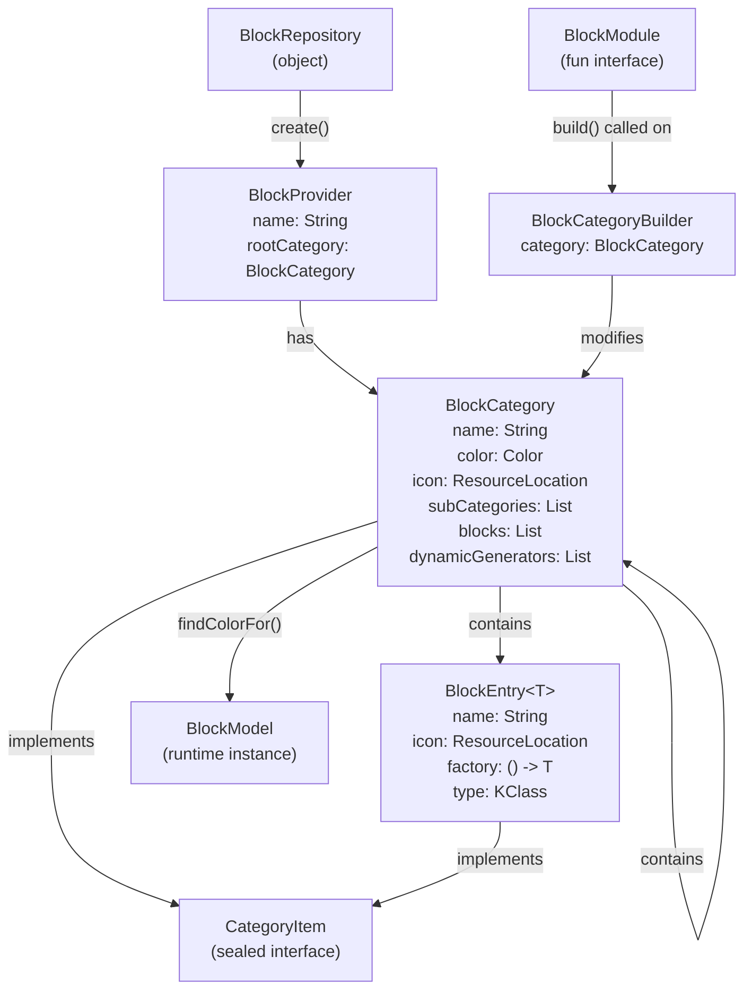
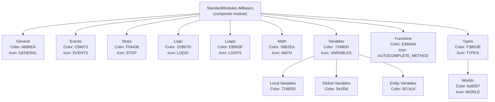
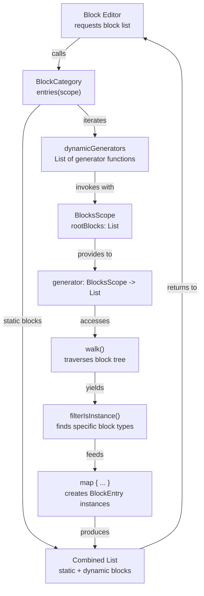

# Block Repository and Modules

<details>
<summary>Relevant source files</summary>

The following files were used as context for generating this wiki page:

- [src/main/java/ru/hollowhorizon/hollowengine/client/gui/codeblocks/BlockController.kt](src/main/java/ru/hollowhorizon/hollowengine/client/gui/codeblocks/BlockController.kt)
- [src/main/java/ru/hollowhorizon/hollowengine/client/gui/codeblocks/BlocksPanel.kt](src/main/java/ru/hollowhorizon/hollowengine/client/gui/codeblocks/BlocksPanel.kt)
- [src/main/java/ru/hollowhorizon/hollowengine/client/gui/codeblocks/DragState.kt](src/main/java/ru/hollowhorizon/hollowengine/client/gui/codeblocks/DragState.kt)
- [src/main/java/ru/hollowhorizon/hollowengine/client/gui/kool/KeyHandlerNode.kt](src/main/java/ru/hollowhorizon/hollowengine/client/gui/kool/KeyHandlerNode.kt)
- [src/main/java/ru/hollowhorizon/hollowengine/client/gui/scripting/files/codeblocks/CodeBlocksFile.kt](src/main/java/ru/hollowhorizon/hollowengine/client/gui/scripting/files/codeblocks/CodeBlocksFile.kt)
- [src/main/java/ru/hollowhorizon/hollowengine/client/kool/KoolHooks.java](src/main/java/ru/hollowhorizon/hollowengine/client/kool/KoolHooks.java)
- [src/main/java/ru/hollowhorizon/hollowengine/common/codeblocks/BlockRepository.kt](src/main/java/ru/hollowhorizon/hollowengine/common/codeblocks/BlockRepository.kt)
- [src/main/java/ru/hollowhorizon/hollowengine/common/codeblocks/model/BlockModel.kt](src/main/java/ru/hollowhorizon/hollowengine/common/codeblocks/model/BlockModel.kt)

</details>


## Purpose and Scope

This document describes the organizational structure of the block programming system, specifically how blocks are grouped into categories and modules for presentation in the Block Editor UI. The module system provides a hierarchical way to organize blocks by functionality, making them discoverable and reusable across different projects.

For information about the base block types and inheritance hierarchy, see [Block System Architecture](#6.1). For details on specific block implementations, see [Math and Logic Blocks](#6.3) through [Type and Value Blocks](#6.8). For information about how blocks are executed at runtime, see [Block Interpreter and Execution](#6.9).

---

## System Architecture

The block repository system consists of three layers:

1. **Registration Layer**: `BlockRepository` creates `BlockProvider` instances that define entire block libraries
2. **Organization Layer**: `BlockCategory` and `BlockEntry` organize blocks into hierarchical menus
3. **Builder Layer**: `BlockModule` and `BlockCategoryBuilder` provide a DSL for defining block collections

### Block Repository Architecture



**Diagram: Core component relationships in the block repository system**

Sources: [src/main/java/ru/hollowhorizon/hollowengine/common/codeblocks/BlockRepository.kt:1-101]()

---

## Core Components

### BlockProvider

The `BlockProvider` class represents a complete library of blocks with a hierarchical category structure.

```kotlin
open class BlockProvider(val name: String, val rootCategory: BlockCategory)
```

**Key Responsibilities:**
- Serves as the top-level container for a block library
- Provides the root `BlockCategory` from which all subcategories descend
- Offers `findColorFor()` extension function to determine block colors based on category membership

Sources: [src/main/java/ru/hollowhorizon/hollowengine/common/codeblocks/BlockRepository.kt:10-16]()

---

### BlockCategory

The `BlockCategory` class represents a hierarchical category in the block palette, capable of containing both subcategories and block entries.

**Properties:**

| Property | Type | Description |
|----------|------|-------------|
| `name` | `String` | Display name of the category |
| `color` | `Color` | Color used for blocks in this category |
| `icon` | `ResourceLocation?` | Optional icon for the category |
| `isExpanded` | `MutableState<Boolean>` | UI state tracking if category is expanded |
| `subCategories` | `MutableList<BlockCategory>` | Child categories |
| `blocks` | `MutableList<BlockEntry<*>>` | Direct block entries |
| `dynamicGenerators` | `MutableList<...>` | Functions that generate blocks dynamically |

**Key Methods:**

```kotlin
fun entries(scope: BlocksScope): List<BlockEntry<*>>
fun items(scope: BlocksScope): List<CategoryItem>
fun findColorFor(block: BlockModel): Color?
```

- `entries()`: Returns all blocks (static + dynamically generated) in this category
- `items()`: Returns all items (subcategories + blocks) for display in the UI
- `findColorFor()`: Recursively searches for the appropriate color for a given block instance

Sources: [src/main/java/ru/hollowhorizon/hollowengine/common/codeblocks/BlockRepository.kt:18-26]()

---

### BlockEntry

The `BlockEntry<T>` class represents a single block type that can be instantiated in the editor.

```kotlin
data class BlockEntry<T : BlockModel>(
    val name: String,
    val icon: ResourceLocation? = null,
    private val factory: () -> T,
    val type: KClass<T>,
)
```

**Key Properties:**
- `previewItem`: Lazily created instance used for UI preview (created via `factory()`)
- `createItem()`: Creates a new instance for actual use in the block graph

The factory function allows blocks to be instantiated with initial state when dragged into the editor.

Sources: [src/main/java/ru/hollowhorizon/hollowengine/common/codeblocks/BlockRepository.kt:30-39]()

---

### BlockModule

The `BlockModule` is a functional interface that defines a reusable collection of categories and blocks.

```kotlin
fun interface BlockModule {
    fun BlockCategoryBuilder.build()
}
```

Modules are implemented as lambda functions that receive a `BlockCategoryBuilder` and populate it with categories and blocks. This allows modules to be composed and reused.

Sources: [src/main/java/ru/hollowhorizon/hollowengine/common/codeblocks/BlockRepository.kt:41-43]()

---

### BlockCategoryBuilder

The `BlockCategoryBuilder` class provides a DSL for defining block categories and entries.

**Core Methods:**

| Method | Description |
|--------|-------------|
| `category(name, color, icon, setup)` | Creates a subcategory at the end |
| `categoryAfter(index, name, color, icon, setup)` | Creates a subcategory at specific position |
| `block<T>(name, factory)` | Adds a block entry (inherits category color) |
| `blockWithColor<T>(name, color, factory)` | Adds a block entry with custom color |
| `dynamicBlocks(generator)` | Registers a dynamic block generator |
| `include(module)` | Includes another `BlockModule` |

**Example Usage Pattern:**

```kotlin
val myModule: BlockModule = {
    category("Operations", Color.BLUE, icon) {
        block("Add") { AddBlock() }
        block("Subtract") { SubtractBlock() }
    }
}
```

Sources: [src/main/java/ru/hollowhorizon/hollowengine/common/codeblocks/BlockRepository.kt:45-92]()

---

### BlockRepository

The `BlockRepository` object provides a factory method for creating `BlockProvider` instances.

```kotlin
object BlockRepository {
    fun create(name: String, color: Color = Color("A666EA"), setup: BlockModule): BlockProvider
}
```

This method:
1. Creates a root `BlockCategory` with the given name and color
2. Creates a `BlockCategoryBuilder` for that category
3. Invokes the `setup` module's `build()` function
4. Returns a new `BlockProvider` wrapping the populated category

Sources: [src/main/java/ru/hollowhorizon/hollowengine/common/codeblocks/BlockRepository.kt:94-101]()

---

## Standard Modules

HollowEngine provides a comprehensive set of standard modules in `StandardModules` object. These modules define the default block palette available in the Block Editor.

### Module Hierarchy



**Diagram: Standard module hierarchy showing categories and subcategories**

Sources: [src/main/java/ru/hollowhorizon/hollowengine/common/codeblocks/modules/StandardModules.kt:21-191]()

---

### Module Details

#### General Module

Contains general-purpose utility blocks:
- **Вывод** (Output): `PrintBlock` - logs messages
- **Ждать** (Wait): `DelayBlock` - delays execution
- **Выполнить команду** (Execute Command): `ExecuteCommandBlock` - runs server commands

Sources: [src/main/java/ru/hollowhorizon/hollowengine/common/codeblocks/modules/StandardModules.kt:22-28]()

---

#### Math Module

Contains mathematical operation blocks:
- **Операция** (Operation): `MathBlock` - arithmetic operations (+, -, *, /)
- **Случайное число** (Random Number): `RandomNumberBlock` - random value in range
- **Тригонометрия** (Trigonometry): `TrigonometryBlock` - sin, cos, tan, etc.
- Vector operations: distance, length, normalize, component access
- Mathematical constants: π, e

Sources: [src/main/java/ru/hollowhorizon/hollowengine/common/codeblocks/modules/StandardModules.kt:30-47]()

---

#### Logic Module

Contains conditional and logical blocks:
- **Если/Иначе** (If/Else): `IfElseBlock` - branching with else clause
- **Если** (If): `IfBlock` - simple conditional
- **Сравнение** (Comparison): `CompareBlock` - numeric comparisons (==, !=, >, <, >=, <=)
- **Логические операторы** (Logic Operators): `LogicBlock` - AND, OR operations
- **Не** (Not): `NotBlock` - boolean negation
- **Тест** (Test): `TestBlock` - ternary-style conditional expression

Note: `CompareBlock` and `LogicBlock` use custom color `3C44A0` instead of category color.

Sources: [src/main/java/ru/hollowhorizon/hollowengine/common/codeblocks/modules/StandardModules.kt:49-58]()

---

#### Types Module

Contains blocks for creating typed values:
- **Строка** (String): `StringValueBlock` - string literals
- **Число** (Number): `NumberBlock` - numeric literals
- **Логический тип** (Boolean): `BoolBlock` - boolean values
- **Координаты** (Position): `PositionBlock` - Vec3 positions
- **Координаты блока** (Block Position): `BlockPosBlock` - block coordinates
- **Получить игрока** (Get Player): `GetPlayerByNameBlock` - player lookup
- Text components: `TextComponentBlock`, `TextMergerBlock`
- **Worlds** subcategory: Overworld, Nether, The End dimension access

Sources: [src/main/java/ru/hollowhorizon/hollowengine/common/codeblocks/modules/StandardModules.kt:60-79]()

---

#### Variables Module

Provides three variable scopes, each with get/set blocks and dynamic inline getters:

**Local Variables** (color: `7248DD`)
- **Присвоить** (Set): `SetVarBlock` - creates/updates local variable
- **Получить** (Get): `GetVarBlock` - retrieves local variable
- Dynamic blocks: Auto-generates getter blocks for each named local variable

**Global Variables** (color: `5e1f0d`)
- **Присвоить** (Set): `SetGlobalVarBlock` - creates/updates global variable
- **Получить** (Get): `GetGlobalVarBlock` - retrieves global variable
- Dynamic blocks: Auto-generates getter blocks for each named global variable

**Entity Variables** (color: `007a1d`)
- **Присвоить** (Set): `SetEntityVarBlock` - stores data on entity
- **Получить** (Get): `GetEntityVarBlock` - retrieves entity data
- Dynamic blocks: Auto-generates getter blocks for each named entity variable

Sources: [src/main/java/ru/hollowhorizon/hollowengine/common/codeblocks/modules/StandardModules.kt:81-137]()

---

#### Functions Module

Contains blocks for defining and calling custom functions:
- **Создать функцию** (Create Function): `CustomBlock` - defines a reusable function
- Dynamic blocks: Auto-generates `CallCustomBlock` for each defined function

The dynamic generator scans all root blocks, finds `CustomBlock` instances with non-empty names, and creates corresponding call blocks.

Sources: [src/main/java/ru/hollowhorizon/hollowengine/common/codeblocks/modules/StandardModules.kt:139-154]()

---

#### Events Module

Contains event-related blocks:
- **При запуске** (On Start): `OnStartBlock` - executes when script starts
- Commented-out blocks for future implementation: `OnEventBlock`, `SendEventBlock`, `OnPlayerJoinBlock`, `OnPlayerDeathBlock`

Sources: [src/main/java/ru/hollowhorizon/hollowengine/common/codeblocks/modules/StandardModules.kt:156-165]()

---

#### Stops Module

Contains blocks for terminating script execution:
- **Завершить скрипт** (Stop Script): `StopBlock` - unconditional termination
- **Завершить скрипт, если** (Stop If): `StopIfBlock` - conditional termination

Sources: [src/main/java/ru/hollowhorizon/hollowengine/common/codeblocks/modules/StandardModules.kt:167-172]()

---

#### Loops Module

Contains iteration and repetition blocks:
- **Пока** (While): `WhileBlock` - condition-based loop
- **Повторить** (Repeat): `RepeatBlock` - count-based loop

Sources: [src/main/java/ru/hollowhorizon/hollowengine/common/codeblocks/modules/StandardModules.kt:174-179]()

---

#### AllBasics Module

A composite module that includes all standard modules:

```kotlin
val AllBasics: BlockModule = {
    include(General)
    include(Events)
    include(Stops)
    include(Logic)
    include(Loops)
    include(Math)
    include(Variables)
    include(Functions)
    include(Types)
}
```

This provides a convenient way to import the entire standard library at once.

Sources: [src/main/java/ru/hollowhorizon/hollowengine/common/codeblocks/modules/StandardModules.kt:181-191]()

---

## Dynamic Block Generation

Dynamic block generation allows blocks to be generated programmatically based on the current state of the block graph. This is used extensively for creating context-aware block palettes.

### Dynamic Generator Flow



**Diagram: Dynamic block generation flow from category to final block list**

### Dynamic Generator Examples

#### Local Variable Getters

```kotlin
dynamicBlocks {
    rootBlocks.flatMap { it.walk() }.filterIsInstance<SetVarBlock>()
        .filter { it.variableName.isNotEmpty() }
        .map {
            BlockEntry(
                "Получить ${it.variableName}",
                null,
                { GetVarInlineBlock(it.variableName).also { it.color = Color("7248DD") } },
                GetVarInlineBlock::class
            )
        }
}
```

This generator:
1. Walks all blocks in the graph via `rootBlocks.flatMap { it.walk() }`
2. Filters for `SetVarBlock` instances
3. Filters for blocks with non-empty variable names
4. Creates a `GetVarInlineBlock` entry for each variable

The result is that whenever a user creates a variable with `SetVarBlock`, a corresponding getter block automatically appears in the palette.

Sources: [src/main/java/ru/hollowhorizon/hollowengine/common/codeblocks/modules/StandardModules.kt:87-98]()

---

#### Custom Function Calls

```kotlin
dynamicBlocks {
    rootBlocks.filterIsInstance<CustomBlock>().filter { it.function.isNotEmpty() }.map {
        BlockEntry(
            "Вызвать ${it.function}",
            null,
            { CallCustomBlock(it.function).also { it.color = Color("EA6A5A") } },
            CallCustomBlock::class
        )
    }
}
```

This generator:
1. Filters root blocks for `CustomBlock` instances (function definitions)
2. Filters for blocks with non-empty function names
3. Creates a `CallCustomBlock` entry for each defined function

This enables a "define once, call anywhere" pattern where function definitions automatically create call blocks.

Sources: [src/main/java/ru/hollowhorizon/hollowengine/common/codeblocks/modules/StandardModules.kt:143-152]()

---

## Creating Custom Modules

To create a custom module, define a `BlockModule` lambda and use the DSL:

```kotlin
val MyCustomModule: BlockModule = {
    category("My Category", Color("FF5733"), icons.GENERAL) {
        block("My Block") { MyBlock() }
        
        category("Subcategory", Color("33FF57"), null) {
            block("Another Block") { AnotherBlock() }
        }
        
        dynamicBlocks {
            // Generate blocks based on current graph state
            rootBlocks.filterIsInstance<SomeBlock>().map { ... }
        }
    }
}
```

### Module Composition

Modules can be composed using `include()`:

```kotlin
val CompositeModule: BlockModule = {
    include(MyCustomModule)
    include(StandardModules.Math)
    category("Additional", Color.BLUE, null) {
        block("Extra Block") { ExtraBlock() }
    }
}
```

### Registering with BlockRepository

Create a `BlockProvider` using the module:

```kotlin
val provider = BlockRepository.create(
    name = "My Block Library",
    color = Color("A666EA"),
    setup = CompositeModule
)
```

The provider can then be used by the Block Editor to populate the block palette.

Sources: [src/main/java/ru/hollowhorizon/hollowengine/common/codeblocks/BlockRepository.kt:94-101]()

---

## Color Inheritance System

Blocks inherit colors from their containing category unless explicitly overridden:

```kotlin
block("Inherits Color") { MyBlock() }  // Uses category color
blockWithColor("Custom Color", Color.RED) { MyBlock() }  // Uses RED
```

The `findColorFor()` extension function recursively searches the category hierarchy to determine the appropriate color for a block instance based on its type:

```kotlin
fun BlockCategory.findColorFor(block: BlockModel): Color? {
    return if (block::class in blocks.map { it.type }) color
    else subCategories.firstNotNullOfOrNull { it.findColorFor(block) }
}
```

This allows blocks to visually indicate their category membership in the editor.

Sources: [src/main/java/ru/hollowhorizon/hollowengine/common/codeblocks/BlockRepository.kt:12-16]()

---

## Summary

The block repository and module system provides:

1. **Hierarchical Organization**: Categories and subcategories organize blocks logically
2. **Reusable Modules**: `BlockModule` interface enables composable block libraries
3. **Dynamic Generation**: Blocks can be generated based on graph state
4. **Color Coding**: Visual organization through category colors
5. **Extensibility**: Custom modules can be created and composed with standard modules

This system bridges the gap between block implementations (covered in [Block System Architecture](#6.1)) and the Block Editor UI (covered in [Visual Block Editor](#5)), providing a flexible way to organize and present blocks to users.