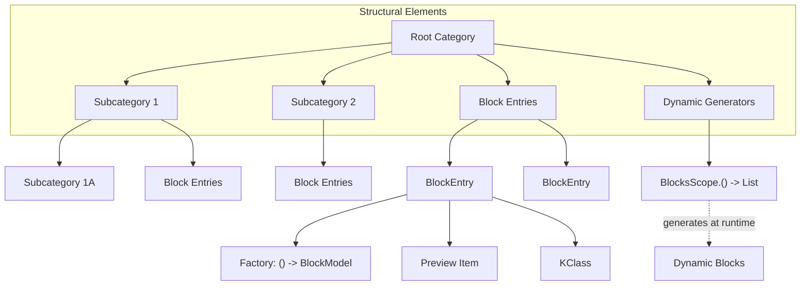
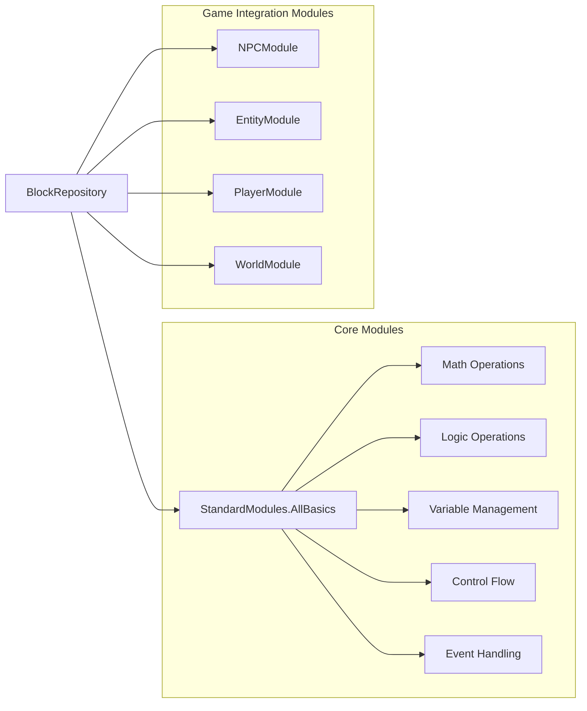
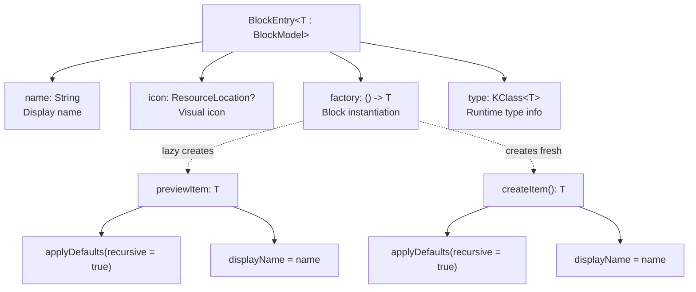
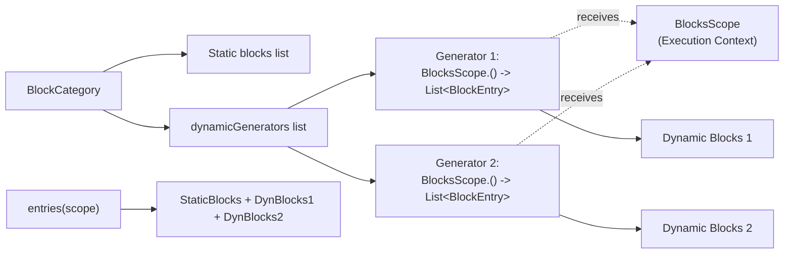
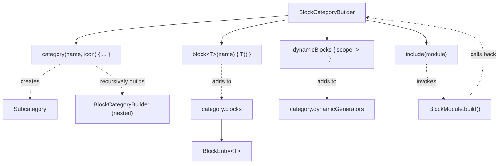
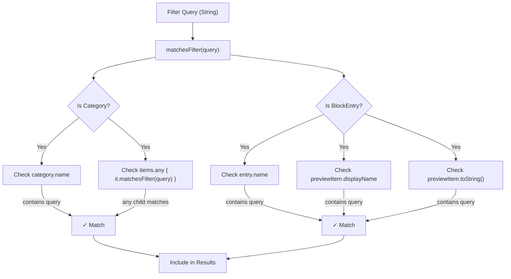
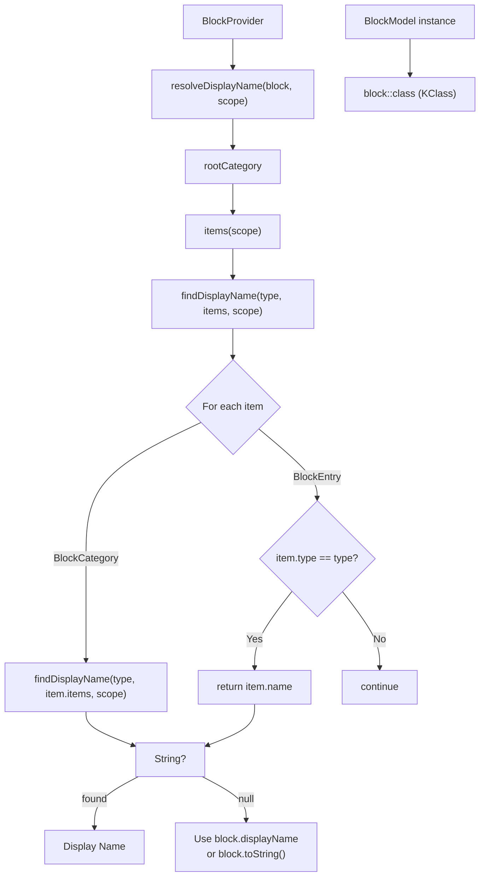
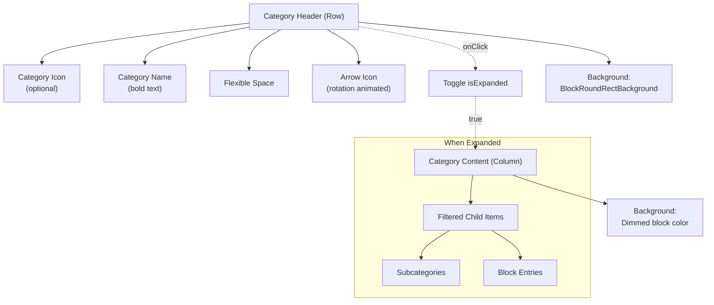

# Block Types and Categories

<details>
<summary>Relevant source files</summary>

The following files were used as context for generating this wiki page:

- [src/main/java/ru/hollowhorizon/hollowengine/client/gui/codeblocks/BlockController.kt](src/main/java/ru/hollowhorizon/hollowengine/client/gui/codeblocks/BlockController.kt)
- [src/main/java/ru/hollowhorizon/hollowengine/client/gui/codeblocks/BlocksPanel.kt](src/main/java/ru/hollowhorizon/hollowengine/client/gui/codeblocks/BlocksPanel.kt)
- [src/main/java/ru/hollowhorizon/hollowengine/client/gui/codeblocks/DragState.kt](src/main/java/ru/hollowhorizon/hollowengine/client/gui/codeblocks/DragState.kt)
- [src/main/java/ru/hollowhorizon/hollowengine/client/gui/kool/KeyHandlerNode.kt](src/main/java/ru/hollowhorizon/hollowengine/client/gui/kool/KeyHandlerNode.kt)
- [src/main/java/ru/hollowhorizon/hollowengine/client/gui/scripting/files/codeblocks/CodeBlocksFile.kt](src/main/java/ru/hollowhorizon/hollowengine/client/gui/scripting/files/codeblocks/CodeBlocksFile.kt)
- [src/main/java/ru/hollowhorizon/hollowengine/client/kool/KoolHooks.java](src/main/java/ru/hollowhorizon/hollowengine/client/kool/KoolHooks.java)
- [src/main/java/ru/hollowhorizon/hollowengine/common/codeblocks/BlockRepository.kt](src/main/java/ru/hollowhorizon/hollowengine/common/codeblocks/BlockRepository.kt)
- [src/main/java/ru/hollowhorizon/hollowengine/common/codeblocks/model/BlockModel.kt](src/main/java/ru/hollowhorizon/hollowengine/common/codeblocks/model/BlockModel.kt)

</details>


This document provides an overview of the block types available in HollowEngine's visual programming system and how they are organized into categories. It covers the hierarchical category structure, standard module organization, and the block entry system.

For information about the underlying `BlockModel` architecture and block inheritance hierarchy, see [Block System Architecture](#6.1). For details on how to create and register custom blocks, see [Block Repository and Provisioning](#6.2). For information about the visual block editor UI, see [Visual Block Editor](#5).

---

## Category Hierarchy

The block system organizes blocks into a hierarchical category structure that allows for logical grouping and easy navigation. Each category can contain both blocks and subcategories, creating a tree-like organization.

### BlockCategory Structure

The `BlockCategory` class [src/main/java/ru/hollowhorizon/hollowengine/common/codeblocks/BlockRepository.kt:34-42]() defines the organizational structure:

| Property | Type | Purpose |
|----------|------|---------|
| `name` | `String` | Display name of the category |
| `icon` | `ResourceLocation?` | Optional icon for visual representation |
| `isExpanded` | `MutableState<Boolean>` | Tracks expansion state in UI |
| `subCategories` | `MutableList<BlockCategory>` | Nested subcategories |
| `blocks` | `MutableList<BlockEntry<*>>` | Block entries in this category |
| `dynamicGenerators` | `MutableList<BlocksScope.() -> List<BlockEntry<*>>>` | Context-sensitive block generators |



**Sources:** [src/main/java/ru/hollowhorizon/hollowengine/common/codeblocks/BlockRepository.kt:34-42]()

### Category Items

Categories can contain two types of items, unified under the `CategoryItem` sealed interface [src/main/java/ru/hollowhorizon/hollowengine/common/codeblocks/BlockRepository.kt:44]():

1. **Subcategories** (`BlockCategory`) - Nested organizational units
2. **Block Entries** (`BlockEntry<T>`) - Individual block definitions

The `items()` method [src/main/java/ru/hollowhorizon/hollowengine/common/codeblocks/BlockRepository.kt:41]() returns all items in a category, combining static subcategories with blocks generated from both static and dynamic sources:

```
items(scope) = subCategories + blocks + dynamicGenerators.flatMap { it(scope) }
```

**Sources:** [src/main/java/ru/hollowhorizon/hollowengine/common/codeblocks/BlockRepository.kt:34-42]()

---

## Standard Module Organization

HollowEngine organizes blocks into modular packages that can be included in a block repository. The standard configuration [src/main/java/ru/hollowhorizon/hollowengine/client/gui/scripting/files/codeblocks/CodeBlocksFile.kt:32-38]() includes:

```kotlin
val repository = BlockRepository.create("Скрипт") {
    include(StandardModules.AllBasics)
    include(NPCModule)
    include(EntityModule)
    include(PlayerModule)
    include(WorldModule)
}
```

### Module Types



**Sources:** [src/main/java/ru/hollowhorizon/hollowengine/client/gui/scripting/files/codeblocks/CodeBlocksFile.kt:32-38]()

### StandardModules.AllBasics

The `AllBasics` module aggregates fundamental programming constructs typically including:

- **Math Operations**: Arithmetic, comparison, numeric literals
- **Logic Operations**: Boolean operators, conditionals, comparisons
- **Variables**: Get/set variable blocks, variable declarations
- **Control Flow**: If/else blocks, loops, function calls
- **Events**: Event-driven start blocks, event handlers

These represent the core building blocks of any visual script.

### Game-Specific Modules

| Module | Purpose | Typical Block Types |
|--------|---------|---------------------|
| `NPCModule` | NPC entity manipulation | Spawn NPC, set name, configure attributes, AI behavior |
| `EntityModule` | General entity operations | Get entity, set position, entity properties, damage/healing |
| `PlayerModule` | Player-specific operations | Get player, inventory operations, give items, send messages |
| `WorldModule` | World interaction | Get block, set block, spawn particles, world time, weather |

**Sources:** [src/main/java/ru/hollowhorizon/hollowengine/client/gui/scripting/files/codeblocks/CodeBlocksFile.kt:32-38]()

---

## Block Entry System

Each block type is represented by a `BlockEntry<T>` that encapsulates the block's metadata and instantiation logic.

### BlockEntry Structure

[src/main/java/ru/hollowhorizon/hollowengine/common/codeblocks/BlockRepository.kt:46-63]()



**Sources:** [src/main/java/ru/hollowhorizon/hollowengine/common/codeblocks/BlockRepository.kt:46-63]()

### Preview vs Instance Creation

The `BlockEntry` provides two ways to obtain a block:

1. **Preview Item** (`previewItem`) [src/main/java/ru/hollowhorizon/hollowengine/common/codeblocks/BlockRepository.kt:52-57]()
   - Lazily created on first access
   - Reused for all UI preview renders in the blocks panel
   - Has display name and defaults applied
   - Read-only representation

2. **Create Item** (`createItem()`) [src/main/java/ru/hollowhorizon/hollowengine/common/codeblocks/BlockRepository.kt:59-62]()
   - Creates a fresh instance each time
   - Used when dragging blocks from panel to canvas
   - Each instance is independent and mutable
   - Used in actual scripts

The blocks panel [src/main/java/ru/hollowhorizon/hollowengine/client/gui/codeblocks/BlocksPanel.kt:68]() renders the `previewItem`, while drag operations [src/main/java/ru/hollowhorizon/hollowengine/client/gui/codeblocks/DragState.kt:29]() create new instances via `createItem()`.

**Sources:** [src/main/java/ru/hollowhorizon/hollowengine/common/codeblocks/BlockRepository.kt:46-63](), [src/main/java/ru/hollowhorizon/hollowengine/client/gui/codeblocks/BlocksPanel.kt:60-71](), [src/main/java/ru/hollowhorizon/hollowengine/client/gui/codeblocks/DragState.kt:17-21]()

---

## Dynamic Block Generation

The category system supports context-sensitive block generation through dynamic generators. This allows blocks to appear or disappear based on runtime state.

### Dynamic Generator Pattern

[src/main/java/ru/hollowhorizon/hollowengine/common/codeblocks/BlockRepository.kt:39-40]()



**Sources:** [src/main/java/ru/hollowhorizon/hollowengine/common/codeblocks/BlockRepository.kt:39-40]()

### BlocksScope Integration

Dynamic generators receive a `BlocksScope` instance, allowing them to:
- Query available variables in the current scope
- Generate blocks for specific entities or objects
- Create blocks based on loaded resources
- Adapt to player context or world state

Example usage in `BlockCategoryBuilder` [src/main/java/ru/hollowhorizon/hollowengine/common/codeblocks/BlockRepository.kt:93-95]():

```kotlin
fun dynamicBlocks(generator: BlocksScope.() -> List<BlockEntry<*>>) {
    category.dynamicGenerators.add(generator)
}
```

This enables scenarios like:
- **Variable Blocks**: Generate "Get Variable X" blocks for all variables currently in scope
- **Entity Blocks**: Generate "Get Entity [Name]" blocks for all loaded entities
- **Resource Blocks**: Generate blocks for available models, animations, or prefabs

**Sources:** [src/main/java/ru/hollowhorizon/hollowengine/common/codeblocks/BlockRepository.kt:39-40](), [src/main/java/ru/hollowhorizon/hollowengine/common/codeblocks/BlockRepository.kt:93-95]()

---

## Category Registration and Building

Categories are built using the builder pattern through `BlockCategoryBuilder`.

### Builder Methods

[src/main/java/ru/hollowhorizon/hollowengine/common/codeblocks/BlockRepository.kt:69-104]()

| Method | Purpose | Parameters |
|--------|---------|------------|
| `category()` | Create nested subcategory | `name: String`, `icon: ResourceLocation?`, `setup: Builder.() -> Unit` |
| `categoryAfter()` | Insert subcategory at index | `index: Int`, `name: String`, `icon: ResourceLocation?`, `setup: Builder.() -> Unit` |
| `block()` | Register inline reified block | `name: String`, `factory: () -> T` (reified type) |
| `dynamicBlocks()` | Add dynamic generator | `generator: BlocksScope.() -> List<BlockEntry<*>>` |
| `include()` | Include another module | `module: BlockModule` |



**Sources:** [src/main/java/ru/hollowhorizon/hollowengine/common/codeblocks/BlockRepository.kt:69-104]()

### Module Pattern

The `BlockModule` interface [src/main/java/ru/hollowhorizon/hollowengine/common/codeblocks/BlockRepository.kt:65-67]() enables reusable block collections:

```kotlin
fun interface BlockModule {
    fun BlockCategoryBuilder.build()
}
```

This allows modules to be composed and reused across different block providers. The `include()` method [src/main/java/ru/hollowhorizon/hollowengine/common/codeblocks/BlockRepository.kt:101-103]() invokes the module's `build()` function in the context of the current builder.

**Sources:** [src/main/java/ru/hollowhorizon/hollowengine/common/codeblocks/BlockRepository.kt:65-67](), [src/main/java/ru/hollowhorizon/hollowengine/common/codeblocks/BlockRepository.kt:101-103]()

---

## Category Filtering and Search

The blocks panel implements hierarchical filtering that searches through category names, block names, and block display names.

### Filter Algorithm

[src/main/java/ru/hollowhorizon/hollowengine/client/gui/codeblocks/BlocksPanel.kt:21-49]()



The `filteredItems()` method [src/main/java/ru/hollowhorizon/hollowengine/client/gui/codeblocks/BlocksPanel.kt:38-49]() returns only items that match the filter query, preserving category structure when child items match.

**Sources:** [src/main/java/ru/hollowhorizon/hollowengine/client/gui/codeblocks/BlocksPanel.kt:21-49]()

### Search Behavior

| Scenario | Behavior |
|----------|----------|
| Empty query | All categories and blocks visible |
| Category name match | Category and all children visible |
| Block name match | Block visible, parent category visible |
| Child block match | Parent category visible (for navigation) |
| Display name match | Block visible (uses localized name if available) |
| No matches | Category/block hidden |

The search is case-insensitive [src/main/java/ru/hollowhorizon/hollowengine/client/gui/codeblocks/BlocksPanel.kt:26]() and matches substrings anywhere in the searchable text.

**Sources:** [src/main/java/ru/hollowhorizon/hollowengine/client/gui/codeblocks/BlocksPanel.kt:38-49]()

---

## Block Provider and Display Names

The `BlockProvider` class manages the association between block types and their display names.

### Display Name Resolution

[src/main/java/ru/hollowhorizon/hollowengine/common/codeblocks/BlockRepository.kt:10-31]()



The `applyDisplayNames()` method [src/main/java/ru/hollowhorizon/hollowengine/common/codeblocks/BlockRepository.kt:15-19]() recursively traverses a block tree and assigns resolved display names to each block and its children.

**Sources:** [src/main/java/ru/hollowhorizon/hollowengine/common/codeblocks/BlockRepository.kt:10-31]()

### Usage in File Loading

When loading a code blocks file [src/main/java/ru/hollowhorizon/hollowengine/client/gui/scripting/files/codeblocks/CodeBlocksFile.kt:50-51](), display names are applied to restore user-friendly labels:

```kotlin
editor.rootBlocks.addAll(report.blocks)
editor.rootBlocks.forEach { repository.applyDisplayNames(it, editor) }
```

This ensures that blocks loaded from disk display their localized names rather than raw class names.

**Sources:** [src/main/java/ru/hollowhorizon/hollowengine/client/gui/scripting/files/codeblocks/CodeBlocksFile.kt:50-51]()

---

## Category UI Presentation

Categories are rendered in the blocks panel with visual styling and expansion behavior.

### Visual Elements

[src/main/java/ru/hollowhorizon/hollowengine/client/gui/codeblocks/BlocksPanel.kt:74-151]()

| Element | Purpose | Source |
|---------|---------|--------|
| Category Header | Clickable bar with name and icon | Derived from first block's color |
| Arrow Icon | Expansion state indicator | Rotates based on `isExpanded` |
| Block Color | Visual theme | Uses first block's `color` property |
| Nested Content | Child categories and blocks | Accordion animation based on expansion |
| Background | Semi-transparent overlay | Mixes block color with theme background |



The expansion animation [src/main/java/ru/hollowhorizon/hollowengine/client/gui/codeblocks/BlocksPanel.kt:137-150]() uses `AccordionColumnLayout` to smoothly reveal/hide category contents.

**Sources:** [src/main/java/ru/hollowhorizon/hollowengine/client/gui/codeblocks/BlocksPanel.kt:74-151]()