# Block Execution Runtime

<details>
<summary>Relevant source files</summary>

The following files were used as context for generating this wiki page:

- [src/main/java/ru/hollowhorizon/hollowengine/common/codeblocks/blocks/players/OnPlayerChatBlock.kt](src/main/java/ru/hollowhorizon/hollowengine/common/codeblocks/blocks/players/OnPlayerChatBlock.kt)
- [src/main/java/ru/hollowhorizon/hollowengine/common/codeblocks/execution/BlockFrameStackElement.kt](src/main/java/ru/hollowhorizon/hollowengine/common/codeblocks/execution/BlockFrameStackElement.kt)
- [src/main/java/ru/hollowhorizon/hollowengine/common/codeblocks/execution/CodeBlockInterpreter.kt](src/main/java/ru/hollowhorizon/hollowengine/common/codeblocks/execution/CodeBlockInterpreter.kt)
- [src/main/java/ru/hollowhorizon/hollowengine/common/codeblocks/runtime/BlocksSystem.kt](src/main/java/ru/hollowhorizon/hollowengine/common/codeblocks/runtime/BlocksSystem.kt)
- [src/main/java/ru/hollowhorizon/hollowengine/common/codeblocks/runtime/BlocksSystemSavedData.kt](src/main/java/ru/hollowhorizon/hollowengine/common/codeblocks/runtime/BlocksSystemSavedData.kt)
- [src/main/java/ru/hollowhorizon/hollowengine/common/codeblocks/runtime/OwnerScopeRestoredEvent.kt](src/main/java/ru/hollowhorizon/hollowengine/common/codeblocks/runtime/OwnerScopeRestoredEvent.kt)
- [src/main/java/ru/hollowhorizon/hollowengine/common/codeblocks/runtime/ScriptFile.kt](src/main/java/ru/hollowhorizon/hollowengine/common/codeblocks/runtime/ScriptFile.kt)
- [src/main/java/ru/hollowhorizon/hollowengine/common/codeblocks/runtime/ScriptInstance.kt](src/main/java/ru/hollowhorizon/hollowengine/common/codeblocks/runtime/ScriptInstance.kt)
- [src/main/java/ru/hollowhorizon/hollowengine/common/commands/HollowEngineCommands.kt](src/main/java/ru/hollowhorizon/hollowengine/common/commands/HollowEngineCommands.kt)
- [src/main/java/ru/hollowhorizon/hollowengine/common/coroutines/EntityScope.kt](src/main/java/ru/hollowhorizon/hollowengine/common/coroutines/EntityScope.kt)
- [src/main/java/ru/hollowhorizon/hollowengine/common/coroutines/SingleThreadDispatcher.kt](src/main/java/ru/hollowhorizon/hollowengine/common/coroutines/SingleThreadDispatcher.kt)
- [src/main/java/ru/hollowhorizon/hollowengine/common/dev/DevLogger.kt](src/main/java/ru/hollowhorizon/hollowengine/common/dev/DevLogger.kt)
- [src/main/java/ru/hollowhorizon/hollowengine/mixins/components/EntityMixin.java](src/main/java/ru/hollowhorizon/hollowengine/mixins/components/EntityMixin.java)
- [src/test/kotlin/CodeBlockExecutionCoreTests.kt](src/test/kotlin/CodeBlockExecutionCoreTests.kt)
- [src/test/kotlin/ScriptExecutionLifecycleTests.kt](src/test/kotlin/ScriptExecutionLifecycleTests.kt)

</details>


## Purpose and Scope

This document describes the runtime execution system that interprets and runs code blocks. It covers the core interpreter classes (`CodeBlockInterpreter`, `ExpressionBlockInterpreter`), the execution context management (`BlockFrameStackElement`, `BlockFrame`), and how block execution state is serialized and resumed.

For information about the block type definitions and hierarchy, see [Block System Architecture](#6.1). For the overall script lifecycle and management, see [Execution Architecture](#7.1). For the visual editor that creates block graphs, see [Visual Block Editor](#5).

---

## Execution Architecture Overview

The block execution runtime consists of three primary layers that work together to execute block graphs:

**Core Interpreter Layer**

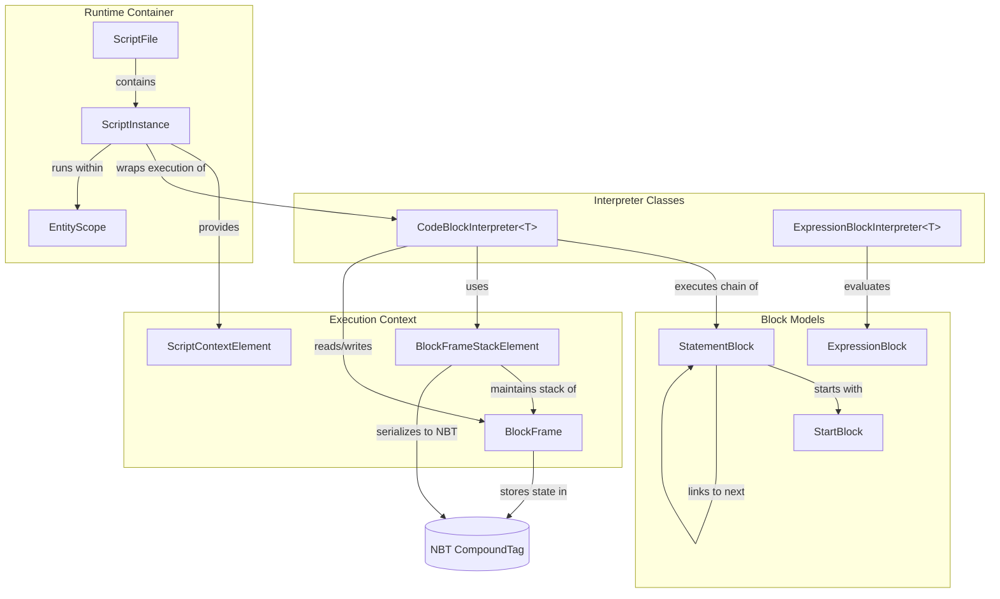

**Sources:** [src/main/java/ru/hollowhorizon/hollowengine/common/codeblocks/execution/CodeBlockInterpreter.kt:1-45](), [src/main/java/ru/hollowhorizon/hollowengine/common/codeblocks/execution/BlockFrameStackElement.kt:1-70](), [src/main/java/ru/hollowhorizon/hollowengine/common/codeblocks/runtime/ScriptInstance.kt:1-225]()

---

## CodeBlockInterpreter

The `CodeBlockInterpreter<T>` class is responsible for executing chains of `StatementBlock` instances. It traverses the block graph by following `next` pointers and manages execution state through a `BlockFrame`.

### Statement Chain Execution

```mermaid
graph LR
    Start["root: StatementBlock"]
    Frame["BlockFrame.tag"]
    UUID["tag.getUUID('uuid')"]
    Find["root.find(uuid)"]
    Current["current: StatementBlock?"]
    Execute["scoped { block.execute() }"]
    Next["current = current.next"]
    Mark["tag.putUUID('uuid', current.uuid)"]
    
    Start -->|"check resume point"| Frame
    Frame -->|"contains 'uuid'?"| UUID
    UUID -->|"yes"| Find
    UUID -->|"no"| Current
    Find -->|"resume from"| Current
    
    Current -->|"while not null"| Mark
    Mark -->|"update frame"| Execute
    Execute -->|"then"| Next
    Next -->|"loop"| Current
```

**Key Execution Steps:**

1. **Resume Detection**: Check if `BlockFrame.tag` contains a `"uuid"` key
2. **Block Location**: If resuming, find the block with that UUID; otherwise start from root
3. **Loop**: While current block exists:
   - Store current block UUID in frame: `tag.putUUID("uuid", current.uuid)`
   - Update `ScriptInstance.currentBlockId` for debugging
   - Execute block within `scoped` context
   - Move to next block: `current = current.next`

**Sources:** [src/main/java/ru/hollowhorizon/hollowengine/common/codeblocks/execution/CodeBlockInterpreter.kt:21-44]()

### Interpreter Usage Pattern

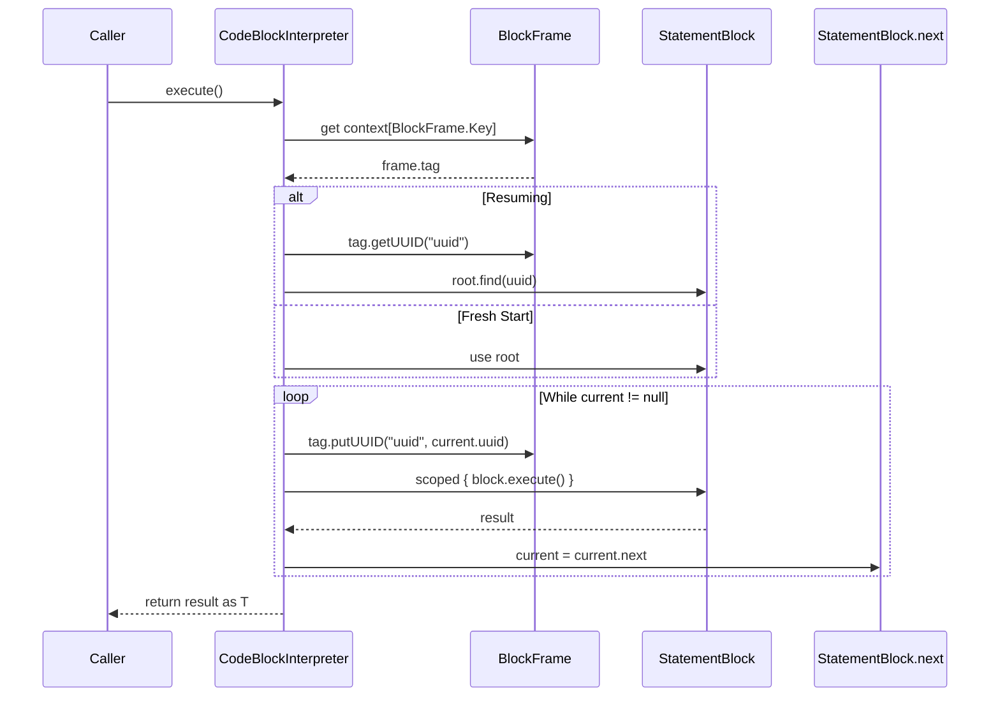

**Sources:** [src/main/java/ru/hollowhorizon/hollowengine/common/codeblocks/execution/CodeBlockInterpreter.kt:21-44]()

---

## ExpressionBlockInterpreter

The `ExpressionBlockInterpreter<T>` class evaluates `ExpressionBlock` instances to produce typed values. Unlike statement execution, expression evaluation is single-step and returns a value immediately.

### Expression Evaluation

| Component | Purpose |
|-----------|---------|
| `expression: ExpressionBlock` | The block to evaluate |
| `execute(): T` | Invokes `expression.execute()` and casts result to `T` |
| Type Parameter `T` | Expected return type (e.g., `Number`, `String`, `Boolean`) |

**Example Expression Evaluation:**

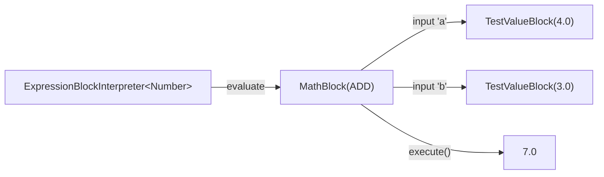

**Sources:** [src/main/java/ru/hollowhorizon/hollowengine/common/codeblocks/execution/CodeBlockInterpreter.kt:15-19](), [src/test/kotlin/CodeBlockExecutionCoreTests.kt:313-330]()

---

## Frame Stack Management

The `BlockFrameStackElement` maintains a stack of `BlockFrame` instances that provide isolated state storage for nested block execution contexts (e.g., inside loops, conditionals, or function calls).

### BlockFrameStackElement Structure

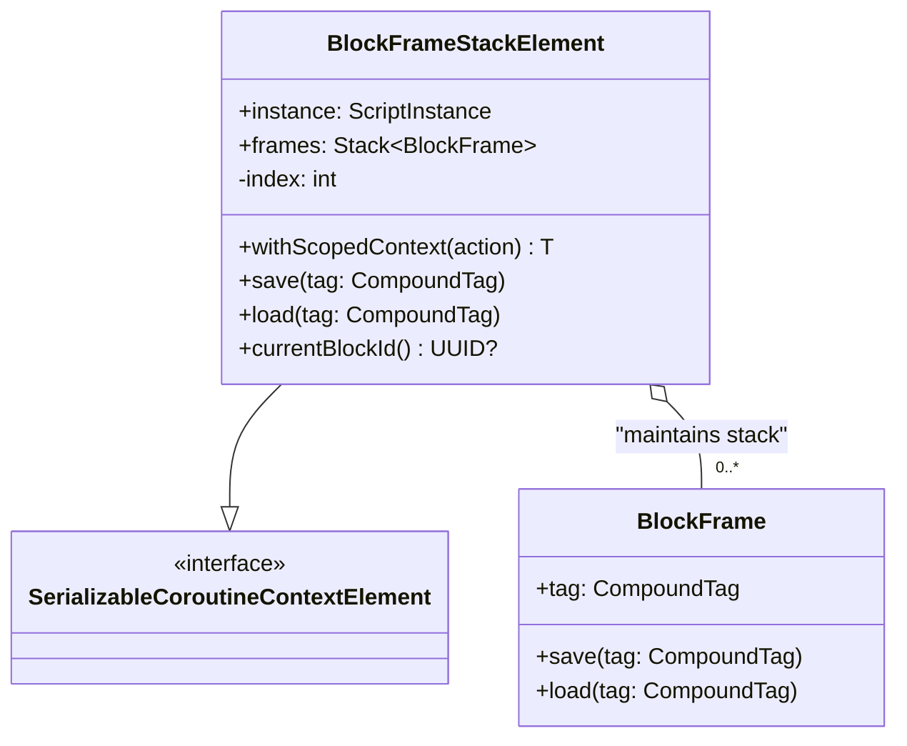

**Sources:** [src/main/java/ru/hollowhorizon/hollowengine/common/codeblocks/execution/BlockFrameStackElement.kt:1-70]()

### Frame Stack Operations

The stack grows when entering nested contexts (via `scoped()`) and shrinks when exiting:

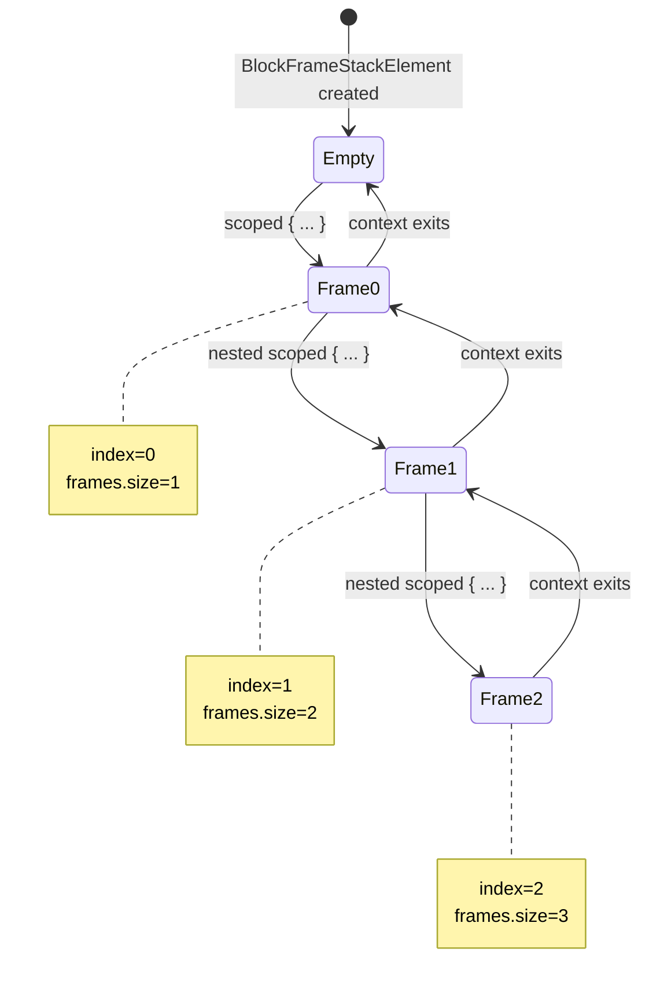

**Key Behaviors:**

| Operation | Implementation |
|-----------|----------------|
| **Enter Scope** | If `index < frames.size`, reuse existing frame; else push new `BlockFrame()` |
| **Execute** | Increment `index`, execute action with frame in context, decrement `index` |
| **Exit Scope** | If coroutine is active, pop frame; otherwise preserve for serialization |
| **Serialize** | Save all frames to `ListTag` in NBT |
| **Deserialize** | Load frames from NBT and restore stack |

**Sources:** [src/main/java/ru/hollowhorizon/hollowengine/common/codeblocks/execution/BlockFrameStackElement.kt:25-54]()

---

## Execution Context

The `scoped()` function creates nested execution contexts with isolated state storage. Each scope has its own `BlockFrame` that can store arbitrary data via the `remember()` and `forget()` functions.

### Scoped Context Flow

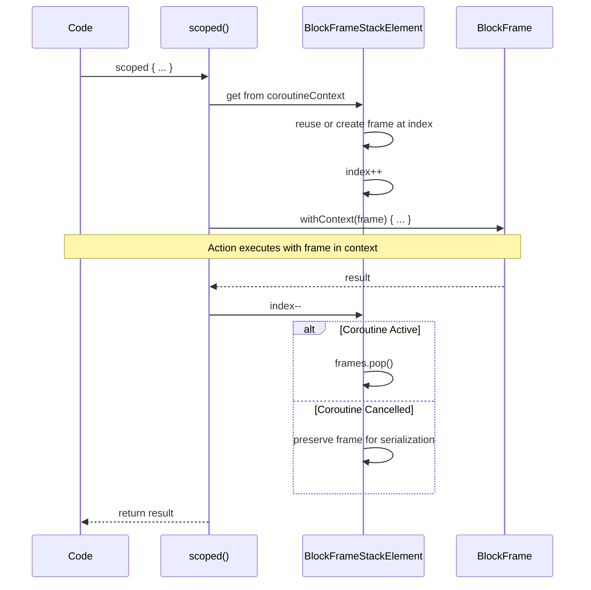

**Sources:** [src/main/java/ru/hollowhorizon/hollowengine/common/codeblocks/execution/BlockFrameStackElement.kt:62-69](), [src/main/java/ru/hollowhorizon/hollowengine/common/codeblocks/execution/BlockFrameStackElement.kt:25-42]()

### State Storage with remember() and forget()

Blocks use `remember()` to cache values in the current frame and `forget()` to clear them:

```kotlin
// Example from RepeatBlock
val times: Int = remember("times") {
    timeExpression.evaluateAs<Number>().toInt()
}

val index: Int = remember("index") { 0 }
```

**remember/forget Behavior:**

| Function | Signature | Behavior |
|----------|-----------|----------|
| `remember<T>(key, default)` | `(String, () -> T) -> T` | Return `frame.tag[key]` if exists, else compute `default()`, store, and return |
| `forget(key)` | `(String) -> Boolean` | Remove `key` from `frame.tag`, return true if existed |

**Sources:** [src/test/kotlin/CodeBlockExecutionCoreTests.kt:139-148](), [src/main/java/ru/hollowhorizon/hollowengine/common/codeblocks/blocks/RepeatBlock.kt]()

---

## State Persistence

The execution runtime supports serializing and resuming block execution mid-chain. This enables:
- Scripts to survive server restarts
- Entity-bound scripts to suspend when entities unload and resume when they reload
- Debugging and inspection of running scripts

### Serialization Flow

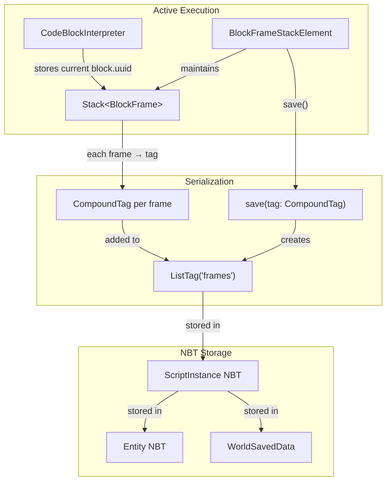

**Sources:** [src/main/java/ru/hollowhorizon/hollowengine/common/codeblocks/execution/BlockFrameStackElement.kt:44-54](), [src/main/java/ru/hollowhorizon/hollowengine/common/codeblocks/runtime/ScriptInstance.kt:188-207]()

### Resumption Flow

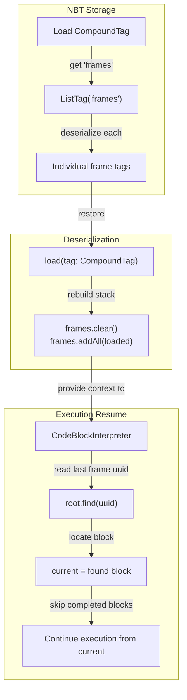

**Key Persistence Points:**

| Component | Serialization Data |
|-----------|-------------------|
| `BlockFrameStackElement` | List of frame tags with all `remember()` data |
| `BlockFrame` | Current block UUID (`"uuid"`) and key-value state |
| `CodeBlockInterpreter` | Reads `"uuid"` from frame to determine resume point |
| `ScriptInstance` | Instance ID, owner entity ID, root block ID, local variables, stack snapshot |

**Sources:** [src/main/java/ru/hollowhorizon/hollowengine/common/codeblocks/execution/BlockFrameStackElement.kt:50-54](), [src/main/java/ru/hollowhorizon/hollowengine/common/codeblocks/execution/CodeBlockInterpreter.kt:28-30](), [src/main/java/ru/hollowhorizon/hollowengine/common/codeblocks/runtime/ScriptInstance.kt:188-215]()

---

## Execution Flow Examples

### Example 1: Linear Chain Execution

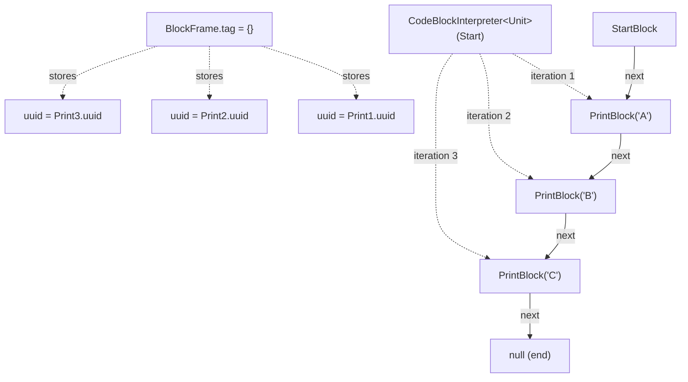

**Execution Sequence:**

1. `CodeBlockInterpreter.execute()` called with `root = StartBlock`
2. No UUID in frame → `current = StartBlock`
3. Store `StartBlock.uuid` in frame, execute, move to `Print1`
4. Store `Print1.uuid` in frame, execute, move to `Print2`
5. Store `Print2.uuid` in frame, execute, move to `Print3`
6. Store `Print3.uuid` in frame, execute, move to `null`
7. Loop ends, return result

**Sources:** [src/test/kotlin/CodeBlockExecutionCoreTests.kt:152-164]()

### Example 2: Resumed Execution

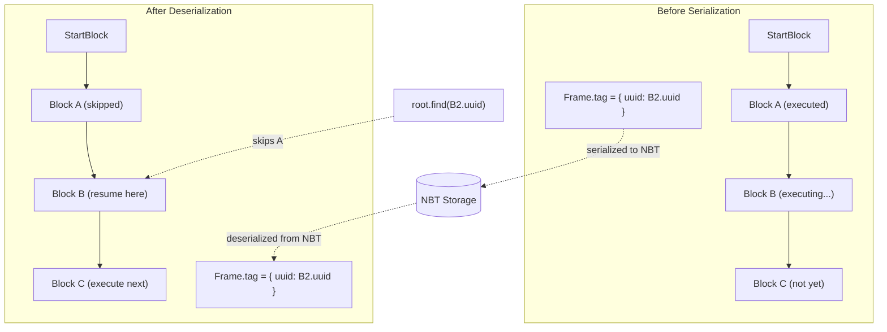

**Execution Sequence:**

1. Load frame from NBT containing `uuid = B2.uuid`
2. `CodeBlockInterpreter.execute()` called with `root = StartBlock`
3. Frame contains UUID → `current = root.find(B2.uuid)` → finds Block B
4. Store `B2.uuid` in frame, execute B, move to Block C
5. Store `C.uuid` in frame, execute C, move to `null`
6. Loop ends, return result

**Sources:** [src/test/kotlin/CodeBlockExecutionCoreTests.kt:167-182](), [src/test/kotlin/ScriptExecutionLifecycleTests.kt:171-204]()

### Example 3: Nested Execution with Scoped Frames

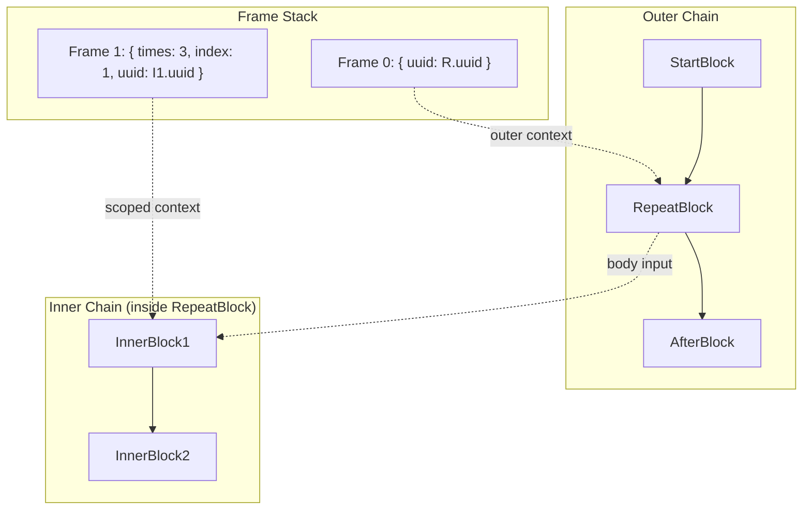

**Execution Sequence:**

1. Execute outer chain: `StartBlock` → `RepeatBlock`
2. `RepeatBlock.execute()` calls `scoped { ... }` → creates Frame 1
3. Frame 1 stores `times` and `index` via `remember()`
4. Inner interpreter executes `InnerBlock1` → `InnerBlock2` within Frame 1
5. Frame 1 pops when inner execution completes
6. Outer execution continues with Frame 0

**Sources:** [src/test/kotlin/CodeBlockExecutionCoreTests.kt:259-273]()

---

## Integration with ScriptInstance

The `CodeBlockInterpreter` is typically invoked from within a `ScriptInstance`, which manages the overall script lifecycle and provides the execution context.

### ScriptInstance Launch Flow

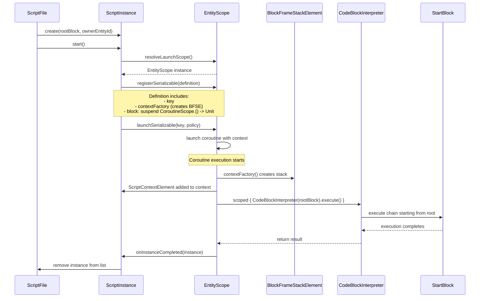

**Key Context Elements:**

| Element | Purpose |
|---------|---------|
| `ScriptContextElement(instance)` | Provides access to `currentInstance()` and `currentFile()` |
| `BlockFrameStackElement(instance)` | Provides frame stack for state storage |
| `ScriptEventContextElement(event)` | Provides event data for event-driven blocks |
| `ScriptSignalContextElement(signal)` | Provides signal data for signal handlers |

**Sources:** [src/main/java/ru/hollowhorizon/hollowengine/common/codeblocks/runtime/ScriptInstance.kt:55-85](), [src/main/java/ru/hollowhorizon/hollowengine/common/codeblocks/runtime/ScriptInstance.kt:110-151]()

### Current Block Tracking

The interpreter updates `ScriptInstance.currentBlockId` during execution to enable debugging and inspection:

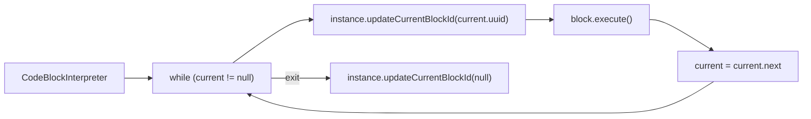

**Usage:**

- `ScriptInstance.currentBlockId()` returns the last known block UUID
- Used by `BlocksSystem.getActiveBranchSnapshots()` to show which block is executing
- Accessible from IDE dev tools for debugging

**Sources:** [src/main/java/ru/hollowhorizon/hollowengine/common/codeblocks/execution/CodeBlockInterpreter.kt:34-36](), [src/main/java/ru/hollowhorizon/hollowengine/common/codeblocks/runtime/ScriptInstance.kt:86-91]()

---

## Error Handling

When a block throws an exception during execution, the interpreter stores the current block UUID before propagating the error:

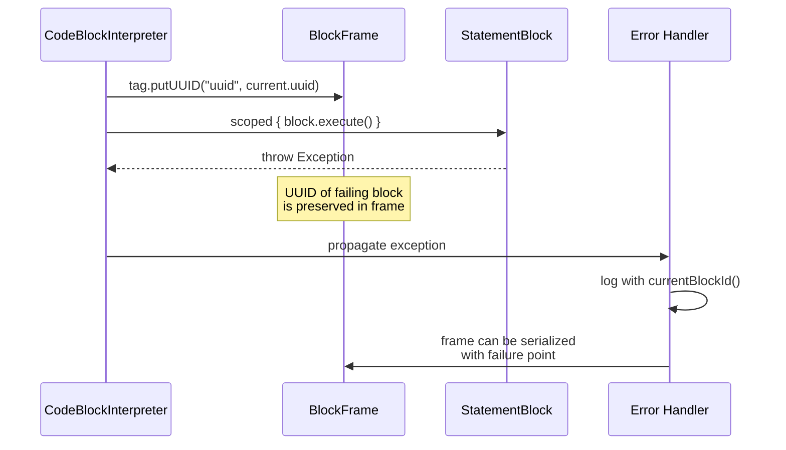

**Error Recovery:**

1. Exception occurs during `block.execute()`
2. Current block UUID already stored in frame before execution
3. Frame can be serialized with failure point preserved
4. On next deserialization, execution can resume from (or skip) the failing block
5. `ScriptInstance.currentBlockId()` provides block UUID for logging

**Sources:** [src/main/java/ru/hollowhorizon/hollowengine/common/codeblocks/runtime/ScriptInstance.kt:133-140](), [src/test/kotlin/CodeBlockExecutionCoreTests.kt:185-198]()

---

## Performance and Debugging

### DevLogger Integration

The execution runtime integrates with `DevLogger` to record block execution for debugging:

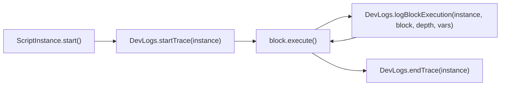

**Logged Information:**

| Data | Purpose |
|------|---------|
| Script path | Identify which script is executing |
| Block instance | Which block in the graph |
| Stack depth | Nesting level of `scoped()` calls |
| Variables | Current `remember()` state (limited to configured max) |
| Execution time | Duration of block execution in milliseconds |

**Sources:** [src/main/java/ru/hollowhorizon/hollowengine/common/dev/DevLogger.kt:40-91](), [src/main/java/ru/hollowhorizon/hollowengine/common/codeblocks/runtime/ScriptInstance.kt:95-99]()

### Slow Execution Detection

The `DevLogger` marks blocks as "slow" if they exceed `DevLoggerConfig.MIN_EXECUTION_TIME_MS`:

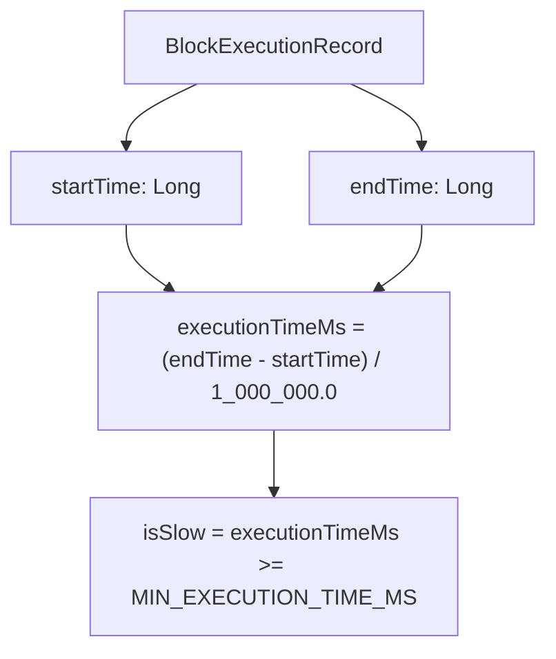

**Configuration Options:**

| Config | Default | Purpose |
|--------|---------|---------|
| `ENABLED` | `true` | Enable/disable dev logging |
| `SHOW_STACK_DEPTH` | `true` | Show nesting depth in logs |
| `SHOW_VARIABLES` | `true` | Include variable state |
| `SHOW_TIMING` | `true` | Include execution time |
| `MIN_EXECUTION_TIME_MS` | `1L` | Threshold for "slow" classification |
| `MAX_VARIABLE_COUNT` | `5` | Limit logged variables |

**Sources:** [src/main/java/ru/hollowhorizon/hollowengine/common/dev/DevLogger.kt:11-19](), [src/main/java/ru/hollowhorizon/hollowengine/common/dev/DevLogger.kt:24-32]()