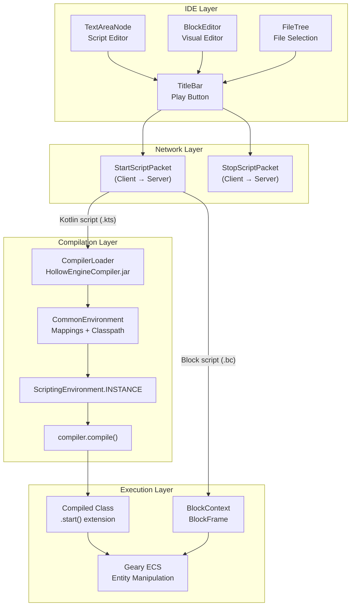
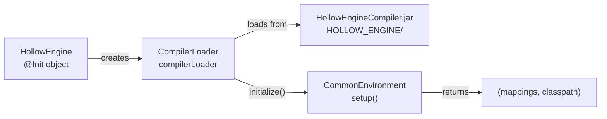
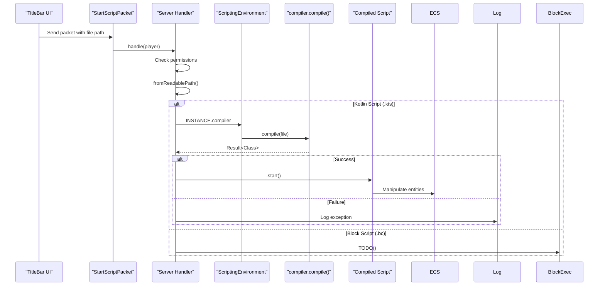
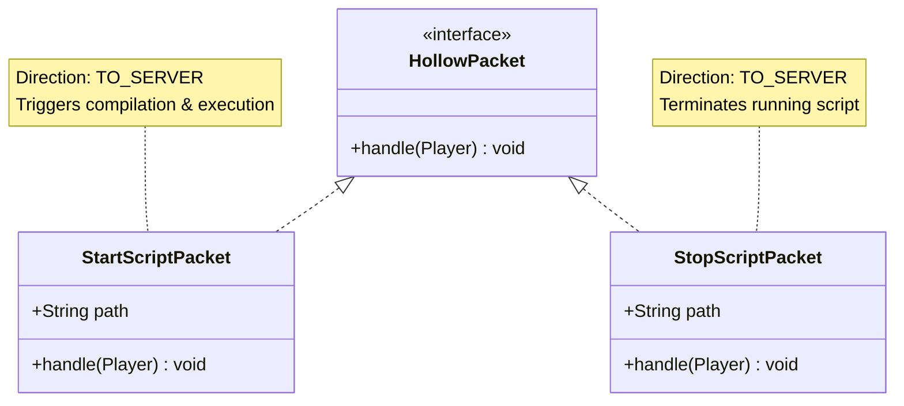
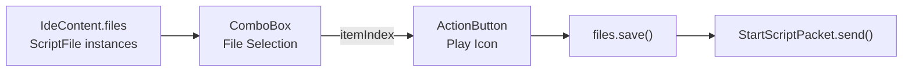
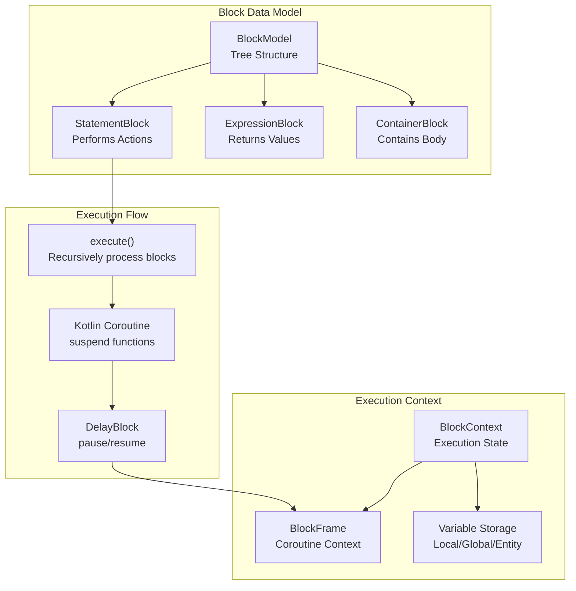
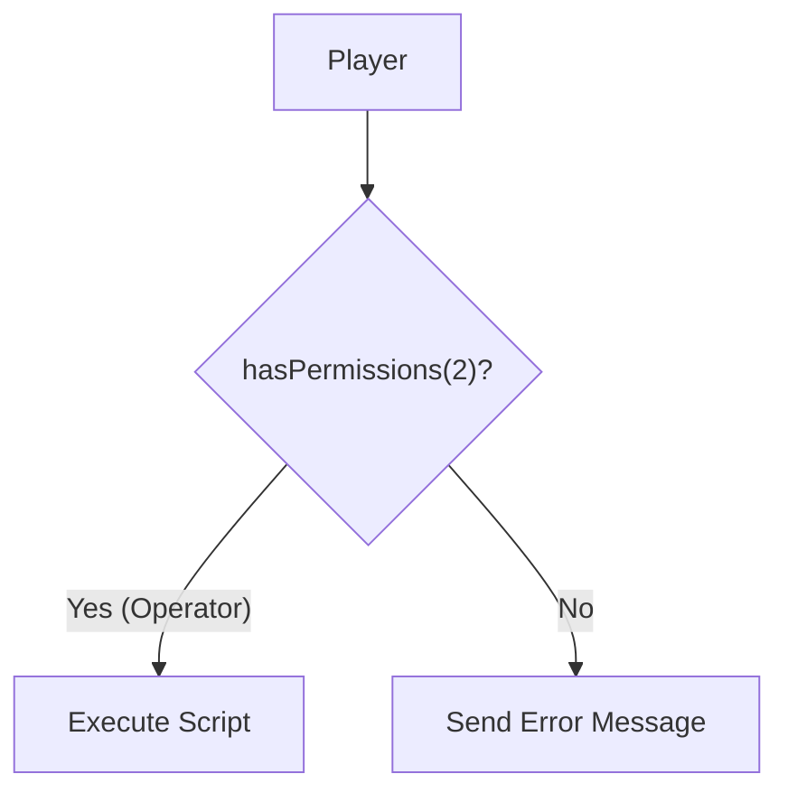
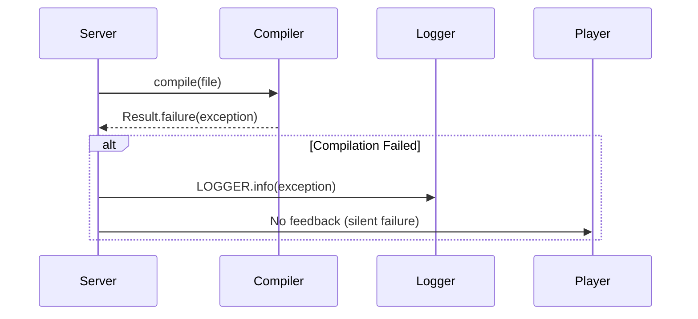
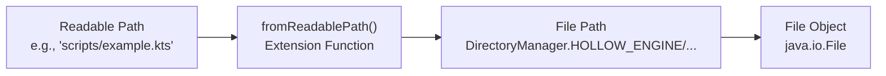

# Script Execution

<details>
<summary>Relevant source files</summary>

The following files were used as context for generating this wiki page:

- [src/main/java/ru/hollowhorizon/hollowengine/common/codeblocks/blocks/players/OnPlayerChatBlock.kt](src/main/java/ru/hollowhorizon/hollowengine/common/codeblocks/blocks/players/OnPlayerChatBlock.kt)
- [src/main/java/ru/hollowhorizon/hollowengine/common/codeblocks/execution/BlockFrameStackElement.kt](src/main/java/ru/hollowhorizon/hollowengine/common/codeblocks/execution/BlockFrameStackElement.kt)
- [src/main/java/ru/hollowhorizon/hollowengine/common/codeblocks/execution/CodeBlockInterpreter.kt](src/main/java/ru/hollowhorizon/hollowengine/common/codeblocks/execution/CodeBlockInterpreter.kt)
- [src/main/java/ru/hollowhorizon/hollowengine/common/codeblocks/runtime/BlocksSystem.kt](src/main/java/ru/hollowhorizon/hollowengine/common/codeblocks/runtime/BlocksSystem.kt)
- [src/main/java/ru/hollowhorizon/hollowengine/common/codeblocks/runtime/BlocksSystemSavedData.kt](src/main/java/ru/hollowhorizon/hollowengine/common/codeblocks/runtime/BlocksSystemSavedData.kt)
- [src/main/java/ru/hollowhorizon/hollowengine/common/codeblocks/runtime/OwnerScopeRestoredEvent.kt](src/main/java/ru/hollowhorizon/hollowengine/common/codeblocks/runtime/OwnerScopeRestoredEvent.kt)
- [src/main/java/ru/hollowhorizon/hollowengine/common/codeblocks/runtime/ScriptFile.kt](src/main/java/ru/hollowhorizon/hollowengine/common/codeblocks/runtime/ScriptFile.kt)
- [src/main/java/ru/hollowhorizon/hollowengine/common/codeblocks/runtime/ScriptInstance.kt](src/main/java/ru/hollowhorizon/hollowengine/common/codeblocks/runtime/ScriptInstance.kt)
- [src/main/java/ru/hollowhorizon/hollowengine/common/commands/HollowEngineCommands.kt](src/main/java/ru/hollowhorizon/hollowengine/common/commands/HollowEngineCommands.kt)
- [src/main/java/ru/hollowhorizon/hollowengine/common/coroutines/EntityScope.kt](src/main/java/ru/hollowhorizon/hollowengine/common/coroutines/EntityScope.kt)
- [src/main/java/ru/hollowhorizon/hollowengine/common/coroutines/SingleThreadDispatcher.kt](src/main/java/ru/hollowhorizon/hollowengine/common/coroutines/SingleThreadDispatcher.kt)
- [src/main/java/ru/hollowhorizon/hollowengine/common/dev/DevLogger.kt](src/main/java/ru/hollowhorizon/hollowengine/common/dev/DevLogger.kt)
- [src/main/java/ru/hollowhorizon/hollowengine/mixins/components/EntityMixin.java](src/main/java/ru/hollowhorizon/hollowengine/mixins/components/EntityMixin.java)
- [src/test/kotlin/CodeBlockExecutionCoreTests.kt](src/test/kotlin/CodeBlockExecutionCoreTests.kt)
- [src/test/kotlin/ScriptExecutionLifecycleTests.kt](src/test/kotlin/ScriptExecutionLifecycleTests.kt)

</details>


## Purpose and Scope

This document describes how scripts are compiled and executed in HollowEngine, covering both text-based Kotlin scripts and visual block-based scripts. It explains the runtime compilation system, network synchronization for script execution, and the integration with the ECS for manipulating game state.

For information about writing scripts in the text editor, see [Text Script Editor](#4). For visual block programming, see [Visual Block Editor](#5) and [Block Programming Reference](#6). For details about the ECS that scripts interact with, see [Geary ECS Integration](#8).

---

## Execution Architecture Overview

HollowEngine supports two primary script execution modes: **text-based Kotlin scripts** that are dynamically compiled at runtime, and **visual block scripts** that are interpreted through a coroutine-based execution system. Both execution paths integrate with the Geary ECS to manipulate entities and components.

### Script Execution Flow



**Sources:** [src/main/java/ru/hollowhorizon/hollowengine/HollowEngine.kt:1-34](), [src/main/java/ru/hollowhorizon/hollowengine/client/gui/scripting/titlebar/BarContents.kt:1-233]()

---

## Compiler Initialization

The runtime compilation system is initialized during mod startup through the `CompilerLoader` class, which loads a separate JAR file containing the Kotlin compiler infrastructure.

### CompilerLoader Setup



The initialization sequence occurs in the `HollowEngine` object:

| Step | Component | Operation |
|------|-----------|-----------|
| 1 | `CompilerLoader` | Created with path to `HollowEngineCompiler.jar` |
| 2 | File Check | `hasCompilerJar()` verifies JAR exists |
| 3 | `CommonEnvironment` | `setup()` builds mappings and classpath |
| 4 | Initialization | `initialize(javaHome, classpath, mappings)` |

**Key Implementation Details:**

- **Compiler JAR Path:** [src/main/java/ru/hollowhorizon/hollowengine/HollowEngine.kt:20]()
  ```kotlin
  val compilerLoader = CompilerLoader(
      DirectoryManager.HOLLOW_ENGINE.resolve("HollowEngineCompiler.jar").toFile()
  )
  ```

- **Conditional Initialization:** [src/main/java/ru/hollowhorizon/hollowengine/HollowEngine.kt:25-28]()
  - Only initializes if the compiler JAR is present
  - Sets up deobfuscation mappings via `CommonEnvironment.setup()`
  - Passes Java home directory and classpath to compiler

**Sources:** [src/main/java/ru/hollowhorizon/hollowengine/HollowEngine.kt:16-33]()

---

## Text-Based Kotlin Script Compilation

Text-based scripts written in the IDE are Kotlin scripts (`.kts` files) that are dynamically compiled and executed on the server when the play button is pressed.

### Compilation Workflow



**Network Packet Structure:**

The `StartScriptPacket` carries the script file path from client to server:

| Field | Type | Purpose |
|-------|------|---------|
| `path` | `String` | Readable path to script file |

**Packet Handler Logic:** [src/main/java/ru/hollowhorizon/hollowengine/client/gui/scripting/titlebar/BarContents.kt:186-208]()

1. **Permission Check** - Requires operator level 2 (`player.hasPermissions(2)`)
2. **Path Resolution** - Converts readable path to file: `path.fromReadablePath()`
3. **File Type Dispatch:**
   - `.bc` files → Block script execution (not yet implemented)
   - Other files → Kotlin script compilation
4. **Compilation** - `ScriptingEnvironment.INSTANCE.compiler.compile(file)`
5. **Execution** - `result.getOrThrow().start()`

**Sources:** [src/main/java/ru/hollowhorizon/hollowengine/client/gui/scripting/titlebar/BarContents.kt:186-208]()

---

## Script Execution Packets

Two network packets coordinate script execution between client and server:

### Packet Definitions



### StartScriptPacket

**Purpose:** Initiates script compilation and execution on the server.

**Implementation:** [src/main/java/ru/hollowhorizon/hollowengine/client/gui/scripting/titlebar/BarContents.kt:186-208]()

```kotlin
@HollowPacketHandler(HollowPacketHandler.Direction.TO_SERVER)
@Serializable
class StartScriptPacket(val path: String) : HollowPacket
```

**Behavior:**
- Validates player has operator permissions
- Resolves file path using `fromReadablePath()`
- Dispatches to appropriate execution system based on file extension
- Logs compilation errors if they occur

### StopScriptPacket

**Purpose:** Stops a running script on the server.

**Implementation:** [src/main/java/ru/hollowhorizon/hollowengine/client/gui/scripting/titlebar/BarContents.kt:218-233]()

```kotlin
@HollowPacketHandler(HollowPacketHandler.Direction.TO_SERVER)
@Serializable
class StopScriptPacket(val path: String) : HollowPacket
```

**Behavior:**
- Validates player permissions
- Resolves file path
- Sends toast notification on success
- Note: Actual stop logic is not yet implemented (commented out)

**Sources:** [src/main/java/ru/hollowhorizon/hollowengine/client/gui/scripting/titlebar/BarContents.kt:186-233]()

---

## IDE Integration

The script execution flow is triggered from the IDE's title bar, which provides file selection and execution controls.

### Title Bar Controls



**File Selection System:** [src/main/java/ru/hollowhorizon/hollowengine/client/gui/scripting/titlebar/BarContents.kt:120-145]()

The title bar displays a `ComboBox` containing all open `ScriptFile` instances:
- Files are filtered from `IdeContent.files`
- Each item shows the file icon and name
- Selected index is persisted in `KeyValueStore` as `"ide.file_index"`

**Execution Button:** [src/main/java/ru/hollowhorizon/hollowengine/client/gui/scripting/titlebar/BarContents.kt:147-161]()

The play button implementation:
1. Saves all open files: `IdeContent.files.values.forEach { it.save() }`
2. Creates packet with selected file path
3. Sends packet to server: `StartScriptPacket(file).send()`

**Sources:** [src/main/java/ru/hollowhorizon/hollowengine/client/gui/scripting/titlebar/BarContents.kt:116-161]()

---

## Compilation Status HUD

During compilation, status messages are displayed in the HUD to inform the user of progress.

### Compilation Phases

| Phase | Localization Key | Description |
|-------|------------------|-------------|
| Parsing | `hollowengine.hud.compilation.parsing` | Analyzing script syntax |
| Compiling | `hollowengine.hud.compilation.compiling` | Generating bytecode |
| Obfuscating | `hollowengine.hud.compilation.obfuscating` | Applying mappings |
| Executing | `hollowengine.hud.compilation.executing` | Running script |

**Localization Examples:**

**English:** [src/main/resources/assets/hollowengine/lang/en_us.yml:119-124]()
```yaml
hud:
  compilation:
    parsing: "Parsing script: %s."
    compiling: "Compiling script: %s."
    obfuscating: "Obfuscating script %s."
    executing: "Running script %s."
```

**Russian:** [src/main/resources/assets/hollowengine/lang/ru_ru.yml:119-124]()
```yaml
hud:
  compilation:
    parsing: Парсинг скрипта %s.
    compiling: Компиляция скрипта %s.
    obfuscating: Обфускация скрипта %s.
    executing: Запуск скрипта %s.
```

**Sources:** [src/main/resources/assets/hollowengine/lang/en_us.yml:119-124](), [src/main/resources/assets/hollowengine/lang/ru_ru.yml:119-124]()

---

## Block Script Execution

Visual block scripts use a coroutine-based execution system that allows for complex control flow including delays, loops, and conditional logic. Block execution is planned but not yet fully implemented in the `StartScriptPacket` handler.

### Block Execution Architecture



**Key Components:**

| Component | Purpose | Details |
|-----------|---------|---------|
| `BlockModel` | Data structure | Hierarchical tree of blocks |
| `BlockContext` | Execution state | Stores variables and state during execution |
| `BlockFrame` | Coroutine context | Enables suspend/resume for control flow |
| `execute()` | Interpreter | Recursively processes block tree |

**Planned Integration:** [src/main/java/ru/hollowhorizon/hollowengine/client/gui/scripting/titlebar/BarContents.kt:196-197]()

The `StartScriptPacket` handler includes a placeholder for block script execution:
```kotlin
if (file.name.endsWith(".bc")) {
    TODO()
}
```

This indicates that `.bc` (block code) files will use a separate execution path from Kotlin scripts.

**Sources:** [src/main/java/ru/hollowhorizon/hollowengine/client/gui/scripting/titlebar/BarContents.kt:196-197]()

---

## Script Permissions and Security

Script execution requires server operator permissions to prevent unauthorized code execution.

### Permission Model



**Permission Check:** [src/main/java/ru/hollowhorizon/hollowengine/client/gui/scripting/titlebar/BarContents.kt:190-193]()

Both `StartScriptPacket` and `StopScriptPacket` verify permissions:
```kotlin
if (!player.hasPermissions(2)) {
    player.sendSystemMessage("You don't have permissions to start scripts!".literal)
    return
}
```

**Permission Level 2** corresponds to Minecraft's operator level 2, which typically allows:
- Manipulating command blocks
- Accessing protected areas
- Executing administrative commands

**Sources:** [src/main/java/ru/hollowhorizon/hollowengine/client/gui/scripting/titlebar/BarContents.kt:190-193](), [src/main/java/ru/hollowhorizon/hollowengine/client/gui/scripting/titlebar/BarContents.kt:222-225]()

---

## Script Compilation Error Handling

Compilation errors are logged on the server and do not crash the game or disconnect the player.

### Error Flow



**Error Handling Logic:** [src/main/java/ru/hollowhorizon/hollowengine/client/gui/scripting/titlebar/BarContents.kt:199-204]()

```kotlin
val result = ScriptingEnvironment.INSTANCE.compiler.compile(file)
if (result.isFailure) {
    HollowEngine.LOGGER.info(result.exceptionOrNull())
} else {
    result.getOrThrow().start()
}
```

**Behavior:**
- Compilation returns a `Result<T>` type
- Failures are logged to the server console
- No error message is sent to the player (potential improvement area)
- Script execution is skipped on compilation failure

**Sources:** [src/main/java/ru/hollowhorizon/hollowengine/client/gui/scripting/titlebar/BarContents.kt:199-204]()

---

## File Path Resolution

Script file paths are stored in a "readable" format and must be converted to actual file system paths before compilation.

### Path Conversion



**Path Resolution:** [src/main/java/ru/hollowhorizon/hollowengine/client/gui/scripting/titlebar/BarContents.kt:194]()

The `fromReadablePath()` extension function is called on the path string:
```kotlin
val file = path.fromReadablePath()
```

This function (defined in `DirectoryManager`) converts IDE-friendly paths to absolute file system paths, ensuring that:
- Paths are relative to the `HOLLOW_ENGINE` directory
- Cross-platform path separators are handled correctly
- Non-existent files can be detected early

**Sources:** [src/main/java/ru/hollowhorizon/hollowengine/common/files/DirectoryManager.kt:29](), [src/main/java/ru/hollowhorizon/hollowengine/client/gui/scripting/titlebar/BarContents.kt:194]()

---

## Summary

Script execution in HollowEngine follows this complete flow:

1. **User initiates execution** from IDE title bar by selecting a file and clicking play
2. **Files are saved** to ensure latest changes are compiled
3. **StartScriptPacket** is sent to server with file path
4. **Server validates** player has operator permissions
5. **File type is determined** based on extension (`.bc` for blocks, other for Kotlin)
6. **Compilation occurs** via `ScriptingEnvironment.INSTANCE.compiler.compile(file)`
7. **Execution begins** with compiled script's `.start()` method
8. **Scripts interact** with Geary ECS to manipulate entities and components
9. **Errors are logged** but don't crash the server

This architecture separates concerns cleanly:
- **IDE layer** handles user interaction and file management
- **Network layer** synchronizes execution requests
- **Compilation layer** transforms source to executable code
- **Execution layer** runs scripts and integrates with game systems

**Sources:** [src/main/java/ru/hollowhorizon/hollowengine/HollowEngine.kt:1-34](), [src/main/java/ru/hollowhorizon/hollowengine/client/gui/scripting/titlebar/BarContents.kt:1-233]()