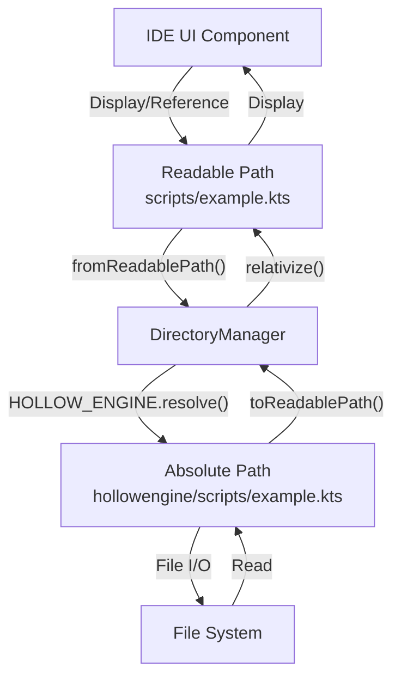
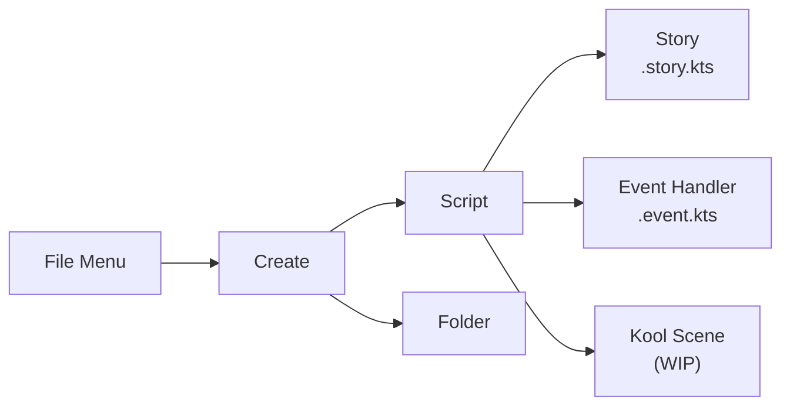

# Execution Architecture

<details>
<summary>Relevant source files</summary>

The following files were used as context for generating this wiki page:

- [src/main/java/ru/hollowhorizon/hollowengine/common/codeblocks/blocks/players/OnPlayerChatBlock.kt](src/main/java/ru/hollowhorizon/hollowengine/common/codeblocks/blocks/players/OnPlayerChatBlock.kt)
- [src/main/java/ru/hollowhorizon/hollowengine/common/codeblocks/execution/BlockFrameStackElement.kt](src/main/java/ru/hollowhorizon/hollowengine/common/codeblocks/execution/BlockFrameStackElement.kt)
- [src/main/java/ru/hollowhorizon/hollowengine/common/codeblocks/execution/CodeBlockInterpreter.kt](src/main/java/ru/hollowhorizon/hollowengine/common/codeblocks/execution/CodeBlockInterpreter.kt)
- [src/main/java/ru/hollowhorizon/hollowengine/common/codeblocks/runtime/BlocksSystem.kt](src/main/java/ru/hollowhorizon/hollowengine/common/codeblocks/runtime/BlocksSystem.kt)
- [src/main/java/ru/hollowhorizon/hollowengine/common/codeblocks/runtime/BlocksSystemSavedData.kt](src/main/java/ru/hollowhorizon/hollowengine/common/codeblocks/runtime/BlocksSystemSavedData.kt)
- [src/main/java/ru/hollowhorizon/hollowengine/common/codeblocks/runtime/OwnerScopeRestoredEvent.kt](src/main/java/ru/hollowhorizon/hollowengine/common/codeblocks/runtime/OwnerScopeRestoredEvent.kt)
- [src/main/java/ru/hollowhorizon/hollowengine/common/codeblocks/runtime/ScriptFile.kt](src/main/java/ru/hollowhorizon/hollowengine/common/codeblocks/runtime/ScriptFile.kt)
- [src/main/java/ru/hollowhorizon/hollowengine/common/codeblocks/runtime/ScriptInstance.kt](src/main/java/ru/hollowhorizon/hollowengine/common/codeblocks/runtime/ScriptInstance.kt)
- [src/main/java/ru/hollowhorizon/hollowengine/common/commands/HollowEngineCommands.kt](src/main/java/ru/hollowhorizon/hollowengine/common/commands/HollowEngineCommands.kt)
- [src/main/java/ru/hollowhorizon/hollowengine/common/coroutines/EntityScope.kt](src/main/java/ru/hollowhorizon/hollowengine/common/coroutines/EntityScope.kt)
- [src/main/java/ru/hollowhorizon/hollowengine/common/coroutines/SingleThreadDispatcher.kt](src/main/java/ru/hollowhorizon/hollowengine/common/coroutines/SingleThreadDispatcher.kt)
- [src/main/java/ru/hollowhorizon/hollowengine/common/dev/DevLogger.kt](src/main/java/ru/hollowhorizon/hollowengine/common/dev/DevLogger.kt)
- [src/main/java/ru/hollowhorizon/hollowengine/mixins/components/EntityMixin.java](src/main/java/ru/hollowhorizon/hollowengine/mixins/components/EntityMixin.java)
- [src/test/kotlin/CodeBlockExecutionCoreTests.kt](src/test/kotlin/CodeBlockExecutionCoreTests.kt)
- [src/test/kotlin/ScriptExecutionLifecycleTests.kt](src/test/kotlin/ScriptExecutionLifecycleTests.kt)

</details>


## Purpose and Scope

This page describes how HollowEngine executes scripts, covering script type detection, the client-server execution flow, network packet communication, and how the two execution paths (Kotlin scripts and block code) integrate with the game runtime. For details on Kotlin script compilation, see [7.2]. For block code interpretation, see [7.3]. For the APIs available during execution, see [6.6] and [6.7].

---

## The HollowEngine Directory

All HollowEngine scripts and assets are stored within a dedicated `hollowengine/` directory located at the game root (alongside the `mods/` and `config/` directories). This directory is automatically created on first launch by the `DirectoryManager`.

```
game-root/
├── mods/
├── config/
└── hollowengine/          ← All scripts and assets
    ├── scripts/           ← User-created scripts
    ├── models/            ← 3D model files
    ├── particles/         ← Particle definitions
    └── ...
```

The `DirectoryManager` singleton manages access to this directory through the `HOLLOW_ENGINE` property:

[src/main/java/ru/hollowhorizon/hollowengine/common/files/DirectoryManager.kt:7-11]()

**Sources:** [src/main/java/ru/hollowhorizon/hollowengine/common/files/DirectoryManager.kt:1-41]()

---

## Script File Types

HollowEngine supports multiple script file types, each serving different purposes. Scripts can be authored using either the visual Code Blocks editor or the text-based Kotlin Script editor within the in-game IDE.

### Overview of File Types

| Extension | Name | Editor Type | Format | Purpose |
|-----------|------|-------------|--------|---------|
| `.kts` | Kotlin Script | Text Editor | Kotlin source code | General-purpose scripting |
| `.bc` | Block Code | Block Editor | JSON | Visual programming representation |
| `.story.kts` | Story Script | Text Editor | Kotlin source code | Story sequences and cutscenes |
| `.event.kts` | Event Handler | Text Editor | Kotlin source code | Event-driven logic (WIP) |
| `.entity-component.kts` | Component Script | Text Editor | Kotlin source code | Custom component definitions |

---

### Kotlin Script Files (.kts)

Kotlin Script files are text-based scripts written in Kotlin. They are the primary format for programmatic control over game elements. These files are compiled using the Kotlin compiler at runtime when executed.

#### Standard Scripts (.kts)

General-purpose scripts that can contain any valid Kotlin code plus HollowEngine-specific APIs. Created via **File > Create > Script > Script** in the IDE.

```kotlin
// Example: scripts/example.kts
import ru.hollowhorizon.hollowengine.common.scripting.story.*

story("example") {
    state("start") {
        npc("steve") {
            say("Hello, World!")
        }
    }
}
```

#### Story Scripts (.story.kts)

Scripts specifically designed for story sequences, cutscenes, and narrative content. Created via **File > Create > Script > Story** in the IDE. These typically use the graph-based state machine system (see [State Machines and Graph System](#3.3)).

#### Event Handler Scripts (.event.kts)

Scripts that respond to game events. These are registered to listen for specific events and execute logic in response. Currently work-in-progress according to the IDE menu labels.

[src/main/java/ru/hollowhorizon/hollowengine/common/files/DirectoryManager.kt:14-23]()

The commented code shows the intended directory watching mechanism for auto-registering event scripts.

#### Component Scripts (.entity-component.kts)

Scripts that define custom components which can be attached to entities, levels, or the server. These are compiled and registered when resource packs are reloaded, enabling hot-reload of component definitions (see [Component Architecture and Types](#4.1)).

**Sources:** [src/main/resources/assets/hollowengine/lang/en_us.yml:45-53](), [src/main/resources/assets/hollowengine/lang/ru_ru.yml:46-53](), [src/main/java/ru/hollowhorizon/hollowengine/common/files/DirectoryManager.kt:14-23]()

---

### Code Block Files (.bc)

Block Code files store visual programming structures created in the Block Editor (see [Visual Programming (Code Blocks)](#2.4)). Despite having a different extension, these files represent the same logical operations as Kotlin scripts but in a visual, drag-and-drop format.

#### File Format

Block Code files are stored as JSON, containing serialized block structures:

```json
{
  "blocks": [
    {
      "type": "story_start",
      "next": "block_2",
      ...
    },
    ...
  ]
}
```

#### Conversion Between Formats

The IDE allows seamless switching between visual blocks and text-based code. When a `.bc` file is opened in the Text Editor, it displays the equivalent Kotlin code. Changes made in either editor can be persisted to the same file format, though the primary storage format depends on which editor was used to create the file initially.

**Sources:** Diagram 2 (In-Game IDE System Architecture), Diagram 3 (Script Execution Pipeline)

---

## File Path System

### Readable Path Format

HollowEngine uses a "readable path" system to reference files relative to the `hollowengine/` directory. This abstraction simplifies file references in scripts and UI components.

#### Path Conversion Methods

The `DirectoryManager` provides utility methods for converting between absolute paths and readable paths:

```kotlin
// Convert File/Path to readable path
val readablePath = file.toReadablePath()
// Example: "scripts/example.kts"

// Convert readable path to File
val file = "scripts/example.kts".fromReadablePath()
// Resolves to: hollowengine/scripts/example.kts
```

[src/main/java/ru/hollowhorizon/hollowengine/common/files/DirectoryManager.kt:26-39]()

#### Path Separators

Readable paths always use forward slashes (`/`) regardless of the operating system, ensuring consistency across platforms:

[src/main/java/ru/hollowhorizon/hollowengine/common/files/DirectoryManager.kt:33]()

### File Resolution Flow



**Diagram: Path Resolution Flow**

This system allows the IDE to display user-friendly paths while maintaining proper absolute path resolution for file operations.

**Sources:** [src/main/java/ru/hollowhorizon/hollowengine/common/files/DirectoryManager.kt:26-39]()

---

## Directory Organization Patterns

### Recommended Structure

While HollowEngine does not enforce a specific directory structure, the following organization is recommended for project clarity:

```
hollowengine/
├── scripts/              ← Main scripts directory
│   ├── story/           ← Story scripts (.story.kts)
│   ├── events/          ← Event handlers (.event.kts)
│   ├── components/      ← Component definitions (.entity-component.kts)
│   └── utility/         ← Utility scripts
├── blocks/              ← Visual block scripts (.bc)
├── models/              ← 3D model files (.gltf, .glb)
├── particles/           ← Bedrock particle definitions
└── textures/            ← Custom textures
```

### File Naming Conventions

| Script Type | Recommended Pattern | Example |
|-------------|---------------------|---------|
| Story scripts | `{name}.story.kts` | `intro_cutscene.story.kts` |
| Event handlers | `{event}.event.kts` | `player_join.event.kts` |
| Component scripts | `{component}.entity-component.kts` | `custom_ai.entity-component.kts` |
| Block code | `{name}.bc` | `quest_logic.bc` |

**Sources:** [src/main/resources/assets/hollowengine/lang/en_us.yml:45-53](), Diagram 1 (Overall System Architecture)

---

## Script Type Selection in IDE

The IDE provides multiple creation options through the **File > Create** menu:



**Diagram: IDE Script Creation Options**

Each option creates a file with the appropriate extension and opens it in the corresponding editor (Block Editor for `.bc` files, Text Editor for `.kts` files).

**Sources:** [src/main/resources/assets/hollowengine/lang/en_us.yml:45-53](), [src/main/resources/assets/hollowengine/lang/ru_ru.yml:46-53]()

---

## File Management Operations

### File Tree Navigation

The IDE's File Tree panel (Project panel) displays the contents of the `hollowengine/` directory in a hierarchical view. Users can navigate folders, open files, and perform file operations through context menus.

### Supported Operations

- **Create:** New scripts, folders
- **Open:** Double-click to open in appropriate editor
- **Copy/Cut/Paste:** File duplication and movement
- **Rename:** Change file name while preserving extension
- **Delete:** Remove files (with confirmation)
- **Copy as ResourceLocation:** Copy the readable path format
- **Open in Explorer:** Open the file's location in the system file browser

For detailed information on these operations, see [File Operations and Management](#2.5).

**Sources:** [src/main/resources/assets/hollowengine/lang/en_us.yml:54-63](), [src/main/resources/assets/hollowengine/lang/ru_ru.yml:54-63]()

---

## Summary

HollowEngine's file organization system provides:

- **Centralized Storage:** All scripts in the `hollowengine/` directory
- **Multiple Formats:** Both text-based (`.kts`) and visual (`.bc`) scripts
- **Readable Paths:** Platform-independent path references
- **Flexible Organization:** User-defined subdirectory structure
- **Type Specialization:** Different file extensions for different purposes

This organization allows content creators to structure their projects logically while maintaining compatibility with HollowEngine's execution and management systems.

**Sources:** [src/main/java/ru/hollowhorizon/hollowengine/common/files/DirectoryManager.kt:1-41](), [src/main/resources/assets/hollowengine/lang/en_us.yml:1-121](), [src/main/resources/assets/hollowengine/lang/ru_ru.yml:1-130]()