# Entity Scope and Coroutines

<details>
<summary>Relevant source files</summary>

The following files were used as context for generating this wiki page:

- [src/main/java/ru/hollowhorizon/hollowengine/common/codeblocks/blocks/players/OnPlayerChatBlock.kt](src/main/java/ru/hollowhorizon/hollowengine/common/codeblocks/blocks/players/OnPlayerChatBlock.kt)
- [src/main/java/ru/hollowhorizon/hollowengine/common/codeblocks/execution/BlockFrameStackElement.kt](src/main/java/ru/hollowhorizon/hollowengine/common/codeblocks/execution/BlockFrameStackElement.kt)
- [src/main/java/ru/hollowhorizon/hollowengine/common/codeblocks/execution/CodeBlockInterpreter.kt](src/main/java/ru/hollowhorizon/hollowengine/common/codeblocks/execution/CodeBlockInterpreter.kt)
- [src/main/java/ru/hollowhorizon/hollowengine/common/codeblocks/runtime/BlocksSystem.kt](src/main/java/ru/hollowhorizon/hollowengine/common/codeblocks/runtime/BlocksSystem.kt)
- [src/main/java/ru/hollowhorizon/hollowengine/common/codeblocks/runtime/BlocksSystemSavedData.kt](src/main/java/ru/hollowhorizon/hollowengine/common/codeblocks/runtime/BlocksSystemSavedData.kt)
- [src/main/java/ru/hollowhorizon/hollowengine/common/codeblocks/runtime/OwnerScopeRestoredEvent.kt](src/main/java/ru/hollowhorizon/hollowengine/common/codeblocks/runtime/OwnerScopeRestoredEvent.kt)
- [src/main/java/ru/hollowhorizon/hollowengine/common/codeblocks/runtime/ScriptFile.kt](src/main/java/ru/hollowhorizon/hollowengine/common/codeblocks/runtime/ScriptFile.kt)
- [src/main/java/ru/hollowhorizon/hollowengine/common/codeblocks/runtime/ScriptInstance.kt](src/main/java/ru/hollowhorizon/hollowengine/common/codeblocks/runtime/ScriptInstance.kt)
- [src/main/java/ru/hollowhorizon/hollowengine/common/commands/HollowEngineCommands.kt](src/main/java/ru/hollowhorizon/hollowengine/common/commands/HollowEngineCommands.kt)
- [src/main/java/ru/hollowhorizon/hollowengine/common/coroutines/EntityScope.kt](src/main/java/ru/hollowhorizon/hollowengine/common/coroutines/EntityScope.kt)
- [src/main/java/ru/hollowhorizon/hollowengine/common/coroutines/SingleThreadDispatcher.kt](src/main/java/ru/hollowhorizon/hollowengine/common/coroutines/SingleThreadDispatcher.kt)
- [src/main/java/ru/hollowhorizon/hollowengine/common/dev/DevLogger.kt](src/main/java/ru/hollowhorizon/hollowengine/common/dev/DevLogger.kt)
- [src/main/java/ru/hollowhorizon/hollowengine/mixins/components/EntityMixin.java](src/main/java/ru/hollowhorizon/hollowengine/mixins/components/EntityMixin.java)
- [src/test/kotlin/CodeBlockExecutionCoreTests.kt](src/test/kotlin/CodeBlockExecutionCoreTests.kt)
- [src/test/kotlin/ScriptExecutionLifecycleTests.kt](src/test/kotlin/ScriptExecutionLifecycleTests.kt)

</details>


## Purpose and Scope

This document explains the **Entity Scope and Coroutines** system, which provides serializable coroutine execution bound to individual entities in HollowEngine. The `EntityScope` class enables scripts to execute as coroutines that can be paused, serialized to NBT, and resumed after server restarts or entity chunk unloading. This is the persistence layer that allows long-running block scripts and Kotlin scripts to survive game interruptions.

For information about the script execution architecture that uses `EntityScope`, see [Execution Architecture](#7.1). For details on script lifecycle management, see [Script Lifecycle](#7.3). For the block execution interpreter that runs within these coroutines, see [Block Execution Runtime](#6.4).

---

## Core Concepts

### SerializableCoroutineScope Interface

The `SerializableCoroutineScope` interface defines a coroutine scope that can save and restore its execution state:

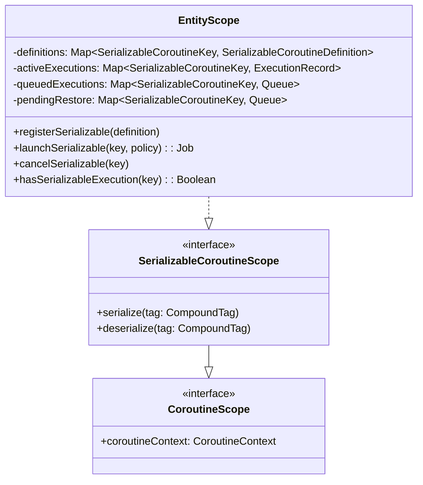
```mermaid
classDiagram
    class SerializableCoroutineScope {
        <<interface>>
        +serialize(tag: CompoundTag)
        +deserialize(tag: CompoundTag)
    }
    
    class EntityScope {
        -definitions: Map~SerializableCoroutineKey, SerializableCoroutineDefinition~
        -activeExecutions: Map~SerializableCoroutineKey, ExecutionRecord~
        -queuedExecutions: Map~SerializableCoroutineKey, Queue~
        -pendingRestore: Map~SerializableCoroutineKey, Queue~
        +registerSerializable(definition)
        +launchSerializable(key, policy): Job
        +cancelSerializable(key)
        +hasSerializableExecution(key): Boolean
    }
    
    class CoroutineScope {
        <<interface>>
        +coroutineContext: CoroutineContext
    }
    
    SerializableCoroutineScope --|> CoroutineScope
    EntityScope ..|> SerializableCoroutineScope
```

**Key Responsibilities:**
- **Serialization**: Save all running/queued coroutines to NBT format
- **Deserialization**: Restore coroutines from NBT, maintaining execution state
- **Registration**: Define how coroutines should be created and what context they need
- **Launch Control**: Manage concurrent execution with configurable policies

Sources: [src/main/java/ru/hollowhorizon/hollowengine/common/coroutines/EntityScope.kt:14-30]()

---

### EntityScope Structure

The `EntityScope` maintains four concurrent collections to track coroutine lifecycle:

| Collection | Type | Purpose |
|------------|------|---------|
| `definitions` | `ConcurrentHashMap<SerializableCoroutineKey, SerializableCoroutineDefinition>` | Registered coroutine blueprints |
| `activeExecutions` | `ConcurrentHashMap<SerializableCoroutineKey, ExecutionRecord>` | Currently running coroutines |
| `queuedExecutions` | `ConcurrentHashMap<SerializableCoroutineKey, ArrayDeque<LaunchRequest>>` | Queued launches waiting for active to complete |
| `pendingRestore` | `ConcurrentHashMap<SerializableCoroutineKey, ArrayDeque<SerializedExecution>>` | Deserialized executions waiting for definition registration |

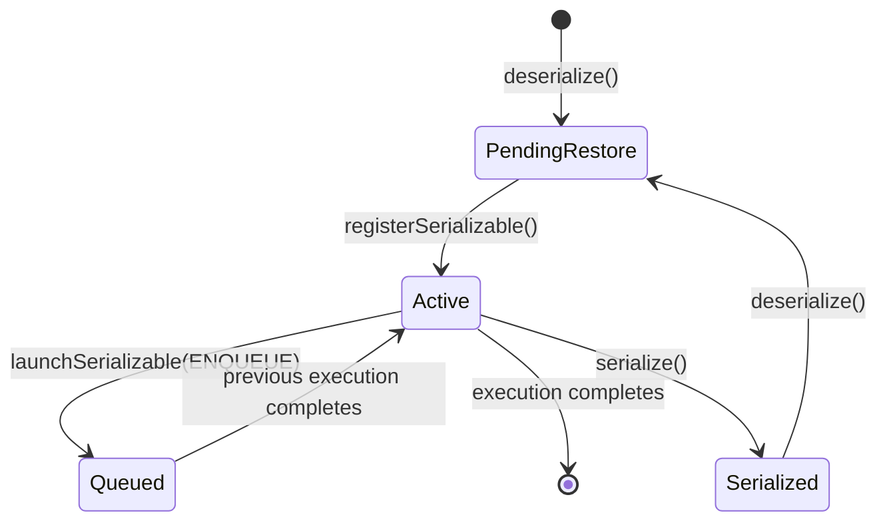
```mermaid
stateDiagram-v2
    [*] --> PendingRestore: deserialize()
    PendingRestore --> Active: registerSerializable()
    Active --> Queued: launchSerializable(ENQUEUE)
    Queued --> Active: previous execution completes
    Active --> [*]: execution completes
    Active --> Serialized: serialize()
    Serialized --> PendingRestore: deserialize()
```

**State Transitions:**
1. **PendingRestore**: Execution exists in NBT but definition not yet registered
2. **Active**: Coroutine is currently running
3. **Queued**: Waiting for active execution to complete (ENQUEUE policy)
4. **Serialized**: Paused and saved to disk

Sources: [src/main/java/ru/hollowhorizon/hollowengine/common/coroutines/EntityScope.kt:34-38]()

---

### Serializable Coroutine Keys

Each coroutine execution is identified by a unique `SerializableCoroutineKey` composed of multiple parts:

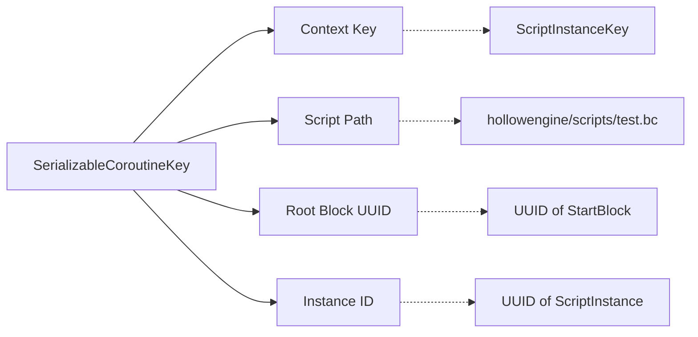
```mermaid
graph LR
    Key["SerializableCoroutineKey"] --> Part1["Context Key"]
    Key --> Part2["Script Path"]
    Key --> Part3["Root Block UUID"]
    Key --> Part4["Instance ID"]
    
    Part1 -.-> ScriptInstanceKey["ScriptInstanceKey"]
    Part2 -.-> Path["hollowengine/scripts/test.bc"]
    Part3 -.-> UUID1["UUID of StartBlock"]
    Part4 -.-> UUID2["UUID of ScriptInstance"]
```

**Key Construction Example** (from ScriptInstance):
```
SerializableCoroutineKey.of(
    SerializableCoroutineKeyPart.Context(ScriptInstanceKey),
    ScriptPathKey with "hollowengine/scripts/npc_behavior.bc",
    RootBlockKey with UUID("12345678-..."),
    InstanceIdKey with UUID("abcdefgh-...")
)
```

This multi-part key ensures:
- **Uniqueness**: Different script instances don't conflict
- **Serializability**: Keys can be saved to NBT and reconstructed
- **Traceability**: Easy debugging by identifying which script/block/instance

Sources: [src/main/java/ru/hollowhorizon/hollowengine/common/codeblocks/runtime/ScriptInstance.kt:34-39]()

---

## EntityScope Implementation Details

### Launch Flow Diagram

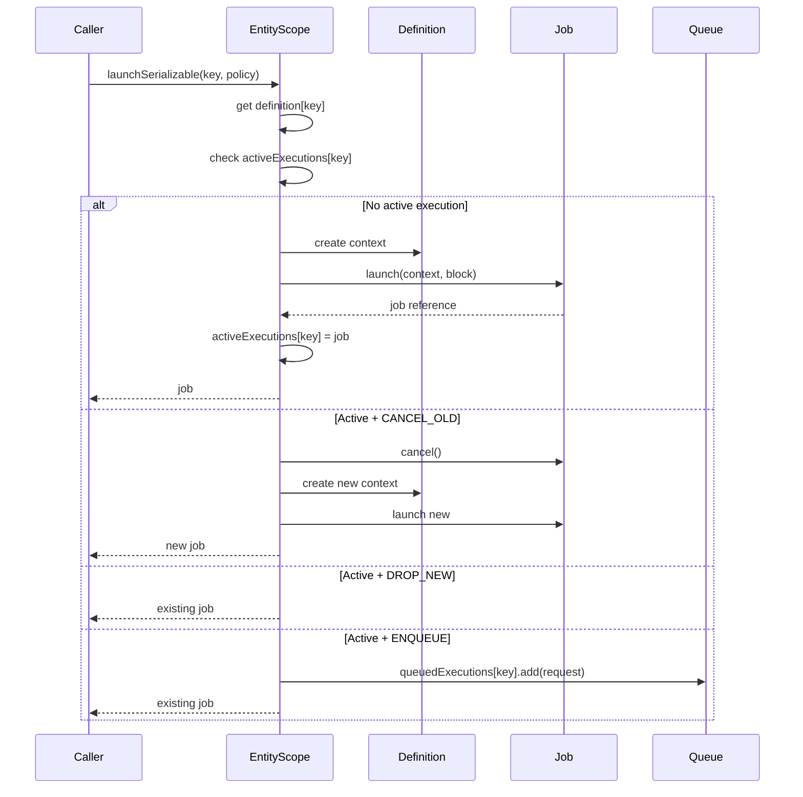
```mermaid
sequenceDiagram
    participant Caller
    participant EntityScope
    participant Definition
    participant Job
    participant Queue
    
    Caller->>EntityScope: launchSerializable(key, policy)
    EntityScope->>EntityScope: get definition[key]
    EntityScope->>EntityScope: check activeExecutions[key]
    
    alt No active execution
        EntityScope->>Definition: create context
        EntityScope->>Job: launch(context, block)
        Job-->>EntityScope: job reference
        EntityScope->>EntityScope: activeExecutions[key] = job
        EntityScope-->>Caller: job
    else Active + CANCEL_OLD
        EntityScope->>Job: cancel()
        EntityScope->>Definition: create new context
        EntityScope->>Job: launch new
        EntityScope-->>Caller: new job
    else Active + DROP_NEW
        EntityScope-->>Caller: existing job
    else Active + ENQUEUE
        EntityScope->>Queue: queuedExecutions[key].add(request)
        EntityScope-->>Caller: existing job
    end
```

**Launch Policy Handling:**

The `launchSerializable()` method implements three policies:

1. **CANCEL_OLD**: Cancel running execution and start new one immediately
2. **DROP_NEW**: Ignore new launch if one is already running
3. **ENQUEUE**: Queue new launch to run after current completes

Sources: [src/main/java/ru/hollowhorizon/hollowengine/common/coroutines/EntityScope.kt:126-152]()

---

### Serialization Flow

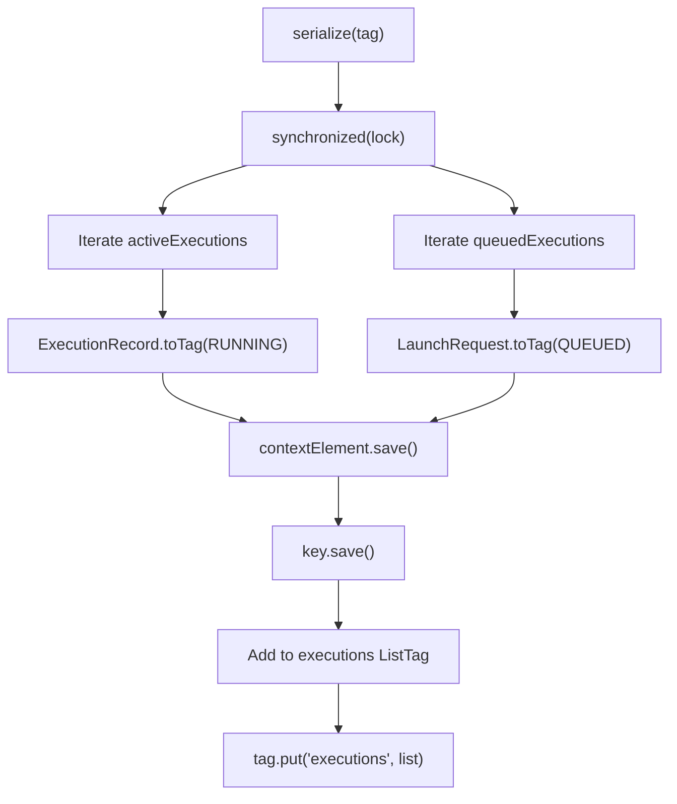
```mermaid
flowchart TD
    Start["serialize(tag)"] --> Lock["synchronized(lock)"]
    Lock --> Active["Iterate activeExecutions"]
    Lock --> Queued["Iterate queuedExecutions"]
    
    Active --> RecordA["ExecutionRecord.toTag(RUNNING)"]
    Queued --> RecordQ["LaunchRequest.toTag(QUEUED)"]
    
    RecordA --> SaveContext["contextElement.save()"]
    RecordQ --> SaveContext
    
    SaveContext --> SaveKey["key.save()"]
    SaveKey --> List["Add to executions ListTag"]
    List --> End["tag.put('executions', list)"]
```

**Serialization Process:**
1. Lock all collections to prevent concurrent modification
2. Iterate through `activeExecutions` and mark as `RUNNING`
3. Iterate through `queuedExecutions` and mark as `QUEUED`
4. For each execution, serialize:
   - The coroutine key (identifies which coroutine)
   - The state (RUNNING or QUEUED)
   - The context element (execution-specific data)
5. Store all in a single `ListTag` under key "executions"

Sources: [src/main/java/ru/hollowhorizon/hollowengine/common/coroutines/EntityScope.kt:40-55]()

---

### Deserialization and Restoration

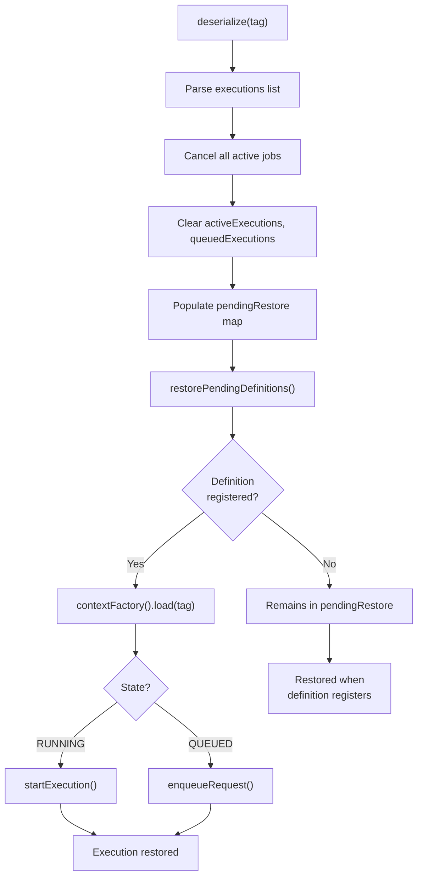
```mermaid
flowchart TD
    Start["deserialize(tag)"] --> Parse["Parse executions list"]
    Parse --> Cancel["Cancel all active jobs"]
    Cancel --> Clear["Clear activeExecutions, queuedExecutions"]
    Clear --> Populate["Populate pendingRestore map"]
    Populate --> Trigger["restorePendingDefinitions()"]
    
    Trigger --> CheckDef{Definition<br/>registered?}
    CheckDef -->|Yes| CreateCtx["contextFactory().load(tag)"]
    CheckDef -->|No| Wait["Remains in pendingRestore"]
    
    CreateCtx --> CheckState{State?}
    CheckState -->|RUNNING| Launch["startExecution()"]
    CheckState -->|QUEUED| Enqueue["enqueueRequest()"]
    
    Launch --> Done["Execution restored"]
    Enqueue --> Done
    Wait --> Later["Restored when<br/>definition registers"]
```

**Two-Phase Restoration:**

**Phase 1 - Deserialization** (entity loads from NBT):
- All execution metadata is parsed and stored in `pendingRestore`
- Existing active coroutines are cancelled
- No execution starts yet (definitions may not be registered)

**Phase 2 - Definition Registration** (when script file loads):
- `registerSerializable()` checks `pendingRestore` for matching keys
- Creates context elements from saved data
- Launches RUNNING executions immediately
- Enqueues QUEUED executions

Sources: [src/main/java/ru/hollowhorizon/hollowengine/common/coroutines/EntityScope.kt:57-77](), [src/main/java/ru/hollowhorizon/hollowengine/common/coroutines/EntityScope.kt:166-182]()

---

## Entity Integration via Mixin

### EntityMixin Injection Points

The `EntityMixin` class injects `EntityScope` into every Minecraft entity:

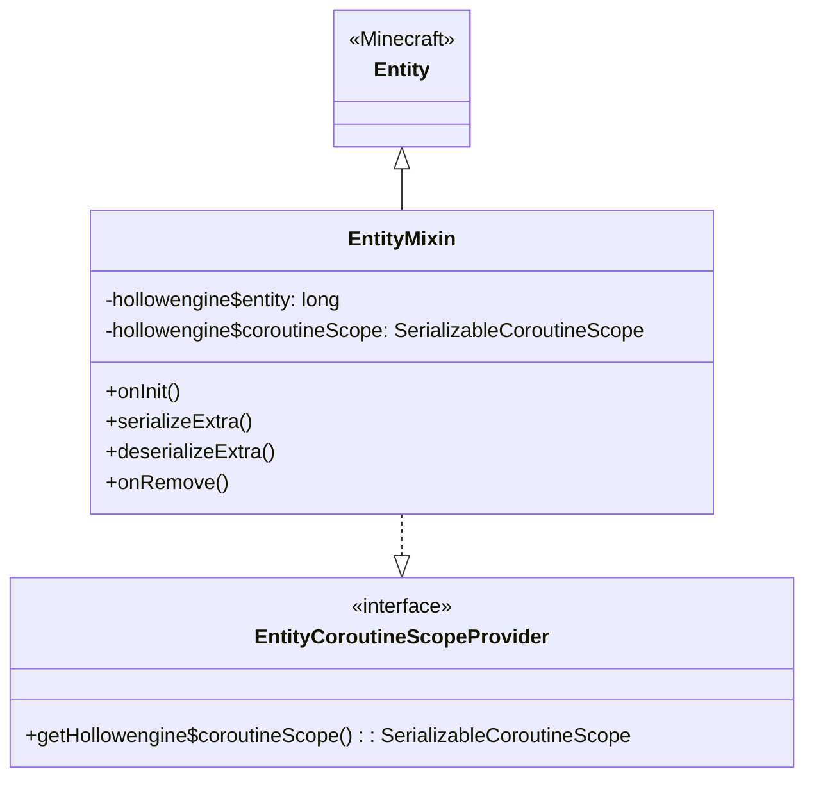
```mermaid
classDiagram
    class Entity {
        <<Minecraft>>
    }
    
    class EntityMixin {
        -hollowengine$entity: long
        -hollowengine$coroutineScope: SerializableCoroutineScope
        +onInit()
        +serializeExtra()
        +deserializeExtra()
        +onRemove()
    }
    
    class EntityCoroutineScopeProvider {
        <<interface>>
        +getHollowengine$coroutineScope(): SerializableCoroutineScope
    }
    
    Entity <|-- EntityMixin
    EntityMixin ..|> EntityCoroutineScopeProvider
```

**Injection Points:**

| Mixin Target | Method | Purpose |
|--------------|--------|---------|
| `<init>` | Constructor | Create new `EntityScope` instance |
| `saveWithoutId` | Save to NBT | Serialize coroutine state to "EntityScope" tag |
| `load` | Load from NBT | Deserialize and post `OwnerScopeRestoredEvent` |
| `setRemoved` | Entity removed | Cancel all coroutines (except for players) |

Sources: [src/main/java/ru/hollowhorizon/hollowengine/mixins/components/EntityMixin.java:48-68]()

---

### Entity Lifecycle Integration

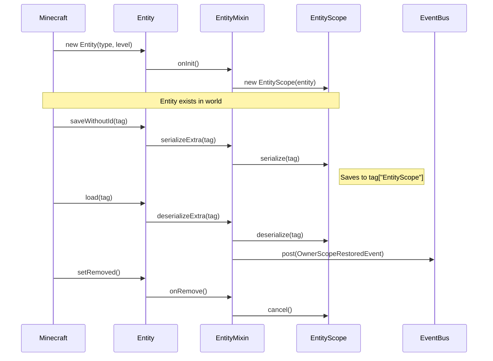
```mermaid
sequenceDiagram
    participant MC as Minecraft
    participant Entity
    participant Mixin as EntityMixin
    participant Scope as EntityScope
    participant Event as EventBus
    
    MC->>Entity: new Entity(type, level)
    Entity->>Mixin: onInit()
    Mixin->>Scope: new EntityScope(entity)
    
    Note over MC,Scope: Entity exists in world
    
    MC->>Entity: saveWithoutId(tag)
    Entity->>Mixin: serializeExtra(tag)
    Mixin->>Scope: serialize(tag)
    Note right of Scope: Saves to tag["EntityScope"]
    
    MC->>Entity: load(tag)
    Entity->>Mixin: deserializeExtra(tag)
    Mixin->>Scope: deserialize(tag)
    Mixin->>Event: post(OwnerScopeRestoredEvent)
    
    MC->>Entity: setRemoved()
    Entity->>Mixin: onRemove()
    Mixin->>Scope: cancel()
```

**Key Integration Points:**

1. **Creation**: Every entity gets its own `EntityScope` at construction
2. **Serialization**: Entity NBT includes "EntityScope" tag with all coroutine state
3. **Restoration**: On load, `OwnerScopeRestoredEvent` signals scripts to resume
4. **Cleanup**: Coroutines cancelled when entity removed (except players during dimension change)

Sources: [src/main/java/ru/hollowhorizon/hollowengine/mixins/components/EntityMixin.java:48-114]()

---

## Script Lifecycle with EntityScope

### ScriptInstance Coroutine Management

Each `ScriptInstance` represents one execution of a `StartBlock` and manages its lifecycle through `EntityScope`:

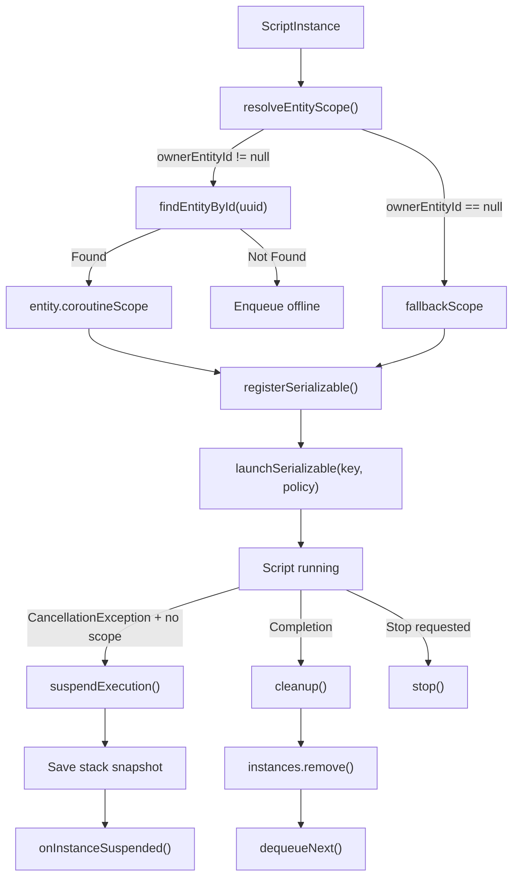
```mermaid
graph TB
    Instance["ScriptInstance"] --> ResolveScope["resolveEntityScope()"]
    ResolveScope -->|ownerEntityId != null| FindEntity["findEntityById(uuid)"]
    ResolveScope -->|ownerEntityId == null| Fallback["fallbackScope"]
    
    FindEntity -->|Found| EntityScope["entity.coroutineScope"]
    FindEntity -->|Not Found| Queue["Enqueue offline"]
    
    EntityScope --> Register["registerSerializable()"]
    Fallback --> Register
    
    Register --> Launch["launchSerializable(key, policy)"]
    Launch --> Running["Script running"]
    
    Running -->|CancellationException + no scope| Suspend["suspendExecution()"]
    Running -->|Completion| Cleanup["cleanup()"]
    Running -->|Stop requested| Cancel["stop()"]
    
    Suspend --> Snapshot["Save stack snapshot"]
    Snapshot --> Offline["onInstanceSuspended()"]
    
    Cleanup --> Remove["instances.remove()"]
    Remove --> Dequeue["dequeueNext()"]
```

**Scope Resolution Logic:**

| Scenario | Owner Entity ID | Scope Used | Behavior |
|----------|-----------------|------------|----------|
| Global script | `null` | `fallbackScope` (server dispatcher) | Runs on server main thread |
| Entity online | `UUID` | `entity.coroutineScope` | Bound to entity lifecycle |
| Entity offline | `UUID` | N/A | Queued in `offlineLaunches` |
| Entity unloads during execution | `UUID` | Lost | Suspends via `CancellationException` |

Sources: [src/main/java/ru/hollowhorizon/hollowengine/common/codeblocks/runtime/ScriptInstance.kt:101-103](), [src/main/java/ru/hollowhorizon/hollowengine/common/codeblocks/runtime/ScriptInstance.kt:122-148]()

---

### Start and Resume Flow

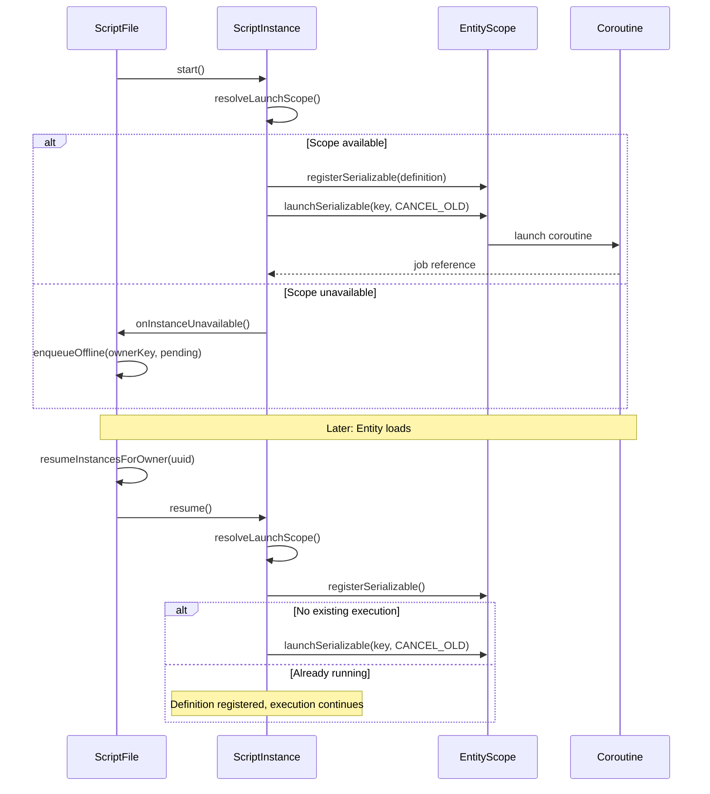
```mermaid
sequenceDiagram
    participant File as ScriptFile
    participant Instance as ScriptInstance
    participant Scope as EntityScope
    participant Job as Coroutine
    
    File->>Instance: start()
    Instance->>Instance: resolveLaunchScope()
    alt Scope available
        Instance->>Scope: registerSerializable(definition)
        Instance->>Scope: launchSerializable(key, CANCEL_OLD)
        Scope->>Job: launch coroutine
        Job-->>Instance: job reference
    else Scope unavailable
        Instance->>File: onInstanceUnavailable()
        File->>File: enqueueOffline(ownerKey, pending)
    end
    
    Note over File,Job: Later: Entity loads
    
    File->>File: resumeInstancesForOwner(uuid)
    File->>Instance: resume()
    Instance->>Instance: resolveLaunchScope()
    Instance->>Scope: registerSerializable()
    alt No existing execution
        Instance->>Scope: launchSerializable(key, CANCEL_OLD)
    else Already running
        Note over Instance: Definition registered, execution continues
    end
```

**Start vs Resume:**

- **`start()`**: Initial launch when script first triggered
  - Registers definition with fresh context factory
  - Launches with `CANCEL_OLD` policy
  - If scope unavailable, queues offline

- **`resume()`**: Called after deserialization or scope restoration
  - Registers definition (may have pending restore data)
  - Only launches if no existing execution (scope may already have it)
  - Allows pending restore to reconstruct execution state

Sources: [src/main/java/ru/hollowhorizon/hollowengine/common/codeblocks/runtime/ScriptInstance.kt:55-84]()

---

## Offline Queue and Scope Restoration

### Offline Launch Management

When a script tries to launch on an entity whose scope is unavailable (entity unloaded or in transit), the launch is queued for later:

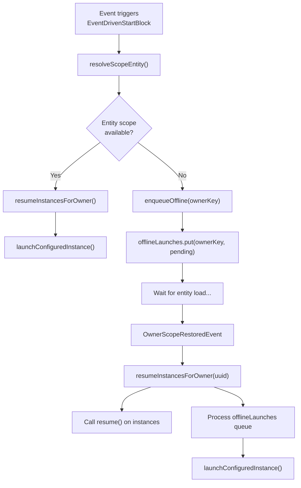
```mermaid
flowchart TD
    LaunchTrigger["Event triggers<br/>EventDrivenStartBlock"] --> Resolve["resolveScopeEntity()"]
    Resolve --> Check{Entity scope<br/>available?}
    
    Check -->|Yes| Resume["resumeInstancesForOwner()"]
    Check -->|No| Offline["enqueueOffline(ownerKey)"]
    
    Resume --> Launch["launchConfiguredInstance()"]
    Offline --> Store["offlineLaunches.put(ownerKey, pending)"]
    
    Store --> Wait["Wait for entity load..."]
    Wait --> Event["OwnerScopeRestoredEvent"]
    Event --> Restore["resumeInstancesForOwner(uuid)"]
    
    Restore --> Resume2["Call resume() on instances"]
    Restore --> DequeueOffline["Process offlineLaunches queue"]
    DequeueOffline --> Launch2["launchConfiguredInstance()"]
```

**Offline Queue Structure:**

The `offlineLaunches` map stores pending launches by owner key:
```
offlineLaunches: Map<OwnerKey, ArrayDeque<PendingLaunch>>
  ├─ OwnerKey.Entity(uuid1) -> [pending1, pending2, ...]
  ├─ OwnerKey.Entity(uuid2) -> [pending3]
  └─ OwnerKey.Global -> []
```

Each `PendingLaunch` contains:
- `rootBlock`: The `StartBlock` to execute
- `ownerKey`: Entity or global scope identifier
- `triggerContext`: Event context from the trigger
- `instanceId`: Optional UUID for restoration

Sources: [src/main/java/ru/hollowhorizon/hollowengine/common/codeblocks/runtime/ScriptFile.kt:46-47](), [src/main/java/ru/hollowhorizon/hollowengine/common/codeblocks/runtime/ScriptFile.kt:257-265](), [src/main/java/ru/hollowhorizon/hollowengine/common/codeblocks/runtime/ScriptFile.kt:334-345]()

---

### OwnerScopeRestoredEvent

The `OwnerScopeRestoredEvent` is posted whenever an entity's scope becomes available:

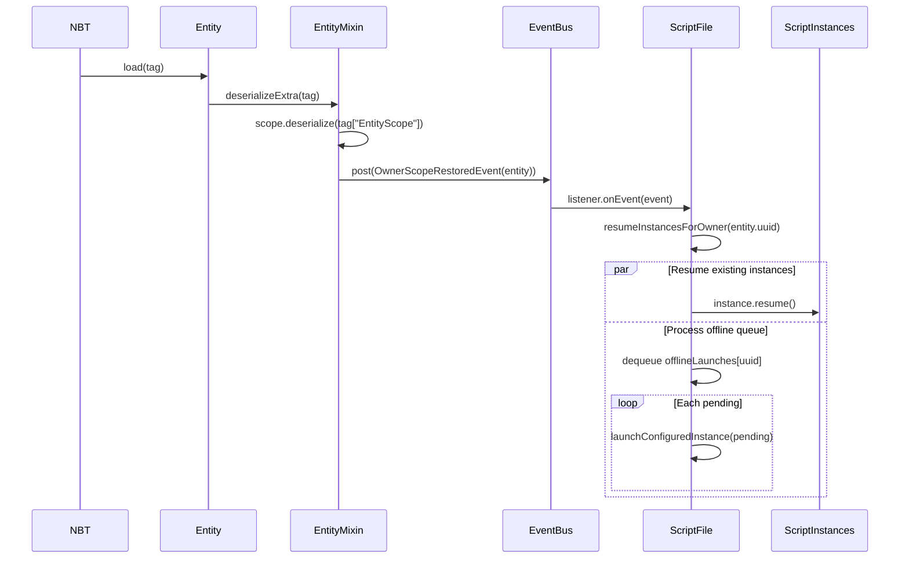
```mermaid
sequenceDiagram
    participant NBT
    participant Entity
    participant Mixin as EntityMixin
    participant Bus as EventBus
    participant File as ScriptFile
    participant Instances as ScriptInstances
    
    NBT->>Entity: load(tag)
    Entity->>Mixin: deserializeExtra(tag)
    Mixin->>Mixin: scope.deserialize(tag["EntityScope"])
    Mixin->>Bus: post(OwnerScopeRestoredEvent(entity))
    
    Bus->>File: listener.onEvent(event)
    File->>File: resumeInstancesForOwner(entity.uuid)
    
    par Resume existing instances
        File->>Instances: instance.resume()
    and Process offline queue
        File->>File: dequeue offlineLaunches[uuid]
        loop Each pending
            File->>File: launchConfiguredInstance(pending)
        end
    end
```

**Event Registration:**

Each `ScriptFile` registers a listener during `startAllTriggers()`:
```kotlin
EventBus.registerNoInline(
    OwnerScopeRestoredEvent::class.java,
    listener: EventListener<OwnerScopeRestoredEvent>
)
```

This ensures that when an entity loads from NBT:
1. Its `EntityScope` deserializes first (in mixin)
2. Event is posted immediately after
3. All scripts with that entity as owner resume
4. All queued offline launches execute

Sources: [src/main/java/ru/hollowhorizon/hollowengine/mixins/components/EntityMixin.java:64-69](), [src/main/java/ru/hollowhorizon/hollowengine/common/codeblocks/runtime/ScriptFile.kt:171-181](), [src/main/java/ru/hollowhorizon/hollowengine/common/codeblocks/runtime/OwnerScopeRestoredEvent.kt:1-8]()

---

## BlockFrameStackElement

### Execution Context Management

`BlockFrameStackElement` is a serializable coroutine context element that maintains a stack of execution frames for block script interpretation:

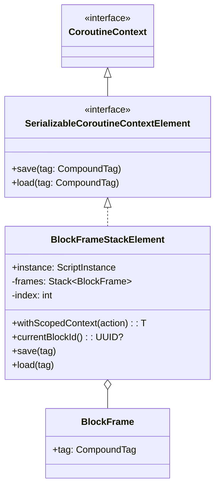
```mermaid
classDiagram
    class CoroutineContext {
        <<interface>>
    }
    
    class SerializableCoroutineContextElement {
        <<interface>>
        +save(tag: CompoundTag)
        +load(tag: CompoundTag)
    }
    
    class BlockFrameStackElement {
        +instance: ScriptInstance
        -frames: Stack~BlockFrame~
        -index: int
        +withScopedContext(action): T
        +currentBlockId(): UUID?
        +save(tag)
        +load(tag)
    }
    
    class BlockFrame {
        +tag: CompoundTag
    }
    
    CoroutineContext <|-- SerializableCoroutineContextElement
    SerializableCoroutineContextElement <|.. BlockFrameStackElement
    BlockFrameStackElement o-- BlockFrame
```

**Frame Stack Purpose:**

Each level of block nesting creates a new frame:
- **Frame 0**: Root execution context (top-level statements)
- **Frame 1**: Inside first container block (e.g., `IfBlock`)
- **Frame 2**: Inside nested container (e.g., `WhileBlock` inside `IfBlock`)
- ...and so on

Each `BlockFrame` contains a `CompoundTag` that stores:
- Current block UUID being executed
- Loop indices for `RepeatBlock`, `WhileBlock`
- Cached values from `remember()` calls
- Any other block-specific state

Sources: [src/main/java/ru/hollowhorizon/hollowengine/common/codeblocks/execution/BlockFrameStackElement.kt:17-60]()

---

### Scoped Context Execution

The `withScopedContext()` method manages frame lifecycle:

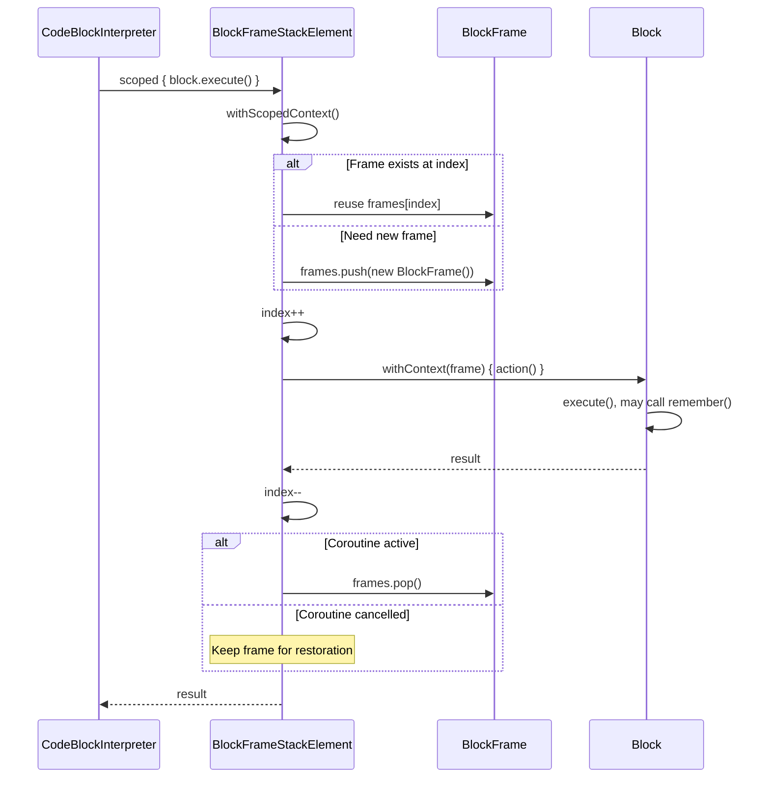
```mermaid
sequenceDiagram
    participant Interpreter as CodeBlockInterpreter
    participant Stack as BlockFrameStackElement
    participant Frame as BlockFrame
    participant Block
    
    Interpreter->>Stack: scoped { block.execute() }
    Stack->>Stack: withScopedContext()
    
    alt Frame exists at index
        Stack->>Frame: reuse frames[index]
    else Need new frame
        Stack->>Frame: frames.push(new BlockFrame())
    end
    
    Stack->>Stack: index++
    Stack->>Block: withContext(frame) { action() }
    Block->>Block: execute(), may call remember()
    Block-->>Stack: result
    
    Stack->>Stack: index--
    alt Coroutine active
        Stack->>Frame: frames.pop()
    else Coroutine cancelled
        Note over Stack: Keep frame for restoration
    end
    
    Stack-->>Interpreter: result
```

**Frame Reuse vs Creation:**

- If `index < frames.size`: Reuse existing frame (during restoration)
- Otherwise: Create new frame and push to stack

**Preservation on Cancellation:**

When a coroutine is cancelled (e.g., entity unloads), frames are NOT popped. This preserves the execution stack for later restoration. The `currentCoroutineContext().isActive` check determines whether to pop.

Sources: [src/main/java/ru/hollowhorizon/hollowengine/common/codeblocks/execution/BlockFrameStackElement.kt:25-42]()

---

### Serialization Format

The stack serializes as a list of frame tags:

```
BlockFrameStackElement NBT:
{
  "frames": [
    {  // Frame 0 (root)
      "uuid": "12345678-1234-...",  // Current block ID
      "counterVar": 5                // Custom state
    },
    {  // Frame 1 (nested container)
      "uuid": "abcdefgh-abcd-...",
      "index": 3,                    // RepeatBlock index
      "times": 10                    // RepeatBlock total
    }
  ]
}
```

When loaded, the interpreter resumes from the innermost frame's UUID, with all frame state intact.

Sources: [src/main/java/ru/hollowhorizon/hollowengine/common/codeblocks/execution/BlockFrameStackElement.kt:44-54]()

---

## Launch Policies in Detail

### Policy Comparison Table

| Policy | Existing Active | Behavior | Use Case |
|--------|-----------------|----------|----------|
| `CANCEL_OLD` | Cancelled | New execution starts immediately | Event handlers that should interrupt previous |
| `DROP_NEW` | Keeps running | New launch ignored, returns existing job | Rate limiting, ignore duplicate triggers |
| `ENQUEUE` | Keeps running | New launch queued | Sequential processing, no interruption |

### CANCEL_OLD Policy

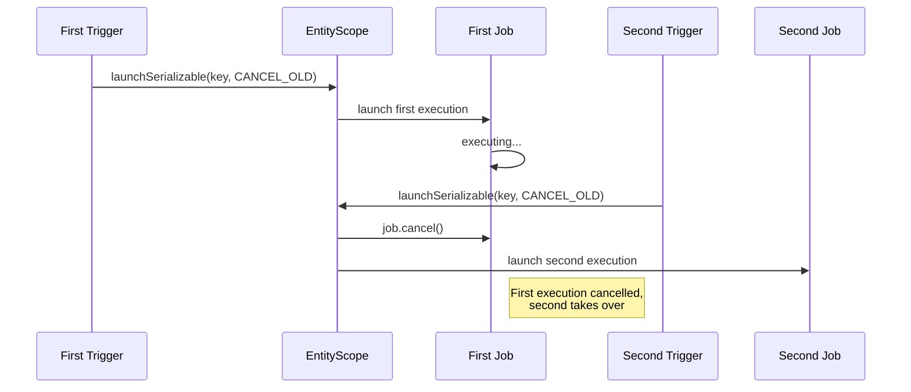
```mermaid
sequenceDiagram
    participant Trigger1 as First Trigger
    participant Scope as EntityScope
    participant Job1 as First Job
    participant Trigger2 as Second Trigger
    participant Job2 as Second Job
    
    Trigger1->>Scope: launchSerializable(key, CANCEL_OLD)
    Scope->>Job1: launch first execution
    Job1->>Job1: executing...
    
    Trigger2->>Scope: launchSerializable(key, CANCEL_OLD)
    Scope->>Job1: job.cancel()
    Scope->>Job2: launch second execution
    Note right of Job1: First execution cancelled,<br/>second takes over
```

**Example Use Case:** Player chat event handlers where newest message should override previous processing.

Sources: [src/main/java/ru/hollowhorizon/hollowengine/common/coroutines/EntityScope.kt:138-141]()

---

### DROP_NEW Policy

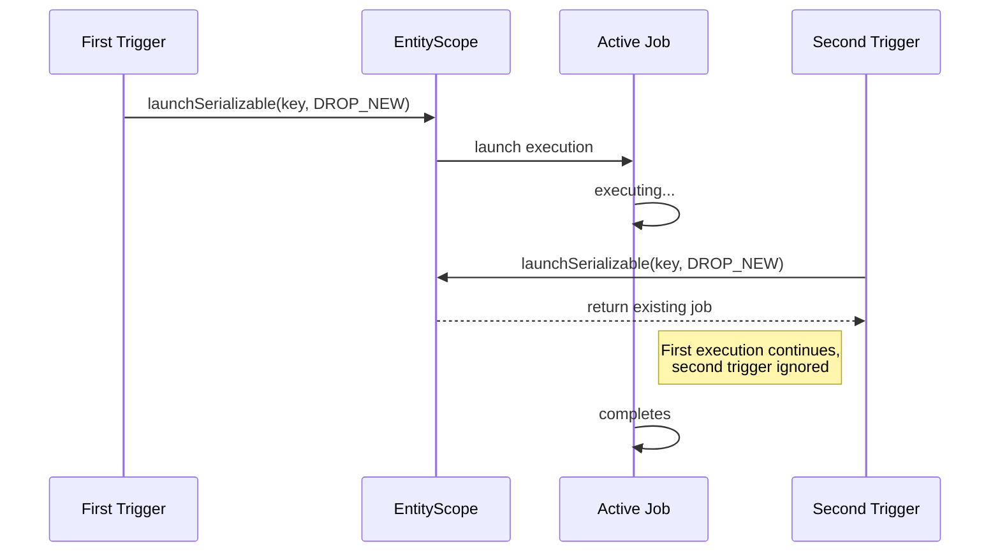
```mermaid
sequenceDiagram
    participant Trigger1 as First Trigger
    participant Scope as EntityScope
    participant Job1 as Active Job
    participant Trigger2 as Second Trigger
    
    Trigger1->>Scope: launchSerializable(key, DROP_NEW)
    Scope->>Job1: launch execution
    Job1->>Job1: executing...
    
    Trigger2->>Scope: launchSerializable(key, DROP_NEW)
    Scope-->>Trigger2: return existing job
    Note right of Job1: First execution continues,<br/>second trigger ignored
    
    Job1->>Job1: completes
```

**Example Use Case:** Cooldown systems where repeated triggers should be ignored until previous completes.

Sources: [src/main/java/ru/hollowhorizon/hollowengine/common/coroutines/EntityScope.kt:143]()

---

### ENQUEUE Policy

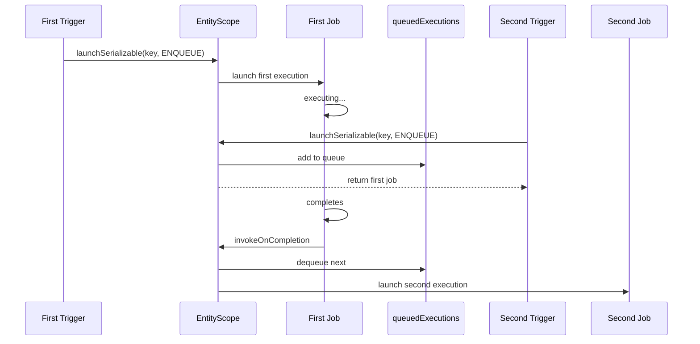
```mermaid
sequenceDiagram
    participant Trigger1 as First Trigger
    participant Scope as EntityScope
    participant Job1 as First Job
    participant Queue as queuedExecutions
    participant Trigger2 as Second Trigger
    participant Job2 as Second Job
    
    Trigger1->>Scope: launchSerializable(key, ENQUEUE)
    Scope->>Job1: launch first execution
    Job1->>Job1: executing...
    
    Trigger2->>Scope: launchSerializable(key, ENQUEUE)
    Scope->>Queue: add to queue
    Scope-->>Trigger2: return first job
    
    Job1->>Job1: completes
    Job1->>Scope: invokeOnCompletion
    Scope->>Queue: dequeue next
    Scope->>Job2: launch second execution
```

**Example Use Case:** Sequential NPC dialogue where each message must complete before the next begins.

Sources: [src/main/java/ru/hollowhorizon/hollowengine/common/coroutines/EntityScope.kt:145-151](), [src/main/java/ru/hollowhorizon/hollowengine/common/coroutines/EntityScope.kt:211-223]()

---

## Testing and Verification

### Core Execution Test Cases

The test suite verifies critical serialization and restoration behaviors:

**Test: Restored execution continues from waiting block**

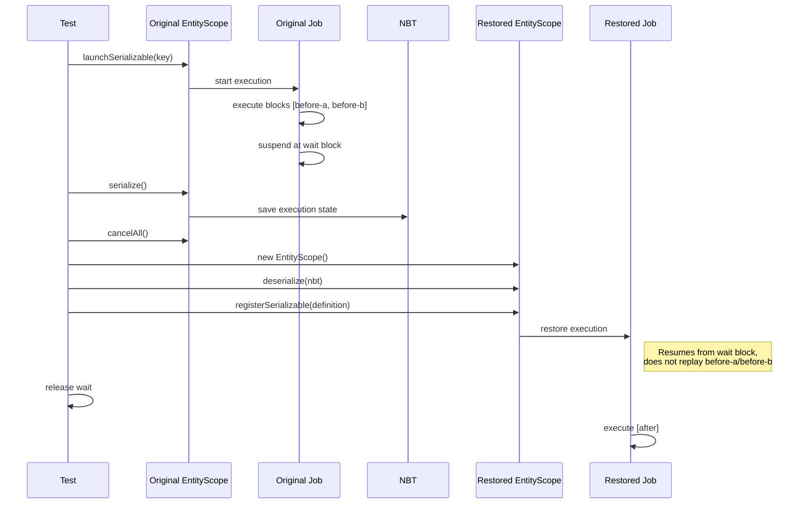
```mermaid
sequenceDiagram
    participant Test
    participant Scope1 as Original EntityScope
    participant Job1 as Original Job
    participant NBT
    participant Scope2 as Restored EntityScope
    participant Job2 as Restored Job
    
    Test->>Scope1: launchSerializable(key)
    Scope1->>Job1: start execution
    Job1->>Job1: execute blocks [before-a, before-b]
    Job1->>Job1: suspend at wait block
    
    Test->>Scope1: serialize()
    Scope1->>NBT: save execution state
    Test->>Scope1: cancelAll()
    
    Test->>Scope2: new EntityScope()
    Test->>Scope2: deserialize(nbt)
    Test->>Scope2: registerSerializable(definition)
    Scope2->>Job2: restore execution
    Note right of Job2: Resumes from wait block,<br/>does not replay before-a/before-b
    
    Test->>Test: release wait
    Job2->>Job2: execute [after]
```

This test confirms that:
1. Execution pauses at suspension points
2. State serializes including current block position
3. Restoration resumes from exact suspension point
4. Already-executed blocks do not re-run

Sources: [src/test/kotlin/ScriptExecutionLifecycleTests.kt:171-204]()

---

### Queue Behavior Verification

**Test: Queued retrigger waits for restored execution**

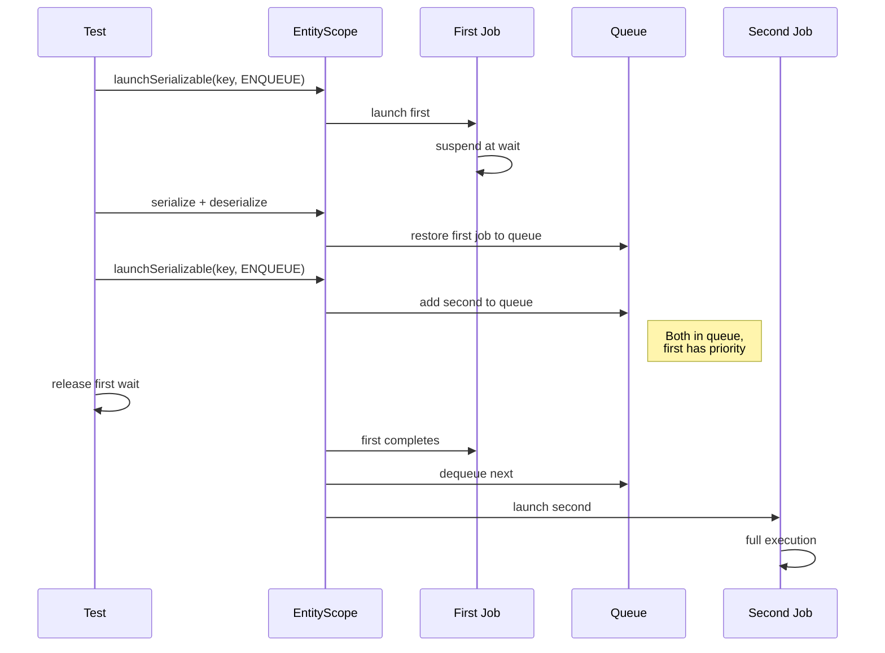
```mermaid
sequenceDiagram
    participant Test
    participant Scope as EntityScope
    participant Job1 as First Job
    participant Queue
    participant Job2 as Second Job
    
    Test->>Scope: launchSerializable(key, ENQUEUE)
    Scope->>Job1: launch first
    Job1->>Job1: suspend at wait
    
    Test->>Scope: serialize + deserialize
    Scope->>Queue: restore first job to queue
    
    Test->>Scope: launchSerializable(key, ENQUEUE)
    Scope->>Queue: add second to queue
    Note right of Queue: Both in queue,<br/>first has priority
    
    Test->>Test: release first wait
    Scope->>Job1: first completes
    Scope->>Queue: dequeue next
    Scope->>Job2: launch second
    Job2->>Job2: full execution
```

This verifies:
1. Restored executions maintain queue position
2. New triggers queue behind restored executions
3. Completion triggers next queued launch

Sources: [src/test/kotlin/ScriptExecutionLifecycleTests.kt:207-260]()

---

## Integration Summary

### Complete Execution Flow

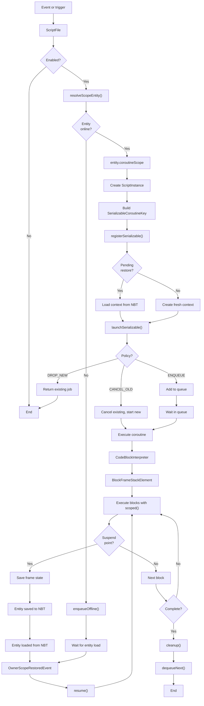
```mermaid
graph TB
    Start["Event or trigger"] --> File["ScriptFile"]
    File --> CheckEnabled{Enabled?}
    CheckEnabled -->|No| End1["End"]
    CheckEnabled -->|Yes| Resolve["resolveScopeEntity()"]
    
    Resolve --> CheckOnline{Entity<br/>online?}
    CheckOnline -->|Yes| GetScope["entity.coroutineScope"]
    CheckOnline -->|No| QueueOffline["enqueueOffline()"]
    
    GetScope --> CreateInstance["Create ScriptInstance"]
    CreateInstance --> BuildKey["Build SerializableCoroutineKey"]
    BuildKey --> RegisterDef["registerSerializable()"]
    
    RegisterDef --> CheckPending{Pending<br/>restore?}
    CheckPending -->|Yes| LoadContext["Load context from NBT"]
    CheckPending -->|No| CreateContext["Create fresh context"]
    
    LoadContext --> Launch
    CreateContext --> Launch["launchSerializable()"]
    
    Launch --> CheckPolicy{Policy?}
    CheckPolicy -->|CANCEL_OLD| CancelOld["Cancel existing, start new"]
    CheckPolicy -->|DROP_NEW| DropNew["Return existing job"]
    CheckPolicy -->|ENQUEUE| EnqueueNew["Add to queue"]
    
    CancelOld --> Execute["Execute coroutine"]
    EnqueueNew --> WaitQueue["Wait in queue"]
    WaitQueue --> Execute
    
    Execute --> Interpreter["CodeBlockInterpreter"]
    Interpreter --> StackElement["BlockFrameStackElement"]
    StackElement --> Blocks["Execute blocks with scoped()"]
    
    Blocks --> CheckSuspend{Suspend<br/>point?}
    CheckSuspend -->|Yes| SaveFrame["Save frame state"]
    CheckSuspend -->|No| NextBlock["Next block"]
    
    SaveFrame --> EntitySave["Entity saved to NBT"]
    EntitySave --> EntityLoad["Entity loaded from NBT"]
    EntityLoad --> RestoreEvent["OwnerScopeRestoredEvent"]
    RestoreEvent --> Resume["resume()"]
    Resume --> Blocks
    
    NextBlock --> CheckComplete{Complete?}
    CheckComplete -->|No| Blocks
    CheckComplete -->|Yes| Cleanup["cleanup()"]
    
    Cleanup --> DequeueNext["dequeueNext()"]
    DequeueNext --> End2["End"]
    
    QueueOffline --> WaitRestore["Wait for entity load"]
    WaitRestore --> RestoreEvent
    DropNew --> End1
```

This diagram shows the complete lifecycle from event trigger to execution completion, including serialization, restoration, and queue management.

Sources: [src/main/java/ru/hollowhorizon/hollowengine/common/codeblocks/runtime/ScriptFile.kt:229-254](), [src/main/java/ru/hollowhorizon/hollowengine/common/codeblocks/runtime/ScriptInstance.kt:55-151](), [src/main/java/ru/hollowhorizon/hollowengine/common/coroutines/EntityScope.kt:126-152]()