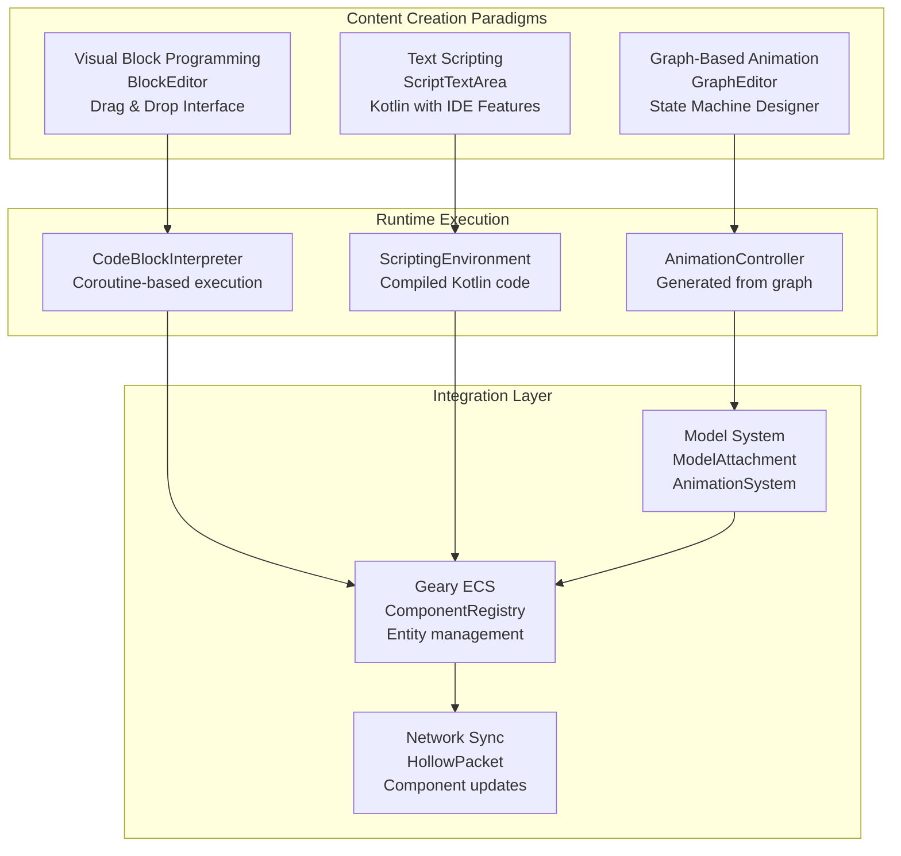
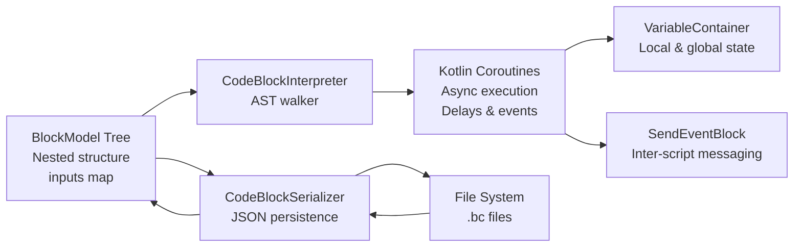
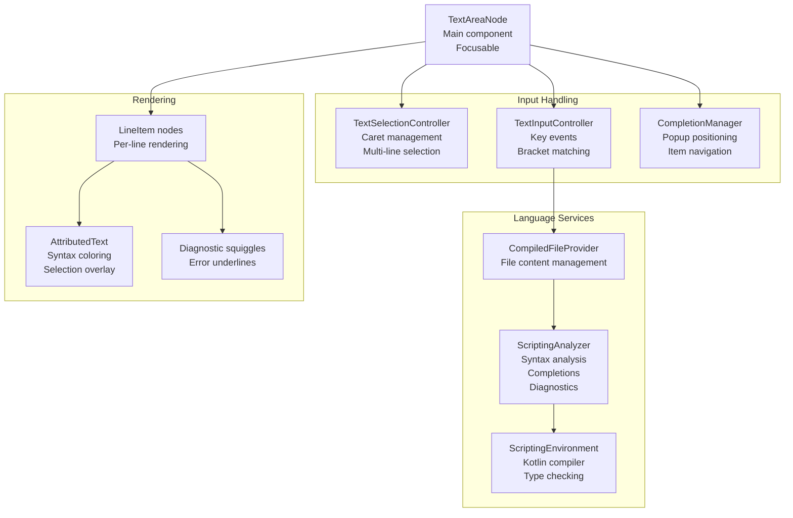
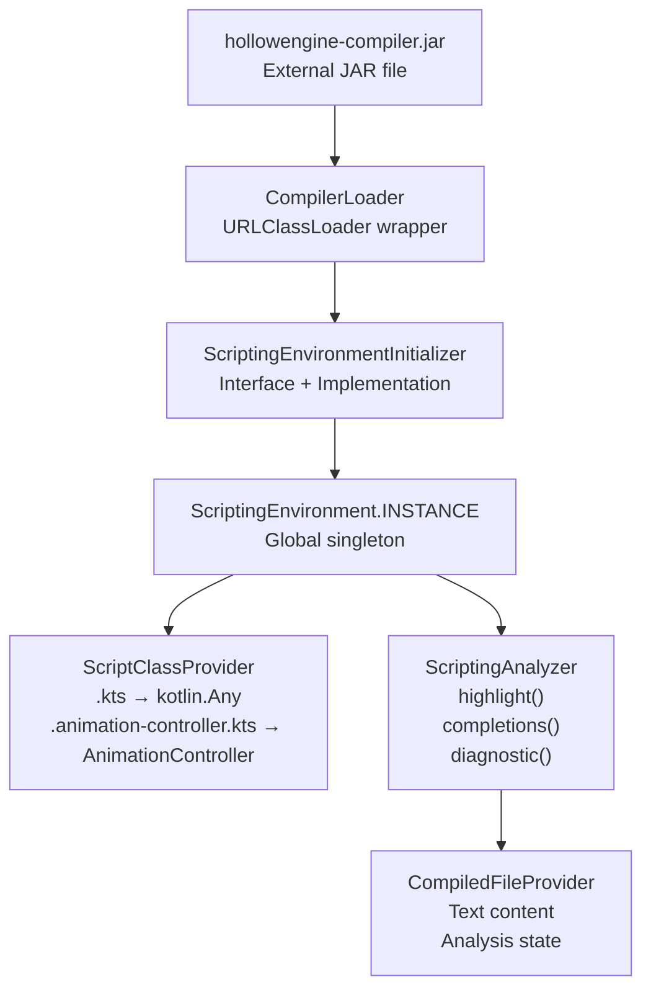
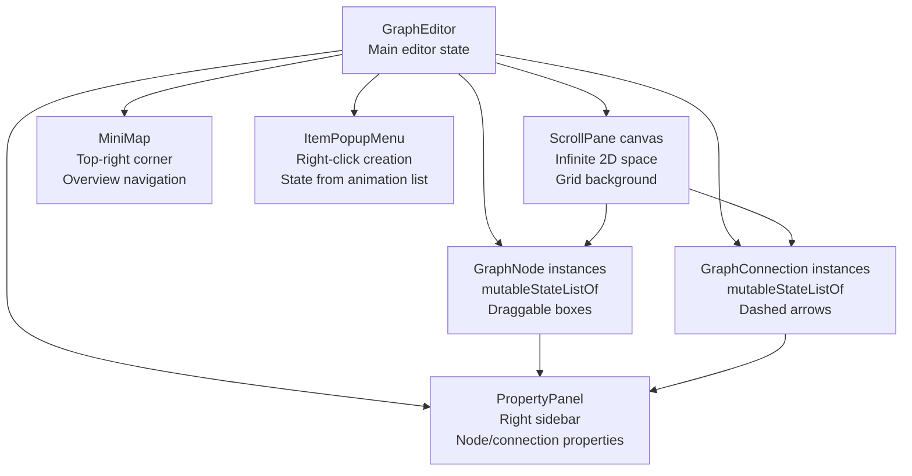
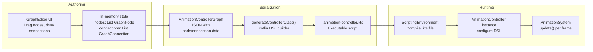
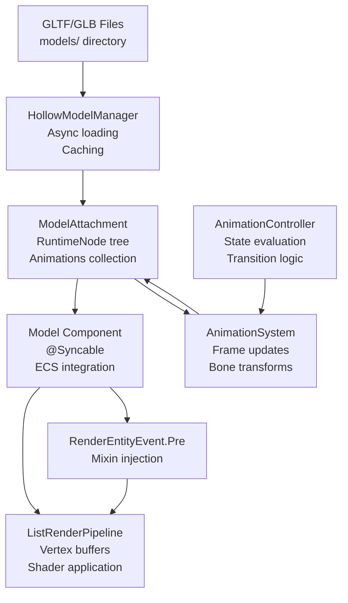
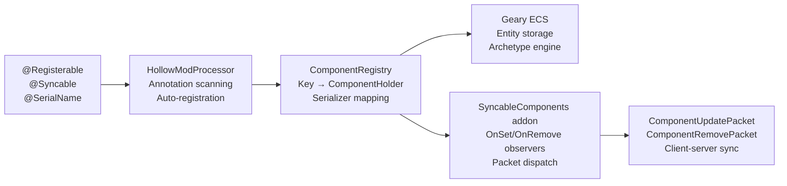
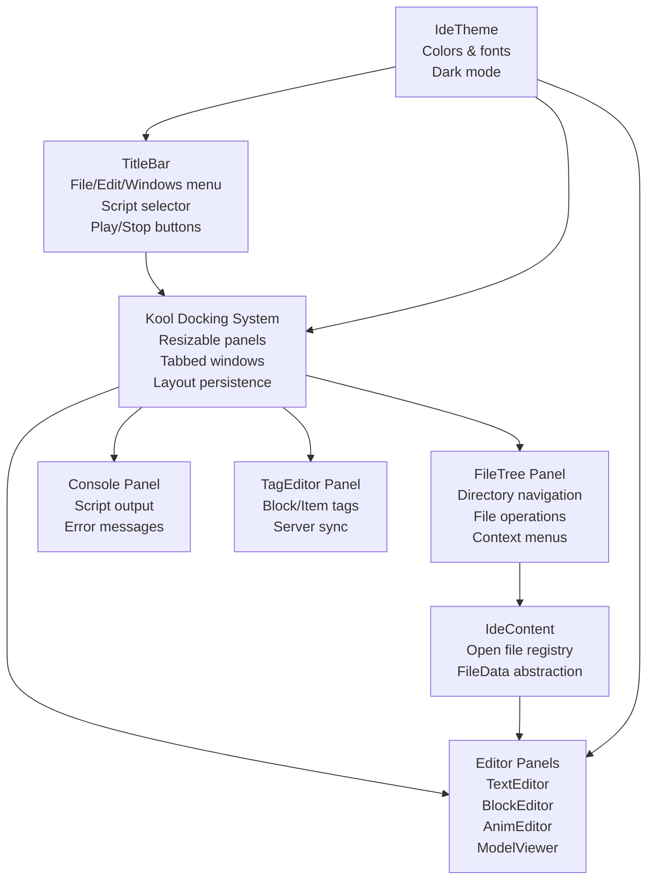
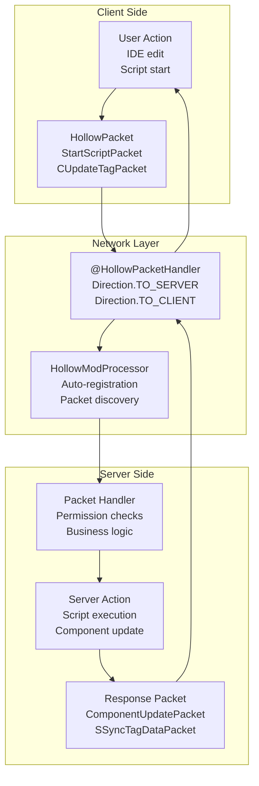

# Key Features

<details>
<summary>Relevant source files</summary>

The following files were used as context for generating this wiki page:

- [src/main/java/ru/hollowhorizon/hollowengine/client/gui/animations/Graph.kt](src/main/java/ru/hollowhorizon/hollowengine/client/gui/animations/Graph.kt)
- [src/main/java/ru/hollowhorizon/hollowengine/client/gui/animations/GraphEditor.kt](src/main/java/ru/hollowhorizon/hollowengine/client/gui/animations/GraphEditor.kt)
- [src/main/java/ru/hollowhorizon/hollowengine/client/gui/codeblocks/BlockEditor.kt](src/main/java/ru/hollowhorizon/hollowengine/client/gui/codeblocks/BlockEditor.kt)
- [src/main/java/ru/hollowhorizon/hollowengine/client/gui/codeblocks/InputSlotScope.kt](src/main/java/ru/hollowhorizon/hollowengine/client/gui/codeblocks/InputSlotScope.kt)
- [src/main/java/ru/hollowhorizon/hollowengine/client/gui/codeblocks/PuzzleShapes.kt](src/main/java/ru/hollowhorizon/hollowengine/client/gui/codeblocks/PuzzleShapes.kt)
- [src/main/java/ru/hollowhorizon/hollowengine/client/gui/codeblocks/ScratchBlockBackground.kt](src/main/java/ru/hollowhorizon/hollowengine/client/gui/codeblocks/ScratchBlockBackground.kt)
- [src/main/java/ru/hollowhorizon/hollowengine/client/gui/codeblocks/SlotBackground.kt](src/main/java/ru/hollowhorizon/hollowengine/client/gui/codeblocks/SlotBackground.kt)
- [src/main/java/ru/hollowhorizon/hollowengine/client/gui/colors/ColorTheme.kt](src/main/java/ru/hollowhorizon/hollowengine/client/gui/colors/ColorTheme.kt)
- [src/main/java/ru/hollowhorizon/hollowengine/client/gui/scripting/files/ScriptFile.kt](src/main/java/ru/hollowhorizon/hollowengine/client/gui/scripting/files/ScriptFile.kt)
- [src/main/java/ru/hollowhorizon/hollowengine/client/gui/scripting/files/animations/AnimationControllerFile.kt](src/main/java/ru/hollowhorizon/hollowengine/client/gui/scripting/files/animations/AnimationControllerFile.kt)
- [src/main/java/ru/hollowhorizon/hollowengine/client/gui/scripting/files/text/ScriptTextEditorHandler.kt](src/main/java/ru/hollowhorizon/hollowengine/client/gui/scripting/files/text/ScriptTextEditorHandler.kt)
- [src/main/java/ru/hollowhorizon/hollowengine/client/gui/scripting/files/text/SelectionHelper.kt](src/main/java/ru/hollowhorizon/hollowengine/client/gui/scripting/files/text/SelectionHelper.kt)
- [src/main/java/ru/hollowhorizon/hollowengine/client/gui/scripting/files/text/components/CommandRegistry.kt](src/main/java/ru/hollowhorizon/hollowengine/client/gui/scripting/files/text/components/CommandRegistry.kt)
- [src/main/java/ru/hollowhorizon/hollowengine/client/gui/scripting/files/text/components/EditorCommandContext.kt](src/main/java/ru/hollowhorizon/hollowengine/client/gui/scripting/files/text/components/EditorCommandContext.kt)
- [src/main/java/ru/hollowhorizon/hollowengine/client/gui/scripting/files/text/components/EditorLanguageService.kt](src/main/java/ru/hollowhorizon/hollowengine/client/gui/scripting/files/text/components/EditorLanguageService.kt)
- [src/main/java/ru/hollowhorizon/hollowengine/client/gui/scripting/files/text/components/EditorState.kt](src/main/java/ru/hollowhorizon/hollowengine/client/gui/scripting/files/text/components/EditorState.kt)
- [src/main/java/ru/hollowhorizon/hollowengine/client/gui/scripting/files/text/components/TextInputController.kt](src/main/java/ru/hollowhorizon/hollowengine/client/gui/scripting/files/text/components/TextInputController.kt)
- [src/main/java/ru/hollowhorizon/hollowengine/client/gui/scripting/files/text/components/commands/ApplyBracketsCommand.kt](src/main/java/ru/hollowhorizon/hollowengine/client/gui/scripting/files/text/components/commands/ApplyBracketsCommand.kt)
- [src/main/java/ru/hollowhorizon/hollowengine/client/gui/scripting/files/text/components/commands/ApplyCompletionItemCommand.kt](src/main/java/ru/hollowhorizon/hollowengine/client/gui/scripting/files/text/components/commands/ApplyCompletionItemCommand.kt)
- [src/main/java/ru/hollowhorizon/hollowengine/client/gui/scripting/files/text/components/commands/EditorDefaultCommands.kt](src/main/java/ru/hollowhorizon/hollowengine/client/gui/scripting/files/text/components/commands/EditorDefaultCommands.kt)
- [src/main/java/ru/hollowhorizon/hollowengine/client/gui/scripting/files/text/components/commands/IndentCommand.kt](src/main/java/ru/hollowhorizon/hollowengine/client/gui/scripting/files/text/components/commands/IndentCommand.kt)
- [src/main/java/ru/hollowhorizon/hollowengine/client/gui/scripting/files/text/components/commands/InsertNewlineCommand.kt](src/main/java/ru/hollowhorizon/hollowengine/client/gui/scripting/files/text/components/commands/InsertNewlineCommand.kt)
- [src/main/java/ru/hollowhorizon/hollowengine/client/gui/scripting/files/text/components/commands/ToggleLineCommentCommand.kt](src/main/java/ru/hollowhorizon/hollowengine/client/gui/scripting/files/text/components/commands/ToggleLineCommentCommand.kt)
- [src/main/java/ru/hollowhorizon/hollowengine/client/gui/scripting/files/text/components/commands/UnindentCommand.kt](src/main/java/ru/hollowhorizon/hollowengine/client/gui/scripting/files/text/components/commands/UnindentCommand.kt)
- [src/main/java/ru/hollowhorizon/hollowengine/client/gui/scripting/files/text/components/keymap/EditorDefaultKeys.kt](src/main/java/ru/hollowhorizon/hollowengine/client/gui/scripting/files/text/components/keymap/EditorDefaultKeys.kt)
- [src/main/java/ru/hollowhorizon/hollowengine/client/gui/scripting/files/text/components/keymap/KeyMap.kt](src/main/java/ru/hollowhorizon/hollowengine/client/gui/scripting/files/text/components/keymap/KeyMap.kt)
- [src/main/java/ru/hollowhorizon/hollowengine/client/gui/scripting/files/text/util/CompiledFileProvider.kt](src/main/java/ru/hollowhorizon/hollowengine/client/gui/scripting/files/text/util/CompiledFileProvider.kt)
- [src/main/java/ru/hollowhorizon/hollowengine/client/gui/scripting/files/text/util/TextAreaNode.kt](src/main/java/ru/hollowhorizon/hollowengine/client/gui/scripting/files/text/util/TextAreaNode.kt)
- [src/main/java/ru/hollowhorizon/hollowengine/client/gui/scripting/titlebar/ComboBox.kt](src/main/java/ru/hollowhorizon/hollowengine/client/gui/scripting/titlebar/ComboBox.kt)
- [src/main/java/ru/hollowhorizon/hollowengine/client/models/internal/controller/AnimControllerDSL.kt](src/main/java/ru/hollowhorizon/hollowengine/client/models/internal/controller/AnimControllerDSL.kt)
- [src/main/java/ru/hollowhorizon/hollowengine/client/models/internal/controller/AnimationController.kt](src/main/java/ru/hollowhorizon/hollowengine/client/models/internal/controller/AnimationController.kt)
- [src/main/java/ru/hollowhorizon/hollowengine/client/models/internal/controller/AnimationDispatcher.kt](src/main/java/ru/hollowhorizon/hollowengine/client/models/internal/controller/AnimationDispatcher.kt)
- [src/main/java/ru/hollowhorizon/hollowengine/client/models/internal/controller/EntityUtils.kt](src/main/java/ru/hollowhorizon/hollowengine/client/models/internal/controller/EntityUtils.kt)
- [src/main/java/ru/hollowhorizon/hollowengine/common/codeblocks/BlocksScope.kt](src/main/java/ru/hollowhorizon/hollowengine/common/codeblocks/BlocksScope.kt)
- [src/main/java/ru/hollowhorizon/hollowengine/common/codeblocks/CodeBlock.kt](src/main/java/ru/hollowhorizon/hollowengine/common/codeblocks/CodeBlock.kt)
- [src/main/java/ru/hollowhorizon/hollowengine/common/codeblocks/serialization/CodeBlockFormat.kt](src/main/java/ru/hollowhorizon/hollowengine/common/codeblocks/serialization/CodeBlockFormat.kt)
- [src/main/java/ru/hollowhorizon/hollowengine/common/codeblocks/serialization/CodeBlockSerializer.kt](src/main/java/ru/hollowhorizon/hollowengine/common/codeblocks/serialization/CodeBlockSerializer.kt)
- [src/main/java/ru/hollowhorizon/hollowengine/common/scripting/CompilerLoader.kt](src/main/java/ru/hollowhorizon/hollowengine/common/scripting/CompilerLoader.kt)
- [src/main/java/ru/hollowhorizon/hollowengine/common/scripting/ide/JsonScriptingAnalyzer.kt](src/main/java/ru/hollowhorizon/hollowengine/common/scripting/ide/JsonScriptingAnalyzer.kt)
- [src/main/resources/assets/hollowengine/textures/gui/icons/global.svg](src/main/resources/assets/hollowengine/textures/gui/icons/global.svg)
- [src/main/resources/assets/hollowengine/textures/gui/icons/maximize.svg](src/main/resources/assets/hollowengine/textures/gui/icons/maximize.svg)

</details>


This page provides an overview of HollowEngine's major features and capabilities. It describes the primary systems available to content creators and developers, explaining what each feature does and how they interconnect. For detailed implementation information about specific subsystems, refer to their dedicated sections: [System Architecture](#1.3) for architectural details, [In-Game IDE](#3) for editor components, [Visual Block Editor](#5) for block programming, and [Text Script Editor](#4) for Kotlin scripting.

---

## Feature Overview

HollowEngine is a multi-paradigm content creation framework that provides three distinct authoring approaches, each targeting different skill levels and use cases:



**Sources:** [src/main/java/ru/hollowhorizon/hollowengine/client/gui/codeblocks/BlockEditor.kt:23-27](), [src/main/java/ru/hollowhorizon/hollowengine/client/gui/scripting/files/text/util/TextAreaNode.kt:261-284](), [src/main/java/ru/hollowhorizon/hollowengine/client/gui/animations/GraphEditor.kt:30-62]()

---

## Visual Block Programming

HollowEngine provides a Scratch-inspired block-based programming environment for users without coding experience. The system uses a drag-and-drop interface with puzzle-piece shaped blocks that connect together to form programs.

### Block Editor Architecture

| Component | Class | Purpose | Key Features |
|-----------|-------|---------|--------------|
| Editor Shell | `BlockEditor` | Main container managing scale, scroll, and drag state | Zoom (0.25x-3.0x), pan, keyboard shortcuts |
| Rendering | `ScratchBlockBackground` | Custom puzzle-piece rendering with notches | Bezier curves, shadows, selection highlights |
| Drag System | `DragState` | Handles block dragging from palette to canvas | Ghost previews, snap animations |
| Controller | `BlockController` | Manages selection, clipboard, undo/redo, connections | Multi-select, drag-drop validation |
| Blocks Panel | `BlocksPanel` | Collapsible sidebar with block categories | Filterable, preview rendering |
| History | `HistoryManager` | Undo/redo stack with compound actions | Merge consecutive edits |

**Keyboard Shortcuts:**
- **Ctrl+A** - Select all blocks
- **Ctrl+C/X/V** - Copy/Cut/Paste
- **Ctrl+Z/Y** - Undo/Redo
- **Ctrl+D** - Duplicate selection
- **Tab** - Toggle blocks panel
- **Del** - Delete selection
- **Home** - Reset camera position

**Sources:** [src/main/java/ru/hollowhorizon/hollowengine/client/gui/codeblocks/BlockEditor.kt:23-194](), [src/main/java/ru/hollowhorizon/hollowengine/client/gui/codeblocks/ScratchBlockBackground.kt:18-142]()

### Block Execution Model



The block system supports:
- **Control Flow**: `WhileBlock`, `RepeatBlock`, `IfBlock` with nested bodies
- **Data Types**: Numbers, booleans, strings via `NumberBlock`, `BoolBlock`, `StringValueBlock`
- **Math & Logic**: `MathBlock`, `CompareBlock`, `LogicBlock` for expressions
- **Variables**: Per-script and global variable storage
- **Events**: `SendEventBlock` for triggering other scripts
- **Delays**: `DelayBlock` for timing control using coroutines

**Sources:** [src/main/java/ru/hollowhorizon/hollowengine/common/codeblocks/serialization/CodeBlockSerializer.kt:17-52](), [src/main/java/ru/hollowhorizon/hollowengine/client/gui/codeblocks/BlockEditor.kt:69-156]()

---

## Text Script Editor

A full-featured Kotlin text editor with IDE-like capabilities runs inside the game, providing syntax highlighting, code completion, diagnostics, and refactoring tools.

### Editor Components



**Sources:** [src/main/java/ru/hollowhorizon/hollowengine/client/gui/scripting/files/text/util/TextAreaNode.kt:261-295](), [src/main/java/ru/hollowhorizon/hollowengine/client/gui/scripting/files/text/components/TextInputController.kt:17-24]()

### Key Editor Features

The text editor uses a command pattern architecture with `CommandRegistry` mapping `CommandKey` instances to `Command` implementations. All commands operate through `EditorCommandContext` which provides access to editor state, selection, and line provider.

| Feature | Implementation | Command | Keybind |
|---------|----------------|---------|---------|
| Code Completion | `CompletionManager` + `CompletionNavigateUp/DownCommand` | `CompletionAcceptCommand` | Up/Down, Enter/Tab |
| Syntax Highlighting | `ScriptingAnalyzer.highlight()` returns `TextLine` with `SpanStyle` | N/A | N/A |
| Diagnostics | `ScriptingAnalyzer.diagnostic()` returns `Diagnostic` list | N/A | Hover for popup |
| Undo/Redo | `UndoableAction` stack in `CompiledFileProvider` | `UndoCommand`, `RedoCommand` | Ctrl+Z, Ctrl+Y/Shift+Z |
| Line Comment | `ToggleLineCommentCommand` toggles `//` prefix | `ToggleLineCommentCommand` | Ctrl+/ |
| Format Code | `ReformatCommand` uses ktfmt `Formatter` | `ReformatCommand` | Ctrl+Alt+L (release) |
| Go to Definition | `GoToDefinitionCommand` queries analyzer | `GoToDefinitionCommand` | F4 |
| Indent/Unindent | `IndentCommand`, `UnindentCommand` | Multiple | Tab, Shift+Tab |
| Auto-brackets | `ApplyBracketsCommand` wraps selection or inserts pair | `ApplyBracketsCommand` | Auto on `(`, `{`, `[` |
| Smart Newline | `InsertNewlineCommand` with brace detection | `InsertNewlineCommand` | Enter |

**Command Registration Pattern:**
```kotlin
// EditorDefaultCommands.kt registers commands
CommandRegistry.register(SelectAllCommand.Key, SelectAllCommand())

// EditorDefaultKeys.kt binds keys to commands
KeyMap.bind(KeyBinding(key('A'), ctrl = true), SelectAllCommand.Key)

// KeyMap.resolve() finds best match by priority
val commandKey = KeyMap.resolve(event, ctx) ?: return false
CommandRegistry.execute(commandKey, ctx)
```

**Sources:** [src/main/java/ru/hollowhorizon/hollowengine/client/gui/scripting/files/text/components/CommandRegistry.kt:1-25](), [src/main/java/ru/hollowhorizon/hollowengine/client/gui/scripting/files/text/components/keymap/KeyMap.kt:1-36](), [src/main/java/ru/hollowhorizon/hollowengine/client/gui/scripting/files/text/components/commands/EditorDefaultCommands.kt:5-31](), [src/main/java/ru/hollowhorizon/hollowengine/client/gui/scripting/files/text/components/keymap/EditorDefaultKeys.kt:1-74]()

### Compiler Integration

The text editor integrates with `CompilerLoader` which dynamically loads the Kotlin compiler JAR at runtime, enabling full IDE features including type inference, error checking, and code generation.

**Compiler Architecture:**



**Multi-Script Support:**

The compiler supports multiple script types through `ScriptClassProvider`:

| Extension | Base Class | Default Imports | Usage |
|-----------|------------|-----------------|-------|
| `.kts` | `kotlin.Any` | None | General scripting |
| `.animation-controller.kts` | `AnimationController` | `LivingEntity`, `WrapMode`, etc. | Generated animation controllers |

**Analysis Pipeline:**

1. User types in `ScriptTextArea`
2. `CompiledFileProvider` debounces input (300ms) and sends to `ScriptingAnalyzer`
3. `ScriptingAnalyzer.highlight()` returns syntax-colored `TextLine` list
4. `ScriptingAnalyzer.completions()` returns `CompletionItem` list at cursor
5. `ScriptingAnalyzer.diagnostic()` returns `Diagnostic` errors/warnings
6. Results update `EditorAnalysisState` which drives UI rendering

**Sources:** [src/main/java/ru/hollowhorizon/hollowengine/common/scripting/CompilerLoader.kt:7-64](), [src/main/java/ru/hollowhorizon/hollowengine/client/gui/scripting/files/text/util/CompiledFileProvider.kt:36-93](), [src/main/java/ru/hollowhorizon/hollowengine/client/gui/scripting/files/text/components/EditorLanguageService.kt:1-27]()

---

## Animation Controller System

HollowEngine provides a graph-based animation controller for creating complex animation state machines visually. The system generates executable Kotlin code from the visual representation.

### Animation Workflow

**GraphEditor UI Components:**



**Data Flow:**



**Interactive Features:**

| Feature | Implementation | Interaction |
|---------|----------------|-------------|
| Node Movement | `onDrag` updates `GraphNode.xState/yState` | Left-drag node |
| Connection Creation | Store in `connections` list | Manual in property panel |
| Connection Selection | `findConnectionAtPoint()` hit test | Click connection line |
| Zoom/Pan | `scaleState` + `scrollState` | Ctrl+Wheel, Right-drag |
| Context Menu | `ItemPopupMenu` with animation list | Right-click canvas |
| Property Editing | `PropertyPanel` with `ComboBox`, `TextField` | Click node/connection |
| Mini Map | Viewport rectangle overlay | Click to navigate |

**Sources:** [src/main/java/ru/hollowhorizon/hollowengine/client/gui/animations/GraphEditor.kt:30-624](), [src/main/java/ru/hollowhorizon/hollowengine/client/gui/scripting/files/animations/AnimationControllerFile.kt:21-86](), [src/main/java/ru/hollowhorizon/hollowengine/client/gui/animations/Graph.kt:11-103]()

### Graph Node Types

The animation graph supports three node types:

| Type | Purpose | Properties |
|------|---------|------------|
| `ENTRY` | Defines initial state | Single outgoing connection |
| `STATE` | Animation state | Animation name, wrap mode, speed, weight, priority, blend curve |
| `ANY` | Wildcard transitions | Can transition to any state from anywhere |

**Connections** between nodes define transitions with:
- **Condition**: Molang expression evaluated per frame (e.g., `entity.speed > 2.0`)
- **Duration**: Blend time in seconds
- **Exit Time**: Optional normalized time to trigger transition
- **Weight**: Blend weight for layered animations

**Sources:** [src/main/java/ru/hollowhorizon/hollowengine/client/gui/animations/Graph.kt:11-67]()

### Code Generation Example

The graph editor generates Kotlin DSL code through `generateControllerClass()`:

```kotlin
// Generated by AnimationControllerFile.generateControllerClass()
package hollowengine.scripts

import net.minecraft.world.entity.LivingEntity
import ru.hollowhorizon.hollowengine.client.models.internal.controller.*

// Class name from file: player_animations.animation-controller.kts
class PlayerAnimations(system: AnimationSystem) : AnimationController(system) {
    init {
        configure {
            // State definitions from NodeType.STATE nodes
            state(
                name = "Idle",
                animationName = "idle_loop",
                wrapMode = WrapMode.Loop,
                speed = 1f,
                weight = 1f,
                priority = 0,
                overrideTranslation = true,
                overrideRotation = true,
                overrideScale = true
            )
            
            state(
                name = "Run",
                animationName = "run_cycle",
                wrapMode = WrapMode.Loop,
                speed = 1.2f,
                weight = 1f,
                priority = 0,
                overrideTranslation = true,
                overrideRotation = true,
                overrideScale = true
            )
            
            // Entry transition from NodeType.ENTRY node
            entry("Idle")
            
            // State transitions from GraphConnection with fromState/toState
            transition(
                fromState = "Idle",
                toState = "Run",
                duration = 0.25f,
                condition = { entity.speed > 1.0 }  // From ConnectionProperties.condition
            )
            
            transition(
                fromState = "Run",
                toState = "Idle",
                duration = 0.5f,
                condition = { entity.speed < 0.5 }
            )
            
            // Any-state transitions from NodeType.ANY nodes
            any(
                toState = "Jump",
                duration = 0.1f,
                condition = { !entity.onGround() }
            )
        }
    }
}
```

**Generation Steps:**

1. `AnimationControllerFile.save()` calls `generateControllerClass(graph)`
2. Iterates `graph.nodes` filtering `NodeType.STATE` to generate `state()` calls
3. Finds `NodeType.ENTRY` connections to generate `entry()` call
4. Iterates `graph.connections` filtering by node types:
   - `ENTRY → STATE`: `entry(toState)`
   - `ANY → STATE`: `any(toState, ...)`
   - `STATE → STATE`: `transition(fromState, toState, ...)`
5. Filters out muted connections (`ConnectionProperties.mute == true`)
6. Writes to `.animation-controller.kts` file alongside `.animation-controller.json`
7. `ScriptingEnvironment` compiles on next load

**Sources:** [src/main/java/ru/hollowhorizon/hollowengine/client/gui/scripting/files/animations/AnimationControllerFile.kt:83-207](), [src/main/java/ru/hollowhorizon/hollowengine/client/models/internal/controller/AnimationController.kt:1-135]()

---

## 3D Model Support

HollowEngine loads and renders GLTF/GLB models with full animation support, integrating with the animation controller system.

### Model Pipeline



**Sources:** [src/main/java/ru/hollowhorizon/hollowengine/common/geary/components/Model.kt:29-84](), [src/main/java/ru/hollowhorizon/hollowengine/client/models/internal/controller/AnimationSystem.kt:8-27]()

The `Model` component is marked `@Syncable`, meaning it automatically synchronizes between server and clients, ensuring all players see the same model and animations.

**Sources:** [src/main/java/ru/hollowhorizon/hollowengine/common/geary/components/Model.kt:29-44]()

---

## Entity Component System

HollowEngine integrates the Geary ECS library, providing a dynamic, data-oriented approach to entity management with built-in serialization and network synchronization.

### Component Registration



**Sources:** [src/main/java/ru/hollowhorizon/hollowengine/common/registry/HollowModProcessor.kt:98-103](), [src/main/java/ru/hollowhorizon/hollowengine/common/geary/components/ComponentRegistry.kt:1-23]()

### Component Lifecycle

Components can be added to any Minecraft entity:

| API | Purpose | Persistence | Network Sync |
|-----|---------|-------------|--------------|
| `entity.set(component)` | Add component | No | No |
| `entity.setPersisting(component)` | Add with NBT save | Yes | No |
| `entity.setSyncing(component)` | Add with sync | Yes | Yes (all tracking players) |

The `@Syncable` annotation automatically configures components for synchronization. When a synced component changes, the `SyncableComponents` addon observes the change and sends `ComponentUpdatePacket` to all players tracking the entity.

**Sources:** [src/main/java/ru/hollowhorizon/hollowengine/common/geary/sync/SyncableComponents.kt:56-86](), [src/main/java/ru/hollowhorizon/hollowengine/common/geary/sync/Syncs.kt:28-48]()

---

## In-Game IDE

The entire authoring experience runs inside Minecraft through a custom UI framework built on `de.fabmax.kool`. The IDE provides a professional development environment without leaving the game.

### IDE Architecture



**Sources:** Diagrams 1, 4 from system architecture overview

### Panel Registration System

New panels can be added via the `LoadLayoutEvent` event system. Panels extend `DockPanel` and implement their UI using Kool's composable DSL.

**Example panel types:**
- `TextEditorPanel` - Kotlin script editing
- `BlockEditorPanel` - Visual block programming  
- `AnimationEditorPanel` - Animation graph editing
- `ModelViewerPanel` - 3D model preview
- `TagEditorPanel` - Resource tag management
- `ConsolePanel` - Output viewing

**Sources:** High-level architecture diagrams, [src/main/java/ru/hollowhorizon/hollowengine/client/gui/codeblocks/BlockEditor.kt:23-157]()

---

## Network Architecture

HollowEngine provides a packet-based networking system for client-server communication, with automatic component synchronization.

### Network Packet Flow



**Sources:** [src/main/java/ru/hollowhorizon/hollowengine/common/commands/HollowEngineCommands.kt:323-372](), [src/main/java/ru/hollowhorizon/hollowengine/common/registry/HollowModProcessor.kt:56-63]()

### Automatic Component Sync

The most important network feature is automatic component synchronization. When a component marked `@Syncable` changes on the server:

1. `SyncableComponents` addon observes the change via `OnSet` event
2. `ComponentUpdatePacket` is created with serialized component data
3. Packet is sent to all players tracking the entity (via `sendTrackingEntityAndSelf`)
4. Client receives packet and updates its local Geary ECS copy

This ensures all visual and gameplay state remains consistent without manual packet handling.

**Sources:** [src/main/java/ru/hollowhorizon/hollowengine/common/geary/sync/SyncableComponents.kt:68-82](), [src/main/java/ru/hollowhorizon/hollowengine/common/geary/sync/Syncs.kt:51-112]()

---

## Integration Summary

All features integrate through the Geary ECS as a central data layer:

| Feature | Input | Output | ECS Integration |
|---------|-------|--------|-----------------|
| Block Editor | Visual blocks | `BlocksSystemSavedData` with serialized scripts | Reads/writes global variables |
| Text Editor | Kotlin code | Compiled classes | Can manipulate any component |
| Animation Editor | Graph nodes | Generated `.kts` files | Updates `Model` component state |
| Model System | GLTF/GLB files | `ModelAttachment` instances | Attached via `Model` component |
| Network Sync | Component changes | Update packets | Syncs all `@Syncable` components |

This unified approach allows different authoring paradigms to work together seamlessly, with scripts controlling animations, animations responding to entity state, and all changes synchronized across the network.

**Sources:** High-level architecture diagrams 1-7