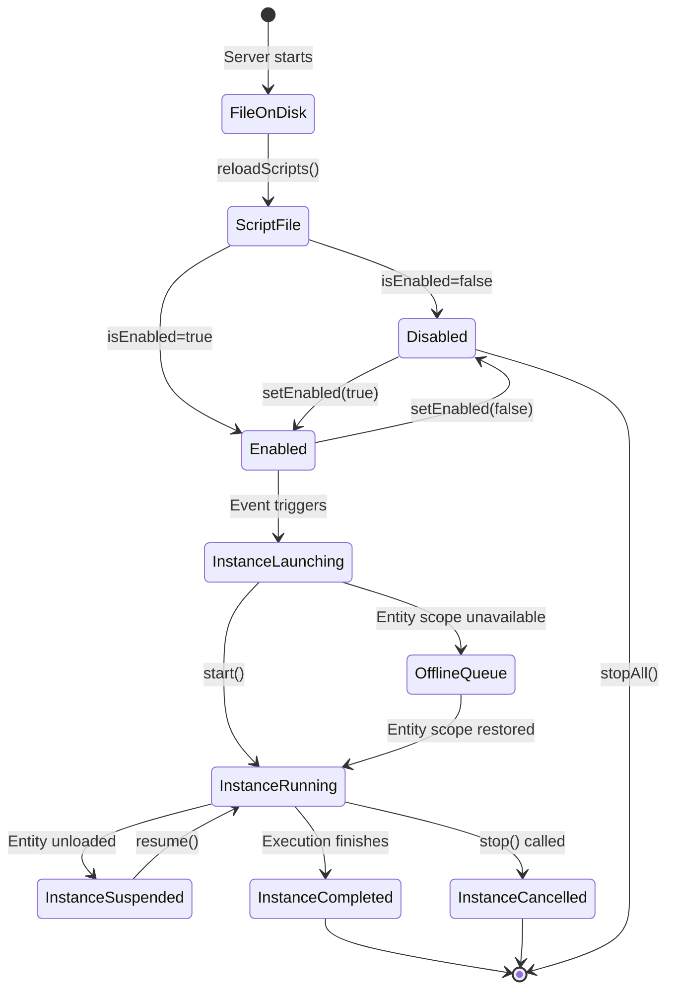
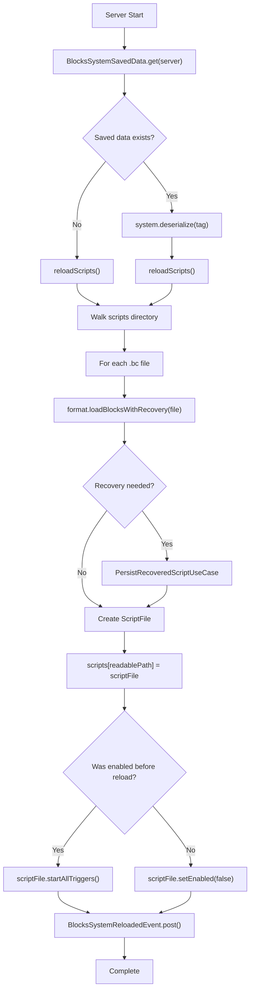
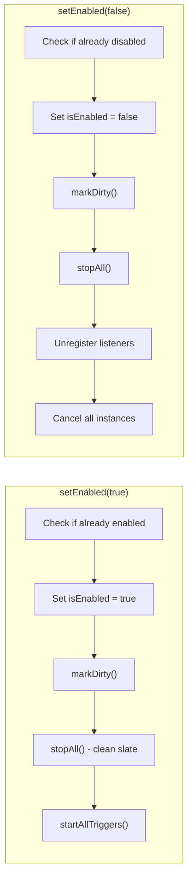
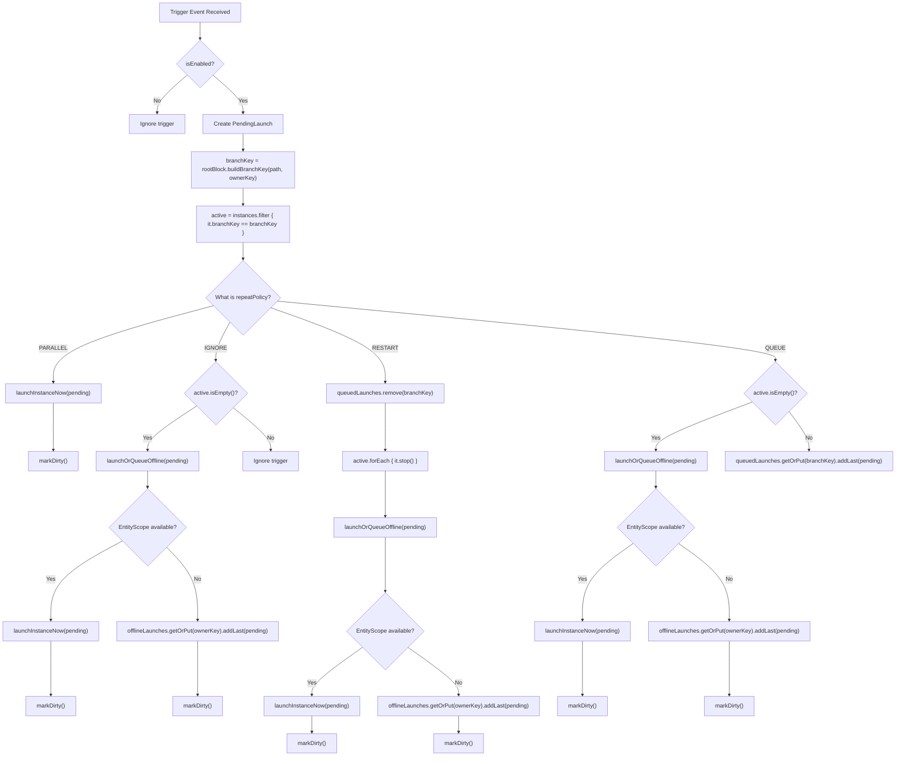
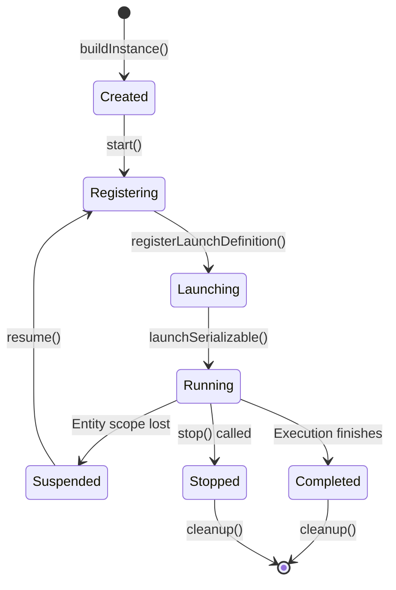
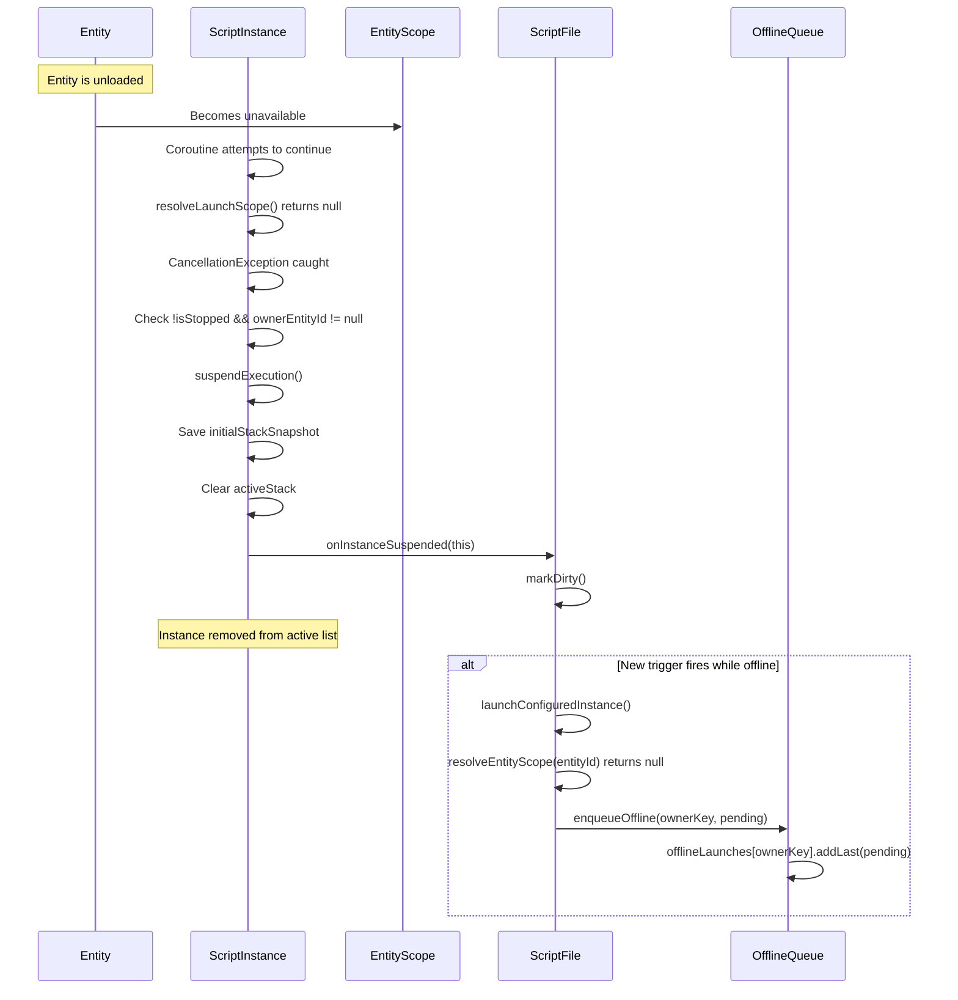
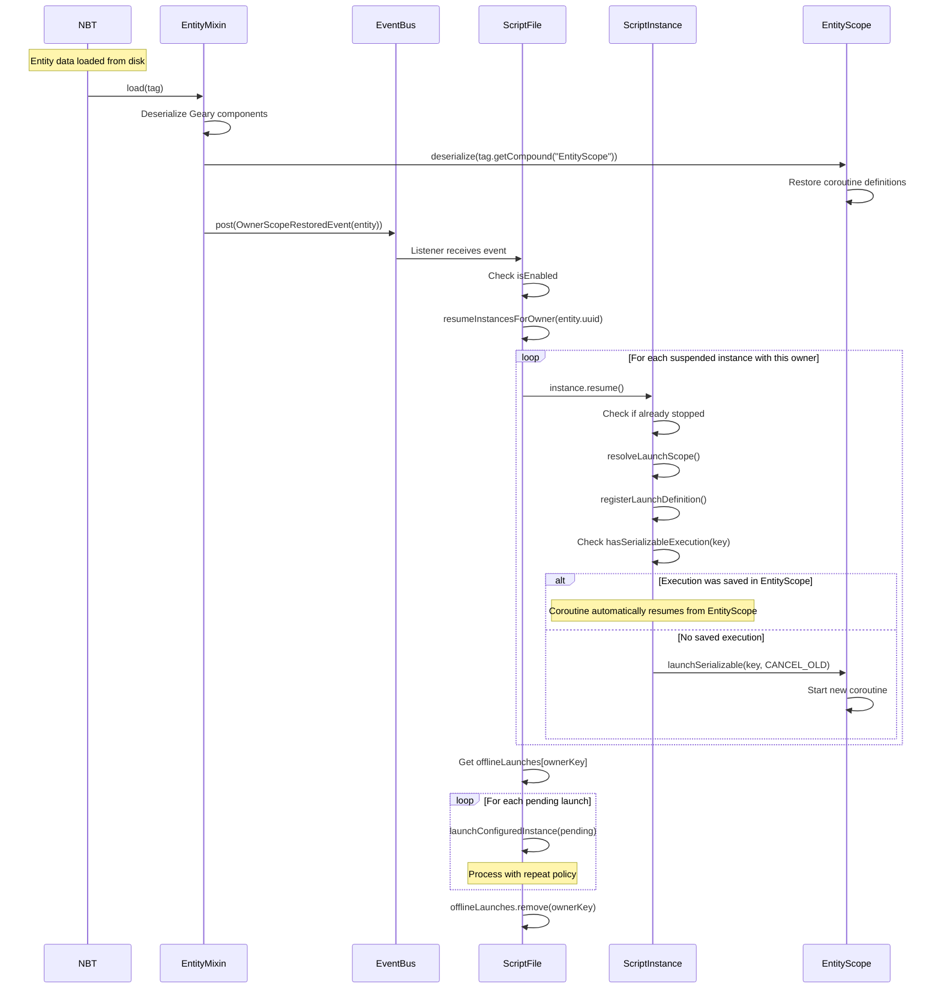
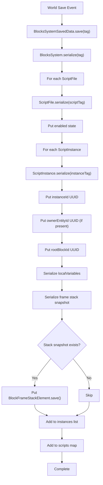
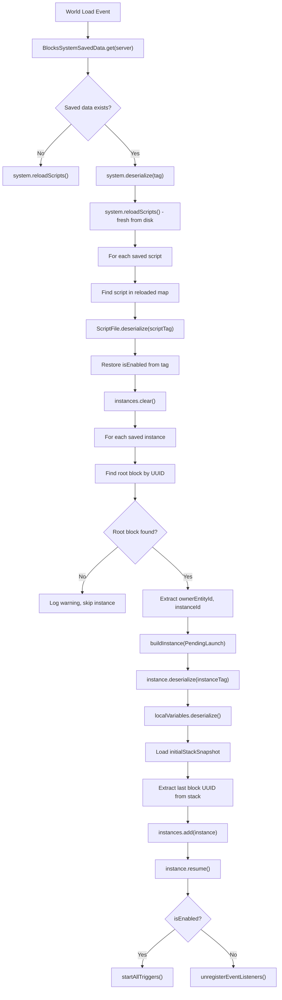
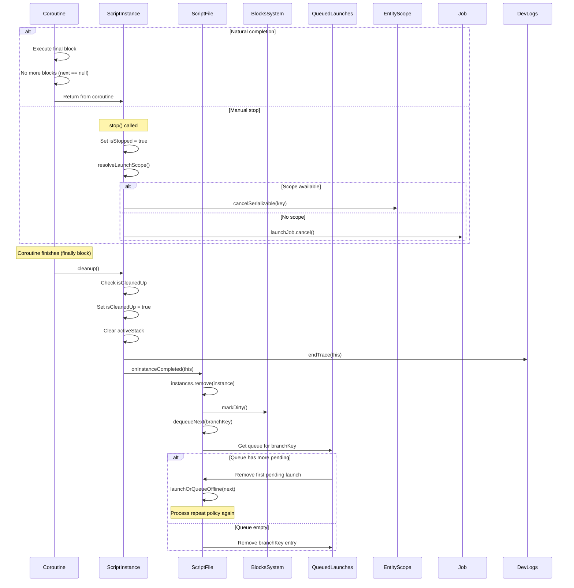

# Script Lifecycle

<details>
<summary>Relevant source files</summary>

The following files were used as context for generating this wiki page:

- [src/main/java/ru/hollowhorizon/hollowengine/common/codeblocks/blocks/players/OnPlayerChatBlock.kt](src/main/java/ru/hollowhorizon/hollowengine/common/codeblocks/blocks/players/OnPlayerChatBlock.kt)
- [src/main/java/ru/hollowhorizon/hollowengine/common/codeblocks/execution/BlockFrameStackElement.kt](src/main/java/ru/hollowhorizon/hollowengine/common/codeblocks/execution/BlockFrameStackElement.kt)
- [src/main/java/ru/hollowhorizon/hollowengine/common/codeblocks/execution/CodeBlockInterpreter.kt](src/main/java/ru/hollowhorizon/hollowengine/common/codeblocks/execution/CodeBlockInterpreter.kt)
- [src/main/java/ru/hollowhorizon/hollowengine/common/codeblocks/runtime/BlocksSystem.kt](src/main/java/ru/hollowhorizon/hollowengine/common/codeblocks/runtime/BlocksSystem.kt)
- [src/main/java/ru/hollowhorizon/hollowengine/common/codeblocks/runtime/BlocksSystemSavedData.kt](src/main/java/ru/hollowhorizon/hollowengine/common/codeblocks/runtime/BlocksSystemSavedData.kt)
- [src/main/java/ru/hollowhorizon/hollowengine/common/codeblocks/runtime/OwnerScopeRestoredEvent.kt](src/main/java/ru/hollowhorizon/hollowengine/common/codeblocks/runtime/OwnerScopeRestoredEvent.kt)
- [src/main/java/ru/hollowhorizon/hollowengine/common/codeblocks/runtime/ScriptFile.kt](src/main/java/ru/hollowhorizon/hollowengine/common/codeblocks/runtime/ScriptFile.kt)
- [src/main/java/ru/hollowhorizon/hollowengine/common/codeblocks/runtime/ScriptInstance.kt](src/main/java/ru/hollowhorizon/hollowengine/common/codeblocks/runtime/ScriptInstance.kt)
- [src/main/java/ru/hollowhorizon/hollowengine/common/commands/HollowEngineCommands.kt](src/main/java/ru/hollowhorizon/hollowengine/common/commands/HollowEngineCommands.kt)
- [src/main/java/ru/hollowhorizon/hollowengine/common/coroutines/EntityScope.kt](src/main/java/ru/hollowhorizon/hollowengine/common/coroutines/EntityScope.kt)
- [src/main/java/ru/hollowhorizon/hollowengine/common/coroutines/SingleThreadDispatcher.kt](src/main/java/ru/hollowhorizon/hollowengine/common/coroutines/SingleThreadDispatcher.kt)
- [src/main/java/ru/hollowhorizon/hollowengine/common/dev/DevLogger.kt](src/main/java/ru/hollowhorizon/hollowengine/common/dev/DevLogger.kt)
- [src/main/java/ru/hollowhorizon/hollowengine/mixins/components/EntityMixin.java](src/main/java/ru/hollowhorizon/hollowengine/mixins/components/EntityMixin.java)
- [src/test/kotlin/CodeBlockExecutionCoreTests.kt](src/test/kotlin/CodeBlockExecutionCoreTests.kt)
- [src/test/kotlin/ScriptExecutionLifecycleTests.kt](src/test/kotlin/ScriptExecutionLifecycleTests.kt)

</details>


This page documents the lifecycle of script execution in HollowEngine, covering how scripts are loaded, enabled, instantiated, persisted, and restored. This includes the handling of repeat policies, offline entity queuing, and the restoration mechanism when entity scopes become available again.

For information about the underlying coroutine execution and serialization mechanisms, see [Entity Scope and Coroutines](#7.2). For details on event-driven triggers, see [Event-Driven Execution](#7.4).

---

## Overview

A script's lifecycle progresses through several distinct phases, from initial file loading through execution and eventual cleanup. The system supports full persistence, allowing scripts to survive server restarts, chunk unloads, and entity dimension changes without losing execution state.

**Lifecycle State Machine**



Sources: [src/main/java/ru/hollowhorizon/hollowengine/common/codeblocks/runtime/ScriptFile.kt:29-364](), [src/main/java/ru/hollowhorizon/hollowengine/common/codeblocks/runtime/ScriptInstance.kt:18-221]()

---

## Loading Phase

Scripts are loaded from the filesystem during server startup or when explicitly reloaded. The `BlocksSystem` scans the `hollowengine/scripts/` directory for `.bc` files and creates a `ScriptFile` instance for each.

**Script Loading Flow**



The loading process preserves enabled/disabled state across reloads. If a script was previously enabled, it automatically starts all triggers after loading.

**Key Classes:**

| Class | File | Purpose |
|-------|------|---------|
| `BlocksSystem` | [ScriptFile.kt:16-119]() | Manages all scripts in the system |
| `ScriptFile` | [ScriptFile.kt:29-364]() | Represents a single loaded script |
| `CodeBlockFormat` | [ScriptFile.kt:21-27]() | Handles serialization/deserialization of block graphs |
| `PersistRecoveredScriptUseCase` | [ScriptFile.kt:18]() | Creates backups of recovered scripts |

Sources: [src/main/java/ru/hollowhorizon/hollowengine/common/codeblocks/runtime/BlocksSystem.kt:54-87](), [src/main/java/ru/hollowhorizon/hollowengine/common/codeblocks/runtime/BlocksSystemSavedData.kt:1-54]()

---

## Enabling and Disabling

Scripts can be enabled or disabled dynamically. The enabled state determines whether event listeners are active and whether new instances can be launched.

**Enable/Disable Operations:**



When enabled, `startAllTriggers()` performs the following actions:

1. **Unregister existing listeners** to prevent duplicates
2. **Register `OwnerScopeRestoredEvent` listener** to handle entity restoration
3. **For each `StartBlock`**:
   - If it implements `EventDrivenStartBlock<*>`, register an event listener
   - Otherwise, if no global instance exists, launch a legacy instance

Sources: [src/main/java/ru/hollowhorizon/hollowengine/common/codeblocks/runtime/ScriptFile.kt:49-81]()

---

## Instance Launch and Repeat Policies

When a trigger fires (from an event or manual invocation), the system determines how to handle the launch based on the root block's `RepeatPolicy`.

**Repeat Policy Enum:**

| Policy | Behavior |
|--------|----------|
| `PARALLEL` | Always launch a new instance, allowing unlimited concurrent executions |
| `IGNORE` | Launch only if no active instances exist for this branch; ignore subsequent triggers |
| `RESTART` | Cancel all existing instances and start fresh with the new trigger |
| `QUEUE` | Launch if no active instance; otherwise queue the trigger for later |

**Launch Decision Tree:**



The `branchKey` uniquely identifies a combination of script path, root block, and owner entity. This allows the system to track which instances belong to the same "branch" of execution and apply repeat policies accordingly.

Sources: [src/main/java/ru/hollowhorizon/hollowengine/common/codeblocks/runtime/ScriptFile.kt:229-265]()

---

## Instance Lifecycle

Each `ScriptInstance` has its own lifecycle, managing coroutine registration, execution, suspension, and cleanup.

**Instance State Transitions:**



**Key Methods:**

| Method | Purpose |
|--------|---------|
| `start()` | Initial launch; resolves scope, registers coroutine definition, begins execution |
| `resume()` | Attempts to restore execution after suspension; re-registers definition if needed |
| `stop()` | Cancels the coroutine and triggers cleanup |
| `suspendExecution()` | Called when entity scope is lost; saves stack snapshot |
| `cleanup()` | Final teardown; removes from active instances, ends dev trace |

**Instance Creation and Launch:**

When `launchInstanceNow()` is called:

1. `buildInstance()` creates a new `ScriptInstance`
2. Declared local variables are initialized from the script's variable declarations
3. The instance is added to `ScriptFile.instances`
4. `instance.start()` is called:
   - `resolveLaunchScope()` finds the `EntityScope` (or uses fallback)
   - If no scope is available, `onInstanceUnavailable()` moves it to offline queue
   - `registerLaunchDefinition()` registers the `SerializableCoroutineDefinition`
   - `launchSerializable()` starts the coroutine with `CANCEL_OLD` policy
   - Dev trace is started via `DevLogs.startTrace()`

Sources: [src/main/java/ru/hollowhorizon/hollowengine/common/codeblocks/runtime/ScriptInstance.kt:55-84](), [src/main/java/ru/hollowhorizon/hollowengine/common/codeblocks/runtime/ScriptFile.kt:267-295]()

---

## Suspension and Offline Queuing

When an entity is unloaded (chunk unload, dimension change, server restart), its `EntityScope` becomes unavailable. Scripts bound to that entity must handle this gracefully.

**Offline Handling Mechanism:**



The `offlineLaunches` map stores pending launches keyed by `OwnerKey`. When the entity comes back online, all pending launches are processed in order.

Sources: [src/main/java/ru/hollowhorizon/hollowengine/common/codeblocks/runtime/ScriptInstance.kt:169-177](), [src/main/java/ru/hollowhorizon/hollowengine/common/codeblocks/runtime/ScriptFile.kt:257-265](), [src/main/java/ru/hollowhorizon/hollowengine/common/codeblocks/runtime/ScriptFile.kt:334-345]()

---

## Entity Scope Restoration

When an entity is loaded (from NBT during chunk load, dimension change, or server restart), the `EntityScope` is restored and the `OwnerScopeRestoredEvent` is fired.

**Restoration Flow:**



The restoration process:

1. `EntityMixin.load()` deserializes entity data [src/main/java/ru/hollowhorizon/hollowengine/mixins/components/EntityMixin.java:64-69]()
2. `EntityScope.deserialize()` restores all serialized coroutine executions [src/main/java/ru/hollowhorizon/hollowengine/common/coroutines/EntityScope.kt:57-77]()
3. `OwnerScopeRestoredEvent` is posted [src/main/java/ru/hollowhorizon/hollowengine/mixins/components/EntityMixin.java:68]()
4. `ScriptFile` listener calls `resumeInstancesForOwner()` [src/main/java/ru/hollowhorizon/hollowengine/common/codeblocks/runtime/ScriptFile.kt:172-181]()
5. Suspended instances are resumed via `instance.resume()` [src/main/java/ru/hollowhorizon/hollowengine/common/codeblocks/runtime/ScriptFile.kt:338-340]()
6. Offline queue is drained and processed [src/main/java/ru/hollowhorizon/hollowengine/common/codeblocks/runtime/ScriptFile.kt:341-344]()

**OwnerScopeRestoredEvent:**

This event is the coordination point for script restoration. It carries a reference to the restored entity, allowing scripts to identify which owner is now available.

```kotlin
class OwnerScopeRestoredEvent(
    val entity: Entity,
) : Event
```

Sources: [src/main/java/ru/hollowhorizon/hollowengine/common/codeblocks/runtime/OwnerScopeRestoredEvent.kt:1-9](), [src/main/java/ru/hollowhorizon/hollowengine/common/codeblocks/runtime/ScriptFile.kt:338-345]()

---

## Persistence and Serialization

The script system persists across server restarts by serializing both the script registry and individual instance execution state.

**Serialization Hierarchy:**



**What Gets Serialized:**

| Level | Data | Purpose |
|-------|------|---------|
| System | `scripts` map keys | Tracks which scripts exist |
| Script | `isEnabled` | Remembers enable/disable state |
| Script | `instances` list | All active/suspended instances |
| Instance | `instanceId` | Unique instance identifier |
| Instance | `ownerEntityId` | Entity this instance is bound to |
| Instance | `rootBlockId` | Which start block spawned this |
| Instance | `localVariables` | Script local variable values |
| Instance | `initialStackSnapshot` | Execution position (suspended) |
| Instance | `activeStack` | Execution position (running) |

**Deserialization Process:**



The deserialization process has a critical guarantee: **scripts are always reloaded fresh from disk first**, then saved state is applied. This ensures that if the script code has changed (e.g., blocks added/removed), the new version is used, with best-effort restoration of instance state.

If a root block no longer exists (UUID not found), that instance is skipped with a warning [src/main/java/ru/hollowhorizon/hollowengine/common/codeblocks/runtime/ScriptFile.kt:100-105]().

Sources: [src/main/java/ru/hollowhorizon/hollowengine/common/codeblocks/runtime/BlocksSystem.kt:29-44](), [src/main/java/ru/hollowhorizon/hollowengine/common/codeblocks/runtime/ScriptFile.kt:83-127](), [src/main/java/ru/hollowhorizon/hollowengine/common/codeblocks/runtime/ScriptInstance.kt:188-215]()

---

## Instance Completion and Cleanup

When an instance finishes execution naturally or is stopped, it goes through a cleanup process.

**Completion Flow:**



The `dequeueNext()` method ensures that if a script uses `QUEUE` repeat policy, the next queued launch is automatically started when the current instance completes.

**Cleanup Guarantees:**

- `cleanup()` is idempotent (checks `isCleanedUp` flag)
- Always called in the coroutine's `finally` block
- Removes instance from active tracking
- Ends dev trace logging
- Marks system dirty for persistence
- Automatically processes queue for this branch

Sources: [src/main/java/ru/hollowhorizon/hollowengine/common/codeblocks/runtime/ScriptInstance.kt:179-186](), [src/main/java/ru/hollowhorizon/hollowengine/common/codeblocks/runtime/ScriptFile.kt:134-138](), [src/main/java/ru/hollowhorizon/hollowengine/common/codeblocks/runtime/ScriptFile.kt:325-332]()

---

## Commands and Manual Control

The `/hollowengine codeblocks` commands provide manual control over script lifecycle:

**Command Reference:**

| Command | Permission | Effect |
|---------|------------|--------|
| `/hollowengine codeblocks reload` | Level 2 | Calls `reloadScripts()` on the system |
| `/hollowengine codeblocks list` | Level 2 | Lists all loaded scripts and their paths |
| `/hollowengine codeblocks start <path>` | Level 2 | Reloads, then calls `setEnabled(true)` on the script |
| `/hollowengine codeblocks stop <path>` | Level 2 | Calls `setEnabled(false)` on the script |
| `/hollowengine codeblocks dev clear` | Level 2 | Clears dev execution history |

The `start` command always reloads scripts before enabling, ensuring the latest version is used [src/main/java/ru/hollowhorizon/hollowengine/common/commands/HollowEngineCommands.kt:186-198]().

Sources: [src/main/java/ru/hollowhorizon/hollowengine/common/commands/HollowEngineCommands.kt:159-224]()

---

## Best Practices

**For Script Authors:**

1. **Use appropriate repeat policies**: Choose `IGNORE` for one-shot effects, `QUEUE` for sequential processing, `PARALLEL` for independent effects
2. **Declare local variables at script top level**: This ensures they're initialized on instance creation
3. **Avoid long-running synchronous operations**: Use delays and yielding to allow proper serialization
4. **Test entity offline/online cycles**: Ensure scripts handle suspension gracefully

**For System Integrators:**

1. **Always call `markDirty()`** after modifying script state
2. **Fire `OwnerScopeRestoredEvent`** when entity scopes become available
3. **Use `BlocksSystemSavedData.get()`** to access the system (don't instantiate directly)
4. **Handle script recovery gracefully**: The recovery system creates backups automatically

Sources: Multiple files as listed in previous sections