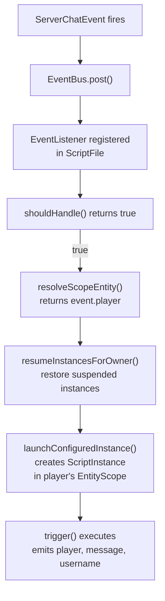
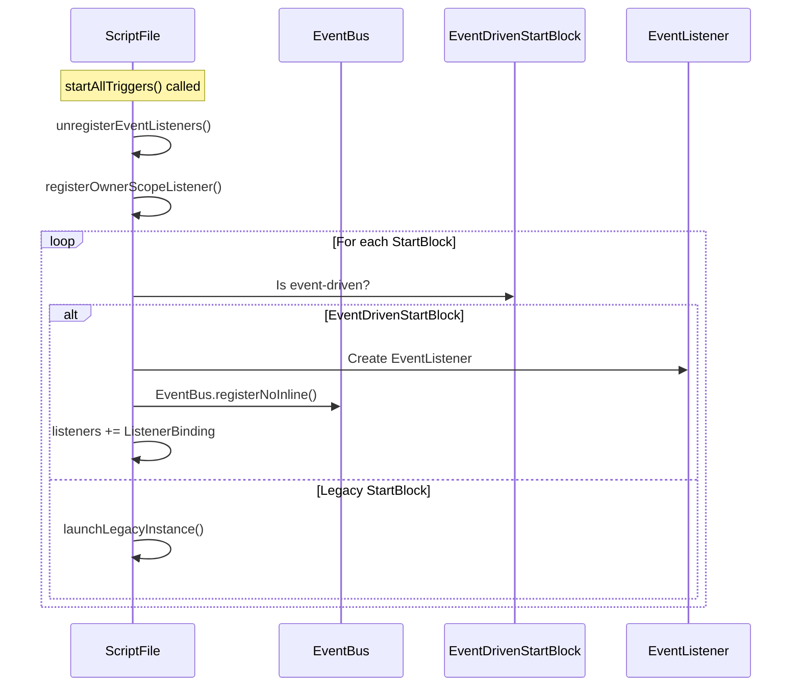
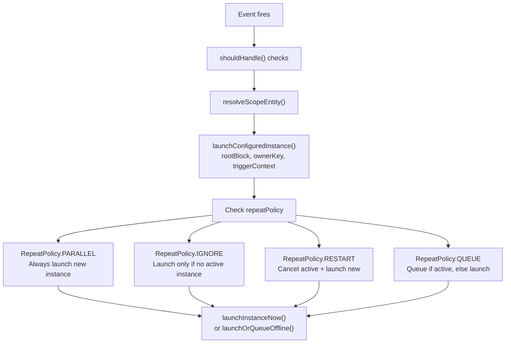
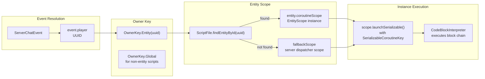
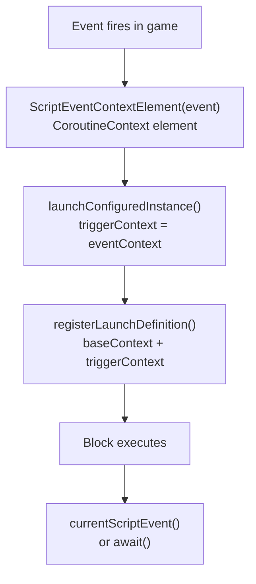
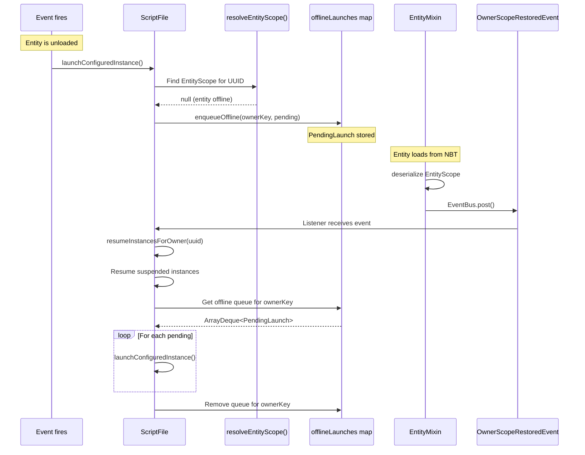
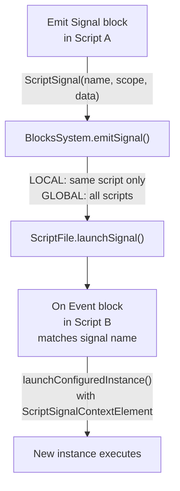
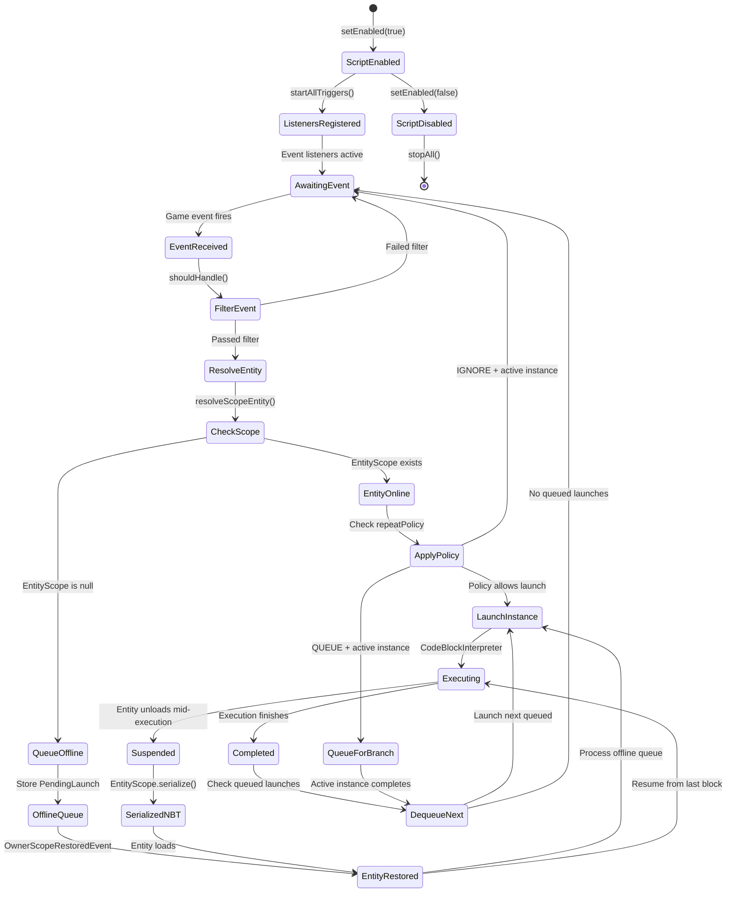

# Event-Driven Execution

<details>
<summary>Relevant source files</summary>

The following files were used as context for generating this wiki page:

- [src/main/java/ru/hollowhorizon/hollowengine/common/codeblocks/blocks/players/OnPlayerChatBlock.kt](src/main/java/ru/hollowhorizon/hollowengine/common/codeblocks/blocks/players/OnPlayerChatBlock.kt)
- [src/main/java/ru/hollowhorizon/hollowengine/common/codeblocks/execution/BlockFrameStackElement.kt](src/main/java/ru/hollowhorizon/hollowengine/common/codeblocks/execution/BlockFrameStackElement.kt)
- [src/main/java/ru/hollowhorizon/hollowengine/common/codeblocks/execution/CodeBlockInterpreter.kt](src/main/java/ru/hollowhorizon/hollowengine/common/codeblocks/execution/CodeBlockInterpreter.kt)
- [src/main/java/ru/hollowhorizon/hollowengine/common/codeblocks/runtime/BlocksSystem.kt](src/main/java/ru/hollowhorizon/hollowengine/common/codeblocks/runtime/BlocksSystem.kt)
- [src/main/java/ru/hollowhorizon/hollowengine/common/codeblocks/runtime/BlocksSystemSavedData.kt](src/main/java/ru/hollowhorizon/hollowengine/common/codeblocks/runtime/BlocksSystemSavedData.kt)
- [src/main/java/ru/hollowhorizon/hollowengine/common/codeblocks/runtime/OwnerScopeRestoredEvent.kt](src/main/java/ru/hollowhorizon/hollowengine/common/codeblocks/runtime/OwnerScopeRestoredEvent.kt)
- [src/main/java/ru/hollowhorizon/hollowengine/common/codeblocks/runtime/ScriptFile.kt](src/main/java/ru/hollowhorizon/hollowengine/common/codeblocks/runtime/ScriptFile.kt)
- [src/main/java/ru/hollowhorizon/hollowengine/common/codeblocks/runtime/ScriptInstance.kt](src/main/java/ru/hollowhorizon/hollowengine/common/codeblocks/runtime/ScriptInstance.kt)
- [src/main/java/ru/hollowhorizon/hollowengine/common/commands/HollowEngineCommands.kt](src/main/java/ru/hollowhorizon/hollowengine/common/commands/HollowEngineCommands.kt)
- [src/main/java/ru/hollowhorizon/hollowengine/common/coroutines/EntityScope.kt](src/main/java/ru/hollowhorizon/hollowengine/common/coroutines/EntityScope.kt)
- [src/main/java/ru/hollowhorizon/hollowengine/common/coroutines/SingleThreadDispatcher.kt](src/main/java/ru/hollowhorizon/hollowengine/common/coroutines/SingleThreadDispatcher.kt)
- [src/main/java/ru/hollowhorizon/hollowengine/common/dev/DevLogger.kt](src/main/java/ru/hollowhorizon/hollowengine/common/dev/DevLogger.kt)
- [src/main/java/ru/hollowhorizon/hollowengine/mixins/components/EntityMixin.java](src/main/java/ru/hollowhorizon/hollowengine/mixins/components/EntityMixin.java)
- [src/test/kotlin/CodeBlockExecutionCoreTests.kt](src/test/kotlin/CodeBlockExecutionCoreTests.kt)
- [src/test/kotlin/ScriptExecutionLifecycleTests.kt](src/test/kotlin/ScriptExecutionLifecycleTests.kt)

</details>


**Purpose**: This document explains how scripts execute in response to game events rather than continuous polling. Event-driven execution enables scripts to trigger automatically when specific game events occur (e.g., player chat, entity damage) and bind execution to specific entities with proper lifecycle management.

**Scope**: This page covers the event-driven start block system, event listener registration, entity scoping, and the offline queue mechanism. For the broader script execution architecture, see [Execution Architecture](#7.1). For entity scope and coroutine management, see [Entity Scope and Coroutines](#7.2).

---

## Overview

HollowEngine supports two execution models for scripts:

1. **Legacy trigger-based**: Scripts start immediately when enabled (deprecated)
2. **Event-driven**: Scripts trigger in response to game events (recommended)

Event-driven execution provides:
- Automatic triggering on game events (chat, damage, etc.)
- Entity-scoped execution (scripts run in context of specific entities)
- Offline queueing (events queue when target entity is unloaded)
- Serializable execution state (scripts survive server restarts)

**Sources**: [src/main/java/ru/hollowhorizon/hollowengine/common/codeblocks/runtime/ScriptFile.kt:29-364]()

---

## Event-Driven Start Block Interface

The `EventDrivenStartBlock<E>` interface marks a start block as event-driven:

```kotlin
interface EventDrivenStartBlock<E : Event> {
    val eventType: Class<E>
    fun shouldHandle(event: E): Boolean = true
    fun resolveScopeEntity(event: E): Entity?
}
```

### Core Components

| Method | Purpose |
|--------|---------|
| `eventType` | Declares which Minecraft/HollowEngine event this block listens for |
| `shouldHandle` | Filters whether this specific event instance should trigger execution |
| `resolveScopeEntity` | Determines which entity's `EntityScope` will execute the script |

When an event fires, the system:
1. Checks `shouldHandle()` to filter irrelevant events
2. Calls `resolveScopeEntity()` to determine the owner entity
3. Launches a new `ScriptInstance` in that entity's coroutine scope

**Sources**: [src/main/java/ru/hollowhorizon/hollowengine/common/codeblocks/runtime/ScriptFile.kt:150-169]()

---

## Example: OnPlayerChatBlock



The `OnPlayerChatBlock` implementation demonstrates the pattern:

- **Event Type**: `ServerChatEvent::class.java`
- **Scope Entity**: `event.player` - script runs in the player's entity scope
- **Trigger Logic**: Emits player, message, and username as output variables

**Key Detail**: The block provides three output slots (`playerOutput`, `messageOutput`, `usernameOutput`) that downstream blocks can read. The event data is accessed via `currentScriptEvent<ServerChatEvent>()` or by awaiting the event.

**Sources**: 
- [src/main/java/ru/hollowhorizon/hollowengine/common/codeblocks/blocks/players/OnPlayerChatBlock.kt:1-86]()
- [src/main/java/ru/hollowhorizon/hollowengine/common/codeblocks/runtime/ScriptFile.kt:150-169]()

---

## Event Listener Registration



### Registration Process

When `ScriptFile.startAllTriggers()` executes:

1. **Clear Old Listeners**: `unregisterEventListeners()` removes any previously registered listeners [ScriptFile.kt:297-302]()
2. **Register Scope Restoration**: A special listener for `OwnerScopeRestoredEvent` is registered [ScriptFile.kt:172-181]()
3. **Register Event Blocks**: For each `EventDrivenStartBlock` in the script:
   - Create an `EventListener` that checks `shouldHandle()` and calls `launchConfiguredInstance()` [ScriptFile.kt:151-165]()
   - Register with `EventBus.registerNoInline()` [ScriptFile.kt:167]()
   - Store `ListenerBinding` for cleanup [ScriptFile.kt:168]()

### Listener Lifecycle

Listeners are re-registered when:
- Script is enabled: `setEnabled(true)` → `startAllTriggers()` [ScriptFile.kt:56-57]()
- Script is reloaded: `BlocksSystem.reloadScripts()` [BlocksSystem.kt:54-87]()

Listeners are unregistered when:
- Script is disabled: `setEnabled(false)` → `stopAll()` [ScriptFile.kt:74-81]()
- Script is being reloaded [ScriptFile.kt:62]()

**Sources**: [src/main/java/ru/hollowhorizon/hollowengine/common/codeblocks/runtime/ScriptFile.kt:61-81,150-181,297-302]()

---

## Instance Launching with Repeat Policies



### Repeat Policies

When an event triggers, the system uses the start block's `repeatPolicy` to determine behavior:

| Policy | Behavior |
|--------|----------|
| `PARALLEL` | Always launch a new instance, regardless of existing instances |
| `IGNORE` | Launch only if no active instance exists for this branch |
| `RESTART` | Cancel all active instances for this branch, then launch new |
| `QUEUE` | If an instance is active, queue the launch; otherwise, launch immediately |

**Branch Key**: Instances are grouped by `BranchKey = (scriptPath, rootBlockId, ownerKey)`. This ensures that repeat policies apply correctly per entity and per start block.

### Launch Flow

1. **Build Pending Launch**: Create `PendingLaunch(rootBlock, ownerKey, triggerContext)` [ScriptFile.kt:236]()
2. **Determine Branch Key**: `rootBlock.buildBranchKey(path, ownerKey)` [ScriptFile.kt:234]()
3. **Check Active Instances**: `instances.filter { it.branchKey == branchKey }` [ScriptFile.kt:235]()
4. **Apply Policy**: Execute policy-specific logic [ScriptFile.kt:238-254]()
5. **Launch or Queue**: 
   - If entity scope exists: `launchInstanceNow()` [ScriptFile.kt:267-273]()
   - If entity offline: `enqueueOffline()` [ScriptFile.kt:257-265]()

**Sources**: [src/main/java/ru/hollowhorizon/hollowengine/common/codeblocks/runtime/ScriptFile.kt:229-273]()

---

## Entity Scoping and Owner Keys



### Owner Keys

Every script instance has an `OwnerKey` that determines its execution scope:

```kotlin
sealed class OwnerKey {
    data class Entity(val entityId: UUID) : OwnerKey()
    object Global : OwnerKey()
}
```

- **Entity Owner**: Script belongs to a specific entity and runs in that entity's `EntityScope`
- **Global Owner**: Script has no entity owner and runs in a fallback server scope

### Entity Scope Resolution

The `ScriptInstance.resolveLaunchScope()` method determines where execution occurs:

1. If `ownerEntityId != null`: Find entity by UUID and return its `entity.coroutineScope` [ScriptFile.kt:129-132]()
2. If entity not found: Return `null` (triggers offline queueing)
3. If `ownerEntityId == null`: Use `fallbackScope` (server dispatcher) [ScriptInstance.kt:27-32]()

### Entity Scope Lifecycle

The `EntityScope` is attached to entities via mixin:
- **Created**: When entity is constructed [EntityMixin.java:48-52]()
- **Serialized**: When entity is saved to NBT [EntityMixin.java:54-62]()
- **Deserialized**: When entity is loaded from NBT [EntityMixin.java:64-69]()
- **Restored Event**: `OwnerScopeRestoredEvent` fires after deserialization [EntityMixin.java:68]()

**Sources**: 
- [src/main/java/ru/hollowhorizon/hollowengine/common/codeblocks/runtime/ScriptFile.kt:129-132,304-311]()
- [src/main/java/ru/hollowhorizon/hollowengine/common/codeblocks/runtime/ScriptInstance.kt:27-32,56-61,101-103]()
- [src/main/java/ru/hollowhorizon/hollowengine/mixins/components/EntityMixin.java:48-69]()

---

## Event Context Propagation



### Context Element Storage

When an event triggers execution, the event is stored in the coroutine context:

```kotlin
ScriptEventContextElement(event)
```

This context element is passed as `triggerContext` during instance launch and becomes part of the coroutine's context chain [ScriptFile.kt:162,192]().

### Accessing Event Data

Event-driven blocks access the triggering event using:

1. **currentScriptEvent<E>()**: Retrieves event from coroutine context
2. **await<E>()**: Suspends until event is posted (alternative pattern)

Example from `OnPlayerChatBlock`:
```kotlin
override suspend fun trigger() {
    val event = currentScriptEvent<ServerChatEvent>() ?: await<ServerChatEvent>()
    playerOutput.emit(event.player)
    messageOutput.emit(event.message.string)
    usernameOutput.emit(event.username)
}
```

The `currentScriptEvent()` function extracts the `ScriptEventContextElement` from the coroutine context and casts it to the expected event type.

**Sources**: 
- [src/main/java/ru/hollowhorizon/hollowengine/common/codeblocks/runtime/ScriptFile.kt:159-163,188-193]()
- [src/main/java/ru/hollowhorizon/hollowengine/common/codeblocks/blocks/players/OnPlayerChatBlock.kt:36-41]()

---

## Offline Queue and Scope Restoration



### Offline Queueing

When an event targets an entity that is currently unloaded (chunk not loaded, player offline):

1. **Check Scope Availability**: `resolveEntityScope(entityId)` returns `null` [ScriptFile.kt:129-132]()
2. **Enqueue Launch**: `enqueueOffline(ownerKey, pending)` stores the `PendingLaunch` [ScriptFile.kt:334-336]()
3. **Wait for Restoration**: Execution is deferred until entity loads

### Scope Restoration Flow

When an entity loads back into the world:

1. **Entity Deserialization**: `EntityMixin.deserializeExtra()` restores `EntityScope` from NBT [EntityMixin.java:64-69]()
2. **Fire Restoration Event**: `EventBus.post(OwnerScopeRestoredEvent(entity))` [EntityMixin.java:68]()
3. **Resume Instances**: Listener calls `resumeInstancesForOwner(entity.uuid)` [ScriptFile.kt:172-181]()
4. **Resume Suspended**: Active instances with this owner call `instance.resume()` [ScriptFile.kt:340]()
5. **Launch Queued**: Offline queue for this owner is drained and launched [ScriptFile.kt:341-344]()

### Instance Suspension vs Offline Queue

| Mechanism | Purpose |
|-----------|---------|
| **Instance Suspension** | Mid-execution script that was running when entity unloaded - resumes from exact block |
| **Offline Queue** | New event triggered while entity was offline - starts from beginning when entity loads |

Suspended instances restore their `BlockFrameStackElement` stack and continue from the last executed block [ScriptInstance.kt:169-177](), while queued instances start fresh execution from the root block.

**Sources**: 
- [src/main/java/ru/hollowhorizon/hollowengine/common/codeblocks/runtime/ScriptFile.kt:129-132,172-181,257-265,334-345]()
- [src/main/java/ru/hollowhorizon/hollowengine/common/codeblocks/runtime/ScriptInstance.kt:169-177]()
- [src/main/java/ru/hollowhorizon/hollowengine/mixins/components/EntityMixin.java:64-69]()
- [src/main/java/ru/hollowhorizon/hollowengine/common/codeblocks/runtime/OwnerScopeRestoredEvent.kt:1-9]()

---

## Signal System

The signal system provides script-to-script communication separate from Minecraft events:



### Signal Structure

```kotlin
data class ScriptSignal(
    val name: String,
    val scope: SignalScope, // LOCAL or GLOBAL
    val owner: OwnerKey,
    val data: Map<String, Any>,
    val sourceScriptPath: String
)
```

### Emit vs Call

| Method | Behavior |
|--------|----------|
| `emitSignal()` | Fire-and-forget: launches handler instances asynchronously [BlocksSystem.kt:89-96]() |
| `callSignal()` | Synchronous call: suspends until all matching handlers complete [BlocksSystem.kt:98-105]() |

### Signal Handlers

Scripts listen for signals using `OnEventBlock` (not to be confused with Minecraft events):
- Matches by `signalName` and `signalScope` [ScriptFile.kt:313-317]()
- Receives signal data via `ScriptSignalContextElement` in coroutine context [ScriptFile.kt:191-193]()
- Can be entity-scoped or global depending on the `owner` field

### Usage Pattern

1. **Emit Signal**: Script A executes "Emit Signal" block with name "door_opened"
2. **Route to System**: `BlocksSystem.emitSignal()` or `callSignal()` [BlocksSystem.kt:89-105]()
3. **Find Handlers**: `ScriptFile.matchingSignalHandlers()` filters blocks [ScriptFile.kt:313-317]()
4. **Launch Instances**: Each matching handler launches a new instance [ScriptFile.kt:185-213]()

**Key Distinction**: Signals are HollowEngine-specific and do not integrate with Minecraft's event bus. They enable cross-script communication within the scripting system.

**Sources**: [src/main/java/ru/hollowhorizon/hollowengine/common/codeblocks/runtime/BlocksSystem.kt:89-105](), [src/main/java/ru/hollowhorizon/hollowengine/common/codeblocks/runtime/ScriptFile.kt:185-213,313-317]()

---

## Command Integration

Commands can manually trigger script execution:

### Starting Kotlin Scripts

```bash
/hollowengine script run <path>
```

This command:
1. Compiles the `.kts` file using `ScriptingEnvironment.compiler.compile()` [HollowEngineCommands.kt:244]()
2. Executes via `script.start()` extension function [HollowEngineCommands.kt:251]()
3. Runs in the global (server) scope, not entity-scoped

### Starting Code Block Scripts

```bash
/hollowengine codeblocks start <path>
```

This command:
1. Looks up the script in `BlocksSystemSavedData.scripts` [HollowEngineCommands.kt:189-191]()
2. Calls `script.setEnabled(true)` [HollowEngineCommands.kt:195]()
3. Triggers `startAllTriggers()` which registers event listeners [ScriptFile.kt:61-71]()

### Stopping Code Block Scripts

```bash
/hollowengine codeblocks stop <path>
```

Disables the script, unregistering all event listeners and stopping active instances [HollowEngineCommands.kt:201-212]().

**Sources**: [src/main/java/ru/hollowhorizon/hollowengine/common/commands/HollowEngineCommands.kt:159-224,227-303]()

---

## Available Event Blocks

The block repository provides several built-in event-driven start blocks:

| Block | Event Type | Scope Entity | Output Variables |
|-------|------------|--------------|------------------|
| `OnPlayerChatBlock` | `ServerChatEvent` | `event.player` | player, message, username |
| (Future blocks) | Various | Entity-dependent | Block-specific |

Custom event blocks can be created by:
1. Extending `StartBlock`
2. Implementing `EventDrivenStartBlock<E>`
3. Defining `eventType`, `shouldHandle()`, `resolveScopeEntity()`
4. Registering in a `BlockModule`

**Sources**: [src/main/java/ru/hollowhorizon/hollowengine/common/codeblocks/blocks/players/OnPlayerChatBlock.kt:1-86]()

---

## Execution Lifecycle Summary



**Key Points**:
1. Scripts start listening when enabled
2. Events filter through `shouldHandle()` before triggering
3. Entity scope determines execution location
4. Offline events queue until entity loads
5. Suspended executions restore from saved block position
6. Queued launches execute after active instance completes

**Sources**: [src/main/java/ru/hollowhorizon/hollowengine/common/codeblocks/runtime/ScriptFile.kt:49-81,129-148,150-181,229-345](), [src/main/java/ru/hollowhorizon/hollowengine/common/codeblocks/runtime/ScriptInstance.kt:55-84,169-177]()