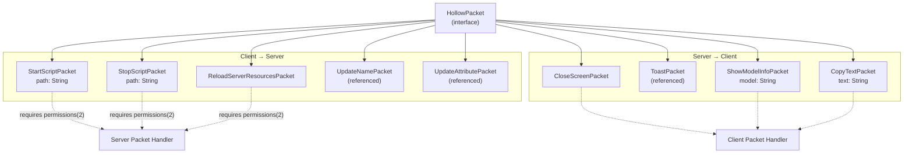
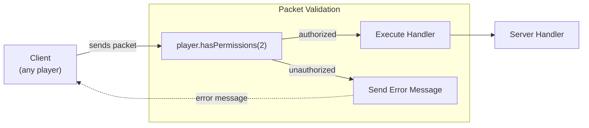
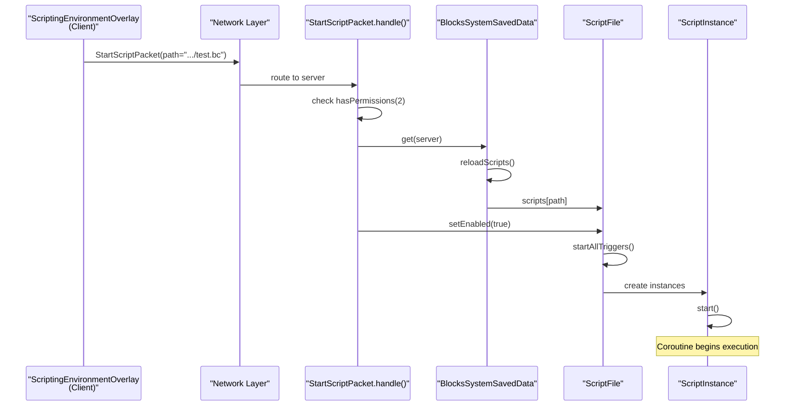

# Network Protocol

<details>
<summary>Relevant source files</summary>

The following files were used as context for generating this wiki page:

- [src/main/java/ru/hollowhorizon/hollowengine/client/gui/kool/UiColors.kt](src/main/java/ru/hollowhorizon/hollowengine/client/gui/kool/UiColors.kt)
- [src/main/java/ru/hollowhorizon/hollowengine/client/gui/scripting/FilePopup.kt](src/main/java/ru/hollowhorizon/hollowengine/client/gui/scripting/FilePopup.kt)
- [src/main/java/ru/hollowhorizon/hollowengine/client/gui/scripting/TreeRenderer.kt](src/main/java/ru/hollowhorizon/hollowengine/client/gui/scripting/TreeRenderer.kt)
- [src/main/java/ru/hollowhorizon/hollowengine/client/gui/scripting/popup/ItemPopupMenu.kt](src/main/java/ru/hollowhorizon/hollowengine/client/gui/scripting/popup/ItemPopupMenu.kt)
- [src/main/java/ru/hollowhorizon/hollowengine/client/gui/scripting/titlebar/BarContents.kt](src/main/java/ru/hollowhorizon/hollowengine/client/gui/scripting/titlebar/BarContents.kt)
- [src/main/java/ru/hollowhorizon/hollowengine/common/codeblocks/blocks/players/OnPlayerChatBlock.kt](src/main/java/ru/hollowhorizon/hollowengine/common/codeblocks/blocks/players/OnPlayerChatBlock.kt)
- [src/main/java/ru/hollowhorizon/hollowengine/common/codeblocks/execution/BlockFrameStackElement.kt](src/main/java/ru/hollowhorizon/hollowengine/common/codeblocks/execution/BlockFrameStackElement.kt)
- [src/main/java/ru/hollowhorizon/hollowengine/common/codeblocks/execution/CodeBlockInterpreter.kt](src/main/java/ru/hollowhorizon/hollowengine/common/codeblocks/execution/CodeBlockInterpreter.kt)
- [src/main/java/ru/hollowhorizon/hollowengine/common/codeblocks/runtime/BlocksSystem.kt](src/main/java/ru/hollowhorizon/hollowengine/common/codeblocks/runtime/BlocksSystem.kt)
- [src/main/java/ru/hollowhorizon/hollowengine/common/codeblocks/runtime/BlocksSystemSavedData.kt](src/main/java/ru/hollowhorizon/hollowengine/common/codeblocks/runtime/BlocksSystemSavedData.kt)
- [src/main/java/ru/hollowhorizon/hollowengine/common/codeblocks/runtime/OwnerScopeRestoredEvent.kt](src/main/java/ru/hollowhorizon/hollowengine/common/codeblocks/runtime/OwnerScopeRestoredEvent.kt)
- [src/main/java/ru/hollowhorizon/hollowengine/common/codeblocks/runtime/ScriptFile.kt](src/main/java/ru/hollowhorizon/hollowengine/common/codeblocks/runtime/ScriptFile.kt)
- [src/main/java/ru/hollowhorizon/hollowengine/common/codeblocks/runtime/ScriptInstance.kt](src/main/java/ru/hollowhorizon/hollowengine/common/codeblocks/runtime/ScriptInstance.kt)
- [src/main/java/ru/hollowhorizon/hollowengine/common/commands/HollowEngineCommands.kt](src/main/java/ru/hollowhorizon/hollowengine/common/commands/HollowEngineCommands.kt)
- [src/main/java/ru/hollowhorizon/hollowengine/common/coroutines/EntityScope.kt](src/main/java/ru/hollowhorizon/hollowengine/common/coroutines/EntityScope.kt)
- [src/main/java/ru/hollowhorizon/hollowengine/common/coroutines/SingleThreadDispatcher.kt](src/main/java/ru/hollowhorizon/hollowengine/common/coroutines/SingleThreadDispatcher.kt)
- [src/main/java/ru/hollowhorizon/hollowengine/common/dev/DevLogger.kt](src/main/java/ru/hollowhorizon/hollowengine/common/dev/DevLogger.kt)
- [src/main/java/ru/hollowhorizon/hollowengine/common/util/DesktopUtil.kt](src/main/java/ru/hollowhorizon/hollowengine/common/util/DesktopUtil.kt)
- [src/main/java/ru/hollowhorizon/hollowengine/mixins/components/EntityMixin.java](src/main/java/ru/hollowhorizon/hollowengine/mixins/components/EntityMixin.java)
- [src/test/kotlin/CodeBlockExecutionCoreTests.kt](src/test/kotlin/CodeBlockExecutionCoreTests.kt)
- [src/test/kotlin/ScriptExecutionLifecycleTests.kt](src/test/kotlin/ScriptExecutionLifecycleTests.kt)

</details>


**Purpose**: This document describes the network communication system used by HollowEngine to synchronize script execution control, IDE operations, and gameplay commands between client and server. This page specifically covers the packet definitions, handlers, and permission system used for remote procedure calls (RPC).

For information about the actual script execution mechanics that these packets control, see [Execution Architecture](#7.1). For entity synchronization and persistence, see [Entity Scope and Coroutines](#7.2).

---

## Overview

HollowEngine implements a bidirectional RPC-style network protocol using the `HollowPacket` system. All packets are serialized using Kotlinx.serialization and routed through Minecraft's network layer. The protocol enforces permission-based security for server-bound operations and supports both fire-and-forget and request-response patterns.

**Key Components**:
- `HollowPacket`: Base interface for all network messages
- `HollowPacketHandler`: Annotation defining packet direction and routing
- `Player.send()`: Extension method for dispatching packets
- Permission checks via `Player.hasPermissions(2)`

Sources: [src/main/java/ru/hollowhorizon/hollowengine/client/gui/scripting/titlebar/BarContents.kt:179-250](), [src/main/java/ru/hollowhorizon/hollowengine/common/commands/HollowEngineCommands.kt:393-442]()

---

## Packet Architecture

The following diagram shows the complete packet type hierarchy and their routing directions:



Sources: [src/main/java/ru/hollowhorizon/hollowengine/client/gui/scripting/titlebar/BarContents.kt:179-250]()

---

## Client-to-Server Packets

### StartScriptPacket

Requests the server to compile and execute a Kotlin script (`.kts`) or enable a CodeBlocks script (`.bc`).

**Implementation**: [src/main/java/ru/hollowhorizon/hollowengine/client/gui/scripting/titlebar/BarContents.kt:179-208]()

| Property | Type | Description |
|----------|------|-------------|
| `path` | `String` | Readable file path (e.g., `"scripts/test.kts"`) |

**Handler Logic**:
1. Validates `player.hasPermissions(2)` - returns error message if unauthorized
2. Resolves file path using `path.fromReadablePath()`
3. If file ends with `.bc`:
   - Retrieves `BlocksSystemSavedData` for the server
   - Calls `reloadScripts()` to refresh script registry
   - Locates script by path and calls `script.setEnabled(true)`
4. If file is `.kts`:
   - Compiles using `ScriptingEnvironment.INSTANCE.compiler.compile(file)`
   - Starts execution via `result.getOrThrow().start()`

**Error Handling**: Compilation failures are logged but not reported back to client.

```kotlin
@Serializable
class StartScriptPacket(val path: String) : HollowPacket {
    override fun handle(player: Player) {
        if (!player.hasPermissions(2)) {
            player.sendSystemMessage("...no_permissions_start".lang.literal)
            return
        }
        // ... handling logic
    }
}
```

Sources: [src/main/java/ru/hollowhorizon/hollowengine/client/gui/scripting/titlebar/BarContents.kt:179-208]()

---

### StopScriptPacket

Disables a running CodeBlocks script. Only works for `.bc` files; `.kts` scripts cannot be stopped remotely.

**Implementation**: [src/main/java/ru/hollowhorizon/hollowengine/client/gui/scripting/titlebar/BarContents.kt:218-237]()

| Property | Type | Description |
|----------|------|-------------|
| `path` | `String` | Readable file path to `.bc` script |

**Handler Logic**:
1. Validates `player.hasPermissions(2)`
2. Resolves file path
3. If file ends with `.bc`:
   - Retrieves `BlocksSystemSavedData`
   - Calls `scripts[path]?.setEnabled(false)`
4. Sends toast notification to client

**Behavior**: Calling `setEnabled(false)` stops all active `ScriptInstance`s for the script and unregisters event listeners.

Sources: [src/main/java/ru/hollowhorizon/hollowengine/client/gui/scripting/titlebar/BarContents.kt:218-237](), [src/main/java/ru/hollowhorizon/hollowengine/common/codeblocks/runtime/ScriptFile.kt:49-81]()

---

### ReloadServerResourcesPacket

Triggers a full server resource reload equivalent to `/reload` command.

**Implementation**: [src/main/java/ru/hollowhorizon/hollowengine/client/gui/scripting/titlebar/BarContents.kt:239-250]()

| Property | Type | Description |
|----------|------|-------------|
| *(none)* | - | Payload-free packet |

**Handler Logic**:
1. Validates `player.hasPermissions(2)`
2. Executes command: `server.commands.performPrefixedCommand(player.createCommandSourceStack(), "reload")`

**Side Effects**: Reloads all datapacks, scripts, and server resources. This triggers `BlocksSystemSavedData` to reload all `.bc` scripts via the `LevelEvent.Load` handler.

Sources: [src/main/java/ru/hollowhorizon/hollowengine/client/gui/scripting/titlebar/BarContents.kt:239-250](), [src/main/java/ru/hollowhorizon/hollowengine/common/codeblocks/runtime/BlocksSystemSavedData.kt:47-54]()

---

## Server-to-Client Packets

### CloseScreenPacket

Forces the client to close their current screen.

**Implementation**: [src/main/java/ru/hollowhorizon/hollowengine/client/gui/scripting/titlebar/BarContents.kt:210-216]()

| Property | Type | Description |
|----------|------|-------------|
| *(none)* | - | Payload-free packet |

**Handler Logic**:
```kotlin
override fun handle(player: Player) {
    Minecraft.getInstance().screen?.onClose()
}
```

**Usage**: Typically sent after server-side operations that invalidate the current IDE state (e.g., after script compilation errors).

Sources: [src/main/java/ru/hollowhorizon/hollowengine/client/gui/scripting/titlebar/BarContents.kt:210-216]()

---

### ShowModelInfoPacket

Sends 3D model metadata (animations, textures) to the client for display in chat.

**Implementation**: [src/main/java/ru/hollowhorizon/hollowengine/common/commands/HollowEngineCommands.kt:407-442]()

| Property | Type | Description |
|----------|------|-------------|
| `model` | `String` | Resource location of model (e.g., `"hollowengine:models/entity/player_model.gltf"`) |

**Handler Logic**:
1. Converts model string to `ResourceLocation`
2. Launches coroutine in `Minecraft.getInstance().coroutineScope`
3. Waits for `HollowModelManager.getOrCreate(location)` to load model
4. Filters for `AnimatedModel.EMPTY` using `StateFlow.filter()`
5. Extracts animation names from `hollowModel.animations.keys`
6. Extracts texture paths from `hollowModel.model.materials`
7. Sends clickable chat messages with animation/texture names

**Asynchronous Behavior**: Uses `StateFlow.first()` to await model loading, preventing blocking the game thread.

Sources: [src/main/java/ru/hollowhorizon/hollowengine/common/commands/HollowEngineCommands.kt:407-442]()

---

### CopyTextPacket

Copies text to client clipboard and displays clickable chat message.

**Implementation**: [src/main/java/ru/hollowhorizon/hollowengine/common/commands/HollowEngineCommands.kt:394-405]()

| Property | Type | Description |
|----------|------|-------------|
| `text` | `String` | Text content to copy |

**Handler Logic**:
1. Sends formatted chat message with hover tooltip
2. Sets clipboard via `mc.keyboardHandler.clipboard = text`

**Usage**: Used by IDE commands like `/hollowengine pos` to copy position coordinates, or `/hollowengine hand` to copy item definitions.

Sources: [src/main/java/ru/hollowhorizon/hollowengine/common/commands/HollowEngineCommands.kt:344-369](), [src/main/java/ru/hollowhorizon/hollowengine/common/commands/HollowEngineCommands.kt:394-405]()

---

## Permission System

The network protocol enforces a **permission level 2** requirement for all script control operations. This corresponds to Minecraft's operator permission level (`/op` command).



**Permission-Gated Packets**:
- `StartScriptPacket` - [BarContents.kt:183-186]()
- `StopScriptPacket` - [BarContents.kt:222-225]()
- `ReloadServerResourcesPacket` - [BarContents.kt:243-246]()

**Error Response Example**:
```kotlin
if (!player.hasPermissions(2)) {
    player.sendSystemMessage("hollowengine.gui.ide.script.no_permissions_start".lang.literal)
    return
}
```

**Rationale**: Script execution can run arbitrary code on the server, so access must be restricted to trusted operators. In multiplayer environments, this prevents non-op players from executing malicious scripts.

Sources: [src/main/java/ru/hollowhorizon/hollowengine/client/gui/scripting/titlebar/BarContents.kt:183-186](), [src/main/java/ru/hollowhorizon/hollowengine/client/gui/scripting/titlebar/BarContents.kt:222-225](), [src/main/java/ru/hollowhorizon/hollowengine/client/gui/scripting/titlebar/BarContents.kt:243-246]()

---

## Packet Handler Annotations

All packets use the `@HollowPacketHandler` annotation to declare their routing direction:

**Annotation Definition**:
```kotlin
@HollowPacketHandler(HollowPacketHandler.Direction.TO_SERVER)
@Serializable
class StartScriptPacket(val path: String) : HollowPacket { ... }

@HollowPacketHandler(HollowPacketHandler.Direction.TO_CLIENT)
@Serializable
class CloseScreenPacket : HollowPacket { ... }
```

| Direction | Description | Security Model |
|-----------|-------------|----------------|
| `TO_SERVER` | Client → Server RPC | Permission-gated via `hasPermissions(2)` |
| `TO_CLIENT` | Server → Client notification | No validation (server is trusted) |

**Registration**: Packet handlers are registered during mod initialization via annotation scanning. The `@Serializable` annotation enables automatic JSON serialization using Kotlinx.serialization.

Sources: [src/main/java/ru/hollowhorizon/hollowengine/client/gui/scripting/titlebar/BarContents.kt:179-180](), [src/main/java/ru/hollowhorizon/hollowengine/common/commands/HollowEngineCommands.kt:394-395]()

---

## Integration with Script Execution

The following diagram shows how network packets integrate with the script execution system:



**Execution Flow**:
1. User clicks "Start" button in IDE → triggers `StartScriptPacket.send()`
2. Packet serialized and sent over network to server
3. Server validates permission level
4. For `.bc` files: `BlocksSystemSavedData` reloads scripts from disk
5. Located script calls `setEnabled(true)` which triggers `startAllTriggers()`
6. Event listeners are registered for event-driven blocks
7. `ScriptInstance`s are created and launched in `EntityScope`
8. Script begins execution with serializable coroutine support

**For `.kts` files**: The flow is similar but uses `ScriptingEnvironment.INSTANCE.compiler.compile()` followed by `script.start()` which directly executes the compiled script.

Sources: [src/main/java/ru/hollowhorizon/hollowengine/client/gui/scripting/titlebar/BarContents.kt:182-207](), [src/main/java/ru/hollowhorizon/hollowengine/common/codeblocks/runtime/ScriptFile.kt:61-71](), [src/main/java/ru/hollowhorizon/hollowengine/common/codeblocks/runtime/ScriptInstance.kt:55-69]()

---

## Usage Examples

### Sending Packets from Client

**From IDE Button Click**:
```kotlin
// File: BarContents.kt
TextButton("Start") {
    StartScriptPacket(scriptPath).send()
}
```

**From Command Execution**:
```kotlin
// File: HollowEngineCommands.kt
"model"(arg("model", StringArgumentType.string()) { getAvailableModels() }) {
    executes {
        val modelName = StringArgumentType.getString(this, "model")
        ShowModelInfoPacket(modelName).send(source.playerOrException)
        SUCCESS
    }
}
```

### Receiving Packets on Server

**Handler Implementation Pattern**:
```kotlin
@HollowPacketHandler(HollowPacketHandler.Direction.TO_SERVER)
@Serializable
class StopScriptPacket(val path: String) : HollowPacket {
    override fun handle(player: Player) {
        // 1. Validate permissions
        if (!player.hasPermissions(2)) {
            player.sendSystemMessage("error message".literal)
            return
        }
        
        // 2. Perform server-side operation
        val blocksSystem = BlocksSystemSavedData.get(server)
        blocksSystem.scripts[path]?.setEnabled(false)
        
        // 3. Send response packet (optional)
        player.sendToast("script stopped".literal)
    }
}
```

### Asynchronous Server Response

**Pattern for Loading Resources**:
```kotlin
@HollowPacketHandler(HollowPacketHandler.Direction.TO_CLIENT)
@Serializable
class ShowModelInfoPacket(val model: String) : HollowPacket {
    override fun handle(player: Player) {
        Minecraft.getInstance().coroutineScope.launch {
            val hollowModel = HollowModelManager.getOrCreate(location)
                .filter { it !== AnimatedModel.EMPTY }
                .first()  // Suspends until model loads
            
            // Process loaded model
            hollowModel.animations.keys.forEach { anim ->
                player.sendSystemMessage(anim.literal)
            }
        }
    }
}
```

**Key Pattern**: Use `coroutineScope.launch` to avoid blocking the network thread during resource loading. The `StateFlow.filter().first()` pattern ensures the model is fully loaded before processing.

Sources: [src/main/java/ru/hollowhorizon/hollowengine/common/commands/HollowEngineCommands.kt:412-427](), [src/main/java/ru/hollowhorizon/hollowengine/client/gui/scripting/titlebar/BarContents.kt:220-237]()

---

## Security Considerations

| Threat | Mitigation | Implementation |
|--------|------------|----------------|
| Arbitrary script execution | Permission level 2 required | `player.hasPermissions(2)` check in all script control handlers |
| Malicious file paths | Path resolution through `DirectoryManager` | `path.fromReadablePath()` prevents directory traversal |
| Resource exhaustion | Server-side script registry | `BlocksSystemSavedData` limits loaded scripts to registered files |
| Unauthorized resource reload | Permission gating | `/reload` command execution requires op status |

**Permission Model Summary**:
- **Client-side IDE**: Available to all players (read-only operations like file browsing)
- **Script execution**: Requires permission level 2 (operator status)
- **Server commands**: All `/hollowengine` subcommands require `hasPermission(2)` via `requires { hasPermission(2) }` in command builder

Sources: [src/main/java/ru/hollowhorizon/hollowengine/common/commands/HollowEngineCommands.kt:161-162](), [src/main/java/ru/hollowhorizon/hollowengine/common/commands/HollowEngineCommands.kt:229](), [src/main/java/ru/hollowhorizon/hollowengine/client/gui/scripting/titlebar/BarContents.kt:183-186]()