# Animation System

<details>
<summary>Relevant source files</summary>

The following files were used as context for generating this wiki page:

- [src/main/java/ru/hollowhorizon/hollowengine/client/gui/animations/Graph.kt](src/main/java/ru/hollowhorizon/hollowengine/client/gui/animations/Graph.kt)
- [src/main/java/ru/hollowhorizon/hollowengine/client/gui/animations/GraphEditor.kt](src/main/java/ru/hollowhorizon/hollowengine/client/gui/animations/GraphEditor.kt)
- [src/main/java/ru/hollowhorizon/hollowengine/client/gui/colors/ColorTheme.kt](src/main/java/ru/hollowhorizon/hollowengine/client/gui/colors/ColorTheme.kt)
- [src/main/java/ru/hollowhorizon/hollowengine/client/gui/scripting/files/animations/AnimationControllerFile.kt](src/main/java/ru/hollowhorizon/hollowengine/client/gui/scripting/files/animations/AnimationControllerFile.kt)
- [src/main/java/ru/hollowhorizon/hollowengine/client/gui/scripting/titlebar/ComboBox.kt](src/main/java/ru/hollowhorizon/hollowengine/client/gui/scripting/titlebar/ComboBox.kt)
- [src/main/java/ru/hollowhorizon/hollowengine/client/models/internal/controller/AnimControllerDSL.kt](src/main/java/ru/hollowhorizon/hollowengine/client/models/internal/controller/AnimControllerDSL.kt)
- [src/main/java/ru/hollowhorizon/hollowengine/client/models/internal/controller/AnimationController.kt](src/main/java/ru/hollowhorizon/hollowengine/client/models/internal/controller/AnimationController.kt)
- [src/main/java/ru/hollowhorizon/hollowengine/client/models/internal/controller/AnimationDispatcher.kt](src/main/java/ru/hollowhorizon/hollowengine/client/models/internal/controller/AnimationDispatcher.kt)
- [src/main/java/ru/hollowhorizon/hollowengine/client/models/internal/controller/EntityUtils.kt](src/main/java/ru/hollowhorizon/hollowengine/client/models/internal/controller/EntityUtils.kt)
- [src/main/java/ru/hollowhorizon/hollowengine/common/scripting/CompilerLoader.kt](src/main/java/ru/hollowhorizon/hollowengine/common/scripting/CompilerLoader.kt)

</details>


The Animation System provides state machine-based animation control for 3D models in HollowEngine. This system consists of a visual graph editor for authoring animation state machines, a code generator that produces executable Kotlin scripts, and a runtime execution engine that manages state transitions, animation blending, and coroutine-based timing.

**Scope**: This page covers the animation state machine system specifically. For 3D model loading and rendering, see [3D Model System](#9). For script compilation, see [Kotlin Script Compilation](#7.2). For entity-model attachment, see [ECS Architecture](#8.1).

---

## Architecture Overview

The animation system follows a compile-time authoring to runtime execution model:

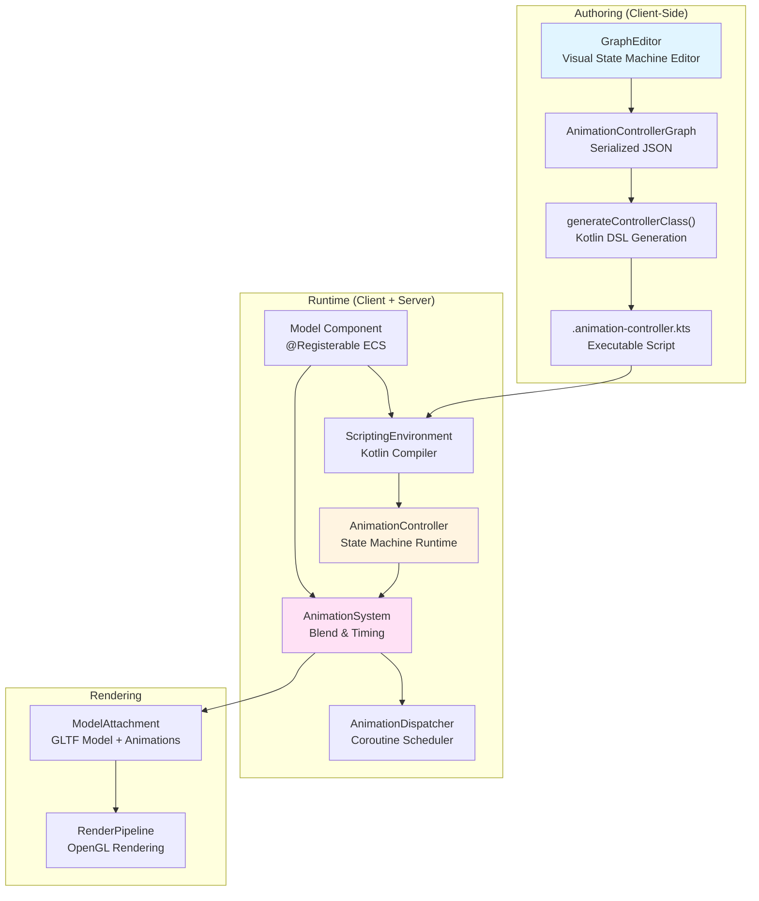

**Sources**: 
- [src/main/java/ru/hollowhorizon/hollowengine/client/gui/animations/GraphEditor.kt:1-1336]()
- [src/main/java/ru/hollowhorizon/hollowengine/client/gui/scripting/files/animations/AnimationControllerFile.kt:1-250]()
- [src/main/java/ru/hollowhorizon/hollowengine/client/models/internal/controller/AnimationController.kt:1-196]()
- [src/main/java/ru/hollowhorizon/hollowengine/client/models/internal/controller/AnimationSystem.kt:1-56]()

---

## Graph Editor

The `GraphEditor` class provides the visual authoring interface for creating animation state machines. It is implemented as a Kool UI component with pan/zoom controls and node manipulation.

### Core Components

| Component | Type | Purpose |
|-----------|------|---------|
| `GraphEditor` | UI Controller | Main editor state and rendering |
| `GraphNode` | Data Model | Individual state nodes |
| `GraphConnection` | Data Model | Transitions between states |
| `PropertyPanel` | UI Component | Node/connection property inspector |

### Node Types

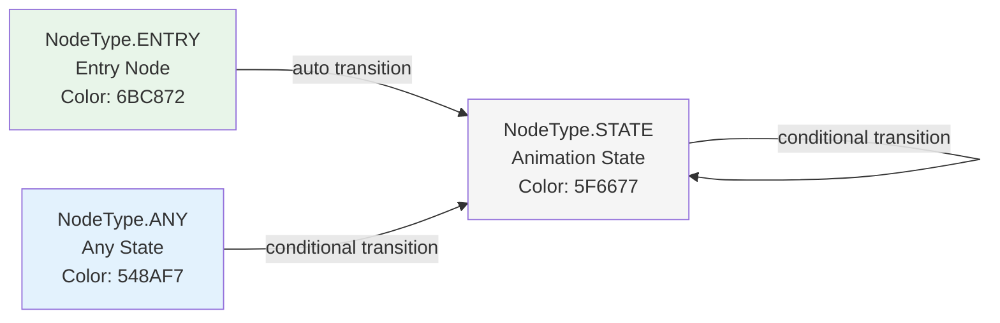

**Node Properties** (all types):
- `title`: Display name
- `x`, `y`: Canvas position
- `widthState`, `heightState`: Measured dimensions
- `color`: Visual theme color

**State Node Properties** (NodeType.STATE):
- `animationName`: Animation clip from model
- `wrapMode`: `Loop`, `Once`, `PingPong`, `ClampForever`
- `speed`: Playback speed multiplier
- `weight`: Blend weight (0-1)
- `priority`: Layer priority
- `blendCurve`: Interpolation curve for blending
- `overrideTranslation`, `overrideRotation`, `overrideScale`: Transform override flags

**Sources**: 
- [src/main/java/ru/hollowhorizon/hollowengine/client/gui/animations/Graph.kt:11-103]()
- [src/main/java/ru/hollowhorizon/hollowengine/client/gui/animations/GraphEditor.kt:30-103]()

### Connection Properties

Connections represent transitions between states and are rendered as curved arrows:

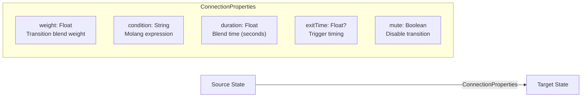

- **Condition**: Molang expression evaluated each frame (e.g., `"query.is_moving && query.speed > 0.5"`)
- **ExitTime**: `null` (no exit time), positive value (specific time), `-1f` (animation end)
- **Mute**: Excluded from code generation when `true`

**Sources**: 
- [src/main/java/ru/hollowhorizon/hollowengine/client/gui/animations/Graph.kt:42-67]()
- [src/main/java/ru/hollowhorizon/hollowengine/client/gui/animations/GraphEditor.kt:402-486]()

### Interaction Model

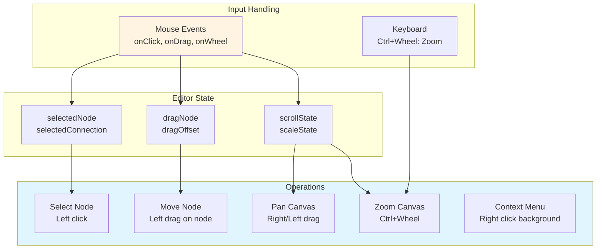

**Sources**: 
- [src/main/java/ru/hollowhorizon/hollowengine/client/gui/animations/GraphEditor.kt:150-223]()
- [src/main/java/ru/hollowhorizon/hollowengine/client/gui/animations/GraphEditor.kt:531-558]()

---

## Data Model and Serialization

### Graph Structure

The `AnimationControllerGraph` is the serializable representation of the entire state machine:

```kotlin
@Serializable
data class AnimationControllerGraph(
    val modelPath: String,
    val nodes: List<GraphNodeData>,
    val connections: List<GraphConnectionData>
)
```

**Conversion Process**:
1. **Runtime → Serializable**: `GraphEditor.toGraph()` converts mutable UI state to immutable data
2. **Serializable → JSON**: `JsonFormat.serialize()` writes to `.controller.json` file
3. **JSON → Runtime**: `GraphEditor.loadGraph()` restores editor state from file

**Sources**: 
- [src/main/java/ru/hollowhorizon/hollowengine/client/gui/animations/Graph.kt:69-103]()
- [src/main/java/ru/hollowhorizon/hollowengine/client/gui/scripting/files/animations/AnimationControllerFile.kt:21-60]()

### Node Data Structure

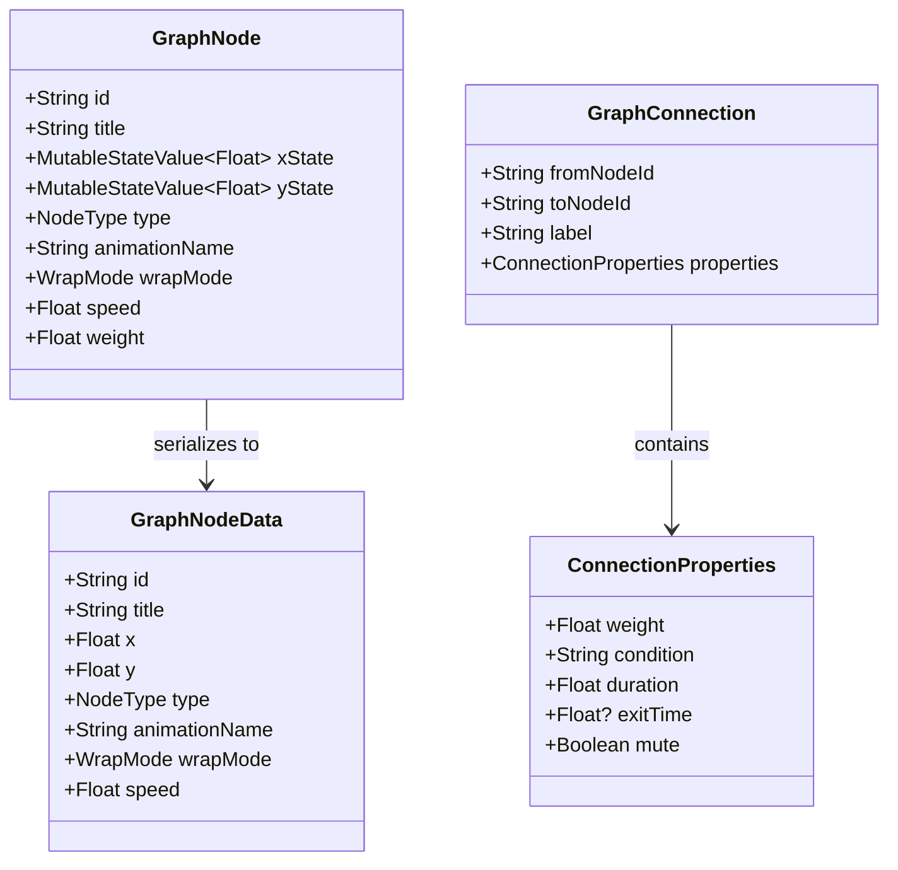

**Sources**: 
- [src/main/java/ru/hollowhorizon/hollowengine/client/gui/animations/Graph.kt:17-86]()

---

## Code Generation

The graph editor generates executable Kotlin scripts from the visual state machine. This bridges the gap between visual authoring and runtime execution.

### Generation Pipeline

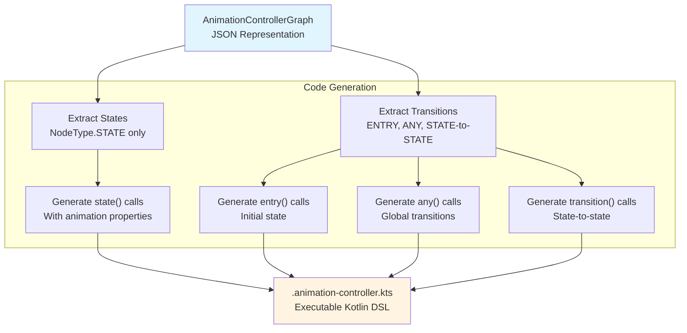

**Sources**: 
- [src/main/java/ru/hollowhorizon/hollowengine/client/gui/scripting/files/animations/AnimationControllerFile.kt:83-241]()

### Generated Script Structure

The generated `.animation-controller.kts` file follows this template:

```kotlin
// Auto-generated from [filename], do not edit manually
import net.minecraft.world.entity.LivingEntity
import ru.hollowhorizon.hollowengine.client.models.internal.controller.AnimationController
import ru.hollowhorizon.hollowengine.client.models.internal.controller.AnimationSystem
import ru.hollowhorizon.hollowengine.client.models.internal.controller.WrapMode

configure {
    // State definitions
    state(
        name = "StateName",
        animationName = "animation_clip",
        wrapMode = WrapMode.Loop,
        speed = 1.0f,
        weight = 1.0f,
        priority = 0,
        overrideTranslation = false,
        overrideRotation = false,
        overrideScale = false
    )
    
    // Entry transition (initial state)
    entry("InitialState")
    
    // Any-state transitions (global)
    any(
        toState = "TargetState",
        duration = 0.25f,
        condition = { /* Kotlin expression */ }
    )
    
    // Normal transitions
    transition(
        fromState = "StateA",
        toState = "StateB",
        duration = 0.25f,
        condition = { /* Kotlin expression */ }
    )
}
```

**Key Generation Rules**:
- **State Names**: Defaults to `animationName` if `title` is empty, otherwise uses `title`
- **Muted Transitions**: Excluded from generated code (documented in header comment)
- **Condition Conversion**: `properties.condition` string becomes lambda body
- **Empty Conditions**: Converted to `{ true }` for always-transition

**Sources**: 
- [src/main/java/ru/hollowhorizon/hollowengine/client/gui/scripting/files/animations/AnimationControllerFile.kt:99-241]()

### Script Class Provider Configuration

The compiler loader registers `.animation-controller.kts` as a script type:

```kotlin
ScriptClassProvider(
    extension = ".animation-controller.kts",
    baseClass = "ru.hollowhorizon.hollowengine.client.models.internal.controller.AnimationController",
    defaultImports = listOf(
        "net.minecraft.world.entity.LivingEntity",
        "ru.hollowhorizon.hollowengine.client.models.internal.controller.AnimationController",
        "ru.hollowhorizon.hollowengine.client.models.internal.controller.AnimationSystem",
        "ru.hollowhorizon.hollowengine.client.models.internal.controller.WrapMode"
    )
)
```

This ensures generated scripts:
- Extend `AnimationController` base class
- Have necessary imports pre-loaded
- Can be compiled by `ScriptingEnvironment`

**Sources**: 
- [src/main/java/ru/hollowhorizon/hollowengine/common/scripting/CompilerLoader.kt:34-43]()

---

## Animation Controller Runtime

The `AnimationController` class is the runtime state machine that executes the compiled DSL scripts. It manages state transitions, evaluates conditions, and triggers animation blending.

### Controller Architecture

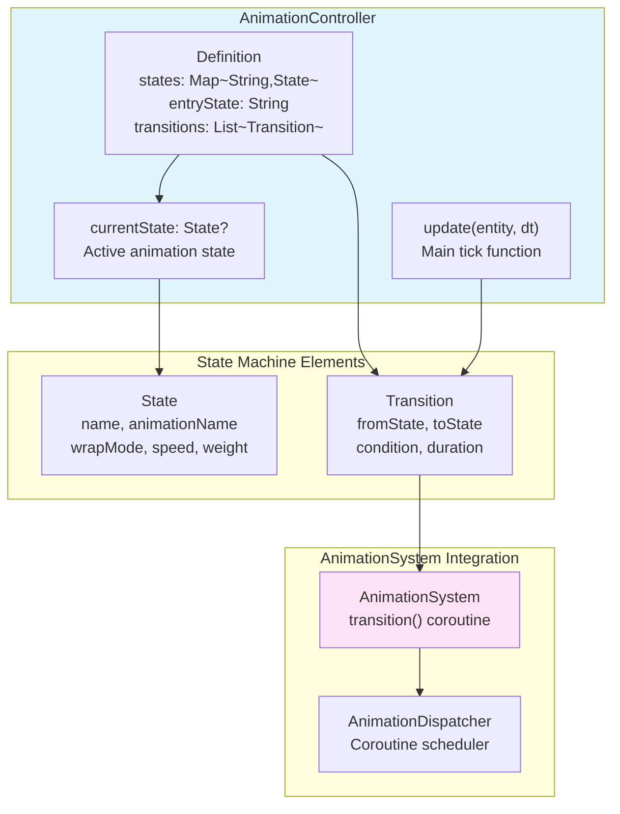

**Sources**: 
- [src/main/java/ru/hollowhorizon/hollowengine/client/models/internal/controller/AnimationController.kt:1-196]()

### State and Transition Data

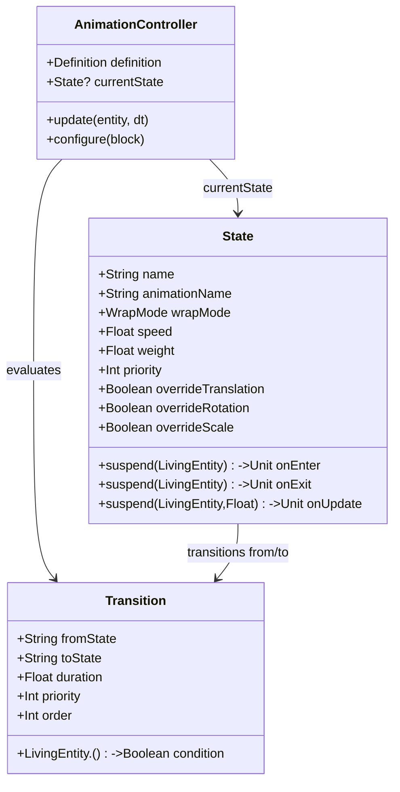

**Sources**: 
- [src/main/java/ru/hollowhorizon/hollowengine/client/models/internal/controller/AnimationController.kt:13-37]()

### Update and Transition Logic

The `update(entity: LivingEntity, dt: Float)` method is called every frame:

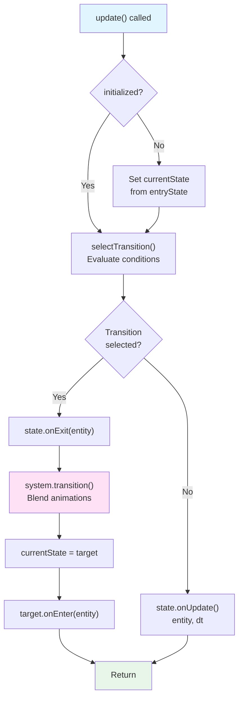

**Transition Selection Priority**:
1. Filter transitions by `fromState == current` OR `fromState == ANY`
2. Filter by `condition(entity)` returns `true`
3. Sort by `priority DESC`, then `order ASC`
4. Return first match, or `null`

**Sources**: 
- [src/main/java/ru/hollowhorizon/hollowengine/client/models/internal/controller/AnimationController.kt:147-195]()

### DSL Builder API

The `configure` function uses a builder DSL to define states and transitions:

```kotlin
// State definition
fun state(
    name: String,
    animationName: String,
    wrapMode: WrapMode = WrapMode.Loop,
    speed: Float = 1f,
    weight: Float = 1f,
    priority: Int = 0,
    overrideTranslation: Boolean = true,
    overrideRotation: Boolean = true,
    overrideScale: Boolean = true,
    onEnter: (suspend (LivingEntity) -> Unit)? = null,
    onExit: (suspend (entity: LivingEntity) -> Unit)? = null,
    onUpdate: (suspend (entity: LivingEntity, dt: Float) -> Unit)? = null
)

// Entry transition (sets initial state)
fun entry(toState: String)

// Any-state transition (from any state)
fun any(
    toState: String,
    duration: Float = 0f,
    priority: Int = 0,
    condition: LivingEntity.() -> Boolean
)

// Normal transition
fun transition(
    fromState: String,
    toState: String,
    duration: Float = 0f,
    priority: Int = 0,
    condition: LivingEntity.() -> Boolean
)
```

**Sources**: 
- [src/main/java/ru/hollowhorizon/hollowengine/client/models/internal/controller/AnimationController.kt:40-123]()

---

## Animation System

The `AnimationSystem` class manages animation timing, blending, and coroutine-based updates. It uses an `AnimationDispatcher` to schedule animation transitions as coroutines.

### System Components

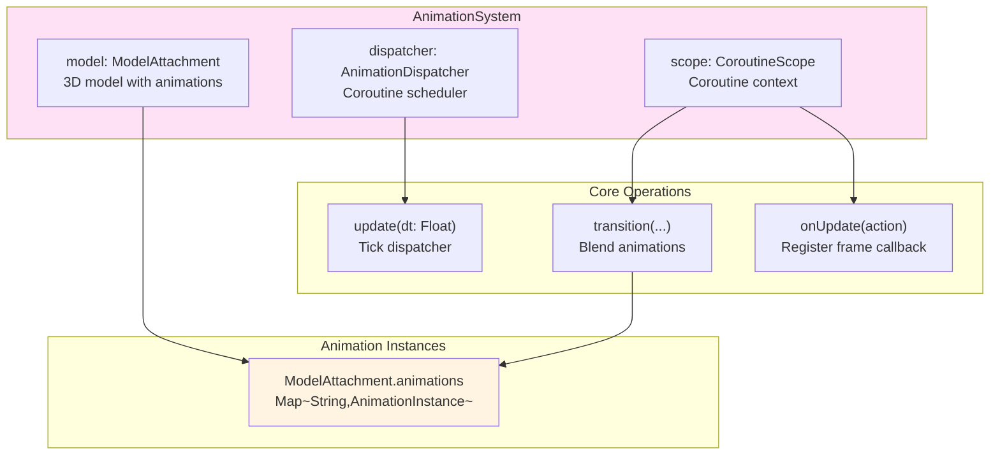

**Sources**: 
- [src/main/java/ru/hollowhorizon/hollowengine/client/models/internal/controller/AnimationSystem.kt:1-56]()

### Transition Algorithm

The `transition()` suspending function blends between two animations:

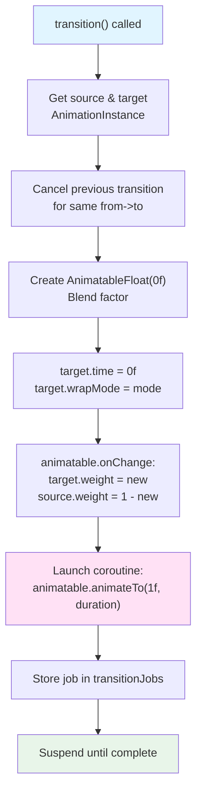

**Key Properties**:
- **Blend Factor**: Animates from 0 to 1 over `duration` seconds
- **Weight Transfer**: `target.weight = factor`, `source.weight = 1 - factor`
- **Easing**: Uses `Easing.smooth` by default
- **Cancellation**: Previous transitions for same pair are cancelled

**Sources**: 
- [src/main/java/ru/hollowhorizon/hollowengine/client/models/internal/controller/AnimationSystem.kt:28-55]()

### Animation Dispatcher

The `AnimationDispatcher` is a custom `CoroutineDispatcher` that schedules coroutine execution to game ticks:

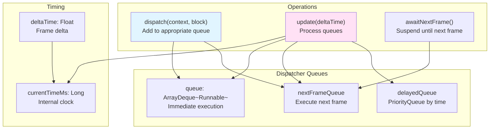

**Update Process** (called each frame):
1. Increment `currentTimeMs` by `deltaTime * 1000`
2. Move all tasks from `nextFrameQueue` to `queue`
3. Move all expired tasks from `delayedQueue` to `queue`
4. Execute all tasks in `queue` (catching exceptions)

**Sources**: 
- [src/main/java/ru/hollowhorizon/hollowengine/client/models/internal/controller/AnimationDispatcher.kt:1-116]()

---

## ECS Integration

The animation system integrates with the Geary ECS through the `Model` component, which connects entities to 3D models and animation controllers.

### Model Component

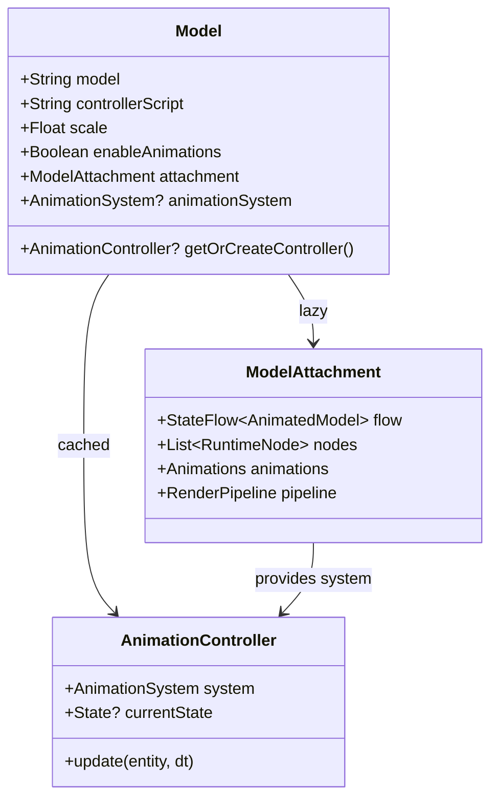

**Model Properties**:
- `model`: Resource location of GLTF/GLB file (e.g., `"hollowengine:models/entity/player_model.gltf"`)
- `controllerScript`: Filename of `.animation-controller.kts` script
- `scale`: Uniform scale multiplier
- `enableAnimations`: Toggle for animation system initialization

**Sources**: 
- [src/main/java/ru/hollowhorizon/hollowengine/common/geary/components/Model.kt:35-84]()

### Controller Initialization Flow

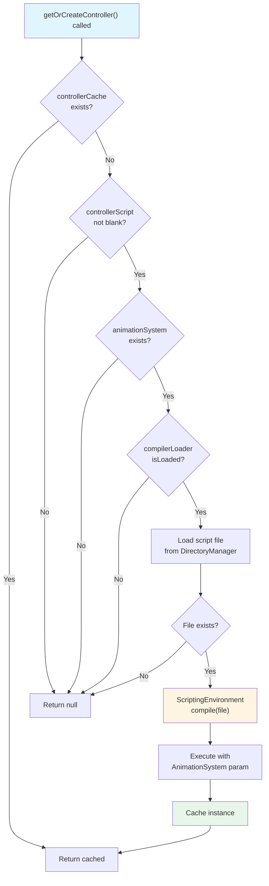

**Compilation Details**:
- Script must extend `AnimationController` and accept `AnimationSystem` constructor parameter
- Falls back to no-arg constructor if system parameter fails
- Compilation errors are swallowed, returning `null`

**Sources**: 
- [src/main/java/ru/hollowhorizon/hollowengine/common/geary/components/Model.kt:67-83]()

### Render Event Integration

The animation system hooks into entity rendering via the `@SubscribeEvent` annotation:

```kotlin
@SubscribeEvent
fun onRender(event: RenderEntityEvent.Pre) {
    val model = event.entity.entity.get<Model>() ?: return
    
    // Update animations
    model.animationSystem?.let { animationSystem ->
        if (event.entity is LivingEntity) {
            if (updateJob?.isActive == false) {
                updateJob = Minecraft.getInstance().coroutineScope.launch {
                    model.getOrCreateController()?.update(entity, Time.deltaT)
                }
            }
            animationSystem.update(Time.deltaT)
        }
    }
    
    // Render model
    model.attachment.pipeline.render(RenderContext(...))
    
    event.isCanceled = true  // Cancel vanilla entity rendering
}
```

**Update Sequence**:
1. Get `Model` component from Geary entity
2. Launch coroutine to update `AnimationController` (if exists)
3. Update `AnimationSystem` with delta time
4. Render `ModelAttachment` through pipeline
5. Cancel vanilla rendering

**Sources**: 
- [src/main/java/ru/hollowhorizon/hollowengine/common/geary/components/Model.kt:88-129]()

---

## Model Preview System

The `ModelController` class provides an in-IDE 3D preview of models with animation playback. This is primarily used in the animation editor for real-time visualization.

### Preview Architecture

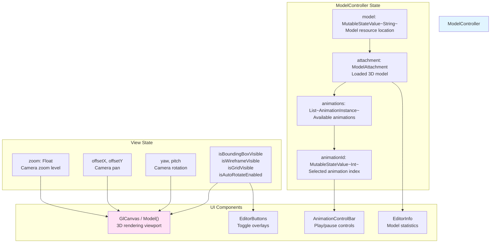

**Sources**: 
- [src/main/java/ru/hollowhorizon/hollowengine/client/gui/scripting/files/prefabs/ModelController.kt:47-410]()

### Rendering Pipeline

The preview uses a custom OpenGL canvas that renders the model with transformations:

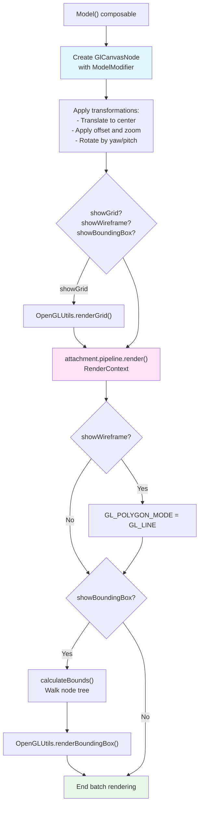

**Transformation Order**:
1. Translate to `(centerX + offsetX * scale, centerY + offsetY * scale, 0)`
2. Scale by `baseSize * modelConfig.scale`
3. Rotate by pitch around X axis
4. Rotate by yaw around Y axis

**Sources**: 
- [src/main/java/ru/hollowhorizon/hollowengine/client/gui/scripting/files/prefabs/ModelController.kt:445-514]()

### Animation Control Bar

The control bar provides playback controls for previewing animations:

| Control | Function | Implementation |
|---------|----------|----------------|
| Dropdown | Select animation | `ItemPopupMenu` with animation names |
| Play/Pause | Toggle playback | Set `animation.weight = 1 - animation.weight` |
| Progress Bar | Show playback progress | `(animation.time / animation.duration)` |

**Play/Pause Logic**:
```kotlin
modifier.onClick {
    animation?.apply {
        weight = 1f - weight  // Toggle between 0 and 1
        wrapMode = WrapMode.Loop
    }
}
```

**Sources**: 
- [src/main/java/ru/hollowhorizon/hollowengine/client/gui/scripting/files/prefabs/ModelController.kt:137-287]()

---

## Workflow: End-to-End

This section describes the complete workflow from authoring to runtime execution.

### 1. Authoring Phase

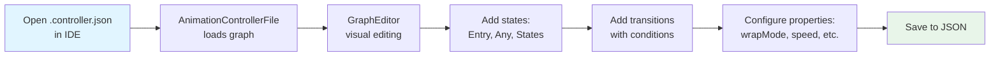

**Sources**: 
- [src/main/java/ru/hollowhorizon/hollowengine/client/gui/scripting/files/animations/AnimationControllerFile.kt:21-46]()

### 2. Code Generation Phase

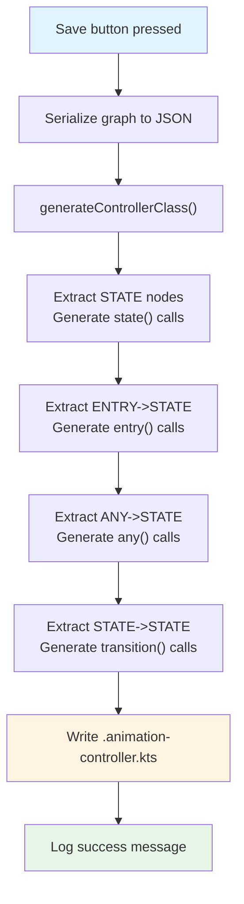

**Sources**: 
- [src/main/java/ru/hollowhorizon/hollowengine/client/gui/scripting/files/animations/AnimationControllerFile.kt:62-241]()

### 3. Runtime Initialization

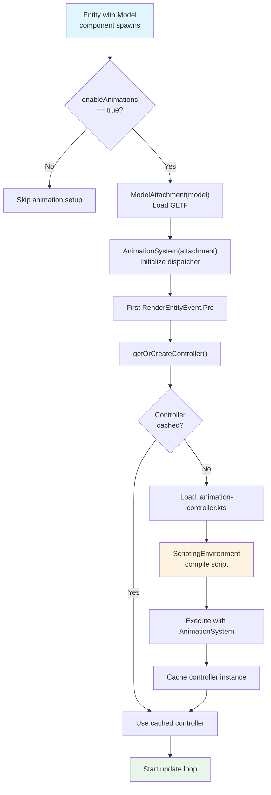

**Sources**: 
- [src/main/java/ru/hollowhorizon/hollowengine/common/geary/components/Model.kt:46-83]()
- [src/main/java/ru/hollowhorizon/hollowengine/common/geary/components/Model.kt:88-104]()

### 4. Runtime Execution Loop

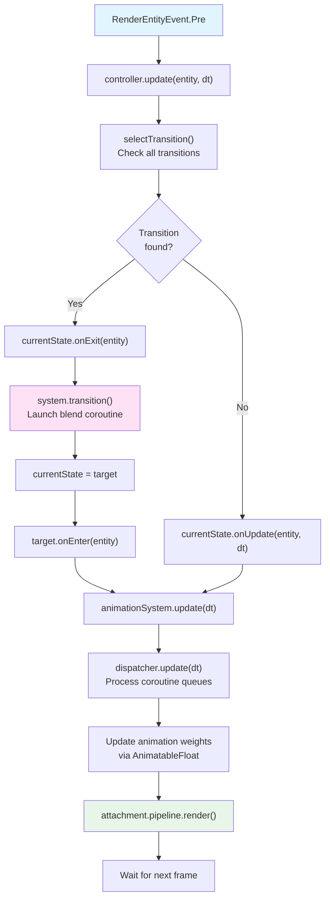

**Sources**: 
- [src/main/java/ru/hollowhorizon/hollowengine/common/geary/components/Model.kt:94-104]()
- [src/main/java/ru/hollowhorizon/hollowengine/client/models/internal/controller/AnimationController.kt:147-175]()
- [src/main/java/ru/hollowhorizon/hollowengine/client/models/internal/controller/AnimationSystem.kt:15-17]()
- [src/main/java/ru/hollowhorizon/hollowengine/client/models/internal/controller/AnimationDispatcher.kt:81-104]()

---

## Summary

The Animation System provides a complete pipeline for state machine-based animation:

1. **Visual Authoring**: Graph editor creates state machines with nodes and transitions
2. **Code Generation**: Graphs compile to executable Kotlin DSL scripts
3. **Runtime Execution**: AnimationController evaluates conditions and triggers transitions
4. **Blending**: AnimationSystem smoothly blends between animations using coroutines
5. **ECS Integration**: Model component connects entities to animation controllers
6. **Preview**: ModelController provides real-time 3D preview in the IDE

**Key Design Principles**:
- **Separation of Concerns**: Authoring, generation, and execution are distinct phases
- **Type Safety**: Code generation ensures compile-time checking of transitions
- **Coroutine-Based**: Smooth blending without blocking the main thread
- **Extensibility**: DSL allows custom logic in `onEnter`, `onExit`, `onUpdate` callbacks

**Performance Characteristics**:
- Transitions execute as lightweight coroutines on `AnimationDispatcher`
- Animation updates limited to `Time.deltaT` (frame delta time)
- Controller compilation cached after first load
- State machine evaluation is O(n) in number of transitions per frame

**Sources**: 
- [src/main/java/ru/hollowhorizon/hollowengine/client/gui/animations/GraphEditor.kt:1-1336]()
- [src/main/java/ru/hollowhorizon/hollowengine/client/gui/scripting/files/animations/AnimationControllerFile.kt:1-250]()
- [src/main/java/ru/hollowhorizon/hollowengine/client/models/internal/controller/AnimationController.kt:1-196]()
- [src/main/java/ru/hollowhorizon/hollowengine/client/models/internal/controller/AnimationSystem.kt:1-56]()
- [src/main/java/ru/hollowhorizon/hollowengine/common/geary/components/Model.kt:35-130]()