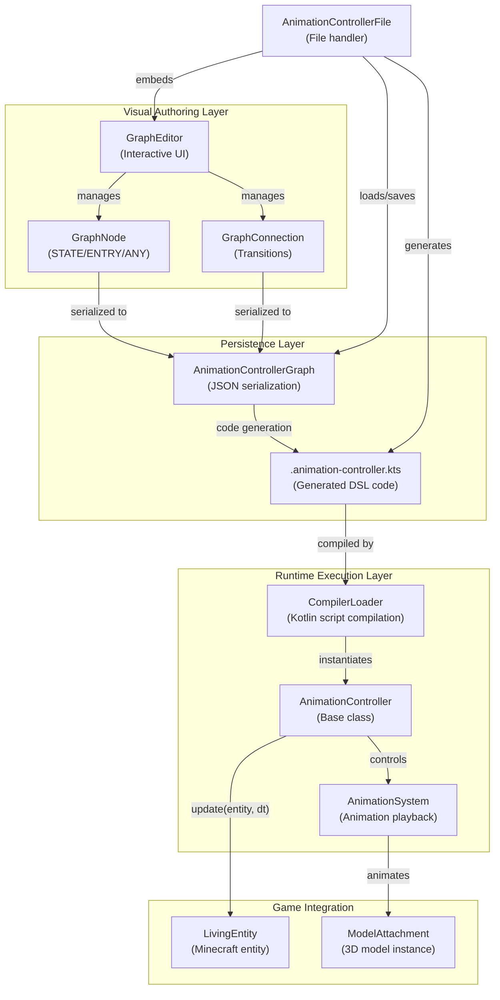
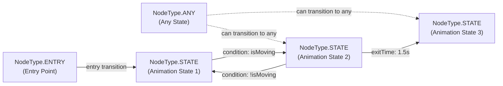
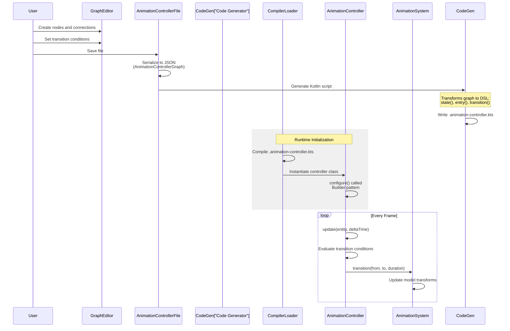
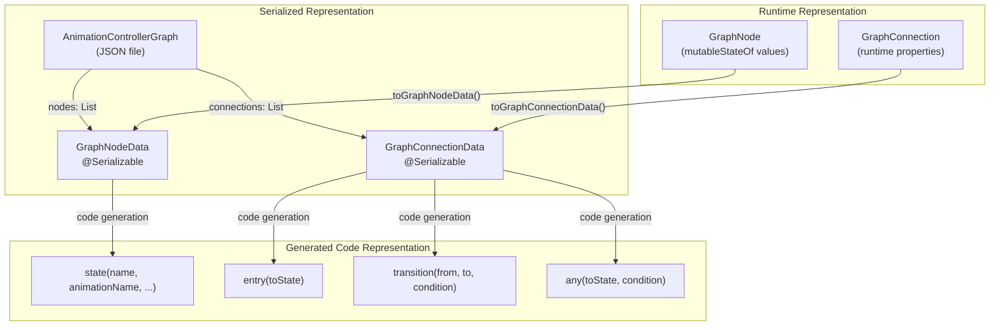

# Animation System Overview

<details>
<summary>Relevant source files</summary>

The following files were used as context for generating this wiki page:

- [src/main/java/ru/hollowhorizon/hollowengine/client/gui/animations/Graph.kt](src/main/java/ru/hollowhorizon/hollowengine/client/gui/animations/Graph.kt)
- [src/main/java/ru/hollowhorizon/hollowengine/client/gui/animations/GraphEditor.kt](src/main/java/ru/hollowhorizon/hollowengine/client/gui/animations/GraphEditor.kt)
- [src/main/java/ru/hollowhorizon/hollowengine/client/gui/colors/ColorTheme.kt](src/main/java/ru/hollowhorizon/hollowengine/client/gui/colors/ColorTheme.kt)
- [src/main/java/ru/hollowhorizon/hollowengine/client/gui/scripting/files/animations/AnimationControllerFile.kt](src/main/java/ru/hollowhorizon/hollowengine/client/gui/scripting/files/animations/AnimationControllerFile.kt)
- [src/main/java/ru/hollowhorizon/hollowengine/client/gui/scripting/titlebar/ComboBox.kt](src/main/java/ru/hollowhorizon/hollowengine/client/gui/scripting/titlebar/ComboBox.kt)
- [src/main/java/ru/hollowhorizon/hollowengine/client/models/internal/controller/AnimControllerDSL.kt](src/main/java/ru/hollowhorizon/hollowengine/client/models/internal/controller/AnimControllerDSL.kt)
- [src/main/java/ru/hollowhorizon/hollowengine/client/models/internal/controller/AnimationController.kt](src/main/java/ru/hollowhorizon/hollowengine/client/models/internal/controller/AnimationController.kt)
- [src/main/java/ru/hollowhorizon/hollowengine/client/models/internal/controller/AnimationDispatcher.kt](src/main/java/ru/hollowhorizon/hollowengine/client/models/internal/controller/AnimationDispatcher.kt)
- [src/main/java/ru/hollowhorizon/hollowengine/client/models/internal/controller/EntityUtils.kt](src/main/java/ru/hollowhorizon/hollowengine/client/models/internal/controller/EntityUtils.kt)
- [src/main/java/ru/hollowhorizon/hollowengine/common/scripting/CompilerLoader.kt](src/main/java/ru/hollowhorizon/hollowengine/common/scripting/CompilerLoader.kt)

</details>


## Purpose and Scope

The Animation System provides a visual editor and runtime framework for creating animation state machines in HollowEngine. Content creators design state machines through a node-based graph interface, which generates executable Kotlin scripts that control model animations at runtime. This page provides an architectural overview of the entire animation pipeline, from visual authoring to runtime execution.

For details on the visual graph editor UI, see [Graph Editor](#8.2). For code generation implementation, see [Code Generation](#8.4). For the programmatic DSL syntax, see [Animation Controller DSL](#8.5). For runtime state machine execution, see [Runtime Execution](#8.6).

**Sources:** [src/main/java/ru/hollowhorizon/hollowengine/client/gui/animations/GraphEditor.kt:31-104](), [src/main/java/ru/hollowhorizon/hollowengine/client/gui/scripting/files/animations/AnimationControllerFile.kt:21-82]()

---

## System Architecture

The animation system bridges visual authoring and runtime execution through a code generation layer. The architecture consists of three primary subsystems that transform user intent into animated 3D models.



**Architecture Overview: Four-Layer Design**

The system follows a clear separation of concerns with four distinct layers that transform visual designs into runtime animations.

**Sources:** [src/main/java/ru/hollowhorizon/hollowengine/client/gui/animations/GraphEditor.kt:31-48](), [src/main/java/ru/hollowhorizon/hollowengine/client/gui/scripting/files/animations/AnimationControllerFile.kt:21-46](), [src/main/java/ru/hollowhorizon/hollowengine/client/models/internal/controller/AnimationController.kt:1-26]()

---

## Core Components and Code Entities

The animation system is implemented through several key classes that work together to provide the complete authoring-to-runtime pipeline.

| Component | File Path | Responsibility |
|-----------|-----------|----------------|
| `GraphEditor` | [GraphEditor.kt:31]() | Interactive canvas for node-based animation graph editing |
| `GraphNode` | [Graph.kt:17-40]() | Visual node representing animation state (STATE/ENTRY/ANY types) |
| `GraphConnection` | [Graph.kt:60-67]() | Transition between states with conditions and properties |
| `AnimationControllerGraph` | [Graph.kt:98-102]() | Serializable graph data structure (JSON) |
| `AnimationControllerFile` | [AnimationControllerFile.kt:21]() | File handler orchestrating load/save/code generation |
| `AnimationController` | [AnimationController.kt:6]() | Base class for runtime animation state machines |
| `AnimationSystem` | Referenced in controller | Animation playback system controlling model transforms |
| `AnimationDispatcher` | [AnimationDispatcher.kt:23]() | Coroutine dispatcher for frame-aligned animation updates |

**Sources:** [src/main/java/ru/hollowhorizon/hollowengine/client/gui/animations/GraphEditor.kt:31-64](), [src/main/java/ru/hollowhorizon/hollowengine/client/gui/animations/Graph.kt:17-102](), [src/main/java/ru/hollowhorizon/hollowengine/client/gui/scripting/files/animations/AnimationControllerFile.kt:21-23](), [src/main/java/ru/hollowhorizon/hollowengine/client/models/internal/controller/AnimationController.kt:6-26]()

---

## Node Types and State Machine Structure

Animation graphs are composed of three node types, each serving a distinct role in the state machine logic.



**Node Type Semantics**

### NodeType.ENTRY (Entry State)
- **Purpose:** Defines the initial state when animation controller starts
- **Behavior:** Single outgoing connection determines starting animation
- **Visual:** Green color (`#6BC872`)
- **Code:** [Graph.kt:12]()

### NodeType.ANY (Any State)
- **Purpose:** Enables global transitions from any current state
- **Behavior:** Transitions evaluated regardless of current state
- **Use Case:** Emergency animations (e.g., hit reactions, knockback)
- **Visual:** Blue color (`#548AF7`)
- **Code:** [Graph.kt:14]()

### NodeType.STATE (Animation State)
- **Purpose:** Represents a playable animation with associated properties
- **Properties:** Animation name, wrap mode, speed, weight, priority, blend curve
- **Visual:** Gray/orange colors
- **Code:** [Graph.kt:11]()

**Sources:** [src/main/java/ru/hollowhorizon/hollowengine/client/gui/animations/Graph.kt:11-15](), [src/main/java/ru/hollowhorizon/hollowengine/client/gui/animations/GraphEditor.kt:68-103](), [src/main/java/ru/hollowhorizon/hollowengine/client/gui/scripting/files/animations/AnimationControllerFile.kt:125-185]()

---

## Workflow: Visual Authoring to Runtime Execution

The complete workflow transforms visual node graphs into executable state machines through a code generation step. This enables both visual editing and programmatic control.



**Workflow Stages**

**Sources:** [src/main/java/ru/hollowhorizon/hollowengine/client/gui/scripting/files/animations/AnimationControllerFile.kt:62-81](), [src/main/java/ru/hollowhorizon/hollowengine/client/gui/scripting/files/animations/AnimationControllerFile.kt:83-241](), [src/main/java/ru/hollowhorizon/hollowengine/client/models/internal/controller/AnimationController.kt:147-175]()

---

## Data Model and Serialization

The system maintains three representations of animation graphs, each optimized for its specific use case.



**Data Model Layer Details**

### Runtime Layer: Reactive UI State
- **GraphNode:** Contains `mutableStateOf` fields for UI reactivity ([Graph.kt:35-39]())
- **Properties:** Position (`xState`, `yState`), dimensions, animation settings
- **Purpose:** Enable real-time UI updates and drag-and-drop

### Serialization Layer: JSON Persistence
- **GraphNodeData:** Kotlin `@Serializable` data class ([Graph.kt:70-86]())
- **GraphConnectionData:** Serializable connection with `ConnectionProperties` ([Graph.kt:89-95]())
- **AnimationControllerGraph:** Top-level container with model path ([Graph.kt:98-102]())
- **Format:** JSON via `JsonFormat.decodeFromString` / `encodeToString`

### Generated Code Layer: Kotlin DSL
- **Function Calls:** `state()`, `entry()`, `transition()`, `any()`
- **Embedded Logic:** Transition conditions as Kotlin lambda expressions
- **Purpose:** Human-readable, editable, version-controllable scripts

**Sources:** [src/main/java/ru/hollowhorizon/hollowengine/client/gui/animations/Graph.kt:17-102](), [src/main/java/ru/hollowhorizon/hollowengine/client/gui/scripting/files/animations/AnimationControllerFile.kt:69-80]()

---

## Code Generation Process

The code generator transforms visual graphs into executable Kotlin scripts using a template-based approach. The generated code follows the Animation Controller DSL syntax.

### Generation Pipeline

1. **Parse Graph Data:** Extract nodes and connections from `AnimationControllerGraph`
2. **Filter Muted Transitions:** Exclude connections with `properties.mute = true`
3. **Generate State Definitions:** Create `state()` calls for each `NodeType.STATE`
4. **Generate Entry Transitions:** Create `entry()` calls from `NodeType.ENTRY` nodes
5. **Generate Any-State Transitions:** Create `any()` calls from `NodeType.ANY` nodes
6. **Generate State Transitions:** Create `transition()` calls between states
7. **Embed Conditions:** Insert user-defined conditions as lambda bodies
8. **Write Script File:** Output `.animation-controller.kts` with imports and configure block

### Example Generated Code

```kotlin
// Auto-generated from hollowengine/animations/player_controller.json
import net.minecraft.world.entity.LivingEntity
import ru.hollowhorizon.hollowengine.client.models.internal.controller.*

configure {
    state(
        name = "Idle",
        animationName = "idle",
        wrapMode = WrapMode.Loop,
        speed = 1.0f,
        weight = 1.0f,
        priority = 0,
        overrideTranslation = false,
        overrideRotation = false,
        overrideScale = false
    )
    
    state(
        name = "Run",
        animationName = "run",
        wrapMode = WrapMode.Loop,
        speed = 1.0f,
        weight = 1.0f,
        priority = 0,
        overrideTranslation = false,
        overrideRotation = false,
        overrideScale = false
    )
    
    entry("Idle")
    
    transition(
        fromState = "Idle",
        toState = "Run",
        duration = 0.25f,
        condition = { isMoving },
    )
    
    transition(
        fromState = "Run",
        toState = "Idle",
        duration = 0.25f,
        condition = { !isMoving },
    )
}
```

**Generated File Structure:**
- **Header Comment:** Source file reference and generation warning
- **Imports:** Minecraft entity classes and animation system
- **Documentation:** State/transition counts in KDoc format
- **configure Block:** DSL calls defining the state machine
- **Condition Embedding:** User expressions inserted as Kotlin code

**Sources:** [src/main/java/ru/hollowhorizon/hollowengine/client/gui/scripting/files/animations/AnimationControllerFile.kt:83-241]()

---

## Script Compilation and Execution

Generated `.animation-controller.kts` scripts are registered with the `CompilerLoader` as a distinct script type with a custom base class and default imports.

### Script Registration

The `CompilerLoader` recognizes animation controller scripts through a `ScriptClassProvider` configuration:

```kotlin
ScriptClassProvider(
    extension = ".animation-controller.kts",
    baseClass = "ru.hollowhorizon.hollowengine.client.models.internal.controller.AnimationController",
    defaultImports = listOf(
        "net.minecraft.world.entity.LivingEntity",
        "ru.hollowhorizon.hollowengine.client.models.internal.controller.AnimationController",
        "ru.hollowhorizon.hollowengine.client.models.internal.controller.AnimationSystem",
        "ru.hollowhorizon.hollowengine.client.models.internal.controller.WrapMode",
    )
)
```

### Runtime Execution Flow

1. **Compilation:** `CompilerLoader` compiles `.animation-controller.kts` to bytecode
2. **Instantiation:** Script creates subclass of `AnimationController`
3. **Configuration:** Generated `configure {}` block populates state machine definition
4. **Initialization:** First `update()` call selects entry state
5. **Per-Frame Updates:** `update(entity, dt)` evaluates transitions and plays animations
6. **Coroutine Integration:** State callbacks (`onEnter`, `onExit`, `onUpdate`) run in `AnimationDispatcher`

### State Machine Execution

The `AnimationController.update()` method implements the core state machine logic:

- **Transition Evaluation:** Checks conditions for current state and ANY state transitions
- **Priority Sorting:** Higher priority transitions are preferred
- **Order Preservation:** Same-priority transitions use insertion order
- **Condition Execution:** Lambda conditions run with `LivingEntity` as receiver
- **Animation Transitions:** Calls `AnimationSystem.transition()` with blend duration

**Sources:** [src/main/java/ru/hollowhorizon/hollowengine/common/scripting/CompilerLoader.kt:33-43](), [src/main/java/ru/hollowhorizon/hollowengine/client/models/internal/controller/AnimationController.kt:147-175]()

---

## Key Concepts

### Connection Properties

Each `GraphConnection` carries transition metadata through `ConnectionProperties`:

| Property | Type | Purpose |
|----------|------|---------|
| `weight` | `Float` | Blend weight for transition (0.0 to 1.0) |
| `condition` | `String` | Kotlin expression evaluated as Boolean |
| `duration` | `Float` | Transition blend time in seconds |
| `exitTime` | `Float?` | Optional minimum animation time before transition |
| `mute` | `Boolean` | Disable transition without deleting |
| `extras` | `Map<String, String>` | User-defined metadata |

**Exit Time Semantics:**
- `null`: No exit time requirement (immediate transition)
- Positive value: Wait until animation reaches this time
- `-1f`: Wait until animation completes (for `WrapMode.Once`)

**Sources:** [src/main/java/ru/hollowhorizon/hollowengine/client/gui/animations/Graph.kt:42-58]()

### Model Path and Animation Discovery

The `GraphEditor` maintains a `modelPath` state that determines available animations:

1. **Path Configuration:** User sets model path in property panel
2. **Validation:** Checks if path is valid ResourceLocation
3. **Model Loading:** Creates temporary `ModelAttachment` instance
4. **Animation Extraction:** Populates `availableAnimations` list from model
5. **Node Binding:** States can reference discovered animation names

This enables type-safe animation selection and prevents referencing non-existent animations.

**Sources:** [src/main/java/ru/hollowhorizon/hollowengine/client/gui/animations/GraphEditor.kt:56-59](), [src/main/java/ru/hollowhorizon/hollowengine/client/gui/scripting/files/animations/AnimationControllerFile.kt:48-60]()

### Muted Transitions

Transitions can be temporarily disabled without deletion using the `mute` property:

- **Purpose:** Test alternative state machines without losing work
- **UI Rendering:** Muted connections render in gray (`ColorTheme.GraphColors.ConnectionMuted`)
- **Code Generation:** Muted transitions are excluded from generated script
- **Metadata:** Connection definitions remain in JSON for future re-enabling

**Sources:** [src/main/java/ru/hollowhorizon/hollowengine/client/gui/animations/Graph.kt:48](), [src/main/java/ru/hollowhorizon/hollowengine/client/gui/animations/GraphEditor.kt:465](), [src/main/java/ru/hollowhorizon/hollowengine/client/gui/scripting/files/animations/AnimationControllerFile.kt:146-169]()

---

## Integration with Model System

Animation controllers integrate with the model rendering pipeline through `AnimationSystem`, which manages animation playback state:

- **Frame Updates:** Controllers receive `update(entity, dt)` every render frame
- **State Transitions:** Controller calls `AnimationSystem.transition(from, to, duration)`
- **Coroutine Scope:** `AnimationSystem.scope` provides launch context for async operations
- **Entity Context:** Transition conditions execute with `LivingEntity` as receiver, accessing entity state

The `AnimationDispatcher` ensures animation updates are frame-aligned and coroutine-safe.

**Sources:** [src/main/java/ru/hollowhorizon/hollowengine/client/models/internal/controller/AnimationController.kt:6-26](), [src/main/java/ru/hollowhorizon/hollowengine/client/models/internal/controller/AnimationController.kt:157-169](), [src/main/java/ru/hollowhorizon/hollowengine/client/models/internal/controller/AnimationDispatcher.kt:23-104]()