# Graph Editor

<details>
<summary>Relevant source files</summary>

The following files were used as context for generating this wiki page:

- [src/main/java/ru/hollowhorizon/hollowengine/client/gui/animations/Graph.kt](src/main/java/ru/hollowhorizon/hollowengine/client/gui/animations/Graph.kt)
- [src/main/java/ru/hollowhorizon/hollowengine/client/gui/animations/GraphEditor.kt](src/main/java/ru/hollowhorizon/hollowengine/client/gui/animations/GraphEditor.kt)
- [src/main/java/ru/hollowhorizon/hollowengine/client/gui/colors/ColorTheme.kt](src/main/java/ru/hollowhorizon/hollowengine/client/gui/colors/ColorTheme.kt)
- [src/main/java/ru/hollowhorizon/hollowengine/client/gui/scripting/files/animations/AnimationControllerFile.kt](src/main/java/ru/hollowhorizon/hollowengine/client/gui/scripting/files/animations/AnimationControllerFile.kt)
- [src/main/java/ru/hollowhorizon/hollowengine/client/gui/scripting/titlebar/ComboBox.kt](src/main/java/ru/hollowhorizon/hollowengine/client/gui/scripting/titlebar/ComboBox.kt)
- [src/main/java/ru/hollowhorizon/hollowengine/client/models/internal/controller/AnimControllerDSL.kt](src/main/java/ru/hollowhorizon/hollowengine/client/models/internal/controller/AnimControllerDSL.kt)
- [src/main/java/ru/hollowhorizon/hollowengine/client/models/internal/controller/AnimationController.kt](src/main/java/ru/hollowhorizon/hollowengine/client/models/internal/controller/AnimationController.kt)
- [src/main/java/ru/hollowhorizon/hollowengine/client/models/internal/controller/AnimationDispatcher.kt](src/main/java/ru/hollowhorizon/hollowengine/client/models/internal/controller/AnimationDispatcher.kt)
- [src/main/java/ru/hollowhorizon/hollowengine/client/models/internal/controller/EntityUtils.kt](src/main/java/ru/hollowhorizon/hollowengine/client/models/internal/controller/EntityUtils.kt)
- [src/main/java/ru/hollowhorizon/hollowengine/common/scripting/CompilerLoader.kt](src/main/java/ru/hollowhorizon/hollowengine/common/scripting/CompilerLoader.kt)

</details>


The Graph Editor is a visual node-based editor for creating and editing animation state machines and other graph-based systems in HollowEngine. It provides a Scratch-like interface with draggable nodes, connections between nodes, and visual editing tools for defining transitions and states.

For information about the visual block scripting system (a different graph-based editor), see [Visual Block Editor](#5). For the animation system that this graph editor may control, see [3D Model System](#9).

## Purpose and Scope

The Graph Editor enables users to visually design state machines, animation graphs, and other node-based workflows through an interactive canvas. Users can create nodes representing states or actions, connect them with labeled edges representing transitions, and configure properties for each node. The editor is designed for managing animation state transitions in 3D models but can be adapted for other graph-based systems.

**Sources:**
- [src/main/java/ru/hollowhorizon/hollowengine/client/gui/animations/GraphEditor.kt:1-458]()
- [src/main/java/ru/hollowhorizon/hollowengine/client/gui/scripting/panels/GraphEditorPanel.kt:1-16]()

## Architecture Overview

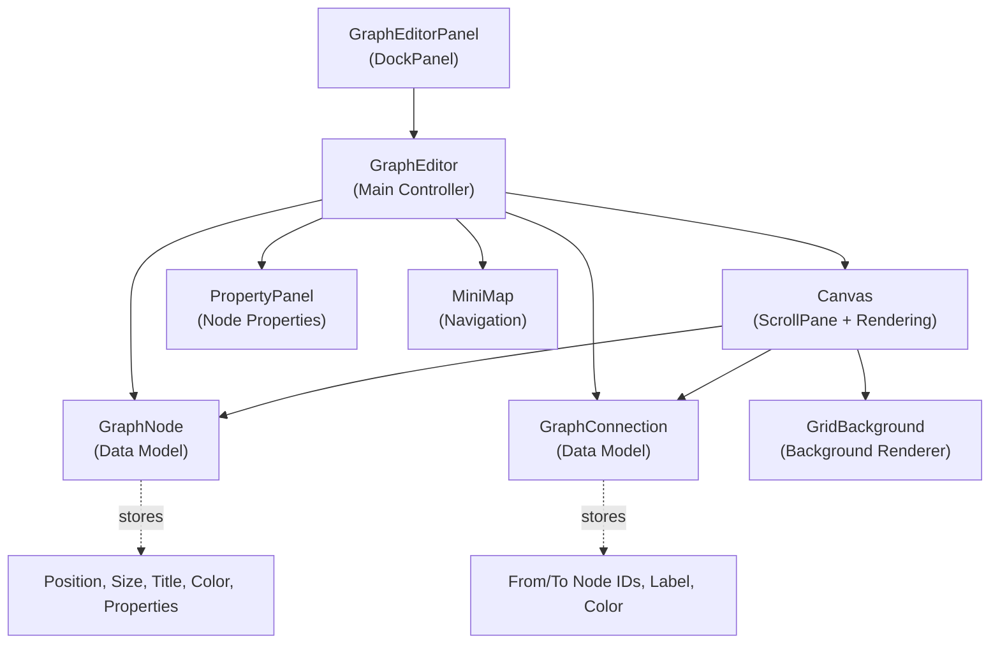

**Diagram: Graph Editor Component Architecture**

The Graph Editor follows a Model-View-Controller pattern where `GraphEditor` orchestrates the UI, `GraphNode` and `GraphConnection` hold the data, and various UI scopes handle rendering and interaction.

**Sources:**
- [src/main/java/ru/hollowhorizon/hollowengine/client/gui/animations/GraphEditor.kt:23-131]()
- [src/main/java/ru/hollowhorizon/hollowengine/client/gui/animations/Graph.kt:1-28]()

## Data Models

### GraphNode

The `GraphNode` class represents a single node in the graph with the following properties:

| Property | Type | Description |
|----------|------|-------------|
| `id` | `String` | Unique identifier (UUID by default) |
| `title` | `String` | Display name of the node |
| `xState` | `MutableStateValue<Float>` | Horizontal position |
| `yState` | `MutableStateValue<Float>` | Vertical position |
| `widthState` | `MutableStateValue<Float>` | Node width (measured dynamically) |
| `heightState` | `MutableStateValue<Float>` | Node height (measured dynamically) |
| `color` | `Color` | Node accent color |
| `type` | `NodeType` | Node type (STATE, ENTRY, or ANY) |
| `animationName` | `String` | Name of animation clip for STATE nodes |
| `wrapMode` | `WrapMode` | Playback mode (Loop, Once, PingPong, ClampForever) |
| `speed` | `Float` | Animation playback speed multiplier |
| `weight` | `Float` | Animation blend weight |
| `priority` | `Int` | State priority for transition resolution |
| `blendCurve` | `Interpolation` | Interpolation curve for blending |
| `overrideTranslation` | `Boolean` | Whether to override translation transforms |
| `overrideRotation` | `Boolean` | Whether to override rotation transforms |
| `overrideScale` | `Boolean` | Whether to override scale transforms |
| `extras` | `MutableMap<String, String>` | Additional key-value metadata |

**Sources:**
- [src/main/java/ru/hollowhorizon/hollowengine/client/gui/animations/Graph.kt:17-40]()

### GraphConnection

The `GraphConnection` data class represents directed edges between nodes:

| Property | Type | Description |
|----------|------|-------------|
| `fromNodeId` | `String` | Source node UUID |
| `toNodeId` | `String` | Target node UUID |
| `label` | `String` | Transition condition or description |
| `color` | `Color` | Connection line color (default: main accent with alpha) |
| `id` | `String` | Unique identifier (UUID by default) |
| `properties` | `ConnectionProperties` | Transition configuration and metadata |

**Sources:**
- [src/main/java/ru/hollowhorizon/hollowengine/client/gui/animations/Graph.kt:60-67]()

### ConnectionProperties

The `ConnectionProperties` data class configures transition behavior:

| Property | Type | Default | Description |
|----------|------|---------|-------------|
| `weight` | `Float` | `1.0f` | Transition priority weight |
| `condition` | `String` | `""` | Conditional expression for transition |
| `duration` | `Float` | `0.25f` | Blend duration in seconds |
| `exitTime` | `Float?` | `null` | Optional exit time from source state |
| `mute` | `Boolean` | `false` | Whether transition is disabled |
| `extras` | `MutableMap<String, String>` | `mutableMapOf()` | Additional metadata |

Helper properties:
- `hasCondition`: Returns `true` if condition is not blank
- `hasExitTime`: Returns `true` if exitTime is not null

**Sources:**
- [src/main/java/ru/hollowhorizon/hollowengine/client/gui/animations/Graph.kt:42-58]()

## Node Types

The Graph Editor supports three distinct node types defined by the `NodeType` enum:

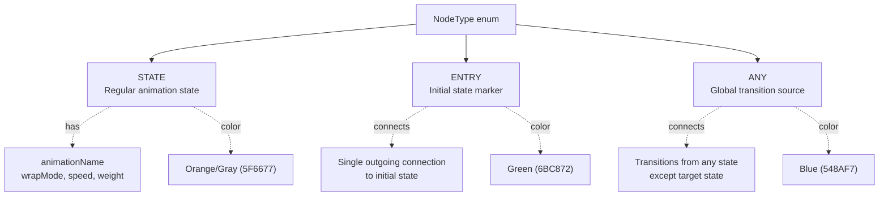

**Diagram: Node Type System**

### STATE Nodes

`NodeType.STATE` represents regular animation states that play specific animation clips. These nodes contain the full animation playback configuration:

- **animationName**: Name of the animation clip to play
- **wrapMode**: Playback loop behavior (Loop, Once, PingPong, ClampForever)
- **speed**: Playback speed multiplier (default 1.0)
- **weight**: Blend weight for animation mixing (default 1.0)
- **priority**: Transition selection priority
- **blendCurve**: Interpolation curve for smooth transitions
- **Transform overrides**: Flags to control which transform channels are affected

STATE nodes can have multiple incoming and outgoing transitions based on conditions.

### ENTRY Nodes

`NodeType.ENTRY` marks the initial state of the state machine. Properties:

- Typically has a single outgoing connection to the default state
- Does not play any animation itself
- Rendered with green color (`Color("6BC872")`)
- Only one ENTRY node should exist per state machine (though multiple are allowed)

When the animation controller initializes, it follows the ENTRY node's outgoing connection to determine the starting state.

### ANY Nodes

`NodeType.ANY` represents a global transition source. Transitions from ANY nodes:

- Can transition to any STATE node
- Are evaluated from any current state except the target state
- Useful for global interrupts (e.g., "death" or "stunned" animations)
- Rendered with blue color (`Color("548AF7")`)
- Do not play animations themselves

In generated code, ANY transitions are represented as transitions with `fromState = "__any__"` ([src/main/java/ru/hollowhorizon/hollowengine/client/models/internal/controller/AnimationController.kt:10]()).

**Sources:**
- [src/main/java/ru/hollowhorizon/hollowengine/client/gui/animations/Graph.kt:11-15]()
- [src/main/java/ru/hollowhorizon/hollowengine/client/gui/animations/GraphEditor.kt:68-104]()
- [src/main/java/ru/hollowhorizon/hollowengine/client/gui/scripting/files/animations/AnimationControllerFile.kt:126-139]()

## Editor State Management

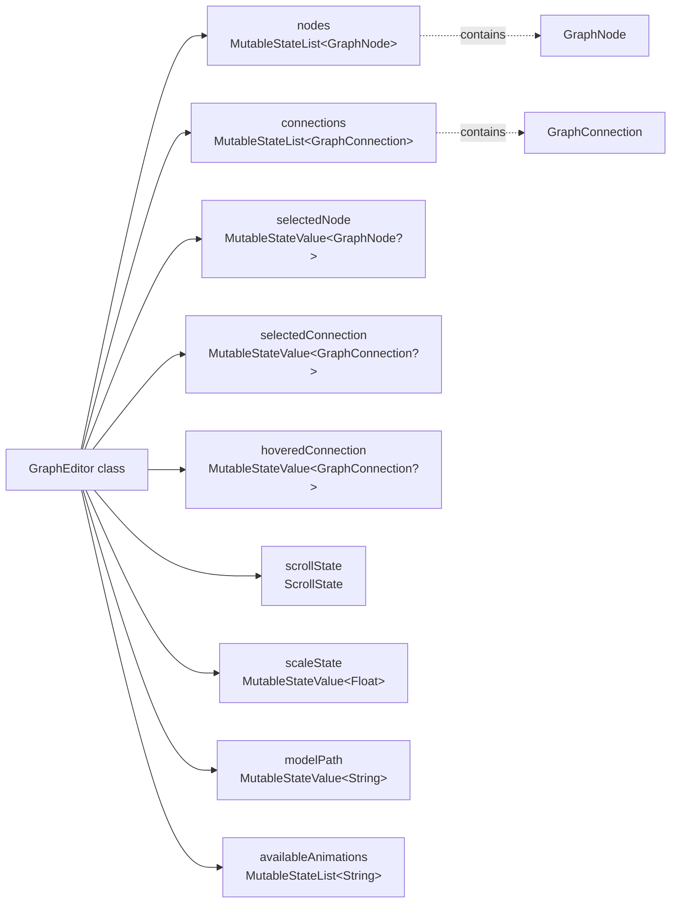

**Diagram: GraphEditor State Structure**

The `GraphEditor` class maintains several reactive state properties:

- **nodes**: `MutableStateList<GraphNode>` - Observable list of all nodes
- **connections**: `MutableStateList<GraphConnection>` - Observable list of all connections
- **selectedNode**: `MutableStateValue<GraphNode?>` - Currently selected node for property editing
- **selectedConnection**: `MutableStateValue<GraphConnection?>` - Currently selected connection for property editing
- **hoveredConnection**: `MutableStateValue<GraphConnection?>` - Connection under mouse cursor
- **scrollState**: `ScrollState` - Manages canvas scroll position
- **scaleState**: `MutableStateValue<Float>` - Zoom level (0.2x to 2.0x)
- **modelPath**: `MutableStateValue<String>` - Path to the 3D model for animation preview
- **availableAnimations**: `MutableStateList<String>` - List of animation names from the loaded model
- **dragNode**: `GraphNode?` - Node currently being dragged (private)
- **dragOffset**: `MutableVec2f` - Mouse offset during drag operation
- **lastMousePos**: `MutableVec2f` - Cached mouse position in local coordinates
- **scrollPaneNode**: `ScrollPaneNode?` - Reference to containing scroll pane for coordinate transforms

**Sources:**
- [src/main/java/ru/hollowhorizon/hollowengine/client/gui/animations/GraphEditor.kt:31-64]()

## Canvas Rendering System

The editor uses a layered rendering approach with the following components:

### Grid Background

The canvas features a dynamic grid that scales with zoom level:

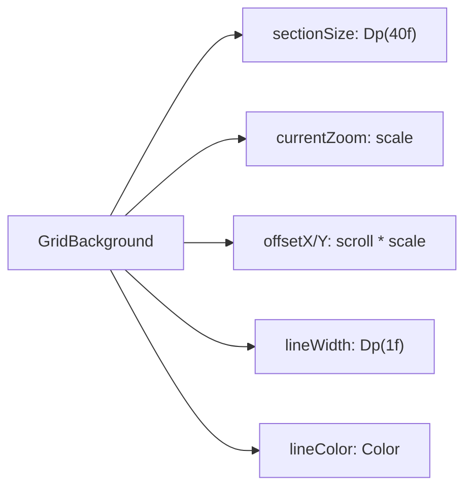

**Diagram: Grid Background Configuration**

The grid automatically adjusts cell size to maintain readability at different zoom levels by doubling or halving the effective cell size when threshold is crossed ([src/main/java/ru/hollowhorizon/hollowengine/client/gui/scripting/files/prefabs/GridBackground.kt:23-27]()).

**Sources:**
- [src/main/java/ru/hollowhorizon/hollowengine/client/gui/animations/GraphEditor.kt:68-83]()
- [src/main/java/ru/hollowhorizon/hollowengine/client/gui/scripting/files/prefabs/GridBackground.kt:9-52]()

### Node Rendering

Nodes are rendered using the `renderNode` function with the following visual elements:

1. **Background**: `RoundRectGradientBackground` mixing node color with background color
2. **Border**: `RoundRectBorder` that changes color based on selection/hover state
3. **Title**: Primary text label
4. **Badges**: Optional metadata displays (e.g., "0.0s", "Base")

The rendering logic measures the node's actual size dynamically and updates `widthState` and `heightState` to ensure accurate connection point calculations.

**Sources:**
- [src/main/java/ru/hollowhorizon/hollowengine/client/gui/animations/GraphEditor.kt:218-306]()

### Connection Rendering

Connections between nodes are rendered as dashed arrows with the following features:

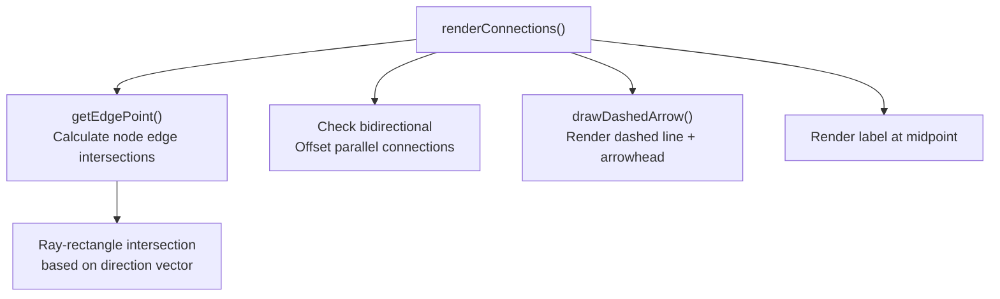

**Diagram: Connection Rendering Pipeline**

The `drawDashedArrow` function ([src/main/java/ru/hollowhorizon/hollowengine/client/gui/animations/GraphEditor.kt:732-797]()) implements:
- **Dashed line**: Drawn with alternating segments (10px dash, 5px gap)
- **Arrowhead**: Rendered as a 3-step circle with rotation based on direction
- **Label**: Centered text using `TextProps` with configurable font

**Connection visual states**:
- **Muted**: Gray color when `properties.mute` is true
- **Selected**: Bright orange (`ConnectionSelected`) with 3px line width
- **Hovered**: Light blue (`ConnectionHovered`) with 2.5px line width
- **From Selected Node**: White color when source node is selected
- **Default**: Node accent color with 0.4 alpha and 2px line width

**Bidirectional connection handling**: When two nodes have connections in both directions, the renderer offsets them perpendicular to the connection vector by 15px to prevent overlap ([src/main/java/ru/hollowhorizon/hollowengine/client/gui/animations/GraphEditor.kt:290-308]()).

**Sources:**
- [src/main/java/ru/hollowhorizon/hollowengine/client/gui/animations/GraphEditor.kt:257-341]()
- [src/main/java/ru/hollowhorizon/hollowengine/client/gui/animations/GraphEditor.kt:310-336]()
- [src/main/java/ru/hollowhorizon/hollowengine/client/gui/animations/GraphEditor.kt:732-797]()

## Interaction System

### Mouse Controls

| Action | Behavior |
|--------|----------|
| **Left Click** (on canvas) | Deselect current node/connection |
| **Left Click** (on node) | Select node, show properties |
| **Left Click** (on connection) | Select connection, show properties |
| **Right Click** (on canvas) | Open context menu to create nodes |
| **Left Drag** (on canvas) | Pan canvas (when not dragging a node) |
| **Right Drag** | Pan canvas |
| **Left Drag** (on node) | Move node position |
| **Mouse Hover** (on connection) | Highlight connection |
| **Mouse Wheel** | Scroll vertically (or horizontally with Shift) |
| **Ctrl + Mouse Wheel** | Zoom in/out (0.2x to 2.0x) |

**Sources:**
- [src/main/java/ru/hollowhorizon/hollowengine/client/gui/animations/GraphEditor.kt:133-147]()
- [src/main/java/ru/hollowhorizon/hollowengine/client/gui/animations/GraphEditor.kt:151-177]()
- [src/main/java/ru/hollowhorizon/hollowengine/client/gui/animations/GraphEditor.kt:179-184]()

### Context Menu

Right-clicking on empty canvas space opens the `ItemPopupMenu` with node creation options:

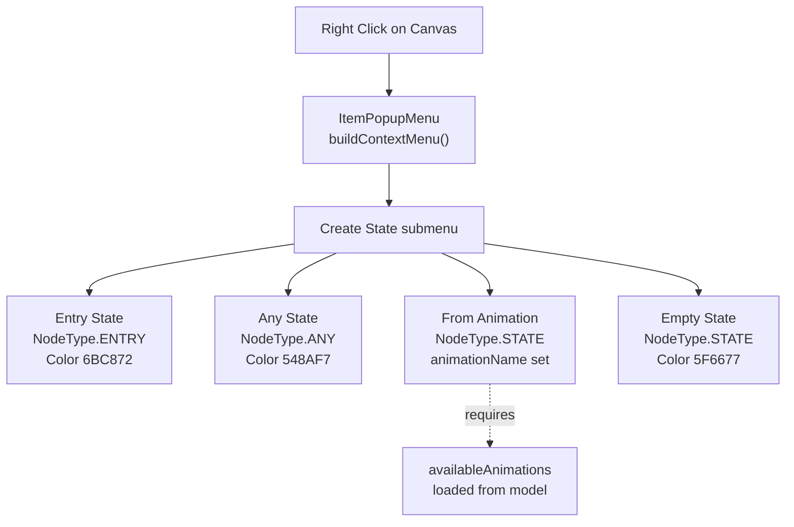

**Diagram: Context Menu Structure**

The `buildContextMenu()` function ([src/main/java/ru/hollowhorizon/hollowengine/client/gui/animations/GraphEditor.kt:226-314]()) creates a hierarchical menu with the following options:

1. **Entry State**: Creates an ENTRY node at cursor position with green color
2. **Any State**: Creates an ANY node at cursor position with blue color
3. **From Animation** (submenu): Lists all available animations from the loaded model, creating STATE nodes with pre-filled animation names
4. **Empty State**: Creates a blank STATE node with default gray color

When a menu item is selected:
- Mouse position is converted to logical coordinates (accounting for scroll and zoom)
- A new `GraphNode` is created with the appropriate `NodeType` and properties
- The node is added to `nodes` list and automatically selected
- The menu is hidden

**Sources:**
- [src/main/java/ru/hollowhorizon/hollowengine/client/gui/animations/GraphEditor.kt:149-177]()
- [src/main/java/ru/hollowhorizon/hollowengine/client/gui/animations/GraphEditor.kt:226-314]()

### Drag and Drop Implementation

The drag system uses a three-phase lifecycle:

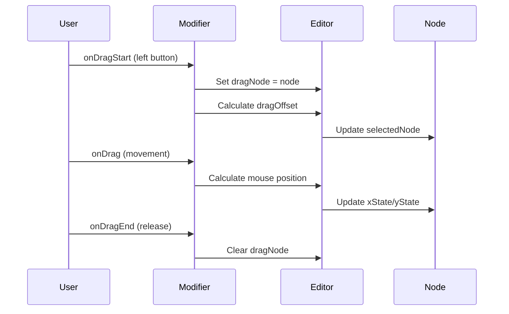

**Diagram: Node Drag Lifecycle**

The drag offset is calculated in local (logical) coordinates by dividing screen coordinates by the current scale factor, ensuring consistent behavior at all zoom levels ([src/main/java/ru/hollowhorizon/hollowengine/client/gui/animations/GraphEditor.kt:248-253]()).

**Sources:**
- [src/main/java/ru/hollowhorizon/hollowengine/client/gui/animations/GraphEditor.kt:244-269]()

## Navigation Components

### Zoom and Scale

The zoom system uses spring animation for smooth transitions:

- **Target Scale**: Stored in `scaleState` (1.0 = 100%)
- **Animated Scale**: Interpolated via `animateSpringFloatAsState`
- **Constraints**: Clamped to range [0.2, 2.0]
- **Application**: Multiplied with all position and size calculations

All UI elements (nodes, connections, text) scale proportionally with the zoom level by using `.scaled()` extension on `Dp` values ([src/main/java/ru/hollowhorizon/hollowengine/client/gui/animations/GraphEditor.kt:453]()).

**Sources:**
- [src/main/java/ru/hollowhorizon/hollowengine/client/gui/animations/GraphEditor.kt:25-26]()
- [src/main/java/ru/hollowhorizon/hollowengine/client/gui/animations/GraphEditor.kt:58-59]()
- [src/main/java/ru/hollowhorizon/hollowengine/client/gui/animations/GraphEditor.kt:85-96]()

### Mini-Map

The mini-map provides a bird's-eye view of the entire graph with viewport indicator:

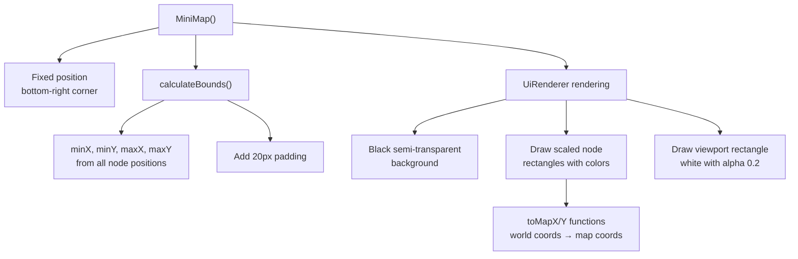

**Diagram: Mini-Map Rendering Pipeline**

The `MiniMap()` composable ([src/main/java/ru/hollowhorizon/hollowengine/client/gui/animations/GraphEditor.kt:998-1103]()) renders a 200×150 pixel overview:

**Positioning:**
- Fixed to bottom-right corner of canvas
- 16dp margin from edges
- Z-layer 1000 to appear above nodes

**Coordinate Transformation:**

The mini-map calculates world bounds from all nodes:
```kotlin
val minX = nodes.minOfOrNull { it.xState.value } ?: 0f
val maxX = nodes.maxOfOrNull { it.xState.value + it.widthState.value } ?: 0f
// Similar for Y coordinates
```

Then defines transformation functions:
- `toMapX()`: Maps world X coordinate to [0, mapWidth]
- `toMapY()`: Maps world Y coordinate to [0, mapHeight]

**Rendering Layers:**

1. **Background**: Black with alpha 0.7 (`Color.BLACK.withAlpha(0.7f)`)
2. **Node Rectangles**: Each node rendered as a filled rectangle using its `color` property
3. **Viewport Indicator**: Semi-transparent white rectangle showing current scroll position and viewport size

The viewport rectangle is calculated from:
- `scrollState.position()` for top-left corner
- `viewportWidth`/`viewportHeight` for dimensions
- Transformed to map coordinates via `toMapX()`/`toMapY()`

**Sources:**
- [src/main/java/ru/hollowhorizon/hollowengine/client/gui/animations/GraphEditor.kt:998-1103]()
- [src/main/java/ru/hollowhorizon/hollowengine/client/gui/animations/GraphEditor.kt:598]()

### Property Panel

The property panel displays editable properties for the selected node, connection, or controller. It adapts its layout based on the current selection using Kotlin's `when` expression.

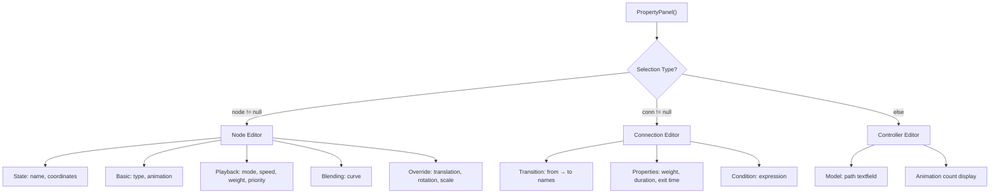

**Diagram: Property Panel Layout**

#### Node Properties

When a `GraphNode` is selected, the panel displays multiple sections:

**State Section:**
- **Name**: Editable text field for node title
- **Coordinates**: Read-only display of current position (integer values)

**Basic Section:**
- **Type**: Combo box selecting NodeType (ENTRY/ANY/STATE)
- **Animation**: Combo box listing available animations from model (only shown if animations exist)

**Playback Section:**
- **Mode**: Combo box for WrapMode (Once, Loop, PingPong, ClampForever)
- **Speed**: Float input for playback speed multiplier
- **Weight**: Float input for blend weight
- **Priority**: Integer input for transition priority

**Blending Section:**
- **Curve**: Combo box for Interpolation curves (QUINT_IN, LINEAR, etc.)

**Override Section:**
- **Translation**: Toggle for overriding translation transforms
- **Rotation**: Toggle for overriding rotation transforms
- **Scale**: Toggle for overriding scale transforms

#### Connection Properties

When a `GraphConnection` is selected:

**Transition Section:**
- **From → To**: Read-only display of source and target node names
- **Name**: Editable label for the connection

**Transition Properties:**
- **Weight**: Float input for transition weight
- **Duration**: Float input for blend duration in seconds
- **Exit Time**: Float input for optional state exit timing

**Condition Section:**
- **Condition**: Text field for conditional expression (e.g., `entity.isMoving`)

#### Controller Properties

When nothing is selected:

- **Model**: Text field for model resource path
- **Animation Count**: Read-only display of available animations

All property editors use `PropertyTextField`, `PropertyFloatField`, `PropertyIntField`, `PropertyComboBox`, and `ToggleRow` components for consistent styling.

**Sources:**
- [src/main/java/ru/hollowhorizon/hollowengine/client/gui/animations/GraphEditor.kt:619-850]()
- [src/main/java/ru/hollowhorizon/hollowengine/client/gui/animations/GraphEditor.kt:852-870]()
- [src/main/java/ru/hollowhorizon/hollowengine/client/gui/animations/GraphEditor.kt:872-996]()

## Default Configuration

The Graph Editor initializes with a sample animation state machine demonstrating typical usage:

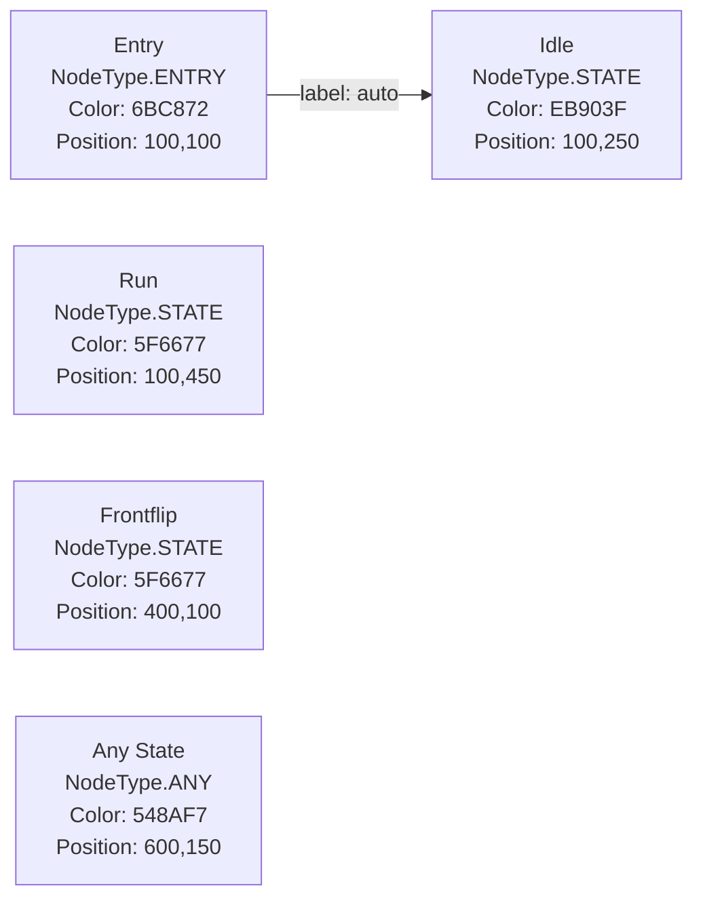

**Diagram: Default Graph Configuration**

The initialization code ([src/main/java/ru/hollowhorizon/hollowengine/client/gui/animations/GraphEditor.kt:67-104]()) creates five nodes:

1. **Entry** (green, type=ENTRY): Entry point at (100, 100)
2. **Idle** (orange, type=STATE): Default idle state at (100, 250)
3. **Run** (gray, type=STATE): Running state at (100, 450)
4. **Frontflip** (gray, type=STATE): Special action at (400, 100)
5. **Any State** (blue, type=ANY): Global transition source at (600, 150)

One initial connection is created from Entry → Idle with label "auto", demonstrating the entry transition pattern.

These nodes serve as a template showing:
- How ENTRY nodes connect to initial states
- Color coding for different node types
- Spatial layout with vertical spacing for related states
- ANY state positioned separately from the main flow

**Sources:**
- [src/main/java/ru/hollowhorizon/hollowengine/client/gui/animations/GraphEditor.kt:67-104]()

## IDE Integration

The Graph Editor integrates with HollowEngine's IDE through the `GraphEditorPanel`:

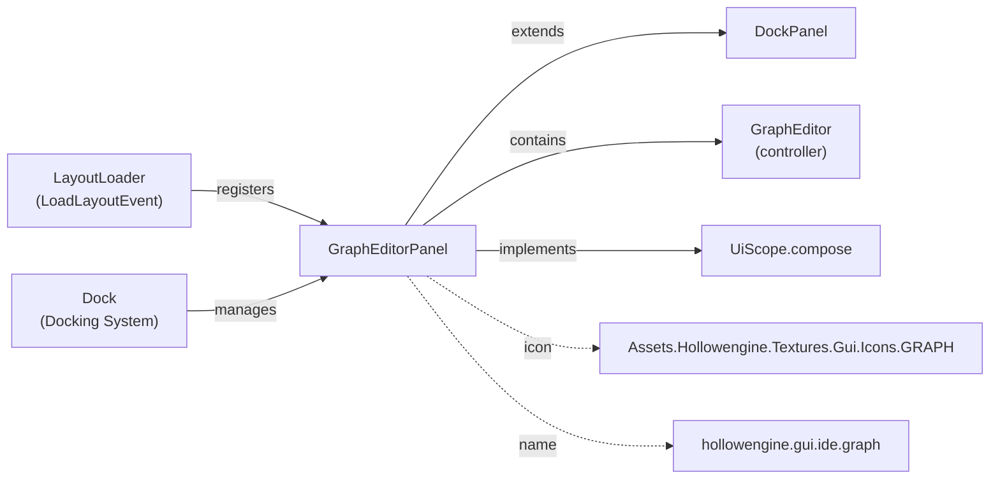

**Diagram: IDE Panel Integration**

The `GraphEditorPanel` ([src/main/java/ru/hollowhorizon/hollowengine/client/gui/scripting/panels/GraphEditorPanel.kt:8-16]()):
- Extends `DockPanel` for docking system compatibility
- Holds a single `GraphEditor` instance
- Implements `compose()` to render the editor layout
- Uses localized name key `"hollowengine.gui.ide.graph"`
- Displays graph icon in panel tab

**Sources:**
- [src/main/java/ru/hollowhorizon/hollowengine/client/gui/scripting/panels/GraphEditorPanel.kt:1-16]()

## Visual Styling

The Graph Editor uses HollowEngine's theming system for consistent appearance:

| Element | Styling |
|---------|---------|
| **Background** | `Color("1E1F22")` - Dark gray base |
| **Grid Lines** | `Color("2A2E35")` - Subtle gray |
| **Node Background** | Gradient from node color + secondary to pure secondary |
| **Node Border** | Node color (normal), white (selected), light gray (hover) |
| **Connection** | Main accent with 0.4 alpha (highlighted white when source is selected) |
| **Mini-Map** | Background elements with accent border |
| **Property Panel** | Background secondary with padding |

All dimensions scale with the current zoom level using the `.scaled()` extension function on `Dp` values.

**Sources:**
- [src/main/java/ru/hollowhorizon/hollowengine/client/gui/animations/GraphEditor.kt:68-83]()
- [src/main/java/ru/hollowhorizon/hollowengine/client/gui/animations/GraphEditor.kt:271-294]()