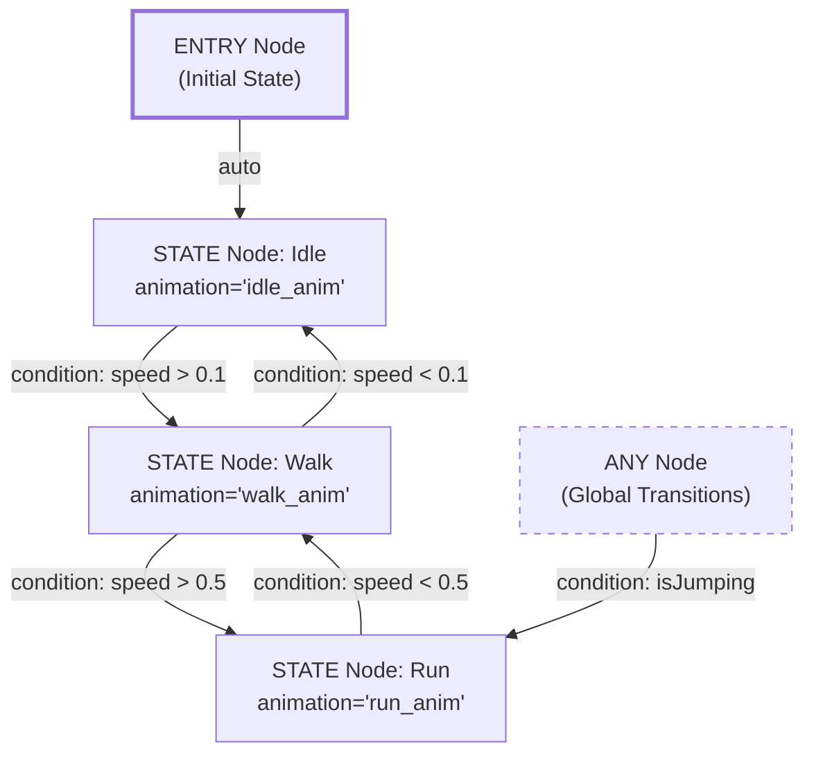
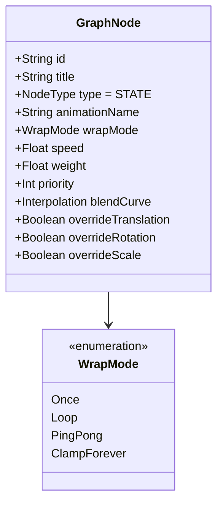
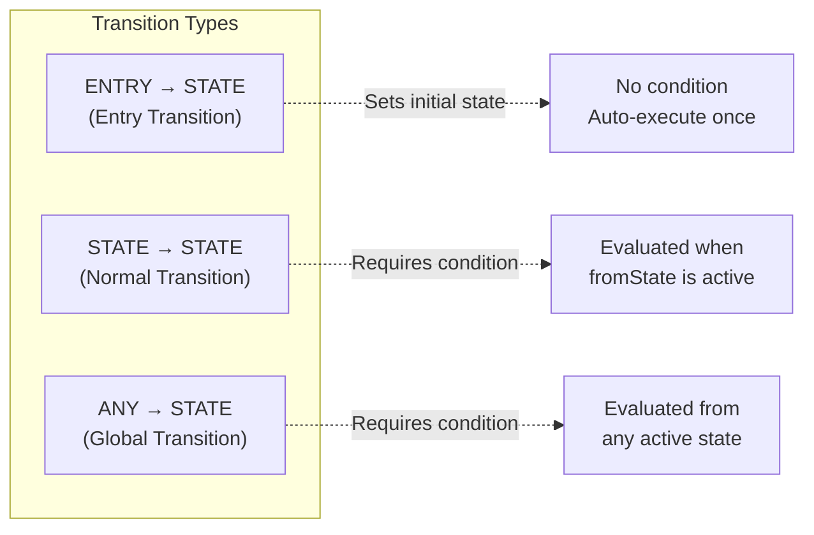
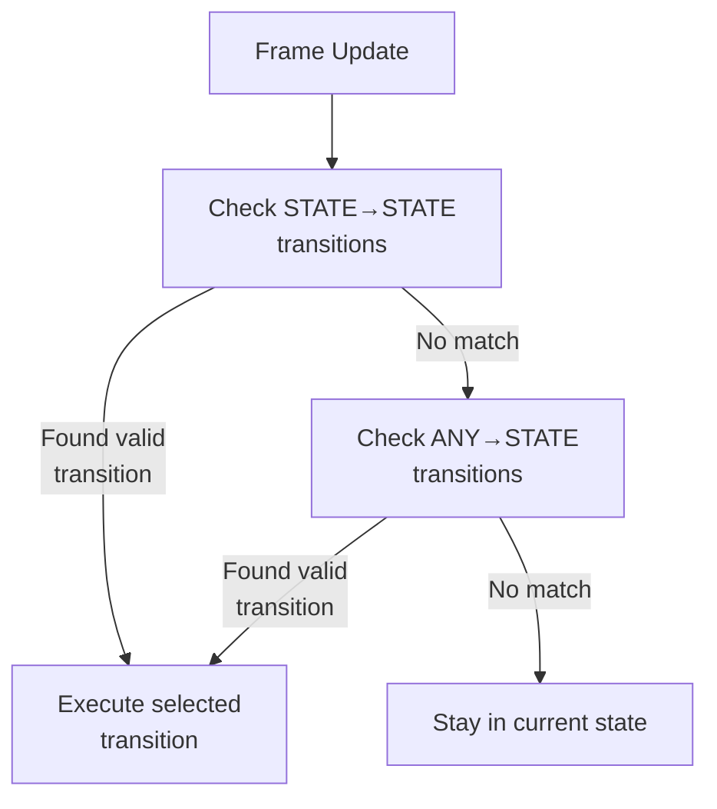
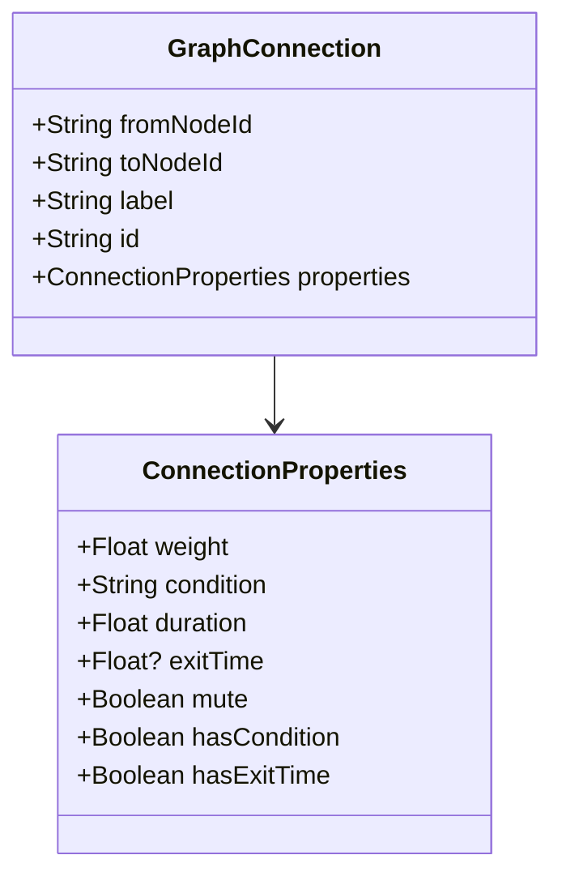
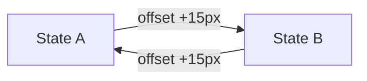
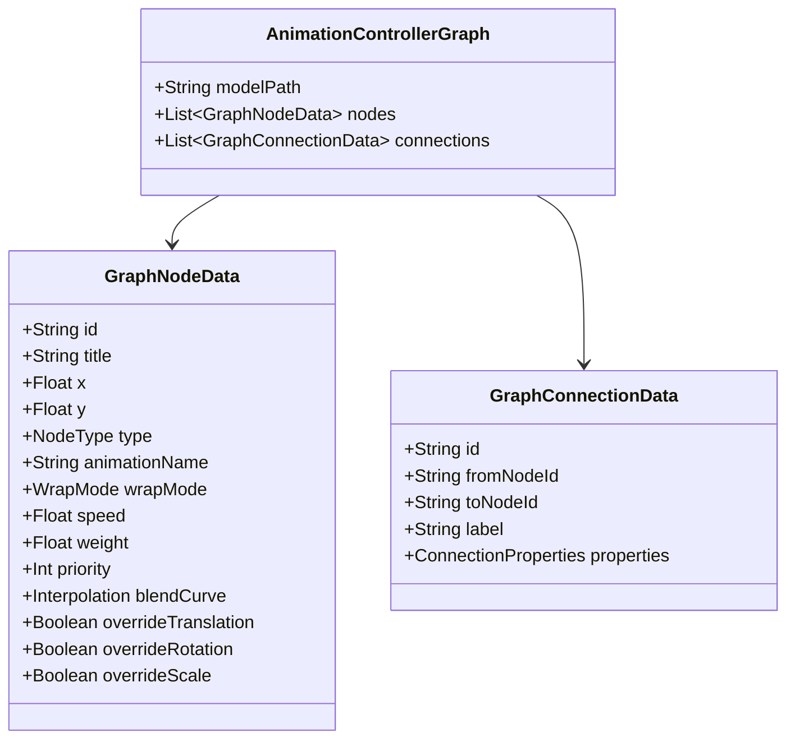
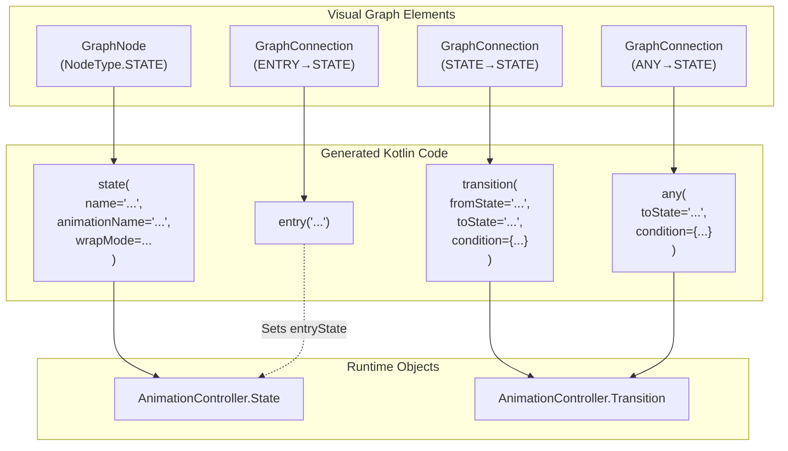

# State Machine Design

<details>
<summary>Relevant source files</summary>

The following files were used as context for generating this wiki page:

- [src/main/java/ru/hollowhorizon/hollowengine/client/gui/animations/Graph.kt](src/main/java/ru/hollowhorizon/hollowengine/client/gui/animations/Graph.kt)
- [src/main/java/ru/hollowhorizon/hollowengine/client/gui/animations/GraphEditor.kt](src/main/java/ru/hollowhorizon/hollowengine/client/gui/animations/GraphEditor.kt)
- [src/main/java/ru/hollowhorizon/hollowengine/client/gui/colors/ColorTheme.kt](src/main/java/ru/hollowhorizon/hollowengine/client/gui/colors/ColorTheme.kt)
- [src/main/java/ru/hollowhorizon/hollowengine/client/gui/scripting/files/animations/AnimationControllerFile.kt](src/main/java/ru/hollowhorizon/hollowengine/client/gui/scripting/files/animations/AnimationControllerFile.kt)
- [src/main/java/ru/hollowhorizon/hollowengine/client/gui/scripting/titlebar/ComboBox.kt](src/main/java/ru/hollowhorizon/hollowengine/client/gui/scripting/titlebar/ComboBox.kt)
- [src/main/java/ru/hollowhorizon/hollowengine/client/models/internal/controller/AnimControllerDSL.kt](src/main/java/ru/hollowhorizon/hollowengine/client/models/internal/controller/AnimControllerDSL.kt)
- [src/main/java/ru/hollowhorizon/hollowengine/client/models/internal/controller/AnimationController.kt](src/main/java/ru/hollowhorizon/hollowengine/client/models/internal/controller/AnimationController.kt)
- [src/main/java/ru/hollowhorizon/hollowengine/client/models/internal/controller/AnimationDispatcher.kt](src/main/java/ru/hollowhorizon/hollowengine/client/models/internal/controller/AnimationDispatcher.kt)
- [src/main/java/ru/hollowhorizon/hollowengine/client/models/internal/controller/EntityUtils.kt](src/main/java/ru/hollowhorizon/hollowengine/client/models/internal/controller/EntityUtils.kt)
- [src/main/java/ru/hollowhorizon/hollowengine/common/scripting/CompilerLoader.kt](src/main/java/ru/hollowhorizon/hollowengine/common/scripting/CompilerLoader.kt)

</details>


## Purpose and Scope

This document describes the conceptual design and implementation of animation state machines in HollowEngine. A state machine defines which animations play on a 3D model and how the system transitions between them based on runtime conditions. The visual graph editor creates state machines as directed graphs with nodes (animation states) and edges (transitions). This page focuses on the **structural semantics** of state machines—what nodes and connections mean, how they are organized, and how they map to runtime behavior.

For information about the visual graph editor UI and user interaction, see [Graph Editor](#8.2). For details on how graphs generate executable Kotlin code, see [Code Generation](#8.4). For runtime execution and animation blending, see [Runtime Execution](#8.6).

**Sources:** [src/main/java/ru/hollowhorizon/hollowengine/client/gui/animations/Graph.kt:1-103](), [src/main/java/ru/hollowhorizon/hollowengine/client/gui/animations/GraphEditor.kt:1-30]()

---

## State Machine Conceptual Model

An animation state machine is a finite state automaton that controls which animation plays at any given time. The machine consists of:

- **States**: Represent individual animations or animation clips
- **Transitions**: Directed edges between states with conditions that determine when to switch
- **Entry Point**: The initial state when the controller starts
- **Global Transitions**: Transitions that can trigger from any state



**Key Properties:**
- Only one state is active at any time (the "current state")
- Transitions are evaluated each frame in priority order
- When a transition's condition becomes true, the machine begins blending from the current animation to the target animation
- The graph structure determines control flow, while connection properties control blend timing and appearance

**Sources:** [src/main/java/ru/hollowhorizon/hollowengine/client/gui/animations/Graph.kt:11-40](), [src/main/java/ru/hollowhorizon/hollowengine/client/models/internal/controller/AnimationController.kt:1-37]()

---

## Node Types and Semantics

HollowEngine defines three distinct node types, each with specific semantics in the state machine:

### Node Type Enumeration

| Node Type | Purpose | Multiple Allowed | Outgoing Transitions | Incoming Transitions |
|-----------|---------|------------------|---------------------|---------------------|
| `STATE` | Plays a specific animation | Yes | Yes | Yes |
| `ENTRY` | Marks the initial state | Multiple (first is used) | Yes | No |
| `ANY` | Defines global transitions | Multiple | Yes | No |

**Sources:** [src/main/java/ru/hollowhorizon/hollowengine/client/gui/animations/Graph.kt:11-15]()

### STATE Nodes

STATE nodes represent individual animation clips. Each STATE node contains:



**Property Descriptions:**
- `title`: Display name shown in the graph editor
- `animationName`: Name of the animation clip in the model file (e.g., "walk", "idle")
- `wrapMode`: How the animation loops (see [Animation Integration](#9.5))
- `speed`: Playback speed multiplier (1.0 = normal speed)
- `weight`: Blend weight when this animation is active (0.0-1.0)
- `priority`: Higher priority animations override lower priority ones when blending
- `blendCurve`: Interpolation curve for smooth transitions (LINEAR, EASE_IN, EASE_OUT, etc.)
- `override*`: Whether this animation overrides translation/rotation/scale channels

**Sources:** [src/main/java/ru/hollowhorizon/hollowengine/client/gui/animations/Graph.kt:17-40]()

### ENTRY Nodes

ENTRY nodes mark the initial state of the state machine. When the animation controller first initializes, it follows the outgoing transition from the ENTRY node to determine which STATE to play first.

**Semantics:**
- ENTRY nodes do not play animations themselves
- They serve as a visual marker for the entry point
- Only the **first** outgoing connection from an ENTRY node is used
- Multiple ENTRY nodes can exist (for organizational purposes), but only one entry transition is active

**Code Generation:**
The connection from `ENTRY → StateX` generates an `entry("StateX")` call in the Kotlin script.

**Sources:** [src/main/java/ru/hollowhorizon/hollowengine/client/gui/scripting/files/animations/AnimationControllerFile.kt:125-139]()

### ANY Nodes

ANY nodes define **global transitions** that can trigger from any current state. This is useful for interrupt animations like "hit reaction" or "jump" that should be reachable regardless of the current state.

**Semantics:**
- ANY → StateX means "from any state, transition to StateX if condition is true"
- ANY transitions are evaluated after normal state-to-state transitions
- Multiple ANY nodes can exist for organizational purposes (all ANY transitions are merged at runtime)
- ANY transitions cannot target the current state (they are automatically filtered out to prevent self-loops)

**Code Generation:**
Connections from `ANY → StateX` generate `any(toState = "StateX", condition = { ... })` calls.

**Sources:** [src/main/java/ru/hollowhorizon/hollowengine/client/gui/scripting/files/animations/AnimationControllerFile.kt:143-160](), [src/main/java/ru/hollowhorizon/hollowengine/client/models/internal/controller/AnimationController.kt:101-114]()

---

## Transition System

Transitions are directed edges between nodes that define when and how the state machine switches from one animation to another.

### Transition Types by Source/Target



**Sources:** [src/main/java/ru/hollowhorizon/hollowengine/client/gui/scripting/files/animations/AnimationControllerFile.kt:125-185]()

### Transition Evaluation Priority

When multiple transitions are valid (conditions are all true), the system selects one based on:

1. **Declaration order**: Transitions are evaluated in the order they appear in the graph
2. **Type precedence**: State-specific transitions (STATE → STATE) are checked before global transitions (ANY → STATE)
3. **First-match wins**: The first transition whose condition evaluates to `true` is selected



**Implementation Note:** The actual runtime uses priority sorting and insertion order tracking to ensure deterministic selection. See [src/main/java/ru/hollowhorizon/hollowengine/client/models/internal/controller/AnimationController.kt:177-195]() for the `selectTransition` implementation.

**Sources:** [src/main/java/ru/hollowhorizon/hollowengine/client/models/internal/controller/AnimationController.kt:28-37](), [src/main/java/ru/hollowhorizon/hollowengine/client/models/internal/controller/AnimationController.kt:177-195]()

---

## Connection Properties

Each transition (graph edge) has associated properties that control its behavior:



### Property Definitions

| Property | Type | Default | Description |
|----------|------|---------|-------------|
| `weight` | Float | 1.0 | Blend weight during transition (0.0-1.0) |
| `condition` | String | "" | Kotlin boolean expression evaluated each frame |
| `duration` | Float | 0.25 | Transition duration in seconds |
| `exitTime` | Float? | null | Time offset within source animation before transition can occur |
| `mute` | Boolean | false | If true, transition is disabled and excluded from code generation |

**Sources:** [src/main/java/ru/hollowhorizon/hollowengine/client/gui/animations/Graph.kt:42-58]()

### Condition Expressions

The `condition` field contains a Kotlin boolean expression that is compiled into the generated script. The expression has access to the `LivingEntity` context:

**Example Conditions:**
```kotlin
// Simple property checks
speed > 0.1

// Multiple conditions
speed > 0.5 && !isInWater

// Method calls
hasEffect(MobEffects.MOVEMENT_SPEED)

// Custom entity properties (via EntityScope)
getProperty("is_attacking") == true
```

When the condition string is blank, it defaults to `true` (always transition).

**Sources:** [src/main/java/ru/hollowhorizon/hollowengine/client/gui/scripting/files/animations/AnimationControllerFile.kt:151-176]()

### Exit Time Semantics

`exitTime` controls when a transition can occur relative to the source animation's timeline:

| Exit Time Value | Behavior |
|-----------------|----------|
| `null` | No exit time check; transition can occur immediately when condition is true |
| `> 0.0` | Transition can only occur after the source animation has played for this many seconds |
| Negative (e.g., `-1.0`) | Transition can only occur after the source animation has fully completed |

This is particularly useful for `WrapMode.Once` animations where you want to ensure the animation completes before transitioning.

**Sources:** [src/main/java/ru/hollowhorizon/hollowengine/client/gui/scripting/files/animations/AnimationControllerFile.kt:815-819]()

### Muted Transitions

Muted transitions appear in the graph with a distinct visual style (gray color) but are **excluded from code generation**. This allows designers to temporarily disable transitions without deleting them.

**Visual Feedback:**
- Muted connections render with `ColorTheme.GraphColors.ConnectionMuted` color
- They remain visible in the graph for reference
- The generated Kotlin script filters them out using `!conn.properties.mute`

**Sources:** [src/main/java/ru/hollowhorizon/hollowengine/client/gui/animations/GraphEditor.kt:464-470](), [src/main/java/ru/hollowhorizon/hollowengine/client/gui/scripting/files/animations/AnimationControllerFile.kt:131-132]()

---

## Graph Structure and Constraints

### Valid Graph Requirements

A well-formed animation controller graph must satisfy:

1. **At least one STATE node** exists
2. **At most one active ENTRY transition** (from ENTRY → STATE)
3. **No self-loops via ANY nodes** (ANY → current state is filtered at runtime)
4. **All connections reference valid node IDs** (enforced by serialization)

**Validation is implicit**: The system does not reject invalid graphs but may produce unexpected runtime behavior:
- Graphs with no ENTRY use the first STATE node as the default initial state
- Disconnected subgraphs are unreachable from the entry point
- Circular dependencies in conditions may cause oscillation between states

**Sources:** [src/main/java/ru/hollowhorizon/hollowengine/client/models/internal/controller/AnimationController.kt:147-152]()

### Bidirectional Connections

The graph editor detects **bidirectional connections** (StateA → StateB and StateB → StateA) and renders them with a visual offset to prevent overlap:



This is purely a rendering concern and does not affect runtime semantics—each transition is evaluated independently.

**Sources:** [src/main/java/ru/hollowhorizon/hollowengine/client/gui/animations/GraphEditor.kt:348-366]()

### Graph Serialization Format

Graphs are serialized to JSON using the `AnimationControllerGraph` data class:



The serialized format separates visual state (node positions, colors) from semantic state (animation names, conditions). This enables:
- Version control friendly diffs (JSON text format)
- Programmatic graph manipulation
- Conversion to executable Kotlin scripts

**Sources:** [src/main/java/ru/hollowhorizon/hollowengine/client/gui/animations/Graph.kt:69-103]()

---

## Runtime Behavior Mapping

### Graph to Runtime Object Translation

The visual graph maps to runtime objects as follows:



### State Machine Execution Model

At runtime, the `AnimationController.update()` method is called each frame with the entity and delta time:

1. **Initialization** (first frame only):
   - Set `currentState` to the entry state (or first state if no entry)
   - Mark machine as initialized

2. **Transition Selection**:
   - Call `selectTransition(entity, currentState.name)`
   - Returns the first valid `Transition` or `null`

3. **Transition Execution**:
   - If a transition is selected:
     - Call `currentState.onExit` (if defined)
     - Call `system.transition(from, to, duration)` to start animation blending
     - Update `currentState` to the target state
     - Call `targetState.onEnter` (if defined)
   - If no transition:
     - Call `currentState.onUpdate(entity, dt)` (if defined)

**Sources:** [src/main/java/ru/hollowhorizon/hollowengine/client/models/internal/controller/AnimationController.kt:147-175]()

### Multi-State Blending

The current implementation supports **binary state blending**: transitioning from one state to another over a duration. Advanced blending (multiple simultaneous animations) is handled by the older `AnimControllerDSL` system in [src/main/java/ru/hollowhorizon/hollowengine/client/models/internal/controller/AnimControllerDSL.kt]() but is not yet integrated with the visual graph editor.

**Future Integration**: The `weight` and `priority` properties on nodes are designed to support multi-layer blending but are currently informational only in the generated code.

**Sources:** [src/main/java/ru/hollowhorizon/hollowengine/client/models/internal/controller/AnimationController.kt:13-26]()

---

## Design Patterns and Best Practices

### Recommended Graph Structures

**Simple Linear State Machine:**
```
ENTRY → Idle → Walk → Run
         ↑      ↓      ↓
         └──────┴──────┘
```
All states can return to Idle. Good for basic locomotion.

**Hub-and-Spoke Pattern:**
```
        ANY (Jump)
         ↓
    ┌────┴────┐
ENTRY → Idle  Jump
    ↓    ↑
    Walk ┘
    ↓
    Run
```
ANY node provides global interrupt. All states can return to Idle.

**Priority Chain:**
```
ENTRY → Idle → Walk → Run → Sprint
```
Higher speed thresholds create a priority chain. Use `exitTime` to prevent flickering between adjacent states.

### Common Pitfalls

1. **Oscillation**: Bidirectional transitions with similar thresholds (e.g., `speed > 0.5` and `speed < 0.51`) cause rapid state switching. Use hysteresis (different thresholds) or exit times.

2. **Unreachable States**: States with no incoming edges (except ENTRY) are unreachable. The editor does not validate graph connectivity.

3. **Condition Compilation Errors**: Invalid Kotlin syntax in conditions causes script compilation failure. The error is reported in the console but not in the graph editor.

4. **Missing Animations**: Referencing non-existent animation names causes runtime warnings. The available animations list is populated from the selected model.

**Sources:** [src/main/java/ru/hollowhorizon/hollowengine/client/gui/scripting/files/animations/AnimationControllerFile.kt:48-60]()