# Code Generation

<details>
<summary>Relevant source files</summary>

The following files were used as context for generating this wiki page:

- [src/main/java/ru/hollowhorizon/hollowengine/client/gui/animations/Graph.kt](src/main/java/ru/hollowhorizon/hollowengine/client/gui/animations/Graph.kt)
- [src/main/java/ru/hollowhorizon/hollowengine/client/gui/animations/GraphEditor.kt](src/main/java/ru/hollowhorizon/hollowengine/client/gui/animations/GraphEditor.kt)
- [src/main/java/ru/hollowhorizon/hollowengine/client/gui/colors/ColorTheme.kt](src/main/java/ru/hollowhorizon/hollowengine/client/gui/colors/ColorTheme.kt)
- [src/main/java/ru/hollowhorizon/hollowengine/client/gui/scripting/files/animations/AnimationControllerFile.kt](src/main/java/ru/hollowhorizon/hollowengine/client/gui/scripting/files/animations/AnimationControllerFile.kt)
- [src/main/java/ru/hollowhorizon/hollowengine/client/gui/scripting/titlebar/ComboBox.kt](src/main/java/ru/hollowhorizon/hollowengine/client/gui/scripting/titlebar/ComboBox.kt)
- [src/main/java/ru/hollowhorizon/hollowengine/client/models/internal/controller/AnimControllerDSL.kt](src/main/java/ru/hollowhorizon/hollowengine/client/models/internal/controller/AnimControllerDSL.kt)
- [src/main/java/ru/hollowhorizon/hollowengine/client/models/internal/controller/AnimationController.kt](src/main/java/ru/hollowhorizon/hollowengine/client/models/internal/controller/AnimationController.kt)
- [src/main/java/ru/hollowhorizon/hollowengine/client/models/internal/controller/AnimationDispatcher.kt](src/main/java/ru/hollowhorizon/hollowengine/client/models/internal/controller/AnimationDispatcher.kt)
- [src/main/java/ru/hollowhorizon/hollowengine/client/models/internal/controller/EntityUtils.kt](src/main/java/ru/hollowhorizon/hollowengine/client/models/internal/controller/EntityUtils.kt)
- [src/main/java/ru/hollowhorizon/hollowengine/common/scripting/CompilerLoader.kt](src/main/java/ru/hollowhorizon/hollowengine/common/scripting/CompilerLoader.kt)

</details>


The **Code Generation** system transforms visual animation state machine graphs into executable Kotlin script files. When a user saves an animation controller graph in the visual editor, the system automatically generates a corresponding `.animation-controller.kts` file containing DSL code that can be compiled and executed at runtime. This provides a bridge between the high-level visual authoring interface and the low-level animation runtime.

For information about creating graphs in the visual editor, see [Graph Editor](#8.2). For details on the DSL syntax used in generated code, see [Animation Controller DSL](#8.5). For runtime execution behavior, see [Runtime Execution](#8.6).

---

## Code Generation Pipeline

The code generation process occurs automatically when an animation controller file is saved, converting the visual graph representation into both a serialized JSON format (for editing) and a Kotlin script format (for execution).

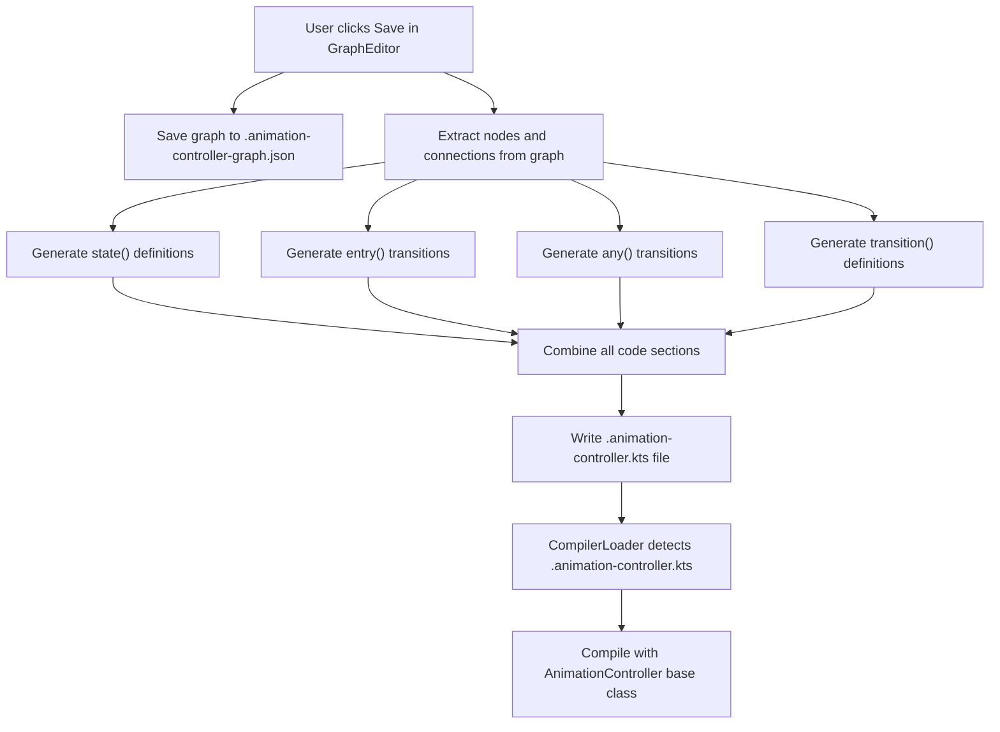

**Code Generation Flow**

Sources: [src/main/java/ru/hollowhorizon/hollowengine/client/gui/scripting/files/animations/AnimationControllerFile.kt:62-81]()

---

## Save Mechanism

The `AnimationControllerFile` class handles the dual serialization process. When `save()` is called, it performs two operations:

1. **JSON Serialization**: Converts the graph to `AnimationControllerGraph` and writes to disk
2. **Code Generation**: Calls `generateControllerClass()` to create the `.kts` file

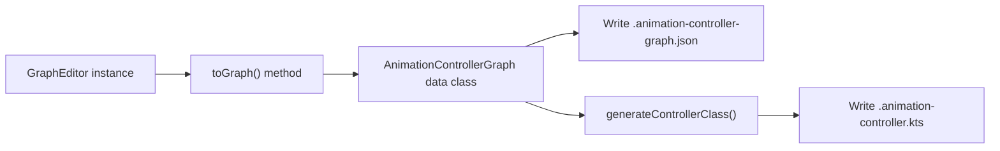

**Dual Serialization Architecture**

The `save()` method in `AnimationControllerFile`:

| Step | Action | Output File |
|------|--------|-------------|
| 1 | Call `editor.toGraph()` | In-memory `AnimationControllerGraph` |
| 2 | Serialize with `JsonFormat` | `.animation-controller-graph.json` |
| 3 | Call `generateControllerClass(graph)` | `.animation-controller.kts` |

Sources: [src/main/java/ru/hollowhorizon/hollowengine/client/gui/scripting/files/animations/AnimationControllerFile.kt:62-81]()

---

## Graph Data Structure

Before code generation, the visual graph is converted to a serializable data structure. The `AnimationControllerGraph` contains all necessary information to reconstruct both the visual graph and generate executable code.

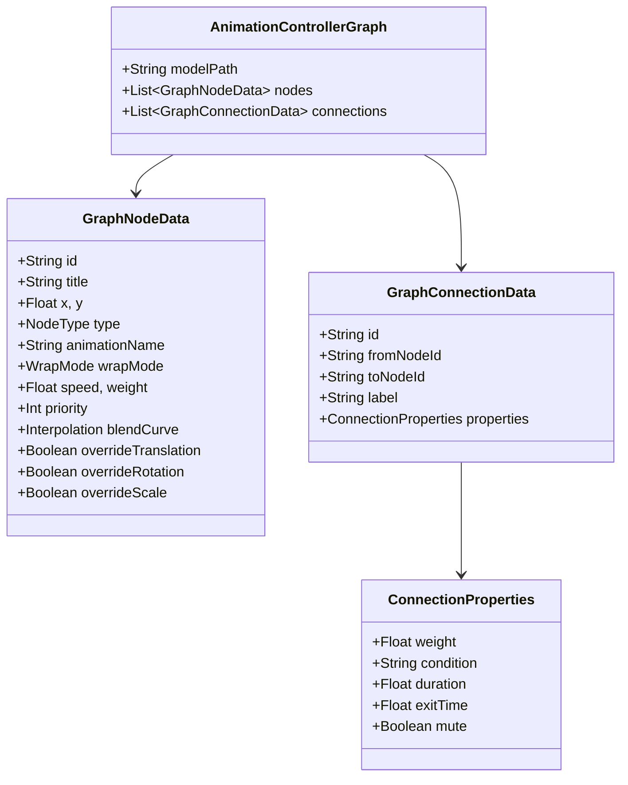

**Serialized Graph Data Classes**

Sources: [src/main/java/ru/hollowhorizon/hollowengine/client/gui/animations/Graph.kt:69-102]()

---

## Code Generation Process

The `generateControllerClass()` method orchestrates the entire code generation process by building different sections of the Kotlin script file.

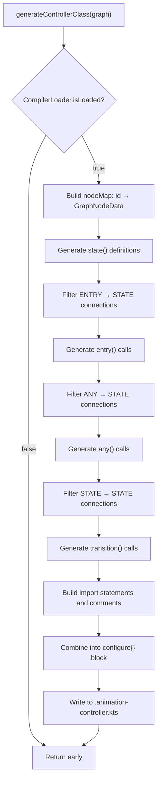

**Code Generation Orchestration**

Sources: [src/main/java/ru/hollowhorizon/hollowengine/client/gui/scripting/files/animations/AnimationControllerFile.kt:83-241]()

---

## State Definition Generation

State nodes are transformed into `state()` function calls with all their properties. Only nodes with `type == NodeType.STATE` are processed.

**Generation Logic**:

```mermaid
flowchart LR
    NodeList["graph.nodes"]
    Filter["Filter type == STATE"]
    ForEach["For each state node"]
    BuildName["Determine state name"]
    BuildAnim["Get animationName"]
    MapWrap["Map WrapMode enum"]
    BuildProps["Format all properties"]
    AppendCall["Append state() call"]
    
    NodeList --> Filter
    Filter --> ForEach
    ForEach --> BuildName
    BuildName --> BuildAnim
    BuildAnim --> MapWrap
    MapWrap --> BuildProps
    BuildProps --> AppendCall
```

**State Code Generation Flow**

Generated code format for a state:

```kotlin
state(
    name = "Idle",
    animationName = "idle",
    wrapMode = WrapMode.Loop,
    speed = 1.0f,
    weight = 1.0f,
    priority = 0,
    overrideTranslation = false,
    overrideRotation = false,
    overrideScale = false
)
```

The code generation logic maps `WrapMode` enum values to their qualified names and formats all numeric properties with `f` suffixes for floats.

| Node Property | DSL Parameter | Type | Default |
|---------------|---------------|------|---------|
| `title` | `name` | String | state_{id} |
| `animationName` | `animationName` | String | "idle" |
| `wrapMode` | `wrapMode` | WrapMode | Loop |
| `speed` | `speed` | Float | 1.0f |
| `weight` | `weight` | Float | 1.0f |
| `priority` | `priority` | Int | 0 |
| `overrideTranslation` | `overrideTranslation` | Boolean | false |
| `overrideRotation` | `overrideRotation` | Boolean | false |
| `overrideScale` | `overrideScale` | Boolean | false |

Sources: [src/main/java/ru/hollowhorizon/hollowengine/client/gui/scripting/files/animations/AnimationControllerFile.kt:99-123]()

---

## Entry Transition Generation

Entry connections define the initial state of the animation controller. Connections from `ENTRY` nodes to `STATE` nodes are transformed into `entry()` calls.

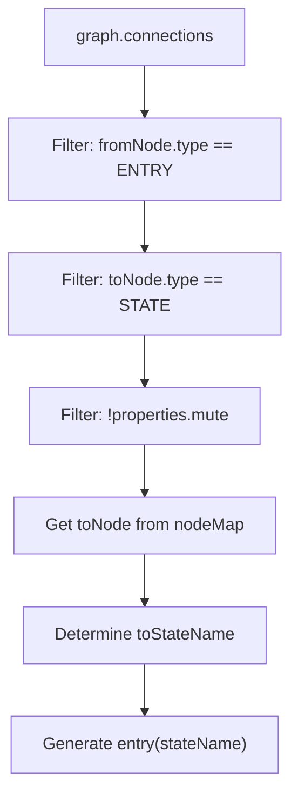

**Entry Transition Filtering**

Generated code:
```kotlin
entry("Idle")
```

The `entry()` function takes only the target state name. This sets the initial state when the animation controller starts.

Sources: [src/main/java/ru/hollowhorizon/hollowengine/client/gui/scripting/files/animations/AnimationControllerFile.kt:127-139]()

---

## Any-State Transition Generation

Transitions from `ANY` nodes can fire from any current state (except the target state itself). These are transformed into `any()` function calls with conditions.

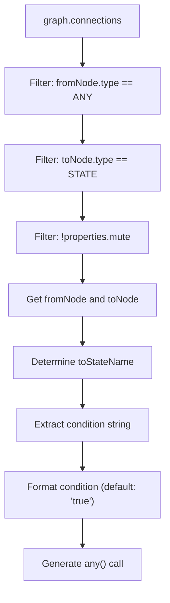

**Any-State Transition Generation**

Generated code format:
```kotlin
any(
    toState = "Run",
    duration = 0.25f,
    condition = { entity.isMoving },
)
```

The condition is extracted from `conn.properties.condition`. If blank, defaults to `"true"`. The condition string is inserted directly into a lambda body.

Sources: [src/main/java/ru/hollowhorizon/hollowengine/client/gui/scripting/files/animations/AnimationControllerFile.kt:143-160]()

---

## State-to-State Transition Generation

Standard transitions between specific states are the most common type. These become `transition()` calls with explicit from and to states.

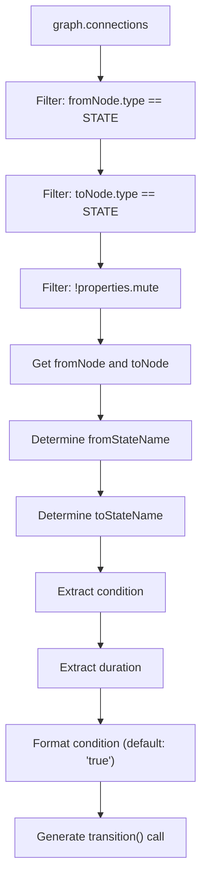

**State Transition Generation**

Generated code format:
```kotlin
transition(
    fromState = "Idle",
    toState = "Run",
    duration = 0.25f,
    condition = { entity.speed > 0.1f },
)
```

| Connection Property | DSL Parameter | Purpose |
|---------------------|---------------|---------|
| `fromNodeId` | `fromState` | Source state name |
| `toNodeId` | `toState` | Target state name |
| `properties.duration` | `duration` | Blend time in seconds |
| `properties.condition` | `condition` | Lambda expression returning Boolean |

Sources: [src/main/java/ru/hollowhorizon/hollowengine/client/gui/scripting/files/animations/AnimationControllerFile.kt:164-185]()

---

## Muted Connection Handling

Connections marked as muted (`properties.mute == true`) are excluded from code generation but counted in the statistics comment. This allows users to temporarily disable transitions without deleting them.

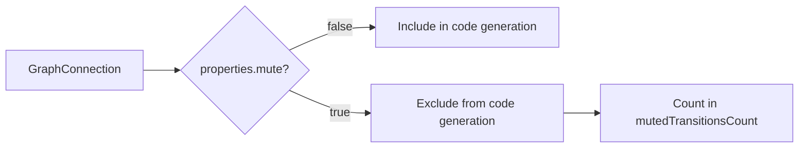

**Muted Connection Handling**

The filter pattern `!conn.properties.mute` appears in all three transition generation sections, ensuring muted connections never generate code. The statistics header includes a line like:
```kotlin
 * Muted Transitions: 2 (excluded from generated code)
```

Sources: [src/main/java/ru/hollowhorizon/hollowengine/client/gui/scripting/files/animations/AnimationControllerFile.kt:147,168,206,226]()

---

## Generated File Structure

The complete generated `.animation-controller.kts` file follows a consistent structure with imports, documentation, and the configuration block.

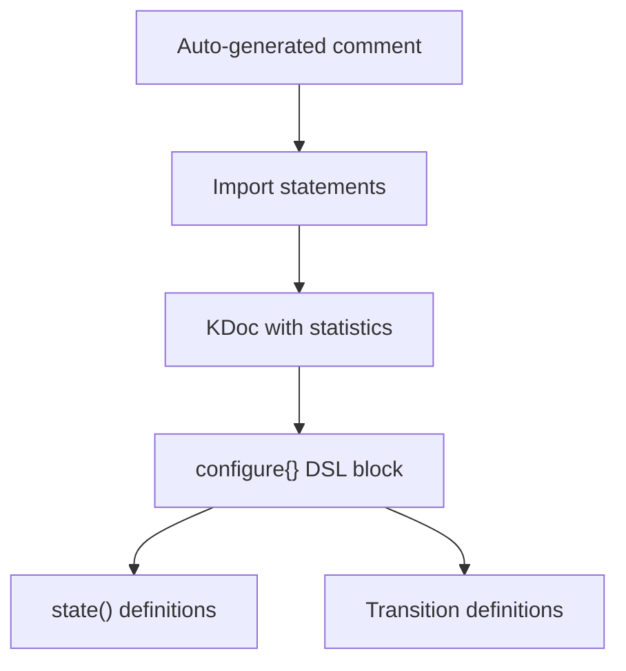

**Generated File Structure**

Example generated file:

```kotlin
// Auto-generated from hollowengine/animations/player.animation-controller-graph.json, do not edit manually
// Animation Controller Script for Kotlin Scripting System

import net.minecraft.world.entity.LivingEntity
import ru.hollowhorizon.hollowengine.client.models.internal.controller.AnimationController
import ru.hollowhorizon.hollowengine.client.models.internal.controller.AnimationSystem
import ru.hollowhorizon.hollowengine.client.models.internal.controller.WrapMode

/**
 * Generated Animation Controller for model: hollowengine:models/entity/player_model.gltf
 * 
 * States: 3
 * Entry Transitions: 1
 * Any-State Transitions: 1
 * State-to-State Transitions: 2
 */
configure {
    state(...)
    state(...)
    
    entry("Idle")
    
    any(...)
    
    transition(...)
    transition(...)
}
```

The file structure ensures:
- Warning against manual edits (auto-generated)
- All required imports are present
- Documentation clearly shows graph composition
- DSL code is properly contained in `configure{}` block

Sources: [src/main/java/ru/hollowhorizon/hollowengine/client/gui/scripting/files/animations/AnimationControllerFile.kt:209-233]()

---

## Script Type Registration

The generated `.animation-controller.kts` files are registered as a special script type with `CompilerLoader`. This ensures they extend `AnimationController` and have appropriate imports.

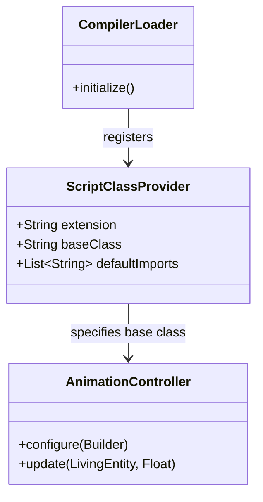

**Script Type Configuration**

The registration in `CompilerLoader.initialize()`:

| Property | Value |
|----------|-------|
| `extension` | `.animation-controller.kts` |
| `baseClass` | `ru.hollowhorizon.hollowengine.client.models.internal.controller.AnimationController` |
| `defaultImports` | `LivingEntity`, `AnimationController`, `AnimationSystem`, `WrapMode` |

This configuration tells the Kotlin script compiler that:
1. Files ending in `.animation-controller.kts` should extend `AnimationController`
2. The specified imports are automatically available without explicit import statements
3. The compiled script can call methods defined in `AnimationController` like `configure()`

Sources: [src/main/java/ru/hollowhorizon/hollowengine/common/scripting/CompilerLoader.kt:33-43]()

---

## Base Class Methods

Generated scripts extend `AnimationController` and call its `configure()` method. The base class provides the DSL builder and runtime execution.

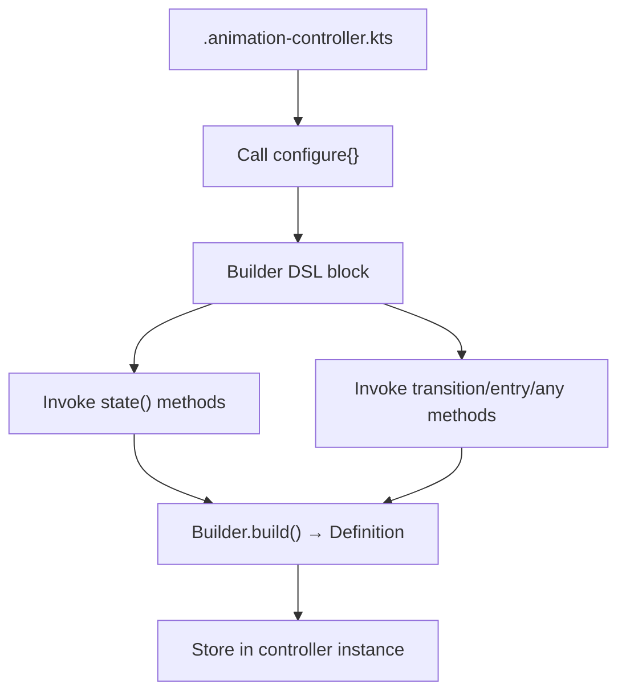

**configure() Method Flow**

The `AnimationController.configure()` method:
1. Creates a `Builder` instance
2. Executes the provided DSL block
3. Calls `Builder.build()` to create a `Definition`
4. Stores the definition for runtime use
5. Resets initialization state

The builder pattern allows the generated code to be declarative while the runtime assembles the state machine incrementally.

Sources: [src/main/java/ru/hollowhorizon/hollowengine/client/models/internal/controller/AnimationController.kt:141-145]()

---

## Class Name Generation

The generated Kotlin script file needs a valid class name. The generator sanitizes the original file name to create a valid identifier.

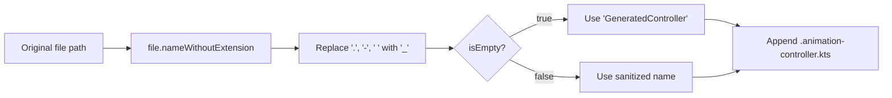

**Class Name Sanitization**

Example transformations:

| Original Filename | Sanitized Class Name |
|-------------------|---------------------|
| `player-controller.json` | `player_controller` |
| `npc.idle.controller.json` | `npc_idle_controller` |
| `enemy controller.json` | `enemy_controller` |
| `.json` (edge case) | `GeneratedController` |

The sanitized name becomes the file name with `.animation-controller.kts` extension.

Sources: [src/main/java/ru/hollowhorizon/hollowengine/client/gui/scripting/files/animations/AnimationControllerFile.kt:87-93]()

---

## Error Handling

Code generation includes error handling at multiple stages to ensure robust operation even when invalid data is encountered.

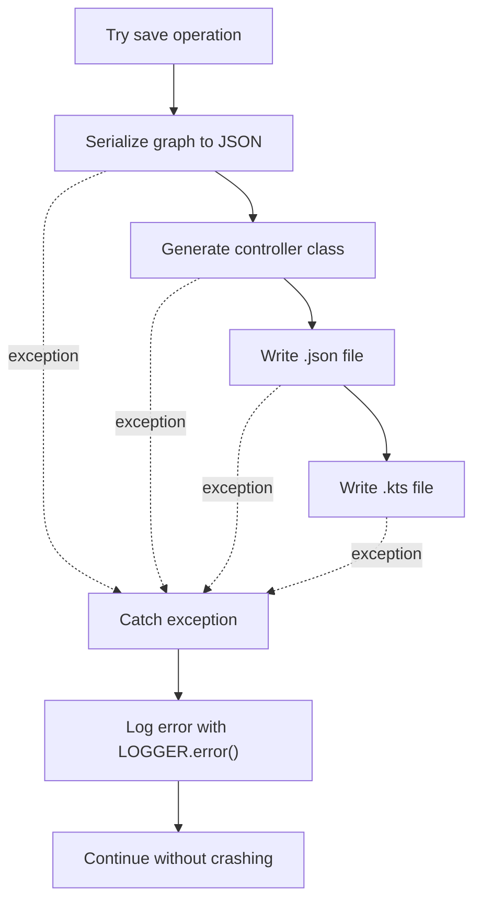

**Error Handling Strategy**

Error handling occurs at:
1. **File save** - Catches exceptions during JSON write ([line 78]())
2. **Code generation** - Catches exceptions during .kts file write ([line 238]())
3. **Compiler check** - Early return if compiler not loaded ([line 84]())

All errors are logged with context (file path) but do not crash the IDE.

Sources: [src/main/java/ru/hollowhorizon/hollowengine/client/gui/scripting/files/animations/AnimationControllerFile.kt:78-80,84,238-240]()

---

## Statistics Generation

The generated file includes a KDoc comment with statistics about the graph composition, providing quick insight into the controller's complexity.

**Statistics Tracked**:

| Statistic | Description | Calculation |
|-----------|-------------|-------------|
| States | Number of STATE nodes | `nodes.count { it.type == STATE }` |
| Entry Transitions | ENTRY → STATE connections | `connections.count { fromType == ENTRY && toType == STATE }` |
| Any-State Transitions | ANY → STATE connections | `connections.count { fromType == ANY && toType == STATE }` |
| State-to-State Transitions | STATE → STATE connections | `connections.count { fromType == STATE && toType == STATE }` |
| Muted Transitions | Disabled connections | `connections.count { properties.mute }` |

All counts include both muted and unmuted connections, but only unmuted connections generate actual code. The muted count is only shown if greater than zero.

Sources: [src/main/java/ru/hollowhorizon/hollowengine/client/gui/scripting/files/animations/AnimationControllerFile.kt:203-228]()

---

## Hot Reload Support

When the generated `.animation-controller.kts` file changes, the Kotlin scripting system can recompile it without restarting the game. This enables rapid iteration on animation logic.

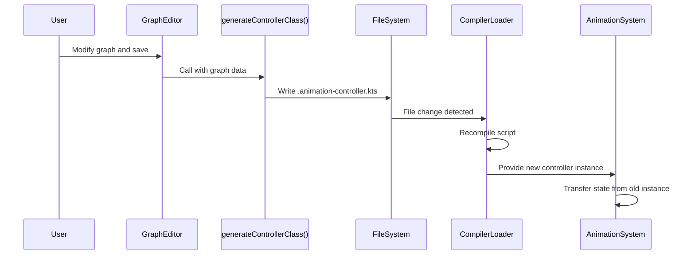

**Hot Reload Sequence**

The hot reload mechanism relies on:
1. File system watching (implicit in script loading system)
2. Kotlin script compilation on-demand
3. State transfer via `AnimationController.transferFrom()` (not implemented in code generation, but supported by base class)

This allows designers to modify animation conditions and see results immediately in-game.

Sources: [src/main/java/ru/hollowhorizon/hollowengine/client/gui/scripting/files/animations/AnimationControllerFile.kt:83-241](), [src/main/java/ru/hollowhorizon/hollowengine/common/scripting/CompilerLoader.kt:1-64]()