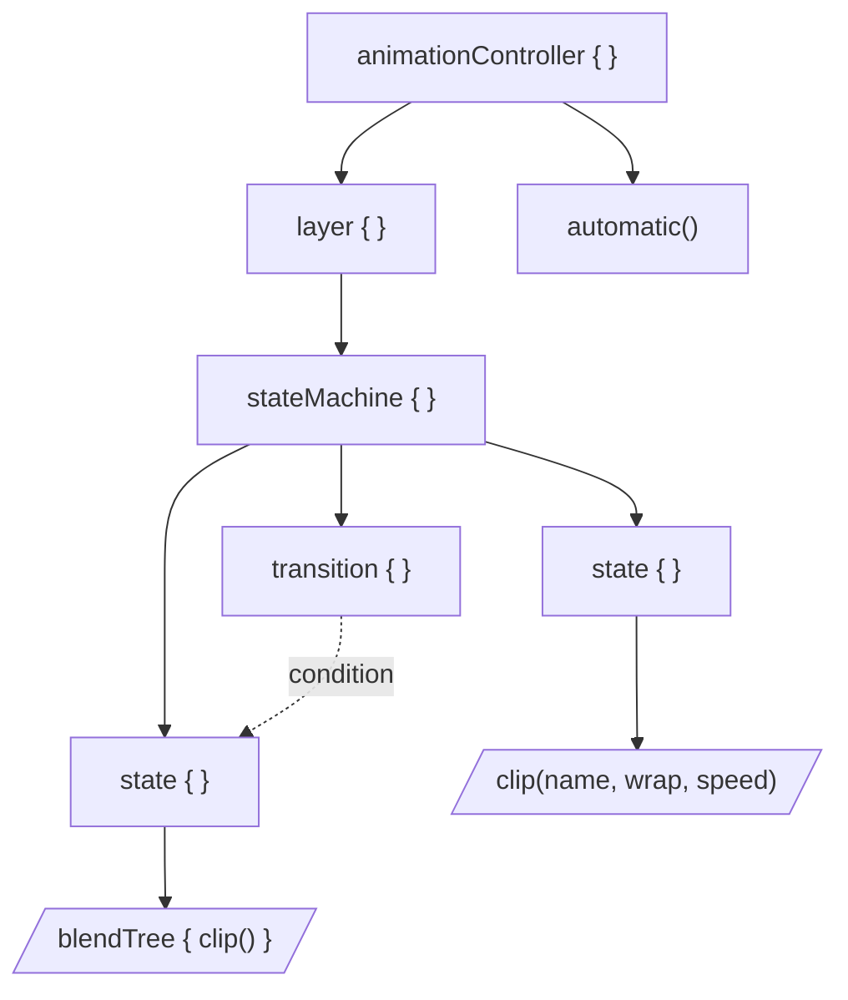
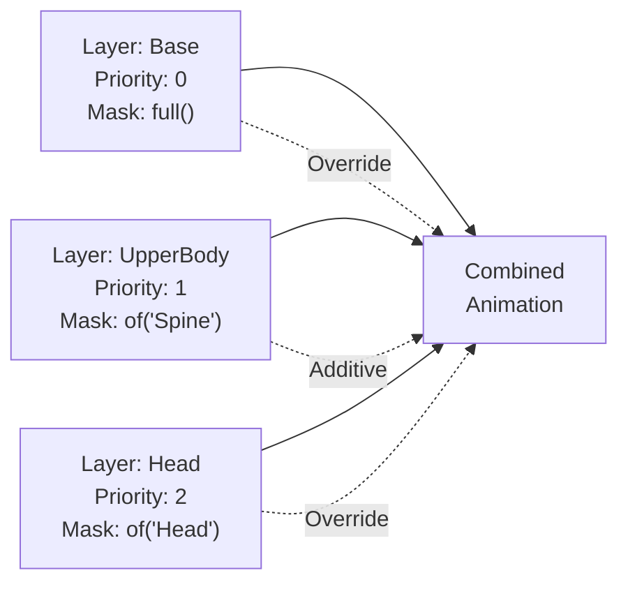
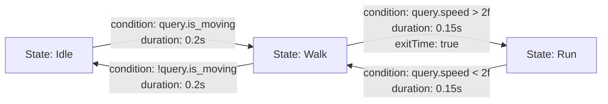
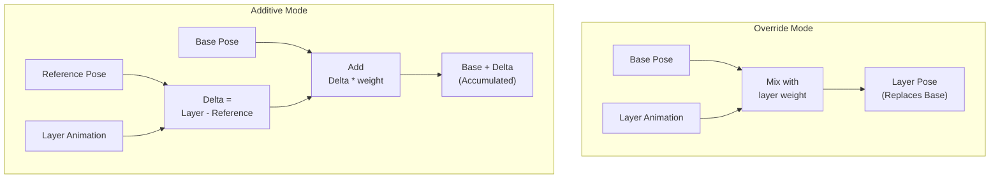
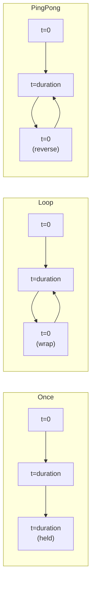
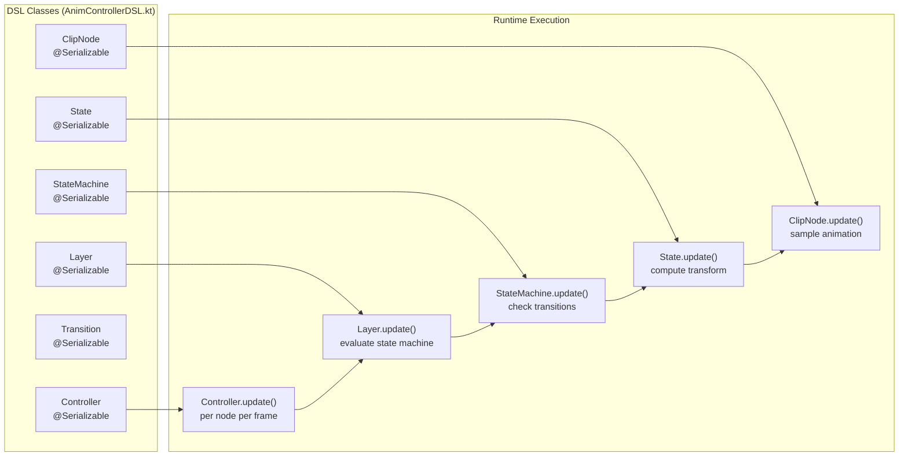

# Animation DSL

<details>
<summary>Relevant source files</summary>

The following files were used as context for generating this wiki page:

- [src/main/java/ru/hollowhorizon/hollowengine/client/gui/animations/Graph.kt](src/main/java/ru/hollowhorizon/hollowengine/client/gui/animations/Graph.kt)
- [src/main/java/ru/hollowhorizon/hollowengine/client/gui/animations/GraphEditor.kt](src/main/java/ru/hollowhorizon/hollowengine/client/gui/animations/GraphEditor.kt)
- [src/main/java/ru/hollowhorizon/hollowengine/client/gui/colors/ColorTheme.kt](src/main/java/ru/hollowhorizon/hollowengine/client/gui/colors/ColorTheme.kt)
- [src/main/java/ru/hollowhorizon/hollowengine/client/gui/scripting/files/animations/AnimationControllerFile.kt](src/main/java/ru/hollowhorizon/hollowengine/client/gui/scripting/files/animations/AnimationControllerFile.kt)
- [src/main/java/ru/hollowhorizon/hollowengine/client/gui/scripting/titlebar/ComboBox.kt](src/main/java/ru/hollowhorizon/hollowengine/client/gui/scripting/titlebar/ComboBox.kt)
- [src/main/java/ru/hollowhorizon/hollowengine/client/models/internal/controller/AnimControllerDSL.kt](src/main/java/ru/hollowhorizon/hollowengine/client/models/internal/controller/AnimControllerDSL.kt)
- [src/main/java/ru/hollowhorizon/hollowengine/client/models/internal/controller/AnimationController.kt](src/main/java/ru/hollowhorizon/hollowengine/client/models/internal/controller/AnimationController.kt)
- [src/main/java/ru/hollowhorizon/hollowengine/client/models/internal/controller/AnimationDispatcher.kt](src/main/java/ru/hollowhorizon/hollowengine/client/models/internal/controller/AnimationDispatcher.kt)
- [src/main/java/ru/hollowhorizon/hollowengine/client/models/internal/controller/EntityUtils.kt](src/main/java/ru/hollowhorizon/hollowengine/client/models/internal/controller/EntityUtils.kt)
- [src/main/java/ru/hollowhorizon/hollowengine/common/scripting/CompilerLoader.kt](src/main/java/ru/hollowhorizon/hollowengine/common/scripting/CompilerLoader.kt)

</details>


The Animation DSL is a Kotlin-based domain-specific language for defining animation state machines and controllers. It provides a declarative syntax for authoring complex animation behaviors including layered animations, state transitions, blend trees, and bone masking. The DSL is used in `.animation-controller.kts` files which are compiled at runtime to produce executable animation controllers.

For information about the visual graph editor used to author animation controllers, see [Graph Editor](#10.2). For details on how the DSL is generated from graphs, see [Code Generation](#10.5). For the runtime execution model, see [Runtime Animation System](#10.6).

**Sources:** [src/main/java/ru/hollowhorizon/hollowengine/client/models/internal/controller/AnimControllerDSL.kt:1-710]()

---

## DSL Structure Overview

The Animation DSL follows a hierarchical structure where animation controllers contain layers, which contain state machines, which contain states and transitions. All builder functions are annotated with `@AnimControllerDSL` to enable IDE autocomplete within DSL blocks.



**Hierarchy:**
- `Controller` - Root container with multiple layers
- `Layer` - Independent animation layer with priority and blending
- `StateMachine` - Collection of states and transitions
- `State` - Single animation state (clip or blend tree)
- `Transition` - Conditional link between states
- `ClipNode` - Reference to a single animation
- `BlendTree` - 1D interpolation between multiple clips

**Sources:** [src/main/java/ru/hollowhorizon/hollowengine/client/models/internal/controller/AnimControllerDSL.kt:21-244]()

---

## Controller Definition

Animation controllers are defined using the `animationController` function, which returns a `Controller` instance containing all layers.

```kotlin
// Basic controller with a single layer
animationController {
    layer("Main", priority = 0) {
        stateMachine {
            state("Idle") {
                clip("idle", WrapMode.Loop)
            }
        }
    }
}
```

| Function | Return Type | Description |
|----------|-------------|-------------|
| `animationController` | `Controller` | Creates a new animation controller |
| `layer(name, ...)` | `Unit` | Adds a named layer with configuration |
| `automatic(...)` | `Unit` | Adds the automatic layer for entity animations |
| `head(name)` | `Unit` | Adds a head tracking layer |

**Sources:** [src/main/java/ru/hollowhorizon/hollowengine/client/models/internal/controller/AnimControllerDSL.kt:195-244]()

---

## Layers

Layers allow multiple animations to play simultaneously with different priorities, blend modes, and bone masks. Each layer executes its own state machine independently.



### Layer Configuration

```kotlin
layer(
    name = "UpperBody",
    priority = 1,              // Higher priority layers override lower ones
    weight = 1f,               // Blend weight (0.0 to 1.0)
    mask = Mask.of("Spine"),   // Only affects specified bones
    blendMode = BlendMode.Additive,
    referencePose = "idle"     // Reference pose for additive blending
) {
    stateMachine { /* ... */ }
}
```

| Parameter | Type | Default | Description |
|-----------|------|---------|-------------|
| `name` | `String` | Required | Unique layer identifier |
| `priority` | `Int` | `0` | Evaluation order (higher = later) |
| `weight` | `Float` | `1f` | Blend strength (0.0-1.0) |
| `mask` | `Mask` | `Mask.full()` | Bone filter |
| `blendMode` | `BlendMode` | `Additive` | Override or Additive |
| `referencePose` | `String` | `""` | Reference animation for additive mode |

**Sources:** [src/main/java/ru/hollowhorizon/hollowengine/client/models/internal/controller/AnimControllerDSL.kt:230-244](), [src/main/java/ru/hollowhorizon/hollowengine/client/models/internal/controller/AnimControllerDSL.kt:246-280]()

---

## State Machines

State machines define animation flow using states and transitions. Each layer contains one state machine.

```kotlin
stateMachine {
    initialState("Idle")
    
    state("Idle") {
        clip("idle", WrapMode.Loop)
    }
    
    state("Walk") {
        clip("walk", WrapMode.Loop, speed = "query.speed")
    }
    
    transition("Idle", "Walk") {
        condition("query.is_moving")
        duration(0.2f)
    }
    
    transition("Walk", "Idle") {
        condition("!query.is_moving")
        duration(0.2f)
    }
}
```

| Function | Description |
|----------|-------------|
| `initialState(name)` | Sets the starting state |
| `state(name) { }` | Defines a state with animation content |
| `transition(from, to) { }` | Defines a conditional transition |
| `exit(from, duration, condition)` | Defines an exit transition that removes the layer |

**Sources:** [src/main/java/ru/hollowhorizon/hollowengine/client/models/internal/controller/AnimControllerDSL.kt:452-481]()

---

## States

States represent a single animation configuration within a state machine. Each state contains either a clip node or a blend tree.

### Clip State

```kotlin
state("Walk") {
    clip(
        name = "walk",
        wrap = WrapMode.Loop,
        speed = "query.speed * 2f"
    )
}
```

### Blend Tree State

```kotlin
state("Movement") {
    blendTree {
        factor("query.speed", smoothingTime = 0.1f)
        
        clip("idle", threshold = 0f, WrapMode.Loop, speed = "1f")
        clip("walk", threshold = 1f, WrapMode.Loop, speed = "1f")
        clip("run", threshold = 3f, WrapMode.Loop, speed = "1f")
    }
}
```

**Sources:** [src/main/java/ru/hollowhorizon/hollowengine/client/models/internal/controller/AnimControllerDSL.kt:483-501](), [src/main/java/ru/hollowhorizon/hollowengine/client/models/internal/controller/AnimControllerDSL.kt:282-312]()

---

## Transitions

Transitions define conditional links between states with blend durations and exit timing.



### Transition Configuration

```kotlin
transition("Walk", "Run") {
    condition("query.speed > 2.0")
    duration(0.15f)
    exitTime(true)  // Wait for current animation to finish
}
```

| Function | Parameter Type | Description |
|----------|---------------|-------------|
| `condition(expr)` | `String` | Molang boolean expression |
| `duration(sec)` | `Float` | Blend time in seconds |
| `exitTime(time)` | `Float` | Specific time to allow exit |
| `exitTime(hasExitTime)` | `Boolean` | Enable/disable exit time requirement |

**Exit Time Behavior:**
- `exitTime(0f)` - Transition immediately when condition is true
- `exitTime(true)` or `exitTime(-1f)` - Wait for animation to complete
- `exitTime(2.5f)` - Wait until animation reaches 2.5 seconds

**Sources:** [src/main/java/ru/hollowhorizon/hollowengine/client/models/internal/controller/AnimControllerDSL.kt:314-365](), [src/main/java/ru/hollowhorizon/hollowengine/client/models/internal/controller/AnimControllerDSL.kt:676-709]()

---

## Clip Nodes

Clip nodes reference individual animations from the model with control over playback speed and wrap behavior.

```kotlin
clip(
    name = "walk",
    wrap = WrapMode.Loop,
    speed = "query.speed * 1.5f"
)
```

| Parameter | Type | Description |
|-----------|------|-------------|
| `name` | `String` | Animation name from model |
| `wrap` | `WrapMode` | Playback wrap mode |
| `speed` | `String` | Molang expression for playback speed |

### Speed Control

The `speed` parameter accepts Molang expressions evaluated per frame:

```kotlin
// Constant speed
clip("walk", speed = "1f")

// Dynamic speed based on entity movement
clip("walk", speed = "query.speed * 2f")

// Conditional speed
clip("run", speed = "query.is_sprinting ? 1.5f : 1f")

// Paused animation
clip("pose", speed = "0f")
```

**Sources:** [src/main/java/ru/hollowhorizon/hollowengine/client/models/internal/controller/AnimControllerDSL.kt:608-669]()

---

## Blend Trees

Blend trees perform 1D interpolation between multiple animation clips based on a factor expression. Useful for smooth transitions between movement speeds.

```mermaid
graph LR
    Factor["factor = query.speed<br/>(smoothed)"]
    Idle["clip: idle<br/>threshold: 0.0"]
    Walk["clip: walk<br/>threshold: 1.0"]
    Run["clip: run<br/>threshold: 3.0"]
    Output["Interpolated<br/>Animation"]
    
    Factor --> Interpolate["1D Interpolation"]
    Idle --> Interpolate
    Walk --> Interpolate
    Run --> Interpolate
    Interpolate --> Output
    
    Factor -.0.0 to 1.0.-> Idle
    Factor -.1.0 to 3.0.-> Walk
    Factor -."> 3.0".-> Run
```

### Blend Tree Example

```kotlin
blendTree {
    factor("query.speed", smoothingTime = 0.1f)
    
    clip("idle", threshold = 0f, WrapMode.Loop, speed = "1f")
    clip("walk", threshold = 1f, WrapMode.Loop, speed = "1f")
    clip("run", threshold = 3f, WrapMode.Loop, speed = "1.2f")
}
```

**Interpolation Behavior:**
- Factor < 0.0: Uses `idle` (first clip)
- Factor = 0.5: Blend 50% `idle` + 50% `walk`
- Factor = 2.0: Blend 50% `walk` + 50% `run`
- Factor > 3.0: Uses `run` (last clip)

**Smoothing:** The `smoothingTime` parameter applies exponential smoothing to the factor value, preventing abrupt changes.

**Sources:** [src/main/java/ru/hollowhorizon/hollowengine/client/models/internal/controller/AnimControllerDSL.kt:506-589](), [src/main/java/ru/hollowhorizon/hollowengine/client/models/internal/controller/AnimControllerDSL.kt:568-589]()

---

## Bone Masks

Masks filter which bones a layer affects, enabling layered animations (e.g., upper body animations while legs play walk cycles).

```kotlin
// Full body (default)
Mask.full()

// Only spine and its children
Mask.of("Spine")

// Multiple bones
Mask.of("RightArm", "LeftArm")

// All bones except head
Mask.of("!Head")

// Complex mask: spine and arms, but not hands
Mask.of("Spine", "RightArm", "LeftArm", "!RightHand", "!LeftHand")
```

### Mask Patterns

| Pattern | Description |
|---------|-------------|
| `"BoneName"` | Include bone and all children |
| `"!BoneName"` | Exclude bone and all children |
| Empty includes | If no includes, all bones are included |

**Evaluation Order:**
1. If `includes` is empty, all bones start included
2. If `includes` is not empty, only matching bones are included
3. All `excludes` patterns are removed from the result

**Sources:** [src/main/java/ru/hollowhorizon/hollowengine/client/models/internal/controller/AnimControllerDSL.kt:62-103]()

---

## Blend Modes

Blend modes determine how layers combine with previous animation data.



### Override Mode

Replaces the base pose with the layer's animation, blended by weight.

```kotlin
layer("FullBody", blendMode = BlendMode.Override, weight = 1f) {
    // Completely replaces previous animation
}
```

**Transform Application:**
```
result.translation = base.translation + layer.translation * weight
result.rotation = base.rotation * layer.rotation^weight
result.scale = base.scale * layer.scale^weight
```

### Additive Mode

Adds the difference between the layer animation and a reference pose to the base.

```kotlin
layer("UpperBody", blendMode = BlendMode.Additive, referencePose = "idle") {
    // Adds motion on top of base animation
}
```

**Transform Application:**
```
delta = layer - referencePose
result.translation = base.translation + delta.translation * weight
result.rotation = base.rotation * (referencePose.rotation^-1 * layer.rotation)^weight
result.scale = base.scale * (layer.scale / referencePose.scale)^weight
```

**Sources:** [src/main/java/ru/hollowhorizon/hollowengine/client/models/internal/controller/AnimControllerDSL.kt:54-60](), [src/main/java/ru/hollowhorizon/hollowengine/client/models/internal/controller/AnimControllerDSL.kt:148-182]()

---

## Wrap Modes

Wrap modes control how animation time wraps when reaching the start or end of a clip.

| Mode | Behavior | Use Case |
|------|----------|----------|
| `Once` | Play once, stop at last frame | One-shot actions (attack, jump) |
| `Loop` | Repeat infinitely | Cyclic animations (idle, walk) |
| `PingPong` | Play forward then backward, repeat | Oscillating motions |
| `ClampForever` | Play once, hold last frame | Additive poses that should persist |



### Wrap Mode Examples

```kotlin
// Attack animation plays once
state("Attack") {
    clip("attack", WrapMode.Once)
}

// Idle loops forever
state("Idle") {
    clip("idle", WrapMode.Loop)
}

// Breathing oscillates
state("Breathing") {
    clip("breathe", WrapMode.PingPong)
}

// Held pose for additive layer
layer("Pose", blendMode = BlendMode.Additive) {
    stateMachine {
        state("Hold") {
            clip("aim_pose", WrapMode.ClampForever, speed = "0f")
        }
    }
}
```

**Sources:** [src/main/java/ru/hollowhorizon/hollowengine/client/models/internal/controller/AnimControllerDSL.kt:27-52]()

---

## Molang Integration

The Animation DSL uses Molang expressions for dynamic behavior. Molang is a simple expression language that evaluates at runtime with access to entity state.

### Expression Contexts

**Transition Conditions:**
```kotlin
transition("Idle", "Walk") {
    condition("query.is_moving && !query.is_in_water")
}
```

**Animation Speed:**
```kotlin
clip("walk", speed = "query.speed * 2f")
```

**Blend Tree Factor:**
```kotlin
blendTree {
    factor("math.clamp(query.speed, 0, 3)")
}
```

### Common Query Variables

| Query | Type | Description |
|-------|------|-------------|
| `query.is_moving` | `Boolean` | Entity is moving horizontally |
| `query.speed` | `Float` | Entity movement speed |
| `query.is_in_water` | `Boolean` | Entity is submerged |
| `query.is_on_ground` | `Boolean` | Entity is on solid ground |
| `query.health` | `Float` | Current health value |

### Math Functions

```kotlin
// Clamping
"math.clamp(query.speed, 0, 3)"

// Absolute value
"math.abs(query.speed)"

// Trigonometry
"math.sin(query.time * 2)"

// Comparisons
"query.speed > 1.5 && query.speed < 3.0"

// Ternary operator
"query.is_sprinting ? 1.5 : 1.0"
```

**Compilation:** All Molang expressions are compiled to bytecode by `MolangCompiler` at controller initialization for efficient runtime evaluation.

**Sources:** [src/main/java/ru/hollowhorizon/hollowengine/client/models/internal/controller/AnimControllerDSL.kt:16-18](), [src/main/java/ru/hollowhorizon/hollowengine/client/models/internal/controller/AnimControllerDSL.kt:324-327]()

---

## Complete Example

This example demonstrates a full animation controller with multiple layers, states, and blend modes:

```kotlin
animationController {
    // Base layer: full-body locomotion
    layer("Locomotion", priority = 0, blendMode = BlendMode.Override) {
        stateMachine {
            initialState("Idle")
            
            state("Idle") {
                clip("idle", WrapMode.Loop)
            }
            
            state("Movement") {
                blendTree {
                    factor("query.speed", smoothingTime = 0.1f)
                    clip("idle", threshold = 0f, WrapMode.Loop, speed = "1f")
                    clip("walk", threshold = 1f, WrapMode.Loop, speed = "1f")
                    clip("run", threshold = 3f, WrapMode.Loop, speed = "1f")
                }
            }
            
            transition("Idle", "Movement") {
                condition("query.is_moving")
                duration(0.2f)
            }
            
            transition("Movement", "Idle") {
                condition("!query.is_moving")
                duration(0.2f)
            }
        }
    }
    
    // Upper body layer: combat actions
    layer(
        name = "UpperBody",
        priority = 1,
        blendMode = BlendMode.Additive,
        mask = Mask.of("Spine", "RightArm", "LeftArm"),
        referencePose = "idle"
    ) {
        stateMachine {
            state("Aim") {
                clip("aim", WrapMode.ClampForever, speed = "0f")
            }
            
            state("Shoot") {
                clip("shoot", WrapMode.Once)
            }
            
            transition("Aim", "Shoot") {
                condition("query.is_using_item")
                duration(0.1f)
            }
            
            transition("Shoot", "Aim") {
                condition("true")
                duration(0.2f)
                exitTime(true)
            }
            
            exit("Aim", duration = 0.3f, condition = "!query.is_aiming")
        }
    }
    
    // Head tracking layer
    head("Head")
}
```

**Layer Execution:**
1. `Locomotion` layer (priority 0) provides base full-body animation
2. `UpperBody` layer (priority 1) adds upper body motion on top
3. `Head` layer (priority 2) overrides head rotation for look-at behavior

**Sources:** [src/main/java/ru/hollowhorizon/hollowengine/client/models/internal/controller/AnimControllerDSL.kt:195-244]()

---

## DSL to Runtime Mapping

The DSL classes are serialized to JSON and compiled into runtime classes:



| DSL Class | Runtime Method | Frequency | Description |
|-----------|---------------|-----------|-------------|
| `Controller` | `update(node, context, time)` | Per node per frame | Iterates layers in priority order |
| `Layer` | `update(node, context, time)` | Per node per frame | Evaluates state machine for masked bones |
| `StateMachine` | `update(node, context, time)` | Per node per frame | Checks transitions, updates current state |
| `State` | `update(node, context, time)` | Per active state | Computes animation transform |
| `Transition` | `update(node, context, time)` | During transition | Blends from/to states |
| `ClipNode` | `update(animations, context, node, time)` | Per active clip | Samples animation at computed time |
| `BlendTree` | `update(animations, context, node, time)` | Per active blend | Interpolates between clips |

**Sources:** [src/main/java/ru/hollowhorizon/hollowengine/client/models/internal/controller/AnimControllerDSL.kt:105-193](), [src/main/java/ru/hollowhorizon/hollowengine/client/models/internal/controller/AnimControllerDSL.kt:380-449]()