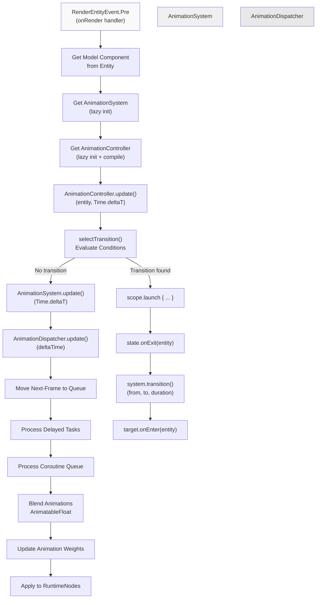
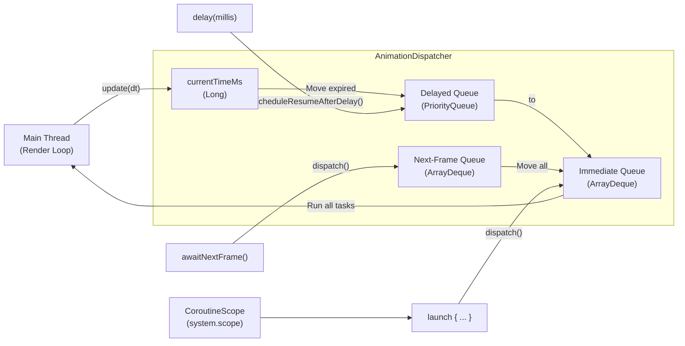
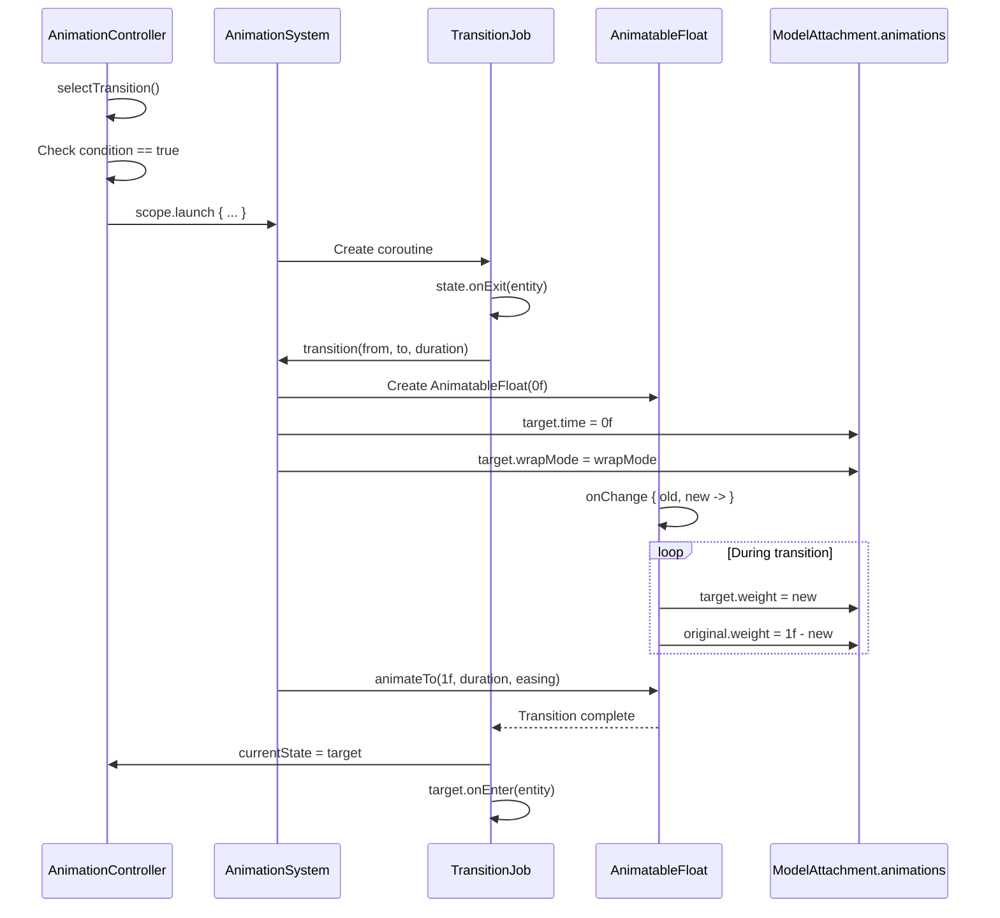
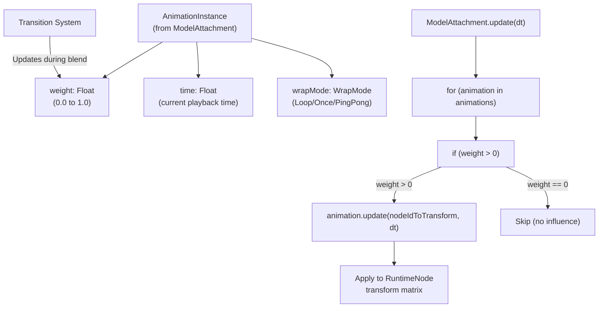
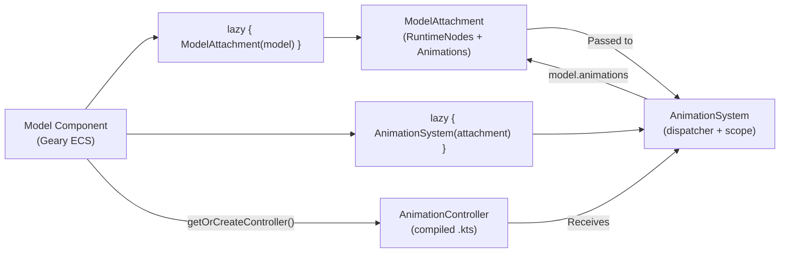
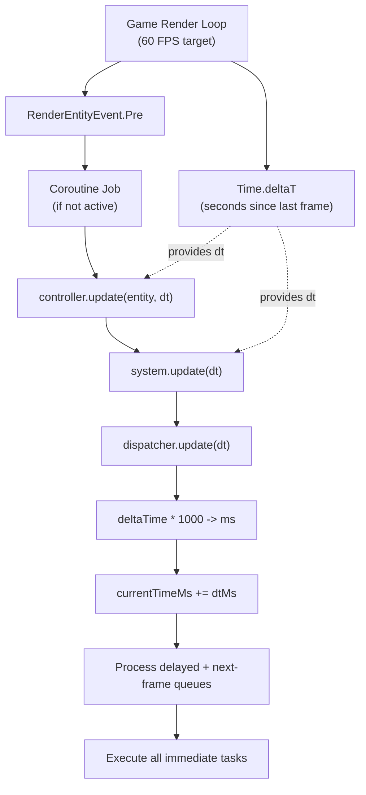

# Runtime Animation System

<details>
<summary>Relevant source files</summary>

The following files were used as context for generating this wiki page:

- [src/main/java/ru/hollowhorizon/hollowengine/client/gui/animations/Graph.kt](src/main/java/ru/hollowhorizon/hollowengine/client/gui/animations/Graph.kt)
- [src/main/java/ru/hollowhorizon/hollowengine/client/gui/animations/GraphEditor.kt](src/main/java/ru/hollowhorizon/hollowengine/client/gui/animations/GraphEditor.kt)
- [src/main/java/ru/hollowhorizon/hollowengine/client/gui/colors/ColorTheme.kt](src/main/java/ru/hollowhorizon/hollowengine/client/gui/colors/ColorTheme.kt)
- [src/main/java/ru/hollowhorizon/hollowengine/client/gui/scripting/files/animations/AnimationControllerFile.kt](src/main/java/ru/hollowhorizon/hollowengine/client/gui/scripting/files/animations/AnimationControllerFile.kt)
- [src/main/java/ru/hollowhorizon/hollowengine/client/gui/scripting/titlebar/ComboBox.kt](src/main/java/ru/hollowhorizon/hollowengine/client/gui/scripting/titlebar/ComboBox.kt)
- [src/main/java/ru/hollowhorizon/hollowengine/client/models/internal/controller/AnimControllerDSL.kt](src/main/java/ru/hollowhorizon/hollowengine/client/models/internal/controller/AnimControllerDSL.kt)
- [src/main/java/ru/hollowhorizon/hollowengine/client/models/internal/controller/AnimationController.kt](src/main/java/ru/hollowhorizon/hollowengine/client/models/internal/controller/AnimationController.kt)
- [src/main/java/ru/hollowhorizon/hollowengine/client/models/internal/controller/AnimationDispatcher.kt](src/main/java/ru/hollowhorizon/hollowengine/client/models/internal/controller/AnimationDispatcher.kt)
- [src/main/java/ru/hollowhorizon/hollowengine/client/models/internal/controller/EntityUtils.kt](src/main/java/ru/hollowhorizon/hollowengine/client/models/internal/controller/EntityUtils.kt)
- [src/main/java/ru/hollowhorizon/hollowengine/common/scripting/CompilerLoader.kt](src/main/java/ru/hollowhorizon/hollowengine/common/scripting/CompilerLoader.kt)

</details>


The Runtime Animation System is responsible for executing animations and state machines at runtime. It manages animation playback, transitions between states, and coroutine-based updates that blend animations smoothly. This system receives compiled animation controllers (from [Code Generation](#10.5)) and applies them to entities during rendering (see [Entity Integration](#10.7)).

For animation controller authoring and state machine structure, see [State Machine Architecture](#10.3) and [Animation DSL](#10.4). For the graph-based editor, see [Graph Editor](#10.2).

---

## Core Architecture

The runtime animation system consists of three primary components that work together to execute animations frame-by-frame.

### AnimationSystem

The `AnimationSystem` class is the main entry point for runtime animation execution. Each `ModelAttachment` that enables animations creates its own `AnimationSystem` instance.

**Key Responsibilities:**
- Managing the `AnimationDispatcher` for coroutine execution
- Orchestrating animation transitions with blending
- Exposing the `update(dt: Float)` method called each frame
- Providing the `transition()` suspend function for smooth blending

**Sources:** [src/main/java/ru/hollowhorizon/hollowengine/client/models/internal/controller/AnimationSystem.kt:1-56]()

### AnimationDispatcher

The `AnimationDispatcher` is a custom `CoroutineDispatcher` and `Delay` implementation that synchronizes coroutine execution with the game's frame timing. It ensures animation updates occur deterministically on the rendering thread.

**Key Features:**
- Frame-synchronized coroutine dispatch
- Delayed task scheduling for time-based transitions
- Three execution queues: immediate, next-frame, and delayed
- Frame-accurate timing using `awaitNextFrame()`

**Sources:** [src/main/java/ru/hollowhorizon/hollowengine/client/models/internal/controller/AnimationDispatcher.kt:1-116]()

### AnimationController Runtime

The `AnimationController` base class processes state transitions and evaluates conditions each frame. Controller instances are created by compiling `.animation-controller.kts` scripts and call `update(entity, dt)` to drive the state machine.

**Sources:** [src/main/java/ru/hollowhorizon/hollowengine/client/models/internal/controller/AnimationController.kt:1-196]()

---

## Runtime Update Flow



**Diagram: Runtime Animation Update Flow**

The update flow begins when an entity is rendered and progresses through state evaluation, transition execution, and animation blending.

**Sources:** 
- [src/main/java/ru/hollowhorizon/hollowengine/common/geary/components/Model.kt:88-104]()
- [src/main/java/ru/hollowhorizon/hollowengine/client/models/internal/controller/AnimationController.kt:147-175]()
- [src/main/java/ru/hollowhorizon/hollowengine/client/models/internal/controller/AnimationSystem.kt:15-17]()
- [src/main/java/ru/hollowhorizon/hollowengine/client/models/internal/controller/AnimationDispatcher.kt:81-104]()

---

## Coroutine Execution Model

The animation system uses Kotlin coroutines for asynchronous animation logic, allowing smooth transitions and time-based operations without blocking the render thread.

### Dispatcher Architecture



**Diagram: AnimationDispatcher Queue Management**

The dispatcher maintains three queues for different execution timing requirements, ensuring animations execute at the correct frame.

**Sources:** [src/main/java/ru/hollowhorizon/hollowengine/client/models/internal/controller/AnimationDispatcher.kt:23-104]()

### Coroutine Usage Patterns

| Pattern | Method | Use Case |
|---------|--------|----------|
| Immediate execution | `scope.launch { ... }` | State transition logic |
| Next frame wait | `dispatcher.awaitNextFrame()` | Frame-synchronized updates |
| Timed delay | `delay(millis)` | Scheduled events |
| Periodic updates | `onUpdate { ... }` | Per-frame animation logic |

**Sources:** [src/main/java/ru/hollowhorizon/hollowengine/client/models/internal/controller/AnimationSystem.kt:10-26]()

---

## Transition Execution

Transitions are the runtime mechanism that smoothly blends between animation states. When a transition is triggered, the system uses `AnimatableFloat` to interpolate weights over the transition duration.

### Transition Pipeline



**Diagram: Transition Execution Sequence**

This sequence shows how a state transition progresses from condition evaluation through animation blending to completion.

**Sources:** 
- [src/main/java/ru/hollowhorizon/hollowengine/client/models/internal/controller/AnimationController.kt:147-175]()
- [src/main/java/ru/hollowhorizon/hollowengine/client/models/internal/controller/AnimationSystem.kt:28-55]()

### Transition Data Structures

The `AnimationSystem` maintains active transitions using a job map:

```
transitionJobs: HashMap<String, Job>
    Key format: "${from}->${to}"
    Value: Coroutine Job executing the blend
```

When a new transition starts for the same state pair, the previous job is cancelled to prevent conflicts.

**Sources:** [src/main/java/ru/hollowhorizon/hollowengine/client/models/internal/controller/AnimationSystem.kt:13-54]()

### Animation Blending

During a transition, the `AnimatableFloat.onChange` callback updates animation weights:

| Time | Factor | Original Weight | Target Weight |
|------|--------|----------------|---------------|
| 0.0s | 0.0 | 1.0 | 0.0 |
| 0.1s | 0.3 | 0.7 | 0.3 |
| 0.2s | 0.6 | 0.4 | 0.6 |
| 0.33s | 1.0 | 0.0 | 1.0 |

The blending uses easing functions (default: `Easing.smooth`) for natural-looking transitions.

**Sources:** [src/main/java/ru/hollowhorizon/hollowengine/client/models/internal/controller/AnimationSystem.kt:46-49]()

---

## Animation Weight Management

Animation instances have a `weight` property that controls their influence on the final pose. The runtime system manages these weights dynamically.

### Weight Control Flow



**Diagram: Animation Weight Management**

Weights determine which animations influence the final bone transforms. Zero-weight animations are skipped for performance.

**Sources:** [src/main/java/ru/hollowhorizon/hollowengine/client/models/internal/v2/ModelAttachment.kt:58-69]()

### WrapMode Behavior

The `WrapMode` enum defines how animation time wraps when it exceeds the animation duration:

| Mode | Behavior | Use Case |
|------|----------|----------|
| `Once` | Clamps to `[0, duration]` | One-shot actions (jump, attack) |
| `Loop` | Wraps modulo `duration` | Repeating actions (idle, walk) |
| `PingPong` | Bounces between `0` and `duration` | Oscillating motions |
| `ClampForever` | Stays at last frame | End states (death, sit) |

**Sources:** [src/main/java/ru/hollowhorizon/hollowengine/client/models/internal/controller/WrapMode.kt:1-52]()

---

## Integration with ModelAttachment

The `ModelAttachment` class serves as the bridge between the animation system and the 3D model structure.

### Component Initialization



**Diagram: Lazy Initialization Chain**

Components are lazily initialized to defer compilation and loading until first use.

**Sources:** [src/main/java/ru/hollowhorizon/hollowengine/common/geary/components/Model.kt:45-83]()

### Update Pipeline Integration

The `ModelAttachment.update()` method is called from the render pipeline and coordinates animation application:

1. **Reset transforms**: Set all node transforms to their base values
2. **Apply onUpdate callbacks**: Execute custom animation logic
3. **Update animations**: Iterate all animations with `weight > 0` and apply their transforms
4. **Render**: The updated transforms are used by the render pipeline

**Sources:** [src/main/java/ru/hollowhorizon/hollowengine/client/models/internal/v2/ModelAttachment.kt:58-69]()

### Animation Collection

The `Animations` class wraps the animation map and provides convenient access:

```kotlin
class Animations(private val map: Map<String, AnimationInstance>)
```

- Implements `Collection<AnimationInstance>` for iteration
- Provides `operator fun get(name: String)` for lookup
- Throws error if animation not found (fail-fast behavior)

**Sources:** [src/main/java/ru/hollowhorizon/hollowengine/client/models/internal/v2/ModelAttachment.kt:80-91]()

---

## Frame Timing and Synchronization

The animation system synchronizes with the game's render loop through `Time.deltaT` from the Kool graphics library.

### Timing Flow



**Diagram: Frame Timing Synchronization**

The system uses `Time.deltaT` to maintain frame-rate independent animation playback.

**Sources:**
- [src/main/java/ru/hollowhorizon/hollowengine/common/geary/components/Model.kt:96-102]()
- [src/main/java/ru/hollowhorizon/hollowengine/client/models/internal/controller/AnimationDispatcher.kt:81-94]()

### Paused State Handling

When rendering shadows (detected via `IrisHelper.isShadowRendering()`), the system passes `0f` as delta time to prevent animation updates during shadow passes:

```kotlin
pipeline.onUpdate { update(if (IrisHelper.isShadowRendering()) 0f else Time.deltaT) }
```

**Sources:** [src/main/java/ru/hollowhorizon/hollowengine/client/models/internal/v2/ModelAttachment.kt:73]()

---

## Performance Characteristics

### Lazy Initialization

All expensive operations are deferred until first use:

| Component | Initialization Trigger | Cost |
|-----------|----------------------|------|
| `ModelAttachment` | First render | Model parsing (GLTF/GLB) |
| `AnimationSystem` | First render with animations | Coroutine scope creation |
| `AnimationController` | First render with controller | Script compilation + instantiation |

**Sources:** [src/main/java/ru/hollowhorizon/hollowengine/common/geary/components/Model.kt:46-82]()

### Animation Skipping

Animations with `weight == 0` are skipped during the update loop, avoiding unnecessary transform calculations:

```kotlin
for (animation in animations) {
    animation.update(nodeIdToTransform, dt)  // Only called if weight > 0
}
```

**Sources:** [src/main/java/ru/hollowhorizon/hollowengine/client/models/internal/v2/ModelAttachment.kt:66-68]()

### Coroutine Overhead

The `AnimationDispatcher` processes coroutines synchronously on the render thread, avoiding thread-switching overhead. However, each active animation controller maintains its own coroutine scope, so memory usage scales with the number of animated entities.

**Sources:** [src/main/java/ru/hollowhorizon/hollowengine/client/models/internal/controller/AnimationSystem.kt:10-11]()

---

## Error Handling

The runtime system includes several error handling mechanisms:

### Animation Not Found

When requesting a non-existent animation, the `Animations` collection throws an error:

```kotlin
operator fun get(name: String): AnimationInstance = 
    map[name] ?: error("Animation $name not found")
```

This fail-fast behavior helps detect authoring errors during development.

**Sources:** [src/main/java/ru/hollowhorizon/hollowengine/client/models/internal/v2/ModelAttachment.kt:81]()

### Model Loading Failure

If a model fails to load, the `Model` component falls back to an error model:

```kotlin
val attachment by lazy {
    try {
        ModelAttachment(model)
    } catch (e: Exception) {
        ModelAttachment(Assets.Hollowengine.Models.ERROR.toString())
    }
}
```

**Sources:** [src/main/java/ru/hollowhorizon/hollowengine/common/geary/components/Model.kt:46-51]()

### Coroutine Exceptions

The `AnimationDispatcher` catches and logs all exceptions during task execution to prevent crashes:

```kotlin
try {
    task.run()
} catch (e: Throwable) {
    HollowEngine.LOGGER.error("Animation Coroutine Error in $name", e)
}
```

**Sources:** [src/main/java/ru/hollowhorizon/hollowengine/client/models/internal/controller/AnimationDispatcher.kt:98-102]()

---

## Relationship to Other Systems

The Runtime Animation System interacts with several other engine systems:

- **[State Machine Architecture](#10.3)**: Provides the `AnimationController` base class and state machine logic
- **[Animation DSL](#10.4)**: Defines the data structures (`State`, `Transition`, `Layer`) used at runtime
- **[Code Generation](#10.5)**: Produces `.animation-controller.kts` files that are compiled into `AnimationController` instances
- **[Entity Integration](#10.7)**: Connects the animation system to Minecraft entities through the `Model` component
- **[3D Model System](#9)**: Works with `ModelAttachment` to apply transforms to model nodes
- **[Geary ECS Integration](#8)**: Uses the `@Registerable` and `@Syncable` annotations for the `Model` component