# System Architecture

<details>
<summary>Relevant source files</summary>

The following files were used as context for generating this wiki page:

- [build.gradle.kts](build.gradle.kts)
- [gradle.properties](gradle.properties)
- [src/main/java/ru/hollowhorizon/hollowengine/HollowEngine.kt](src/main/java/ru/hollowhorizon/hollowengine/HollowEngine.kt)
- [src/main/java/ru/hollowhorizon/hollowengine/common/codeblocks/blocks/players/OnPlayerChatBlock.kt](src/main/java/ru/hollowhorizon/hollowengine/common/codeblocks/blocks/players/OnPlayerChatBlock.kt)
- [src/main/java/ru/hollowhorizon/hollowengine/common/codeblocks/execution/BlockFrameStackElement.kt](src/main/java/ru/hollowhorizon/hollowengine/common/codeblocks/execution/BlockFrameStackElement.kt)
- [src/main/java/ru/hollowhorizon/hollowengine/common/codeblocks/execution/CodeBlockInterpreter.kt](src/main/java/ru/hollowhorizon/hollowengine/common/codeblocks/execution/CodeBlockInterpreter.kt)
- [src/main/java/ru/hollowhorizon/hollowengine/common/codeblocks/runtime/BlocksSystem.kt](src/main/java/ru/hollowhorizon/hollowengine/common/codeblocks/runtime/BlocksSystem.kt)
- [src/main/java/ru/hollowhorizon/hollowengine/common/codeblocks/runtime/BlocksSystemSavedData.kt](src/main/java/ru/hollowhorizon/hollowengine/common/codeblocks/runtime/BlocksSystemSavedData.kt)
- [src/main/java/ru/hollowhorizon/hollowengine/common/codeblocks/runtime/OwnerScopeRestoredEvent.kt](src/main/java/ru/hollowhorizon/hollowengine/common/codeblocks/runtime/OwnerScopeRestoredEvent.kt)
- [src/main/java/ru/hollowhorizon/hollowengine/common/codeblocks/runtime/ScriptFile.kt](src/main/java/ru/hollowhorizon/hollowengine/common/codeblocks/runtime/ScriptFile.kt)
- [src/main/java/ru/hollowhorizon/hollowengine/common/codeblocks/runtime/ScriptInstance.kt](src/main/java/ru/hollowhorizon/hollowengine/common/codeblocks/runtime/ScriptInstance.kt)
- [src/main/java/ru/hollowhorizon/hollowengine/common/commands/HollowEngineCommands.kt](src/main/java/ru/hollowhorizon/hollowengine/common/commands/HollowEngineCommands.kt)
- [src/main/java/ru/hollowhorizon/hollowengine/common/coroutines/EntityScope.kt](src/main/java/ru/hollowhorizon/hollowengine/common/coroutines/EntityScope.kt)
- [src/main/java/ru/hollowhorizon/hollowengine/common/coroutines/SingleThreadDispatcher.kt](src/main/java/ru/hollowhorizon/hollowengine/common/coroutines/SingleThreadDispatcher.kt)
- [src/main/java/ru/hollowhorizon/hollowengine/common/dev/DevLogger.kt](src/main/java/ru/hollowhorizon/hollowengine/common/dev/DevLogger.kt)
- [src/main/java/ru/hollowhorizon/hollowengine/mixins/components/EntityMixin.java](src/main/java/ru/hollowhorizon/hollowengine/mixins/components/EntityMixin.java)
- [src/main/resources/hollowengine.mixins.json](src/main/resources/hollowengine.mixins.json)
- [src/test/kotlin/CodeBlockExecutionCoreTests.kt](src/test/kotlin/CodeBlockExecutionCoreTests.kt)
- [src/test/kotlin/ScriptExecutionLifecycleTests.kt](src/test/kotlin/ScriptExecutionLifecycleTests.kt)

</details>


This document provides an architectural overview of HollowEngine, explaining how its major subsystems interact to create an in-game development environment for Minecraft. The architecture is organized into five primary subsystems: **Core Infrastructure**, **Content Authoring**, **Script Execution**, **Game Integration**, and **Asset Registry**.

The system enables content creators to write scripts (both visual and text-based), create animations, and manage game content without restarting Minecraft. All changes are hot-reloadable, with scripts persisting across server restarts and entity chunk unloading.

For detailed implementation of specific subsystems, see:
- Core systems: [2](#2) (Build & Dependencies), [2.3](#2.3) (Directory Management)
- IDE implementation: [3](#3) (In-Game IDE)
- Scripting systems: [4](#4) (Text Editor), [5](#5) (Visual Blocks), [6](#6) (Block Programming), [7](#7) (Execution Runtime)
- Animation system: [8](#8) (Animation Editor & Controllers)
- Game integration: [10](#10) (Commands, Entities, Events)
- Advanced topics: [12](#12) (Geary ECS, Serialization, Mixins)

## System Overview

HollowEngine is organized into five primary subsystems that work together to provide an integrated development experience:

**System Architecture Diagram**

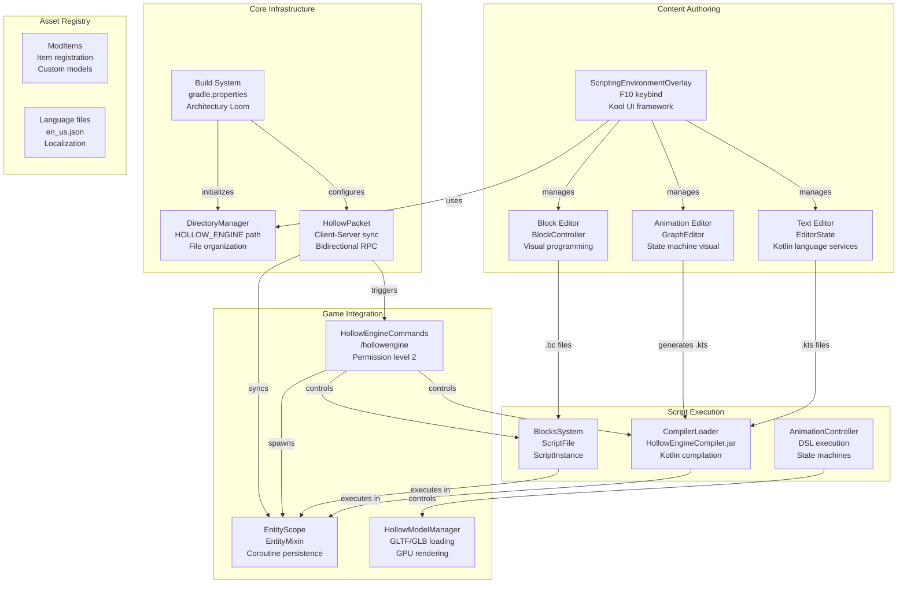

**Sources:** [build.gradle.kts:1-148](), [src/main/java/ru/hollowhorizon/hollowengine/HollowEngine.kt:1-34](), [src/main/java/ru/hollowhorizon/hollowengine/common/commands/HollowEngineCommands.kt:54-303]()

## Subsystem 1: Core Infrastructure

The core infrastructure provides foundational services for all other subsystems.

### Build System

HollowEngine uses Architectury Loom with Gradle for multi-platform Minecraft mod development. The build configuration handles:
- Kotlin compilation and serialization ([build.gradle.kts:3-16]())
- Mixin injection system configuration ([src/main/resources/hollowengine.mixins.json:1-80]())
- Code generation tasks for assets and language files ([build.gradle.kts:122-144]())
- Dependency management including Kool UI, Geary ECS, and serialization libraries ([build.gradle.kts:51-120]())

### Directory Management

`DirectoryManager` provides centralized file system access:

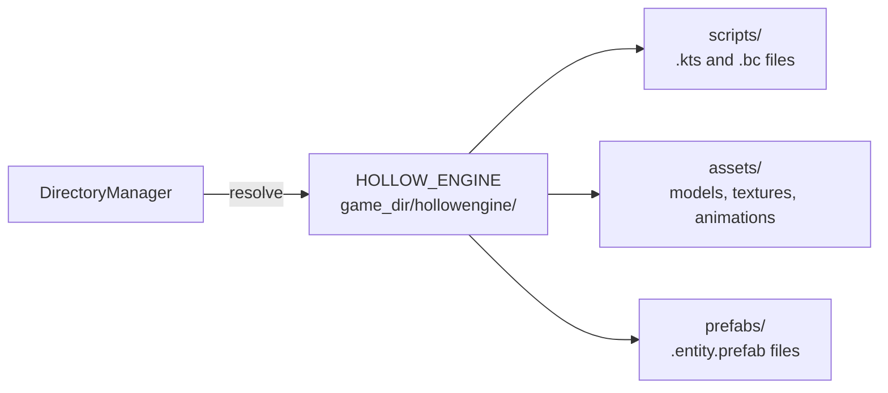

Files are referenced using readable paths (e.g., `"hollowengine:scripts/example.kts"`) that map to physical locations via `toReadablePath()` and `fromReadablePath()` methods.

### Network Layer

The network layer uses `HollowPacket` for bidirectional client-server communication:

| Packet Direction | Example Packets | Purpose |
|------------------|----------------|---------|
| **Client → Server** | `StartScriptPacket`, `StopScriptPacket`, `ReloadServerResourcesPacket` | Script control, resource management |
| **Server → Client** | `CloseScreenPacket`, `ToastPacket`, `ShowModelInfoPacket`, `CopyTextPacket` | UI updates, notifications |

All server-bound packets require permission level 2 (operator/GAMEMASTER) for security ([src/main/java/ru/hollowhorizon/hollowengine/common/commands/HollowEngineCommands.kt:161-224]()).

**Sources:** [build.gradle.kts:1-148](), [src/main/java/ru/hollowhorizon/hollowengine/common/commands/HollowEngineCommands.kt:1-447]()

## Subsystem 2: Content Authoring

The content authoring subsystem provides visual and text-based editors for creating game content.

### IDE Framework

The IDE is accessed via F10 keybind and renders using the Kool UI framework. The main entry point is `ScriptingEnvironmentOverlay`, which manages a docking panel system for different editor types.

**IDE Architecture**

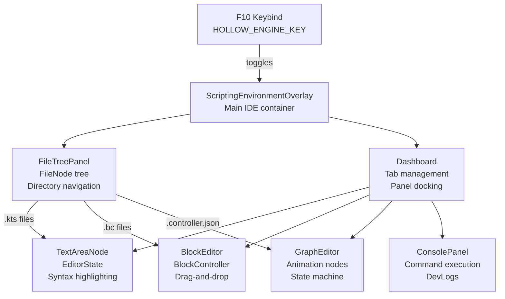

### Editor Types

| Editor | File Extension | Key Classes | Output Format |
|--------|---------------|-------------|---------------|
| **Text Editor** | `.kts` | `EditorState`, `ScriptTextArea`, `CompiledFileProvider` | Kotlin script source |
| **Block Editor** | `.bc` | `BlockController`, `DragState`, `CodeBlockSerializer` | JSON block graph |
| **Animation Editor** | `.controller.json` | `GraphEditor`, `AnimationControllerGraph` | Generated `.animation-controller.kts` |

The IDE supports hot-reload: changes to files are immediately reflected without restarting Minecraft.

**Sources:** [src/main/java/ru/hollowhorizon/hollowengine/common/commands/HollowEngineCommands.kt:54-303]()

## Subsystem 3: Script Execution

The script execution subsystem compiles and runs authored content in three parallel pathways.

### Kotlin Script Compilation

`CompilerLoader` initializes the Kotlin compiler at mod startup ([src/main/java/ru/hollowhorizon/hollowengine/HollowEngine.kt:20-28]()):

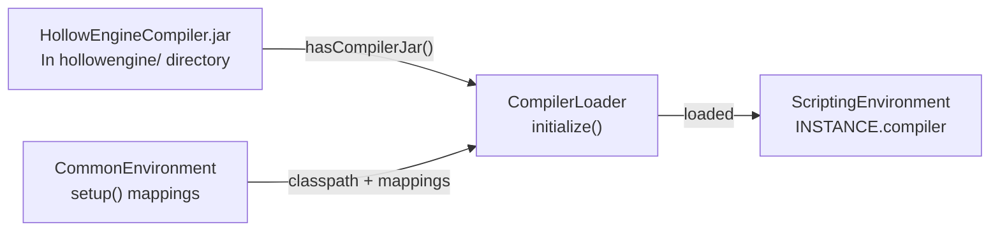

Scripts are compiled via `ScriptingEnvironment.INSTANCE.compiler.compile(file)` and executed directly as Kotlin classes.

### Block Code Execution

`BlocksSystem` manages visual block scripts (`.bc` files):

**Block Execution Pipeline**

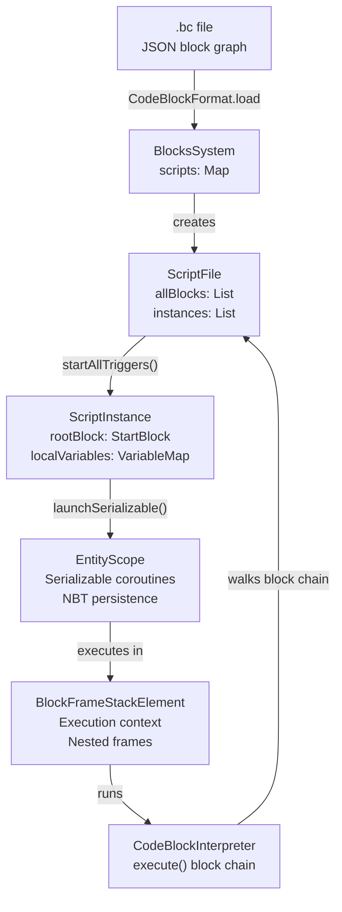

Each `ScriptInstance` runs in an `EntityScope`, which provides:
- **Serializable coroutines**: Scripts suspend and resume across server restarts ([src/main/java/ru/hollowhorizon/hollowengine/common/coroutines/EntityScope.kt:31-273]())
- **Owner binding**: Scripts attach to specific entities via `ownerEntityId` ([src/main/java/ru/hollowhorizon/hollowengine/common/codeblocks/runtime/ScriptInstance.kt:18-221]())
- **State persistence**: Execution progress saved in NBT via `serialize(tag)` ([src/main/java/ru/hollowhorizon/hollowengine/common/codeblocks/runtime/ScriptInstance.kt:188-200]())

### Animation Controllers

Animation editors generate `.animation-controller.kts` files that define state machines. These compile to `AnimationController` instances that update model animations each frame.

**Sources:** [src/main/java/ru/hollowhorizon/hollowengine/HollowEngine.kt:1-34](), [src/main/java/ru/hollowhorizon/hollowengine/common/codeblocks/runtime/BlocksSystem.kt:1-119](), [src/main/java/ru/hollowhorizon/hollowengine/common/codeblocks/runtime/ScriptInstance.kt:1-221](), [src/main/java/ru/hollowhorizon/hollowengine/common/coroutines/EntityScope.kt:31-273]()

### Layer 3: Content Authoring

The IDE layer provides visual editors for creating content:

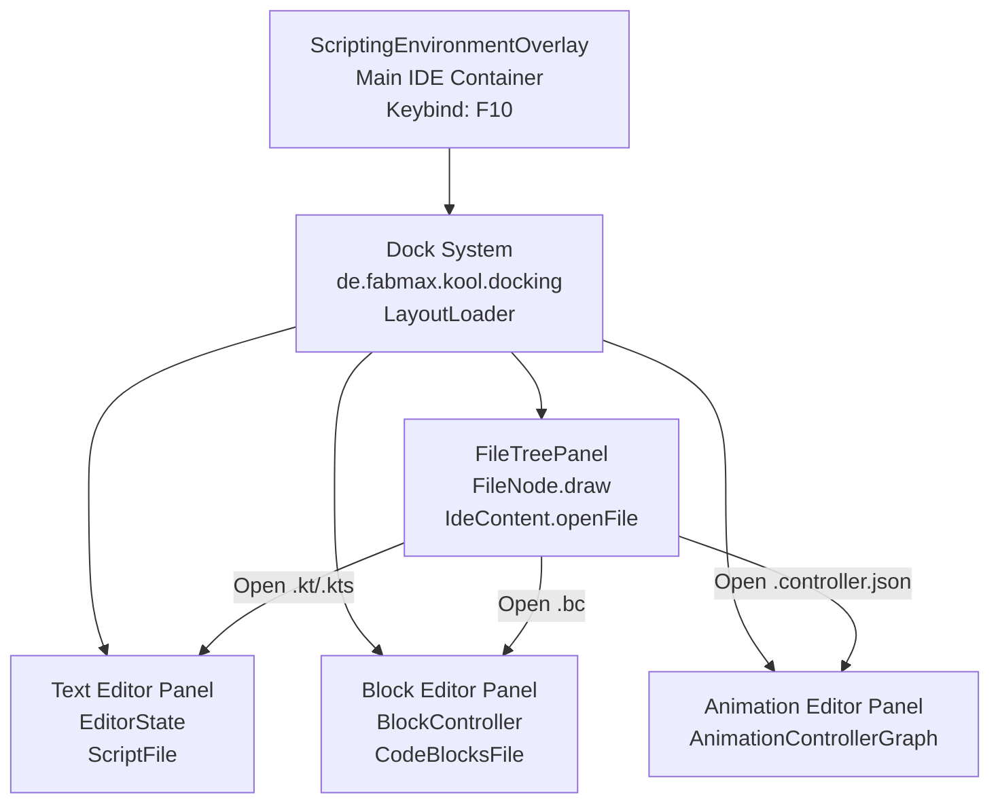

The `LayoutLoader` dynamically registers IDE panels via the `LoadLayoutEvent` ([src/main/java/ru/hollowhorizon/hollowengine/client/gui/scripting/docking/LayoutLoader.kt:12-34]()):

```kotlin
LoadLayoutEvent({ name, layout ->
    LAYOUTS[name] = layout
    layoutOrder.add(name)
}, dock).post()
```

**Sources:** [src/main/java/ru/hollowhorizon/hollowengine/client/gui/scripting/docking/IdeLayouts.kt:1-13](), [src/main/java/ru/hollowhorizon/hollowengine/client/gui/scripting/docking/LayoutLoader.kt:12-38](), [src/main/java/ru/hollowhorizon/hollowengine/client/gui/scripting/panels/FileTreePanel.kt:1-48]()

### Layer 4: Runtime Systems

The runtime layer executes authored content:

| System | Key Classes | Purpose |
|--------|-------------|---------|
| **Entity System** | `GearyPlatform.create()`, `Model`, `Transform` | Manages entities with custom components |
| **Animation Runtime** | `AnimationSystem`, `AnimationDispatcher`, `ModelAttachment` | Plays and blends animations on 3D models |
| **Render Pipeline** | `HollowModelManager`, `AnimatedModel`, `ListRenderPipeline` | Loads and renders GLTF/GLB models |

Entities are created with components that define their behavior. The `Model` component links 3D models and animation controllers to Minecraft entities:

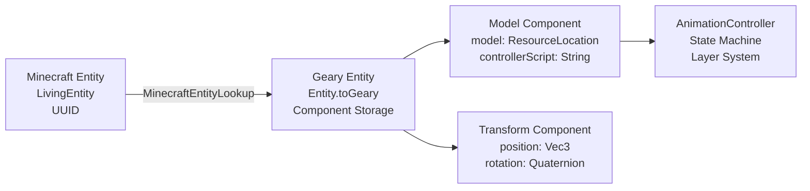

**Sources:** [src/main/java/ru/hollowhorizon/hollowengine/common/geary/GearyPlatform.kt:34-74]()

### Layer 5: Minecraft Integration

The top layer integrates with Minecraft's systems:

- **Mixin System**: Injects custom behavior into Minecraft classes ([src/main/resources/hollowengine.mixins.json:1-80]())
- **Commands**: Provides `/hollowengine` command with subcommands for debugging and management ([src/main/java/ru/hollowhorizon/hollowengine/common/commands/HollowEngineCommands.kt:48-245]())
- **Custom Items**: Registers items with custom models and behaviors

**Sources:** [src/main/resources/hollowengine.mixins.json:1-80](), [src/main/java/ru/hollowhorizon/hollowengine/common/commands/HollowEngineCommands.kt:1-372]()

## Subsystem 4: Game Integration

The game integration subsystem connects HollowEngine to Minecraft's systems.

### Commands System

`HollowEngineCommands` provides the `/hollowengine` command with multiple subcommands ([src/main/java/ru/hollowhorizon/hollowengine/common/commands/HollowEngineCommands.kt:54-303]()):

| Subcommand | Purpose | Permission |
|------------|---------|------------|
| `particle <pos> <name>` | Spawn particle effect at location | Level 2 |
| `model <model>` | Display model animations and textures | Level 2 |
| `hand` | Copy held item to clipboard | Level 2 |
| `codeblocks reload` | Reload all `.bc` scripts | Level 2 |
| `codeblocks start <path>` | Enable specific script | Level 2 |
| `codeblocks stop <path>` | Disable specific script | Level 2 |
| `script run <path>` | Compile and run `.kts` script | Level 2 |
| `script list` | List available Kotlin scripts | Level 2 |
| `script eval <code>` | Evaluate Kotlin code directly | Level 2 |

### Entity System with Coroutine Persistence

`EntityMixin` injects `EntityScope` into all Minecraft entities ([src/main/java/ru/hollowhorizon/hollowengine/mixins/components/EntityMixin.java:34-131]()):

**Entity Integration Architecture**

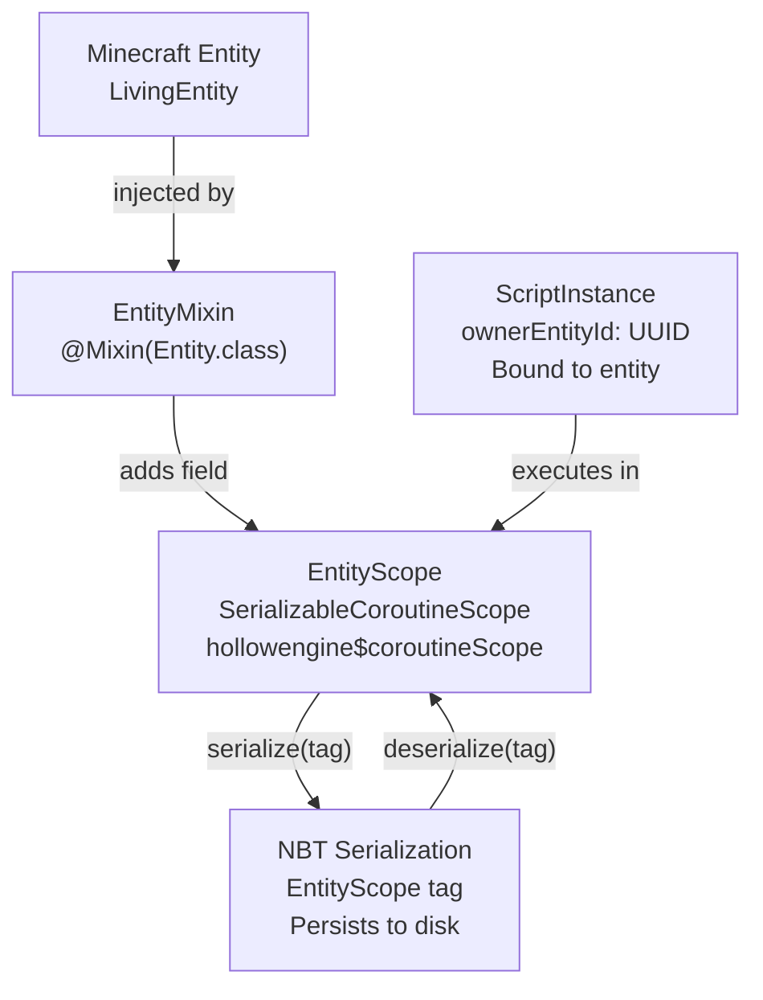

Key methods:
- **`onInit`** ([src/main/java/ru/hollowhorizon/hollowengine/mixins/components/EntityMixin.java:48-52]()): Creates `EntityScope` for each entity
- **`serializeExtra`** ([src/main/java/ru/hollowhorizon/hollowengine/mixins/components/EntityMixin.java:54-62]()): Saves coroutine state to NBT
- **`deserializeExtra`** ([src/main/java/ru/hollowhorizon/hollowengine/mixins/components/EntityMixin.java:64-69]()): Restores coroutine state from NBT and posts `OwnerScopeRestoredEvent`

This allows scripts to:
1. Suspend mid-execution when entity is unloaded
2. Persist state to world save
3. Resume from exact same point when entity reloads

### Model System

Models are loaded via `HollowModelManager` and support:
- GLTF/GLB format with animations
- Hot-reload on resource pack change
- GPU-accelerated skinning and morphing

**Sources:** [src/main/java/ru/hollowhorizon/hollowengine/common/commands/HollowEngineCommands.kt:54-303](), [src/main/java/ru/hollowhorizon/hollowengine/mixins/components/EntityMixin.java:34-131]()

## Subsystem 5: Asset Registry

The asset registry manages static game content:

### Items

`ModItems` registers custom items with models and behaviors. Items are defined in JSON format and loaded at startup.

### Localization

Language files (`en_us.json`, `ru_ru.json`) provide translations. The language editor allows in-game modification of translation keys.

**Sources:** [build.gradle.kts:122-133]()

## Initialization Sequence

HollowEngine initializes in a specific order:

**Mod Initialization Sequence**

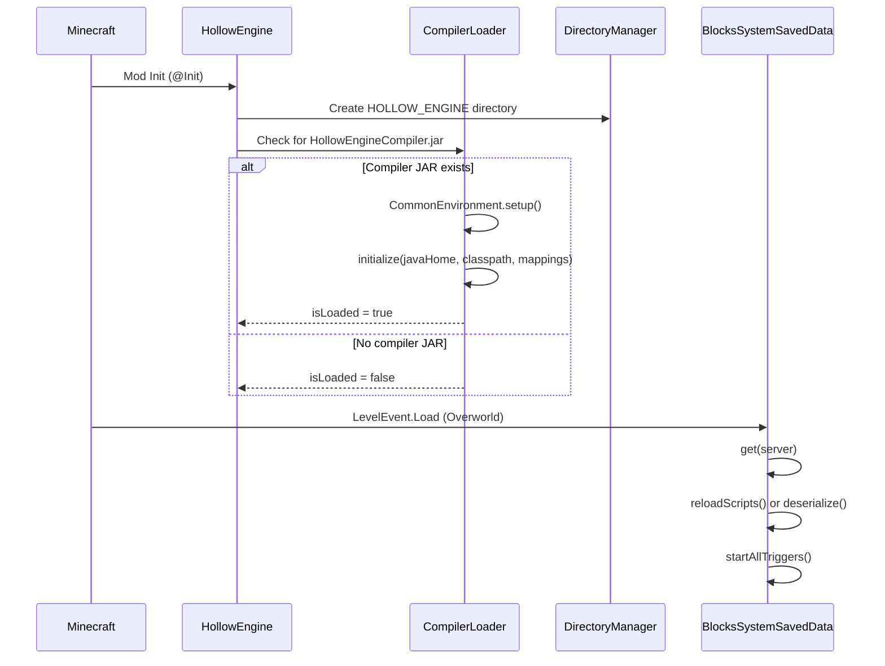

The main initialization occurs in `HollowEngine.init` ([src/main/java/ru/hollowhorizon/hollowengine/HollowEngine.kt:22-28]()):

```kotlin
val compilerLoader = CompilerLoader(
    DirectoryManager.HOLLOW_ENGINE.resolve("HollowEngineCompiler.jar").toFile()
)

if (compilerLoader.hasCompilerJar()) {
    val (mappings, classpath) = CommonEnvironment.setup()
    compilerLoader.initialize(File(System.getProperty("java.home")), classpath, mappings)
}
```

Per-world initialization occurs when the overworld loads ([src/main/java/ru/hollowhorizon/hollowengine/common/codeblocks/runtime/BlocksSystemSavedData.kt:47-54]()):
1. `BlocksSystemSavedData.get(server)` loads or creates the data
2. `BlocksSystem.reloadScripts()` scans `hollowengine/scripts/` for `.bc` files
3. Scripts are parsed via `CodeBlockFormat.loadBlocksWithRecovery(file)`
4. `ScriptFile.startAllTriggers()` registers event listeners for each trigger block

**Sources:** [src/main/java/ru/hollowhorizon/hollowengine/HollowEngine.kt:1-34](), [src/main/java/ru/hollowhorizon/hollowengine/common/codeblocks/runtime/BlocksSystem.kt:54-88](), [src/main/java/ru/hollowhorizon/hollowengine/common/codeblocks/runtime/BlocksSystemSavedData.kt:47-54]()

## Client-Server Architecture

HollowEngine uses client-server separation with the server as authority.

**Network Communication Architecture**

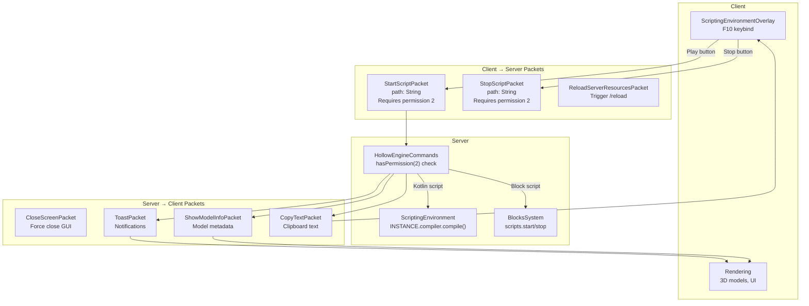

### Security Model

All server-bound script control packets enforce permission level 2 (operator):
- `StartScriptPacket` checks `player.hasPermissions(2)` before compilation ([src/main/java/ru/hollowhorizon/hollowengine/common/commands/HollowEngineCommands.kt:228-256]())
- `StopScriptPacket` checks permission before disabling scripts
- This prevents unauthorized script execution in multiplayer

### Script Execution Flow

1. User clicks play button in IDE
2. Client sends `StartScriptPacket(readablePath)`
3. Server validates permission level 2
4. Server determines file type (`.kts` or `.bc`)
5. For `.kts`: Compile via `ScriptingEnvironment.INSTANCE.compiler.compile(file)`
6. For `.bc`: Enable via `BlocksSystem.scripts[path].setEnabled(true)`
7. Server sends `ToastPacket` with success/failure message

**Sources:** [src/main/java/ru/hollowhorizon/hollowengine/common/commands/HollowEngineCommands.kt:54-303]()

## Data Flow: Visual Blocks to Execution

The complete lifecycle of a visual block script from authoring to execution:

**Visual Block Script Pipeline**

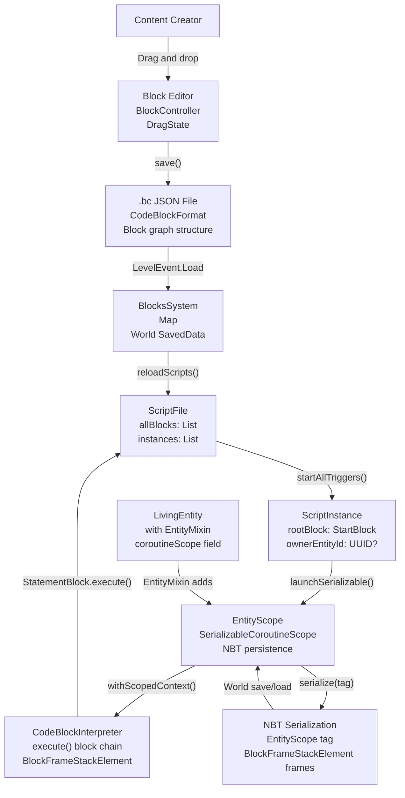

### Execution Lifecycle

1. **Authoring**: User creates blocks in `BlockEditor` via drag-and-drop
2. **Serialization**: `CodeBlockSerializer` saves block graph to `.bc` JSON file ([src/main/java/ru/hollowhorizon/hollowengine/common/codeblocks/runtime/BlocksSystem.kt:60-84]())
3. **Loading**: `BlocksSystem.reloadScripts()` scans directory and parses files
4. **Instance Creation**: `ScriptFile.startAllTriggers()` creates `ScriptInstance` for each trigger block ([src/main/java/ru/hollowhorizon/hollowengine/common/codeblocks/runtime/ScriptFile.kt:61-71]())
5. **Execution**: `ScriptInstance.start()` launches coroutine in `EntityScope` ([src/main/java/ru/hollowhorizon/hollowengine/common/codeblocks/runtime/ScriptInstance.kt:55-69]())
6. **Interpretation**: `CodeBlockInterpreter` walks the block chain, executing each statement ([src/main/java/ru/hollowhorizon/hollowengine/common/codeblocks/execution/CodeBlockInterpreter.kt:21-44]())
7. **Persistence**: If suspended (entity unloaded), state saves to NBT and resumes on reload

### State Persistence Mechanism

`EntityScope` provides serializable coroutines that persist across server restarts:

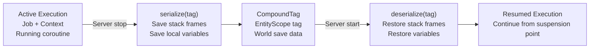

Key methods:
- `EntityScope.serialize(tag)`: Saves all active and queued executions ([src/main/java/ru/hollowhorizon/hollowengine/common/coroutines/EntityScope.kt:40-55]())
- `EntityScope.deserialize(tag)`: Restores executions and registers definitions ([src/main/java/ru/hollowhorizon/hollowengine/common/coroutines/EntityScope.kt:57-77]())
- `BlockFrameStackElement`: Stores execution stack with local variables ([src/main/java/ru/hollowhorizon/hollowengine/common/codeblocks/execution/BlockFrameStackElement.kt:17-60]())

**Sources:** [src/main/java/ru/hollowhorizon/hollowengine/common/codeblocks/runtime/BlocksSystem.kt:54-88](), [src/main/java/ru/hollowhorizon/hollowengine/common/codeblocks/runtime/ScriptFile.kt:61-127](), [src/main/java/ru/hollowhorizon/hollowengine/common/codeblocks/runtime/ScriptInstance.kt:55-216](), [src/main/java/ru/hollowhorizon/hollowengine/common/coroutines/EntityScope.kt:31-273](), [src/main/java/ru/hollowhorizon/hollowengine/common/codeblocks/execution/CodeBlockInterpreter.kt:21-44](), [src/main/java/ru/hollowhorizon/hollowengine/common/codeblocks/execution/BlockFrameStackElement.kt:17-60]()

## Script Lifecycle Management

Scripts have a well-defined lifecycle with multiple trigger policies and execution states.

### Trigger Types and Policies

Scripts can be triggered by:
- **Events**: Event-driven start blocks (e.g., `OnPlayerChatBlock`) register listeners ([src/main/java/ru/hollowhorizon/hollowengine/common/codeblocks/blocks/players/OnPlayerChatBlock.kt:1-86]())
- **Signals**: Custom signals emitted via `emitSignal()` or `callSignal()`
- **Manual**: `/hollowengine codeblocks start` command

Each trigger has a `RepeatPolicy` that controls re-triggering behavior:

| Policy | Behavior | Use Case |
|--------|----------|----------|
| `PARALLEL` | Launch new instance immediately | Independent, parallel tasks |
| `IGNORE` | Drop new trigger if already running | One-time setup scripts |
| `RESTART` | Cancel old, start new | Player state machines |
| `QUEUE` | Wait for current to finish | Sequential processing |

**Lifecycle State Diagram**

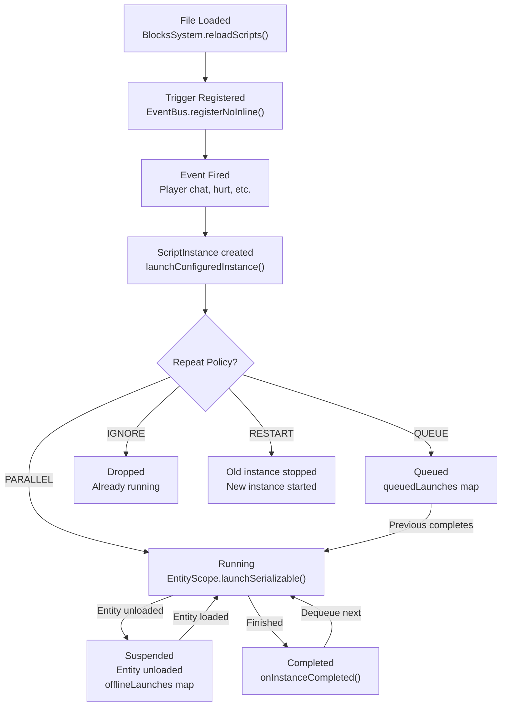

### Owner-Entity Binding

Scripts can bind to specific entities via `ownerEntityId`. When bound:
1. Script executes in that entity's `EntityScope` ([src/main/java/ru/hollowhorizon/hollowengine/common/codeblocks/runtime/ScriptInstance.kt:101-103]())
2. If entity is unloaded, script suspends and moves to `offlineLaunches` ([src/main/java/ru/hollowhorizon/hollowengine/common/codeblocks/runtime/ScriptFile.kt:334-346]())
3. When entity reloads, `OwnerScopeRestoredEvent` fires and script resumes ([src/main/java/ru/hollowhorizon/hollowengine/common/codeblocks/runtime/OwnerScopeRestoredEvent.kt:1-9]())
4. On world save, entity's `EntityScope` serializes all bound scripts to NBT ([src/main/java/ru/hollowhorizon/hollowengine/mixins/components/EntityMixin.java:54-62]())

This enables scripts to "follow" entities across chunk boundaries and server restarts.

**Sources:** [src/main/java/ru/hollowhorizon/hollowengine/common/codeblocks/runtime/ScriptFile.kt:29-358](), [src/main/java/ru/hollowhorizon/hollowengine/common/codeblocks/runtime/ScriptInstance.kt:18-221](), [src/main/java/ru/hollowhorizon/hollowengine/common/codeblocks/blocks/players/OnPlayerChatBlock.kt:1-86](), [src/main/java/ru/hollowhorizon/hollowengine/mixins/components/EntityMixin.java:34-131](), [src/main/java/ru/hollowhorizon/hollowengine/common/codeblocks/runtime/OwnerScopeRestoredEvent.kt:1-9]()

## Extension Mechanism

HollowEngine is designed for extensibility through its annotation-based registration system:

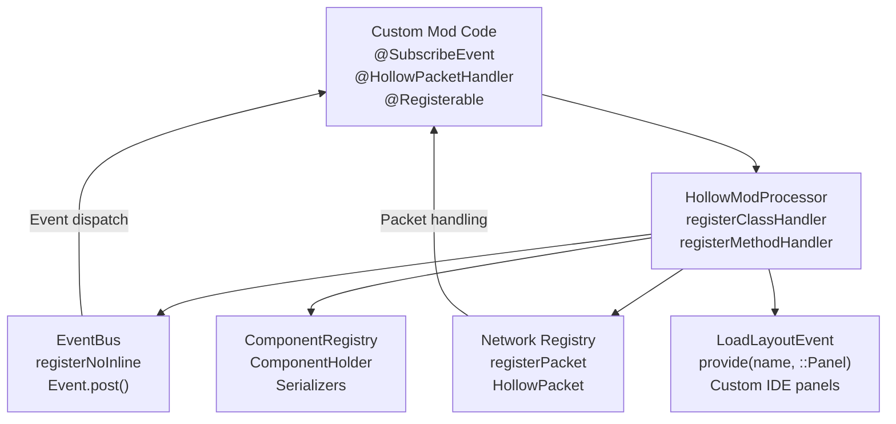

**Extension Points:**

1. **Event Handlers** ([src/main/java/ru/hollowhorizon/hollowengine/common/registry/HollowModProcessor.kt:38-46]()):
```kotlin
registerMethodHandler<SubscribeEvent> { method, _ ->
    val listener = if (method.isStatic()) {
        handles.createStaticEventListener(method)
    } else {
        val obj = method.declaringClass.kotlin.objectInstance ?: return@registerMethodHandler
        handles.createEventListener(method, obj)
    }
    EventBus.registerNoInline(method.parameterTypes[0] as Class<Event>, listener)
}
```

2. **Network Packets** ([src/main/java/ru/hollowhorizon/hollowengine/common/registry/HollowModProcessor.kt:56-63]()):
```kotlin
registerClassHandler<HollowPacketHandler> { type, _ ->
    if (HollowPacket::class.java.isAssignableFrom(type)) 
        runnables += Runnable { registerPacket(type) }
}
```

3. **ECS Components** ([src/main/java/ru/hollowhorizon/hollowengine/common/registry/HollowModProcessor.kt:98-103]()):
```kotlin
registerClassHandler<Registerable> { type, annotation ->
    val component = type.kotlin
    val serializer = component.serializerOrNull() ?: error(...)
    val key = component.findAnnotation<SerialName>()?.value?.rl ?: error(...)
    ComponentRegistry.register(key) { ComponentHolder(component, JavaHacks.forceCast(serializer)) }
}
```

4. **IDE Panels** ([src/main/java/ru/hollowhorizon/hollowengine/client/gui/scripting/docking/IdeLayouts.kt:6-13]()):
```kotlin
@SubscribeEvent
fun loadLayouts(event: LoadLayoutEvent) {
    event.provide("hollowengine.gui.ide.project_tree", ::FileTreePanel)
    event.provide("hollowengine.gui.ide.console", ::ConsolePanel)
    event.provide("hollowengine.gui.ide.docs", ::DocsPanel)
    // ...
}
```

**Sources:** [src/main/java/ru/hollowhorizon/hollowengine/common/registry/HollowModProcessor.kt:34-149](), [src/main/java/ru/hollowhorizon/hollowengine/client/gui/scripting/docking/IdeLayouts.kt:1-13]()

## Key Architectural Principles

1. **Annotation-Driven Registration**: All major systems use annotations for automatic discovery and registration, reducing boilerplate code

2. **Server Authority**: The server is the source of truth for all game state; clients receive synchronized copies

3. **Layered Design**: Each layer depends only on layers below it, preventing circular dependencies

4. **Event-Driven Communication**: Systems communicate through `EventBus` rather than direct coupling

5. **Plugin Architecture**: Third-party code can extend the system by annotating classes and implementing interfaces

6. **Separation of Concerns**: Content authoring (IDE), compilation (scripting), and execution (runtime) are distinct subsystems

**Sources:** [src/main/java/ru/hollowhorizon/hollowengine/common/registry/HollowModProcessor.kt:34-149](), [gradle.properties:1-22](), [build.gradle.kts:1-146]()