# 3D Model System

<details>
<summary>Relevant source files</summary>

The following files were used as context for generating this wiki page:

- [src/main/java/ru/hollowhorizon/hollowengine/client/models/gltf/GltfModelLoader.kt](src/main/java/ru/hollowhorizon/hollowengine/client/models/gltf/GltfModelLoader.kt)
- [src/main/java/ru/hollowhorizon/hollowengine/client/models/gltf/GltfTexture.kt](src/main/java/ru/hollowhorizon/hollowengine/client/models/gltf/GltfTexture.kt)
- [src/main/java/ru/hollowhorizon/hollowengine/client/models/internal/Primitive.kt](src/main/java/ru/hollowhorizon/hollowengine/client/models/internal/Primitive.kt)
- [src/main/java/ru/hollowhorizon/hollowengine/client/models/internal/manager/HollowModelManager.kt](src/main/java/ru/hollowhorizon/hollowengine/client/models/internal/manager/HollowModelManager.kt)
- [src/main/java/ru/hollowhorizon/hollowengine/client/models/internal/manager/ModelReloadCoordinator.kt](src/main/java/ru/hollowhorizon/hollowengine/client/models/internal/manager/ModelReloadCoordinator.kt)
- [src/main/java/ru/hollowhorizon/hollowengine/client/models/internal/rendering/GpuDeformer.kt](src/main/java/ru/hollowhorizon/hollowengine/client/models/internal/rendering/GpuDeformer.kt)
- [src/main/java/ru/hollowhorizon/hollowengine/client/models/internal/v2/ModelAttachment.kt](src/main/java/ru/hollowhorizon/hollowengine/client/models/internal/v2/ModelAttachment.kt)
- [src/main/java/ru/hollowhorizon/hollowengine/common/items/NpcTool.kt](src/main/java/ru/hollowhorizon/hollowengine/common/items/NpcTool.kt)
- [src/main/java/ru/hollowhorizon/hollowengine/mixins/client/MultiplayerGameModeMixin.java](src/main/java/ru/hollowhorizon/hollowengine/mixins/client/MultiplayerGameModeMixin.java)
- [src/main/resources/assets/hollowengine/shaders/core/gltf_skinning.vsh](src/main/resources/assets/hollowengine/shaders/core/gltf_skinning.vsh)
- [src/test/kotlin/ModelReloadCoordinatorTests.kt](src/test/kotlin/ModelReloadCoordinatorTests.kt)

</details>


## Purpose and Scope

The 3D Model System manages the loading, caching, hot-reloading, and GPU-accelerated rendering of 3D models in HollowEngine. It supports multiple model formats (GLTF, GLB, OBJ, FBX, Bedrock), handles skeletal animation skinning and blend shape morphing through Transform Feedback shaders, and provides a reactive hot-reload mechanism that allows models to be updated without restarting the game.

For information about animation playback and state machines, see [Animation System](#8). For entity integration and script attachment, see [Entity System](#10.4).

**Sources:** [src/main/java/ru/hollowhorizon/hollowengine/client/models/internal/manager/HollowModelManager.kt:1-292](), [src/main/java/ru/hollowhorizon/hollowengine/client/models/internal/v2/ModelAttachment.kt:1-127]()

---

## System Architecture

The 3D Model System consists of four major subsystems: a centralized model manager with pluggable loaders, in-memory data structures representing model hierarchies, runtime attachments for scene graph management, and a GPU deformation pipeline for skinning and morphing.

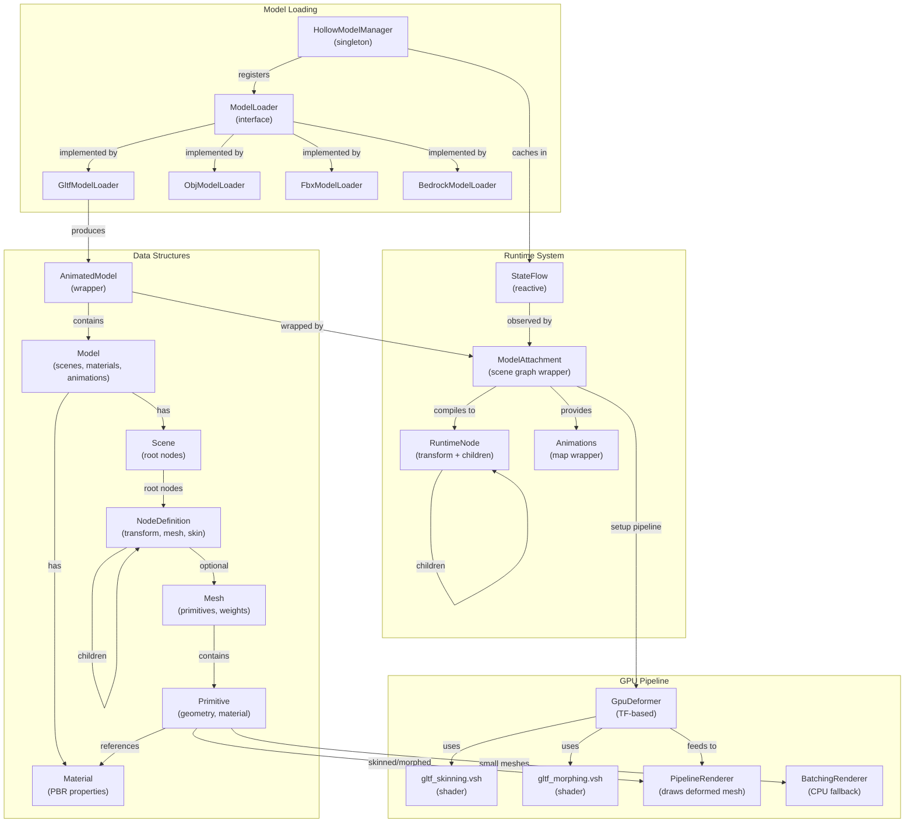

**Model Loading Process:**
The `HollowModelManager` singleton maintains a registry of `ModelLoader` implementations, each supporting specific file formats. When a model is requested via `getOrCreate(ResourceLocation)`, the manager returns a `StateFlow<AnimatedModel>` that can be observed for hot-reload updates.

**Data Structure Hierarchy:**
Models are parsed into immutable `AnimatedModel` wrappers containing a `Model` with one or more `Scene` instances. Each scene contains a tree of `NodeDefinition` instances representing the scene graph hierarchy. Nodes may reference `Mesh` instances, which contain `Primitive` geometry with `Material` properties.

**Runtime Compilation:**
`ModelAttachment` observes the `StateFlow` and compiles the model data into a mutable `RuntimeNode` tree whenever the model changes. This compilation process creates animation instances, resolves node index mappings, and sets up rendering pipelines.

**GPU Acceleration:**
`Primitive` instances with skinning or morph targets use `PipelineRenderer` backed by `GpuDeformer`, which leverages Transform Feedback to compute deformed vertex positions, normals, and tangents on the GPU. Small, static meshes use `BatchingRenderer` for CPU-based rendering.

**Sources:** [src/main/java/ru/hollowhorizon/hollowengine/client/models/internal/manager/HollowModelManager.kt:39-247](), [src/main/java/ru/hollowhorizon/hollowengine/client/models/gltf/GltfModelLoader.kt:16-201](), [src/main/java/ru/hollowhorizon/hollowengine/client/models/internal/v2/ModelAttachment.kt:21-113](), [src/main/java/ru/hollowhorizon/hollowengine/client/models/internal/Primitive.kt:12-100]()

---

## Model Data Structures

The system uses a layered data structure approach: immutable file representations at the top, persistent scene graph definitions in the middle, and runtime mutable state at the bottom.

### Core Model Classes

| Class | Purpose | Key Fields |
|-------|---------|------------|
| `AnimatedModel` | Top-level wrapper for a loaded model | `model: Model` |
| `Model` | Contains scenes, materials, and animations | `scenes: List<Scene>`, `materials: Set<Material>`, `animations: List<Animation>`, `scene: Int` (default scene index) |
| `Scene` | Root container for a scene graph | `nodes: List<NodeDefinition>` |
| `NodeDefinition` | Scene graph node with transform and optional mesh | `index: Int`, `name: String`, `children: MutableList<NodeDefinition>`, `baseTransform: TrsTransformF`, `mesh: Mesh?`, `skin: Skin?` |
| `Mesh` | Container for geometric primitives | `primitives: List<Primitive>`, `weights: FloatArray` |
| `Primitive` | Geometry with vertex attributes and material | `positions: Array<Vec3f>?`, `normals: Array<Vec3f>?`, `texCoords: Array<Vec2f>?`, `tangents: Array<Vec4f>?`, `joints: Array<Vec4i>?`, `jointWeights: Array<Vec4f>?`, `indices: IntArray?`, `material: Material`, `morphTargets: List<Map<String, FloatArray>>`, `weights: FloatArray` |
| `Material` | PBR material properties | `baseColorTexture`, `normalTexture`, `metallicRoughnessTexture`, `emissiveTexture`, PBR factors |

### Scene Graph Hierarchy

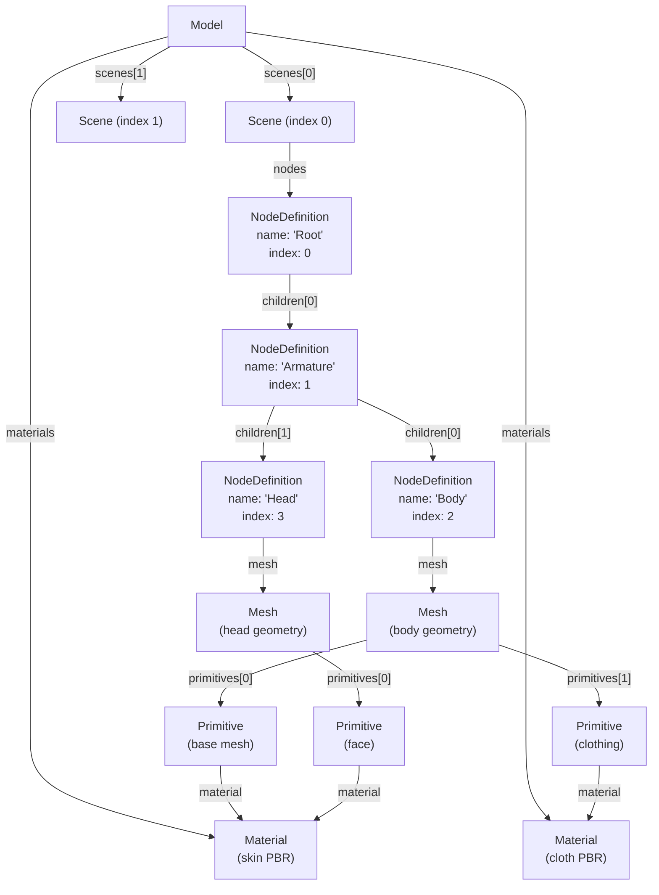

**Node Indexing:**
Each `NodeDefinition` receives a unique index during parsing. This index is used by animation systems to target specific nodes and by skin systems to reference joint matrices. The `NodeDefinition.parent` field creates bidirectional parent-child relationships.

**Transform System:**
Each node stores a `TrsTransformF` (Translation-Rotation-Scale) that represents its local transformation relative to its parent. The GLTF loader parses either a 4x4 matrix or separate TRS components into this unified representation.

**Mesh-Node Relationship:**
A `NodeDefinition` may optionally reference a `Mesh`. Multiple nodes can share the same mesh instance (instancing). Each mesh contains one or more `Primitive` instances, allowing different materials to be applied to different parts of the same mesh.

**Sources:** [src/main/java/ru/hollowhorizon/hollowengine/client/models/gltf/GltfModelLoader.kt:26-69](), [src/main/java/ru/hollowhorizon/hollowengine/client/models/gltf/GltfModelLoader.kt:96-172]()

---

## Model Loading Pipeline

Models are loaded asynchronously through a format-agnostic pipeline that discovers appropriate loaders, parses files into structured data, and caches results in reactive `StateFlow` containers.

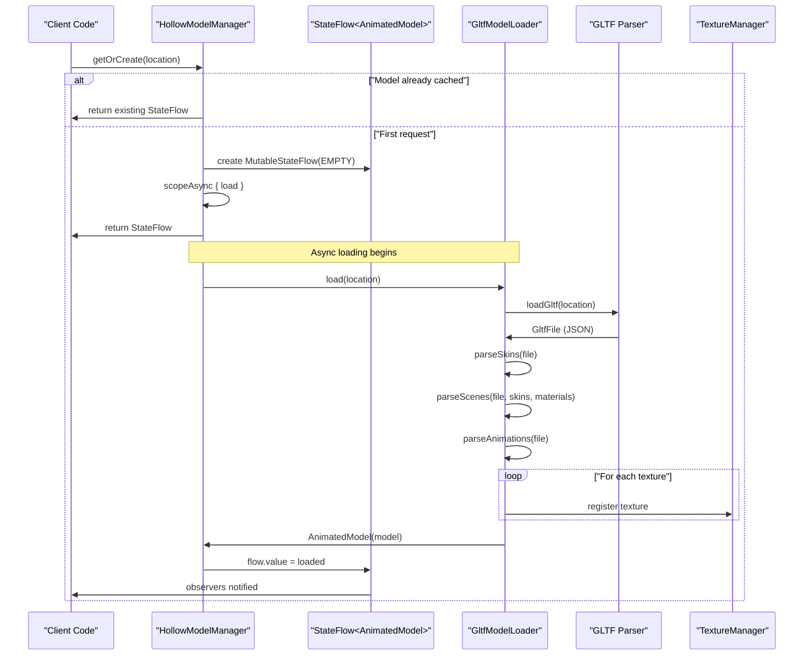

### Loader Registration

The system uses an event-driven loader registration mechanism:

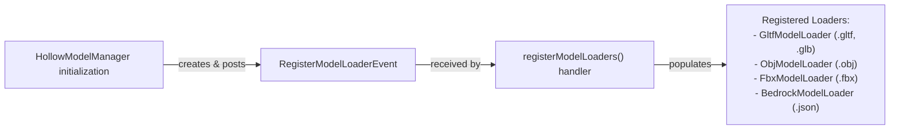

**Extension Detection:**
When loading a model, the manager extracts the file extension from the `ResourceLocation.path` and queries registered loaders for one that supports that format via `ModelLoader.supportedFormats`.

**Loader Interface:**
All loaders implement the `ModelLoader` interface with a single method: `suspend fun load(location: ResourceLocation, side: ModelSide): AnimatedModel`. The `ModelSide` parameter allows loaders to skip client-only data (textures, normals) on the server.

**Sources:** [src/main/java/ru/hollowhorizon/hollowengine/client/models/internal/manager/HollowModelManager.kt:46-76](), [src/main/java/ru/hollowhorizon/hollowengine/client/models/internal/manager/HollowModelManager.kt:249-279]()

### GLTF Loading Process

The `GltfModelLoader` demonstrates the typical loading process:

1. **File Parsing:** The GLTF JSON is parsed into a `GltfFile` data structure with accessor references.

2. **Skin Parsing:** Inverse bind matrices are extracted from accessors and stored in `Skin` objects [src/main/java/ru/hollowhorizon/hollowengine/client/models/gltf/GltfModelLoader.kt:72-79]().

3. **Material Parsing:** Materials are converted to internal `Material` objects with texture references resolved [src/main/java/ru/hollowhorizon/hollowengine/client/models/gltf/GltfModelLoader.kt:28-30]().

4. **Scene Parsing:** Each scene's node hierarchy is traversed recursively, creating `NodeDefinition` trees [src/main/java/ru/hollowhorizon/hollowengine/client/models/gltf/GltfModelLoader.kt:82-94]().

5. **Node Parsing:** For each node:
   - Child nodes are parsed recursively
   - Mesh primitives are parsed with vertex attributes (positions, normals, UVs, joints, weights)
   - Morph targets are extracted as delta arrays
   - Transform matrices or TRS components are converted to `TrsTransformF`
   
   [src/main/java/ru/hollowhorizon/hollowengine/client/models/gltf/GltfModelLoader.kt:96-172]()

6. **Animation Parsing:** Animation channels and samplers are parsed and converted to internal `Animation` format [src/main/java/ru/hollowhorizon/hollowengine/client/models/gltf/GltfModelLoader.kt:192-199]().

7. **Texture Registration:** Textures are registered with Minecraft's `TextureManager` either from embedded base64 data or external file references [src/main/java/ru/hollowhorizon/hollowengine/client/models/gltf/GltfTexture.kt:33-80]().

**BlockBench Detection:**
The loader detects if a model was exported from BlockBench by checking `GltfFile.asset.generator` and sets a flag that causes `ModelAttachment` to apply a 180° Y-axis rotation [src/main/java/ru/hollowhorizon/hollowengine/client/models/gltf/GltfModelLoader.kt:55]().

**Sources:** [src/main/java/ru/hollowhorizon/hollowengine/client/models/gltf/GltfModelLoader.kt:19-69]()

---

## Scene Graph and Runtime Attachments

The `ModelAttachment` class bridges immutable model data and mutable runtime state, compiling scene graphs into transform hierarchies and providing animation playback infrastructure.

### ModelAttachment Lifecycle

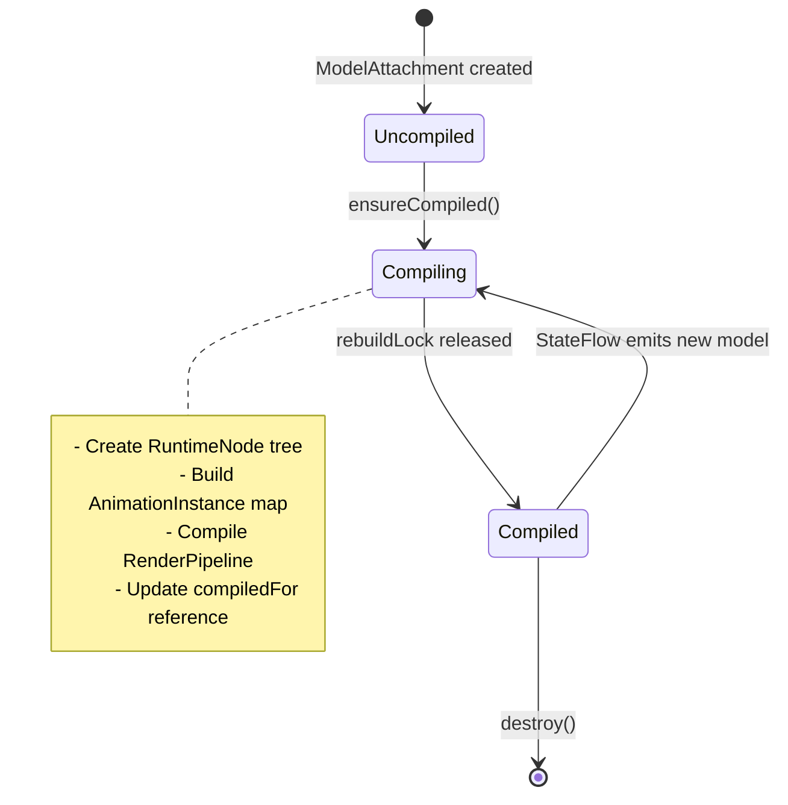

**Reactive Observation:**
On construction, `ModelAttachment` observes its `StateFlow<AnimatedModel>` parameter and re-compiles whenever a new model is emitted [src/main/java/ru/hollowhorizon/hollowengine/client/models/internal/v2/ModelAttachment.kt:44-46]().

**Lazy Compilation:**
The `ensureCompiled()` method uses a `synchronized` block on `rebuildLock` to ensure thread-safe compilation. The `compiledFor` reference equality check (`===`) prevents redundant compilation [src/main/java/ru/hollowhorizon/hollowengine/client/models/internal/v2/ModelAttachment.kt:65-84]().

**Sources:** [src/main/java/ru/hollowhorizon/hollowengine/client/models/internal/v2/ModelAttachment.kt:21-84]()

### RuntimeNode Tree

`RuntimeNode` wraps a `NodeDefinition` with mutable runtime state:

| Property | Type | Purpose |
|----------|------|---------|
| `definition` | `NodeDefinition` | Immutable node data (name, index, base transform, mesh) |
| `parent` | `RuntimeNode?` | Parent node reference (null for root) |
| `attachment` | `ModelAttachment` | Back-reference to owning attachment |
| `transform` | `TrsTransformF` | Mutable local transform (animated) |
| `children` | `List<RuntimeNode>` | Child nodes in scene hierarchy |

**Transform Updates:**
During each frame update, transforms are reset to their base values, then animation deltas are applied [src/main/java/ru/hollowhorizon/hollowengine/client/models/internal/v2/ModelAttachment.kt:86-101]().

**Node Lookup:**
`ModelAttachment` provides:
- `nodes: List<RuntimeNode>` - root-level runtime nodes
- `child(name: String): RuntimeNode` - lookup by node name
- Internal `nodeIdToNode: Map<Int, RuntimeNode>` - lookup by node index for animations

**Sources:** [src/main/java/ru/hollowhorizon/hollowengine/client/models/internal/v2/ModelAttachment.kt:76-112]()

### Animation Integration

The `Animations` wrapper class provides type-safe access to animation instances:

```kotlin
class Animations(private val map: Map<String, AnimationInstance>) : Collection<AnimationInstance> {
    operator fun get(name: String): AnimationInstance = map[name] ?: error("Animation $name not found")
    // Collection implementation...
}
```

**Animation Update Loop:**
In `ModelAttachment.update()`, all active `AnimationInstance` objects in the `Animations` collection receive the frame delta and apply transform deltas to the `nodeIdToTransform` map [src/main/java/ru/hollowhorizon/hollowengine/client/models/internal/v2/ModelAttachment.kt:98-100]().

**Update Hooks:**
`ModelAttachment.onUpdate(action: ModelAttachment.() -> Unit)` allows external code to register callbacks that execute each frame before animation updates [src/main/java/ru/hollowhorizon/hollowengine/client/models/internal/v2/ModelAttachment.kt:61-63](), [src/main/java/ru/hollowhorizon/hollowengine/client/models/internal/v2/ModelAttachment.kt:96]().

**Sources:** [src/main/java/ru/hollowhorizon/hollowengine/client/models/internal/v2/ModelAttachment.kt:86-126]()

---

## GPU Rendering Pipeline

The rendering pipeline uses OpenGL Transform Feedback to perform skeletal skinning and blend shape morphing on the GPU, avoiding expensive CPU vertex transformation for animated models.

### Primitive Rendering Strategy

`Primitive` selects a rendering strategy based on geometry characteristics:

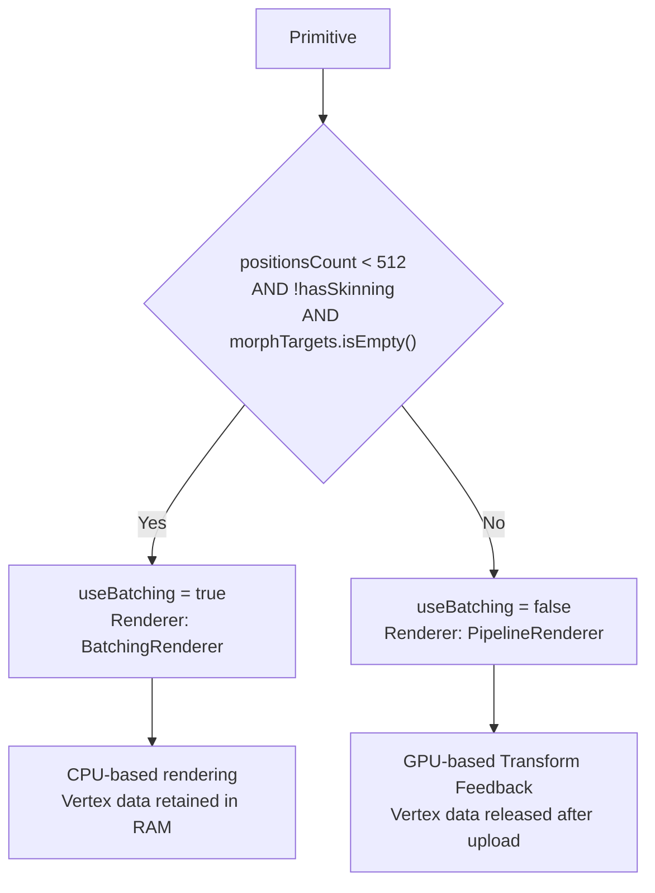

**Batching Threshold:**
Small static meshes (< 512 vertices, no skinning, no morphing) use `BatchingRenderer` which keeps vertex data in CPU memory for direct rendering. This avoids GPU setup overhead for simple geometry [src/main/java/ru/hollowhorizon/hollowengine/client/models/internal/Primitive.kt:29]().

**CPU Memory Release:**
After `init()`, non-batching primitives call `releaseCpu()` to set vertex attribute arrays to `null`, reclaiming memory since the data now resides in GPU buffers [src/main/java/ru/hollowhorizon/hollowengine/client/models/internal/Primitive.kt:58](), [src/main/java/ru/hollowhorizon/hollowengine/client/models/internal/Primitive.kt:75-85]().

**Sources:** [src/main/java/ru/hollowhorizon/hollowengine/client/models/internal/Primitive.kt:29](), [src/main/java/ru/hollowhorizon/hollowengine/client/models/internal/Primitive.kt:37-73]()

### GpuDeformer Transform Feedback

`GpuDeformer` uses OpenGL 3.3 Transform Feedback to compute deformed vertex positions, normals, and tangents in a geometry shader pass.

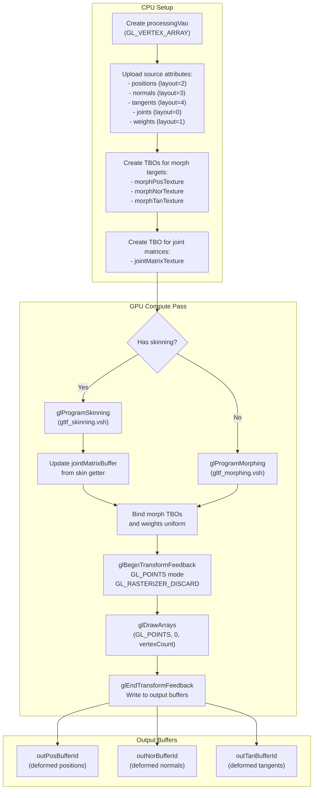

**Initialization:**
`GpuDeformer.init()` creates a dedicated VAO (`processingVao`) and uploads source vertex attributes to VBOs. Morph target deltas are packed into texture buffer objects (TBOs) for random access in shaders [src/main/java/ru/hollowhorizon/hollowengine/client/models/internal/rendering/GpuDeformer.kt:39-110]().

**Morph Target Storage:**
Morph deltas for positions, normals, and tangents are stored in separate TBOs as `RGBA32F` textures. Each morph target's deltas are stored contiguously: `index = (targetIndex * vertexCount) + vertexId` [src/main/java/ru/hollowhorizon/hollowengine/client/models/internal/rendering/GpuDeformer.kt:112-163]().

**Joint Matrix Updates:**
For skinned meshes, the `compute()` method receives a `SkinGetter` lambda that provides current joint matrices. These are uploaded to the `jointMatrixBuffer` TBO each frame [src/main/java/ru/hollowhorizon/hollowengine/client/models/internal/rendering/GpuDeformer.kt:217-230]().

**Transform Feedback Pass:**
The compute pass:
1. Binds the appropriate shader program (skinning or morphing)
2. Binds TBOs to texture units
3. Sets uniforms (morph weights, vertex count, morph count)
4. Binds output buffers to `GL_TRANSFORM_FEEDBACK_BUFFER` targets (0=position, 1=normal, 2=tangent)
5. Executes `glDrawArrays(GL_POINTS)` with `GL_RASTERIZER_DISCARD` enabled
6. Vertex shader writes to `out` variables which are captured by Transform Feedback

[src/main/java/ru/hollowhorizon/hollowengine/client/models/internal/rendering/GpuDeformer.kt:179-215]()

**Sources:** [src/main/java/ru/hollowhorizon/hollowengine/client/models/internal/rendering/GpuDeformer.kt:13-280]()

### Skinning and Morphing Shaders

The vertex shaders perform a two-stage deformation: morph targets first, then skeletal skinning.

**Morph Target Application:**
```glsl
// From gltf_skinning.vsh lines 23-47
vec3 morphedPos = position;
vec3 morphedNor = normal;
vec3 morphedTan = tangent.xyz;

int vertId = gl_VertexID;

for (int i = 0; i < activeMorphCount; i++) {
    float w = morphWeights[i];
    
    if (abs(w) > 0.0001) {
        int bufferIndex = (i * vertexCount) + vertId;
        
        vec3 dPos = texelFetch(morphDeltasPosition, bufferIndex).xyz;
        vec3 dNor = texelFetch(morphDeltasNormal, bufferIndex).xyz;
        vec3 dTan = texelFetch(morphDeltasTangent, bufferIndex).xyz;
        
        morphedPos += dPos * w;
        morphedNor += dNor * w;
        morphedTan += dTan * w;
    }
}
```

**Skeletal Skinning:**
```glsl
// From gltf_skinning.vsh lines 49-74
mat4 skinMatrix = weight.x * mat4(
    texelFetch(jointMatrices, jx),
    texelFetch(jointMatrices, jx + 1),
    texelFetch(jointMatrices, jx + 2),
    texelFetch(jointMatrices, jx + 3)
) + weight.y * mat4(...) + weight.z * mat4(...) + weight.w * mat4(...);

vec4 skinnedPos = skinMatrix * vec4(morphedPos, 1.0);
outPosition = skinnedPos.xyz / skinnedPos.w;

mat3 normalMatrix = transpose(inverse(mat3(skinMatrix)));
outNormal = normalize(normalMatrix * morphedNor);
outTangent.xyz = normalize(normalMatrix * morphedTan);
```

**Joint Matrix Indexing:**
Each joint index is multiplied by 4 because each matrix is stored as 4 consecutive `vec4` values in the TBO. The weighted sum of up to 4 joint matrices creates the final skin matrix [src/main/resources/assets/hollowengine/shaders/core/gltf_skinning.vsh:49-74]().

**Normal Matrix:**
Normals and tangents require the inverse-transpose of the skin matrix's upper-left 3x3 to properly transform directions under non-uniform scaling [src/main/resources/assets/hollowengine/shaders/core/gltf_skinning.vsh:79-83]().

**Sources:** [src/main/resources/assets/hollowengine/shaders/core/gltf_skinning.vsh:1-84]()

### Shader Program Initialization

The `HollowModelManager.initialize()` method compiles and links the Transform Feedback shader programs during mod initialization:

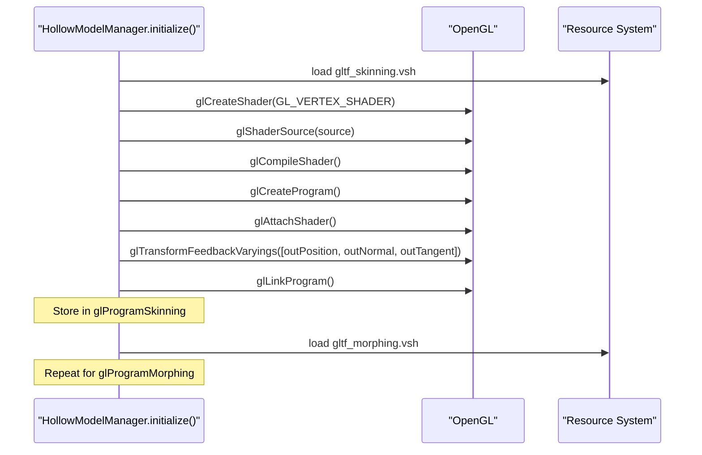

The `glTransformFeedbackVaryings()` call specifies which vertex shader output variables should be captured [src/main/java/ru/hollowhorizon/hollowengine/client/models/internal/manager/HollowModelManager.kt:162-164](), [src/main/java/ru/hollowhorizon/hollowengine/client/models/internal/manager/HollowModelManager.kt:178-180]().

**Default Textures:**
The initialization also creates default 2x2 textures for missing PBR maps (white diffuse, flat normal, black specular) and registers them with the texture manager [src/main/java/ru/hollowhorizon/hollowengine/client/models/internal/manager/HollowModelManager.kt:189-234]().

**Sources:** [src/main/java/ru/hollowhorizon/hollowengine/client/models/internal/manager/HollowModelManager.kt:151-237]()

---

## Hot Reload System

The hot reload system allows models to be replaced at runtime without restarting the game, using reactive `StateFlow` observation and coordinated resource pack reload.

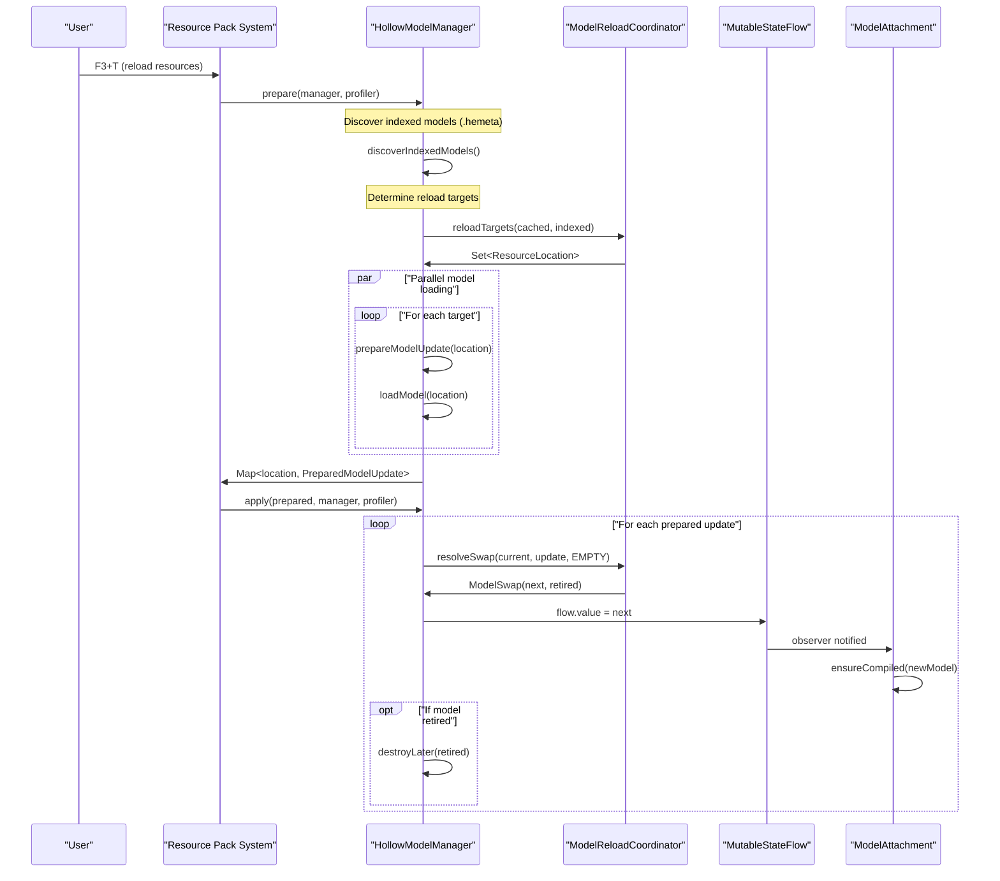

### Resource Reload Phases

The reload process follows Minecraft's `SimplePreparableReloadListener` pattern with two phases:

**1. Prepare Phase (Background Thread):**
- Discovers "indexed" models with `.hemeta` sidecar files [src/main/java/ru/hollowhorizon/hollowengine/client/models/internal/manager/HollowModelManager.kt:136-141]()
- Computes reload targets: union of cached models and indexed models [src/main/java/ru/hollowhorizon/hollowengine/client/models/internal/manager/ModelReloadCoordinator.kt:16-22]()
- Loads models in parallel using coroutines with `Dispatchers.IO` [src/main/java/ru/hollowhorizon/hollowengine/client/models/internal/manager/HollowModelManager.kt:86-93]()
- Returns `Map<ResourceLocation, PreparedModelUpdate<AnimatedModel>>`

**2. Apply Phase (Main Thread):**
- For each loaded model, calls `ModelReloadCoordinator.resolveSwap()` to determine if the model changed
- Updates `StateFlow.value` which triggers observers
- Schedules retired models for destruction on render thread [src/main/java/ru/hollowhorizon/hollowengine/client/models/internal/manager/HollowModelManager.kt:96-118]()

**Sources:** [src/main/java/ru/hollowhorizon/hollowengine/client/models/internal/manager/HollowModelManager.kt:78-118]()

### Indexed Models and Cache Management

Models can be in two states:

| State | Criteria | Behavior |
|-------|----------|----------|
| **Indexed** | Has `.hemeta` sidecar file in resources | Always reloaded on resource pack reload, never removed from cache |
| **Cached** | No `.hemeta` file, requested via `getOrCreate()` | Reloaded if resource exists, removed from cache if resource no longer exists |

**Hemeta Files:**
The `.hemeta` extension is a marker file (content ignored) that indicates a model should be treated as static content rather than dynamic content. This prevents temporary or dynamically generated models from persisting in the cache across reloads [src/main/java/ru/hollowhorizon/hollowengine/client/models/internal/manager/HollowModelManager.kt:140]().

**Cache Eviction:**
If a prepared update has `exists = false` and the model is not indexed, the flow is removed from the cache [src/main/java/ru/hollowhorizon/hollowengine/client/models/internal/manager/HollowModelManager.kt:115-117]().

**Sources:** [src/main/java/ru/hollowhorizon/hollowengine/client/models/internal/manager/HollowModelManager.kt:136-141]()

### Swap Resolution Logic

`ModelReloadCoordinator.resolveSwap()` determines how to transition from the current model to the prepared update:

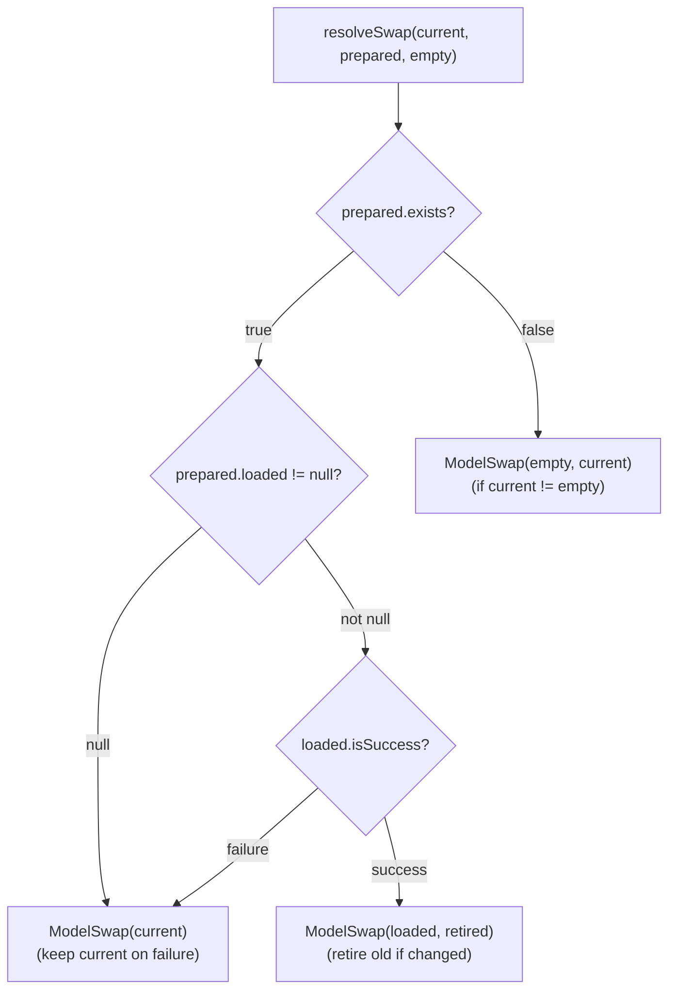

**Reference Equality:**
The swap logic uses reference equality (`===`) to detect if the loaded model is the same instance as the current model, avoiding unnecessary retirement [src/main/java/ru/hollowhorizon/hollowengine/client/models/internal/manager/ModelReloadCoordinator.kt:35-38]().

**Retirement:**
A model is marked for retirement (GPU resource cleanup) only if it is not `empty` and not equal to the new model [src/main/java/ru/hollowhorizon/hollowengine/client/models/internal/manager/ModelReloadCoordinator.kt:36]().

**Sources:** [src/main/java/ru/hollowhorizon/hollowengine/client/models/internal/manager/ModelReloadCoordinator.kt:24-43](), [src/test/kotlin/ModelReloadCoordinatorTests.kt:1-65]()

### Model Destruction

Model destruction must occur on the render thread due to OpenGL context requirements:

```kotlin
private fun destroyLater(model: AnimatedModel) {
    if (RenderSystem.isOnRenderThreadOrInit()) {
        model.destroy()
    } else {
        RenderSystem.recordRenderCall(model::destroy)
    }
}
```

The `destroy()` method propagates down the model hierarchy, calling `Primitive.destroy()` on each primitive, which in turn calls `MeshRenderer.destroy()` to release GPU buffers [src/main/java/ru/hollowhorizon/hollowengine/client/models/internal/manager/HollowModelManager.kt:143-149]().

**Sources:** [src/main/java/ru/hollowhorizon/hollowengine/client/models/internal/manager/HollowModelManager.kt:143-149]()

---

## Integration with Game Systems

The 3D Model System integrates with multiple game systems, providing visual representation for entities, animation playback, and in-game editing tools.

### Entity Attachment

Models are attached to entities through the `NpcEntity` and entity scripting systems:

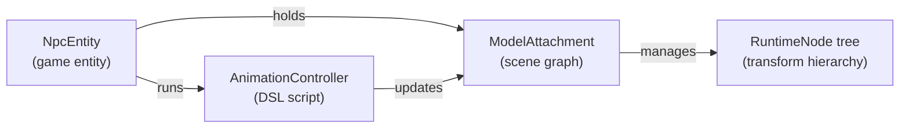

**NPC Tool:**
The `NpcTool` item allows players with permission level 2 to spawn and edit NPCs. Interacting with an NPC opens the `EntityEditorScreen` which provides access to model selection, animation configuration, and attribute editing [src/main/java/ru/hollowhorizon/hollowengine/common/items/NpcTool.kt:25-65]().

**Sources:** [src/main/java/ru/hollowhorizon/hollowengine/common/items/NpcTool.kt:1-66](), [src/main/java/ru/hollowhorizon/hollowengine/mixins/client/MultiplayerGameModeMixin.java:1-40]()

### Animation Controller Integration

`ModelAttachment` provides the `animations` collection that animation controllers use to start, stop, and blend animations. See [Animation System](#8) for details on how animation controllers interact with model attachments.

**Update Coordination:**
During `ModelAttachment.update()`:
1. Transforms are reset to base values
2. Custom `onUpdate` callbacks execute
3. All active `AnimationInstance` objects apply deltas

This ordering ensures animation blending works correctly [src/main/java/ru/hollowhorizon/hollowengine/client/models/internal/v2/ModelAttachment.kt:86-101]().

**Sources:** [src/main/java/ru/hollowhorizon/hollowengine/client/models/internal/v2/ModelAttachment.kt:86-126]()

### Render Pipeline

Models collect rendering commands into a `RenderPipeline`:

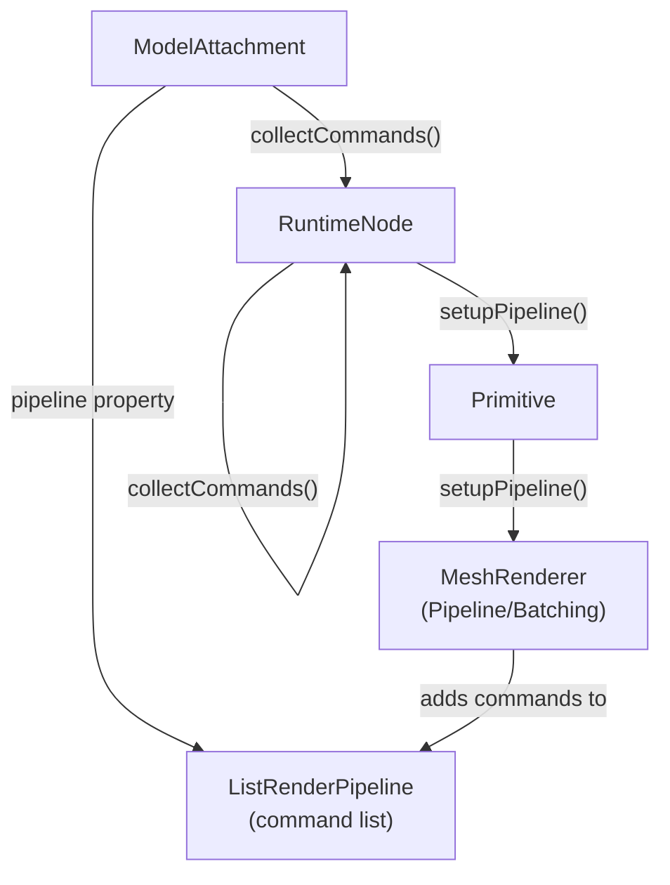

The `ModelAttachment.pipeline` property provides access to the compiled `RenderPipeline` which contains:
- Update callbacks (executed each frame before rendering)
- Draw commands (batched or individual primitives)
- Matrix getters (for node transforms)
- Skin getters (for joint matrices)
- Visibility getters (for frustum culling)

**Sources:** [src/main/java/ru/hollowhorizon/hollowengine/client/models/internal/v2/ModelAttachment.kt:38-42](), [src/main/java/ru/hollowhorizon/hollowengine/client/models/internal/v2/ModelAttachment.kt:103-107](), [src/main/java/ru/hollowhorizon/hollowengine/client/models/internal/Primitive.kt:61-69]()

### Model Querying

The system provides several utility methods for model inspection:

| Property | Type | Description |
|----------|------|-------------|
| `ModelAttachment.triangles` | `Int` | Total triangle count across all primitives |
| `ModelAttachment.shapekeys` | `Int` | Total morph target count |
| `HollowModelManager.allModels` | `Set<ResourceLocation>` | All indexed and cached model locations |
| `HollowModelManager.supports(location)` | `Boolean` | Whether a loader exists for the file extension |

**Sources:** [src/main/java/ru/hollowhorizon/hollowengine/client/models/internal/v2/ModelAttachment.kt:49-57](), [src/main/java/ru/hollowhorizon/hollowengine/client/models/internal/manager/HollowModelManager.kt:239-245]()