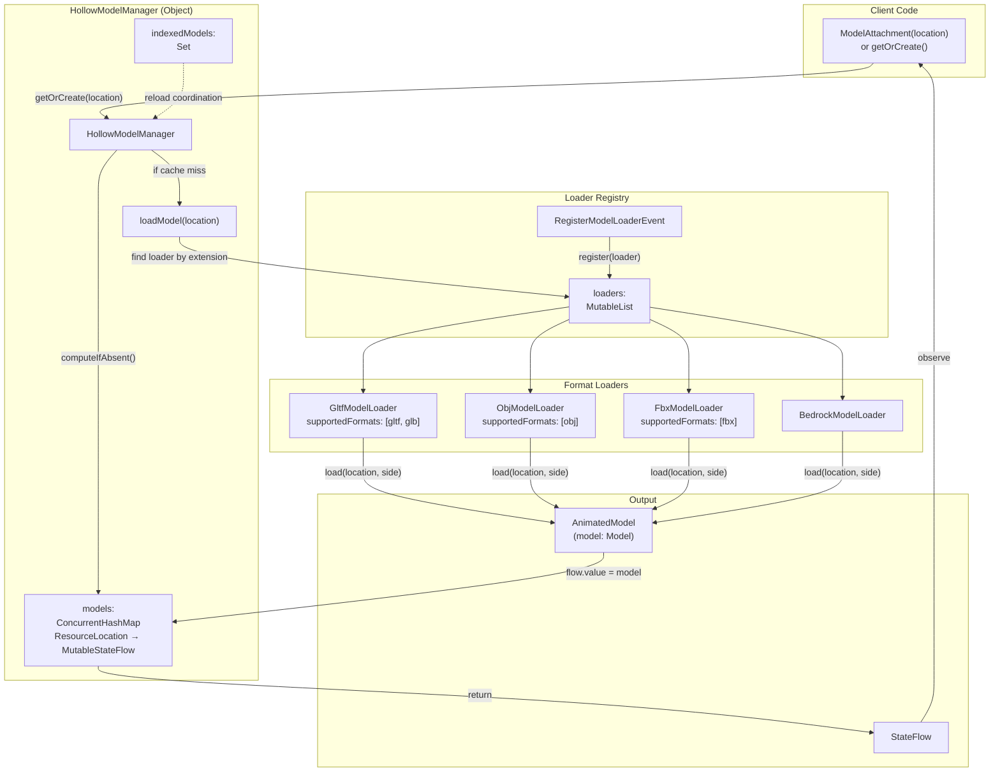
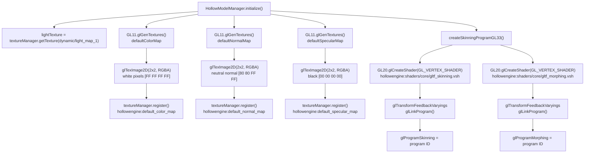
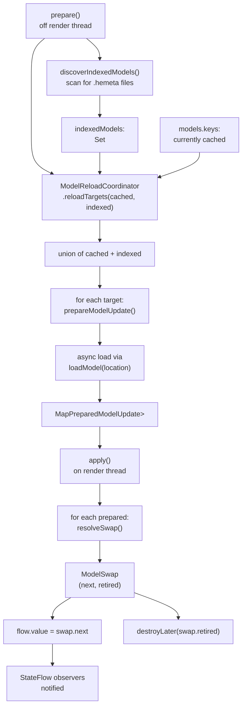
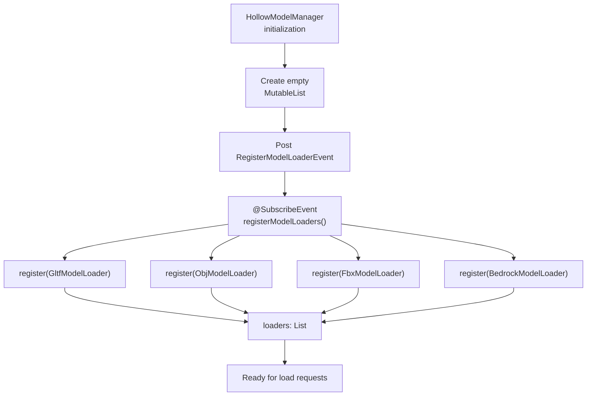
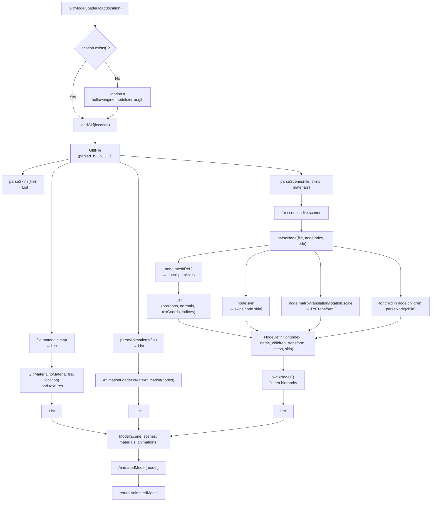
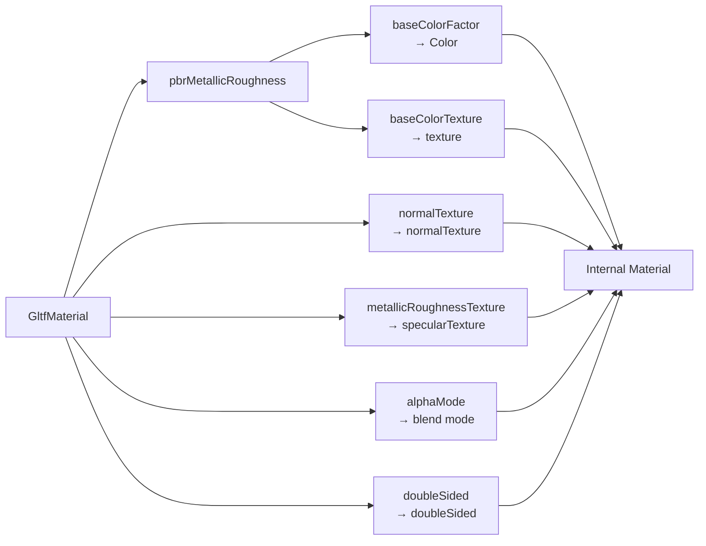
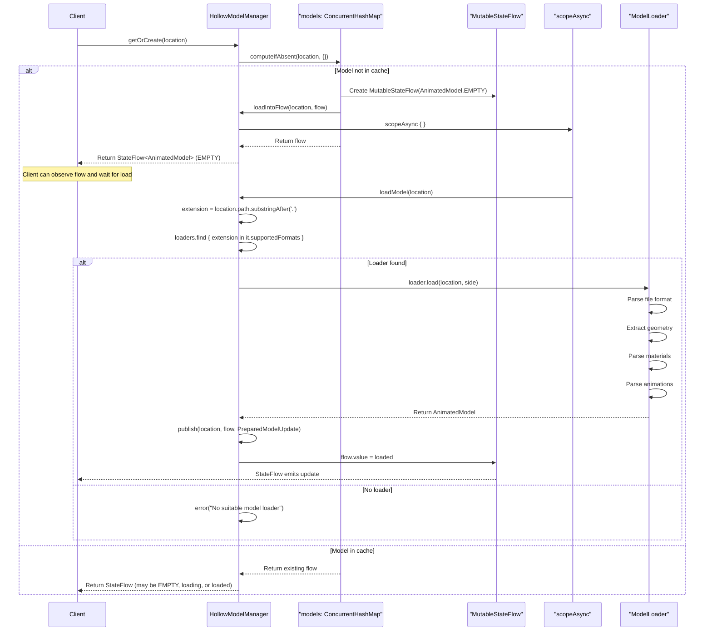
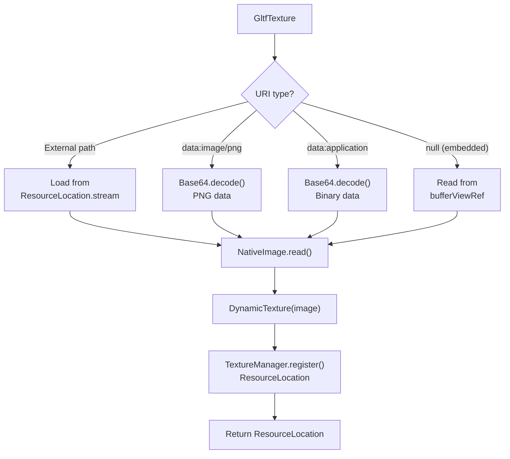
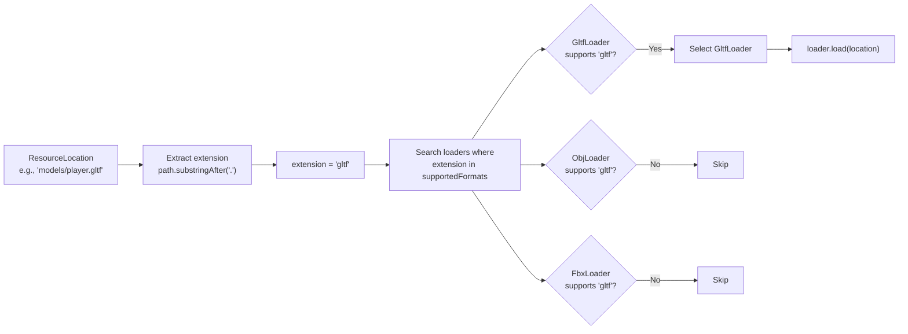

# Model Loading and Formats

<details>
<summary>Relevant source files</summary>

The following files were used as context for generating this wiki page:

- [src/main/java/ru/hollowhorizon/hollowengine/client/models/gltf/GltfModelLoader.kt](src/main/java/ru/hollowhorizon/hollowengine/client/models/gltf/GltfModelLoader.kt)
- [src/main/java/ru/hollowhorizon/hollowengine/client/models/gltf/GltfTexture.kt](src/main/java/ru/hollowhorizon/hollowengine/client/models/gltf/GltfTexture.kt)
- [src/main/java/ru/hollowhorizon/hollowengine/client/models/internal/Primitive.kt](src/main/java/ru/hollowhorizon/hollowengine/client/models/internal/Primitive.kt)
- [src/main/java/ru/hollowhorizon/hollowengine/client/models/internal/manager/HollowModelManager.kt](src/main/java/ru/hollowhorizon/hollowengine/client/models/internal/manager/HollowModelManager.kt)
- [src/main/java/ru/hollowhorizon/hollowengine/client/models/internal/manager/ModelReloadCoordinator.kt](src/main/java/ru/hollowhorizon/hollowengine/client/models/internal/manager/ModelReloadCoordinator.kt)
- [src/main/java/ru/hollowhorizon/hollowengine/client/models/internal/rendering/GpuDeformer.kt](src/main/java/ru/hollowhorizon/hollowengine/client/models/internal/rendering/GpuDeformer.kt)
- [src/main/java/ru/hollowhorizon/hollowengine/client/models/internal/v2/ModelAttachment.kt](src/main/java/ru/hollowhorizon/hollowengine/client/models/internal/v2/ModelAttachment.kt)
- [src/main/java/ru/hollowhorizon/hollowengine/common/items/NpcTool.kt](src/main/java/ru/hollowhorizon/hollowengine/common/items/NpcTool.kt)
- [src/main/java/ru/hollowhorizon/hollowengine/mixins/client/MultiplayerGameModeMixin.java](src/main/java/ru/hollowhorizon/hollowengine/mixins/client/MultiplayerGameModeMixin.java)
- [src/main/resources/assets/hollowengine/shaders/core/gltf_skinning.vsh](src/main/resources/assets/hollowengine/shaders/core/gltf_skinning.vsh)
- [src/test/kotlin/ModelReloadCoordinatorTests.kt](src/test/kotlin/ModelReloadCoordinatorTests.kt)

</details>


## Purpose and Overview

This document describes the model loading system in HollowEngine, which provides a flexible, extensible architecture for loading 3D models from various file formats. The system handles asynchronous loading, caching, and resource management for models used throughout the engine.

For information about the internal model data structures created by loaders, see [Model Data Structure](#9.2). For details on how loaded models are rendered, see [Rendering Pipeline](#9.3).

**Sources:** [src/main/java/ru/hollowhorizon/hollowengine/client/models/internal/manager/HollowModelManager.kt:1-224]()

---

## System Architecture

The model loading system consists of three main components: a central manager, format-specific loaders, and an event-based registration mechanism.



**Diagram: Model Loading System Architecture**
</thinking>

**Sources:** [src/main/java/ru/hollowhorizon/hollowengine/client/models/internal/manager/HollowModelManager.kt:39-67](), [src/main/java/ru/hollowhorizon/hollowengine/client/models/internal/manager/ModelReloadCoordinator.kt:1-43]()

The manager provides a caching layer with asynchronous loading via Kotlin coroutines and StateFlows, allowing models to be requested before they finish loading.

**Sources:** [src/main/java/ru/hollowhorizon/hollowengine/client/models/internal/manager/HollowModelManager.kt:34-68]()

---

## HollowModelManager

`HollowModelManager` is the central singleton responsible for managing all model loading, caching, and lifecycle operations.

### Core Responsibilities

| Responsibility | Description |
|---------------|-------------|
| **Caching** | Maintains a thread-safe cache of all loaded models using `ConcurrentHashMap` |
| **Loader Selection** | Routes load requests to appropriate format-specific loaders based on file extension |
| **Asynchronous Loading** | Uses Kotlin coroutines to load models without blocking the main thread |
| **Resource Reloading** | Implements `ResourceManagerReloadListener` to reload models when resource packs change |
| **GPU Program Management** | Creates and manages GPU programs for skinning and morphing operations |
| **Default Textures** | Provides default color, normal, and specular maps for materials |

### Model Cache Structure

The cache uses `MutableStateFlow<AnimatedModel>` as values, allowing consumers to observe loading progress:

```
ConcurrentHashMap<ResourceLocation, MutableStateFlow<AnimatedModel>>
```

When a model is requested via `getOrCreate(location)`:
1. If already cached, returns existing `StateFlow`
2. If not cached, creates flow with `AnimatedModel.EMPTY`, launches coroutine to load model
3. Once loaded, updates the flow's value to the real model

**Sources:** [src/main/java/ru/hollowhorizon/hollowengine/client/models/internal/manager/HollowModelManager.kt:34-59]()

### Initialization

The manager performs several initialization tasks when `initialize()` is called:



**Diagram: Manager Initialization Pipeline**

The GPU programs are used by `GpuDeformer` for skinning and morph target deformation (see page 9.4 for details).

**Sources:** [src/main/java/ru/hollowhorizon/hollowengine/client/models/internal/manager/HollowModelManager.kt:184-237]()

### Resource Reloading

The manager implements `SimplePreparableReloadListener` to handle resource pack reloads via the `prepare()`/`apply()` pattern.

#### Reload Coordination

The `ModelReloadCoordinator` determines which models need reloading:



**Diagram: Resource Reload Pipeline**

#### Reload Logic

| Phase | Thread | Operations |
|-------|--------|-----------|
| **prepare()** | I/O Thread Pool | Discover indexed models, load all targets asynchronously into `PreparedModelUpdate` map |
| **apply()** | Render Thread | Resolve each update with `ModelReloadCoordinator.resolveSwap()`, update flows, destroy retired models |

#### ModelSwap Resolution

The `ModelReloadCoordinator.resolveSwap()` function determines how to transition from current model to new:

| Scenario | Current | Prepared | Result |
|----------|---------|----------|--------|
| **Successful reload** | `ModelA` | `exists=true, loaded=ModelB` | `next=ModelB, retired=ModelA` |
| **Failed reload** | `ModelA` | `exists=true, loaded=Error` | `next=ModelA, retired=null` (keep old) |
| **Model deleted** | `ModelA` | `exists=false` | `next=EMPTY, retired=ModelA` |
| **No change** | `ModelA` | `exists=true, loaded=ModelA` | `next=ModelA, retired=null` (same instance) |

Retired models are destroyed via `RenderSystem.recordRenderCall()` to ensure GPU cleanup happens on render thread.

**Sources:** [src/main/java/ru/hollowhorizon/hollowengine/client/models/internal/manager/HollowModelManager.kt:78-149](), [src/main/java/ru/hollowhorizon/hollowengine/client/models/internal/manager/ModelReloadCoordinator.kt:15-42]()

---

## ModelLoader Interface

All format-specific loaders implement the `ModelLoader` interface:

```kotlin
interface ModelLoader {
    val supportedFormats: Set<String>
    suspend fun load(location: ResourceLocation, side: ModelSide = ModelSide.CLIENT): AnimatedModel
}
```

### Interface Components

| Member | Type | Purpose |
|--------|------|---------|
| `supportedFormats` | `Set<String>` | File extensions this loader handles (e.g., `setOf("gltf", "glb")`) |
| `load()` | `suspend function` | Asynchronously loads and parses model data from the given resource |
| `side` | `ModelSide` enum | Determines whether to load full model (`CLIENT`) or minimal data (`SERVER`) |

The `ModelSide` parameter allows server-side code to load models without texture/GPU data, reducing memory usage.

**Sources:** [src/main/java/ru/hollowhorizon/hollowengine/client/models/internal/manager/HollowModelManager.kt:184-192]()

---

## Loader Registration System

Loaders are registered via an event-based system that allows mods to add custom format support.



**Diagram: Loader Registration Flow**

### RegisterModelLoaderEvent

The event provides methods for managing the loader registry:

| Method | Purpose |
|--------|---------|
| `register(loader)` | Add a loader to the registry |
| `unregister(loader)` | Remove a specific loader |
| `clear()` | Remove all loaders |
| `getLoaders()` | Get read-only list of registered loaders |

**Sources:** [src/main/java/ru/hollowhorizon/hollowengine/client/models/internal/manager/HollowModelManager.kt:40-42,194-214]()

---

## Supported Format Loaders

### GLTF/GLB Loader

`GltfModelLoader` is the most feature-complete loader, supporting the full glTF 2.0 specification.

#### Supported Features

| Feature | Description |
|---------|-------------|
| **File Formats** | `.gltf` (JSON) and `.glb` (binary) |
| **Geometry** | Positions, normals, tangents, UVs (2 sets) |
| **Skinning** | Joint weights and indices for skeletal animation |
| **Morph Targets** | Shape keys / blend shapes |
| **Materials** | PBR metallic-roughness workflow with textures |
| **Animations** | Keyframe animations with multiple interpolation modes |
| **Scenes** | Multiple scenes with node hierarchies |
| **Textures** | Embedded or external, base64 data URIs supported |

#### GLTF Loading Pipeline



**Diagram: GLTF Loading Pipeline**

**Sources:** [src/main/java/ru/hollowhorizon/hollowengine/client/models/gltf/GltfModelLoader.kt:19-75]()

#### Vertex Attribute Extraction

The GLTF loader extracts vertex attributes from binary buffers using typed accessors:

| Attribute | Accessor Type | Target Array |
|-----------|--------------|--------------|
| `POSITION` | `Vec3fAccessor` | `positions: Array<Vec3f>` |
| `NORMAL` | `Vec3fAccessor` | `normals: Array<Vec3f>` |
| `TEXCOORD_0` | `Vec2fAccessor` | `texCoords: Array<Vec2f>` |
| `TEXCOORD_1` | `Vec2fAccessor` | `midCoords: Array<Vec2f>` |
| `TANGENT` | `Vec4fAccessor` | `tangents: Array<Vec4f>` |
| `JOINTS_0` | `Vec4iAccessor` | `joints: Array<Vec4i>` |
| `WEIGHTS_0` | `Vec4fAccessor` | `jointWeights: Array<Vec4f>` |

**Sources:** [src/main/java/ru/hollowhorizon/hollowengine/client/models/gltf/GltfModelLoader.kt:114-151]()

#### Node Hierarchy Parsing

GLTF nodes support multiple transformation representations:
- Direct `matrix` (4x4 transformation matrix)
- Separate `translation`, `rotation` (quaternion), `scale` components

The loader converts both to a `TrsTransformF` object and builds a tree of `NodeDefinition` objects with parent-child relationships.

**Sources:** [src/main/java/ru/hollowhorizon/hollowengine/client/models/gltf/GltfModelLoader.kt:102-178]()

#### Material Conversion

GLTF materials are converted to the engine's internal `Material` format:



**Diagram: GLTF Material Conversion**

**Sources:** [src/main/java/ru/hollowhorizon/hollowengine/client/models/gltf/GltfMaterial.kt:28-53]()

### OBJ Loader

`ObjModelLoader` supports the legacy Wavefront OBJ format:
- Supported extensions: `.obj`
- Features: Basic geometry with vertex positions, normals, and UVs
- No animation support

**Sources:** Referenced in [src/main/java/ru/hollowhorizon/hollowengine/client/models/internal/manager/HollowModelManager.kt:211]()

### FBX Loader

`FbxModelLoader` supports Autodesk's FBX format:
- Supported extensions: `.fbx`
- Features: Geometry and skeletal animations
- Common for game engine exports

**Sources:** Referenced in [src/main/java/ru/hollowhorizon/hollowengine/client/models/internal/manager/HollowModelManager.kt:212]()

### Bedrock Loader

`BedrockModelLoader` supports Minecraft Bedrock Edition model format:
- Used for compatibility with Bedrock add-ons
- Block-Bench integration support

**Sources:** Referenced in [src/main/java/ru/hollowhorizon/hollowengine/client/models/internal/manager/HollowModelManager.kt:213]()

---

## Loading Pipeline Flow

The complete flow from request to loaded model:



**Diagram: Complete Loading Sequence**

### StateFlow Observation Pattern

The use of `StateFlow<AnimatedModel>` provides reactive model loading:

| Benefit | Implementation |
|---------|----------------|
| **Non-blocking returns** | `getOrCreate()` returns immediately with flow, even if model is still loading |
| **Shared loading** | Multiple consumers observing same flow share single load operation |
| **Automatic updates** | When `flow.value = loaded` executes, all observers receive update |
| **Hot reload support** | Resource pack reloads update flow value, triggering re-render in `ModelAttachment` |

The `ModelAttachment` class demonstrates typical observation pattern:

```kotlin
// From ModelAttachment.kt:44-46
flow.onEach { ensureCompiled(it) }.launchIn(Minecraft.getInstance().coroutineScope)
```

When the flow emits a new `AnimatedModel` (either initial load or hot reload), `ensureCompiled()` rebuilds runtime structures (`RuntimeNode`, `AnimationInstance`, `RenderPipeline`).

**Sources:** [src/main/java/ru/hollowhorizon/hollowengine/client/models/internal/manager/HollowModelManager.kt:50-67](), [src/main/java/ru/hollowhorizon/hollowengine/client/models/internal/v2/ModelAttachment.kt:44-83]()

---

## Texture Loading

Textures referenced by models are loaded through the GLTF texture system:

### Texture Sources

| Source Type | Format | Example |
|------------|--------|---------|
| **External URI** | File path | `"textures/diffuse.png"` |
| **Data URI (PNG)** | Base64 | `"data:image/png;base64,..."` |
| **Data URI (Binary)** | Base64 | `"data:application/octet-stream;base64,..."` |
| **Embedded Buffer** | GLB binary | Stored in buffer view |

### Texture Processing



**Diagram: Texture Loading Flow**

The system automatically registers textures with Minecraft's `TextureManager` and returns a `ResourceLocation` that can be used for rendering.

**Sources:** [src/main/java/ru/hollowhorizon/hollowengine/client/models/gltf/GltfTexture.kt:30-66]()

---

## Error Handling

The loading system includes robust error handling:

### Fallback Model

If a model doesn't exist, the GLTF loader automatically substitutes `hollowengine:models/error.gltf`:

```kotlin
// From GltfModelLoader.kt:19-23
val location = if (!model.exists()) "$MODID:models/error.gltf".rl else model
val gltf = loadGltf(location)
```

This prevents null returns and provides visual feedback that a model reference is broken.

**Sources:** [src/main/java/ru/hollowhorizon/hollowengine/client/models/gltf/GltfModelLoader.kt:19-23]()

### Coroutine Error Catching

The manager catches exceptions during asynchronous loading and logs them without crashing:

```kotlin
try {
    val model = loadModel(location)
    flow.value = model
} catch (e: Exception) {
    HollowEngine.LOGGER.error("Can't load model $location", e)
}
```

This ensures that one failed model doesn't break the entire loading system.

**Sources:** [src/main/java/ru/hollowhorizon/hollowengine/client/models/internal/manager/HollowModelManager.kt:49-54]()

---

## Format Detection

The system uses file extension-based format detection:



**Diagram: Format Detection Logic**

The first loader with a matching extension in its `supportedFormats` set is selected. If no loader matches, an error is thrown.

**Sources:** [src/main/java/ru/hollowhorizon/hollowengine/client/models/internal/manager/HollowModelManager.kt:61-67]()

---

## GPU Program Initialization

The manager creates GPU programs used for deformation (see [GPU Deformation](#9.4) for details on usage):

### Skinning Program

Shader source: [src/main/resources/assets/hollowengine/shaders/core/gltf_skinning.vsh:1-84]()

The program performs:
- Skeletal skinning (joint weights and matrices)
- Morph target blending (shape keys)
- Transform feedback to output deformed vertices

### Morphing Program

Similar to skinning but without skeletal joints, used for models with morph targets only.

Both programs use OpenGL Transform Feedback to write deformed geometry directly to GPU buffers, avoiding CPU-GPU roundtrips.

**Sources:** [src/main/java/ru/hollowhorizon/hollowengine/client/models/internal/manager/HollowModelManager.kt:70-101]()

---

## Thread Safety

The model loading system is designed for concurrent access:

| Component | Thread Safety Mechanism |
|-----------|------------------------|
| **Model Cache** | `ConcurrentHashMap` - lock-free reads and writes |
| **StateFlow** | Thread-safe by design, uses atomic operations |
| **Coroutines** | Each load operation runs in isolated coroutine scope |
| **Loader Registry** | Initialized once at startup before concurrent access |

Multiple threads can simultaneously request the same model without causing race conditions or duplicate loading.

**Sources:** [src/main/java/ru/hollowhorizon/hollowengine/client/models/internal/manager/HollowModelManager.kt:36,44-58]()

---

## Extension Points

Mods can extend the loading system:

### Adding Custom Loaders

To add support for a new format:

1. Implement `ModelLoader` interface
2. Listen for `RegisterModelLoaderEvent`
3. Call `event.register(customLoader)`

Example structure:
```kotlin
object CustomFormatLoader : ModelLoader {
    override val supportedFormats = setOf("custom")
    
    override suspend fun load(location: ResourceLocation, side: ModelSide): AnimatedModel {
        // Parse custom format
        // Return AnimatedModel
    }
}

@SubscribeEvent
fun registerCustomLoader(event: RegisterModelLoaderEvent) {
    event.register(CustomFormatLoader)
}
```

### Replacing Default Loaders

To replace a default loader:
1. Call `event.unregister(oldLoader)` or `event.clear()`
2. Register replacement loader

**Sources:** [src/main/java/ru/hollowhorizon/hollowengine/client/models/internal/manager/HollowModelManager.kt:194-214]()