# Model Data Structure

<details>
<summary>Relevant source files</summary>

The following files were used as context for generating this wiki page:

- [src/main/java/ru/hollowhorizon/hollowengine/client/models/gltf/GltfModelLoader.kt](src/main/java/ru/hollowhorizon/hollowengine/client/models/gltf/GltfModelLoader.kt)
- [src/main/java/ru/hollowhorizon/hollowengine/client/models/gltf/GltfTexture.kt](src/main/java/ru/hollowhorizon/hollowengine/client/models/gltf/GltfTexture.kt)
- [src/main/java/ru/hollowhorizon/hollowengine/client/models/internal/Primitive.kt](src/main/java/ru/hollowhorizon/hollowengine/client/models/internal/Primitive.kt)
- [src/main/java/ru/hollowhorizon/hollowengine/client/models/internal/manager/HollowModelManager.kt](src/main/java/ru/hollowhorizon/hollowengine/client/models/internal/manager/HollowModelManager.kt)
- [src/main/java/ru/hollowhorizon/hollowengine/client/models/internal/manager/ModelReloadCoordinator.kt](src/main/java/ru/hollowhorizon/hollowengine/client/models/internal/manager/ModelReloadCoordinator.kt)
- [src/main/java/ru/hollowhorizon/hollowengine/client/models/internal/rendering/GpuDeformer.kt](src/main/java/ru/hollowhorizon/hollowengine/client/models/internal/rendering/GpuDeformer.kt)
- [src/main/java/ru/hollowhorizon/hollowengine/client/models/internal/v2/ModelAttachment.kt](src/main/java/ru/hollowhorizon/hollowengine/client/models/internal/v2/ModelAttachment.kt)
- [src/main/java/ru/hollowhorizon/hollowengine/common/items/NpcTool.kt](src/main/java/ru/hollowhorizon/hollowengine/common/items/NpcTool.kt)
- [src/main/java/ru/hollowhorizon/hollowengine/mixins/client/MultiplayerGameModeMixin.java](src/main/java/ru/hollowhorizon/hollowengine/mixins/client/MultiplayerGameModeMixin.java)
- [src/main/resources/assets/hollowengine/shaders/core/gltf_skinning.vsh](src/main/resources/assets/hollowengine/shaders/core/gltf_skinning.vsh)
- [src/test/kotlin/ModelReloadCoordinatorTests.kt](src/test/kotlin/ModelReloadCoordinatorTests.kt)

</details>


## Overview

This page documents the data structures used to represent 3D models in HollowEngine. The system uses a layered architecture where GLTF file data is parsed into immutable data classes (`AnimatedModel`, `Model`, `Scene`, `NodeDefinition`, `Mesh`, `Primitive`, `Material`, `Skin`), which are then wrapped by runtime objects (`ModelAttachment`, `RuntimeNode`) that manage scene graphs, animations, and rendering state.

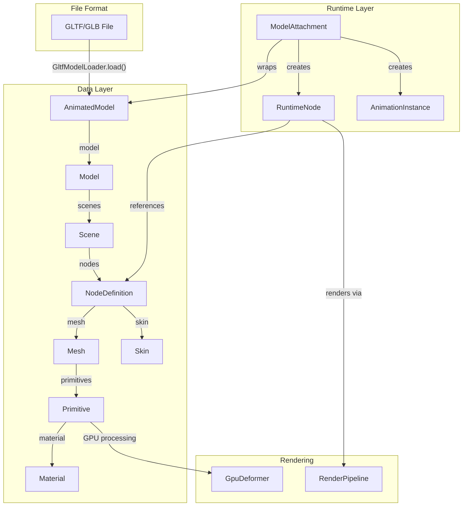

**Data Flow:**
1. **Loading** (see page 9.1): `GltfModelLoader` parses GLTF files into immutable data classes
2. **Runtime Wrapping**: `ModelAttachment` creates runtime wrappers and scene graph
3. **Rendering** (see page 9.4): `RenderPipeline` collects commands, `GpuDeformer` processes geometry
4. **Animation** (see page 9.5): `AnimationInstance` updates node transforms

**Sources:** [src/main/java/ru/hollowhorizon/hollowengine/client/models/internal/v2/ModelAttachment.kt:1-127](), [src/main/java/ru/hollowhorizon/hollowengine/client/models/gltf/GltfModelLoader.kt:1-202]()

---

## AnimatedModel and Model Classes

`AnimatedModel` is a simple wrapper class that holds the parsed `Model` data. `Model` represents the complete GLTF document structure.

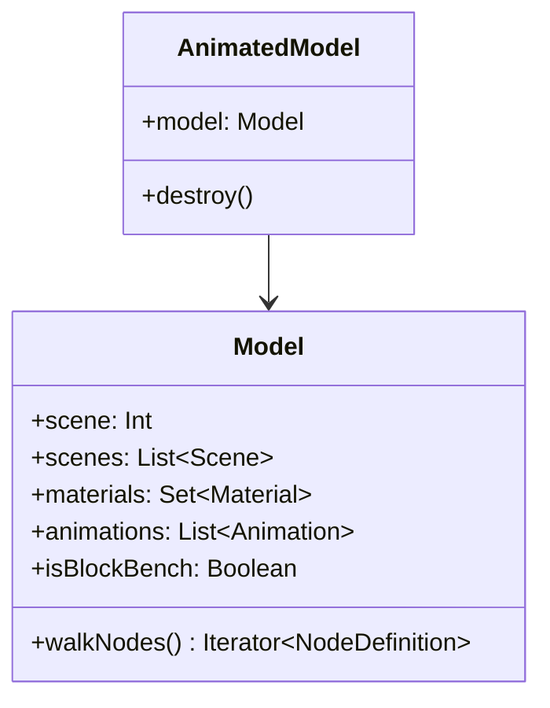

| Class | Property | Type | Description |
|-------|----------|------|-------------|
| `AnimatedModel` | `model` | `Model` | The underlying model data |
| `Model` | `scene` | `Int` | Default scene index |
| `Model` | `scenes` | `List<Scene>` | All scenes in the file |
| `Model` | `materials` | `Set<Material>` | All materials referenced by primitives |
| `Model` | `animations` | `List<Animation>` | Animation data from GLTF |
| `Model` | `isBlockBench` | `Boolean` | Flag indicating BlockBench-generated model |

The `AnimatedModel` wrapper exists to support hot reloading (see page 9.6). When a model file changes, the `StateFlow<AnimatedModel>` in `HollowModelManager` updates, triggering recompilation in dependent `ModelAttachment` instances.

**Sources:** [src/main/java/ru/hollowhorizon/hollowengine/client/models/internal/AnimatedModel.kt](), [src/main/java/ru/hollowhorizon/hollowengine/client/models/gltf/GltfModelLoader.kt:54-69]()

---

## Scene and NodeDefinition

A `Scene` defines a root-level collection of nodes. GLTF files can contain multiple scenes, though typically only one is used.

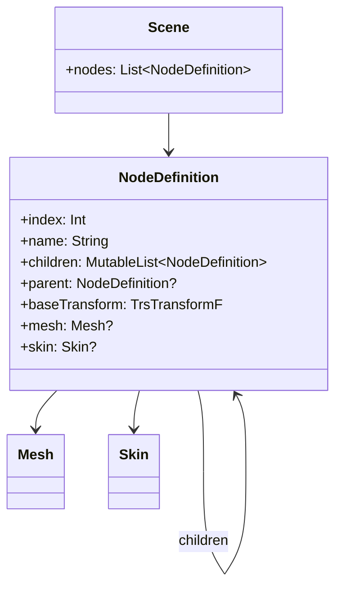

| Class | Property | Type | Description |
|-------|----------|------|-------------|
| `Scene` | `nodes` | `List<NodeDefinition>` | Root-level nodes in the scene |
| `NodeDefinition` | `index` | `Int` | GLTF-defined node index |
| `NodeDefinition` | `name` | `String` | Node name from GLTF |
| `NodeDefinition` | `children` | `MutableList<NodeDefinition>` | Child nodes forming scene graph |
| `NodeDefinition` | `parent` | `NodeDefinition?` | Parent node (null for roots) |
| `NodeDefinition` | `baseTransform` | `TrsTransformF` | Initial transform (translation, rotation, scale) |
| `NodeDefinition` | `mesh` | `Mesh?` | Optional mesh data |
| `NodeDefinition` | `skin` | `Skin?` | Optional skeletal skin data |

**Scene Graph Hierarchy:**

The `NodeDefinition` class forms a tree structure where:
- Root nodes have `parent == null` and are stored in `Scene.nodes`
- Each node can have multiple children via the `children` list
- Parent-child relationships are bidirectional for traversal

The `baseTransform` contains the rest pose transform that animations modify during playback. The `TrsTransformF` type (from Kool library) stores translation, rotation (quaternion), and scale separately for efficient interpolation.

**Sources:** [src/main/java/ru/hollowhorizon/hollowengine/client/models/gltf/GltfModelLoader.kt:88-94](), [src/main/java/ru/hollowhorizon/hollowengine/client/models/gltf/GltfModelLoader.kt:96-170]()

---

## Mesh and Primitive

A `Mesh` contains one or more `Primitive` objects, each representing a renderable geometry subset with a specific material.

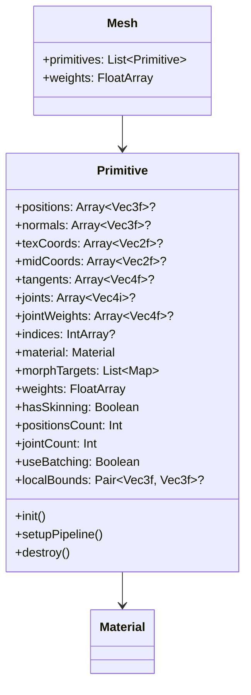

**Primitive Vertex Attributes:**

| Attribute | Type | Purpose | Source |
|-----------|------|---------|--------|
| `positions` | `Array<Vec3f>?` | Vertex positions (x, y, z) | GLTF `POSITION` accessor |
| `normals` | `Array<Vec3f>?` | Surface normals | GLTF `NORMAL` accessor |
| `texCoords` | `Array<Vec2f>?` | UV texture coordinates (channel 0) | GLTF `TEXCOORD_0` accessor |
| `midCoords` | `Array<Vec2f>?` | Secondary UV coordinates (channel 1) | GLTF `TEXCOORD_1` accessor |
| `tangents` | `Array<Vec4f>?` | Tangent vectors for normal mapping | GLTF `TANGENT` accessor |
| `joints` | `Array<Vec4i>?` | Bone joint indices (4 per vertex) | GLTF `JOINTS_0` accessor |
| `jointWeights` | `Array<Vec4f>?` | Bone joint weights (4 per vertex) | GLTF `WEIGHTS_0` accessor |
| `indices` | `IntArray?` | Triangle indices (null = non-indexed) | GLTF indices accessor |

**Morph Targets (Shape Keys):**

The `morphTargets` list contains blend shape deltas:
- Each entry is a `Map<String, FloatArray>` mapping attribute names to delta values
- Attributes can include `POSITION`, `NORMAL`, `TANGENT`
- The `weights` array contains the current blend weight for each target
- GPU shaders apply morph deltas: `finalPosition = basePosition + Σ(delta[i] * weight[i])`

**Sources:** [src/main/java/ru/hollowhorizon/hollowengine/client/models/internal/Primitive.kt:12-100](), [src/main/java/ru/hollowhorizon/hollowengine/client/models/gltf/GltfModelLoader.kt:106-149]()

---

## Material Structure

`Material` defines surface appearance properties for rendering.

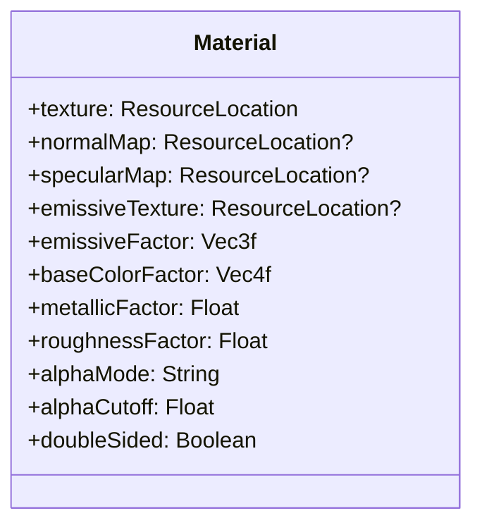

| Property | Type | Default | Description |
|----------|------|---------|-------------|
| `texture` | `ResourceLocation` | `default_color_map` | Base color (albedo) texture |
| `normalMap` | `ResourceLocation?` | `default_normal_map` | Normal map for surface detail |
| `specularMap` | `ResourceLocation?` | `default_specular_map` | Metallic/roughness texture |
| `emissiveTexture` | `ResourceLocation?` | null | Emissive glow texture |
| `emissiveFactor` | `Vec3f` | `(0, 0, 0)` | Emissive color multiplier |
| `baseColorFactor` | `Vec4f` | `(1, 1, 1, 1)` | Base color tint (RGBA) |
| `metallicFactor` | `Float` | `1.0` | Metallic property (0=dielectric, 1=metal) |
| `roughnessFactor` | `Float` | `1.0` | Surface roughness (0=smooth, 1=rough) |
| `alphaMode` | `String` | `"OPAQUE"` | Alpha blending mode (`OPAQUE`, `MASK`, `BLEND`) |
| `alphaCutoff` | `Float` | `0.5` | Alpha threshold for `MASK` mode |
| `doubleSided` | `Boolean` | `false` | Render both sides of triangles |

**PBR Workflow:**

HollowEngine uses physically-based rendering (PBR) with metallic-roughness workflow:
- **Base Color**: Diffuse color for dielectrics, reflectance for metals
- **Metallic**: 0 = non-metal (uses base color as diffuse), 1 = metal (base color becomes reflectance)
- **Roughness**: Controls microfacet distribution (0 = mirror-like, 1 = diffuse)
- **Normal Map**: Perturbs surface normals for fine detail without geometry
- **Emissive**: Adds self-illumination independent of lighting

**Sources:** [src/main/java/ru/hollowhorizon/hollowengine/client/models/internal/Material.kt](), [src/main/java/ru/hollowhorizon/hollowengine/client/models/gltf/GltfMaterial.kt]()

---

## Skin Structure for Skeletal Animation

`Skin` defines skeletal rigging data for vertex skinning (skeletal animation).

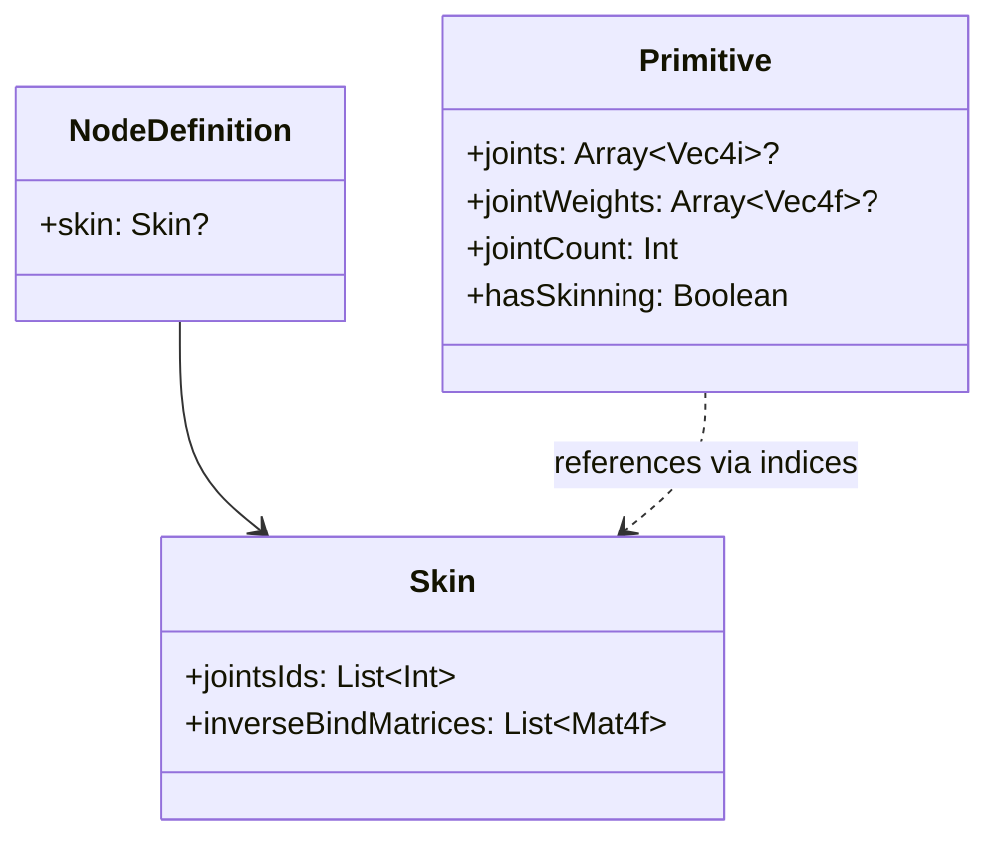

| Property | Type | Description |
|----------|------|-------------|
| `jointsIds` | `List<Int>` | Node indices that represent bones/joints |
| `inverseBindMatrices` | `List<Mat4f>` | Inverse bind matrices (one per joint) |

**Skinning Algorithm:**

For each vertex, the GPU computes:
```
finalPosition = Σ(weight[i] * jointMatrix[joint[i]] * inverseBindMatrix[joint[i]] * basePosition)
```

Where:
1. `basePosition` is the vertex position in mesh space
2. `inverseBindMatrix[joint[i]]` transforms from mesh space to joint space
3. `jointMatrix[joint[i]]` is the current animated bone transform
4. `weight[i]` is the influence weight (typically 4 weights per vertex)
5. The sum gives the final deformed position

The `inverseBindMatrices` are loaded from GLTF and remain constant. The `jointMatrix` values are computed per-frame from animated node transforms.

**Sources:** [src/main/java/ru/hollowhorizon/hollowengine/client/models/gltf/GltfModelLoader.kt:72-79](), [src/main/resources/assets/hollowengine/shaders/core/gltf_skinning.vsh:49-84]()

---

## ModelAttachment: Runtime Wrapper

`ModelAttachment` is the primary runtime representation of a loaded 3D model. It wraps an `AnimatedModel` and creates the necessary runtime structures for scene graph traversal, animation playback, and rendering.

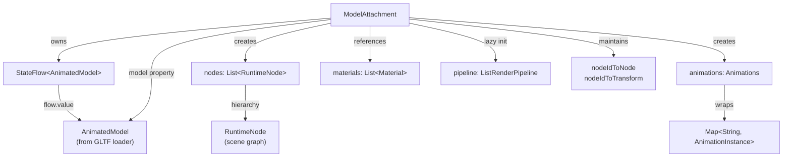

**Key Components:**

| Property | Type | Description |
|----------|------|-------------|
| `flow` | `StateFlow<AnimatedModel>` | Reactive wrapper around the loaded model data |
| `model` | `Model` | The underlying GLTF model structure (`flow.value.model`) |
| `nodes` | `List<RuntimeNode>` | Root nodes of the scene graph hierarchy |
| `animations` | `Animations` | Collection of all animations by name |
| `materials` | `List<Material>` | Material definitions from the GLTF model |
| `pipeline` | `ListRenderPipeline` | Lazily initialized render command list |
| `nodeIdToNode` | `Map<Int, RuntimeNode>` | Fast lookup from node index to RuntimeNode |
| `nodeIdToTransform` | `Map<Int, Transform>` | Fast lookup from node index to Transform |

The `ModelAttachment` class wraps an `AnimatedModel` and manages runtime state including scene graph traversal, animation playback, and rendering.

**Sources:** [src/main/java/ru/hollowhorizon/hollowengine/client/models/internal/v2/ModelAttachment.kt:20-51]()

---

## Runtime Node Tree Structure

The `nodes` property contains the root-level scene graph nodes from the GLTF model. Each `RuntimeNode` wraps a `NodeDefinition` and provides runtime transform management.

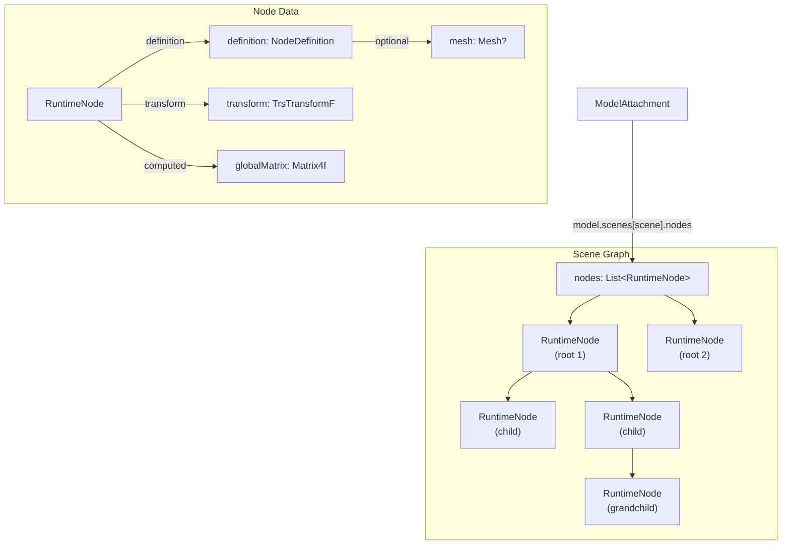

**Node Traversal:**

The model structure supports hierarchical traversal through the `walk()` extension function, which recursively visits all nodes in the tree:

| Pattern | Usage |
|---------|-------|
| Direct children | `nodes.forEach { node -> ... }` |
| All descendants | `nodes.flatMap { it.walk() }` |
| Find by name | `child(name)` function on ModelAttachment |
| Find by index | `nodeIdToNode[index]` lookup map |

**Sources:** [src/main/java/ru/hollowhorizon/hollowengine/client/models/internal/v2/ModelAttachment.kt:42](), [src/main/java/ru/hollowhorizon/hollowengine/client/gui/scripting/files/prefabs/ModelController.kt:516-558]()

---

## Animations Collection

The `Animations` class wraps a map of animation instances and provides both indexed and named access to animations.

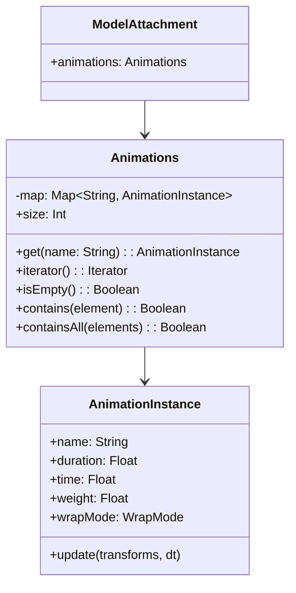

**Animation Access Patterns:**

```kotlin
// By name (throws if not found)
val animation = attachment.animations["walk"]

// Iterate all
for (anim in attachment.animations) {
    println(anim.name)
}

// Safe access
attachment.animations.firstOrNull { it.name == "idle" }
```

The animations are created from the underlying GLTF animation data:
- Each GLTF `Animation` is wrapped in an `AnimationInstance`
- Animations are stored by name in the map
- The collection implements Kotlin's `Collection` interface for standard iteration

**Sources:** [src/main/java/ru/hollowhorizon/hollowengine/client/models/internal/v2/ModelAttachment.kt:43](), [src/main/java/ru/hollowhorizon/hollowengine/client/models/internal/v2/ModelAttachment.kt:80-91]()

---

## Node Lookup Maps

`ModelAttachment` maintains two critical lookup maps for efficient node access during animation updates:

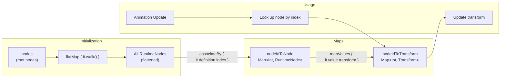

**Map Construction:**

| Map | Key | Value | Purpose |
|-----|-----|-------|---------|
| `nodeIdToNode` | `Int` (node index) | `RuntimeNode` | Fast node lookup by GLTF index |
| `nodeIdToTransform` | `Int` (node index) | `Transform` | Direct transform access for animation |

These maps are built during initialization by flattening the entire node tree and indexing by the GLTF-defined node index. During animation updates, the system can directly access any node's transform without traversing the tree.

**Sources:** [src/main/java/ru/hollowhorizon/hollowengine/client/models/internal/v2/ModelAttachment.kt:45-46](), [src/main/java/ru/hollowhorizon/hollowengine/client/models/internal/v2/ModelAttachment.kt:58-68]()

---

## Material References

Materials are stored as a simple list reference to the underlying GLTF model's material array:

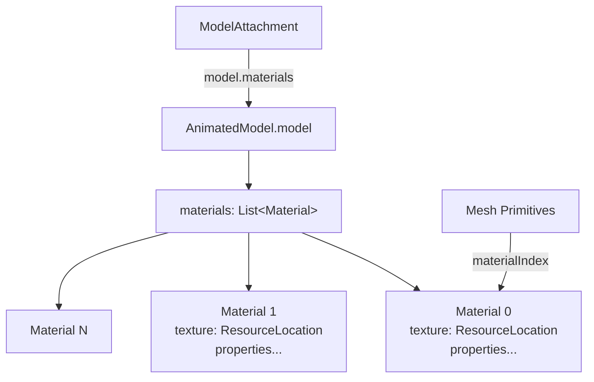

Materials are **not** copied or modified by `ModelAttachment`—it maintains a direct reference to the model's material list. Individual mesh primitives reference materials by index into this array.

**Material Manipulation:**

During rendering, materials can be temporarily swapped (e.g., for wireframe rendering):

```kotlin
// Save original textures
val blends = attachment.materials.map { it.texture }

// Temporarily replace
attachment.materials[i].texture = "hollowengine:default_color_map".rl

// Restore after rendering
attachment.materials[i].texture = blends[i]
```

**Sources:** [src/main/java/ru/hollowhorizon/hollowengine/client/models/internal/v2/ModelAttachment.kt:44](), [src/main/java/ru/hollowhorizon/hollowengine/client/gui/scripting/files/prefabs/ModelController.kt:487-506]()

---

## Update Lifecycle and Transform Management

`ModelAttachment` manages a frame-based update cycle that resets transforms, applies custom logic, and then applies animations:

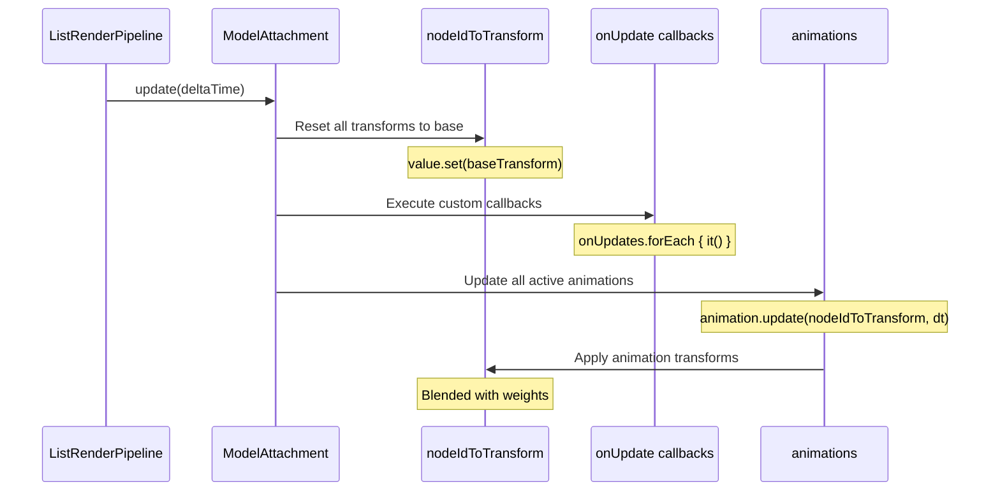

**Transform Update Flow:**

1. **Reset Phase** (line 59-62): All node transforms are reset to their base (rest pose) values from the GLTF definition
2. **Callback Phase** (line 64): Custom update callbacks registered via `onUpdate()` are executed
3. **Animation Phase** (line 66-68): Each active animation modifies the transform maps based on its weight and current time

This three-phase approach allows:
- Base pose to be established each frame
- Custom procedural animations via callbacks
- Layer-based animation blending

**Sources:** [src/main/java/ru/hollowhorizon/hollowengine/client/models/internal/v2/ModelAttachment.kt:58-69]()

---

## Render Pipeline Integration

The `pipeline` property lazily initializes a `ListRenderPipeline` that collects render commands from the entire model hierarchy:

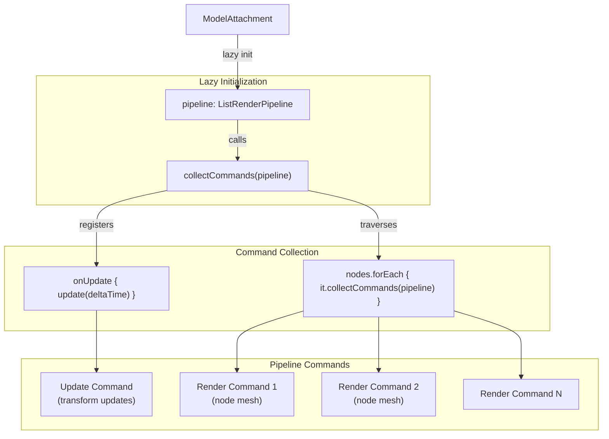

**Pipeline Structure:**

| Command Type | Purpose | Added By |
|--------------|---------|----------|
| Update Command | Transforms update (line 73) | `ModelAttachment.collectCommands` |
| Render Commands | Mesh rendering per node | `RuntimeNode.collectCommands` |

The pipeline pattern allows the entire model's rendering to be precomputed into a command list, which is then executed during the render phase. The update command ensures transforms are refreshed before rendering, respecting shadow rendering pause states (Iris integration).

**Sources:** [src/main/java/ru/hollowhorizon/hollowengine/client/models/internal/v2/ModelAttachment.kt:49-51](), [src/main/java/ru/hollowhorizon/hollowengine/client/models/internal/v2/ModelAttachment.kt:71-75]()

---

## Computed Properties

`ModelAttachment` provides several computed properties for model statistics:

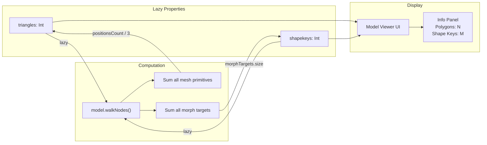

**Property Definitions:**

```kotlin
// Triangle count: sum of all mesh primitives' vertex counts / 3
val triangles = model.walkNodes().sumOf {
    it.mesh?.primitives?.sumOf { it.positionsCount / 3 } ?: 0
}

// Shape key count: sum of all morph targets across all primitives
val shapekeys = model.walkNodes().sumOf {
    it.mesh?.primitives?.sumOf { it.morphTargets.size } ?: 0
}
```

These properties are computed lazily and cached, walking the entire node tree once to aggregate statistics from all mesh primitives. They are primarily used for display in the Model Viewer UI.

**Sources:** [src/main/java/ru/hollowhorizon/hollowengine/client/models/internal/v2/ModelAttachment.kt:31-40](), [src/main/java/ru/hollowhorizon/hollowengine/client/gui/scripting/files/prefabs/ModelController.kt:322-324]()

---

## Bounds Calculation

The `calculateBounds()` extension function computes the axis-aligned bounding box (AABB) for the entire model by transforming all mesh primitive bounds into world space:

```mermaid
graph TB
    subgraph "Input"
        Model["ModelAttachment"]
        Nodes["All nodes"]
    end
    
    subgraph "Per-Node Processing"
        RuntimeNode["RuntimeNode"]
        GlobalMatrix["globalMatrix"]
        Primitives["mesh.primitives"]
        LocalBounds["primitive.localBounds"]
    end
    
    subgraph "Transform"
        Corners["8 corners of AABB"]
        Transform["matrix.transform(corner)"]
        Accumulate["Update min/max"]
    end
    
    subgraph "Output"
        MinVec["Vec3f(minX, minY, minZ)"]
        MaxVec["Vec3f(maxX, maxY, maxZ)"]
        Result["Pair&lt;Vec3f, Vec3f&gt;?"]
    end
    
    Model --> Nodes
    Nodes --> RuntimeNode
    RuntimeNode --> GlobalMatrix
    RuntimeNode --> Primitives
    Primitives --> LocalBounds
    
    LocalBounds --> Corners
    GlobalMatrix --> Transform
    Corners --> Transform
    Transform --> Accumulate
    
    Accumulate --> MinVec
    Accumulate --> MaxVec
    MinVec --> Result
    MaxVec --> Result
```

**Algorithm:**

1. Initialize min/max to infinity (line 517-522)
2. For each node's each primitive:
   - Get the local AABB (min, max corners)
   - Transform all 8 corners by the node's global matrix (line 534-551)
   - Update global min/max values
3. Return the final world-space AABB or null if no primitives have bounds

This is used for debug visualization (bounding box rendering) and potentially for culling optimizations.

**Sources:** [src/main/java/ru/hollowhorizon/hollowengine/client/gui/scripting/files/prefabs/ModelController.kt:516-559]()

---

## Usage Example: Model Viewer

The Model Viewer demonstrates how `ModelAttachment` is used in practice:

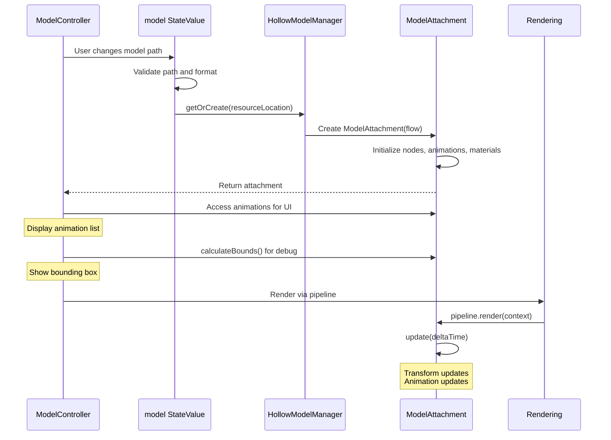

**Sources:** [src/main/java/ru/hollowhorizon/hollowengine/client/gui/scripting/files/prefabs/ModelController.kt:48-59]()