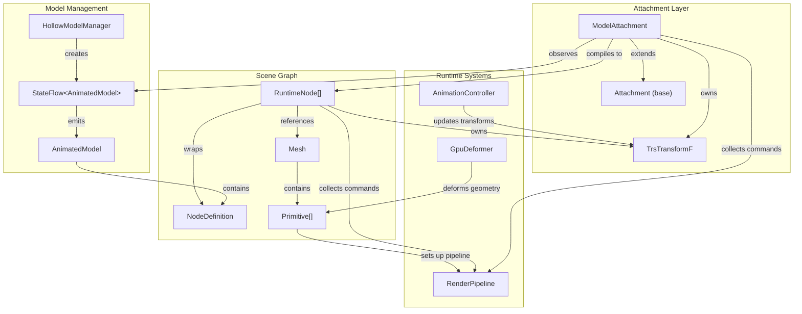
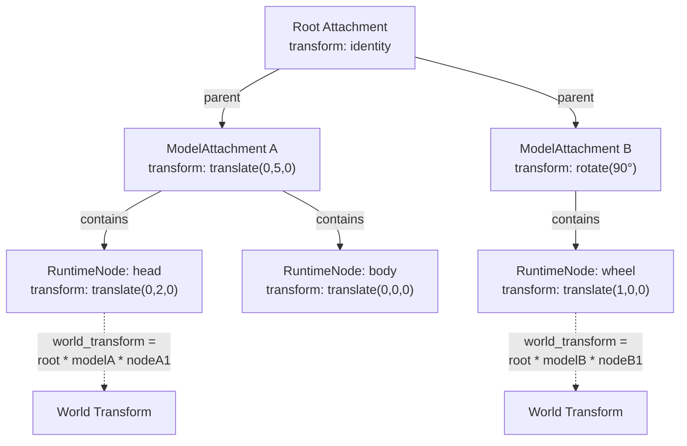
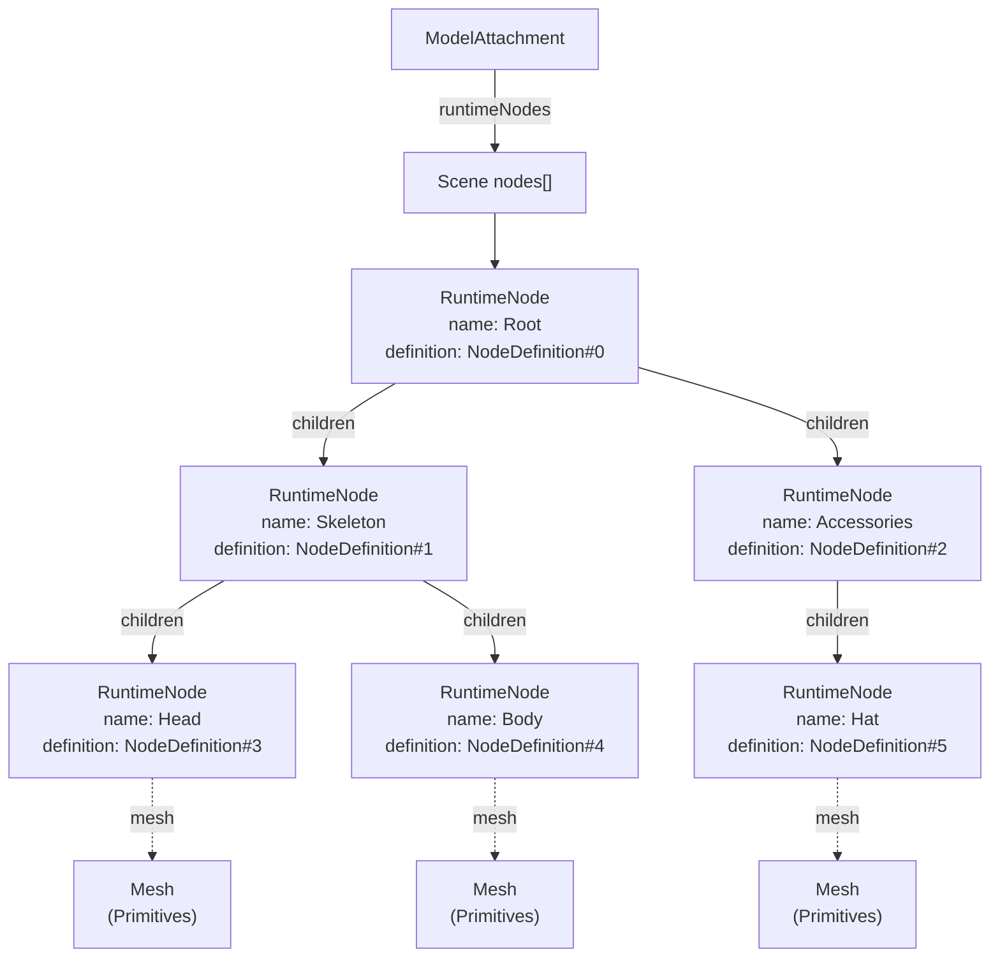
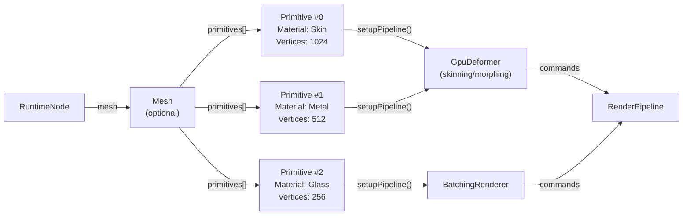

# Scene Graph and Attachments

<details>
<summary>Relevant source files</summary>

The following files were used as context for generating this wiki page:

- [src/main/java/ru/hollowhorizon/hollowengine/client/models/gltf/GltfModelLoader.kt](src/main/java/ru/hollowhorizon/hollowengine/client/models/gltf/GltfModelLoader.kt)
- [src/main/java/ru/hollowhorizon/hollowengine/client/models/gltf/GltfTexture.kt](src/main/java/ru/hollowhorizon/hollowengine/client/models/gltf/GltfTexture.kt)
- [src/main/java/ru/hollowhorizon/hollowengine/client/models/internal/Primitive.kt](src/main/java/ru/hollowhorizon/hollowengine/client/models/internal/Primitive.kt)
- [src/main/java/ru/hollowhorizon/hollowengine/client/models/internal/manager/HollowModelManager.kt](src/main/java/ru/hollowhorizon/hollowengine/client/models/internal/manager/HollowModelManager.kt)
- [src/main/java/ru/hollowhorizon/hollowengine/client/models/internal/manager/ModelReloadCoordinator.kt](src/main/java/ru/hollowhorizon/hollowengine/client/models/internal/manager/ModelReloadCoordinator.kt)
- [src/main/java/ru/hollowhorizon/hollowengine/client/models/internal/rendering/GpuDeformer.kt](src/main/java/ru/hollowhorizon/hollowengine/client/models/internal/rendering/GpuDeformer.kt)
- [src/main/java/ru/hollowhorizon/hollowengine/client/models/internal/v2/ModelAttachment.kt](src/main/java/ru/hollowhorizon/hollowengine/client/models/internal/v2/ModelAttachment.kt)
- [src/main/java/ru/hollowhorizon/hollowengine/common/items/NpcTool.kt](src/main/java/ru/hollowhorizon/hollowengine/common/items/NpcTool.kt)
- [src/main/java/ru/hollowhorizon/hollowengine/mixins/client/MultiplayerGameModeMixin.java](src/main/java/ru/hollowhorizon/hollowengine/mixins/client/MultiplayerGameModeMixin.java)
- [src/main/resources/assets/hollowengine/shaders/core/gltf_skinning.vsh](src/main/resources/assets/hollowengine/shaders/core/gltf_skinning.vsh)
- [src/test/kotlin/ModelReloadCoordinatorTests.kt](src/test/kotlin/ModelReloadCoordinatorTests.kt)

</details>


## Purpose and Scope

This page documents the scene graph system and attachment mechanism used to organize and render 3D models in HollowEngine. The scene graph provides a hierarchical tree structure for organizing model nodes, transforms, and meshes, while the attachment system wraps models and manages their lifecycle, observation, and hot-reloading.

For information about the underlying model data structures (nodes, meshes, primitives), see [Model Data Structure](#9.2). For details on animation playback within the scene graph, see [Animation Integration](#9.5). For information about the hot reload mechanism, see [Hot Reload System](#9.6).

---

## System Overview

The scene graph and attachment system consists of three primary components:

| Component | Purpose | Key Classes |
|-----------|---------|-------------|
| **Attachment** | Base class for hierarchical scene organization | `Attachment`, `ModelAttachment` |
| **Scene Graph** | Tree structure representing model hierarchy | `RuntimeNode`, `NodeDefinition` |
| **State Observation** | Hot-reload support via reactive state flows | `StateFlow<AnimatedModel>` |

The system enables:
- Hierarchical organization of model nodes with parent-child relationships
- Transform propagation through the scene hierarchy
- Hot-reloading of models without restarting execution
- Integration with animation controllers and rendering pipeline
- Efficient culling and visibility management

**Diagram: Scene Graph and Attachment Architecture**



Sources: [src/main/java/ru/hollowhorizon/hollowengine/client/models/internal/v2/ModelAttachment.kt:1-127](), [src/main/java/ru/hollowhorizon/hollowengine/client/models/internal/manager/HollowModelManager.kt:39-67]()

---

## Attachment Base Class

The `Attachment` class provides the foundation for a hierarchical scene graph system. It manages parent-child relationships, transforms, and command collection for rendering.

### Core Properties

```
class Attachment(parent: Attachment?) {
    val transform: TrsTransformF       // Local transform (translation, rotation, scale)
    val children: MutableList<Attachment>
    val parent: Attachment?
}
```

### Transform Hierarchy

Each attachment maintains a local transform that is composed with its parent's transform to compute the world-space transform. This enables natural parent-child motion where child objects move with their parents.

**Diagram: Attachment Hierarchy**



Sources: [src/main/java/ru/hollowhorizon/hollowengine/client/models/internal/v2/ModelAttachment.kt:21-113]()

---

## ModelAttachment Class

`ModelAttachment` is the primary class for managing 3D models in the scene graph. It wraps an `AnimatedModel` accessed through a `StateFlow`, enabling reactive updates when models are reloaded.

### Construction and Initialization

Models are created by observing a `StateFlow` from `HollowModelManager`:

```kotlin
// Convenience factory function
fun ModelAttachment(model: String) = 
    ModelAttachment(HollowModelManager.getOrCreate(model.rl), null)

// Full constructor
class ModelAttachment(
    val flow: StateFlow<AnimatedModel>, 
    parent: Attachment?
) : Attachment(parent)
```

[src/main/java/ru/hollowhorizon/hollowengine/client/models/internal/v2/ModelAttachment.kt:20-21]()

### State Management

The attachment maintains multiple cached states that are rebuilt when the underlying model changes:

| State | Type | Purpose |
|-------|------|---------|
| `modelState` | `AnimatedModel` | Current model instance |
| `runtimeNodes` | `List<RuntimeNode>` | Compiled scene graph roots |
| `runtimeAnimations` | `Animations` | Animation instances indexed by name |
| `runtimeMaterials` | `Set<Material>` | All materials used in model |
| `nodeIdToNode` | `Map<Int, RuntimeNode>` | Fast node lookup by index |
| `nodeIdToTransform` | `Map<Int, TrsTransformF>` | Fast transform lookup for animations |
| `renderPipeline` | `ListRenderPipeline` | Cached render commands |

[src/main/java/ru/hollowhorizon/hollowengine/client/models/internal/v2/ModelAttachment.kt:23-32]()

### Compilation Process

When a new model is received from the `StateFlow`, the attachment performs a synchronized compilation:

**Diagram: ModelAttachment Compilation Flow**

```mermaid
graph LR
    Flow["StateFlow&lt;AnimatedModel&gt;"]
    EnsureCompiled["ensureCompiled()"]
    CheckCache{{"compiledFor<br/>same instance?"}}
    Synchronized["synchronized(rebuildLock)"]
    BuildNodes["Build RuntimeNode[]<br/>from Scenes"]
    BuildAnims["Build Animations map"]
    BuildMaterials["Collect Materials"]
    BuildIndexes["Build nodeId maps"]
    BuildPipeline["Collect render commands<br/>into pipeline"]
    Done["compiledFor = model"]
    
    Flow -->|"onEach"| EnsureCompiled
    EnsureCompiled --> CheckCache
    CheckCache -->|"yes"| Return["return early"]
    CheckCache -->|"no"| Synchronized
    Synchronized --> BuildNodes
    BuildNodes --> BuildAnims
    BuildAnims --> BuildMaterials
    BuildMaterials --> BuildIndexes
    BuildIndexes --> BuildPipeline
    BuildPipeline --> Done
```



Sources: [src/main/java/ru/hollowhorizon/hollowengine/client/models/internal/v2/ModelAttachment.kt:65-84]()

The compilation is protected by `synchronized(rebuildLock)` to prevent race conditions during concurrent model swaps. It also checks if the current model is already compiled using reference equality (`===`) to avoid redundant work.

### Hot Reload Integration

The attachment observes the `StateFlow` and automatically recompiles when a new model is emitted:

```kotlin
init {
    ensureCompiled(flow.value)
    flow.onEach { ensureCompiled(it) }
        .launchIn(Minecraft.getInstance().coroutineScope)
}
```

[src/main/java/ru/hollowhorizon/hollowengine/client/models/internal/v2/ModelAttachment.kt:44-47]()

This reactive pattern enables seamless hot-reloading where edited models are automatically swapped in without disrupting running scripts or animations.

### Update Loop

Each frame, the attachment updates transforms and animations:

```kotlin
private fun update(dt: Float) {
    // 1. Reset all node transforms to base values
    transforms.forEach { (key, value) ->
        val base = indexedNodes[key]?.definition?.baseTransform
        value.set(base)
    }
    
    // 2. Execute custom update callbacks
    onUpdates.forEach { it() }
    
    // 3. Apply animation transforms
    for (animation in currentAnimations) {
        animation.update(transforms, dt)
    }
}
```

[src/main/java/ru/hollowhorizon/hollowengine/client/models/internal/v2/ModelAttachment.kt:86-101]()

The update sequence ensures animations are applied on top of base transforms each frame. Custom callbacks registered via `onUpdate()` can modify transforms before animations are applied.

### Child Node Access

Runtime nodes can be accessed by name for programmatic manipulation:

```kotlin
val headNode = modelAttachment.child("Head")
headNode.transform.translate(Vec3f(0f, 1f, 0f))
```

[src/main/java/ru/hollowhorizon/hollowengine/client/models/internal/v2/ModelAttachment.kt:109-112]()

Sources: [src/main/java/ru/hollowhorizon/hollowengine/client/models/internal/v2/ModelAttachment.kt:1-127]()

---

## RuntimeNode Structure

`RuntimeNode` wraps a `NodeDefinition` and manages its runtime state within the scene graph. Each node owns a transform, may contain a mesh, and maintains child node references.

### Node Hierarchy

Nodes form a tree structure mirroring the model's scene graph:

```
Scene
├── RuntimeNode("Root")
│   ├── RuntimeNode("Skeleton")
│   │   ├── RuntimeNode("Head")
│   │   └── RuntimeNode("Body")
│   └── RuntimeNode("Accessories")
│       └── RuntimeNode("Hat")
```

**Diagram: RuntimeNode Tree Structure**



Sources: [src/main/java/ru/hollowhorizon/hollowengine/client/models/internal/v2/ModelAttachment.kt:76](), [src/main/java/ru/hollowhorizon/hollowengine/client/models/gltf/GltfModelLoader.kt:96-171]()

### Node Definition Reference

Each `RuntimeNode` wraps a `NodeDefinition` which contains static model data:

| Property | Type | Purpose |
|----------|------|---------|
| `index` | `Int` | Unique node identifier for animation targeting |
| `name` | `String` | Human-readable node name |
| `baseTransform` | `TrsTransformF` | Default transform from model file |
| `mesh` | `Mesh?` | Geometric data (null for skeleton bones) |
| `skin` | `Skin?` | Skinning information for deformation |
| `children` | `List<NodeDefinition>` | Child nodes |

The `RuntimeNode` maintains a runtime `transform` that starts as a copy of `baseTransform` and is modified by animations each frame.

Sources: [src/main/java/ru/hollowhorizon/hollowengine/client/models/gltf/GltfModelLoader.kt:167-170]()

### Transform System

Each node maintains a local transform that composes with ancestor transforms:

```
world_transform(node) = 
    parent.world_transform × node.transform
```

This enables hierarchical motion where moving a parent node moves all descendants. For example, rotating a character's shoulder bone automatically rotates the attached arm, hand, and fingers.

### Mesh Rendering

Nodes with meshes contribute geometry to the rendering pipeline. The mesh contains multiple `Primitive` instances, each with its own material and geometry:

**Diagram: Node to Rendering Pipeline**



Sources: [src/main/java/ru/hollowhorizon/hollowengine/client/models/internal/Primitive.kt:61-69](), [src/main/java/ru/hollowhorizon/hollowengine/client/models/internal/v2/ModelAttachment.kt:103-107]()

---

## Transform Propagation

Transforms flow through the scene graph hierarchy, with each node's world transform computed from its local transform and parent transforms.

### Transform Composition

The `TrsTransformF` class (from the Kool library) represents transforms as separate Translation-Rotation-Scale components:

```
TrsTransformF {
    translation: Vec3f
    rotation: QuatF  
    scale: Vec3f
}
```

This representation is more efficient for animation than 4×4 matrices, as it avoids gimbal lock and enables easier interpolation.

### Animation Updates

The `AnimationController` updates node transforms by modifying the indexed transform map:

```kotlin
// In ModelAttachment.update():
val transforms = nodeIdToTransform  // Map<Int, TrsTransformF>
for (animation in currentAnimations) {
    animation.update(transforms, dt)
}
```

[src/main/java/ru/hollowhorizon/hollowengine/client/models/internal/v2/ModelAttachment.kt:98-100]()

The animation system receives direct mutable references to transforms and updates them in-place, avoiding allocation overhead during playback.

Sources: [src/main/java/ru/hollowhorizon/hollowengine/client/models/internal/v2/ModelAttachment.kt:86-101]()

---

## Command Collection Pattern

Both `Attachment` and `RuntimeNode` implement a command collection pattern for rendering. This enables the rendering pipeline to gather all draw commands in a single traversal.

### Pipeline Interface

```kotlin
abstract class Attachment {
    open fun collectCommands(pipeline: RenderPipeline) {
        // Base implementation: collect commands from children
        children.forEach { it.collectCommands(pipeline) }
    }
}
```

### ModelAttachment Implementation

`ModelAttachment` overrides to inject update logic and delegate to runtime nodes:

```kotlin
override fun collectCommands(pipeline: RenderPipeline) {
    super.collectCommands(pipeline)  // Children attachments
    pipeline.onUpdate { update(deltaTime) }  // Animation updates
    runtimeNodes.forEach { it.collectCommands(pipeline) }  // Scene graph
}
```

[src/main/java/ru/hollowhorizon/hollowengine/client/models/internal/v2/ModelAttachment.kt:103-107]()

### RuntimeNode Implementation

Runtime nodes recursively collect commands from meshes and children:

```kotlin
fun RuntimeNode.collectCommands(pipeline: RenderPipeline) {
    mesh?.primitives?.forEach { primitive ->
        primitive.setupPipeline(
            pipeline,
            skinGetter = { /* skin matrices */ },
            matrixGetter = { /* world transform */ },
            visibilityGetter = { /* culling state */ }
        )
    }
    children.forEach { it.collectCommands(pipeline) }
}
```

This pattern separates scene graph traversal from rendering execution, allowing the pipeline to optimize command batching and state changes.

Sources: [src/main/java/ru/hollowhorizon/hollowengine/client/models/internal/v2/ModelAttachment.kt:103-107](), [src/main/java/ru/hollowhorizon/hollowengine/client/models/internal/Primitive.kt:61-69]()

---

## Integration Points

### Animation System Integration

The animation system updates node transforms through the `nodeIdToTransform` map maintained by `ModelAttachment`. See [Animation Integration](#9.5) for details on how `AnimationController` applies animation channels to these transforms.

[src/main/java/ru/hollowhorizon/hollowengine/client/models/internal/v2/ModelAttachment.kt:28,80]()

### GPU Deformation Integration

Primitives with skinning or morph targets use `GpuDeformer` for vertex deformation:

```kotlin
class Primitive {
    val hasSkinning = joints != null && jointWeights != null
    val morphTargets: List<Map<String, FloatArray>>
    
    fun setupPipeline(...) {
        if (!useBatching) {
            PipelineRenderer(this).setupPipeline(
                pipeline, skinGetter, matrixGetter, visibilityGetter
            )
        }
    }
}
```

[src/main/java/ru/hollowhorizon/hollowengine/client/models/internal/Primitive.kt:25,29,50-54]()

The `skinGetter` lambda provides joint matrices computed from node transforms and inverse bind matrices. See [GPU Rendering Pipeline](#9.4) for details.

### Hot Reload Integration

The `StateFlow` observation pattern enables seamless model hot-reloading:

**Diagram: Hot Reload Flow**

```mermaid
sequenceDiagram
    participant IDE as "IDE / File System"
    participant HMM as "HollowModelManager"
    participant Flow as "StateFlow&lt;AnimatedModel&gt;"
    participant Attachment as "ModelAttachment"
    participant Pipeline as "RenderPipeline"
    
    IDE->>HMM: Resource pack reload
    HMM->>HMM: loadModel(location)
    HMM->>HMM: AnimatedModel.destroy() old
    HMM->>Flow: emit(newModel)
    Flow->>Attachment: onEach trigger
    Attachment->>Attachment: ensureCompiled(newModel)
    Attachment->>Attachment: rebuild RuntimeNode[]
    Attachment->>Attachment: rebuild nodeIdToTransform
    Attachment->>Pipeline: rebuild commands
    Note over Attachment,Pipeline: Next frame uses new model
```

Sources: [src/main/java/ru/hollowhorizon/hollowengine/client/models/internal/v2/ModelAttachment.kt:44-47,65-84](), [src/main/java/ru/hollowhorizon/hollowengine/client/models/internal/manager/HollowModelManager.kt:106-113]()

The hot reload coordinator ensures old models are safely destroyed on the render thread while new models are activated atomically. See [Hot Reload System](#9.6) for complete details.

---

## BlockBench Special Handling

BlockBench-exported models require a 180-degree rotation to match Minecraft's coordinate system:

```kotlin
private fun ensureCompiled(animated: AnimatedModel) {
    if (animated.model.isBlockBench) {
        transform.rotation.set(180f.deg, Vec3f.Y_AXIS)
    }
    // ... rest of compilation
}
```

[src/main/java/ru/hollowhorizon/hollowengine/client/models/internal/v2/ModelAttachment.kt:71-73]()

This transform is applied at the `ModelAttachment` level, affecting the entire model hierarchy uniformly.

Sources: [src/main/java/ru/hollowhorizon/hollowengine/client/models/gltf/GltfModelLoader.kt:54-55]()

---

## Usage Example

Creating and manipulating a model attachment:

```kotlin
// Create attachment from model path
val npcModel = ModelAttachment("hollowengine:models/npc.gltf")

// Access child node by name
val headNode = npcModel.child("Head")

// Register update callback
npcModel.onUpdate {
    // Custom logic each frame before animations
    headNode.transform.translate(Vec3f(0f, sin(time) * 0.1f, 0f))
}

// Access animations
val walkAnim = npcModel.animations["walk"]
walkAnim.play()

// Add to render pipeline
npcModel.collectCommands(renderPipeline)
```

This demonstrates the typical workflow: create attachment, access scene graph nodes, register callbacks, control animations, and integrate with rendering.

Sources: [src/main/java/ru/hollowhorizon/hollowengine/client/models/internal/v2/ModelAttachment.kt:20-21,59-63,109-112,115-126]()

---

## Related Systems

- **[Model Loading](#9.1)** - How `HollowModelManager` loads models and creates `StateFlow` instances
- **[Model Data Structure](#9.2)** - Structure of `NodeDefinition`, `Mesh`, `Primitive` that `RuntimeNode` wraps
- **[GPU Rendering Pipeline](#9.4)** - How primitives are rendered with deformation
- **[Animation Integration](#9.5)** - How `AnimationController` updates node transforms
- **[Hot Reload System](#9.6)** - How `ModelReloadCoordinator` manages model swapping
- **[NPC System](#10.3)** - How entities use `ModelAttachment` for rendering