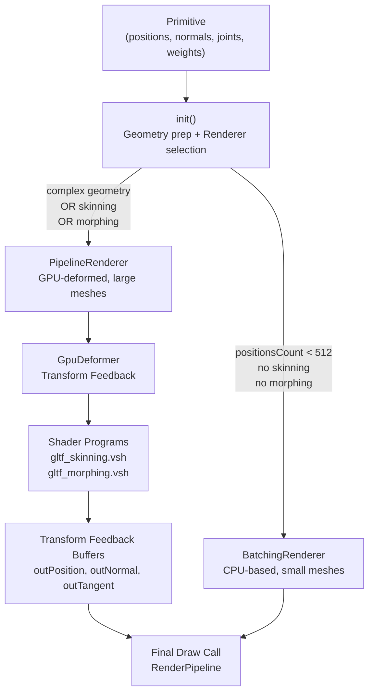
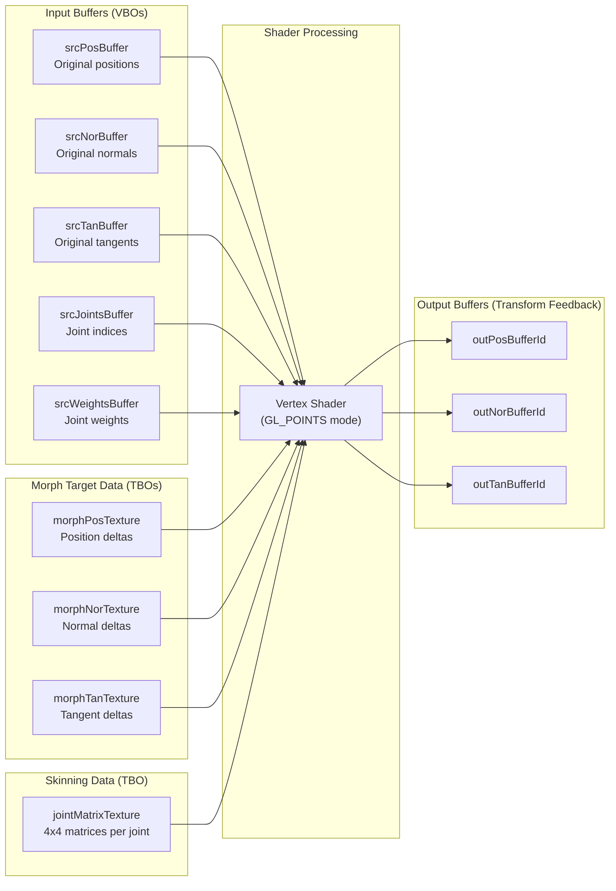
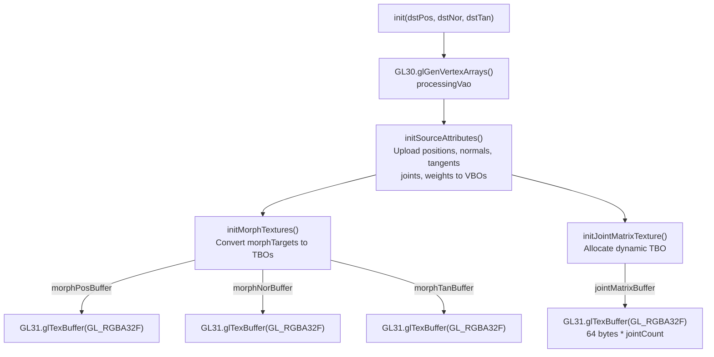
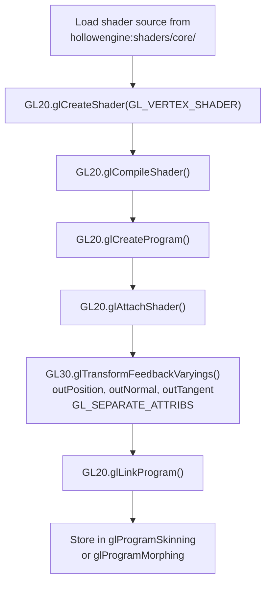
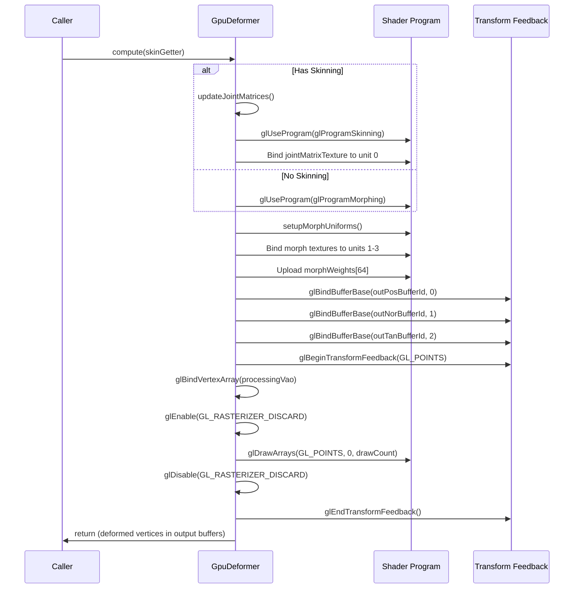
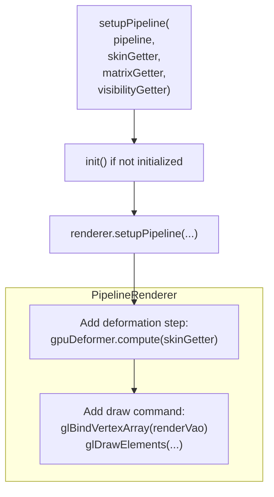
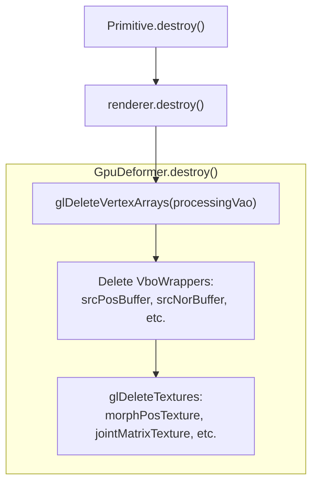

# GPU Rendering Pipeline

<details>
<summary>Relevant source files</summary>

The following files were used as context for generating this wiki page:

- [src/main/java/ru/hollowhorizon/hollowengine/client/models/gltf/GltfModelLoader.kt](src/main/java/ru/hollowhorizon/hollowengine/client/models/gltf/GltfModelLoader.kt)
- [src/main/java/ru/hollowhorizon/hollowengine/client/models/gltf/GltfTexture.kt](src/main/java/ru/hollowhorizon/hollowengine/client/models/gltf/GltfTexture.kt)
- [src/main/java/ru/hollowhorizon/hollowengine/client/models/internal/Primitive.kt](src/main/java/ru/hollowhorizon/hollowengine/client/models/internal/Primitive.kt)
- [src/main/java/ru/hollowhorizon/hollowengine/client/models/internal/manager/HollowModelManager.kt](src/main/java/ru/hollowhorizon/hollowengine/client/models/internal/manager/HollowModelManager.kt)
- [src/main/java/ru/hollowhorizon/hollowengine/client/models/internal/manager/ModelReloadCoordinator.kt](src/main/java/ru/hollowhorizon/hollowengine/client/models/internal/manager/ModelReloadCoordinator.kt)
- [src/main/java/ru/hollowhorizon/hollowengine/client/models/internal/rendering/GpuDeformer.kt](src/main/java/ru/hollowhorizon/hollowengine/client/models/internal/rendering/GpuDeformer.kt)
- [src/main/java/ru/hollowhorizon/hollowengine/client/models/internal/v2/ModelAttachment.kt](src/main/java/ru/hollowhorizon/hollowengine/client/models/internal/v2/ModelAttachment.kt)
- [src/main/java/ru/hollowhorizon/hollowengine/common/items/NpcTool.kt](src/main/java/ru/hollowhorizon/hollowengine/common/items/NpcTool.kt)
- [src/main/java/ru/hollowhorizon/hollowengine/mixins/client/MultiplayerGameModeMixin.java](src/main/java/ru/hollowhorizon/hollowengine/mixins/client/MultiplayerGameModeMixin.java)
- [src/main/resources/assets/hollowengine/shaders/core/gltf_skinning.vsh](src/main/resources/assets/hollowengine/shaders/core/gltf_skinning.vsh)
- [src/test/kotlin/ModelReloadCoordinatorTests.kt](src/test/kotlin/ModelReloadCoordinatorTests.kt)

</details>


## Purpose and Scope

This page documents the GPU-accelerated rendering pipeline used to render 3D models in HollowEngine. The system handles vertex deformation (skinning and morphing) on the GPU using Transform Feedback, manages vertex buffers, and provides two distinct rendering paths optimized for different mesh complexities.

For information about loading and managing 3D models, see [Model Loading](#9.1). For animation playback, see [Animation Integration](#9.5). For the high-level scene graph and model attachment system, see [Scene Graph and Attachments](#9.3).

---

## Architecture Overview

The rendering pipeline transforms model data from CPU-side mesh definitions through GPU-accelerated deformation to final rendered output. The system automatically selects between two rendering strategies based on mesh complexity.

### Pipeline Flow



**Sources:** [src/main/java/ru/hollowhorizon/hollowengine/client/models/internal/Primitive.kt:29-59](), [src/main/java/ru/hollowhorizon/hollowengine/client/models/internal/rendering/GpuDeformer.kt:1-280]()

---

## Dual Rendering Strategy

The `Primitive` class determines which rendering path to use based on mesh characteristics:

| Rendering Path | Selection Criteria | Implementation |
|----------------|-------------------|----------------|
| **Batching** | `positionsCount < 512` AND no skinning AND no morphing | `BatchingRenderer` |
| **Pipeline** | Complex geometry OR skeletal animation OR blend shapes | `PipelineRenderer` |

The batching path is optimized for simple, static meshes where CPU-side processing is negligible. The pipeline path delegates heavy computation to the GPU using Transform Feedback.

**Sources:** [src/main/java/ru/hollowhorizon/hollowengine/client/models/internal/Primitive.kt:25-58]()

---

## GPU Deformation System

### Transform Feedback Architecture

The `GpuDeformer` implements GPU-accelerated vertex deformation using OpenGL Transform Feedback. This technique allows vertex shaders to write computed vertices directly to buffer objects without rasterization.



**Sources:** [src/main/java/ru/hollowhorizon/hollowengine/client/models/internal/rendering/GpuDeformer.kt:13-280]()

### Initialization Process

The deformation system is initialized through several stages:

1. **VAO Setup** - Creates a processing VAO distinct from the rendering VAO ([GpuDeformer.kt:45-58]())
2. **Source Attributes** - Uploads original geometry to VBOs ([GpuDeformer.kt:61-110]())
3. **Morph Textures** - Converts morph target deltas into Texture Buffer Objects ([GpuDeformer.kt:112-163]())
4. **Joint Matrix Texture** - Allocates dynamic TBO for skeletal animation ([GpuDeformer.kt:165-170]())



**Sources:** [src/main/java/ru/hollowhorizon/hollowengine/client/models/internal/rendering/GpuDeformer.kt:39-170]()

---

## Shader Programs

HollowEngine uses two specialized vertex shaders for GPU deformation, compiled and linked during system initialization.

### Skinning Shader

The `gltf_skinning.vsh` shader performs skeletal animation and morph targets in a single pass:

**Input Attributes:**
- `layout(location=0) in vec4 joint` - Joint indices
- `layout(location=1) in vec4 weight` - Joint weights
- `layout(location=2) in vec3 position` - Base position
- `layout(location=3) in vec3 normal` - Base normal
- `layout(location=4) in vec4 tangent` - Base tangent

**Uniforms:**
- `samplerBuffer jointMatrices` - TBO containing joint transformation matrices
- `samplerBuffer morphDeltasPosition/Normal/Tangent` - TBOs containing morph deltas
- `float morphWeights[64]` - Active morph target weights
- `int activeMorphCount` - Number of active morph targets
- `int vertexCount` - Total vertex count

**Output (Transform Feedback):**
- `out vec3 outPosition` - Deformed position
- `out vec3 outNormal` - Deformed normal
- `out vec4 outTangent` - Deformed tangent

**Sources:** [src/main/resources/assets/hollowengine/shaders/core/gltf_skinning.vsh:1-84]()

### Morphing Shader

The `gltf_morphing.vsh` shader handles pure morph target deformation without skeletal influence. It shares the same morph processing logic but skips joint matrix calculations.

**Sources:** [src/main/java/ru/hollowhorizon/hollowengine/client/models/internal/manager/HollowModelManager.kt:151-182]()

### Shader Compilation

Both shaders are compiled and linked during `HollowModelManager.initialize()`:



**Sources:** [src/main/java/ru/hollowhorizon/hollowengine/client/models/internal/manager/HollowModelManager.kt:151-182]()

---

## Deformation Computation

### Execution Flow

The `compute()` method executes the Transform Feedback pass:



**Sources:** [src/main/java/ru/hollowhorizon/hollowengine/client/models/internal/rendering/GpuDeformer.kt:179-215]()

### Joint Matrix Update

For skeletal animation, joint matrices are updated dynamically each frame:

1. Retrieve joint transform matrices via `SkinGetter` callback
2. Flatten 4x4 matrices into a linear float buffer (16 floats per matrix)
3. Upload to `jointMatrixBuffer` using `glBufferSubData`
4. Shader reads matrices via `texelFetch` on `jointMatrixTexture`

**Sources:** [src/main/java/ru/hollowhorizon/hollowengine/client/models/internal/rendering/GpuDeformer.kt:217-230]()

### Morph Target Application

Morph targets are applied by:

1. Storing all morph deltas in contiguous TBOs during initialization
2. Each morph target occupies `vertexCount * 4 floats` (vec4 per vertex)
3. Shader computes: `bufferIndex = (morphTargetIndex * vertexCount) + vertexID`
4. Applies weighted delta: `morphedPos += texelFetch(morphDeltasPosition, bufferIndex).xyz * weight`

**Sources:** [src/main/resources/assets/hollowengine/shaders/core/gltf_skinning.vsh:30-47]()

---

## Buffer Management

### Vertex Buffer Objects (VBOs)

The system uses the `VboWrapper` utility class to manage OpenGL buffer objects:

| Buffer Purpose | Creation Method | Usage |
|----------------|-----------------|-------|
| **Vertex Attributes** | `VboWrapper.createArrayBuffer()` | `GL_ARRAY_BUFFER` for positions, normals, tangents, joints, weights |
| **Morph/Joint Data** | `VboWrapper.createTextureBuffer()` | `GL_TEXTURE_BUFFER` for TBO-backed data |

**Sources:** [src/main/java/ru/hollowhorizon/hollowengine/client/models/internal/rendering/GpuDeformer.kt:16-28](), [src/main/java/ru/hollowhorizon/hollowengine/client/models/internal/rendering/GpuDeformer.kt:61-109]()

### Texture Buffer Objects (TBOs)

TBOs allow shaders to access large amounts of data via `samplerBuffer` uniforms:

1. Create buffer with `VboWrapper.createTextureBuffer()`
2. Upload data to buffer
3. Create texture handle: `glGenTextures()`
4. Bind buffer to texture: `glTexBuffer(GL_TEXTURE_BUFFER, GL_RGBA32F, bufferId)`
5. Bind texture in shader: `glActiveTexture()` + `glBindTexture(GL_TEXTURE_BUFFER)`

**Sources:** [src/main/java/ru/hollowhorizon/hollowengine/client/models/internal/rendering/GpuDeformer.kt:172-177]()

### Memory Management

CPU-side geometry data is released after GPU upload for non-batching meshes:

```kotlin
private fun releaseCpu() {
    if (!useBatching) {
        positions = null
        normals = null
        texCoords = null
        // ... etc
    }
}
```

This optimization reduces memory footprint since GPU buffers contain the authoritative data.

**Sources:** [src/main/java/ru/hollowhorizon/hollowengine/client/models/internal/Primitive.kt:75-85]()

---

## Integration with Model System

### Pipeline Setup

The `Primitive.setupPipeline()` method integrates deformation with the rendering pipeline:



**Sources:** [src/main/java/ru/hollowhorizon/hollowengine/client/models/internal/Primitive.kt:61-69]()

### Callback System

Three functional interfaces provide runtime data:

| Callback | Type | Purpose |
|----------|------|---------|
| `MatrixGetter` | `() -> Mat4f` | Node transformation matrix for this primitive |
| `SkinGetter` | `() -> Array<Mat4f>` | Joint transformation matrices for skeletal animation |
| `VisibilityGetter` | `() -> Boolean` | Culling flag to skip rendering |

**Sources:** [src/main/java/ru/hollowhorizon/hollowengine/client/models/internal/Primitive.kt:102-104]()

### Frame Update Loop

The `ModelAttachment.update()` method drives per-frame updates:

1. Reset all node transforms to base state
2. Execute `onUpdate` callbacks for custom logic
3. Apply animation controllers to update transforms
4. Rendering pipeline automatically invokes deformers before draw calls

**Sources:** [src/main/java/ru/hollowhorizon/hollowengine/client/models/internal/v2/ModelAttachment.kt:86-101](), [src/main/java/ru/hollowhorizon/hollowengine/client/models/internal/v2/ModelAttachment.kt:103-107]()

---

## Resource Lifecycle

### Initialization

Resources are allocated lazily when the primitive is first rendered:

1. `Primitive.init()` called on first `setupPipeline()`
2. Geometry processing (normal/tangent calculation if missing)
3. Renderer instantiation (`BatchingRenderer` or `PipelineRenderer`)
4. `renderer.init()` allocates GPU resources
5. CPU data released for pipeline-rendered meshes

**Sources:** [src/main/java/ru/hollowhorizon/hollowengine/client/models/internal/Primitive.kt:37-59]()

### Cleanup

Resources are released via `Primitive.destroy()`:



This cleanup is triggered during hot reload when models are swapped or when models are permanently unloaded.

**Sources:** [src/main/java/ru/hollowhorizon/hollowengine/client/models/internal/Primitive.kt:71-73](), [src/main/java/ru/hollowhorizon/hollowengine/client/models/internal/rendering/GpuDeformer.kt:261-279]()

---

## Performance Characteristics

### Batching Path

- **Best for:** Small, static meshes (<512 vertices)
- **CPU overhead:** Minimal geometry processing
- **GPU overhead:** Simple draw calls
- **Memory:** Retains CPU-side geometry data

### Pipeline Path

- **Best for:** Large meshes, skinned models, morph targets
- **CPU overhead:** Matrix calculations only
- **GPU overhead:** Transform Feedback pass + draw call
- **Memory:** CPU data released, relies on GPU buffers

The automatic selection ensures optimal performance across diverse content types without manual configuration.

**Sources:** [src/main/java/ru/hollowhorizon/hollowengine/client/models/internal/Primitive.kt:29-58]()