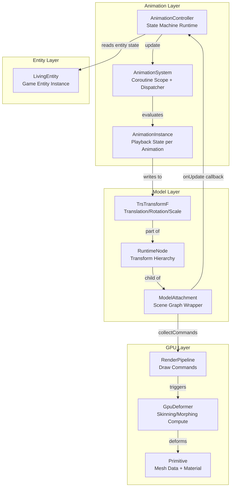
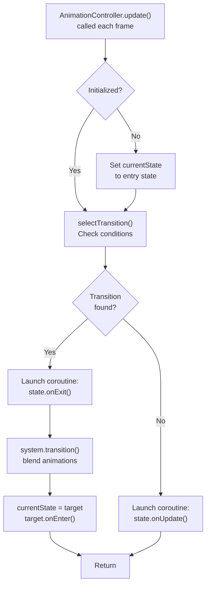
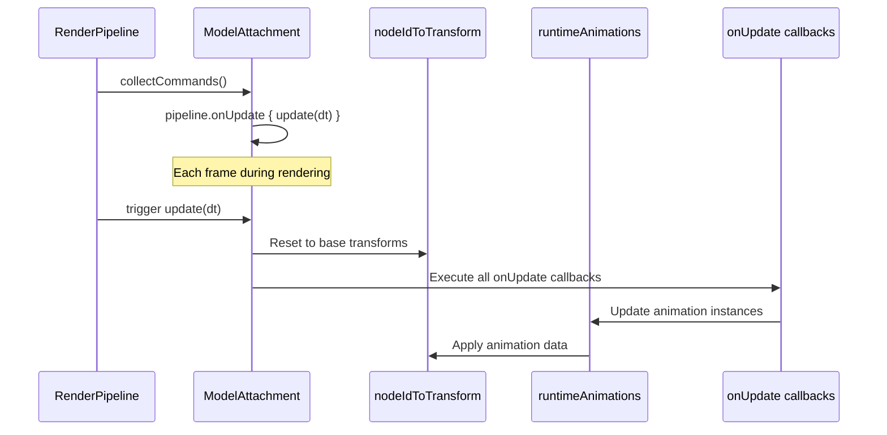
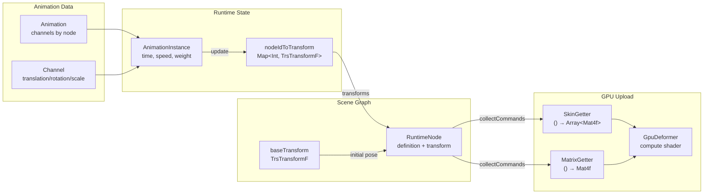
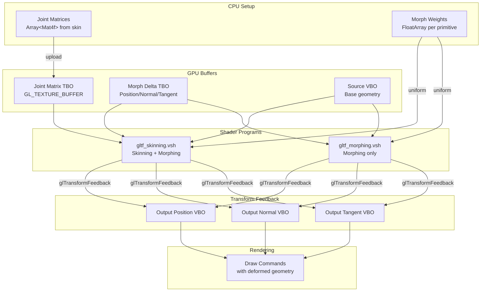
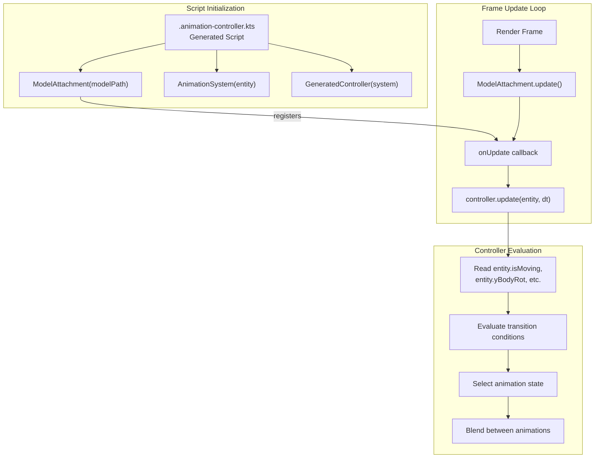
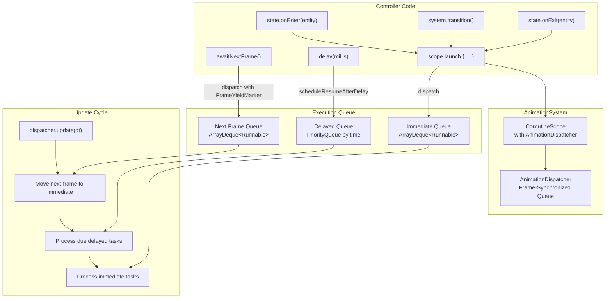
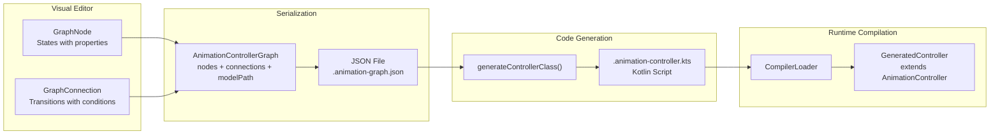

# Animation Integration

<details>
<summary>Relevant source files</summary>

The following files were used as context for generating this wiki page:

- [src/main/java/ru/hollowhorizon/hollowengine/client/gui/animations/Graph.kt](src/main/java/ru/hollowhorizon/hollowengine/client/gui/animations/Graph.kt)
- [src/main/java/ru/hollowhorizon/hollowengine/client/gui/animations/GraphEditor.kt](src/main/java/ru/hollowhorizon/hollowengine/client/gui/animations/GraphEditor.kt)
- [src/main/java/ru/hollowhorizon/hollowengine/client/gui/colors/ColorTheme.kt](src/main/java/ru/hollowhorizon/hollowengine/client/gui/colors/ColorTheme.kt)
- [src/main/java/ru/hollowhorizon/hollowengine/client/gui/scripting/files/animations/AnimationControllerFile.kt](src/main/java/ru/hollowhorizon/hollowengine/client/gui/scripting/files/animations/AnimationControllerFile.kt)
- [src/main/java/ru/hollowhorizon/hollowengine/client/gui/scripting/titlebar/ComboBox.kt](src/main/java/ru/hollowhorizon/hollowengine/client/gui/scripting/titlebar/ComboBox.kt)
- [src/main/java/ru/hollowhorizon/hollowengine/client/models/gltf/GltfModelLoader.kt](src/main/java/ru/hollowhorizon/hollowengine/client/models/gltf/GltfModelLoader.kt)
- [src/main/java/ru/hollowhorizon/hollowengine/client/models/gltf/GltfTexture.kt](src/main/java/ru/hollowhorizon/hollowengine/client/models/gltf/GltfTexture.kt)
- [src/main/java/ru/hollowhorizon/hollowengine/client/models/internal/Primitive.kt](src/main/java/ru/hollowhorizon/hollowengine/client/models/internal/Primitive.kt)
- [src/main/java/ru/hollowhorizon/hollowengine/client/models/internal/controller/AnimControllerDSL.kt](src/main/java/ru/hollowhorizon/hollowengine/client/models/internal/controller/AnimControllerDSL.kt)
- [src/main/java/ru/hollowhorizon/hollowengine/client/models/internal/controller/AnimationController.kt](src/main/java/ru/hollowhorizon/hollowengine/client/models/internal/controller/AnimationController.kt)
- [src/main/java/ru/hollowhorizon/hollowengine/client/models/internal/controller/AnimationDispatcher.kt](src/main/java/ru/hollowhorizon/hollowengine/client/models/internal/controller/AnimationDispatcher.kt)
- [src/main/java/ru/hollowhorizon/hollowengine/client/models/internal/controller/EntityUtils.kt](src/main/java/ru/hollowhorizon/hollowengine/client/models/internal/controller/EntityUtils.kt)
- [src/main/java/ru/hollowhorizon/hollowengine/client/models/internal/manager/HollowModelManager.kt](src/main/java/ru/hollowhorizon/hollowengine/client/models/internal/manager/HollowModelManager.kt)
- [src/main/java/ru/hollowhorizon/hollowengine/client/models/internal/manager/ModelReloadCoordinator.kt](src/main/java/ru/hollowhorizon/hollowengine/client/models/internal/manager/ModelReloadCoordinator.kt)
- [src/main/java/ru/hollowhorizon/hollowengine/client/models/internal/rendering/GpuDeformer.kt](src/main/java/ru/hollowhorizon/hollowengine/client/models/internal/rendering/GpuDeformer.kt)
- [src/main/java/ru/hollowhorizon/hollowengine/client/models/internal/v2/ModelAttachment.kt](src/main/java/ru/hollowhorizon/hollowengine/client/models/internal/v2/ModelAttachment.kt)
- [src/main/java/ru/hollowhorizon/hollowengine/common/items/NpcTool.kt](src/main/java/ru/hollowhorizon/hollowengine/common/items/NpcTool.kt)
- [src/main/java/ru/hollowhorizon/hollowengine/common/scripting/CompilerLoader.kt](src/main/java/ru/hollowhorizon/hollowengine/common/scripting/CompilerLoader.kt)
- [src/main/java/ru/hollowhorizon/hollowengine/mixins/client/MultiplayerGameModeMixin.java](src/main/java/ru/hollowhorizon/hollowengine/mixins/client/MultiplayerGameModeMixin.java)
- [src/main/resources/assets/hollowengine/shaders/core/gltf_skinning.vsh](src/main/resources/assets/hollowengine/shaders/core/gltf_skinning.vsh)
- [src/test/kotlin/ModelReloadCoordinatorTests.kt](src/test/kotlin/ModelReloadCoordinatorTests.kt)

</details>


## Purpose and Scope

This page documents how **AnimationController** instances integrate with the 3D model system to produce animated entities in the game. It covers the runtime execution of animation state machines, their connection to `ModelAttachment`, transform updates, and GPU-accelerated deformation.

For information about creating animation graphs visually, see [Animation System Overview](#8.1). For details about model loading and structure, see [Model Data Structure](#9.2). For the animation state machine DSL, see [Animation Controller DSL](#8.5).

---

## Architecture Overview

The animation integration system connects three major components: animation controllers (state machines), model attachments (scene graphs with transforms), and GPU deformation (skinning/morphing).

**Component Relationship Diagram**



**Sources:**
- [src/main/java/ru/hollowhorizon/hollowengine/client/models/internal/controller/AnimationController.kt:1-196]()
- [src/main/java/ru/hollowhorizon/hollowengine/client/models/internal/v2/ModelAttachment.kt:1-127]()
- [src/main/java/ru/hollowhorizon/hollowengine/client/models/internal/rendering/GpuDeformer.kt:1-281]()

---

## Animation Controller Runtime

The `AnimationController` class evaluates a state machine on each frame, selecting transitions based on conditions and updating the current animation state. Generated Kotlin scripts extend this base class.

### Controller Execution Flow



**Key Classes and Methods:**

| Class/Method | File Location | Purpose |
|--------------|---------------|---------|
| `AnimationController` | [AnimationController.kt:6]() | Base class for state machine controllers |
| `AnimationController.update()` | [AnimationController.kt:147-175]() | Frame update entry point |
| `AnimationController.selectTransition()` | [AnimationController.kt:177-195]() | Evaluates transition conditions |
| `AnimationController.State` | [AnimationController.kt:13-26]() | State definition with animation name, callbacks |
| `AnimationController.Transition` | [AnimationController.kt:28-37]() | Transition with condition lambda |

**Sources:**
- [src/main/java/ru/hollowhorizon/hollowengine/client/models/internal/controller/AnimationController.kt:6-196]()

---

## Model Attachment Integration

`ModelAttachment` manages the runtime scene graph and animation playback. It provides an `onUpdate` callback mechanism where animation controllers register themselves to receive frame updates.

### Attachment Update Cycle



**Integration Points:**

The attachment exposes:
- `nodes` property → List of `RuntimeNode` (scene hierarchy)
- `animations` property → `Animations` collection (animation instances by name)
- `onUpdate()` method → Register update callbacks

Controllers call `onUpdate` to register themselves:

```kotlin
// In generated .animation-controller.kts script
val attachment = ModelAttachment("path/to/model.gltf")
val controller = GeneratedController(AnimationSystem(...))

attachment.onUpdate {
    controller.update(entity, deltaTime)
}
```

**Sources:**
- [src/main/java/ru/hollowhorizon/hollowengine/client/models/internal/v2/ModelAttachment.kt:59-63]()
- [src/main/java/ru/hollowhorizon/hollowengine/client/models/internal/v2/ModelAttachment.kt:86-101]()
- [src/main/java/ru/hollowhorizon/hollowengine/client/models/internal/v2/ModelAttachment.kt:103-107]()

---

## Transform Update Pipeline

Animation data flows from controller evaluation through `AnimationInstance` playback to transform application. The pipeline supports skeletal animation (skinning) and blend shapes (morphing).

### Transform Application Diagram



**Transform Update Process:**

1. **Reset Phase** ([ModelAttachment.kt:86-94]()): All transforms reset to `baseTransform` from node definitions
2. **Animation Phase** ([ModelAttachment.kt:98-100]()): Each `AnimationInstance.update()` writes to `nodeIdToTransform` map
3. **Callback Phase** ([ModelAttachment.kt:96]()): User-registered callbacks execute (including controllers)
4. **Deformation Phase** ([GpuDeformer.kt:179-215]()): GPU shaders apply skeletal deformation

**Sources:**
- [src/main/java/ru/hollowhorizon/hollowengine/client/models/internal/v2/ModelAttachment.kt:86-101]()
- [src/main/java/ru/hollowhorizon/hollowengine/client/models/internal/Primitive.kt:61-69]()

---

## GPU Deformation

Skeletal animation (skinning) and blend shapes (morph targets) are computed on the GPU using Transform Feedback to avoid CPU bottlenecks with high polygon models.

### Deformation Pipeline



**Skinning Shader Process** ([gltf_skinning.vsh:22-84]()):

1. **Morphing**: Apply morph target deltas weighted by `morphWeights[i]`
2. **Skin Matrix Construction**: Blend 4 joint matrices using joint indices and weights
3. **Transform**: Apply skin matrix to morphed position/normal/tangent
4. **Output**: Write to Transform Feedback buffers

**Key Deformer Methods:**

| Method | File Location | Purpose |
|--------|---------------|---------|
| `GpuDeformer.init()` | [GpuDeformer.kt:39-59]() | Create VAO, VBOs, TBOs, textures |
| `GpuDeformer.compute()` | [GpuDeformer.kt:179-215]() | Execute shader with Transform Feedback |
| `GpuDeformer.updateJointMatrices()` | [GpuDeformer.kt:217-230]() | Upload joint matrices from SkinGetter |
| `GpuDeformer.setupMorphUniforms()` | [GpuDeformer.kt:232-259]() | Bind morph TBOs and upload weights |

**Sources:**
- [src/main/java/ru/hollowhorizon/hollowengine/client/models/internal/rendering/GpuDeformer.kt:13-281]()
- [src/main/resources/assets/hollowengine/shaders/core/gltf_skinning.vsh:1-84]()

---

## Entity Integration

Animation controllers are typically attached to `LivingEntity` instances to drive NPC animations based on movement, state, and game logic.

### Entity Attachment Pattern



**Common Entity Properties Used:**

- `entity.isMoving` ([EntityUtils.kt:11]()) - Movement detection via delta position
- `entity.yBodyRot` ([EntityUtils.kt:18]()) - Body rotation for directional animations
- `entity.deltaMovement` ([EntityUtils.kt:14]()) - Velocity vector
- Entity data components via Geary ECS

**Example Controller Pattern:**

```kotlin
// Generated from visual graph editor
configure {
    state(
        name = "Idle",
        animationName = "idle",
        wrapMode = WrapMode.Loop,
        speed = 1f
    )
    
    state(
        name = "Walk",
        animationName = "walk",
        wrapMode = WrapMode.Loop,
        speed = 1f
    )
    
    entry("Idle")
    
    transition(
        fromState = "Idle",
        toState = "Walk",
        duration = 0.25f,
        condition = { this.isMoving }  // 'this' is LivingEntity
    )
    
    transition(
        fromState = "Walk",
        toState = "Idle",
        duration = 0.25f,
        condition = { !this.isMoving }
    )
}
```

**Sources:**
- [src/main/java/ru/hollowhorizon/hollowengine/client/models/internal/controller/AnimationController.kt:147-175]()
- [src/main/java/ru/hollowhorizon/hollowengine/client/models/internal/controller/EntityUtils.kt:1-27]()
- [src/main/java/ru/hollowhorizon/hollowengine/client/gui/scripting/files/animations/AnimationControllerFile.kt:83-241]()

---

## Coroutine-Based Execution

Animation controllers use a custom coroutine dispatcher (`AnimationDispatcher`) to enable async state transitions, delays, and frame-synchronized operations without blocking the render thread.

### Dispatcher Architecture



**Dispatcher Features:**

| Feature | Implementation | Purpose |
|---------|----------------|---------|
| Frame sync | `awaitNextFrame()` ([AnimationDispatcher.kt:41-45]()) | Suspend until next render frame |
| Delays | `scheduleResumeAfterDelay()` ([AnimationDispatcher.kt:50-64]()) | Suspend for specific duration |
| Priority queue | `delayedQueue` ([AnimationDispatcher.kt:27]()) | Process delayed tasks in order |
| Frame marker | `FrameYieldMarker` context element ([AnimationDispatcher.kt:112-115]()) | Route to next-frame queue |

**Usage in Controllers:**

```kotlin
// In AnimationController subclass
override fun update(entity: LivingEntity, dt: Float) {
    super.update(entity, dt)  // Evaluates state machine
    
    // State callbacks run in coroutine context:
    state(
        name = "Attack",
        animationName = "attack",
        onEnter = { entity ->
            // This runs asynchronously
            delay(500)  // Wait 500ms
            entity.attack()
            awaitNextFrame()  // Wait for next render frame
            entity.damageTarget()
        }
    )
}
```

**Sources:**
- [src/main/java/ru/hollowhorizon/hollowengine/client/models/internal/controller/AnimationDispatcher.kt:1-116]()
- [src/main/java/ru/hollowhorizon/hollowengine/client/models/internal/controller/AnimationController.kt:159-168]()

---

## Code Generation from Visual Editor

The visual graph editor ([GraphEditor.kt]()) produces serialized JSON graphs which are converted into executable Kotlin scripts by `AnimationControllerFile`.

### Generation Process



**Generated Script Structure:**

1. **Imports** ([AnimationControllerFile.kt:213-216]()): Standard animation system imports
2. **Documentation** ([AnimationControllerFile.kt:218-228]()): Auto-generated comments with state/transition counts
3. **Configuration Block** ([AnimationControllerFile.kt:229]()): `configure { ... }` DSL call
4. **State Definitions** ([AnimationControllerFile.kt:99-123]()): Convert nodes to `state()` calls
5. **Entry Transitions** ([AnimationControllerFile.kt:125-139]()): Define initial state via `entry()`
6. **Any-State Transitions** ([AnimationControllerFile.kt:141-160]()): Global transitions via `any()`
7. **State Transitions** ([AnimationControllerFile.kt:162-185]()): State-to-state via `transition()`

**Muted Transition Handling:**

Connections with `properties.mute == true` are excluded from code generation but counted in statistics ([AnimationControllerFile.kt:206]()). This allows disabling transitions without deleting them from the graph.

**Sources:**
- [src/main/java/ru/hollowhorizon/hollowengine/client/gui/scripting/files/animations/AnimationControllerFile.kt:83-241]()
- [src/main/java/ru/hollowhorizon/hollowengine/client/gui/animations/Graph.kt:42-58]()
- [src/main/java/ru/hollowhorizon/hollowengine/common/scripting/CompilerLoader.kt:34-42]()

---

## Hot Reload Support

Animation controllers and models support hot reloading during development. The `ModelReloadCoordinator` manages atomic swapping of model instances while preserving controller state.

### Reload Coordination

```mermaid
sequenceDiagram
    participant RP as Resource Pack Reload
    participant Mgr as HollowModelManager
    participant Flow as MutableStateFlow&lt;AnimatedModel&gt;
    participant Attach as ModelAttachment
    participant Coord as ModelReloadCoordinator
    participant Old as Old Model
    participant New as New Model
    
    RP->>Mgr: Resource pack reload triggered
    Mgr->>Mgr: prepare() - Load all indexed models
    Mgr->>Flow: Prepare new AnimatedModel
    
    Mgr->>Coord: resolveSwap(current, prepared, empty)
    Coord->>Coord: Check if model changed
    
    alt Model Changed
        Coord-->>Mgr: ModelSwap(next=New, retired=Old)
        Mgr->>Flow: flow.value = New
        Mgr->>Old: destroyLater() on render thread
    else Model Same or Failed
        Coord-->>Mgr: ModelSwap(next=Current, retired=null)
    end
    
    Flow->>Attach: onEach { ensureCompiled(it) }
    Attach->>Attach: Rebuild runtimeNodes, animations
    Attach->>Attach: Recompile renderPipeline
```

**Reload Mechanisms:**

| Component | Behavior | File Reference |
|-----------|----------|----------------|
| `StateFlow<AnimatedModel>` | Observers react to value changes | [ModelAttachment.kt:21-46]() |
| `ensureCompiled()` | Atomic rebuild of scene graph | [ModelAttachment.kt:65-84]() |
| `compiledFor` reference check | Prevents redundant recompilation | [ModelAttachment.kt:30-31]() |
| `destroyLater()` | GPU cleanup on render thread | [HollowModelManager.kt:143-149]() |

**Controller State Preservation:**

Controllers maintain their `currentState` across model reloads because they exist independently of the model structure. Only the animation data (channels, timings) is replaced.

**Sources:**
- [src/main/java/ru/hollowhorizon/hollowengine/client/models/internal/v2/ModelAttachment.kt:44-46]()
- [src/main/java/ru/hollowhorizon/hollowengine/client/models/internal/manager/HollowModelManager.kt:106-118]()
- [src/main/java/ru/hollowhorizon/hollowengine/client/models/internal/manager/ModelReloadCoordinator.kt:24-43]()

---

## Performance Considerations

The animation integration system is designed for high-performance rendering of many animated entities:

**Optimization Strategies:**

1. **GPU Deformation** ([GpuDeformer.kt:179-215]()): Skinning and morphing computed on GPU via Transform Feedback
2. **Batching Small Meshes** ([Primitive.kt:29]()): Primitives with <512 vertices skip GPU deformation and use CPU batching
3. **CPU Data Release** ([Primitive.kt:75-85]()): Vertex data freed after GPU upload for non-batched meshes
4. **Lazy Compilation** ([ModelAttachment.kt:65-84]()): Scene graph compiled only when model changes
5. **Shader Reuse** ([HollowModelManager.kt:151-182]()): Skinning/morphing shaders initialized once globally
6. **Instanced Animations** ([AnimationInstance]()): Multiple entities can share animation definitions

**Memory Layout:**

- **Morph Deltas**: Packed as 4-component float vectors in TBO ([GpuDeformer.kt:117-147]())
- **Joint Matrices**: 4×4 matrices in TBO, indexed by joint IDs ([GpuDeformer.kt:165-169]())
- **Transform Maps**: `Map<Int, TrsTransformF>` for O(1) node lookup ([ModelAttachment.kt:28]())

**Sources:**
- [src/main/java/ru/hollowhorizon/hollowengine/client/models/internal/Primitive.kt:29-59]()
- [src/main/java/ru/hollowhorizon/hollowengine/client/models/internal/rendering/GpuDeformer.kt:112-163]()
- [src/main/java/ru/hollowhorizon/hollowengine/client/models/internal/v2/ModelAttachment.kt:65-84]()